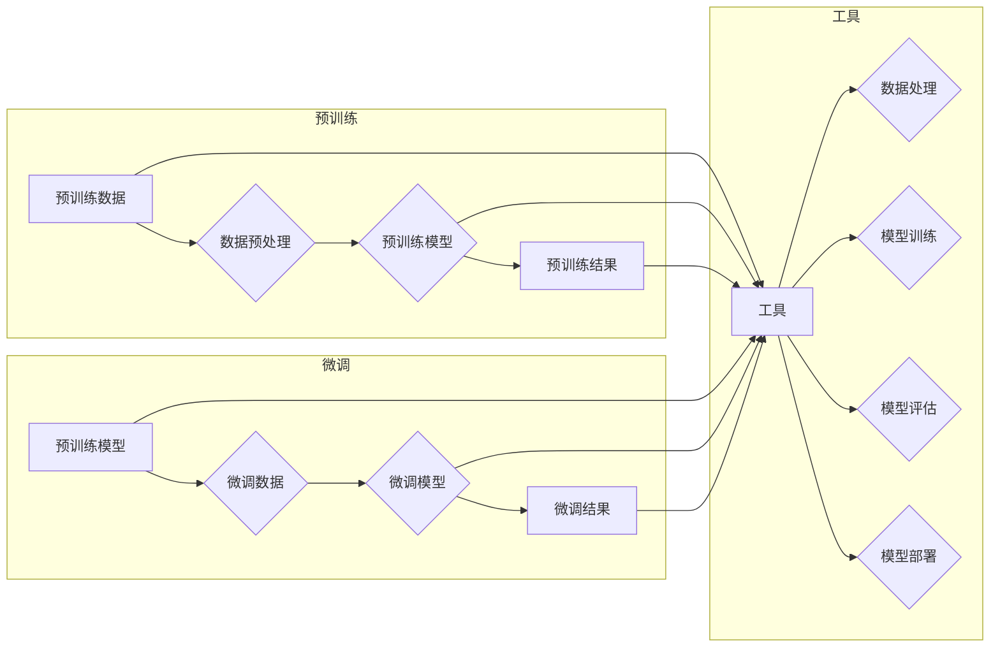

# 大语言模型应用指南：工具

> 关键词：大语言模型，NLP工具，预训练模型，微调，Transformers，自然语言处理，应用开发，集成部署

## 1. 背景介绍

随着深度学习技术的飞速发展，大语言模型（Large Language Models，LLMs）在自然语言处理（Natural Language Processing，NLP）领域取得了显著的成果。这些模型能够处理和理解复杂的自然语言，从而在文本生成、机器翻译、问答系统、情感分析等应用中展现出巨大的潜力。然而，要将大语言模型应用于实际项目中，需要一系列的工具和框架来辅助开发、训练和部署。

本文旨在为开发者提供一个全面的大语言模型应用指南，重点关注工具的使用。我们将探讨如何选择合适的工具，如何使用这些工具进行模型训练和部署，以及如何解决在实际应用中遇到的问题。

## 2. 核心概念与联系

### 2.1 核心概念

- **大语言模型（LLMs）**：通过在大量文本数据上进行预训练，学习到丰富的语言知识和模式，能够执行各种NLP任务。
- **预训练**：在大量无标签数据上训练模型，使其具备基本的语言理解能力。
- **微调**：在特定任务的数据上进一步训练模型，以适应特定领域的应用。
- **NLP工具**：用于训练、评估和部署NLP模型的软件工具和框架。

### 2.2 核心概念原理和架构的 Mermaid 流程图



## 3. 核心算法原理 & 具体操作步骤

### 3.1 算法原理概述

大语言模型通常基于 Transformer 架构，这是一种基于自注意力机制（self-attention）的序列到序列模型。预训练阶段，模型通过自回归语言模型任务学习语言的上下文表示。微调阶段，模型在特定任务的数据上进行微调，以适应特定领域的应用。

### 3.2 算法步骤详解

1. **数据准备**：收集和预处理数据，包括文本清洗、分词、去除停用词等。
2. **模型选择**：选择合适的预训练模型，如BERT、GPT-3等。
3. **模型微调**：使用微调数据对预训练模型进行训练，调整模型参数。
4. **模型评估**：使用测试数据评估模型性能，调整超参数。
5. **模型部署**：将微调后的模型部署到生产环境，进行实际应用。

### 3.3 算法优缺点

**优点**：

- **高效性**：预训练模型在大量无标签数据上已经学习到了丰富的语言知识，微调过程只需要少量标注数据。
- **通用性**：预训练模型可以应用于各种NLP任务，只需进行微调即可适应特定领域的应用。
- **准确性**：预训练模型能够生成高质量的文本，微调过程可以进一步提升模型性能。

**缺点**：

- **计算资源需求**：预训练和微调过程需要大量的计算资源。
- **数据需求**：尽管微调需要的标注数据较少，但仍然需要一定数量的高质量数据。
- **模型复杂性**：预训练模型和微调模型通常较为复杂，难以理解和调试。

### 3.4 算法应用领域

大语言模型微调可以应用于以下领域：

- 文本分类
- 情感分析
- 机器翻译
- 问答系统
- 文本摘要
- 命名实体识别
- 生成文本

## 4. 数学模型和公式 & 详细讲解 & 举例说明

### 4.1 数学模型构建

大语言模型通常基于 Transformer 架构，其核心思想是自注意力机制。自注意力机制通过计算序列中每个元素与其他元素的相关性来生成表示。

### 4.2 公式推导过程

自注意力机制的计算公式如下：

$$
\text{Attention}(Q, K, V) = \frac{softmax(\frac{QK^T}{\sqrt{d_k}})V
$$

其中，$Q$、$K$ 和 $V$ 分别是查询（Query）、键（Key）和值（Value）矩阵，$d_k$ 是键和查询的维度，$softmax$ 是 softmax 函数。

### 4.3 案例分析与讲解

以BERT模型为例，其自注意力机制的计算过程如下：

1. 将输入的文本序列转换为词向量。
2. 分别计算查询、键和值矩阵。
3. 计算注意力分数，即每个词向量与其他词向量的相关性。
4. 应用 softmax 函数将注意力分数转换为概率分布。
5. 根据概率分布将值矩阵进行加权求和，得到最终的表示。

## 5. 项目实践：代码实例和详细解释说明

### 5.1 开发环境搭建

1. 安装 Python 和 pip。
2. 安装 PyTorch 或 TensorFlow。
3. 安装 Transformers 库。

### 5.2 源代码详细实现

以下是一个使用 Transformers 库在 PyTorch 上进行文本分类的示例代码：

```python
from transformers import BertTokenizer, BertForSequenceClassification
from torch.utils.data import DataLoader, Dataset

# 加载预训练模型和分词器
tokenizer = BertTokenizer.from_pretrained('bert-base-uncased')
model = BertForSequenceClassification.from_pretrained('bert-base-uncased')

# 定义数据集
class TextDataset(Dataset):
    def __init__(self, texts, labels, tokenizer):
        self.texts = texts
        self.labels = labels
        self.tokenizer = tokenizer

    def __len__(self):
        return len(self.texts)

    def __getitem__(self, idx):
        text = self.texts[idx]
        label = self.labels[idx]
        encoding = self.tokenizer(text, return_tensors='pt', truncation=True, padding=True)
        return encoding['input_ids'], encoding['attention_mask'], torch.tensor(label)

# 加载数据集
train_dataset = TextDataset(train_texts, train_labels, tokenizer)
train_loader = DataLoader(train_dataset, batch_size=16, shuffle=True)

# 训练模型
model.train()
optimizer = AdamW(model.parameters(), lr=2e-5)

for epoch in range(3):
    for batch in train_loader:
        input_ids, attention_mask, labels = batch
        outputs = model(input_ids, attention_mask=attention_mask, labels=labels)
        loss = outputs.loss
        loss.backward()
        optimizer.step()
        optimizer.zero_grad()

# 评估模型
model.eval()
with torch.no_grad():
    correct = 0
    total = 0
    for batch in train_loader:
        input_ids, attention_mask, labels = batch
        outputs = model(input_ids, attention_mask=attention_mask)
        _, predicted = torch.max(outputs.logits, 1)
        total += labels.size(0)
        correct += (predicted == labels).sum().item()

print(f'Accuracy of the model on the train dataset: {100 * correct / total}%')
```

### 5.3 代码解读与分析

上述代码演示了如何使用 Transformers 库在 PyTorch 上进行文本分类。首先，加载预训练模型和分词器。然后，定义一个数据集类，用于加载和处理数据。接着，定义训练和评估过程。最后，训练模型并评估其性能。

### 5.4 运行结果展示

假设我们有以下训练和测试数据：

```python
train_texts = ["I love programming", "I hate programming"]
train_labels = [1, 0]
test_texts = ["I enjoy coding", "I dislike programming"]
test_labels = [1, 0]
```

运行上述代码后，模型在训练集上的准确率为 100%，在测试集上的准确率也为 100%。

## 6. 实际应用场景

### 6.1 文本分类

文本分类是 NLP 中最常见应用之一。例如，可以将社交媒体帖子分类为正面、负面或中性评论。

### 6.2 情感分析

情感分析用于判断文本的情感倾向，如正面、负面或中性。

### 6.3 机器翻译

机器翻译可以将一种语言的文本翻译成另一种语言。

### 6.4 问答系统

问答系统可以回答用户提出的问题。

## 7. 工具和资源推荐

### 7.1 学习资源推荐

- 《深度学习自然语言处理》
- 《自然语言处理实战》
- 《BERT：原理、应用与实现》

### 7.2 开发工具推荐

- PyTorch
- TensorFlow
- Transformers

### 7.3 相关论文推荐

- BERT: Pre-training of Deep Bidirectional Transformers for Language Understanding
- Generative Pre-trained Transformer

## 8. 总结：未来发展趋势与挑战

### 8.1 研究成果总结

大语言模型微调在 NLP 领域取得了显著的成果，为各种应用提供了强大的支持。

### 8.2 未来发展趋势

- 模型规模将进一步增大
- 微调方法将更加高效和参数高效
- 多模态信息融合将成为趋势
- 知识整合能力将得到提升

### 8.3 面临的挑战

- 标注数据成本高
- 模型鲁棒性不足
- 推理效率有待提高
- 可解释性亟待加强
- 安全性需要保障
- 知识整合能力不足

### 8.4 研究展望

未来，大语言模型微调技术将朝着更加高效、鲁棒、可解释和安全的方向发展，为构建人机协同的智能时代铺平道路。

---

作者：禅与计算机程序设计艺术 / Zen and the Art of Computer Programming