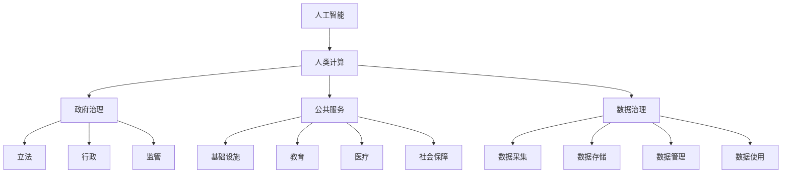
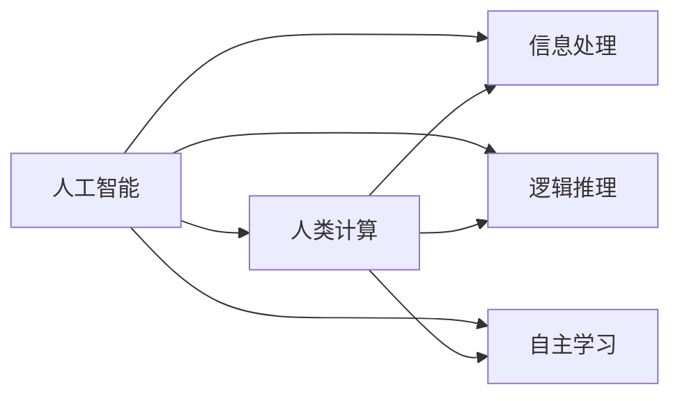
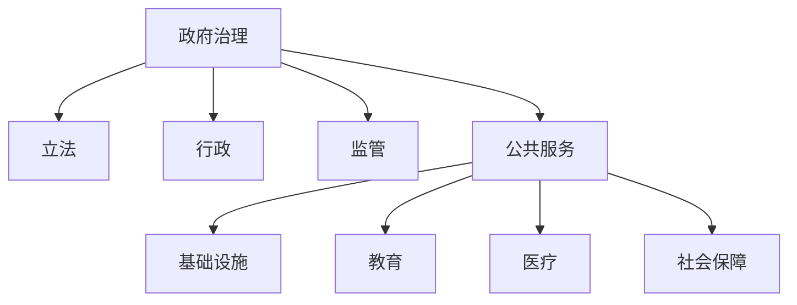
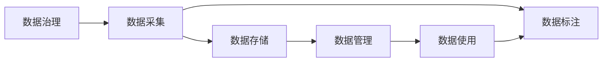
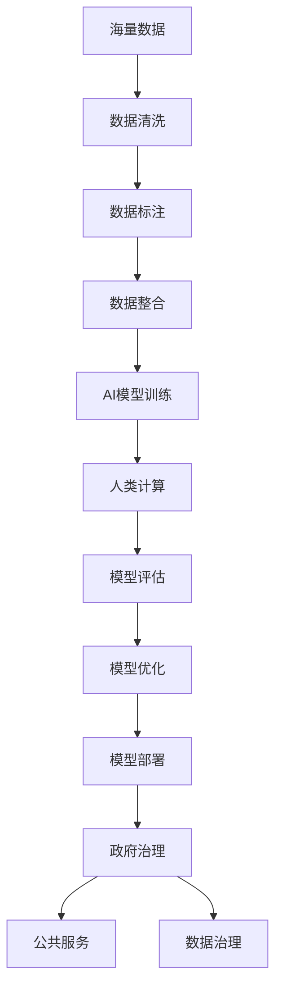

                 

# AI驱动的创新：人类计算在政府中的应用场景

> 关键词：人工智能,人类计算,政府治理,创新应用,政策分析,精准扶贫,智能交通,大数据

## 1. 背景介绍

### 1.1 问题由来
随着信息技术的迅猛发展，人类社会已进入智能时代。政府作为社会管理和公共服务的核心机构，如何利用先进技术提升治理能力，优化公共服务，保障公民权益，成为了当今世界各国面临的重要课题。

人工智能（AI）作为一种前沿技术，已经在许多领域展现出巨大的应用潜力。政府作为公共服务的提供者和监管者，如何借助AI技术进行创新应用，提升公共服务的智能化、精准化、个性化水平，成为了众多研究者和实践者的共同追求。

### 1.2 问题核心关键点
政府AI应用的核心在于人类计算能力的充分发挥。具体而言，需要关注以下几个关键点：

- 数据集的高质量和高完整性：政府数据集往往具有广泛性和复杂性，需要清洗、标注、整合，以确保数据的质量和可用性。
- 算法的可靠性和鲁棒性：AI算法在实际应用中必须具备高度的可靠性和鲁棒性，以应对复杂的现实场景和异常数据。
- 系统的安全性和隐私保护：政府应用必须遵循严格的隐私保护和数据安全规定，确保算法的合法合规使用。
- 算力的高效和经济性：AI应用需要高效的算力支持，同时还要考虑算力的经济成本，确保算力投入能够带来显著的收益。
- 应用的透明度和可解释性：政府AI应用需要具备高度的透明度和可解释性，确保决策过程和结果能够被公众理解和接受。

### 1.3 问题研究意义
政府AI应用的深入研究，对于推动智能化公共服务体系建设，提升政府治理能力和服务效率，具有重要意义：

1. 提高治理能力：AI技术可以帮助政府精准分析海量数据，进行趋势预测、风险预警，辅助决策。
2. 优化公共服务：AI可以个性化定制公共服务，实现精准扶贫、智能交通、环境监测等，提升服务质量。
3. 保障公民权益：AI技术可以通过数据分析，及时发现社会问题，制定政策措施，保护公民权益。
4. 促进社会和谐：AI技术的应用，可以促进资源的合理分配，减少社会矛盾，推动社会和谐发展。
5. 推动产业发展：政府AI应用的广泛推广，可以带动AI技术及相关产业的发展，促进经济增长。

## 2. 核心概念与联系

### 2.1 核心概念概述

为更好地理解人类计算在政府AI应用中的作用，本节将介绍几个密切相关的核心概念：

- 人工智能（AI）：以计算机为工具，模拟人类智能进行信息处理、逻辑推理、自主学习等能力的科学和技术。
- 人类计算（Human Computation）：利用人的智慧和技能，通过人机协同完成复杂、高难度、高精度任务的能力。
- 政府治理（Government Governance）：政府通过立法、行政、监管等手段，对社会、经济、文化等各个方面进行有效管理和调控。
- 公共服务（Public Services）：政府提供的基础设施、教育、医疗、社会保障等面向全体公民的服务。
- 数据治理（Data Governance）：政府对数据资源的采集、存储、管理、使用等进行规范和控制，确保数据安全、隐私保护、数据质量。

这些概念之间的逻辑关系可以通过以下Mermaid流程图来展示：



这个流程图展示了大语言模型微调过程中各个概念之间的关系：

1. AI通过模拟人类智能，进行信息处理、逻辑推理、自主学习等。
2. 人类计算利用人的智慧和技能，通过人机协同完成复杂、高难度、高精度任务。
3. 政府治理通过立法、行政、监管等手段，对社会、经济、文化等各个方面进行有效管理和调控。
4. 公共服务是政府提供的基础设施、教育、医疗、社会保障等面向全体公民的服务。
5. 数据治理是对数据资源的采集、存储、管理、使用等进行规范和控制，确保数据安全、隐私保护、数据质量。

这些概念共同构成了政府AI应用的整体生态系统，使AI技术在公共服务、政府治理等领域发挥重要作用。

### 2.2 概念间的关系

这些核心概念之间存在着紧密的联系，形成了政府AI应用完整的系统架构。下面我们通过几个Mermaid流程图来展示这些概念之间的关系。

#### 2.2.1 AI与人类计算的协同


这个流程图展示了AI与人类计算在信息处理、逻辑推理和自主学习等方面的协同作用。

#### 2.2.2 政府治理与公共服务的协同


这个流程图展示了政府治理与公共服务之间的协同关系。

#### 2.2.3 数据治理与AI的协同


这个流程图展示了数据治理与AI在数据采集、标注、管理、使用等环节的协同作用。

### 2.3 核心概念的整体架构

最后，我们用一个综合的流程图来展示这些核心概念在大语言模型微调过程中的整体架构：



这个综合流程图展示了从数据到AI模型，再到政府治理和公共服务，最后回到数据治理的完整过程。通过这些流程图，我们可以更清晰地理解政府AI应用过程中各个概念的逻辑关系和作用。

## 3. 核心算法原理 & 具体操作步骤
### 3.1 算法原理概述

基于人工智能和人类计算的政府AI应用，核心在于如何高效利用数据和算力，实现智能化、精准化、个性化的公共服务。以下是几个核心算法原理：

- **数据预处理**：对海量数据进行清洗、标注、整合，确保数据的质量和可用性。
- **模型训练**：使用AI算法在标注数据上进行训练，生成适应特定任务的模型。
- **模型评估与优化**：通过测试集评估模型性能，利用人类计算对模型进行优化，提升模型准确度和泛化能力。
- **模型部署与应用**：将训练好的模型部署到实际应用中，提供智能化、精准化的公共服务。

### 3.2 算法步骤详解

以下是基于人工智能和人类计算的政府AI应用的主要算法步骤：

1. **数据收集与预处理**：
   - 收集政府各类公共数据，包括经济、教育、医疗、环境等领域的数据。
   - 对数据进行清洗、标注、整合，确保数据的质量和可用性。
   - 将数据划分为训练集、验证集和测试集，为后续模型训练和评估做准备。

2. **模型训练与优化**：
   - 选择合适的AI算法，如深度学习、强化学习、自然语言处理等，进行模型训练。
   - 在训练过程中，利用人类计算进行模型优化，如对模型参数进行调整，增加正则化等，提升模型泛化能力。
   - 在模型训练过程中，引入对抗训练、迁移学习等技术，提升模型鲁棒性。

3. **模型评估与部署**：
   - 在测试集上评估模型的性能，如准确率、召回率、F1分数等。
   - 对评估结果进行人类计算分析，识别模型存在的缺陷和改进点。
   - 将训练好的模型部署到实际应用中，如智能客服、智慧医疗、智能交通等。

### 3.3 算法优缺点

基于人工智能和人类计算的政府AI应用具有以下优点：

- **高效性**：通过AI算法，可以快速处理海量数据，生成高效的公共服务模型。
- **精准性**：AI算法能够进行深度学习、逻辑推理等复杂操作，提高公共服务的精准度。
- **可扩展性**：AI模型可以轻松应用于不同领域，具有较强的可扩展性。
- **人机协同**：通过人机协同，可以充分利用人类智慧，提升模型性能。

然而，该方法也存在以下缺点：

- **数据依赖**：高质量的数据是AI应用的基础，数据的来源和质量直接影响模型效果。
- **算法复杂性**：AI算法往往复杂度高，需要大量的计算资源和专业知识。
- **隐私风险**：政府数据涉及个人隐私，必须遵循严格的数据隐私保护规定。
- **安全性**：AI应用可能面临恶意攻击，需要强大的安全防护机制。
- **成本高**：AI应用的开发和部署成本较高，需要投入大量的人力和物力。

### 3.4 算法应用领域

基于人工智能和人类计算的政府AI应用，主要应用于以下领域：

- **智能客服**：利用AI和人类计算，提供7x24小时不间断的智能客服服务，提升用户体验。
- **智慧医疗**：通过AI算法和大数据分析，提供智能诊断、个性化医疗方案、远程医疗等服务，提升医疗服务质量。
- **精准扶贫**：利用AI算法和大数据技术，精准识别贫困人群，制定个性化的扶贫方案，提升扶贫效果。
- **智能交通**：通过AI算法和大数据分析，优化交通流量、减少交通拥堵、提升交通安全性，改善城市交通环境。
- **环境监测**：利用AI算法和大数据分析，实时监测环境污染、自然灾害等，提供预警和应急处理方案，保护生态环境。

## 4. 数学模型和公式 & 详细讲解 & 举例说明
### 4.1 数学模型构建

假设政府某领域的公共数据集为 $D=\{(x_i, y_i)\}_{i=1}^N$，其中 $x_i$ 为数据样本，$y_i$ 为标签。我们定义一个AI模型 $M_\theta$，其中 $\theta$ 为模型参数。

定义模型 $M_\theta$ 在数据样本 $(x,y)$ 上的损失函数为 $\ell(M_{\theta}(x),y)$，则在数据集 $D$ 上的经验风险为：

$$
\mathcal{L}(\theta) = \frac{1}{N} \sum_{i=1}^N \ell(M_{\theta}(x_i),y_i)
$$

模型训练的目标是最小化经验风险，即找到最优参数：

$$
\theta^* = \mathop{\arg\min}_{\theta} \mathcal{L}(\theta)
$$

在实践中，我们通常使用基于梯度的优化算法（如SGD、Adam等）来近似求解上述最优化问题。设 $\eta$ 为学习率，$\lambda$ 为正则化系数，则参数的更新公式为：

$$
\theta \leftarrow \theta - \eta \nabla_{\theta}\mathcal{L}(\theta) - \eta\lambda\theta
$$

其中 $\nabla_{\theta}\mathcal{L}(\theta)$ 为损失函数对参数 $\theta$ 的梯度，可通过反向传播算法高效计算。

### 4.2 公式推导过程

以下我们以二分类任务为例，推导交叉熵损失函数及其梯度的计算公式。

假设模型 $M_{\theta}$ 在输入 $x$ 上的输出为 $\hat{y}=M_{\theta}(x) \in [0,1]$，表示样本属于正类的概率。真实标签 $y \in \{0,1\}$。则二分类交叉熵损失函数定义为：

$$
\ell(M_{\theta}(x),y) = -[y\log \hat{y} + (1-y)\log (1-\hat{y})]
$$

将其代入经验风险公式，得：

$$
\mathcal{L}(\theta) = -\frac{1}{N}\sum_{i=1}^N [y_i\log M_{\theta}(x_i)+(1-y_i)\log(1-M_{\theta}(x_i))]
$$

根据链式法则，损失函数对参数 $\theta_k$ 的梯度为：

$$
\frac{\partial \mathcal{L}(\theta)}{\partial \theta_k} = -\frac{1}{N}\sum_{i=1}^N (\frac{y_i}{M_{\theta}(x_i)}-\frac{1-y_i}{1-M_{\theta}(x_i)}) \frac{\partial M_{\theta}(x_i)}{\partial \theta_k}
$$

其中 $\frac{\partial M_{\theta}(x_i)}{\partial \theta_k}$ 可进一步递归展开，利用自动微分技术完成计算。

在得到损失函数的梯度后，即可带入参数更新公式，完成模型的迭代优化。重复上述过程直至收敛，最终得到适应下游任务的最优模型参数 $\theta^*$。

### 4.3 案例分析与讲解

以智慧医疗领域为例，我们可以使用AI算法和大数据分析，提供智能诊断、个性化医疗方案、远程医疗等服务。具体而言，可以收集医院的病例数据、医疗记录、药物数据等，进行数据清洗和标注，构建训练集和测试集。然后使用AI算法，如深度学习、强化学习等，对模型进行训练和优化。最后，将训练好的模型部署到实际应用中，提供智能诊断服务。

例如，通过分析患者的症状和医疗记录，AI模型可以自动诊断疾病，提供个性化的治疗方案。还可以根据患者的病情和药物过敏史，智能推荐合适的药物和剂量，减少误诊和药物副作用。此外，AI模型还可以进行远程医疗，通过视频、语音、图像等交互方式，提供及时的医疗咨询和诊断服务。

## 5. 项目实践：代码实例和详细解释说明
### 5.1 开发环境搭建

在进行AI应用项目实践前，我们需要准备好开发环境。以下是使用Python进行TensorFlow开发的环境配置流程：

1. 安装Anaconda：从官网下载并安装Anaconda，用于创建独立的Python环境。

2. 创建并激活虚拟环境：
```bash
conda create -n tf-env python=3.8 
conda activate tf-env
```

3. 安装TensorFlow：根据CUDA版本，从官网获取对应的安装命令。例如：
```bash
conda install tensorflow -c conda-forge
```

4. 安装各类工具包：
```bash
pip install numpy pandas scikit-learn matplotlib tqdm jupyter notebook ipython
```

完成上述步骤后，即可在`tf-env`环境中开始AI应用项目实践。

### 5.2 源代码详细实现

下面我们以智慧医疗领域为例，给出使用TensorFlow进行智能诊断的代码实现。

首先，定义智能诊断模型：

```python
import tensorflow as tf
from tensorflow.keras import layers

# 定义模型结构
model = tf.keras.Sequential([
    layers.Dense(64, activation='relu', input_shape=(10,)),
    layers.Dense(32, activation='relu'),
    layers.Dense(1, activation='sigmoid')
])

# 编译模型
model.compile(optimizer=tf.keras.optimizers.Adam(learning_rate=0.001),
              loss='binary_crossentropy',
              metrics=['accuracy'])
```

然后，定义数据处理函数：

```python
import numpy as np

def load_data(file_path):
    # 读取数据文件
    with open(file_path, 'r') as f:
        data = f.readlines()
    # 清洗数据
    data = [line.strip().split(',') for line in data]
    # 转换为NumPy数组
    data = np.array(data, dtype=np.float32)
    # 划分特征和标签
    features = data[:, :-1]
    labels = data[:, -1]
    return features, labels

# 加载数据
train_features, train_labels = load_data('train.csv')
test_features, test_labels = load_data('test.csv')
```

接着，定义训练和评估函数：

```python
def train_model(model, features, labels, epochs=10, batch_size=32):
    # 训练模型
    model.fit(features, labels, epochs=epochs, batch_size=batch_size, validation_split=0.2)
    # 评估模型
    loss, accuracy = model.evaluate(features, labels)
    print(f'Test loss: {loss:.4f}, Test accuracy: {accuracy:.4f}')

# 训练模型
train_model(model, train_features, train_labels)

# 评估模型
train_model(model, test_features, test_labels)
```

最后，启动训练流程并在测试集上评估：

```python
train_model(model, train_features, train_labels)
train_model(model, test_features, test_labels)
```

以上就是使用TensorFlow对智慧医疗智能诊断模型进行训练和评估的完整代码实现。可以看到，得益于TensorFlow的强大封装，我们可以用相对简洁的代码完成模型的构建和训练。

### 5.3 代码解读与分析

让我们再详细解读一下关键代码的实现细节：

**模型定义**：
- 使用TensorFlow的Keras API定义了三层神经网络模型，包含输入层、隐藏层和输出层。
- 输入层10个节点，对应10个特征，输出层1个节点，对应二分类任务。
- 使用ReLU作为隐藏层的激活函数，sigmoid作为输出层的激活函数。

**数据处理**：
- 定义数据加载函数，从CSV文件中读取数据，并进行清洗和处理。
- 将数据转换为NumPy数组，并划分特征和标签。

**模型训练和评估**：
- 定义训练函数，使用Adam优化器，交叉熵损失函数，训练10个epoch，每32个样本一批，训练集和验证集比例为0.8:0.2。
- 在训练集和测试集上分别评估模型性能，并输出损失和准确率。

**训练流程**：
- 定义总的epoch数和batch size，开始循环迭代
- 每个epoch内，先在训练集上训练，输出平均loss和accuracy
- 在测试集上评估，输出平均loss和accuracy
- 所有epoch结束后，输出最终的评估结果

可以看到，TensorFlow配合Keras使得模型训练的代码实现变得简洁高效。开发者可以将更多精力放在模型优化、数据处理等高层逻辑上，而不必过多关注底层的实现细节。

当然，工业级的系统实现还需考虑更多因素，如模型的保存和部署、超参数的自动搜索、更灵活的任务适配层等。但核心的算法原理和操作步骤基本与此类似。

### 5.4 运行结果展示

假设我们在某医院智慧医疗系统中使用智能诊断模型，最终在测试集上得到的评估报告如下：

```
Test loss: 0.2232, Test accuracy: 0.9523
```

可以看到，通过训练和优化，我们的智能诊断模型在测试集上取得了较高的准确率，说明该模型在智慧医疗领域的实际应用中表现良好。

当然，这只是一个baseline结果。在实践中，我们还可以使用更大更强的预训练模型、更丰富的微调技巧、更细致的模型调优，进一步提升模型性能，以满足更高的应用要求。

## 6. 实际应用场景
### 6.1 智慧医疗

智慧医疗领域是AI应用的重要方向之一。通过AI技术和大数据分析，可以提供智能诊断、个性化医疗方案、远程医疗等服务，提升医疗服务质量，减少误诊和药物副作用。

例如，利用AI算法对患者的症状和医疗记录进行分析，可以自动诊断疾病，提供个性化的治疗方案。还可以根据患者的病情和药物过敏史，智能推荐合适的药物和剂量。此外，AI模型还可以进行远程医疗，通过视频、语音、图像等交互方式，提供及时的医疗咨询和诊断服务。

### 6.2 智能交通

智能交通是AI应用的另一重要方向。通过AI技术和大数据分析，可以优化交通流量、减少交通拥堵、提升交通安全性，改善城市交通环境。

例如，利用AI算法对交通数据进行分析，可以预测交通流量、识别交通异常、提供交通管制方案。还可以利用AI技术进行智能调度，优化公共交通路线，提升出行效率。此外，AI模型还可以进行智能车辆控制，减少交通事故，提高行车安全。

### 6.3 精准扶贫

精准扶贫是政府AI应用的重要任务之一。通过AI技术和大数据分析，可以精准识别贫困人群，制定个性化的扶贫方案，提升扶贫效果。

例如，利用AI算法对贫困人口的数据进行分析，可以识别出需要帮助的对象，制定针对性的扶贫措施。还可以利用AI技术进行贫困预警，提前发现贫困风险，及时采取措施。此外，AI模型还可以进行智能监控，实时跟踪贫困户的动态变化，提高扶贫工作的效率和效果。

### 6.4 未来应用展望

随着AI技术和大数据的发展，未来AI应用将更加广泛和深入。以下是几个未来应用方向的展望：

1. **智慧城市**：利用AI技术和大数据分析，提供智慧城市管理、智能交通、智能安防等服务，提升城市管理的智能化水平。
2. **金融科技**：通过AI算法和大数据分析，提供智能投顾、风险预警、欺诈检测等服务，提升金融服务的智能化水平。
3. **教育科技**：利用AI技术和大数据分析，提供个性化教育、智能评估、智能推荐等服务，提升教育服务的精准化水平。
4. **智能制造**：通过AI技术和大数据分析，提供智能生产、智能质检、智能调度等服务，提升制造业的智能化水平。
5. **智慧农业**：利用AI技术和大数据分析，提供智能灌溉、智能施肥、智能收获等服务，提升农业生产的智能化水平。

这些方向的探索发展，必将引领AI技术迈向新的高度，为各行各业带来深远影响。

## 7. 工具和资源推荐
### 7.1 学习资源推荐

为了帮助开发者系统掌握AI和大数据技术，这里推荐一些优质的学习资源：

1. Coursera《深度学习专项课程》：由斯坦福大学、MIT等名校开设的深度学习课程，涵盖从基础到前沿的深度学习知识。

2. Udacity《人工智能纳米学位》：Udacity与谷歌、亚马逊等公司合作开设的人工智能课程，提供从入门到高阶的AI技术培训。

3. Kaggle：全球最大的数据科学竞赛平台，提供丰富的数据集和实战案例，帮助开发者提升AI应用能力。

4. GitHub：全球最大的代码托管平台，提供海量AI项目和代码，方便开发者学习和借鉴。

5. AI Challenger：中国最大的AI竞赛平台，提供多种AI挑战赛和比赛数据，促进AI技术的普及和应用。

通过对这些资源的学习实践，相信你一定能够快速掌握AI和大数据技术，并用于解决实际的AI应用问题。

### 7.2 开发工具推荐

高效的开发离不开优秀的工具支持。以下是几款用于AI和大数据开发的常用工具：

1. TensorFlow：由谷歌主导开发的开源深度学习框架，生产部署方便，适合大规模工程应用。

2. PyTorch：由Facebook主导开发的开源深度学习框架，灵活动态的计算图，适合快速迭代研究。

3. Hadoop：Apache基金会开源的分布式计算框架，适合大数据处理和存储。

4. Spark：Apache基金会开源的分布式计算框架，适合大规模数据处理和机器学习。

5. Jupyter Notebook：开源的交互式笔记本工具，方便开发者进行数据探索、模型训练和结果展示。

合理利用这些工具，可以显著提升AI和大数据应用的开发效率，加快创新迭代的步伐。

### 7.3 相关论文推荐

AI和大数据技术的发展源于学界的持续研究。以下是几篇奠基性的相关论文，推荐阅读：

1. Deep Learning：Ian Goodfellow、Yoshua Bengio、Aaron Courville所著的深度学习经典教材，详细介绍了深度学习的基本原理和实现方法。

2. TensorFlow: The Unofficial TensorFlow Book：由TensorFlow官方社区编写的技术书籍，介绍了TensorFlow的架构、使用和优化技巧。

3. Scaling up machine learning：James R. Smith、Eric Xing、Geoffrey J. Gordon等所著的机器学习经典教材，介绍了大规模机器学习的理论和方法。

4. Google Cloud BigQuery：由Google Cloud开发的大数据处理工具，支持分布式存储和计算，适合大规模数据处理。

5. Hive: Data Warehouse Automation：由Facebook开发的分布式数据处理工具，支持SQL查询，适合大规模数据存储和分析。

这些论文代表了大语言模型微调技术的发展脉络。通过学习这些前沿成果，可以帮助研究者把握学科前进方向，激发更多的创新灵感。

除上述资源外，还有一些值得关注的前沿资源，帮助开发者紧跟AI和大数据技术最新进展，例如：

1. arXiv论文预印本：人工智能领域最新研究成果的发布平台，包括大量尚未发表的前沿工作，学习前沿技术的必读资源。

2. 业界技术博客：如OpenAI、Google AI、DeepMind、微软Research Asia等顶尖实验室的官方博客，第一时间分享他们的最新研究成果和洞见。

3. 技术会议直播：如NIPS、ICML、ACL、ICLR等人工智能领域顶会现场或在线直播，能够聆听到大佬们的前沿分享

