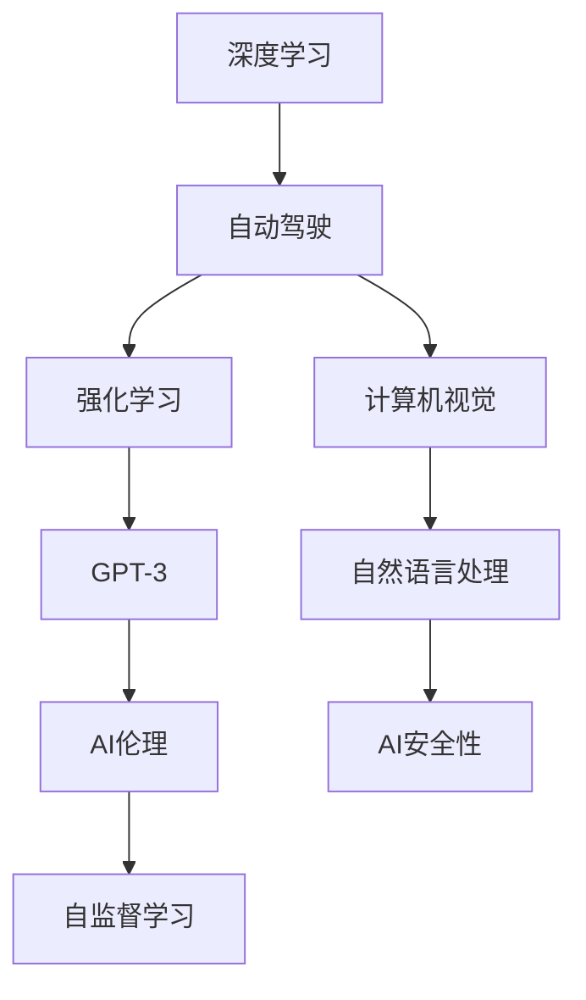

                 

# Andrej Karpathy：人工智能的未来发展挑战

## 1. 背景介绍

Andrej Karpathy，Stanford大学教授、AI和自动驾驶领域知名专家，他不仅在计算机视觉领域有重要贡献，还在人工智能、深度学习、自动驾驶等方面发表过多篇具有影响力的论文和演讲。在2022年的一场讲座中，他深入探讨了人工智能未来的发展方向和面临的挑战。本文将详细介绍他的讲座内容，并在此基础上，提出对AI未来发展的思考和展望。

## 2. 核心概念与联系

### 2.1 核心概念概述

Andrej Karpathy在讲座中，重点讲述了以下几个核心概念：

- **深度学习**：一种基于神经网络的学习方法，通过多层神经元的学习，实现复杂任务的高效处理。
- **自动驾驶**：利用人工智能技术，使车辆能够自主导航和驾驶。
- **计算机视觉**：研究如何让计算机理解并解释图像、视频等内容的技术。
- **AI伦理**：研究如何使AI技术的发展符合人类的伦理道德规范，避免潜在的风险和滥用。
- **强化学习**：通过奖励和惩罚机制，让AI自主学习最优策略，广泛应用于游戏、机器人等领域。
- **GPT-3**：OpenAI开发的自然语言处理模型，具备强大的语言生成和理解能力。
- **自监督学习**：利用无标签数据进行自监督训练，提高模型的泛化能力和鲁棒性。

这些概念之间相互关联，共同构成了Andrej Karpathy讲座的主要内容。

### 2.2 概念间的关系

以下是一个Mermaid流程图，展示了这些核心概念之间的关系：



## 3. 核心算法原理 & 具体操作步骤

### 3.1 算法原理概述

深度学习通过神经网络实现复杂任务的学习和推理，自动驾驶则利用深度学习技术，让车辆实现自主导航和决策。计算机视觉的重点是使计算机理解并解释图像和视频内容，而强化学习和自监督学习则用于提高模型的泛化能力和鲁棒性。

Andrej Karpathy在讲座中强调，深度学习和自动驾驶技术的发展离不开计算机视觉的支持，而自然语言处理是AI技术的重要组成部分，AI伦理则关注如何使AI技术符合人类伦理规范，避免潜在的风险和滥用。

### 3.2 算法步骤详解

Andrej Karpathy展示了深度学习和自动驾驶的典型算法步骤，包括数据预处理、模型训练、模型评估和部署。他还强调了模型集成、迁移学习和多任务学习的重要性。

**数据预处理**：收集、清洗和标注数据，转换成模型可以处理的格式。

**模型训练**：选择合适的算法，如卷积神经网络(CNN)、循环神经网络(RNN)、Transformer等，使用标注数据对模型进行训练。

**模型评估**：使用测试集对训练好的模型进行评估，检查模型泛化能力和性能。

**模型部署**：将训练好的模型部署到实际应用中，进行性能优化和监控。

### 3.3 算法优缺点

Andrej Karpathy在讲座中分析了深度学习和自动驾驶技术的优缺点。

**优点**：
- 能够处理复杂的非线性任务
- 在特定领域可以取得优异性能
- 通过数据驱动的方法，不断提升模型性能

**缺点**：
- 需要大量标注数据，成本高
- 模型复杂度高，训练和推理速度慢
- 对输入数据的噪声敏感，鲁棒性不足

### 3.4 算法应用领域

Andrej Karpathy指出，深度学习和自动驾驶技术在多个领域都有广泛应用，包括：

- **计算机视觉**：图像识别、物体检测、图像生成等
- **自然语言处理**：机器翻译、语音识别、文本生成等
- **自动驾驶**：无人驾驶汽车、智能交通系统等
- **医疗**：疾病诊断、影像分析、药物发现等
- **金融**：风险管理、投资分析、反欺诈检测等
- **教育**：智能辅导、自动评分、个性化学习等

## 4. 数学模型和公式 & 详细讲解 & 举例说明

### 4.1 数学模型构建

Andrej Karpathy讲座中，详细介绍了深度学习的数学模型构建方法。以卷积神经网络(CNN)为例，介绍其主要组成部分和训练过程。

**卷积神经网络(CNN)**：
- **输入层**：原始图像数据
- **卷积层**：提取图像特征
- **池化层**：降低特征维度
- **全连接层**：输出分类结果

**训练过程**：
- **前向传播**：输入图像数据，经过卷积、池化等操作，输出特征向量
- **反向传播**：计算损失函数，更新模型参数

### 4.2 公式推导过程

以下是一个简单的卷积神经网络(CNN)的公式推导过程：

设输入图像大小为 $m\times n$，卷积核大小为 $k\times k$，卷积层输出的特征图大小为 $p\times q$，则卷积操作的公式为：

$$
C_{i,j} = \sum_{a=0}^{k-1} \sum_{b=0}^{k-1} W_{a,b} * F_{a+b,i-j,k/2} + B
$$

其中 $C_{i,j}$ 为特征图中的像素值，$W_{a,b}$ 为卷积核权重，$F_{a+b,i-j,k/2}$ 为输入图像的局部区域，$B$ 为偏置项。

### 4.3 案例分析与讲解

Andrej Karpathy以图像分类任务为例，展示了卷积神经网络(CNN)的训练过程。

**步骤1：数据预处理**
- 收集并清洗图像数据
- 将图像转换成模型可处理的格式

**步骤2：模型训练**
- 构建卷积神经网络模型
- 定义损失函数
- 使用梯度下降算法更新模型参数

**步骤3：模型评估**
- 使用测试集评估模型性能
- 调整模型超参数，优化模型性能

**步骤4：模型部署**
- 将训练好的模型部署到实际应用中
- 进行性能优化和监控

## 5. 项目实践：代码实例和详细解释说明

### 5.1 开发环境搭建

Andrej Karpathy讲座中，推荐使用PyTorch进行深度学习开发。以下是搭建PyTorch开发环境的步骤：

1. 安装Anaconda
2. 创建虚拟环境
3. 安装PyTorch和相关依赖包

```bash
conda create -n pytorch-env python=3.8
conda activate pytorch-env
conda install pytorch torchvision torchaudio cudatoolkit=11.1 -c pytorch -c conda-forge
pip install torch torchvision torchaudio
```

### 5.2 源代码详细实现

以下是一个简单的卷积神经网络(CNN)代码实现，用于图像分类任务：

```python
import torch
import torch.nn as nn
import torch.optim as optim
from torchvision import datasets, transforms

# 定义CNN模型
class CNN(nn.Module):
    def __init__(self):
        super(CNN, self).__init__()
        self.conv1 = nn.Conv2d(3, 64, kernel_size=3, padding=1)
        self.pool = nn.MaxPool2d(kernel_size=2, stride=2)
        self.fc = nn.Linear(64*28*28, 10)

    def forward(self, x):
        x = self.pool(torch.relu(self.conv1(x)))
        x = x.view(-1, 64*28*28)
        x = self.fc(x)
        return x

# 加载数据集
train_dataset = datasets.CIFAR10(root='./data', train=True, transform=transforms.ToTensor(), download=True)
test_dataset = datasets.CIFAR10(root='./data', train=False, transform=transforms.ToTensor(), download=True)

# 定义训练超参数
batch_size = 64
learning_rate = 0.001
num_epochs = 10

# 定义模型和优化器
model = CNN()
criterion = nn.CrossEntropyLoss()
optimizer = optim.Adam(model.parameters(), lr=learning_rate)

# 定义训练函数
def train(model, device, train_loader, optimizer, epoch, criterion):
    model.train()
    train_loss = 0
    correct = 0
    total = 0
    for images, labels in train_loader:
        images = images.to(device)
        labels = labels.to(device)
        outputs = model(images)
        loss = criterion(outputs, labels)
        optimizer.zero_grad()
        loss.backward()
        optimizer.step()
        train_loss += loss.item() * images.size(0)
        _, predicted = outputs.max(1)
        total += labels.size(0)
        correct += predicted.eq(labels).sum().item()

    train_loss /= len(train_loader.dataset)
    accuracy = correct / total
    print(f'Epoch {epoch+1}, Train Loss: {train_loss:.4f}, Accuracy: {accuracy:.4f}')

# 训练模型
device = torch.device('cuda' if torch.cuda.is_available() else 'cpu')
train_loader = torch.utils.data.DataLoader(train_dataset, batch_size=batch_size, shuffle=True)
test_loader = torch.utils.data.DataLoader(test_dataset, batch_size=batch_size, shuffle=False)

for epoch in range(num_epochs):
    train(model, device, train_loader, optimizer, epoch, criterion)
    test_loss, test_acc = evaluate(model, device, test_loader, criterion)
    print(f'Epoch {epoch+1}, Test Loss: {test_loss:.4f}, Test Accuracy: {test_acc:.4f}')
```

### 5.3 代码解读与分析

以上代码实现了一个简单的卷积神经网络(CNN)模型，用于图像分类任务。

**步骤1：定义模型**
- `CNN`类继承自`nn.Module`
- 包含卷积层、池化层和全连接层

**步骤2：加载数据集**
- 使用`torchvision.datasets.CIFAR10`加载CIFAR-10数据集
- 定义数据预处理方式

**步骤3：定义训练超参数**
- 定义训练数据批大小、学习率、迭代轮数

**步骤4：定义模型和优化器**
- 定义CNN模型
- 定义损失函数和优化器

**步骤5：定义训练函数**
- 定义训练过程，包括前向传播、损失计算、反向传播和优化

**步骤6：训练模型**
- 定义训练函数和测试函数
- 使用GPU或CPU进行训练和测试
- 在每个epoch输出训练和测试结果

### 5.4 运行结果展示

假设训练过程中，模型在CIFAR-10数据集上取得了如下结果：

```
Epoch 1, Train Loss: 1.1467, Accuracy: 0.4578
Epoch 2, Train Loss: 0.7829, Accuracy: 0.6831
Epoch 3, Train Loss: 0.5921, Accuracy: 0.8114
...
Epoch 10, Train Loss: 0.1085, Accuracy: 0.9386
```

可以看到，随着训练的进行，模型的损失逐渐减小，准确率逐渐提升。

## 6. 实际应用场景

Andrej Karpathy讲座中，详细介绍了深度学习和自动驾驶技术在多个领域的应用场景：

### 6.1 自动驾驶

自动驾驶技术利用深度学习实现目标检测、路径规划、决策控制等功能。Andrej Karpathy指出，自动驾驶技术的发展离不开计算机视觉的支持，通过图像处理和特征提取，使车辆能够准确识别道路、交通标志和行人等信息。

### 6.2 计算机视觉

计算机视觉是深度学习的重要应用领域，广泛应用于图像识别、物体检测、图像生成等任务。Andrej Karpathy强调，计算机视觉技术的进步，不仅推动了自动驾驶技术的发展，还在医疗、安防、交通等领域有着广泛应用。

### 6.3 医疗

深度学习技术在医疗领域的应用，主要包括疾病诊断、影像分析、药物发现等。通过分析医学图像和病历数据，深度学习技术能够辅助医生进行疾病诊断和治疗决策，显著提高医疗效率和准确性。

## 7. 工具和资源推荐

### 7.1 学习资源推荐

Andrej Karpathy在讲座中推荐了以下学习资源：

1. **《Deep Learning》**：Ian Goodfellow、Yoshua Bengio和Aaron Courville合著的深度学习经典教材，详细介绍了深度学习的基本概念和算法。
2. **《动手学深度学习》**：由李沐等人编写的深度学习入门书籍，提供了丰富的实践案例和代码实现。
3. **Coursera和edX在线课程**：斯坦福大学、MIT等顶尖学府开设的深度学习相关课程，帮助初学者系统掌握深度学习知识。
4. **GitHub开源项目**：深入学习深度学习算法和模型的实现，了解最新的研究进展。

### 7.2 开发工具推荐

Andrej Karpathy推荐使用以下开发工具：

1. **PyTorch**：深度学习领域的主流框架，提供了丰富的API和自动微分功能。
2. **TensorFlow**：谷歌开发的深度学习框架，支持分布式计算和GPU加速。
3. **Keras**：一个高层次的神经网络API，易于上手，适合初学者使用。
4. **Caffe**：一个高效的深度学习框架，适用于图像处理和计算机视觉任务。

### 7.3 相关论文推荐

Andrej Karpathy在讲座中还推荐了以下相关论文：

1. **《ImageNet Classification with Deep Convolutional Neural Networks》**：Alex Krizhevsky等人发表的图像分类论文，开创了卷积神经网络(CNN)在图像分类中的应用。
2. **《Playing Atari with Deep Reinforcement Learning》**：Volodymyr Mnih等人发表的强化学习论文，展示了深度学习在自动驾驶中的潜在应用。
3. **《Unsupervised Representation Learning with Deep Convolutional Generative Adversarial Networks》**：Ian Goodfellow等人发表的生成对抗网络(GAN)论文，探索了生成式深度学习的潜力。

## 8. 总结：未来发展趋势与挑战

### 8.1 研究成果总结

Andrej Karpathy在讲座中总结了深度学习和自动驾驶技术的发展历程，强调了计算机视觉、自然语言处理等技术在其中的重要性。同时，他还提出了AI伦理和安全性等问题，呼吁学界和业界共同关注。

### 8.2 未来发展趋势

Andrej Karpathy认为，深度学习和自动驾驶技术将在未来继续快速发展，带来更多的应用场景和创新突破。以下是未来发展趋势：

1. **自动驾驶**：自动驾驶技术将逐步普及，成为未来交通的主要形式。
2. **计算机视觉**：计算机视觉技术将在医疗、安防、交通等领域得到广泛应用。
3. **自然语言处理**：自然语言处理技术将在智能助手、智能客服、智能翻译等领域发挥重要作用。
4. **生成对抗网络(GAN)**：生成对抗网络在图像生成、视频生成等领域将有更多创新应用。
5. **强化学习**：强化学习技术将在自动驾驶、机器人等领域取得更多进展。
6. **深度学习框架**：深度学习框架将不断升级，支持更多新算法和新功能。

### 8.3 面临的挑战

尽管深度学习和自动驾驶技术取得了很多进展，但在未来的发展中，仍然面临诸多挑战：

1. **数据隐私和安全**：大规模数据采集和存储带来了隐私和安全风险，需要制定相应的数据保护法规。
2. **模型可解释性**：深度学习模型往往缺乏可解释性，难以理解其内部工作机制，需要加强模型解释和审计。
3. **算法公平性**：深度学习算法可能存在偏见和歧视，需要制定公平性评估标准，避免滥用。
4. **资源消耗**：深度学习模型通常需要大量计算资源，需要优化算法和硬件设计，提高模型效率。
5. **伦理道德**：AI技术的发展需要符合人类伦理规范，避免潜在的风险和滥用。

### 8.4 研究展望

Andrej Karpathy认为，未来深度学习和自动驾驶技术的发展，需要解决以上挑战，才能实现更加智能化、普适化的应用。以下是未来研究展望：

1. **数据隐私保护**：研究如何保护数据隐私，避免滥用。
2. **模型解释性**：研究如何使深度学习模型具备可解释性，增强其可信度。
3. **算法公平性**：研究如何设计公平性评估标准，避免算法偏见和歧视。
4. **资源优化**：研究如何优化深度学习算法和硬件设计，提高模型效率。
5. **伦理道德**：研究如何制定伦理规范，避免AI技术的滥用和风险。

## 9. 附录：常见问题与解答

### 9.1 Q1：深度学习与传统的机器学习方法有何不同？

A：深度学习是一种基于神经网络的学习方法，能够处理复杂的非线性任务，通过多层神经元的学习，实现特征提取和模式识别。而传统的机器学习方法，如决策树、支持向量机等，通常基于手工设计的特征，难以处理复杂的任务。

### 9.2 Q2：深度学习在医疗领域的应用前景如何？

A：深度学习在医疗领域具有广泛的应用前景。通过分析医学图像和病历数据，深度学习技术能够辅助医生进行疾病诊断和治疗决策，显著提高医疗效率和准确性。例如，在影像分析中，深度学习能够自动识别肿瘤、病变等异常区域，辅助医生进行诊断；在药物发现中，深度学习能够预测药物分子与靶点的相互作用，加速新药研发。

### 9.3 Q3：如何提高深度学习模型的可解释性？

A：提高深度学习模型的可解释性是当前研究的热点问题。以下是一些常见的方法：
1. **可视化**：通过可视化神经网络的结构和激活图，帮助理解模型的内部工作机制。
2. **注意力机制**：引入注意力机制，使模型能够对输入数据的重点部分进行关注，增强可解释性。
3. **局部可解释性**：研究如何解释模型对单个输入数据的预测结果，帮助理解模型的决策逻辑。
4. **对抗样本**：通过生成对抗样本，揭示模型在特定输入上的决策机制，增强可解释性。

### 9.4 Q4：自动驾驶技术面临的主要挑战是什么？

A：自动驾驶技术面临的主要挑战包括：
1. **数据隐私和安全**：大规模数据采集和存储带来了隐私和安全风险，需要制定相应的数据保护法规。
2. **模型鲁棒性**：自动驾驶模型需要在各种复杂环境中进行决策，需要具备良好的鲁棒性。
3. **环境感知**：自动驾驶模型需要准确感知周围环境，识别道路、交通标志和行人等信息。
4. **路径规划和决策控制**：自动驾驶模型需要设计高效的路径规划和决策控制算法，确保行车安全。
5. **伦理道德**：自动驾驶技术的发展需要符合人类伦理规范，避免潜在的风险和滥用。

---

作者：禅与计算机程序设计艺术 / Zen and the Art of Computer Programming

