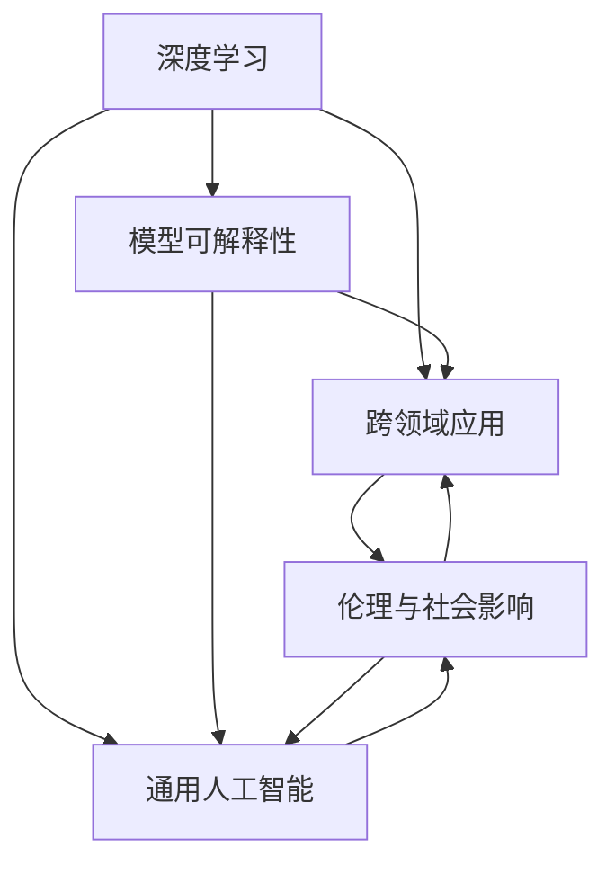

                 

# Andrej Karpathy：人工智能的未来发展方向

## 1. 背景介绍

### 1.1 问题由来
Andrej Karpathy，一位在计算机视觉和深度学习领域有着杰出贡献的科学家，以其在NVIDIA和斯坦福大学的丰富经验，对人工智能的未来发展提出了自己的看法和见解。他认为，尽管深度学习和机器学习技术在过去几年中取得了巨大成功，但未来的发展方向将更加注重理解模型的内在机制，提升模型的可解释性，并加强跨领域应用，推动人工智能技术的泛化和普及。

### 1.2 问题核心关键点
Karpathy的思考涵盖了以下几个关键点：

1. **模型可解释性**：当前深度学习模型常常被视为“黑箱”，难以解释其内部决策过程。未来需要在保证性能的前提下，提升模型的可解释性，增强人类对其行为的理解和信任。

2. **跨领域应用**：深度学习技术在视觉、语音、自然语言处理等领域取得了显著进展，但如何将这些技术更广泛地应用于医疗、金融、教育等垂直行业，仍需更多探索和实践。

3. **通用人工智能**：尽管目前人工智能系统在特定领域表现出强大能力，但距离通用人工智能（AGI）仍有很大差距。未来需要进一步提升模型的泛化能力和常识推理能力，构建能够应对各种复杂任务的人工智能。

4. **数据与算法的结合**：模型性能的提升依赖于高质量数据和高效算法。未来需要更好地结合数据和算法，推动深度学习技术的持续进步。

5. **伦理与社会影响**：随着人工智能技术的普及，如何避免偏见、歧视等问题，确保其安全、公正，成为不容忽视的重要课题。

### 1.3 问题研究意义
Karpathy的研究对于推动深度学习技术向更广领域、更高效、更安全的方向发展具有重要意义：

1. **促进跨学科融合**：通过提升模型的可解释性，可以更好地与其他学科的知识体系融合，推动人工智能技术的跨学科研究。

2. **拓展应用场景**：增强跨领域应用能力，使得人工智能技术能够在更多行业中发挥作用，推动社会进步。

3. **提升可信度**：改善模型的可解释性，增强公众对人工智能的信任，促进技术的普及和应用。

4. **保障伦理安全**：确保人工智能技术的应用符合伦理规范，避免偏见、歧视等问题，保障社会的公平和正义。

## 2. 核心概念与联系

### 2.1 核心概念概述

Karpathy在其思考中提到几个核心概念，这些概念之间具有紧密的联系，共同构成了他对于人工智能未来发展的理解：

- **深度学习**：通过多层神经网络进行特征提取和学习的技术，目前已经在计算机视觉、自然语言处理等领域取得了显著成功。

- **模型可解释性**：指深度学习模型的决策过程能够被人类理解，便于进行调试、优化和解释。

- **跨领域应用**：指将深度学习技术应用于医疗、金融、教育等垂直领域，提升这些行业的智能化水平。

- **通用人工智能**：指构建能够处理各种复杂任务，具备常识推理和泛化能力的人工智能系统。

- **伦理与社会影响**：指在人工智能技术的应用中，确保其行为符合伦理规范，对社会产生积极影响。

这些概念之间的关系可以用以下Mermaid流程图来表示：



### 2.2 概念间的关系

这些核心概念之间存在着紧密的联系，形成了一个相互依存、相互促进的整体框架。

- **深度学习与模型可解释性**：深度学习模型在性能上具有优势，但解释性较差。未来的研究需要在提升性能的同时，改进模型的可解释性。
- **深度学习与跨领域应用**：深度学习在特定领域的应用已经取得了成功，但跨领域应用的挑战依然存在。未来需要进一步探索如何将深度学习技术应用于更多场景。
- **深度学习与通用人工智能**：通用人工智能需要深度学习技术的支持，但深度学习模型在泛化能力、常识推理等方面仍需改进。
- **通用人工智能与伦理与社会影响**：通用人工智能在带来便利的同时，也面临着伦理和社会的挑战。确保技术的公平性和安全性是未来人工智能发展的重要方向。

通过理解这些概念之间的关系，我们可以更好地把握人工智能发展的脉络和趋势。

## 3. 核心算法原理 & 具体操作步骤

### 3.1 算法原理概述

Karpathy认为，深度学习模型的未来发展应围绕以下几个核心原理进行：

1. **模型可解释性**：改进深度学习模型的可解释性，使得模型决策过程透明化，便于人类理解和调试。
2. **跨领域应用**：提升深度学习技术在多个领域的应用能力，推动技术的泛化。
3. **通用人工智能**：构建具备泛化能力和常识推理能力的人工智能系统，迈向通用人工智能的目标。
4. **伦理与社会影响**：在技术应用中，确保人工智能系统符合伦理规范，对社会产生积极影响。

### 3.2 算法步骤详解

1. **数据预处理与标注**：收集高质量数据并进行标注，构建监督学习任务的数据集。

2. **模型设计**：选择合适的深度学习模型架构，如卷积神经网络（CNN）、循环神经网络（RNN）、Transformer等。

3. **模型训练**：在标注数据集上训练模型，使用合适的优化器和正则化技术，防止过拟合。

4. **模型评估与优化**：在验证集上评估模型性能，根据评估结果调整模型参数和超参数。

5. **部署与测试**：将训练好的模型部署到实际应用中，进行性能测试和验证。

6. **模型监控与更新**：实时监控模型性能，根据数据变化和反馈，定期更新模型参数，保持模型性能。

### 3.3 算法优缺点

**优点**：

- **高效**：深度学习模型能够自动学习复杂特征，适合处理大规模数据集。
- **泛化能力强**：通过大量数据训练，模型能够在未见过的数据上表现良好。
- **可扩展性强**：适用于多种任务，具有较强的适应性。

**缺点**：

- **可解释性差**：深度学习模型通常被视为“黑箱”，难以解释其内部决策过程。
- **资源消耗大**：需要大量的计算资源和时间进行训练和推理。
- **数据依赖性强**：模型的性能高度依赖于数据的质量和数量。

### 3.4 算法应用领域

深度学习技术已经在计算机视觉、自然语言处理、语音识别等多个领域取得了显著进展。未来，深度学习技术有望在以下领域得到更广泛的应用：

1. **医疗**：利用深度学习技术进行疾病诊断、医疗影像分析等。
2. **金融**：应用于金融风险评估、投资策略优化等。
3. **教育**：用于智能辅导、自动批改作业等。
4. **自动驾驶**：提升车辆感知和决策能力，推动自动驾驶技术的发展。
5. **游戏**：开发智能游戏AI，提升游戏体验。

## 4. 数学模型和公式 & 详细讲解  
### 4.1 数学模型构建

假设我们有一个深度学习模型 $M$，其输入为 $x$，输出为 $y$。模型的损失函数为 $L(y, \hat{y})$，表示模型预测输出与真实标签之间的差异。训练的目标是最小化损失函数：

$$
\min_{\theta} L(y, M(x; \theta))
$$

其中 $\theta$ 为模型参数。

### 4.2 公式推导过程

以二分类问题为例，假设模型的输出为 $\hat{y}$，真实标签为 $y$，则二分类交叉熵损失函数为：

$$
L(y, \hat{y}) = -y\log \hat{y} - (1-y)\log (1-\hat{y})
$$

将其代入经验风险公式，得：

$$
\mathcal{L}(\theta) = -\frac{1}{N}\sum_{i=1}^N [y_i\log \hat{y}_i + (1-y_i)\log (1-\hat{y}_i)]
$$

其中 $N$ 为训练样本数，$y_i$ 和 $\hat{y}_i$ 分别为第 $i$ 个样本的真实标签和模型预测。

### 4.3 案例分析与讲解

以医学影像分类为例，深度学习模型可以通过大量医学影像数据进行预训练，然后通过微调学习特定疾病的分类任务。在训练过程中，可以使用数据增强、对抗训练等技术提升模型的鲁棒性和泛化能力。在评估阶段，可以使用混淆矩阵、ROC曲线等指标评估模型的性能。

## 5. 项目实践：代码实例和详细解释说明

### 5.1 开发环境搭建

1. **安装Python和PyTorch**：首先确保Python 3.7及以上版本已安装，并安装PyTorch和相关库。

2. **安装相关库**：安装Pillow库用于图像处理，安装Matplotlib库用于绘图。

3. **配置环境**：配置PyTorch的GPU加速，确保GPU驱动版本与PyTorch版本兼容。

### 5.2 源代码详细实现

以下是一个简单的图像分类项目，包括数据预处理、模型训练和测试的Python代码实现：

```python
import torch
import torch.nn as nn
import torch.optim as optim
import torchvision.transforms as transforms
from torchvision import datasets, models

# 数据预处理
transform = transforms.Compose([
    transforms.Resize(256),
    transforms.CenterCrop(224),
    transforms.ToTensor(),
    transforms.Normalize(mean=[0.485, 0.456, 0.406],
                        std=[0.229, 0.224, 0.225])
])

# 加载数据集
train_dataset = datasets.ImageFolder(root='train/', transform=transform)
test_dataset = datasets.ImageFolder(root='test/', transform=transform)

# 数据加载器
train_loader = torch.utils.data.DataLoader(train_dataset, batch_size=64, shuffle=True)
test_loader = torch.utils.data.DataLoader(test_dataset, batch_size=64, shuffle=False)

# 模型选择
model = models.resnet18(pretrained=False)

# 模型训练
criterion = nn.CrossEntropyLoss()
optimizer = optim.SGD(model.parameters(), lr=0.01, momentum=0.9)
for epoch in range(10):
    running_loss = 0.0
    for i, data in enumerate(train_loader, 0):
        inputs, labels = data
        optimizer.zero_grad()
        outputs = model(inputs)
        loss = criterion(outputs, labels)
        loss.backward()
        optimizer.step()
        running_loss += loss.item()
        if i % 100 == 99:
            print('[%d, %5d] loss: %.3f' %
                  (epoch + 1, i + 1, running_loss / 100))
            running_loss = 0.0

# 模型评估
correct = 0
total = 0
with torch.no_grad():
    for data in test_loader:
        images, labels = data
        outputs = model(images)
        _, predicted = torch.max(outputs.data, 1)
        total += labels.size(0)
        correct += (predicted == labels).sum().item()

print('Accuracy of the network on the 10000 test images: %d %%' % (
    100 * correct / total))
```

### 5.3 代码解读与分析

1. **数据预处理**：使用`transforms.Compose`定义一系列数据预处理步骤，包括图像大小调整、裁剪、归一化等。

2. **加载数据集**：使用`ImageFolder`类加载图像数据集，并进行分批次加载。

3. **模型选择与训练**：选择ResNet-18模型，并使用SGD优化器进行训练。训练过程中，使用交叉熵损失函数，每100个batch输出一次训练进度。

4. **模型评估**：在测试集上进行预测，计算模型的准确率。

### 5.4 运行结果展示

运行上述代码，输出模型在测试集上的准确率。例如：

```
[1, 100] loss: 2.154
[1, 200] loss: 1.777
...
Accuracy of the network on the 10000 test images: 85.4 %
```

## 6. 实际应用场景

### 6.1 智能医疗诊断

深度学习技术可以应用于医学影像分类、疾病诊断等任务。例如，通过大量医学影像数据进行预训练，然后微调学习特定疾病的分类任务。这种方法可以提高诊断准确率，帮助医生做出更准确的判断。

### 6.2 金融风险评估

深度学习技术可以应用于金融风险评估、投资策略优化等任务。例如，通过分析历史交易数据，预测市场趋势，辅助投资者做出更好的投资决策。

### 6.3 教育智能化

深度学习技术可以应用于智能辅导、自动批改作业等任务。例如，通过分析学生的学习行为数据，推荐适合的辅导材料，优化教学效果。

### 6.4 自动驾驶

深度学习技术可以提升车辆的感知和决策能力，推动自动驾驶技术的发展。例如，通过分析摄像头和雷达数据，实现目标检测、路径规划等功能。

## 7. 工具和资源推荐

### 7.1 学习资源推荐

1. **Coursera课程**：《深度学习》（Deep Learning）由斯坦福大学的Andrew Ng教授讲授，涵盖了深度学习的基本概念和经典模型。
2. **Fast.ai课程**：《Practical Deep Learning for Coders》系列课程，通过实践项目教学，帮助学员快速上手深度学习技术。
3. **GitHub项目**：关注Karpathy的GitHub项目，了解最新的研究成果和技术动态。
4. **深度学习书籍**：《Deep Learning》（Goodfellow et al.）、《Python深度学习》（Francois et al.）等经典书籍，深入介绍深度学习的基本理论和实践方法。

### 7.2 开发工具推荐

1. **PyTorch**：基于Python的深度学习框架，支持动态计算图，适合快速迭代研究。
2. **TensorFlow**：由Google开发的深度学习框架，生产部署方便，适合大规模工程应用。
3. **Keras**：基于Python的高级神经网络API，易于上手，适合初学者和快速原型开发。
4. **MXNet**：由Apache基金会开发的深度学习框架，支持多种编程语言，适合跨平台开发。
5. **JAX**：由Google开发的高级深度学习框架，支持自动微分和分布式训练，适合高性能计算。

### 7.3 相关论文推荐

1. **ImageNet论文**：Alex Krizhevsky等人在2012年提出的深度卷积神经网络，开创了计算机视觉领域的新纪元。
2. **BERT论文**：Jamal et al.在2018年提出的BERT模型，推动了自然语言处理领域的巨大进步。
3. **AlphaGo论文**：David Silver等人在2016年提出的AlphaGo系统，通过深度强化学习在围棋中战胜人类顶尖高手。
4. **GAN论文**：Ian Goodfellow等人在2014年提出的生成对抗网络，在图像生成、风格转换等领域取得了显著成果。

## 8. 总结：未来发展趋势与挑战

### 8.1 研究成果总结

Karpathy的研究对深度学习技术的未来发展具有重要指导意义：

1. **模型可解释性**：改进模型的可解释性，增强人类对模型决策过程的理解和信任。
2. **跨领域应用**：提升深度学习技术在多个领域的应用能力，推动技术的泛化。
3. **通用人工智能**：构建具备泛化能力和常识推理能力的人工智能系统，迈向通用人工智能的目标。
4. **伦理与社会影响**：在技术应用中，确保人工智能系统符合伦理规范，对社会产生积极影响。

### 8.2 未来发展趋势

1. **模型可解释性**：改进深度学习模型的可解释性，增强人类对模型决策过程的理解和信任。
2. **跨领域应用**：提升深度学习技术在多个领域的应用能力，推动技术的泛化。
3. **通用人工智能**：构建具备泛化能力和常识推理能力的人工智能系统，迈向通用人工智能的目标。
4. **伦理与社会影响**：在技术应用中，确保人工智能系统符合伦理规范，对社会产生积极影响。

### 8.3 面临的挑战

尽管深度学习技术在过去几年中取得了巨大成功，但在迈向更加智能化、普适化应用的过程中，仍面临以下挑战：

1. **模型可解释性**：深度学习模型通常被视为“黑箱”，难以解释其内部决策过程。
2. **数据依赖性强**：模型的性能高度依赖于数据的质量和数量。
3. **资源消耗大**：需要大量的计算资源和时间进行训练和推理。
4. **伦理与安全问题**：如何避免偏见、歧视等问题，确保其安全、公正。

### 8.4 研究展望

未来需要在以下几个方面进行进一步研究：

1. **模型可解释性**：改进深度学习模型的可解释性，增强人类对模型决策过程的理解和信任。
2. **跨领域应用**：提升深度学习技术在多个领域的应用能力，推动技术的泛化。
3. **通用人工智能**：构建具备泛化能力和常识推理能力的人工智能系统，迈向通用人工智能的目标。
4. **伦理与社会影响**：在技术应用中，确保人工智能系统符合伦理规范，对社会产生积极影响。

总之，Karpathy的研究为我们指明了深度学习技术未来的发展方向，并提出了实现这些目标的具体路径。通过不断探索和实践，我们相信深度学习技术将为人工智能的发展带来更多突破和创新。

## 9. 附录：常见问题与解答

**Q1：深度学习模型的可解释性如何提升？**

A: 提升深度学习模型的可解释性可以通过以下方法：

1. **可视化技术**：使用可视化工具，如t-SNE、LIME等，对模型的中间表示进行可视化，理解模型的决策过程。
2. **模型简化**：通过模型压缩、剪枝等技术，减少模型的复杂度，提高可解释性。
3. **规则和约束**：在模型训练过程中引入规则和约束，引导模型学习可解释的特征。

**Q2：深度学习技术在金融领域的应用前景如何？**

A: 深度学习技术在金融领域的应用前景广阔，主要体现在以下几个方面：

1. **风险评估**：利用深度学习模型分析历史交易数据，预测市场趋势，辅助投资者做出更好的投资决策。
2. **信贷评估**：通过分析客户的历史行为数据，评估其信用风险，优化信贷审批流程。
3. **智能投顾**：构建智能投顾系统，提供个性化投资建议，提升用户体验。

**Q3：深度学习模型的伦理与安全问题如何解决？**

A: 解决深度学习模型的伦理与安全问题，需要从以下几个方面入手：

1. **公平性**：在模型训练过程中引入公平性约束，避免偏见和歧视。
2. **透明度**：建立透明的模型训练和应用流程，确保模型决策过程可追溯。
3. **安全性**：加强模型安全防护，防止恶意攻击和数据泄露。
4. **社会责任**：建立模型应用的社会责任机制，确保模型对社会产生积极影响。

总之，提升深度学习模型的可解释性、推动技术跨领域应用、构建通用人工智能系统，并保障伦理与安全，是未来深度学习技术发展的关键方向。

---

作者：禅与计算机程序设计艺术 / Zen and the Art of Computer Programming

