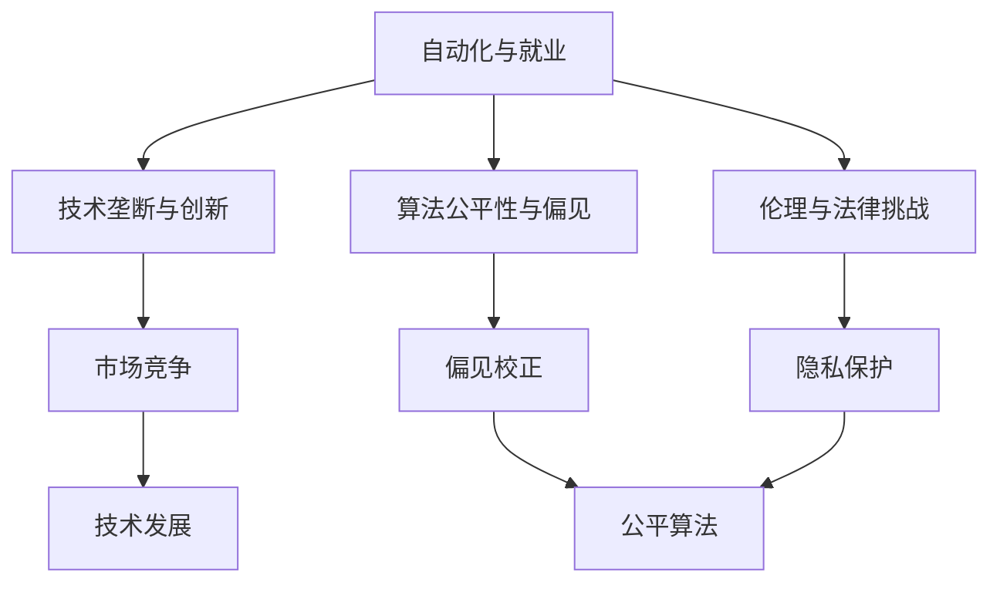

                 

# Andrej Karpathy：人工智能的经济影响

> 关键词：人工智能, 经济影响, 技术发展, 创新驱动, 产业变革, 社会公平, 算法伦理, 就业冲击, 数字鸿沟, 人工智能经济学

## 1. 背景介绍

### 1.1 问题由来
随着人工智能(AI)技术的快速发展，AI对经济和社会的影响逐渐显现，引起了各界广泛的关注和讨论。作为AI领域的知名专家，Andrej Karpathy在多个场合深入分析了AI对经济的影响，为读者揭示了AI技术的未来发展趋势和可能的社会后果。

### 1.2 问题核心关键点
Andrej Karpathy认为，AI技术的发展将在多个方面影响经济结构和社会秩序，包括自动化对就业的影响、技术垄断对创新的挑战、算法的公平性问题、以及AI应用在伦理和法律上的挑战。

### 1.3 问题研究意义
理解AI对经济的影响，有助于政策制定者、企业决策者和公众更好地把握AI技术的潜力与风险，为AI技术的健康发展提供指导。通过深入探讨AI技术对经济的影响，可以为应对AI带来的挑战和机遇做好准备。

## 2. 核心概念与联系

### 2.1 核心概念概述

Andrej Karpathy在分析AI对经济的影响时，涉及以下核心概念：

- **自动化与就业**：AI技术通过自动化生产和服务流程，对传统行业的就业产生重大影响。
- **技术垄断与创新**：AI技术的垄断现象可能抑制技术创新，阻碍市场竞争。
- **算法公平性与偏见**：AI算法可能在数据和模型训练中引入偏见，导致不公平的结果。
- **伦理与法律挑战**：AI技术的广泛应用带来伦理和法律上的新挑战，如隐私保护、决策透明性等。

这些概念之间的逻辑关系可以通过以下Mermaid流程图来展示：



这个流程图展示了自动化对就业的影响、技术垄断对创新的挑战、算法公平性问题以及AI应用在伦理和法律上的挑战，以及它们对AI技术发展的整体影响。

### 2.2 概念间的关系

这些核心概念之间存在着紧密的联系，形成了对AI技术经济影响的综合理解。具体来说：

- **自动化与就业**：自动化技术提高了生产效率，但同时也可能导致某些岗位的消失，影响就业结构。
- **技术垄断与创新**：技术垄断可能导致市场资源过度集中，抑制创新，影响市场竞争。
- **算法公平性与偏见**：算法的偏见可能导致决策不公平，影响社会公平和稳定。
- **伦理与法律挑战**：AI技术的伦理和法律问题，如隐私保护、决策透明性等，直接影响社会接受度和应用范围。

这些概念共同构成了Andrej Karpathy对AI技术经济影响的全面分析框架，揭示了AI技术发展的复杂性和多维度影响。

## 3. 核心算法原理 & 具体操作步骤
### 3.1 算法原理概述

Andrej Karpathy认为，AI技术的发展和应用是建立在算法原理之上的。AI算法通过机器学习、深度学习等技术，不断从数据中学习，提升其识别、预测和决策能力。这些算法在经济中的应用，通过自动化生产、智能决策、数据分析等方式，深刻影响着经济结构和社会秩序。

AI算法的基本原理包括以下几个方面：

- **监督学习**：通过标注数据训练模型，使其能够识别输入和输出之间的映射关系。
- **无监督学习**：从未标注数据中学习，发现数据中的潜在结构和模式。
- **强化学习**：通过与环境交互，优化决策策略，提升智能体的表现。

这些算法原理在实际应用中，形成了多种AI应用场景，如自动驾驶、智能推荐、机器人控制等。

### 3.2 算法步骤详解

AI算法的应用步骤通常包括以下几个关键环节：

1. **数据准备**：收集和预处理数据，确保数据质量和多样性。
2. **模型选择**：根据任务需求选择合适的算法和模型结构。
3. **模型训练**：使用标注数据训练模型，调整参数以优化性能。
4. **模型评估**：使用验证集和测试集评估模型性能，确保模型泛化能力。
5. **模型部署**：将模型部署到实际应用环境中，进行大规模测试和优化。

每个环节都需要精心设计和调整，以确保AI技术的实际应用效果。

### 3.3 算法优缺点

Andrej Karpathy在分析AI算法时，指出了其优缺点：

**优点**：

- **高效性**：AI算法能够快速处理大量数据，提供高效的生产和服务。
- **灵活性**：AI算法可以根据不同任务需求进行调整和优化，适应性较强。
- **精确性**：AI算法在处理复杂数据时，能够提供高精度的预测和决策。

**缺点**：

- **数据依赖性**：AI算法需要大量高质量的数据进行训练，数据获取和处理成本较高。
- **解释性不足**：AI算法的决策过程往往是"黑箱"的，缺乏透明性和可解释性。
- **偏见和公平性问题**：AI算法在训练过程中可能引入偏见，导致不公平的决策。

### 3.4 算法应用领域

AI算法在多个领域得到了广泛应用，包括但不限于：

- **金融行业**：使用AI算法进行风险评估、信用评分、市场预测等。
- **医疗行业**：利用AI算法进行疾病诊断、治疗方案推荐、医学图像分析等。
- **制造业**：通过AI算法实现智能制造、质量控制、供应链优化等。
- **零售行业**：使用AI算法进行客户推荐、库存管理、价格优化等。
- **能源行业**：利用AI算法进行能源消耗预测、智能电网管理、可再生能源调度等。

以上领域只是冰山一角，AI技术的应用潜力还远远未被完全挖掘。

## 4. 数学模型和公式 & 详细讲解
### 4.1 数学模型构建

AI算法的数学模型构建通常涉及以下几个方面：

- **监督学习**：损失函数和优化目标，如交叉熵损失、梯度下降等。
- **无监督学习**：数据生成模型，如高斯分布、隐马尔可夫模型等。
- **强化学习**：状态-行动-奖励模型，如Q-learning、Policy Gradient等。

### 4.2 公式推导过程

以下以监督学习中的交叉熵损失函数为例，展示其推导过程：

设训练样本为 $(x_i, y_i)$，模型输出为 $\hat{y} = M_{\theta}(x)$，其中 $M_{\theta}$ 为模型参数，$\theta$ 为模型参数向量。

**交叉熵损失函数**：

$$
\ell(\theta) = -\frac{1}{N} \sum_{i=1}^N \log P(y_i|x_i)
$$

其中 $P(y_i|x_i)$ 为模型在输入 $x_i$ 下的条件概率，可以通过模型参数 $\theta$ 计算得到。

**梯度下降优化**：

$$
\theta \leftarrow \theta - \eta \nabla_{\theta} \ell(\theta)
$$

其中 $\eta$ 为学习率，$\nabla_{\theta} \ell(\theta)$ 为损失函数对模型参数的梯度，可以通过自动微分技术计算得到。

### 4.3 案例分析与讲解

**案例1：金融信用评分**

在金融领域，使用AI算法进行信用评分是一个典型的监督学习应用。具体步骤如下：

1. 收集历史贷款数据，标注为违约（1）和非违约（0）。
2. 使用交叉熵损失函数，训练逻辑回归模型。
3. 在验证集和测试集上评估模型性能，优化参数。
4. 将模型部署到信贷审批系统中，进行实时信用评分。

**案例2：智能推荐系统**

在零售行业，使用AI算法进行个性化推荐是一个典型的无监督学习应用。具体步骤如下：

1. 收集用户历史行为数据，如浏览记录、购买记录等。
2. 使用协同过滤算法，训练推荐模型。
3. 使用交叉熵损失函数，优化模型参数。
4. 在实时环境中，使用推荐模型为用户推荐商品。

这些案例展示了AI算法在不同领域的实际应用，进一步验证了其强大的功能和广泛的应用前景。

## 5. 项目实践：代码实例和详细解释说明
### 5.1 开发环境搭建

Andrej Karpathy在多个项目中使用了深度学习框架PyTorch进行AI算法开发，以下是一个典型的开发环境搭建步骤：

1. 安装Anaconda：
```bash
conda install anaconda
```

2. 创建虚拟环境：
```bash
conda create -n pytorch-env python=3.8 
conda activate pytorch-env
```

3. 安装PyTorch和相关库：
```bash
pip install torch torchvision torchaudio
```

4. 安装TensorBoard：
```bash
pip install tensorboard
```

完成上述步骤后，即可在虚拟环境中进行AI算法的开发。

### 5.2 源代码详细实现

以下是一个简单的深度学习项目代码示例，展示了如何使用PyTorch进行监督学习模型的训练和评估：

```python
import torch
import torch.nn as nn
import torch.optim as optim
import torch.utils.data as data
from torch.utils.tensorboard import SummaryWriter

class LinearModel(nn.Module):
    def __init__(self, input_size, output_size):
        super(LinearModel, self).__init__()
        self.linear = nn.Linear(input_size, output_size)

    def forward(self, x):
        return self.linear(x)

# 数据准备
train_data = data.Dataset(...)
test_data = data.Dataset(...)

# 模型定义
model = LinearModel(input_size=10, output_size=2)

# 损失函数和优化器
criterion = nn.CrossEntropyLoss()
optimizer = optim.SGD(model.parameters(), lr=0.01)

# 训练循环
for epoch in range(10):
    for i, (inputs, targets) in enumerate(train_loader):
        # 前向传播
        outputs = model(inputs)
        loss = criterion(outputs, targets)

        # 反向传播
        optimizer.zero_grad()
        loss.backward()
        optimizer.step()

        # 记录日志
        writer.add_scalar('loss', loss.item(), global_step=epoch * len(train_data) + i)

# 模型评估
correct = 0
total = 0
with torch.no_grad():
    for inputs, targets in test_loader:
        outputs = model(inputs)
        _, predicted = torch.max(outputs.data, 1)
        total += targets.size(0)
        correct += (predicted == targets).sum().item()

print('Accuracy: {} %'.format(100 * correct / total))
```

### 5.3 代码解读与分析

**代码解读**：

1. **数据准备**：使用PyTorch的Dataset和DataLoader类准备训练和测试数据集。
2. **模型定义**：定义线性回归模型，使用nn.Linear层进行特征映射。
3. **损失函数和优化器**：使用交叉熵损失函数和随机梯度下降优化器。
4. **训练循环**：在每个epoch内，使用训练数据进行前向传播和反向传播，更新模型参数。
5. **模型评估**：在测试集上计算模型准确率，评估模型性能。

**代码分析**：

- **数据预处理**：需要根据实际数据格式，对数据进行预处理，如归一化、标准化、分批等。
- **模型结构设计**：需要根据任务需求，选择适当的模型结构和参数。
- **损失函数选择**：需要根据任务类型，选择合适的损失函数，如交叉熵、均方误差等。
- **优化器设置**：需要根据模型复杂度和训练数据规模，选择合适的优化器和学习率。

## 6. 实际应用场景
### 6.1 智能制造

在智能制造领域，AI技术通过自动化生产线和智能控制系统，显著提升了生产效率和质量。具体应用场景包括：

1. **预测性维护**：使用AI算法分析设备数据，预测设备故障，提前进行维护，避免停机损失。
2. **质量检测**：使用AI算法检测产品缺陷，提升产品质量和一致性。
3. **供应链优化**：使用AI算法优化物流和库存管理，降低成本，提高效率。

### 6.2 医疗诊断

在医疗诊断领域，AI技术通过分析医疗影像和病历数据，提供了高效、准确的诊断服务。具体应用场景包括：

1. **医学影像分析**：使用AI算法分析CT、MRI等影像数据，识别病变区域，辅助医生诊断。
2. **病历数据分析**：使用AI算法分析电子病历，提取疾病特征，辅助医生制定治疗方案。
3. **药物研发**：使用AI算法筛选候选药物，预测药物效果和副作用，加速新药开发。

### 6.3 自动驾驶

在自动驾驶领域，AI技术通过感知、决策和控制算法，实现了车辆自主行驶。具体应用场景包括：

1. **环境感知**：使用AI算法分析摄像头和雷达数据，识别交通标志、行人和其他车辆。
2. **路径规划**：使用AI算法规划行驶路径，避开障碍物，确保行车安全。
3. **智能决策**：使用AI算法进行交通规则判断和决策，避免交通事故。

## 7. 工具和资源推荐
### 7.1 学习资源推荐

Andrej Karpathy推荐了一些优质的学习资源，帮助读者深入理解AI技术及其经济影响：

1. **《深度学习》课程**：斯坦福大学Andrew Ng教授开设的深度学习课程，详细讲解了深度学习的基本原理和应用。
2. **《机器学习实战》书籍**：Peter Harrington撰写的机器学习实战指南，提供了大量实用案例和代码示例。
3. **Kaggle竞赛**：参加Kaggle数据科学竞赛，实践AI算法，提升技能。
4. **PyTorch官方文档**：PyTorch官方文档，提供了丰富的教程和示例代码。
5. **Coursera课程**：Coursera提供的多门AI相关课程，涵盖深度学习、计算机视觉、自然语言处理等领域。

### 7.2 开发工具推荐

Andrej Karpathy推荐了几款用于AI算法开发的工具：

1. **PyTorch**：深度学习框架，提供灵活的计算图和高效的GPU加速。
2. **TensorFlow**：开源深度学习框架，支持多种硬件平台和分布式训练。
3. **Jupyter Notebook**：交互式编程环境，支持代码编写、数据可视化和实时调试。
4. **TensorBoard**：可视化工具，帮助监控模型训练状态和性能。
5. **GitHub**：代码托管平台，方便版本控制和协作开发。

### 7.3 相关论文推荐

Andrej Karpathy推荐了一些重要的AI相关论文，帮助读者深入了解AI技术及其经济影响：

1. **《深度学习》书籍**：Ian Goodfellow等著，详细介绍了深度学习的基本原理和应用。
2. **《机器学习》书籍**：Tom Mitchell著，介绍了机器学习的基本概念和算法。
3. **《人工智能经济学》论文**：Pearce、Schmidt、Tuboi等人的论文，探讨了AI技术对经济的影响。
4. **《AI对就业影响》论文**：Autor、Dorn、Huffman等人的论文，研究了AI对就业市场的影响。
5. **《AI伦理与法律》论文**：Zuboff、Greer等人的论文，探讨了AI技术的伦理和法律问题。

## 8. 总结：未来发展趋势与挑战
### 8.1 研究成果总结

Andrej Karpathy总结了AI技术的发展历程及其对经济的影响，认为AI技术将深刻改变经济结构和就业格局，推动产业升级和创新发展。AI技术的发展方向包括自动化、智能化、自适应和个性化。

### 8.2 未来发展趋势

AI技术的未来发展趋势包括以下几个方面：

1. **自动化水平提升**：自动化技术将进一步提高生产效率，降低人力成本。
2. **智能化水平提升**：智能决策和智能控制将提升企业竞争力和市场适应性。
3. **自适应水平提升**：AI系统将能够实时学习，快速适应环境变化。
4. **个性化水平提升**：个性化推荐和定制化服务将满足用户多样化需求。

### 8.3 面临的挑战

Andrej Karpathy指出，AI技术在发展过程中面临以下挑战：

1. **数据获取和质量**：高质量标注数据的获取成本较高，数据分布不均可能影响模型性能。
2. **算法公平性和偏见**：算法在训练和应用过程中可能引入偏见，导致不公平结果。
3. **伦理和法律问题**：AI技术的伦理和法律问题，如隐私保护、决策透明性等，需要得到解决。
4. **社会接受度**：公众对AI技术的接受度不高，可能阻碍AI技术的普及和应用。

### 8.4 研究展望

未来，AI技术的研究将关注以下几个方向：

1. **跨领域融合**：AI技术将与其他领域的技术融合，如物联网、区块链等，推动跨领域创新。
2. **自监督学习**：通过无监督学习，利用未标注数据训练模型，降低数据依赖性。
3. **算法可解释性**：提升AI算法的可解释性，增强模型的可信度和透明度。
4. **人机协同**：探索人机协同的AI应用场景，提升用户体验和系统可靠性。

## 9. 附录：常见问题与解答

**Q1：AI技术对经济的影响主要体现在哪些方面？**

A：AI技术对经济的影响主要体现在以下几个方面：

1. **就业市场**：自动化和智能化技术将改变就业市场，部分岗位可能会消失，同时也会创造出新的就业机会。
2. **产业结构**：AI技术将推动产业结构升级，促进新兴产业的发展。
3. **企业竞争力**：AI技术将提升企业竞争力，优化资源配置，提高生产效率。
4. **消费者行为**：AI技术将改变消费者行为，提高用户体验和满意度。

**Q2：AI算法在实际应用中面临的主要挑战是什么？**

A：AI算法在实际应用中面临的主要挑战包括：

1. **数据质量**：高质量标注数据的获取成本较高，数据分布不均可能影响模型性能。
2. **算法偏见**：算法在训练和应用过程中可能引入偏见，导致不公平结果。
3. **模型解释性**：AI算法的决策过程往往是"黑箱"的，缺乏透明性和可解释性。
4. **技术复杂性**：AI算法的开发和部署需要较高的技术门槛，需要跨学科知识。

**Q3：如何应对AI技术对就业市场的影响？**

A：应对AI技术对就业市场的影响，可以采取以下措施：

1. **终身学习**：鼓励员工持续学习和技能提升，适应技术变革。
2. **跨领域就业**：培养跨领域的复合型人才，满足多元化市场需求。
3. **政策支持**：政府应制定相关政策，支持教育和培训，帮助员工转型。
4. **社会援助**：提供就业援助和社会保障，缓解就业市场波动。

**Q4：AI技术的伦理和法律问题主要有哪些？**

A：AI技术的伦理和法律问题主要包括以下几个方面：

1. **隐私保护**：AI系统在处理用户数据时，需要遵守隐私保护法规，防止数据泄露。
2. **决策透明性**：AI系统的决策过程需要透明，确保决策可解释和可追溯。
3. **算法偏见**：AI算法在训练和应用过程中可能引入偏见，导致不公平结果。
4. **责任归属**：AI系统在出现问题时，需要明确责任归属，避免法律纠纷。

**Q5：AI技术的未来发展方向有哪些？**

A：AI技术的未来发展方向包括以下几个方面：

1. **自动化水平提升**：自动化技术将进一步提高生产效率，降低人力成本。
2. **智能化水平提升**：智能决策和智能控制将提升企业竞争力和市场适应性。
3. **自适应水平提升**：AI系统将能够实时学习，快速适应环境变化。
4. **个性化水平提升**：个性化推荐和定制化服务将满足用户多样化需求。

**Q6：AI技术的开发和应用过程中需要注意哪些问题？**

A：AI技术的开发和应用过程中需要注意以下几个问题：

1. **数据质量**：确保数据质量和多样性，避免数据偏差和噪声。
2. **算法公平性**：在算法设计中考虑公平性，避免偏见和不公平结果。
3. **伦理和法律问题**：在应用过程中遵守伦理和法律规定，确保AI技术的透明性和可信度。
4. **社会接受度**：提升公众对AI技术的接受度，推动AI技术的普及和应用。

---

作者：禅与计算机程序设计艺术 / Zen and the Art of Computer Programming

