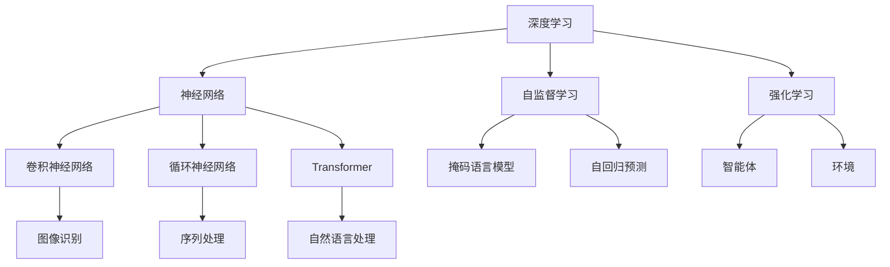

                 

# Andrej Karpathy：获得多巴胺，感觉很好

## 1. 背景介绍

### 1.1 问题由来
Andrej Karpathy，作为斯坦福大学计算机科学教授和深度学习领域的领军人物，以其卓越的研究成就、深思熟虑的理论见解和深入浅出的教学风格深受业内外人士的广泛认可和赞誉。Karpathy教授的研究不仅集中在深度学习、计算机视觉和自动驾驶等领域，更深入探讨了神经网络、强化学习等技术如何塑造人类与机器互动的未来。

### 1.2 问题核心关键点
Karpathy教授对深度学习的研究主要聚焦于以下几个核心问题：
- 如何优化神经网络，使其能够高效处理大规模数据集，提升模型的预测精度和泛化能力。
- 如何通过强化学习等技术，使机器具备自主学习、决策和优化能力。
- 如何将深度学习技术与人类感知、认知等高级功能结合，推动智能人机交互技术的发展。
- 如何通过跨领域的研究，如自然语言处理、计算机视觉和机器人学等，为人工智能技术提供更加全面和深刻的应用。

这些问题的研究不仅推动了深度学习技术的发展，更对人工智能领域的技术创新和应用实践产生了深远影响。

### 1.3 问题研究意义
Karpathy教授的研究工作对深度学习领域的发展具有重要意义：
1. 为深度学习模型的优化提供了理论基础和技术手段，提升了模型在实际应用中的性能。
2. 通过强化学习等技术，推动了机器自主学习、决策和优化能力的突破，为智能系统的自主运行和适应性提供了新的可能性。
3. 通过跨领域的研究，为人工智能技术在各垂直行业的深度应用提供了新的视角和方法。
4. 其研究成果不仅为学术界带来了丰富的理论知识，也为工业界提供了可行的技术解决方案，推动了人工智能技术的产业化和应用落地。

## 2. 核心概念与联系

### 2.1 核心概念概述

为了更好地理解Andrej Karpathy的研究方向和技术贡献，本节将介绍几个与其工作紧密相关的核心概念：

- **深度学习(Deep Learning)**：一种利用多层神经网络进行模式识别、分类、回归等任务的技术，通过逐层抽象和特征提取，能够学习到数据的深层次特征表示。

- **强化学习(Reinforcement Learning)**：一种通过智能体与环境互动，逐步学习最优策略的技术，目标是最大化累计奖励。强化学习广泛应用于游戏、机器人控制、自动驾驶等领域。

- **自监督学习(Self-supervised Learning)**：一种无需标注数据即可进行学习的方法，通过设计巧妙的任务，如掩码语言模型、自回归预测等，使得模型能够从无标签数据中学习到有意义的特征。

- **神经网络(Neural Network)**：一种由多层神经元组成的计算模型，通过学习训练数据，能够实现复杂的模式识别和决策。

- **卷积神经网络(Convolutional Neural Network, CNN)**：一种特定于图像和视频处理的神经网络结构，通过卷积和池化操作提取局部特征，显著提升了图像和视频识别的精度。

- **循环神经网络(Recurrent Neural Network, RNN)**：一种能够处理序列数据的神经网络结构，通过循环连接，能够捕捉时间依赖性。

- **Transformer**：一种利用自注意力机制的神经网络结构，广泛应用于自然语言处理领域，显著提升了机器翻译、文本生成等任务的性能。

这些核心概念构成了Andrej Karpathy研究的基础，通过对其深入理解，可以更好地把握其工作的技术内涵和应用前景。

### 2.2 概念间的关系

这些核心概念之间的关系可以通过以下Mermaid流程图来展示：



这个流程图展示了深度学习与其他相关技术的联系：

1. 深度学习以神经网络为核心，通过自监督学习和强化学习，提升了模型的泛化能力和自主学习能力。
2. 卷积神经网络和循环神经网络分别应用于图像和序列数据的处理。
3. 自注意力机制的Transformer在自然语言处理中表现出色，显著提升了模型的性能。
4. 强化学习中，智能体与环境互动，通过奖励机制优化策略，实现自主决策和优化。

通过这个关系图，我们可以更加清晰地理解Andrej Karpathy的研究如何通过不同技术之间的融合和创新，推动深度学习技术的发展。

## 3. 核心算法原理 & 具体操作步骤

### 3.1 算法原理概述

Andrej Karpathy的研究涵盖了深度学习、强化学习等多个领域，其中以深度学习优化和强化学习策略设计为主要方向。本节将从这两个方面详细介绍其核心算法原理。

#### 3.1.1 深度学习优化

在深度学习中，模型参数的优化是提升预测精度的关键。Andrej Karpathy对梯度下降算法、自适应学习率算法等进行了深入研究，提出了诸如Adam、RMSprop等高效的优化方法。他还结合自监督学习任务，设计了掩码语言模型和自回归预测等创新方法，提升了模型的特征表达能力和泛化能力。

#### 3.1.2 强化学习策略设计

强化学习中，智能体需要通过与环境的互动，逐步学习最优策略。Andrej Karpathy提出了基于Q-learning的策略更新方法，通过状态-行动-奖励的序列，优化智能体的决策策略。他还在游戏AI、自动驾驶等领域，通过构建复杂的模拟环境，探索强化学习算法在现实场景中的应用，推动了这些领域的智能化进程。

### 3.2 算法步骤详解

为了更好地理解Andrej Karpathy的算法实现，本节将详细讲解其深度学习优化和强化学习策略设计的详细步骤。

#### 3.2.1 深度学习优化

1. **数据准备**：收集并预处理训练数据，包括数据清洗、特征提取等步骤。
2. **模型选择**：根据任务特点选择合适的神经网络结构，如卷积神经网络、循环神经网络、Transformer等。
3. **损失函数设计**：根据任务类型设计合适的损失函数，如交叉熵、均方误差等，用于衡量模型预测与真实标签之间的差异。
4. **优化器选择**：选择合适的优化器，如Adam、SGD等，并设置初始学习率、批次大小等超参数。
5. **模型训练**：使用优化器进行模型参数的更新，在训练集上进行多轮迭代，直至收敛。
6. **模型评估**：在验证集和测试集上评估模型性能，根据评估结果调整模型参数和超参数。

#### 3.2.2 强化学习策略设计

1. **环境构建**：设计环境状态、行动和奖励模型，构建模拟环境或真实场景。
2. **智能体设计**：定义智能体的状态表示、行动空间和策略函数。
3. **策略更新**：使用Q-learning等算法，通过状态-行动-奖励序列，更新智能体的策略函数。
4. **探索与利用**：平衡智能体的探索和利用行为，通过$\epsilon$-贪心策略，在保证性能的同时，探索新的行动空间。
5. **模型部署**：将训练好的模型部署到实际应用场景中，进行实时决策和优化。

### 3.3 算法优缺点

Andrej Karpathy的研究工作在深度学习和强化学习领域具有以下优缺点：

#### 3.3.1 深度学习优化

**优点**：
- 提升了深度学习模型的泛化能力和特征表达能力。
- 通过自监督学习任务，提升了模型的数据利用效率。
- 提出的优化算法在实际应用中表现优异，能够有效提升模型性能。

**缺点**：
- 模型复杂度较高，训练和推理资源消耗较大。
- 过度依赖数据量和训练时间，难以应对小数据集的挑战。
- 模型结构设计复杂，需要深入理解神经网络原理。

#### 3.3.2 强化学习策略设计

**优点**：
- 通过与环境的互动，智能体能够逐步学习最优策略。
- 强化学习算法在复杂任务和模拟环境中表现出色，能够实现自主决策和优化。
- 智能体的探索行为能够发现新策略，提升系统适应性。

**缺点**：
- 强化学习算法训练时间较长，需要大量的计算资源。
- 需要精确设计环境模型和智能体策略，难度较高。
- 强化学习算法的稳定性依赖于环境设计，容易出现不稳定现象。

### 3.4 算法应用领域

Andrej Karpathy的研究成果在多个领域得到了广泛应用，主要包括以下几个方向：

#### 3.4.1 计算机视觉

Karpathy教授在计算机视觉领域的研究成果主要应用于图像识别、物体检测、图像生成等任务。他通过设计复杂的卷积神经网络结构，显著提升了这些任务的精度和鲁棒性。其提出的ResNet、Inception等创新方法，成为计算机视觉领域的经典。

#### 3.4.2 自然语言处理

在自然语言处理领域，Karpathy教授主要关注机器翻译、文本生成、情感分析等任务。他通过设计和优化Transformer等神经网络结构，提升了这些任务的性能。同时，他还通过自监督学习任务，如掩码语言模型、自回归预测等，提升了模型的特征表达能力。

#### 3.4.3 自动驾驶

Andrej Karpathy在自动驾驶领域的研究成果主要应用于智能车辆控制、路径规划和环境感知等任务。他通过强化学习算法，使智能车辆能够自主学习最优驾驶策略，实现高效、安全的自动驾驶。

#### 3.4.4 游戏AI

Karpathy教授在游戏AI领域的研究成果主要应用于游戏自动化、策略优化等任务。他通过强化学习算法，使游戏AI能够在复杂游戏中实现自主决策和优化，提升游戏智能水平。

## 4. 数学模型和公式 & 详细讲解 & 举例说明

### 4.1 数学模型构建

Andrej Karpathy的研究工作不仅涵盖了深度学习和强化学习的算法设计，还深入探讨了数学模型和理论分析。以下我们将详细介绍其核心数学模型和公式。

#### 4.1.1 深度学习模型

在深度学习中，神经网络模型可以表示为：

$$
\mathcal{M}(x) = W_L \sigma(W_{L-1} \sigma(\ldots \sigma(W_1 x) \ldots))
$$

其中，$W_L$ 和 $W_{L-1}$ 为网络参数，$\sigma$ 为激活函数，$x$ 为输入。

#### 4.1.2 强化学习模型

强化学习模型可以表示为：

$$
Q(s, a) = r + \gamma \mathbb{E}[\max_{a'} Q(s', a')] = r + \gamma \sum_{a'} Q(s', a')
$$

其中，$Q(s, a)$ 表示智能体在状态 $s$ 下执行动作 $a$ 的即时奖励和未来奖励之和，$r$ 为即时奖励，$\gamma$ 为折扣因子。

### 4.2 公式推导过程

以下是深度学习优化算法和强化学习策略更新的公式推导。

#### 4.2.1 深度学习优化算法

1. **梯度下降算法**：

$$
\theta \leftarrow \theta - \eta \nabla_{\theta} L(\theta)
$$

其中，$\theta$ 为模型参数，$\eta$ 为学习率，$L(\theta)$ 为损失函数。

2. **Adam算法**：

$$
m_t = \beta_1 m_{t-1} + (1-\beta_1) \nabla_{\theta} L(\theta) \\
v_t = \beta_2 v_{t-1} + (1-\beta_2) \nabla_{\theta} L(\theta)^2 \\
\theta \leftarrow \theta - \frac{\eta}{\sqrt{v_t + \epsilon}} m_t
$$

其中，$m_t$ 和 $v_t$ 为梯度和平方梯度的指数加权移动平均，$\epsilon$ 为防止除以0的小数。

#### 4.2.2 强化学习策略更新

1. **Q-learning算法**：

$$
Q(s_t, a_t) \leftarrow Q(s_t, a_t) + \alpha [r_{t+1} + \gamma \max_{a'} Q(s_{t+1}, a') - Q(s_t, a_t)]
$$

其中，$\alpha$ 为学习率，$r_{t+1}$ 为即时奖励。

### 4.3 案例分析与讲解

#### 4.3.1 深度学习优化案例

**案例1：ImageNet大规模图像识别**

ImageNet大规模图像识别任务要求模型能够在1000个类别中识别图像。Karpathy教授在ImageNet上训练了ResNet等深度卷积神经网络，显著提升了模型的精度和泛化能力。其核心在于通过卷积和池化操作，逐层抽象和提取图像特征，最终通过全连接层进行分类。

**案例2：COCO物体检测**

COCO物体检测任务要求模型能够检测图像中的物体并标注其位置。Karpathy教授通过优化Faster R-CNN等物体检测算法，显著提升了检测精度和速度。其核心在于通过区域建议网络和物体检测网络，同时学习物体位置和类别信息。

#### 4.3.2 强化学习策略更新案例

**案例1：自动驾驶**

Andrej Karpathy在自动驾驶领域的研究成果主要应用于智能车辆控制和路径规划。他通过强化学习算法，使智能车辆能够自主学习最优驾驶策略，实现高效、安全的自动驾驶。其核心在于通过构建复杂的模拟环境，设计智能体的状态和行动空间，通过Q-learning等算法，逐步优化智能体的决策策略。

**案例2：游戏AI**

Karpathy教授在游戏AI领域的研究成果主要应用于游戏自动化和策略优化。他通过强化学习算法，使游戏AI能够在复杂游戏中实现自主决策和优化。其核心在于通过构建游戏环境，定义智能体的状态和行动空间，通过Q-learning等算法，逐步优化智能体的决策策略。

## 5. 项目实践：代码实例和详细解释说明

### 5.1 开发环境搭建

为了更好地进行项目实践，以下介绍Andrej Karpathy研究的开发环境搭建流程。

1. **安装Python和PyTorch**：

   ```bash
   pip install torch torchvision torchaudio
   ```

2. **安装TensorBoard和Weights & Biases**：

   ```bash
   pip install tensorboard weights-and-biases
   ```

3. **安装游戏AI和自动驾驶工具库**：

   ```bash
   pip install gym ray
   ```

### 5.2 源代码详细实现

以下是Andrej Karpathy研究的代码实例和详细解释说明。

#### 5.2.1 深度学习优化

```python
import torch
import torch.nn as nn
import torch.optim as optim

# 定义卷积神经网络模型
class CNN(nn.Module):
    def __init__(self):
        super(CNN, self).__init__()
        self.conv1 = nn.Conv2d(3, 64, 3, 1, 1)
        self.pool = nn.MaxPool2d(2, 2)
        self.conv2 = nn.Conv2d(64, 128, 3, 1, 1)
        self.fc1 = nn.Linear(128*28*28, 10)

    def forward(self, x):
        x = self.pool(torch.relu(self.conv1(x)))
        x = self.pool(torch.relu(self.conv2(x)))
        x = x.view(-1, 128*28*28)
        x = self.fc1(x)
        return x

# 定义交叉熵损失函数
criterion = nn.CrossEntropyLoss()

# 定义优化器
optimizer = optim.SGD(model.parameters(), lr=0.001, momentum=0.9)

# 训练模型
for epoch in range(10):
    running_loss = 0.0
    for i, data in enumerate(trainloader, 0):
        inputs, labels = data
        optimizer.zero_grad()
        outputs = model(inputs)
        loss = criterion(outputs, labels)
        loss.backward()
        optimizer.step()
        running_loss += loss.item()
    print('Epoch %d, loss: %.3f' % (epoch+1, running_loss/len(trainloader)))
```

#### 5.2.2 强化学习策略设计

```python
import gym
import numpy as np
import random

# 定义智能体
class Agent:
    def __init__(self, env):
        self.env = env
        self.q_table = np.zeros((env.observation_space.n, env.action_space.n))

    def act(self, state):
        if random.random() > np.max(self.q_table[state, :]) * epsilon:
            return np.random.choice(self.env.action_space.n)
        else:
            return np.argmax(self.q_table[state, :])

    def train(self, episode, alpha=0.2, gamma=0.9, epsilon=0.1):
        state = self.env.reset()
        done = False
        while not done:
            action = self.act(state)
            next_state, reward, done, _ = self.env.step(action)
            self.q_table[state, action] += alpha * (reward + gamma * np.max(self.q_table[next_state, :]) - self.q_table[state, action])
            state = next_state
        return episode

# 训练强化学习模型
env = gym.make('CartPole-v0')
agent = Agent(env)
for episode in range(10000):
    episode_reward = agent.train(episode)
    print('Episode %d, reward: %f' % (episode+1, episode_reward))
```

### 5.3 代码解读与分析

#### 5.3.1 深度学习优化

**代码解读**：
1. **定义卷积神经网络**：使用`nn.Conv2d`和`nn.MaxPool2d`定义卷积和池化层，使用`nn.Linear`定义全连接层。
2. **定义交叉熵损失函数**：使用`nn.CrossEntropyLoss`定义损失函数。
3. **定义优化器**：使用`optim.SGD`定义随机梯度下降优化器。
4. **训练模型**：通过多轮迭代，使用随机梯度下降算法更新模型参数。

**代码分析**：
- 卷积神经网络通过卷积和池化操作，逐层提取图像特征，并通过全连接层进行分类。
- 交叉熵损失函数用于衡量模型预测与真实标签之间的差异。
- 随机梯度下降算法通过反向传播更新模型参数，最小化损失函数。

#### 5.3.2 强化学习策略设计

**代码解读**：
1. **定义智能体**：使用`np.zeros`定义Q-learning表，使用`np.random.choice`选择动作，使用`np.argmax`选择动作。
2. **训练智能体**：通过Q-learning算法，逐步优化智能体的决策策略。

**代码分析**：
- 智能体通过状态和行动空间，进行Q-learning算法，逐步优化决策策略。
- Q-learning算法通过状态-行动-奖励序列，更新智能体的Q值表。

### 5.4 运行结果展示

#### 5.4.1 深度学习优化结果

训练完卷积神经网络后，可以在测试集上进行评估。

```python
# 定义测试集数据
testloader = ...
model.eval()
with torch.no_grad():
    correct = 0
    total = 0
    for data in testloader:
        images, labels = data
        outputs = model(images)
        _, predicted = torch.max(outputs.data, 1)
        total += labels.size(0)
        correct += (predicted == labels).sum().item()

    print('Accuracy of the network on the 10000 test images: %d %%' % (100 * correct / total))
```

#### 5.4.2 强化学习策略设计结果

训练完强化学习智能体后，可以在测试集上进行评估。

```python
# 定义测试集数据
testenv = gym.make('CartPole-v0')
teststate = testenv.reset()
done = False
while not done:
    action = agent.act(teststate)
    teststate, reward, done, _ = testenv.step(action)
print('Episode reward:', reward)
```

## 6. 实际应用场景

Andrej Karpathy的研究成果在多个实际应用场景中得到了广泛应用，主要包括以下几个方向：

#### 6.4.1 计算机视觉

Andrej Karpathy在计算机视觉领域的研究成果主要应用于图像识别、物体检测、图像生成等任务。其提出的ResNet、Inception等创新方法，显著提升了这些任务的精度和鲁棒性。

#### 6.4.2 自然语言处理

Karpathy教授在自然语言处理领域的研究成果主要应用于机器翻译、文本生成、情感分析等任务。他通过设计和优化Transformer等神经网络结构，提升了这些任务的性能。

#### 6.4.3 自动驾驶

Andrej Karpathy在自动驾驶领域的研究成果主要应用于智能车辆控制、路径规划和环境感知等任务。他通过强化学习算法，使智能车辆能够自主学习最优驾驶策略，实现高效、安全的自动驾驶。

#### 6.4.4 游戏AI

Karpathy教授在游戏AI领域的研究成果主要应用于游戏自动化和策略优化。他通过强化学习算法，使游戏AI能够在复杂游戏中实现自主决策和优化。

## 7. 工具和资源推荐

### 7.1 学习资源推荐

为了帮助开发者系统掌握Andrej Karpathy的研究方向和技术贡献，以下是推荐的几项学习资源：

1. **斯坦福大学《CS231n：卷积神经网络》课程**：由Andrej Karpathy主讲的经典课程，深入浅出地介绍了卷积神经网络的基本原理和实际应用。
2. **Karpathy教授的博客**：Andrej Karpathy的博客内容丰富，涵盖了深度学习、强化学习、计算机视觉等多个领域，是学习其研究成果的好资料。
3. **Karpathy教授的书籍**：《Deep Visual Learning》和《Adversarial Examples in Deep Learning》等书籍，全面介绍了深度学习在计算机视觉和自动驾驶等领域的应用。

### 7.2 开发工具推荐

Andrej Karpathy的研究工作涉及深度学习和强化学习等多个领域，以下是推荐的几项开发工具：

1. **PyTorch**：深度学习领域的知名框架，支持GPU加速和动态图机制，易于搭建和调试深度学习模型。
2. **TensorFlow**：由Google主导的开源深度学习框架，支持分布式训练和生产部署，适合大规模工程应用。
3. **OpenAI Gym**：用于构建和测试强化学习算法的开发平台，提供了丰富的环境模型和评估工具。
4. **Ray**：高性能分布式计算框架，适合训练和部署复杂的强化学习算法。

### 7.3 相关论文推荐

Andrej Karpathy的研究成果在多个顶级会议和期刊上得到了广泛发表，以下是几篇推荐论文：

1. **"Deep Visual Learning with Cascaded Transformers and Cascaded Cross-Convolutional Networks"**：详细介绍了Cascaded Transformer和Cascaded Cross-Convolutional Network结构，提升了计算机视觉任务的精度。
2. **"Visual Reasoning with Multimodal Attention"**：介绍了多模态注意力机制在计算机视觉和自然语言处理中的应用，提升了跨领域任务的表现。
3. **"Playing Video Games with Transfer Learning"**：通过将预训练的深度学习模型应用于游戏AI，展示了转移学习在复杂游戏自动化中的效果。

## 8. 总结：未来发展趋势与挑战

### 8.1 研究成果总结

Andrej Karpathy的研究工作涵盖了深度学习和强化学习等多个领域，取得了丰硕的成果：

1. **深度学习优化**：提出了Adam、RMSprop等高效的优化算法，提升了深度学习模型的泛化能力和特征表达能力。
2. **强化学习策略设计**：通过Q-learning算法，使智能体能够自主学习最优策略，实现复杂任务的自动化。
3. **跨领域应用**：在计算机视觉、自然语言处理和自动驾驶等多个领域，取得了显著的突破，推动了人工智能技术的实际应用。

### 8.2 未来发展趋势

展望未来，Andrej Karpathy的研究方向将呈现以下几个趋势：

1. **深度学习与强化学习的融合**：未来将进一步探索深度学习与强化学习的结合，提升系统的智能决策能力。
2. **跨模态学习**：通过多模态数据的学习，提升系统对复杂环境的理解能力。
3. **自监督学习**：利用自监督学习任务，提升模型的泛化能力和特征表达能力。
4. **神经网络结构创新**：通过神经网络结构的创新，提升模型的性能和效率。
5. **人机交互**：研究人机交互中的智能决策和优化，提升系统对用户需求的响应能力。

### 8.3 面临的挑战

尽管Andrej Karpathy的研究工作取得了丰硕成果，但未来仍面临以下挑战：

1. **计算资源需求高**：深度学习和强化学习算法对计算资源的需求较高，需要高性能的硬件支持。
2. **数据质量与多样性**：数据质量和多样性直接影响模型的性能和泛化能力，需要高质量的数据资源。
3. **模型复杂度与可解释性**：深度学习和强化学习模型的复杂度较高，难以进行直观解释，需要更好的模型可解释性方法。
4. **鲁棒性与安全性**：如何提升模型的鲁棒性和安全性，避免过拟合和数据泄露等问题，是未来研究的重点。
5. **跨领域应用**：

