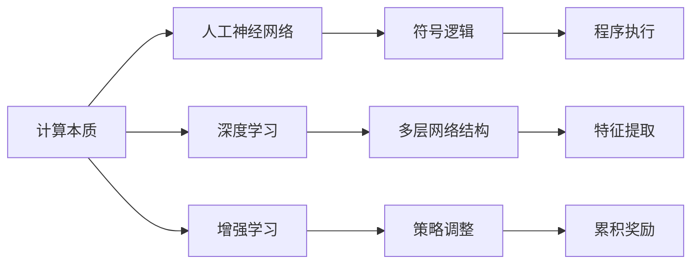

                 

# Andrej Karpathy：计算的本质正在变化

## 1. 背景介绍

Andrej Karpathy，计算机科学家、人工智能领域的先驱和领导者，斯坦福大学的计算机科学教授，以其在深度学习、计算机视觉、自动驾驶等方面的突破性工作闻名于世。作为一名在计算机程序设计艺术上有着深厚造诣的大师级人物，Andrej Karpathy的观点总是具有前瞻性和洞察力，能够引发广泛共鸣。

最近，他在Twitter上发表了一系列关于计算本质的观点，引发了业界的热烈讨论。在这篇文章中，我们整理了Andrej Karpathy的演讲内容，深度探讨计算本质正在变化的背后原因，并试图为未来的计算技术提供一些新的思考。

## 2. 核心概念与联系

在深入探讨之前，我们先对Andrej Karpathy提出的核心概念进行概括，并分析这些概念之间的联系。

### 2.1 核心概念概述

Andrej Karpathy主要讨论了以下几个核心概念：

- **计算本质**：计算的本质是指计算机如何处理和理解信息。传统的计算模型基于符号逻辑和程序执行，但现代深度学习和神经网络的出现，使得计算的本质发生了变化。
- **人工神经网络**：人工神经网络是一种受到生物神经网络启发的计算模型，通过训练数据来学习输入和输出之间的映射关系，具有自适应和高度并行化的特点。
- **深度学习**：深度学习是人工神经网络的一种特殊形式，通过多层网络结构来提取数据的高级特征，从而实现更复杂的任务，如图像识别、自然语言处理等。
- **增强学习**：增强学习是一种机器学习方法，通过与环境的交互，不断调整策略以最大化累积奖励，广泛应用于游戏、机器人等领域。

这些概念之间的关系可以用以下的Mermaid流程图表示：



这个流程图展示了计算本质的演变过程。从符号逻辑和程序执行，逐步过渡到以多层网络结构为核心的深度学习，再到通过策略调整优化的增强学习。每个概念都是计算技术演进的重要组成部分，它们之间的联系逐渐变得紧密，共同推动着计算技术的进步。

### 2.2 概念间的关系

从流程图可以看出，这些核心概念之间的联系主要体现在两个方面：

1. **继承与发展**：深度学习继承了人工神经网络的基本框架，增强学习又从深度学习中延伸出更加灵活和智能的策略调整机制。
2. **互相促进**：深度学习为增强学习提供了强大的特征提取能力，使得策略调整更加精准；增强学习则为深度学习提供了更加真实和复杂的学习场景，促进了深度学习的进一步发展。

这些联系构成了现代计算技术的核心框架，推动着其在各领域的广泛应用。

## 3. 核心算法原理 & 具体操作步骤

Andrej Karpathy的演讲中，深入探讨了深度学习和增强学习的核心算法原理，并给出了具体的操作步骤。

### 3.1 算法原理概述

深度学习的核心算法原理基于反向传播算法。反向传播算法通过计算损失函数对每个参数的梯度，从而更新模型参数，使得模型输出尽可能接近真实标签。增强学习的核心算法原理则基于Q-learning，通过模拟环境的奖励信号，不断调整策略参数，以最大化累积奖励。

### 3.2 算法步骤详解

以深度学习中的卷积神经网络为例，训练过程主要分为以下几个步骤：

1. **数据准备**：收集并预处理训练数据，将其分为训练集、验证集和测试集。
2. **模型初始化**：选择适当的神经网络架构，如卷积神经网络，并初始化网络参数。
3. **前向传播**：将训练数据输入网络，计算输出。
4. **损失计算**：计算输出与真实标签之间的损失，如交叉熵损失。
5. **反向传播**：根据损失对每个参数计算梯度。
6. **参数更新**：使用梯度下降等优化算法更新网络参数。
7. **验证和测试**：在验证集和测试集上评估模型性能，确保模型泛化能力。

增强学习的训练过程则略有不同：

1. **环境模拟**：定义训练环境，包括状态、动作、奖励等。
2. **策略初始化**：选择一个初始策略，如随机策略。
3. **策略评估**：通过与环境的交互，计算当前策略的累积奖励。
4. **策略调整**：使用Q-learning等算法更新策略参数。
5. **重复迭代**：重复以上步骤，直到策略收敛。

### 3.3 算法优缺点

深度学习的优点在于其强大的特征提取能力和自适应性，能够处理复杂的非线性关系。缺点在于模型容易过拟合，需要大量的标注数据和计算资源。

增强学习的优点在于其高度的自适应性和智能性，能够不断优化策略以适应环境变化。缺点在于环境模拟和策略调整的复杂度较高，对模型设计要求高。

### 3.4 算法应用领域

深度学习在图像识别、自然语言处理、语音识别等任务上取得了巨大成功，广泛应用于计算机视觉、自然语言处理、自动驾驶等领域。增强学习则在机器人控制、游戏AI、推荐系统等场景中展现了其强大的应用潜力。

## 4. 数学模型和公式 & 详细讲解 & 举例说明

Andrej Karpathy的演讲中，对深度学习中的卷积神经网络和增强学习中的Q-learning算法进行了详细的数学建模和公式推导。

### 4.1 数学模型构建

卷积神经网络主要由卷积层、池化层、全连接层等组成。其中，卷积层通过卷积操作提取局部特征，池化层则通过降采样操作降低特征维度，全连接层则将提取的特征映射到输出空间。数学模型可以表示为：

$$
y = W_1 \sigma(W_2 x + b_2) + b_1
$$

其中，$x$ 表示输入数据，$W_1$ 和 $W_2$ 表示卷积核，$\sigma$ 表示激活函数，$b_1$ 和 $b_2$ 表示偏置项。

Q-learning算法的数学模型则可以表示为：

$$
Q(s,a) = r + \gamma \max_a Q(s',a')
$$

其中，$s$ 表示当前状态，$a$ 表示动作，$r$ 表示即时奖励，$s'$ 表示下一个状态，$a'$ 表示下一个动作，$\gamma$ 表示折扣因子。

### 4.2 公式推导过程

以卷积神经网络的反向传播算法为例，其公式推导过程如下：

1. **前向传播**：
$$
y = W_1 \sigma(W_2 x + b_2) + b_1
$$

2. **损失函数**：
$$
J = \frac{1}{N} \sum_{i=1}^N \left( y_i - \hat{y}_i \right)^2
$$

3. **梯度计算**：
$$
\frac{\partial J}{\partial W_1} = -2 \left( W_2^T \left( \sigma(W_2 x + b_2 + b_1) - y \right) \right)
$$

4. **参数更新**：
$$
W_1 \leftarrow W_1 - \eta \frac{\partial J}{\partial W_1}
$$

其中，$\eta$ 表示学习率。

以Q-learning算法为例，其公式推导过程如下：

1. **策略评估**：
$$
Q(s,a) = r + \gamma \max_a Q(s',a')
$$

2. **策略调整**：
$$
Q(s,a) \leftarrow Q(s,a) + \alpha (r + \gamma \max_a Q(s',a') - Q(s,a))
$$

其中，$\alpha$ 表示学习率，$\gamma$ 表示折扣因子。

### 4.3 案例分析与讲解

以AlphaGo为例，AlphaGo通过增强学习实现了在围棋领域的突破。具体步骤如下：

1. **环境模拟**：定义围棋游戏环境，包括棋盘状态、棋子颜色、游戏规则等。
2. **策略初始化**：选择一个初始策略，如随机下棋。
3. **策略评估**：通过与环境的交互，计算当前策略的累积奖励。
4. **策略调整**：使用Q-learning算法更新策略参数。
5. **重复迭代**：重复以上步骤，直到策略收敛。

AlphaGo通过这种方式不断优化策略，最终在围棋领域取得了显著的胜利，展现出了强大的智能性。

## 5. 项目实践：代码实例和详细解释说明

以下是一个使用TensorFlow实现卷积神经网络的代码实例：

```python
import tensorflow as tf
from tensorflow.keras import layers

# 定义模型
model = tf.keras.Sequential([
    layers.Conv2D(32, (3, 3), activation='relu', input_shape=(28, 28, 1)),
    layers.MaxPooling2D((2, 2)),
    layers.Conv2D(64, (3, 3), activation='relu'),
    layers.MaxPooling2D((2, 2)),
    layers.Flatten(),
    layers.Dense(64, activation='relu'),
    layers.Dense(10)
])

# 编译模型
model.compile(optimizer=tf.keras.optimizers.Adam(0.001), loss=tf.keras.losses.SparseCategoricalCrossentropy(from_logits=True), metrics=['accuracy'])

# 训练模型
model.fit(train_images, train_labels, epochs=5, validation_data=(test_images, test_labels))

# 评估模型
model.evaluate(test_images, test_labels)
```

该代码实例展示了使用TensorFlow实现一个简单的卷积神经网络，并在MNIST数据集上进行训练和评估。通过逐步添加卷积层、池化层和全连接层，可以逐渐提高模型的复杂度和表现能力。

## 6. 实际应用场景

Andrej Karpathy在演讲中提到了多个实际应用场景，这些场景展示了计算技术在不同领域的广泛应用：

### 6.1 计算机视觉

计算机视觉领域是深度学习应用最广泛的领域之一。通过卷积神经网络，计算机可以自动识别和理解图像中的物体、场景等，广泛应用于医学影像分析、自动驾驶、安防监控等场景。

### 6.2 自然语言处理

自然语言处理领域通过深度学习模型实现了机器翻译、文本摘要、情感分析等功能，广泛应用于智能客服、智能写作、智能搜索等场景。

### 6.3 自动驾驶

自动驾驶技术通过增强学习算法，使汽车能够自主决策和控制，广泛应用于无人驾驶、智能交通等领域。

### 6.4 游戏AI

游戏AI通过增强学习算法，使计算机游戏玩家能够自主学习和策略调整，广泛应用于电子竞技、智能推荐等场景。

## 7. 工具和资源推荐

为了帮助开发者更好地理解和应用Andrej Karpathy的观点，我们推荐以下学习资源和开发工具：

### 7.1 学习资源推荐

1. Andrej Karpathy的官方博客：提供了大量的技术文章、演讲视频和课程资源，涵盖深度学习、计算机视觉、自动驾驶等多个领域。
2. TensorFlow官方文档：提供了完整的深度学习框架使用指南和API参考，适合初学者和高级用户使用。
3. PyTorch官方文档：提供了深度学习框架的使用指南和API参考，适合研究人员和开发者使用。
4. Coursera深度学习课程：由斯坦福大学开设，系统介绍了深度学习的基本概念和实践技巧，适合各层次学习者使用。
5. Udacity深度学习纳米学位课程：提供了完整的深度学习项目开发和实战经验，适合有志于深度学习开发和应用的学习者。

### 7.2 开发工具推荐

1. TensorFlow：由Google开发的深度学习框架，提供了丰富的API和预训练模型，适合大规模项目开发。
2. PyTorch：由Facebook开发的深度学习框架，提供了动态计算图和自动微分功能，适合研究和实验。
3. Jupyter Notebook：用于编写和运行Python代码的交互式环境，适合数据科学和机器学习开发。
4. Google Colab：由Google提供的免费云端Jupyter Notebook环境，支持GPU计算，适合大规模实验和训练。
5. NVIDIA DeepLearning SDK：提供了GPU计算资源和优化工具，适合深度学习模型的训练和部署。

### 7.3 相关论文推荐

1. "Convolutional Neural Networks for Visual Recognition"（AlexNet论文）：首次展示了卷积神经网络在图像识别任务上的强大表现，开启了深度学习在计算机视觉领域的突破。
2. "Playing Atari with Deep Reinforcement Learning"：通过增强学习算法实现了在Atari游戏中的突破，展示了深度学习在游戏AI领域的潜力。
3. "Attention Is All You Need"：提出Transformer模型，展示了自注意力机制在自然语言处理中的巨大潜力。
4. "A Survey on Deep Learning Techniques for Recommender Systems"：总结了深度学习在推荐系统中的应用和优化方法，适合推荐系统开发者参考。
5. "AlphaGo Zero"：介绍了AlphaGoZero的训练过程和策略优化方法，展示了增强学习在棋类游戏中的优势。

## 8. 总结：未来发展趋势与挑战

Andrej Karpathy的演讲为我们揭示了计算本质的变化和未来发展方向，同时也指出了当前面临的挑战。

### 8.1 研究成果总结

Andrej Karpathy的演讲涵盖了大语言模型、深度学习、增强学习等多个领域的研究成果，展示了计算技术的快速发展和广泛应用。其中，深度学习和增强学习成为计算技术的核心，推动了各领域的突破性进展。

### 8.2 未来发展趋势

未来，计算技术将继续向以下几个方向发展：

1. **更加智能的AI系统**：通过深度学习和增强学习，AI系统将变得更加智能和自适应，能够自主学习和优化策略，广泛应用于各领域。
2. **多模态计算**：计算机将具备处理文本、图像、语音等多种模态数据的能力，实现更加全面的信息理解和处理。
3. **边缘计算**：计算能力将逐渐向边缘设备（如手机、智能家居等）转移，实现更加智能和实时化的应用。
4. **量子计算**：量子计算技术将带来计算能力的飞跃，解决当前深度学习中的大规模计算和复杂优化问题。

### 8.3 面临的挑战

虽然计算技术的发展带来了诸多机遇，但也面临着以下挑战：

1. **数据隐私和安全**：大规模数据收集和处理带来了数据隐私和安全问题，需要建立更加严格的数据保护机制。
2. **计算资源不足**：深度学习和大规模计算需要大量的计算资源，当前计算能力有限，需要进一步提高计算效率。
3. **算法透明性和可解释性**：AI系统的决策过程难以解释，需要建立透明性和可解释性的机制，确保系统的公平和可信性。
4. **伦理和道德问题**：AI系统的应用可能带来伦理和道德问题，需要建立伦理框架，确保系统应用的公正性和安全性。

### 8.4 研究展望

未来，计算技术的突破将依赖于以下几个方面的研究：

1. **深度学习和增强学习的融合**：探索深度学习和增强学习的融合机制，实现更加智能和自适应的AI系统。
2. **多模态数据的处理**：研究多模态数据的处理和融合方法，实现更加全面和准确的信息理解和处理。
3. **计算资源的优化**：研究计算资源的优化和高效利用方法，提高计算效率和可扩展性。
4. **算法透明性和可解释性**：研究AI系统的透明性和可解释性方法，确保系统的公平和可信性。
5. **伦理和道德框架的建立**：研究AI系统的伦理和道德问题，建立伦理框架，确保系统应用的公正性和安全性。

## 9. 附录：常见问题与解答

**Q1: 深度学习与传统机器学习的区别是什么？**

A: 深度学习与传统机器学习的区别在于其对数据结构和复杂关系的处理能力。深度学习通过多层神经网络结构，能够自动提取数据的高阶特征，处理复杂的非线性关系；而传统机器学习则主要依赖手工设计的特征工程，处理线性和局部关系。

**Q2: 增强学习算法如何避免过拟合？**

A: 增强学习算法通过不断与环境交互，动态调整策略参数，避免模型过拟合。具体而言，可以通过引入探索策略和随机初始化，增强模型的泛化能力。

**Q3: 如何提高AI系统的可解释性？**

A: 提高AI系统的可解释性可以从多个方面入手，如模型简化、特征解释、决策路径可视化等。此外，还可以引入符号化的先验知识，辅助解释AI系统的决策过程。

**Q4: 未来AI系统的发展方向是什么？**

A: 未来AI系统的发展方向包括更加智能的AI系统、多模态计算、边缘计算、量子计算等。这些方向将推动AI技术在更多领域的应用，带来更多的创新和机遇。

**Q5: 如何平衡数据隐私和AI系统的应用？**

A: 在AI系统的应用过程中，需要建立严格的数据隐私保护机制，如数据匿名化、加密传输等，确保数据的安全性和隐私性。同时，还需要建立透明性和可解释性的机制，确保AI系统的公正性和可信性。

---

作者：禅与计算机程序设计艺术 / Zen and the Art of Computer Programming

