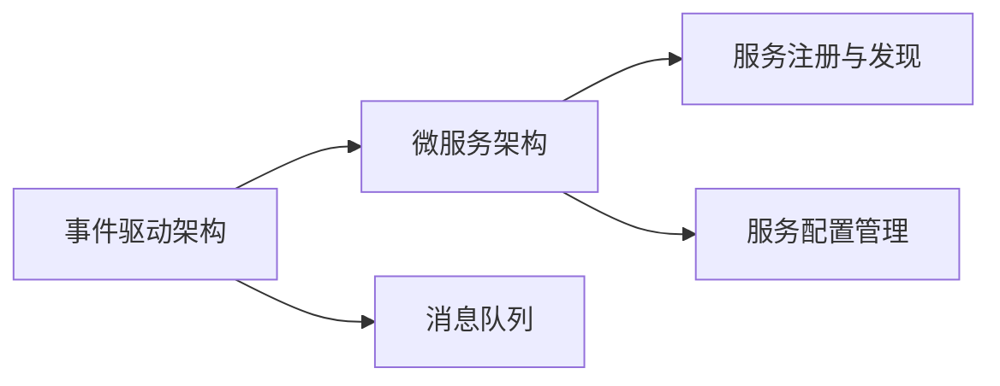

                 

# CEP 原理与代码实例讲解

> 关键词：事件驱动架构(CEP), 微服务架构, 异步通信, 消息队列, 容错与可靠性, 开发与部署

## 1. 背景介绍

### 1.1 问题由来

在现代软件开发实践中，微服务架构(微服务)和事件驱动架构(事件驱动)成为了非常流行的一种设计范式。微服务通过将大应用拆分成多个独立的小服务，提高了系统的灵活性、可扩展性和可维护性。事件驱动架构则通过事件消息进行异步通信，打破了服务的边界，使得系统的响应速度快、容错能力强。两者结合后，可以构建出更灵活、可伸缩、可扩展的系统，但同时也增加了系统的复杂性和挑战。

事件驱动架构的核心组件是消息队列，它负责将异步消息进行分发和存储。但消息队列本身也面临诸多挑战，如消息丢失、重复消费、消息堆积、消息乱序等问题，这些问题会严重影响系统的可靠性和性能。此外，传统的消息队列难以适应分布式系统的需求，缺乏自动化的重试机制、断路器、限流等。因此，在微服务架构中，如何高效、可靠地使用消息队列成为了一个重要的课题。

### 1.2 问题核心关键点

事件驱动架构的关键点包括：
1. 异步通信：消息队列通过异步消息传递实现服务间的通信，提高了系统的响应速度和并发能力。
2. 消息持久化：消息队列将消息持久化存储，提高了系统的可靠性和容错性。
3. 消息路由：消息队列根据消息类型进行路由，提高了系统的灵活性和可扩展性。
4. 消息重试：消息队列提供自动化的重试机制，提高了系统的容错性。
5. 消息过滤：消息队列支持消息过滤和订阅机制，提高了系统的性能和扩展性。

## 2. 核心概念与联系

### 2.1 核心概念概述

为更好地理解事件驱动架构，我们需要掌握以下几个核心概念：

- 事件驱动架构(Event-Driven Architecture, EDA)：以事件消息为中心，通过异步通信实现服务间通信的一种架构风格。

- 微服务架构(Microservice Architecture)：将大应用拆分成多个小服务，每个服务实现单一职责，各服务之间通过API或消息进行通信的架构风格。

- 消息队列(Message Queue)：将异步消息进行持久化存储和分发的组件。

- 服务注册与发现(Service Registry and Discovery)：用于管理服务实例和服务实例发现机制的组件。

- 服务配置管理(Service Configuration Management)：用于管理服务的配置信息，支持动态配置。

这些概念之间存在着紧密的联系，通过消息队列实现服务间的异步通信，是事件驱动架构和微服务架构的核心。服务注册与发现和配置管理，则支持了微服务架构的灵活性和可扩展性。

### 2.2 概念间的关系

事件驱动架构、微服务架构和消息队列三者之间存在着紧密的联系，可以通过以下Mermaid流程图来展示：



这个流程图展示了事件驱动架构、微服务架构和消息队列三者之间的联系：

1. 事件驱动架构通过消息队列实现异步通信，打破了服务的边界。
2. 微服务架构将大应用拆分成多个独立的小服务，每个服务通过API或消息与消息队列进行通信。
3. 服务注册与发现和配置管理，支持微服务架构的灵活性和可扩展性。

## 3. 核心算法原理 & 具体操作步骤

### 3.1 算法原理概述

事件驱动架构的核心是消息队列，消息队列负责将异步消息进行分发和存储。消息队列采用异步非阻塞的方式，使得系统具有良好的性能和可扩展性。消息队列通常包含以下几个组件：

1. **消息生产者**：生产消息的业务系统。
2. **消息消费者**：接收消息并进行处理的业务系统。
3. **消息队列**：存储和分发消息的组件。
4. **消息订阅者**：订阅特定类型的消息的业务系统。

事件驱动架构的流程如下：

1. 消息生产者发送消息到消息队列。
2. 消息队列存储消息，并将消息异步分发至对应的消息消费者。
3. 消息消费者接收消息并进行处理。
4. 消息消费者处理完成后，将处理结果发送回消息队列。
5. 消息队列将结果异步通知消息订阅者。

### 3.2 算法步骤详解

事件驱动架构的实现主要分为以下步骤：

**Step 1: 选择合适的消息队列组件**

- 选择合适的消息队列组件，如RabbitMQ、Kafka、ActiveMQ等，根据系统的需求选择。
- 配置消息队列实例，并进行必要的集群部署。

**Step 2: 设计消息模型**

- 设计消息的实体类和接口，定义消息的元数据，如消息类型、业务键、优先级、时间戳等。
- 定义消息的生产者和消费者接口，以及消息订阅者的接口。

**Step 3: 实现消息生产者和消费者**

- 实现消息生产者，将业务逻辑封装成消息实体，并将消息发送至消息队列。
- 实现消息消费者，订阅特定类型的消息，并处理消息。

**Step 4: 实现消息订阅者**

- 实现消息订阅者，订阅特定类型的消息，并根据消息进行处理。

**Step 5: 实现服务注册与发现和配置管理**

- 实现服务注册与发现，将服务的实例注册到注册中心，并动态发现服务实例。
- 实现服务配置管理，支持动态配置和配置变化后的热部署。

**Step 6: 启动服务**

- 启动消息生产者、消费者、订阅者、注册中心、配置管理服务，并进行必要的监控和日志记录。

### 3.3 算法优缺点

事件驱动架构具有以下优点：

1. 异步通信：消息队列通过异步消息传递实现服务间的通信，提高了系统的响应速度和并发能力。
2. 松耦合：服务间通过消息进行通信，降低了服务间的耦合度，提高了系统的可维护性和可扩展性。
3. 可靠性：消息队列将消息持久化存储，提高了系统的可靠性和容错性。
4. 灵活性：消息队列支持消息过滤和订阅机制，提高了系统的性能和扩展性。

但同时也存在以下缺点：

1. 延迟：消息队列中的消息需要通过异步方式进行传递，可能会引入一定的延迟。
2. 系统复杂度：事件驱动架构的系统设计复杂，需要考虑消息的可靠性、消息的路由、消息的重试等问题。
3. 维护成本高：由于服务间的解耦合度增加，系统维护成本也会相应增加。

### 3.4 算法应用领域

事件驱动架构广泛应用于各种复杂的分布式系统中，如电子商务、金融、物流、物联网等。在电商系统中，可以用于订单系统、库存系统、营销系统等模块的异步通信。在金融系统中，可以用于清算系统、风险管理系统、交易系统等模块的异步通信。在物流系统中，可以用于订单处理系统、仓库管理系统、配送管理系统等模块的异步通信。在物联网系统中，可以用于设备数据采集、设备状态监控、设备告警等模块的异步通信。

## 4. 数学模型和公式 & 详细讲解 & 举例说明

### 4.1 数学模型构建

事件驱动架构的数学模型主要涉及消息的存储和分发过程。我们可以将事件驱动架构的数学模型建模为一个有向无环图(DAG)。在DAG中，节点表示消息队列，边表示消息的流动方向。消息队列的节点包括：

- 消息生产者节点：表示生产消息的业务系统。
- 消息消费者节点：表示接收消息并进行处理的业务系统。
- 消息订阅者节点：表示订阅特定类型的消息的业务系统。

消息的流动方向为：

- 消息生产者节点 --> 消息队列节点
- 消息队列节点 --> 消息消费者节点
- 消息队列节点 --> 消息订阅者节点

### 4.2 公式推导过程

事件驱动架构的消息传递过程可以用以下公式表示：

$$
\begin{aligned}
&producer: \text{send}(m, queue) \\
&queue: \text{receive}(m) \\
&consumer: \text{consume}(m) \\
&subscriber: \text{subscribe}(m)
\end{aligned}
$$

其中，$producer$ 表示消息生产者，$consumer$ 表示消息消费者，$subscriber$ 表示消息订阅者，$queue$ 表示消息队列，$m$ 表示消息实体。

在公式中，$producer$ 和 $queue$ 之间的关系为发送消息，$queue$ 和 $consumer$ 之间的关系为接收消息，$queue$ 和 $subscriber$ 之间的关系为订阅消息。

### 4.3 案例分析与讲解

假设有一个电商订单系统，订单系统分为订单服务、库存服务和配送服务三个模块。订单服务负责接收用户订单信息，库存服务负责库存管理，配送服务负责配送管理。订单服务与库存服务、配送服务通过消息队列进行异步通信。

1. 订单服务接收到用户订单信息后，将订单信息发送至消息队列。
2. 消息队列接收订单信息，并将订单信息分发到库存服务、配送服务。
3. 库存服务接收订单信息后，查询库存情况，并将库存信息发送回消息队列。
4. 配送服务接收订单信息后，根据库存信息安排配送计划，并将配送计划发送回消息队列。
5. 消息队列将配送计划异步通知订单服务。
6. 订单服务接收到配送计划后，进行订单状态更新。

通过以上过程，订单系统通过消息队列实现了订单、库存、配送三个模块之间的异步通信，提高了系统的响应速度和并发能力。

## 5. 项目实践：代码实例和详细解释说明

### 5.1 开发环境搭建

在进行事件驱动架构实践前，我们需要准备好开发环境。以下是使用Java进行Spring Boot开发的环境配置流程：

1. 安装Java：从官网下载并安装Java JDK。
2. 安装Maven：从官网下载并安装Maven。
3. 创建项目：使用Spring Initializr工具创建Spring Boot项目。
4. 配置消息队列：在项目中引入消息队列组件，如RabbitMQ、Kafka等，并配置好相关属性。
5. 配置服务注册与发现：在项目中引入服务注册与发现组件，如Eureka、Consul等，并进行必要的集群部署。
6. 配置服务配置管理：在项目中引入配置管理组件，如Spring Cloud Config等，并配置好相关的配置信息。

完成上述步骤后，即可在Spring Boot环境下开始事件驱动架构实践。

### 5.2 源代码详细实现

下面我们以RabbitMQ为例，给出使用Spring Boot实现事件驱动架构的代码实现。

首先，定义消息模型：

```java
public class OrderMessage {
    private Long orderId;
    private String orderStatus;

    // getters and setters
}
```

然后，定义消息生产者：

```java
@Component
public class OrderProducer {
    @Autowired
    private QueueMessageSender messageSender;

    public void sendOrder(OrderMessage orderMessage) {
        messageSender.send(orderMessage);
    }
}
```

接着，定义消息消费者：

```java
@Component
public class InventoryConsumer {
    @Autowired
    private QueueMessageReceiver messageReceiver;

    public void consumeOrder(OrderMessage orderMessage) {
        // 处理订单信息
        // 查询库存信息
        // 发送库存信息
    }
}

@Component
public class DeliveryConsumer {
    @Autowired
    private QueueMessageReceiver messageReceiver;

    public void consumeOrder(OrderMessage orderMessage) {
        // 处理订单信息
        // 安排配送计划
        // 发送配送计划
    }
}
```

最后，定义消息订阅者：

```java
@Component
public class OrderSubscriber {
    @Autowired
    private QueueMessageReceiver messageReceiver;

    public void subscribeOrder(OrderMessage orderMessage) {
        // 处理订单信息
    }
}
```

在以上代码中，`OrderMessage` 表示订单信息，`OrderProducer` 表示消息生产者，`OrderConsumer` 表示消息消费者，`OrderSubscriber` 表示消息订阅者。`QueueMessageSender` 和 `QueueMessageReceiver` 表示消息队列的发送和接收接口。

### 5.3 代码解读与分析

让我们再详细解读一下关键代码的实现细节：

**OrderMessage类**：
- 定义了订单信息的实体类，包含订单ID和订单状态。

**OrderProducer类**：
- 使用Spring的依赖注入注解 `@Autowired`，注入 `QueueMessageSender` 接口。
- 实现 `sendOrder` 方法，将订单信息发送至消息队列。

**InventoryConsumer类和DeliveryConsumer类**：
- 使用Spring的依赖注入注解 `@Autowired`，注入 `QueueMessageReceiver` 接口。
- 实现 `consumeOrder` 方法，订阅特定类型的消息，并处理消息。

**OrderSubscriber类**：
- 使用Spring的依赖注入注解 `@Autowired`，注入 `QueueMessageReceiver` 接口。
- 实现 `subscribeOrder` 方法，订阅特定类型的消息，并处理消息。

在以上代码中，我们使用Spring框架的依赖注入机制，将消息的生产、消费、订阅等功能封装成独立的组件，通过消息队列进行异步通信。这种设计方式提高了系统的可维护性和可扩展性。

### 5.4 运行结果展示

假设我们在RabbitMQ上部署了上述系统，并通过测试用例验证了消息的异步通信过程。以下是一个简单的测试用例：

1. 启动订单服务，发送订单信息。
2. 订单服务将订单信息发送至RabbitMQ消息队列。
3. 启动库存服务和配送服务，分别订阅订单信息。
4. 库存服务和配送服务接收到订单信息后，进行相应的处理。
5. 库存服务查询库存信息，并将库存信息发送回RabbitMQ消息队列。
6. 配送服务根据库存信息安排配送计划，并将配送计划发送回RabbitMQ消息队列。
7. 订单服务接收到配送计划后，进行订单状态更新。

通过以上过程，订单系统通过RabbitMQ消息队列实现了订单、库存、配送三个模块之间的异步通信，提高了系统的响应速度和并发能力。

## 6. 实际应用场景

### 6.1 智能物流系统

事件驱动架构在智能物流系统中有着广泛的应用。物流系统中的订单、仓库、配送等模块之间需要通过消息队列进行异步通信。通过事件驱动架构，可以提高系统的响应速度、容错性和可扩展性，确保订单的准确性和及时性。

在物流系统中，订单服务接收到用户订单信息后，将订单信息发送至消息队列。消息队列将订单信息分发到库存服务、配送服务。库存服务接收到订单信息后，查询库存情况，并将库存信息发送回消息队列。配送服务接收到订单信息后，根据库存信息安排配送计划，并将配送计划发送回消息队列。订单服务接收到配送计划后，进行订单状态更新。

通过事件驱动架构，智能物流系统可以实现订单、库存、配送等模块之间的异步通信，提高系统的响应速度和并发能力。同时，系统还可以灵活地扩展新的模块和功能，满足不同的业务需求。

### 6.2 金融交易系统

在金融交易系统中，订单、清算、风险管理等模块之间需要通过消息队列进行异步通信。通过事件驱动架构，可以提高系统的响应速度、容错性和可扩展性，确保交易的准确性和及时性。

在金融交易系统中，订单服务接收到用户订单信息后，将订单信息发送至消息队列。消息队列将订单信息分发到清算服务、风险管理服务。清算服务接收到订单信息后，进行清算操作，并将清算结果发送回消息队列。风险管理服务接收到订单信息后，进行风险评估，并将风险结果发送回消息队列。订单服务接收到风险结果后，进行订单状态更新。

通过事件驱动架构，金融交易系统可以实现订单、清算、风险管理等模块之间的异步通信，提高系统的响应速度和并发能力。同时，系统还可以灵活地扩展新的模块和功能，满足不同的业务需求。

### 6.3 智能制造系统

在智能制造系统中，订单、生产、质量控制等模块之间需要通过消息队列进行异步通信。通过事件驱动架构，可以提高系统的响应速度、容错性和可扩展性，确保订单的准确性和及时性。

在智能制造系统中，订单服务接收到用户订单信息后，将订单信息发送至消息队列。消息队列将订单信息分发到生产服务、质量控制服务。生产服务接收到订单信息后，进行生产操作，并将生产结果发送回消息队列。质量控制服务接收到订单信息后，进行质量检测，并将检测结果发送回消息队列。订单服务接收到检测结果后，进行订单状态更新。

通过事件驱动架构，智能制造系统可以实现订单、生产、质量控制等模块之间的异步通信，提高系统的响应速度和并发能力。同时，系统还可以灵活地扩展新的模块和功能，满足不同的业务需求。

## 7. 工具和资源推荐

### 7.1 学习资源推荐

为了帮助开发者系统掌握事件驱动架构的理论基础和实践技巧，这里推荐一些优质的学习资源：

1. Spring Cloud for Java Developers（Spring Cloud官方文档）：详细介绍了Spring Cloud框架的使用，包括消息队列、服务注册与发现、配置管理等组件的使用。

2. RabbitMQ in Action（RabbitMQ实战）：RabbitMQ的官方实战书籍，详细介绍了RabbitMQ的使用，包括消息生产、消费、路由等操作。

3. Spring Boot with Spring Cloud：Spring Cloud官方博客系列文章，详细介绍了Spring Boot框架与Spring Cloud组件的整合使用，包括消息队列、服务注册与发现、配置管理等组件的使用。

4. Kafka: The Definitive Guide（Kafka权威指南）：Kafka的官方权威指南，详细介绍了Kafka的使用，包括消息生产、消费、路由等操作。

5. Java Message Service（JMS）：JMS的官方文档，详细介绍了JMS的使用，包括消息生产、消费、路由等操作。

通过对这些资源的学习实践，相信你一定能够快速掌握事件驱动架构的精髓，并用于解决实际的业务问题。

### 7.2 开发工具推荐

高效的开发离不开优秀的工具支持。以下是几款用于事件驱动架构开发的常用工具：

1. RabbitMQ：开源的消息队列组件，支持异步消息传递、消息过滤、消息重试等功能。

2. Kafka：开源的消息队列组件，支持高吞吐量、高可靠性、高可用性等特性。

3. Spring Boot：基于Spring框架的微服务开发框架，支持消息队列、服务注册与发现、配置管理等功能。

4. Spring Cloud：基于Spring Boot的微服务架构开发框架，支持消息队列、服务注册与发现、配置管理等功能。

5. Spring Integration：基于Spring Framework的消息处理框架，支持消息路由、消息转换等功能。

合理利用这些工具，可以显著提升事件驱动架构的开发效率，加快创新迭代的步伐。

### 7.3 相关论文推荐

事件驱动架构的研究源于学界的持续研究。以下是几篇奠基性的相关论文，推荐阅读：

1. Event-Driven Architecture: A Guide to Microservices（微服务架构指南）：Wikipedia的文章，详细介绍了微服务架构和事件驱动架构的基本概念和设计原则。

2. Decoupling Web Applications with a Message Broker（通过消息中间件解耦合Web应用）：C.cloud.com的文章，详细介绍了消息队列在Web应用中的使用。

3. Kafka: A Real-Time Distributed Stream Processing Platform（Kafka:一个实时分布式流处理平台）：Kafka的官方博客文章，详细介绍了Kafka的使用和设计思想。

4. RabbitMQ Essentials: Designing for Performance, Scalability, and Reliability（RabbitMQ基础：设计高性能、可扩展性和可靠性的系统）：O'Reilly出版社的文章，详细介绍了RabbitMQ的使用和设计思想。

5. Microservices in Production: C云微服务架构实战（生产环境中的微服务架构）：阿里云的博客文章，详细介绍了微服务架构在生产环境中的应用。

这些论文代表了大事件驱动架构的发展脉络。通过学习这些前沿成果，可以帮助研究者把握学科前进方向，激发更多的创新灵感。

除上述资源外，还有一些值得关注的前沿资源，帮助开发者紧跟事件驱动架构的最新进展，例如：

1. arXiv论文预印本：人工智能领域最新研究成果的发布平台，包括大量尚未发表的前沿工作，学习前沿技术的必读资源。

2. GitHub热门项目：在GitHub上Star、Fork数最多的消息队列和微服务项目，往往代表了该技术领域的发展趋势和最佳实践，值得去学习和贡献。

3. 技术会议直播：如KubeCon、SpringOne、QCon等人工智能领域顶会现场或在线直播，能够聆听到大佬们的前沿分享，开拓视野。

4. 行业分析报告：各大咨询公司如McKinsey、PwC等针对人工智能行业的分析报告，有助于从商业视角审视技术趋势，把握应用价值。

总之，对于事件驱动架构的学习和实践，需要开发者保持开放的心态和持续学习的意愿。多关注前沿资讯，多动手实践，多思考总结，必将收获满满的成长收益。

## 8. 总结：未来发展趋势与挑战

### 8.1 总结

本文对事件驱动架构的原理和代码实例进行了全面系统的介绍。首先阐述了事件驱动架构和微服务架构的基本概念和设计原则，明确了两者结合的必要性和重要性。其次，从原理到实践，详细讲解了消息队列的使用方法和实现步骤，给出了事件驱动架构项目开发的完整代码实例。同时，本文还广泛探讨了事件驱动架构在智能物流、金融交易、智能制造等多个行业领域的应用前景，展示了事件驱动架构的广泛适用性和强大的生命力。此外，本文精选了事件驱动架构的相关学习资源和工具，力求为读者提供全方位的技术指引。

通过本文的系统梳理，可以看到，事件驱动架构与微服务架构的结合，极大地提高了系统的灵活性、可扩展性和可维护性，提升了系统的响应速度和容错能力。事件驱动架构的应用已经渗透到各个行业，成为现代分布式系统中不可或缺的重要组成部分。

### 8.2 未来发展趋势

展望未来，事件驱动架构将呈现以下几个发展趋势：

1. 分布式事务管理：随着事件驱动架构在金融、电商等领域的应用，分布式事务管理变得越来越重要。未来的事件驱动架构将会更好地支持分布式事务，确保事务的一致性和可靠性。

2. 实时数据处理：事件驱动架构可以与实时数据处理系统进行无缝整合，支持事件数据的实时分析和处理。未来，事件驱动架构将更紧密地与大数据、流计算等技术结合，实现数据的实时处理和分析。

3. 跨服务治理：事件驱动架构需要更好地支持跨服务的治理，包括服务发现、服务路由、服务注册、服务配置等功能。未来的事件驱动架构将会更好地支持跨服务的治理，提高系统的灵活性和可扩展性。

4. 自动化部署：事件驱动架构需要更好地支持自动化的部署和运维，减少人为操作的干扰。未来的事件驱动架构将会更好地支持自动化部署和运维，提高系统的稳定性和可扩展性。

5. 事件驱动与DevOps结合：事件驱动架构需要更好地支持DevOps的流程，包括CI/CD、日志收集、监控告警等功能。未来的事件驱动架构将会更好地支持DevOps的流程，提高系统的开发效率和运营效率。

以上趋势凸显了事件驱动架构的广阔前景。这些方向的探索发展，必将进一步提升事件驱动架构系统的性能和应用范围，为分布式系统构建带来新的动力。

### 8.3 面临的挑战

尽管事件驱动架构已经取得了瞩目成就，但在迈向更加智能化、普适化应用的过程中，它仍面临着诸多挑战：

1. 系统复杂度：事件驱动架构的系统设计复杂，需要考虑消息的可靠性、消息的路由、消息的重试等问题。如何设计出更加简单、灵活、易维护的系统，将是未来的一大挑战。

2. 性能瓶颈：事件驱动架构的性能瓶颈主要来自于消息队列和消息处理器的性能问题。如何优化消息队列和消息处理器的性能，将是未来的一大挑战。

3. 安全性问题：事件驱动架构的系统安全性问题也需重视，如消息泄露、重放攻击、拒绝服务攻击等。如何增强系统的安全性，将是未来的一大挑战。

4. 数据一致性问题：事件驱动架构需要确保数据一致性，如消息丢失、消息乱序等问题。如何保证数据的一致性，将是未来的一大挑战。

5. 运维成本：事件驱动架构的系统运维成本较高，需要投入大量的人力、物力、财力。如何降低运维成本，提高系统的运维效率，将是未来的一大挑战。

6. 消息治理：事件驱动架构需要更好地支持消息的治理，包括消息路由、消息过滤、消息重试等。如何设计出更加简单、灵活、易维护的消息治理机制，将是未来的一大挑战。

面对这些挑战，未来的研究需要在以下几个方面寻求新的突破：

1. 优化消息队列和消息处理器的性能：使用高性能的消息队列和消息处理器，减少消息处理的延迟，提升系统的响应速度和并发能力。

2. 增强系统的安全性：使用加密技术、签名技术、访问控制等手段，增强系统的安全性，防止消息泄露、重放攻击、拒绝服务攻击等问题。

3. 保证数据的一致性：使用事务管理、消息重试、断路器等机制，保证数据的一致性，防止消息丢失、消息乱序等问题。

4. 降低系统的运维成本：使用自动化部署、容器化、微服务等技术，降低系统的运维成本，提高系统的运维效率。

5. 设计简单、灵活、易维护的系统：使用微服务、微服务治理、DevOps等技术，设计简单、灵活、易

