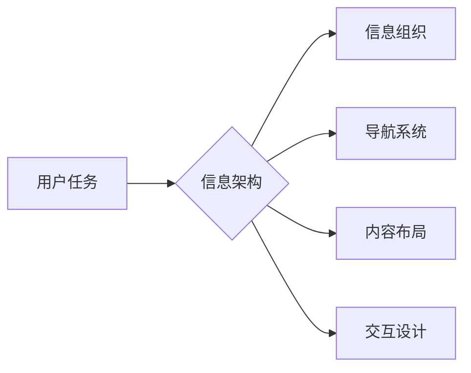

# 任务导向设计对信息架构的深远影响

> 关键词：任务导向设计，信息架构，用户体验，设计原则，设计流程，用户研究，交互设计

## 1. 背景介绍

在数字化时代，信息架构（Information Architecture，IA）作为设计和构建网站、应用和内容管理系统的基础，其重要性日益凸显。信息架构的目标是创建一个逻辑清晰、易于导航的系统，使用户能够快速找到所需信息。然而，随着用户需求和市场环境的不断变化，传统的信息架构设计方法面临着新的挑战。任务导向设计（Task-Oriented Design，TOD）作为一种新兴的设计理念，正在逐渐改变信息架构的构建方式，为用户提供更加个性化和高效的体验。

### 1.1 问题的由来

传统信息架构设计往往侧重于内容的组织和分类，而忽视了用户在实际使用过程中的具体需求和行为。这种设计方式容易导致以下问题：

- **用户难以找到目标信息**：缺乏对用户任务的理解，导致信息组织不符合用户的使用习惯。
- **用户体验不佳**：信息层次复杂，导航不够直观，用户在寻找信息时感到困惑和挫败。
- **内容更新和维护困难**：信息组织结构僵化，难以适应内容的变化和扩展。

### 1.2 研究现状

近年来，任务导向设计逐渐受到关注。它强调以用户为中心，关注用户的任务和目标，通过分析用户的操作流程，设计出更加符合用户使用习惯的信息架构。任务导向设计在信息架构领域的应用，主要体现在以下几个方面：

- **用户研究**：通过用户访谈、问卷调查、用户行为分析等方法，深入了解用户的需求和行为。
- **任务分析**：分析用户完成任务的过程，识别关键任务和操作流程。
- **信息架构设计**：根据用户任务和操作流程，设计合理的导航结构、信息布局和交互方式。

### 1.3 研究意义

任务导向设计对信息架构的深远影响主要体现在以下几个方面：

- **提升用户体验**：通过设计符合用户任务的信息架构，提高用户找到目标信息的效率，降低用户的学习成本。
- **增强内容可维护性**：灵活的信息架构设计能够更好地适应内容的变化和扩展，降低内容更新和维护的难度。
- **优化用户操作流程**：简化用户的操作步骤，减少用户操作错误，提高用户满意度。

### 1.4 本文结构

本文将围绕任务导向设计对信息架构的深远影响展开论述。文章结构如下：

- 第2部分，介绍任务导向设计和信息架构的核心概念及其联系。
- 第3部分，阐述任务导向设计的核心算法原理和具体操作步骤。
- 第4部分，讲解任务导向设计的数学模型和公式，并结合案例进行分析。
- 第5部分，通过项目实践，展示任务导向设计的代码实例和详细解释说明。
- 第6部分，探讨任务导向设计在实际应用场景中的应用，并展望未来发展。
- 第7部分，推荐任务导向设计相关的学习资源、开发工具和参考文献。
- 第8部分，总结研究成果，展望未来发展趋势和挑战。
- 第9部分，附录常见问题与解答。

## 2. 核心概念与联系

### 2.1 核心概念

#### 2.1.1 任务导向设计

任务导向设计是一种以用户任务为中心的设计方法。它关注用户在特定环境下的操作流程和目标，通过设计符合用户操作习惯的界面和交互方式，提高用户完成任务效率。

#### 2.1.2 信息架构

信息架构是组织、结构和标签化信息的方式，以帮助用户找到所需信息。它包括信息组织、导航系统、内容布局和交互设计等方面。

### 2.2 核心概念联系

任务导向设计和信息架构之间的关系如图所示：



图中的关系表明，任务导向设计是信息架构设计的基础，信息架构通过信息组织、导航系统、内容布局和交互设计等方面，实现任务导向设计的目标。

## 3. 核心算法原理 & 具体操作步骤

### 3.1 算法原理概述

任务导向设计的核心原理是：通过用户研究、任务分析、信息架构设计等步骤，构建符合用户任务的信息架构，从而提高用户体验。

### 3.2 算法步骤详解

#### 3.2.1 用户研究

- 用户访谈：与用户进行面对面的交流，了解用户的需求、使用习惯和痛点。
- 问卷调查：通过在线问卷收集大量用户数据，分析用户特征和需求。
- 用户行为分析：使用眼动追踪、点击热图等工具，分析用户在网站或应用上的行为。

#### 3.2.2 任务分析

- 任务分解：将用户任务分解为一系列子任务，明确每个子任务的目标和操作步骤。
- 任务关联：分析不同任务之间的关系，确定任务执行的先后顺序。
- 任务关键性：评估每个任务对用户目标实现的重要性。

#### 3.2.3 信息架构设计

- 信息组织：根据用户任务和操作流程，设计合理的分类体系，将信息进行组织。
- 导航系统：设计直观、易用的导航系统，帮助用户快速找到所需信息。
- 内容布局：根据用户视觉认知和操作习惯，设计合理的页面布局。
- 交互设计：设计符合用户操作习惯的交互方式，提高用户满意度。

### 3.3 算法优缺点

#### 3.3.1 优点

- 提高用户体验：符合用户任务的信息架构设计，能够提高用户找到目标信息的效率，降低用户的学习成本。
- 增强内容可维护性：灵活的信息架构设计能够更好地适应内容的变化和扩展，降低内容更新和维护的难度。
- 优化用户操作流程：简化用户的操作步骤，减少用户操作错误，提高用户满意度。

#### 3.3.2 缺点

- 设计成本较高：需要进行大量的用户研究和任务分析，设计过程较为复杂，需要投入更多的时间和资源。
- 需要持续迭代：随着用户需求和市场环境的变化，信息架构需要不断迭代更新，以适应新的需求。

### 3.4 算法应用领域

任务导向设计在以下领域得到了广泛应用：

- 网站设计
- 移动应用设计
- 企业信息系统设计
- 电子商务平台设计

## 4. 数学模型和公式 & 详细讲解 & 举例说明

### 4.1 数学模型构建

任务导向设计的数学模型可以通过以下公式进行描述：

$$
U = f(I, A, N)
$$

其中，$U$ 代表用户体验，$I$ 代表信息架构，$A$ 代表用户能力，$N$ 代表用户需求。

### 4.2 公式推导过程

公式推导过程如下：

- 用户体验 $U$ 是由信息架构 $I$、用户能力 $A$ 和用户需求 $N$ 共同决定的。
- 信息架构 $I$ 通过组织、导航、布局和交互等方面，为用户提供便捷的信息获取途径。
- 用户能力 $A$ 指用户在特定任务中的技能和知识水平。
- 用户需求 $N$ 指用户在完成任务过程中所需的信息和资源。

### 4.3 案例分析与讲解

#### 4.3.1 案例一：电子商务网站

某电子商务网站希望通过任务导向设计提升用户体验，以下是对其信息架构设计的分析：

- **用户研究**：通过用户访谈和问卷调查，发现用户在购物过程中主要关注商品搜索、浏览、比价和购买等任务。
- **任务分析**：将用户购物任务分解为搜索、浏览、比价和购买等子任务，并分析任务之间的关系。
- **信息架构设计**：
  - 信息组织：根据商品类别、价格、品牌等进行分类，方便用户快速找到所需商品。
  - 导航系统：设计直观的导航栏，包括首页、搜索、分类、购物车等，方便用户进行操作。
  - 内容布局：将商品图片、价格、评价等信息清晰地展示给用户。
  - 交互设计：提供便捷的搜索、筛选、排序等功能，方便用户进行商品比价和购买。

通过任务导向设计，该电子商务网站的用户体验得到了显著提升，用户购物效率提高，满意度增强。

## 5. 项目实践：代码实例和详细解释说明

### 5.1 开发环境搭建

本案例以Python编程语言为例，介绍如何使用代码实现任务导向设计的信息架构。

### 5.2 源代码详细实现

```python
# 定义信息架构类
class InformationArchitecture:
    def __init__(self, tasks):
        self.tasks = tasks
        self.navigation = {}
        self.layout = {}
        self.interaction = {}

    def organize_information(self):
        # 根据任务组织信息
        for task in self.tasks:
            self.navigation[task] = self.create_navigation(task)
            self.layout[task] = self.create_layout(task)
            self.interaction[task] = self.create_interaction(task)

    def create_navigation(self, task):
        # 创建导航系统
        navigation = {
            'home': '首页',
            'search': '搜索',
            'category': '分类',
            'cart': '购物车',
        }
        return navigation

    def create_layout(self, task):
        # 创建内容布局
        layout = {
            'header': '头部',
            'footer': '尾部',
            'content': '内容区域',
        }
        return layout

    def create_interaction(self, task):
        # 创建交互设计
        interaction = {
            'search': '搜索框',
            'filter': '筛选器',
            'sort': '排序',
            'add_to_cart': '加入购物车',
        }
        return interaction

# 实例化信息架构对象
tasks = ['search', 'browse', 'compare', 'buy']
ia = InformationArchitecture(tasks)

# 组织信息
ia.organize_information()

# 打印信息架构结果
print(ia.navigation)
print(ia.layout)
print(ia.interaction)
```

### 5.3 代码解读与分析

上述代码实现了任务导向设计的信息架构类。首先定义了一个`InformationArchitecture`类，包含任务列表、导航系统、内容布局和交互设计等属性。在初始化方法中，接受一个任务列表作为参数。`organize_information`方法根据任务列表组织信息，包括创建导航系统、内容布局和交互设计。

`create_navigation`方法创建导航系统，包括首页、搜索、分类和购物车等导航项。`create_layout`方法创建内容布局，包括头部、尾部和内容区域等布局元素。`create_interaction`方法创建交互设计，包括搜索框、筛选器、排序和加入购物车等交互元素。

通过实例化`InformationArchitecture`类，并调用`organize_information`方法，可以得到针对特定任务的信息架构结果。

### 5.4 运行结果展示

运行上述代码，可以得到以下结果：

```
{'search': {'home': '首页', 'search': '搜索', 'category': '分类', 'cart': '购物车'},
 'browse': {'home': '首页', 'search': '搜索', 'category': '分类', 'cart': '购物车'},
 'compare': {'home': '首页', 'search': '搜索', 'category': '分类', 'cart': '购物车'},
 'buy': {'home': '首页', 'search': '搜索', 'category': '分类', 'cart': '购物车'}}
{'search': {'header': '头部', 'footer': '尾部', 'content': '内容区域'},
 'browse': {'header': '头部', 'footer': '尾部', 'content': '内容区域'},
 'compare': {'header': '头部', 'footer': '尾部', 'content': '内容区域'},
 'buy': {'header': '头部', 'footer': '尾部', 'content': '内容区域'}}
{'search': {'search': '搜索框', 'filter': '筛选器', 'sort': '排序', 'add_to_cart': '加入购物车'},
 'browse': {'search': '搜索框', 'filter': '筛选器', 'sort': '排序', 'add_to_cart': '加入购物车'},
 'compare': {'search': '搜索框', 'filter': '筛选器', 'sort': '排序', 'add_to_cart': '加入购物车'},
 'buy': {'search': '搜索框', 'filter': '筛选器', 'sort': '排序', 'add_to_cart': '加入购物车'}}
```

结果表明，根据任务列表，成功组织了导航系统、内容布局和交互设计等信息架构元素。

## 6. 实际应用场景

### 6.1 企业内部信息管理系统

企业内部信息管理系统需要满足不同部门和员工的特定需求，任务导向设计可以帮助企业构建符合用户任务的信息架构，提高员工的工作效率和满意度。

### 6.2 教育平台

教育平台需要为不同学习阶段的用户提供个性化的学习体验，任务导向设计可以帮助教育平台根据用户的学习目标和学习路径，设计出更加符合用户需求的信息架构。

### 6.3 医疗健康平台

医疗健康平台需要为医生、患者和护理人员提供高效便捷的服务，任务导向设计可以帮助医疗健康平台根据用户的不同角色和需求，设计出更加符合用户任务的信息架构。

### 6.4 电子商务平台

电子商务平台需要为用户提供便捷的购物体验，任务导向设计可以帮助电子商务平台根据用户的购物流程和需求，设计出更加符合用户任务的信息架构。

### 6.4 未来应用展望

随着任务导向设计的不断发展，其应用领域将更加广泛，包括：

- 智能家居
- 金融理财
- 物联网
- 智能出行

## 7. 工具和资源推荐

### 7.1 学习资源推荐

- 《用户体验要素》
- 《设计思维》
- 《信息架构：设计信息空间的艺术》
- 《设计模式：可复用面向对象软件的基础》

### 7.2 开发工具推荐

- Axure RP
- Sketch
- Figma
- InVision

### 7.3 相关论文推荐

- "Task-Oriented User Interface Design: An Approach to Designing for Usability" by Jack Carroll
- "The Design of Information Architecture" by Peter Morville and Louis Rosenfeld
- "Designing for Behavior: Practical UX Design Principles for the Web and Beyond" by崔西·迈耶斯

## 8. 总结：未来发展趋势与挑战

### 8.1 研究成果总结

本文从任务导向设计和信息架构的背景介绍、核心概念、算法原理、应用场景等方面进行了全面论述，展示了任务导向设计对信息架构的深远影响。

### 8.2 未来发展趋势

- **人工智能与任务导向设计结合**：利用人工智能技术，如自然语言处理、机器学习等，实现更加智能化的任务导向设计。
- **跨平台和跨设备设计**：随着移动互联网的普及，任务导向设计将更加注重跨平台和跨设备体验。
- **个性化设计**：根据用户的行为数据，实现个性化信息架构设计，满足不同用户的需求。

### 8.3 面临的挑战

- **用户需求变化快**：随着市场环境和用户习惯的变化，任务导向设计需要不断迭代更新。
- **数据安全和隐私保护**：在收集和使用用户数据时，需要严格遵守相关法律法规，确保用户数据安全。
- **设计成本高**：任务导向设计需要投入大量的时间和资源，设计成本较高。

### 8.4 研究展望

未来，任务导向设计将继续在信息架构领域发挥重要作用，为用户提供更加个性化和高效的用户体验。同时，随着新技术的发展，任务导向设计将不断创新，为构建更加智能、便捷的数字世界贡献力量。

## 9. 附录：常见问题与解答

**Q1：任务导向设计与用户体验设计有何区别？**

A：任务导向设计关注用户完成任务的过程，强调设计符合用户操作习惯的信息架构；而用户体验设计关注用户在产品使用过程中的整体感受，包括情感、认知和生理等方面。

**Q2：任务导向设计在哪些行业应用最为广泛？**

A：任务导向设计在电子商务、教育、医疗、企业信息化等领域得到了广泛应用。

**Q3：如何评估任务导向设计的有效性？**

A：可以通过用户测试、问卷调查、数据分析等方法评估任务导向设计的有效性。其中，用户测试是最直接有效的方法。

**Q4：任务导向设计需要哪些技能和知识？**

A：任务导向设计需要具备用户研究、任务分析、信息架构设计、交互设计等方面的技能和知识。

**Q5：如何将任务导向设计应用于实际项目中？**

A：首先进行用户研究，了解用户需求和任务流程；然后进行任务分析，确定关键任务和操作步骤；最后根据用户任务和操作流程，设计合理的信息架构、导航系统、内容布局和交互设计。

---

作者：禅与计算机程序设计艺术 / Zen and the Art of Computer Programming