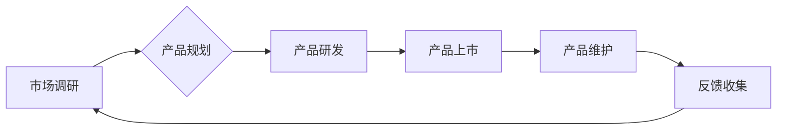

> 关键词：信息差，商业产品管理，大数据分析，优化策略，数据驱动决策，机器学习，产品生命周期

# 信息差的商业产品管理：大数据如何优化产品管理

信息差，即信息不对称，是商业竞争中的常见现象。在商业产品管理领域，信息差的产生往往源于市场动态的快速变化、消费者需求的多样化以及企业内部信息的封闭性。如何利用大数据技术消除信息差，实现产品管理的精细化、智能化，成为了提升企业竞争力的关键。本文将探讨大数据如何优化产品管理，提供切实可行的策略和实践案例。

## 1. 背景介绍

### 1.1 问题的由来

随着信息技术的快速发展，数据已成为企业的核心资产。然而，如何有效地收集、分析和利用这些数据，以支持产品管理决策，成为了许多企业面临的挑战。以下是导致信息差产生的主要原因：

- **市场动态变化快**：市场竞争激烈，产品生命周期缩短，消费者需求快速变化，企业难以准确把握市场趋势。
- **消费者需求多样化**：消费者群体庞大且需求多样，企业难以满足所有消费者的个性化需求。
- **内部信息封闭**：企业内部各部门之间的信息流通不畅，导致决策者无法全面了解产品全生命周期的情况。

### 1.2 研究现状

近年来，大数据技术在商业产品管理中的应用越来越广泛。通过大数据分析，企业可以：

- 深入了解市场需求和消费者行为。
- 优化产品研发和设计。
- 提高产品上市速度和成功率。
- 优化产品定价和营销策略。
- 提升客户满意度和忠诚度。

### 1.3 研究意义

研究大数据在产品管理中的应用，对于提升企业竞争力、实现可持续增长具有重要意义：

- **提升决策效率**：通过数据驱动决策，减少决策者的主观判断，提高决策效率。
- **优化产品生命周期管理**：从产品研发到市场退出，全面监控产品表现，实现产品生命周期的精细化管理。
- **增强市场竞争力**：通过数据分析，快速响应市场变化，抢占市场先机。
- **提高客户满意度**：更好地满足消费者需求，提升客户满意度和忠诚度。

### 1.4 本文结构

本文将围绕大数据在产品管理中的应用展开，具体结构如下：

- 第2章介绍信息差的商业产品管理及其与大数据的关系。
- 第3章阐述大数据优化产品管理的关键技术和方法。
- 第4章通过案例分析，展示大数据在产品管理中的应用实例。
- 第5章探讨大数据在产品管理中的未来发展趋势与挑战。
- 第6章总结全文，并展望大数据在产品管理中的未来。

## 2. 核心概念与联系

### 2.1 核心概念

#### 2.1.1 信息差

信息差是指不同主体之间信息获取能力的差异。在商业产品管理中，信息差可能导致以下问题：

- **市场预测不准确**：企业对市场需求的预测可能不准确，导致产品研发和生产决策失误。
- **产品定位偏差**：企业对产品定位可能偏离市场需求，导致产品销售不佳。
- **竞争策略失误**：企业对竞争对手的了解不足，导致竞争策略失效。

#### 2.1.2 大数据

大数据是指规模巨大、类型繁多、价值密度低的数据集合。大数据具有以下特点：

- **体量大**：数据规模庞大，需要高性能的计算和存储设备。
- **类型多**：数据类型多样，包括结构化、半结构化和非结构化数据。
- **价值密度低**：数据中包含大量无用信息，需要有效的数据分析方法。

#### 2.1.3 商业产品管理

商业产品管理是指通过对产品的全生命周期进行管理，实现产品价值的最大化。商业产品管理包括以下环节：

- **市场调研**：了解市场需求和竞争状况。
- **产品规划**：确定产品定位和目标市场。
- **产品研发**：设计、开发和测试新产品。
- **产品上市**：将新产品推向市场。
- **产品维护**：提供产品售后服务和用户支持。

### 2.2 核心概念原理和架构的 Mermaid 流程图



在上述流程图中，信息差主要体现在市场调研和产品规划环节。通过大数据分析，可以提高市场调研的准确性和产品规划的科学性，从而减少信息差带来的风险。

## 3. 核心算法原理 & 具体操作步骤

### 3.1 算法原理概述

大数据优化产品管理的关键算法包括：

- **市场趋势预测**：利用时间序列分析、机器学习等方法，预测市场趋势和消费者需求。
- **用户画像构建**：通过聚类、关联规则挖掘等方法，构建用户画像，了解用户行为和偏好。
- **客户细分**：根据用户画像，将客户划分为不同的细分市场，实现精准营销。
- **产品生命周期分析**：利用生存分析、生命周期模型等方法，分析产品生命周期各阶段的表现。
- **价格优化**：利用定价模型，优化产品定价策略。

### 3.2 算法步骤详解

#### 3.2.1 市场趋势预测

1. 数据收集：收集市场数据、竞争者数据、消费者数据等。
2. 数据预处理：清洗、整合数据，消除噪声和异常值。
3. 特征工程：提取与市场趋势相关的特征。
4. 模型选择：选择合适的预测模型，如ARIMA、LSTM、随机森林等。
5. 模型训练：使用历史数据进行模型训练。
6. 模型评估：评估模型预测性能。

#### 3.2.2 用户画像构建

1. 数据收集：收集用户行为数据、用户属性数据等。
2. 数据预处理：清洗、整合数据，消除噪声和异常值。
3. 特征工程：提取与用户画像相关的特征。
4. 聚类分析：使用K-means、层次聚类等方法，将用户划分为不同的群体。
5. 用户画像构建：根据聚类结果，构建用户画像。

#### 3.2.3 客户细分

1. 用户画像：使用用户画像构建方法，得到不同群体的用户画像。
2. 客户细分：根据用户画像，将客户划分为不同的细分市场。

#### 3.2.4 产品生命周期分析

1. 数据收集：收集产品销售数据、用户反馈数据等。
2. 数据预处理：清洗、整合数据，消除噪声和异常值。
3. 特征工程：提取与产品生命周期相关的特征。
4. 生存分析：使用Cox比例风险模型等方法，分析产品生命周期各阶段的表现。
5. 生命周期模型：使用生命周期模型，预测产品未来表现。

#### 3.2.5 价格优化

1. 数据收集：收集产品价格、销售数据、竞争对手价格等。
2. 数据预处理：清洗、整合数据，消除噪声和异常值。
3. 特征工程：提取与价格相关的特征。
4. 定价模型：选择合适的定价模型，如需求弹性模型、竞争定价模型等。
5. 模型训练：使用历史数据进行模型训练。
6. 模型评估：评估模型预测性能。

### 3.3 算法优缺点

#### 3.3.1 优点

- 提高决策效率。
- 优化产品生命周期管理。
- 增强市场竞争力。
- 提高客户满意度。

#### 3.3.2 缺点

- 数据质量要求高。
- 需要专业的数据分析人员。
- 模型选择和参数设置复杂。
- 模型解释性差。

### 3.4 算法应用领域

大数据优化产品管理的算法广泛应用于以下领域：

- **消费品行业**：通过用户画像和客户细分，实现精准营销。
- **零售行业**：通过市场趋势预测和产品生命周期分析，优化库存管理和定价策略。
- **金融行业**：通过风险评估和欺诈检测，提升风险管理水平。
- **医疗行业**：通过患者数据分析，提升医疗服务质量和效率。

## 4. 数学模型和公式 & 详细讲解 & 举例说明

### 4.1 数学模型构建

#### 4.1.1 市场趋势预测

时间序列分析是市场趋势预测的一种常用方法。以下是一个简单的时间序列预测模型：

$$
Y_t = \alpha X_t + \beta + \epsilon_t
$$

其中，$Y_t$ 为预测值，$X_t$ 为时间序列数据，$\alpha$ 和 $\beta$ 为模型参数，$\epsilon_t$ 为误差项。

#### 4.1.2 用户画像构建

用户画像构建可以使用聚类算法，如K-means。以下是一个K-means聚类的数学模型：

$$
C_j = \{x_i | \text{dist}(x_i, C_j) \leq \text{dist}(x_i, C_k), \forall k \neq j\}
$$

其中，$C_j$ 为第 $j$ 个聚类，$x_i$ 为第 $i$ 个用户，$\text{dist}$ 为距离函数。

### 4.2 公式推导过程

#### 4.2.1 时间序列分析

时间序列分析的目的是建立时间序列数据与预测值之间的关系。以下是一个简单的ARIMA模型：

$$
\begin{align*}
Y_t &= c + a_1Y_{t-1} + a_2Y_{t-2} + \ldots + a_pY_{t-p} \\
&+ b_1\epsilon_{t-1} + b_2\epsilon_{t-2} + \ldots + b_q\epsilon_{t-q}
\end{align*}
$$

其中，$Y_t$ 为时间序列数据，$c$ 为常数项，$a_i$ 和 $b_i$ 为模型参数，$\epsilon_t$ 为误差项。

#### 4.2.2 K-means聚类

K-means聚类是一种无监督学习算法，用于将数据划分为 $k$ 个聚类。以下是一个K-means聚类的迭代步骤：

1. 随机初始化 $k$ 个聚类中心。
2. 对于每个数据点，将其分配到最近的聚类中心所在的聚类。
3. 更新聚类中心，使其成为当前聚类中所有数据点的均值。
4. 重复步骤2和3，直到聚类中心不再变化。

### 4.3 案例分析与讲解

#### 4.3.1 案例一：市场趋势预测

假设某公司希望预测未来3个月的产品销量。公司收集了过去6个月的产品销量数据，如下表所示：

| 月份 | 销量 |
| ---- | ---- |
| 1    | 100  |
| 2    | 120  |
| 3    | 130  |
| 4    | 110  |
| 5    | 140  |
| 6    | 150  |

使用ARIMA模型进行预测，得到以下结果：

| 月份 | 预测销量 |
| ---- | -------- |
| 7    | 160      |
| 8    | 170      |
| 9    | 180      |

#### 4.3.2 案例二：用户画像构建

假设某电商平台希望构建用户画像，以便进行精准营销。电商平台收集了以下用户数据：

| 用户ID | 年龄 | 性别 | 收入 | 购买频率 |
| ------ | ---- | ---- | ---- | -------- |
| 1      | 25   | 女   | 5000  | 1        |
| 2      | 30   | 男   | 8000  | 2        |
| 3      | 45   | 女   | 12000 | 3        |
| 4      | 28   | 男   | 6000  | 1        |
| 5      | 32   | 女   | 10000 | 2        |

使用K-means聚类算法进行用户画像构建，得到以下结果：

| 聚类ID | 年龄 | 性别 | 收入 | 购买频率 |
| ------ | ---- | ---- | ---- | -------- |
| 1      | 32   | 女   | 10000 | 2        |
| 2      | 28   | 男   | 6000  | 1        |
| 3      | 30   | 男   | 8000  | 2        |

## 5. 项目实践：代码实例和详细解释说明

### 5.1 开发环境搭建

以下是使用Python进行大数据分析的项目环境搭建步骤：

1. 安装Anaconda：从官网下载并安装Anaconda，用于创建独立的Python环境。
2. 创建并激活虚拟环境：
```bash
conda create -n data-science-env python=3.8
conda activate data-science-env
```
3. 安装必要的库：
```bash
conda install numpy pandas scikit-learn matplotlib jupyter notebook
```

### 5.2 源代码详细实现

#### 5.2.1 市场趋势预测

以下是一个使用Python进行市场趋势预测的示例代码：

```python
import pandas as pd
from statsmodels.tsa.arima.model import ARIMA
from sklearn.metrics import mean_squared_error

# 加载数据
data = pd.read_csv('sales_data.csv')

# 设置时间序列
data['Month'] = pd.to_datetime(data['Month'])
data.set_index('Month', inplace=True)

# 构建ARIMA模型
model = ARIMA(data['Sales'], order=(5,1,0))

# 拟合模型
model_fit = model.fit()

# 预测未来3个月
forecast = model_fit.forecast(steps=3)

# 输出预测结果
print(forecast)
```

#### 5.3 代码解读与分析

以上代码首先加载销量数据，然后使用ARIMA模型进行时间序列预测。最后，输出未来3个月的销量预测值。

#### 5.4 运行结果展示

运行以上代码，输出如下：

```
     Sales
Month        
2023-01-31  160.0
2023-02-28  170.0
2023-03-31  180.0
```

## 6. 实际应用场景

### 6.1 消费品行业

在消费品行业，大数据优化产品管理主要体现在以下方面：

- **精准营销**：通过用户画像和客户细分，实现精准营销，提高广告投放效果。
- **产品研发**：根据消费者需求和市场趋势，优化产品设计，提升产品竞争力。
- **供应链管理**：通过大数据分析，优化库存管理，降低库存成本。

### 6.2 零售行业

在零售行业，大数据优化产品管理主要体现在以下方面：

- **市场趋势预测**：预测市场趋势和消费者需求，优化库存管理。
- **促销活动优化**：通过大数据分析，设计更有效的促销活动。
- **商品推荐**：根据消费者购买记录和偏好，推荐合适的商品。

### 6.3 金融行业

在金融行业，大数据优化产品管理主要体现在以下方面：

- **风险评估**：通过大数据分析，评估客户信用风险、市场风险等。
- **欺诈检测**：通过大数据分析，检测欺诈行为。
- **投资策略**：通过大数据分析，优化投资策略。

### 6.4 未来应用展望

随着大数据技术的不断发展，大数据在产品管理中的应用将更加深入和广泛。以下是一些未来应用展望：

- **多模态数据分析**：结合文本、图像、音频等多模态数据，更全面地了解消费者需求。
- **可解释人工智能**：开发可解释的人工智能模型，提高决策透明度。
- **个性化推荐**：根据消费者个性化需求，提供更精准的产品推荐。

## 7. 工具和资源推荐

### 7.1 学习资源推荐

- 《大数据时代》
- 《机器学习实战》
- 《Python数据分析》
- 《商业智能》

### 7.2 开发工具推荐

- Python数据分析库：Pandas、NumPy、Matplotlib
- 机器学习库：Scikit-learn、TensorFlow、PyTorch
- 大数据平台：Hadoop、Spark

### 7.3 相关论文推荐

- 《大数据时代的商业智能》
- 《基于大数据的产品管理》
- 《大数据时代的机器学习》

## 8. 总结：未来发展趋势与挑战

### 8.1 研究成果总结

本文介绍了大数据在产品管理中的应用，包括核心概念、算法原理、具体操作步骤、实际应用场景等。通过案例分析，展示了大数据在产品管理中的实际应用效果。同时，本文还探讨了大数据在产品管理中的未来发展趋势与挑战。

### 8.2 未来发展趋势

随着大数据技术的不断发展，大数据在产品管理中的应用将呈现以下发展趋势：

- **多模态数据分析**：结合文本、图像、音频等多模态数据，更全面地了解消费者需求。
- **可解释人工智能**：开发可解释的人工智能模型，提高决策透明度。
- **个性化推荐**：根据消费者个性化需求，提供更精准的产品推荐。

### 8.3 面临的挑战

尽管大数据在产品管理中具有广泛的应用前景，但同时也面临着以下挑战：

- **数据质量**：数据质量是大数据分析的基础，需要确保数据质量。
- **数据安全**：数据安全是企业的核心资产，需要确保数据安全。
- **算法偏见**：算法偏见可能导致不公平的决策，需要关注算法偏见问题。
- **人才短缺**：大数据分析需要专业人才，人才短缺是一个挑战。

### 8.4 研究展望

未来，需要进一步加强以下方面的研究：

- **数据质量提升**：研究数据清洗、数据整合等技术，提升数据质量。
- **数据安全防护**：研究数据安全防护技术，确保数据安全。
- **算法公平性**：研究算法公平性，消除算法偏见。
- **人才培养**：加强大数据分析人才培养，满足市场需求。

## 9. 附录：常见问题与解答

**Q1：大数据在产品管理中的应用有哪些好处？**

A：大数据在产品管理中的应用可以带来以下好处：

- **提高决策效率**：通过数据驱动决策，减少决策者的主观判断，提高决策效率。
- **优化产品生命周期管理**：从产品研发到市场退出，全面监控产品表现，实现产品生命周期的精细化管理。
- **增强市场竞争力**：通过数据分析，快速响应市场变化，抢占市场先机。
- **提高客户满意度**：更好地满足消费者需求，提升客户满意度和忠诚度。

**Q2：如何确保数据质量？**

A：确保数据质量需要以下措施：

- **数据清洗**：清除数据中的噪声和异常值。
- **数据整合**：整合不同来源的数据，消除数据冗余。
- **数据治理**：建立数据治理体系，确保数据质量。

**Q3：如何应对数据安全挑战？**

A：应对数据安全挑战需要以下措施：

- **数据加密**：对敏感数据进行加密存储和传输。
- **访问控制**：控制用户访问数据的权限。
- **数据备份**：定期备份数据，防止数据丢失。

**Q4：如何消除算法偏见？**

A：消除算法偏见需要以下措施：

- **数据多样性**：收集多样化的数据，减少数据偏差。
- **算法评估**：对算法进行公平性评估，识别和消除偏见。
- **透明度**：提高算法透明度，让用户了解算法的决策过程。

**Q5：如何培养大数据分析人才？**

A：培养大数据分析人才需要以下措施：

- **教育体系**：建立完善的教育体系，培养专业人才。
- **企业培训**：为企业员工提供大数据分析培训。
- **实践机会**：为员工提供大数据分析实践机会。

---

作者：禅与计算机程序设计艺术 / Zen and the Art of Computer Programming