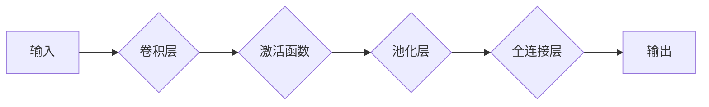

# 卷积神经网络CNN原理与代码实例讲解

> 关键词：卷积神经网络，CNN，深度学习，图像识别，特征提取，神经网络架构，PyTorch

## 1. 背景介绍

卷积神经网络（Convolutional Neural Network，CNN）是深度学习领域的一个重要分支，它在图像识别、物体检测、图像分割等领域取得了显著的成果。CNN通过模拟生物视觉系统的工作原理，能够自动从图像数据中提取特征，并在各种视觉任务中表现出强大的能力。本文将深入讲解CNN的原理，并通过代码实例展示其在实际应用中的实现。

### 1.1 问题的由来

传统的图像处理方法通常依赖于手工设计的特征，如边缘检测、角点检测等。这些特征往往无法有效地捕捉图像中的复杂结构，且难以适应不同场景的变化。随着深度学习技术的兴起，CNN的出现为图像处理领域带来了革命性的变化。

### 1.2 研究现状

CNN已经在多个视觉任务中取得了SOTA（State-of-the-Art）的性能，如ImageNet图像分类挑战赛。研究者们不断探索新的CNN架构和训练策略，以提高模型的性能和泛化能力。

### 1.3 研究意义

理解CNN的原理对于深入研究和应用深度学习技术至关重要。通过本文的讲解，读者将能够：

- 掌握CNN的基本结构和操作原理；
- 理解卷积、激活、池化等操作的作用；
- 学习如何使用PyTorch等深度学习框架实现CNN；
- 了解CNN在不同视觉任务中的应用。

### 1.4 本文结构

本文将按照以下结构进行讲解：

- 介绍CNN的核心概念与联系；
- 深入解析CNN的算法原理和操作步骤；
- 通过数学模型和公式详细讲解CNN的工作原理；
- 提供PyTorch代码实例，展示CNN的实现和训练过程；
- 探讨CNN在实际应用场景中的使用，并展望其未来发展趋势。

## 2. 核心概念与联系

### 2.1 核心概念原理

CNN的核心概念包括：

- **卷积层（Convolutional Layer）**：通过卷积操作提取图像的特征，并保持图像的空间位置关系。
- **激活函数（Activation Function）**：对卷积层输出的特征进行非线性变换，增加模型的非线性表达能力。
- **池化层（Pooling Layer）**：降低特征图的空间维度，减少参数数量，提高模型鲁棒性。
- **全连接层（Fully Connected Layer）**：将特征图中的特征进行整合，并输出最终的分类结果。

以下为CNN的核心概念原理的Mermaid流程图：



### 2.2 核心概念联系

CNN的各个核心概念之间存在着紧密的联系。卷积层用于提取图像特征，激活函数增强特征的表达能力，池化层降低特征维度，全连接层整合特征并输出最终结果。这些层构成了CNN的核心架构，共同实现了图像特征的提取和分类。

## 3. 核心算法原理 & 具体操作步骤

### 3.1 算法原理概述

CNN的算法原理主要包括以下几个步骤：

1. **卷积操作**：卷积层通过卷积核与图像特征进行卷积操作，提取局部特征。
2. **激活函数**：对卷积层的输出应用非线性激活函数，如ReLU函数，增强模型的表达能力。
3. **池化操作**：池化层对卷积层的输出进行下采样，降低特征图的空间维度，减少计算量和参数数量。
4. **全连接层**：全连接层将池化层输出的特征进行整合，并输出最终的分类结果。

### 3.2 算法步骤详解

以下为CNN的算法步骤详解：

1. **输入数据**：将图像数据输入到CNN中，图像通常需要经过预处理，如缩放、归一化等。
2. **卷积层**：卷积层通过卷积核在图像上滑动，提取局部特征。
3. **激活函数**：对卷积层的输出应用激活函数，如ReLU函数。
4. **池化层**：池化层对激活后的特征进行下采样，降低特征图的空间维度。
5. **全连接层**：全连接层将池化层输出的特征进行整合，并输出最终的分类结果。
6. **损失函数**：计算预测结果与真实标签之间的损失，如交叉熵损失。
7. **反向传播**：通过反向传播算法计算梯度，并更新网络参数。
8. **迭代优化**：重复步骤2-7，直至模型收敛。

### 3.3 算法优缺点

CNN的优点包括：

- **自动特征提取**：CNN能够自动从图像中提取特征，无需人工设计特征。
- **参数共享**：卷积层在图像上滑动，实现了参数共享，减少了模型参数数量。
- **端到端训练**：CNN可以直接从原始数据中进行训练，无需进行特征工程。

CNN的缺点包括：

- **计算量大**：CNN的参数数量庞大，计算量巨大，需要高性能计算设备。
- **模型复杂度较高**：CNN的模型结构复杂，难以理解。

### 3.4 算法应用领域

CNN在以下视觉任务中得到了广泛应用：

- **图像分类**：如ImageNet图像分类挑战赛。
- **物体检测**：如Faster R-CNN、YOLO等。
- **图像分割**：如U-Net、DeepLab等。
- **人脸识别**：如FaceNet、ArcFace等。

## 4. 数学模型和公式 & 详细讲解 & 举例说明

### 4.1 数学模型构建

CNN的数学模型主要包括以下公式：

- **卷积操作**：$h(x) = \sigma(Wx + b)$，其中 $x$ 为输入特征，$W$ 为卷积核，$b$ 为偏置，$\sigma$ 为激活函数。
- **池化操作**：$p(x) = \text{max}(x)$，其中 $x$ 为输入特征，$\text{max}$ 表示取最大值。

### 4.2 公式推导过程

以下为卷积操作的推导过程：

- **卷积核**：卷积核是一个小的矩阵，用于从图像中提取特征。假设卷积核的大小为 $k \times k$，则卷积操作可以表示为：

  $$
h(x) = \sum_{i=1}^{k} \sum_{j=1}^{k} W_{ij} \cdot x_{(i+j-1)(i-1) + (j-1)} + b
$$

- **激活函数**：常用的激活函数为ReLU函数，其定义为：

  $$
\sigma(x) = \begin{cases} 
x & \text{if } x > 0 \\
0 & \text{if } x \leq 0 
\end{cases}
$$

### 4.3 案例分析与讲解

以下使用PyTorch框架实现一个简单的CNN模型，用于图像分类。

```python
import torch
import torch.nn as nn
import torch.nn.functional as F

class SimpleCNN(nn.Module):
    def __init__(self):
        super(SimpleCNN, self).__init__()
        self.conv1 = nn.Conv2d(1, 6, 3)
        self.conv2 = nn.Conv2d(6, 16, 3)
        self.fc1 = nn.Linear(16 * 6 * 6, 120)
        self.fc2 = nn.Linear(120, 84)
        self.fc3 = nn.Linear(84, 10)

    def forward(self, x):
        x = F.relu(F.max_pool2d(self.conv1(x), (2, 2)))
        x = F.relu(F.max_pool2d(self.conv2(x), 2))
        x = x.view(-1, self.num_flat_features(x))
        x = F.relu(self.fc1(x))
        x = F.relu(self.fc2(x))
        x = self.fc3(x)
        return x

    def num_flat_features(self, x):
        size = x.size()[1:]  # 除batch_size外的所有维度
        num_features = 1
        for s in size:
            num_features *= s
        return num_features

# 创建模型实例
model = SimpleCNN()

# 输入数据
x = torch.randn(1, 1, 32, 32)

# 前向传播
output = model(x)

print(output)
```

这段代码定义了一个简单的CNN模型，包含两个卷积层、两个全连接层和三个ReLU激活函数。模型通过卷积操作提取图像特征，并通过全连接层输出最终的分类结果。

## 5. 项目实践：代码实例和详细解释说明

### 5.1 开发环境搭建

在进行CNN项目实践前，我们需要准备好开发环境。以下是使用Python进行PyTorch开发的环境配置流程：

1. 安装Anaconda：从官网下载并安装Anaconda，用于创建独立的Python环境。
2. 创建并激活虚拟环境：
   ```bash
   conda create -n pytorch-env python=3.8
   conda activate pytorch-env
   ```
3. 安装PyTorch：根据CUDA版本，从官网获取对应的安装命令。例如：
   ```bash
   conda install pytorch torchvision torchaudio cudatoolkit=11.1 -c pytorch -c conda-forge
   ```
4. 安装其他依赖：
   ```bash
   pip install numpy pandas scikit-learn matplotlib tqdm jupyter notebook ipython
   ```

完成上述步骤后，即可在`pytorch-env`环境中开始CNN项目实践。

### 5.2 源代码详细实现

以下是一个使用PyTorch实现的简单CNN模型，用于图像分类：

```python
import torch
import torch.nn as nn
import torch.nn.functional as F

class SimpleCNN(nn.Module):
    def __init__(self):
        super(SimpleCNN, self).__init__()
        self.conv1 = nn.Conv2d(1, 6, 3)
        self.conv2 = nn.Conv2d(6, 16, 3)
        self.fc1 = nn.Linear(16 * 6 * 6, 120)
        self.fc2 = nn.Linear(120, 84)
        self.fc3 = nn.Linear(84, 10)

    def forward(self, x):
        x = F.relu(F.max_pool2d(self.conv1(x), (2, 2)))
        x = F.relu(F.max_pool2d(self.conv2(x), 2))
        x = x.view(-1, self.num_flat_features(x))
        x = F.relu(self.fc1(x))
        x = F.relu(self.fc2(x))
        x = self.fc3(x)
        return x

    def num_flat_features(self, x):
        size = x.size()[1:]  # 除batch_size外的所有维度
        num_features = 1
        for s in size:
            num_features *= s
        return num_features

# 创建模型实例
model = SimpleCNN()

# 输入数据
x = torch.randn(1, 1, 32, 32)

# 前向传播
output = model(x)

print(output)
```

这段代码定义了一个简单的CNN模型，包含两个卷积层、两个全连接层和三个ReLU激活函数。模型通过卷积操作提取图像特征，并通过全连接层输出最终的分类结果。

### 5.3 代码解读与分析

- `SimpleCNN` 类定义了一个简单的CNN模型，继承自 `nn.Module` 类。
- `__init__` 方法初始化了模型的结构，包括两个卷积层、两个全连接层和三个ReLU激活函数。
- `forward` 方法定义了模型的前向传播过程，通过卷积操作提取图像特征，并通过全连接层输出最终的分类结果。
- `num_flat_features` 方法计算输入数据的平坦特征数量。

### 5.4 运行结果展示

运行上述代码后，我们将得到一个形状为 `(1, 10)` 的输出张量，表示模型的10个分类结果。每个数值对应一个类别的概率，概率最大的类别即为模型的预测结果。

## 6. 实际应用场景

CNN在以下实际应用场景中得到了广泛应用：

- **图像分类**：如ImageNet图像分类挑战赛。
- **物体检测**：如Faster R-CNN、YOLO等。
- **图像分割**：如U-Net、DeepLab等。
- **人脸识别**：如FaceNet、ArcFace等。

### 6.4 未来应用展望

随着深度学习技术的不断发展，CNN将在以下方面取得更多突破：

- **更复杂的模型架构**：如可分离卷积、多尺度卷积等。
- **更高效的训练方法**：如优化器改进、模型压缩等。
- **更广泛的应用领域**：如医疗影像、卫星图像、遥感图像等。

## 7. 工具和资源推荐

### 7.1 学习资源推荐

以下是一些学习CNN的优质资源：

- **《深度学习》系列书籍**：由Ian Goodfellow等编著，全面介绍了深度学习的基本原理和算法。
- **PyTorch官方文档**：提供了PyTorch框架的详细文档和教程，适合初学者和进阶者学习。
- **fastai课程**：由Andrej Karpathy和 Jeremy Howard主讲，提供了丰富的深度学习实践案例。

### 7.2 开发工具推荐

以下是一些用于CNN开发的工具：

- **PyTorch**：由Facebook AI Research开发的开源深度学习框架，适合快速开发CNN模型。
- **TensorFlow**：由Google开发的开源深度学习框架，适合大规模部署CNN模型。
- **Keras**：基于TensorFlow的开源深度学习库，提供了丰富的预训练模型和API。

### 7.3 相关论文推荐

以下是一些关于CNN的优质论文：

- **LeCun, Y., Bottou, L., Bengio, Y., & Haffner, P. (1998). Gradient-based learning applied to document recognition. Proceedings of the IEEE, 86(11), 2278-2324**.
- **Krizhevsky, A., Sutskever, I., & Hinton, G. E. (2012). ImageNet classification with deep convolutional neural networks. In Advances in neural information processing systems (pp. 1097-1105)**.
- **Simonyan, K., & Zisserman, A. (2014). Very deep convolutional networks for large-scale image recognition. arXiv preprint arXiv:1409.1556**.

## 8. 总结：未来发展趋势与挑战

### 8.1 研究成果总结

本文深入讲解了CNN的原理和实现，并展示了其在实际应用中的代码实例。通过本文的学习，读者可以掌握CNN的基本结构和操作原理，并能够使用PyTorch等深度学习框架实现CNN模型。

### 8.2 未来发展趋势

CNN在未来将朝着以下方向发展：

- **模型架构的改进**：探索更有效的卷积操作、更合理的网络结构等。
- **训练方法的优化**：研究更快的训练算法、更稳定的训练过程等。
- **应用领域的拓展**：将CNN应用于更多领域，如医疗影像、卫星图像、遥感图像等。

### 8.3 面临的挑战

CNN在应用过程中也面临着一些挑战：

- **计算量巨大**：CNN的参数数量庞大，计算量巨大，需要高性能计算设备。
- **模型复杂度高**：CNN的模型结构复杂，难以理解。
- **数据依赖性强**：CNN需要大量的标注数据进行训练，获取标注数据的成本较高。

### 8.4 研究展望

为了克服CNN面临的挑战，未来的研究可以从以下几个方面进行：

- **模型压缩**：研究模型压缩技术，减小模型参数数量，降低计算量。
- **模型解释性**：研究模型的可解释性，提高模型的可信度和可理解性。
- **少样本学习**：研究少样本学习技术，降低对标注数据的依赖。

## 9. 附录：常见问题与解答

**Q1：CNN与普通神经网络有何区别？**

A1：CNN与普通神经网络的主要区别在于卷积操作和池化操作。CNN通过卷积操作提取图像特征，并保持图像的空间位置关系；而普通神经网络则将图像视为一个一维数据序列。

**Q2：CNN如何处理不同尺寸的输入图像？**

A2：CNN通过自适应池化层或全连接层，可以处理不同尺寸的输入图像。自适应池化层会自动调整池化窗口的大小，以适应不同尺寸的输入图像。

**Q3：CNN如何防止过拟合？**

A3：CNN可以通过以下方法防止过拟合：

- 使用正则化技术，如L1正则化、L2正则化等。
- 使用Dropout技术，在训练过程中随机丢弃一部分神经元的输出。
- 使用数据增强技术，增加训练数据的多样性。

**Q4：CNN如何应用于物体检测？**

A4：物体检测是CNN在计算机视觉领域的一个重要应用。常用的物体检测方法包括Faster R-CNN、YOLO等。这些方法通常将CNN作为特征提取器，并结合区域提议网络（Region Proposal Network，RPN）或边界框回归层（Bounding Box Regression Layer）进行物体检测。

**Q5：CNN如何应用于图像分割？**

A5：图像分割是将图像中的每个像素分类到不同的类别。常用的图像分割方法包括U-Net、DeepLab等。这些方法通常使用CNN提取图像特征，并通过解码器层重建图像。

作者：禅与计算机程序设计艺术 / Zen and the Art of Computer Programming