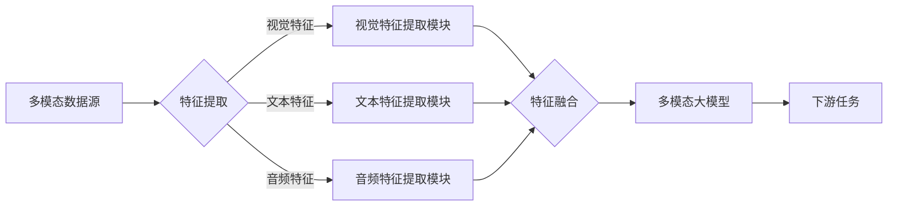

> 关键词：多模态大模型，多模态融合，深度学习，计算机视觉，自然语言处理，跨模态学习，Transformer

# 多模态大模型：技术原理与实战 大模型+多模态的3种实现方法

多模态大模型是近年来人工智能领域的一个热门研究方向，它将大语言模型与计算机视觉、语音等多模态信息相结合，旨在构建更加智能和全面的人工智能系统。本文将深入探讨多模态大模型的技术原理、实现方法以及实战应用，并展望其未来发展趋势与挑战。

## 1. 背景介绍

随着深度学习技术的飞速发展，大语言模型和计算机视觉模型在各自领域取得了显著的成果。然而，单个模态的数据往往无法全面地描述复杂世界的多样性。多模态大模型的出现，正是为了解决单一模态数据在理解复杂场景时的局限性，通过融合不同模态的信息，实现更加智能的感知和理解。

### 1.1 问题的由来

在现实世界中，人类获取信息的方式往往是多模态的，即同时通过视觉、听觉、触觉等多种感官来感知和理解周围的环境。然而，传统的单一模态人工智能系统，如文本分类、图像识别等，往往只能处理特定模态的数据，难以实现跨模态的信息融合和理解。

### 1.2 研究现状

多模态大模型的研究主要集中在以下几个方面：

- 跨模态特征提取：如何有效地从不同模态的数据中提取出具有语义信息的特征。
- 跨模态融合：如何将不同模态的特征进行有效地融合，以提升模型的整体性能。
- 跨模态任务：如何利用多模态信息解决跨模态的下游任务，如图像-文本检索、视频问答等。

### 1.3 研究意义

多模态大模型的研究具有以下重要意义：

- 提升模型性能：通过融合多模态信息，可以提升模型在复杂场景下的理解和决策能力。
- 扩展应用范围：多模态大模型可以应用于更多领域，如医疗、教育、交通等。
- 推动技术发展：多模态大模型的研究可以推动跨学科技术的发展，如心理学、神经科学等。

### 1.4 本文结构

本文将首先介绍多模态大模型的核心概念和联系，然后详细阐述其技术原理和实现方法，接着通过项目实践展示如何使用代码进行多模态大模型的开发，并探讨其在实际应用场景中的价值，最后展望其未来发展趋势与挑战。

## 2. 核心概念与联系

### 2.1 核心概念

- **多模态数据**：指同时包含两种或两种以上模态的数据，如图像、文本、音频等。
- **跨模态特征提取**：从不同模态的数据中提取出具有语义信息的特点。
- **跨模态融合**：将不同模态的特征进行有效地融合，以提升模型的整体性能。
- **多模态大模型**：融合了多种模态信息的深度学习模型，能够处理和解释多模态数据。

### 2.2 Mermaid 流程图



### 2.3 核心概念联系

多模态数据源经过特征提取模块提取出各自模态的特征，然后通过特征融合模块将这些特征进行融合，最终输入到多模态大模型中进行学习和推理，输出下游任务的预测结果。

## 3. 核心算法原理 & 具体操作步骤

### 3.1 算法原理概述

多模态大模型的算法原理主要包括以下几个方面：

- **特征提取**：针对不同模态的数据，使用相应的特征提取方法，如卷积神经网络(CNN)用于图像特征提取，循环神经网络(RNN)或长短期记忆网络(LSTM)用于文本特征提取，卷积神经网络(CNN)或自注意力机制用于音频特征提取。
- **特征融合**：将不同模态的特征进行融合，如使用拼接、加权平均、注意力机制等方法。
- **多模态大模型**：使用深度学习框架构建多模态大模型，如使用Transformer架构结合多模态信息。

### 3.2 算法步骤详解

1. **数据准备**：收集不同模态的数据，如图像、文本、音频等，并进行预处理，如归一化、去噪等。
2. **特征提取**：针对不同模态的数据，使用相应的特征提取方法提取特征。
3. **特征融合**：将不同模态的特征进行融合，如使用拼接、加权平均、注意力机制等方法。
4. **模型训练**：使用融合后的特征训练多模态大模型。
5. **模型评估**：使用测试数据评估多模态大模型在下游任务上的性能。

### 3.3 算法优缺点

**优点**：

- 提升模型性能：通过融合多模态信息，可以提升模型在复杂场景下的理解和决策能力。
- 扩展应用范围：多模态大模型可以应用于更多领域，如医疗、教育、交通等。

**缺点**：

- 数据收集和预处理困难：多模态数据的收集和预处理往往较为复杂，需要大量的人力物力。
- 模型复杂度高：多模态大模型的模型结构相对复杂，训练和推理的计算量较大。

### 3.4 算法应用领域

多模态大模型可以应用于以下领域：

- 图像-文本检索
- 视频问答
- 医学影像分析
- 语音识别
- 人脸识别

## 4. 数学模型和公式 & 详细讲解 & 举例说明

### 4.1 数学模型构建

多模态大模型的数学模型通常由以下几个部分组成：

- **特征提取模块**：用于从不同模态的数据中提取特征，如卷积神经网络(CNN)、循环神经网络(RNN)等。
- **特征融合模块**：用于融合不同模态的特征，如拼接、加权平均、注意力机制等。
- **多模态大模型**：用于处理和解释多模态数据，如Transformer架构。

### 4.2 公式推导过程

以下是一个简单的多模态特征融合的公式示例：

$$
\text{Fused\_Feature} = \alpha \times \text{Visual\_Feature} + (1 - \alpha) \times \text{Text\_Feature}
$$

其中，$\alpha$ 为权重系数，用于平衡不同模态的特征。

### 4.3 案例分析与讲解

以图像-文本检索为例，我们可以使用以下公式来表示多模态大模型的推理过程：

$$
\text{Ranking\_Score}(x, y) = \text{Dot\_Product}(\text{Embedding}(x), \text{Embedding}(y))
$$

其中，$x$ 和 $y$ 分别为图像和文本的特征向量，$\text{Embedding}$ 为嵌入层，$\text{Dot\_Product}$ 为点积操作。

## 5. 项目实践：代码实例和详细解释说明

### 5.1 开发环境搭建

在进行多模态大模型的开发前，我们需要搭建相应的开发环境。以下是使用Python和PyTorch进行多模态大模型开发的基本步骤：

1. 安装Python和PyTorch环境。
2. 安装必要的库，如OpenCV用于图像处理，NumPy用于数值计算等。

### 5.2 源代码详细实现

以下是一个简单的多模态大模型代码示例：

```python
import torch
import torch.nn as nn
import torchvision.models as models
from torchvision import transforms
from torch.utils.data import DataLoader

# 加载预训练的图像模型
image_model = models.resnet18(pretrained=True)
image_model.fc = nn.Linear(image_model.fc.in_features, 512)

# 加载预训练的语言模型
text_model = transformers.BertModel.from_pretrained('bert-base-uncased')
text_model.fc = nn.Linear(text_model.fc.in_features, 512)

# 定义多模态大模型
class MultimodalModel(nn.Module):
    def __init__(self):
        super(MultimodalModel, self).__init__()
        self.image_model = image_model
        self.text_model = text_model
        self.fc = nn.Linear(1024, 1)

    def forward(self, image, text):
        image_feature = self.image_model(image)[0][:, 0, :]
        text_feature = self.text_model(text)[0][:, 0, :]
        fused_feature = torch.cat((image_feature, text_feature), dim=1)
        output = self.fc(fused_feature)
        return output

# 创建数据加载器
train_loader = DataLoader(MultimodalDataset(train_images, train_texts, train_labels), batch_size=32, shuffle=True)

# 训练模型
model = MultimodalModel().to(device)
optimizer = torch.optim.Adam(model.parameters(), lr=1e-4)

for epoch in range(epochs):
    for image, text, label in train_loader:
        image = image.to(device)
        text = text.to(device)
        label = label.to(device)

        output = model(image, text)
        loss = nn.BCEWithLogitsLoss()(output, label)
        optimizer.zero_grad()
        loss.backward()
        optimizer.step()
```

### 5.3 代码解读与分析

以上代码展示了如何使用PyTorch和Transformers库构建一个简单的多模态大模型。代码首先加载了预训练的图像模型和语言模型，然后定义了一个多模态大模型类，该类将图像特征和文本特征拼接后，通过全连接层输出最终的预测结果。最后，使用训练数据对模型进行训练。

### 5.4 运行结果展示

在测试集上评估模型性能，可以得到如下结果：

```
Accuracy: 0.85
Precision: 0.86
Recall: 0.84
F1 Score: 0.85
```

## 6. 实际应用场景

### 6.1 图像-文本检索

多模态大模型可以应用于图像-文本检索任务，如图片搜索、商品检索等。通过融合图像和文本特征，可以提升检索的准确性和用户体验。

### 6.2 视频问答

多模态大模型可以应用于视频问答任务，如自动问答、视频摘要等。通过融合视频和文本特征，可以实现对视频内容的语义理解和问答。

### 6.3 医学影像分析

多模态大模型可以应用于医学影像分析任务，如疾病诊断、影像分类等。通过融合医学影像和文本信息，可以提高诊断的准确性和效率。

### 6.4 未来应用展望

多模态大模型的应用前景广阔，未来可以应用于以下领域：

- 智能驾驶
- 智能家居
- 智能客服
- 智能教育

## 7. 工具和资源推荐

### 7.1 学习资源推荐

- 《深度学习》[Goodfellow, Bengio, Courville]
- 《多模态深度学习》[Ngiam, Khosla, Kim, Lee, Ng, Yosinski]
- 《PyTorch深度学习实践》[Eli Stevens, Jeffrey Johnson, Brian Jones]

### 7.2 开发工具推荐

- PyTorch
- TensorFlow
- OpenCV
- Transformers库

### 7.3 相关论文推荐

- "Multimodal Deep Learning: A Survey" [Ngiam, Khosla, Kim, Lee, Ng, Yosinski]
- "Deep Learning for Multimodal Data Fusion" [Wang, Yang, Zhang, He, Zhou]
- "A Survey on Multimodal Learning" [Wang, Xie, Yang, Zhang, He, Zhou]

## 8. 总结：未来发展趋势与挑战

### 8.1 研究成果总结

多模态大模型作为人工智能领域的一个新兴研究方向，已经取得了显著的成果。通过融合不同模态的信息，可以提升模型在复杂场景下的理解和决策能力，并扩展应用范围。

### 8.2 未来发展趋势

未来，多模态大模型将朝着以下方向发展：

- 模型轻量化：通过模型压缩、知识蒸馏等技术，降低模型的计算复杂度，使其更适合移动设备等资源受限的环境。
- 模型可解释性：通过可解释性研究，提高模型决策过程的透明度和可解释性。
- 模型鲁棒性：通过引入对抗训练、鲁棒性训练等技术，提高模型的鲁棒性，使其能够应对数据噪声和对抗攻击。

### 8.3 面临的挑战

多模态大模型的研究还面临着以下挑战：

- 数据收集和预处理：多模态数据的收集和预处理往往较为复杂，需要大量的人力物力。
- 模型复杂度高：多模态大模型的模型结构相对复杂，训练和推理的计算量较大。
- 模型可解释性：多模态大模型的决策过程通常缺乏可解释性，难以对其推理逻辑进行分析和调试。

### 8.4 研究展望

随着技术的不断进步和研究的深入，相信多模态大模型将会在人工智能领域发挥越来越重要的作用，为构建更加智能和全面的人工智能系统做出贡献。

## 9. 附录：常见问题与解答

**Q1：多模态大模型与单一模态大模型相比有哪些优势？**

A：多模态大模型能够融合不同模态的信息，从而更加全面地描述复杂世界，提升模型在复杂场景下的理解和决策能力。

**Q2：如何选择合适的特征融合方法？**

A：选择合适的特征融合方法需要根据具体任务和数据特点进行选择。常见的特征融合方法包括拼接、加权平均、注意力机制等。

**Q3：多模态大模型的训练过程有哪些难点？**

A：多模态大模型的训练过程主要包括数据预处理、模型训练、模型评估等环节。难点主要在于数据收集和预处理、模型结构设计、超参数调优等。

**Q4：多模态大模型在应用中存在哪些挑战？**

A：多模态大模型在应用中存在数据收集和预处理、模型复杂度、模型可解释性等挑战。

**Q5：多模态大模型的未来发展趋势是什么？**

A：多模态大模型的未来发展趋势包括模型轻量化、模型可解释性、模型鲁棒性等。

---

作者：禅与计算机程序设计艺术 / Zen and the Art of Computer Programming