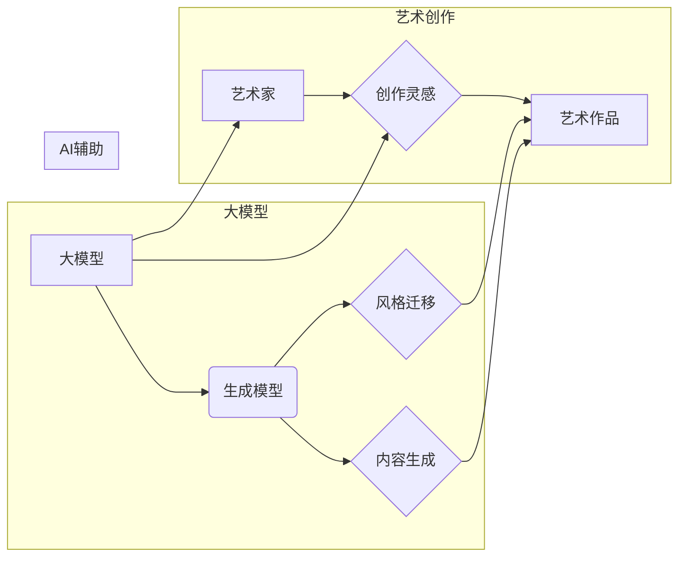

# 大模型与AI辅助艺术创作：从模仿到创新

> 关键词：大模型，人工智能，艺术创作，模仿，创新，生成模型，风格迁移，创意生成

## 1. 背景介绍

艺术创作是人类智慧的结晶，它不仅反映了人类对美的追求，也是文化传承和创新的重要载体。随着人工智能技术的飞速发展，尤其是深度学习在大模型领域的突破，人工智能开始逐渐涉足艺术创作的领域。从最初的模仿到如今的创新，AI辅助艺术创作正成为一个新的研究热点。本文将探讨大模型在艺术创作中的应用，分析其从模仿到创新的演变过程，并展望未来的发展趋势。

### 1.1 问题的由来

艺术创作一直以来都是人类独特的表达方式，但随着科技的发展，人们开始思考：人工智能是否能够参与到艺术创作中来？能否通过模仿人类艺术家的风格，甚至创造出新的艺术形式？这些问题引发了人们对人工智能与艺术创作关系的探讨。

### 1.2 研究现状

近年来，随着深度学习技术的成熟，尤其是生成对抗网络（GANs）和变分自编码器（VAEs）等生成模型的提出，人工智能辅助艺术创作取得了显著进展。目前，AI辅助艺术创作主要集中在以下几个方面：

- **风格迁移**：将一种艺术作品的风格应用到另一种内容上，创造出新的视觉体验。
- **内容生成**：根据输入的文本、图像或其他信息，生成新的艺术作品。
- **艺术风格探索**：探索新的艺术风格，为艺术家提供灵感和创作方向。

### 1.3 研究意义

AI辅助艺术创作的研究意义在于：

- **拓展艺术创作的边界**：人工智能可以帮助艺术家突破自身的局限，探索新的艺术形式和风格。
- **促进艺术与科技的融合**：推动人工智能技术在艺术领域的应用，促进科技与艺术的相互促进。
- **创造新的艺术价值**：通过人工智能，可以创造出人类艺术家难以达到的艺术效果，丰富艺术表现形式。

## 2. 核心概念与联系

### 2.1 核心概念

- **大模型**：指具有海量参数、能够处理大规模数据集的深度学习模型，如Transformer、BERT等。
- **生成模型**：一种能够生成数据样本的模型，如GANs、VAEs等。
- **风格迁移**：将一种艺术作品的风格应用到另一种内容上的技术。
- **内容生成**：根据输入信息生成新的艺术作品的技术。

### 2.2 核心概念原理和架构的 Mermaid 流程图



### 2.3 核心概念联系

大模型是AI辅助艺术创作的基石，它通过生成模型实现风格迁移和内容生成，为艺术家提供创作灵感和工具。艺术家则利用这些工具，结合自身的创意，创造出新的艺术作品。

## 3. 核心算法原理 & 具体操作步骤

### 3.1 算法原理概述

AI辅助艺术创作主要基于以下两种算法：

- **生成对抗网络（GANs）**：由生成器和判别器组成，生成器尝试生成与真实数据相似的数据，判别器则尝试区分生成器和真实数据。两者相互竞争，最终生成器生成越来越接近真实数据的数据。
- **变分自编码器（VAEs）**：通过编码器将数据映射到潜在空间，解码器则将潜在空间的数据解码回数据空间。通过最小化重构损失和KL散度损失，VAEs能够学习到数据的潜在分布。

### 3.2 算法步骤详解

以GANs为例，其基本步骤如下：

1. 初始化生成器和判别器。
2. 生成器生成样本，判别器判断样本是否真实。
3. 训练判别器，使其能够更好地识别真实样本和生成样本。
4. 训练生成器，使其生成的样本更接近真实样本。
5. 重复步骤2-4，直至收敛。

### 3.3 算法优缺点

GANs的优点在于：

- **无需监督学习**：只需要生成器和判别器的训练数据，无需标注数据。
- **灵活性**：适用于各种数据类型和任务。

GANs的缺点在于：

- **训练不稳定**：GANs的训练过程容易陷入模式崩溃或梯度消失等问题。
- **难以解释**：GANs的内部机制难以解释。

### 3.4 算法应用领域

GANs和VAEs在艺术创作中的应用领域包括：

- **风格迁移**：将电影、照片等图像的风格应用到其他图像上。
- **内容生成**：生成新的图像、音频、视频等艺术作品。
- **图像修复**：修复损坏的图像。

## 4. 数学模型和公式 & 详细讲解 & 举例说明

### 4.1 数学模型构建

以GANs为例，其数学模型如下：

- **生成器 $G(z)$：** 将噪声向量 $z$ 映射到数据空间 $x$。
- **判别器 $D(x)$：** 判断样本 $x$ 是否真实。

### 4.2 公式推导过程

GANs的目标是最小化以下两个损失函数：

- **生成器损失**：$L_G = \mathbb{E}_{z \sim p(z)}[-\log(D(G(z))]$
- **判别器损失**：$L_D = \mathbb{E}_{x \sim p(x)}[-\log(D(x))] + \mathbb{E}_{z \sim p(z)}[-\log(1-D(G(z))]$

### 4.3 案例分析与讲解

以下是一个风格迁移的案例：

- **输入**：一幅图像 $x$ 和一个风格图像 $s$。
- **目标**：将图像 $x$ 的内容应用到风格 $s$ 上。

使用GANs进行风格迁移的基本步骤如下：

1. 初始化生成器 $G(z)$ 和判别器 $D(x)$。
2. 生成器 $G(z)$ 生成中间图像 $g$。
3. 判别器 $D(x)$ 判断中间图像 $g$ 是否真实。
4. 训练生成器和判别器，直至收敛。

通过训练，生成器 $G(z)$ 能够生成与风格图像 $s$ 风格相似，同时包含图像 $x$ 内容的图像。

## 5. 项目实践：代码实例和详细解释说明

### 5.1 开发环境搭建

在进行AI辅助艺术创作实践前，我们需要搭建以下开发环境：

- **编程语言**：Python
- **深度学习框架**：PyTorch或TensorFlow
- **其他库**：NumPy、PIL、OpenCV等

### 5.2 源代码详细实现

以下是一个使用PyTorch实现风格迁移的代码示例：

```python
import torch
import torch.nn as nn
import torch.optim as optim
from torchvision import transforms
from PIL import Image

# 定义生成器和判别器
class Generator(nn.Module):
    def __init__(self):
        super(Generator, self).__init__()
        # ... 生成器结构定义 ...

class Discriminator(nn.Module):
    def __init__(self):
        super(Discriminator, self).__init__()
        # ... 判别器结构定义 ...

# 加载图像
style_image = Image.open('style_image.jpg').convert('RGB')
content_image = Image.open('content_image.jpg').convert('RGB')

# 将图像转换为Tensor
style_image_tensor = transforms.ToTensor()(style_image)
content_image_tensor = transforms.ToTensor()(content_image)

# 初始化生成器和判别器
generator = Generator().to(device)
discriminator = Discriminator().to(device)

# 定义损失函数和优化器
criterion = nn.BCELoss()
optimizer_G = optim.Adam(generator.parameters(), lr=0.001)
optimizer_D = optim.Adam(discriminator.parameters(), lr=0.001)

# 训练过程
for epoch in range(num_epochs):
    # ... 训练代码 ...
```

### 5.3 代码解读与分析

以上代码展示了使用PyTorch实现风格迁移的基本流程。首先，定义了生成器和判别器的结构。然后，加载图像并将其转换为Tensor。接下来，初始化生成器和判别器，并定义损失函数和优化器。最后，进入训练循环，通过迭代优化生成器和判别器的参数。

### 5.4 运行结果展示

通过训练，生成器可以生成与风格图像风格相似，同时包含内容图像内容的图像。

## 6. 实际应用场景

### 6.1 艺术创作

AI辅助艺术创作可以应用于以下场景：

- **艺术风格探索**：艺术家可以利用AI探索新的艺术风格，拓宽创作思路。
- **艺术作品生成**：AI可以根据艺术家提供的主题或情感，生成新的艺术作品。
- **艺术修复**：AI可以帮助修复受损的艺术作品。

### 6.2 设计领域

AI辅助艺术创作可以应用于以下设计领域：

- **广告设计**：AI可以根据广告文案生成符合风格的图像。
- **游戏设计**：AI可以帮助生成游戏角色、场景等元素。
- **影视制作**：AI可以帮助生成电影特效、动画等。

### 6.3 文化产业

AI辅助艺术创作可以应用于以下文化产业：

- **数字艺术展览**：AI可以生成数字艺术作品，举办虚拟艺术展览。
- **艺术品交易**：AI可以帮助评估艺术品的价值。
- **艺术教育**：AI可以辅助艺术教育，提供个性化的学习体验。

## 7. 工具和资源推荐

### 7.1 学习资源推荐

- 《Deep Learning for Creative Applications》：介绍深度学习在创意应用中的使用方法。
- 《Generative Adversarial Networks for Visual Effects and Art》：介绍GANs在视觉特效和艺术创作中的应用。

### 7.2 开发工具推荐

- **深度学习框架**：PyTorch、TensorFlow
- **图像处理库**：PIL、OpenCV
- **生成模型库**：PyTorch Image Models、TensorFlow Hub

### 7.3 相关论文推荐

- Unsupervised Representation Learning with Deep Convolutional Generative Adversarial Networks：GANs的原始论文。
- Unsupervised Learning of Visual Representations by Solving Jigsaw Puzzles：VAEs的原始论文。

## 8. 总结：未来发展趋势与挑战

### 8.1 研究成果总结

本文探讨了人工智能辅助艺术创作的发展历程，介绍了大模型在艺术创作中的应用，分析了从模仿到创新的演变过程。通过风格迁移和内容生成等技术的应用，AI辅助艺术创作已经取得了显著的成果，并在艺术创作、设计领域和文化产业中展现出巨大的应用潜力。

### 8.2 未来发展趋势

未来，AI辅助艺术创作将呈现以下发展趋势：

- **模型规模将进一步增大**：随着计算能力的提升，大模型的规模将进一步增大，能够处理更复杂的数据和更复杂的任务。
- **模型多样化**：将出现更多类型的生成模型，如基于图神经网络的生成模型、基于强化学习的生成模型等。
- **跨模态融合**：AI辅助艺术创作将融合图像、音频、视频等多模态信息，创造出更加丰富多彩的艺术作品。

### 8.3 面临的挑战

AI辅助艺术创作仍面临以下挑战：

- **可解释性**：AI辅助艺术创作的决策过程难以解释，需要进一步研究提高模型的透明度和可解释性。
- **伦理问题**：AI辅助艺术创作可能引发版权、道德等方面的争议，需要制定相应的伦理规范。
- **创造力**：AI能否真正具备创造力，仍然是学术界和产业界关注的焦点。

### 8.4 研究展望

未来，AI辅助艺术创作的研究将重点关注以下几个方面：

- **可解释性和透明度**：提高AI辅助艺术创作的可解释性和透明度，让艺术家和公众更好地理解和信任AI。
- **伦理规范**：制定相应的伦理规范，确保AI辅助艺术创作的健康发展。
- **创意生成**：研究AI如何真正具备创造力，实现艺术创作的自主创新。

## 9. 附录：常见问题与解答

**Q1：AI辅助艺术创作是否会取代艺术家？**

A：AI辅助艺术创作可以辅助艺术家进行创作，提高创作效率，但无法完全取代艺术家的创造力。AI可以生成新的艺术作品，但艺术家的情感、文化背景和审美观念是不可替代的。

**Q2：AI辅助艺术创作的作品是否具有版权？**

A：AI辅助艺术创作的作品是否具有版权是一个复杂的法律问题，需要根据具体情况进行分析。一般来说，如果AI创作的作品具有独创性，且符合版权法的要求，可以视为具有版权。

**Q3：如何评估AI辅助艺术创作的作品质量？**

A：评估AI辅助艺术创作的作品质量需要综合考虑多个因素，如艺术性、创意性、技术实现等。可以参考人类艺术家的作品，或设立专门的评审标准。

**Q4：AI辅助艺术创作是否会降低艺术价值？**

A：AI辅助艺术创作可能会降低艺术创作的门槛，使得更多人能够参与艺术创作。但艺术价值并不仅仅取决于创作的门槛，还取决于作品本身的质量和艺术家的创造力。

**Q5：AI辅助艺术创作是否会带来就业问题？**

A：AI辅助艺术创作的出现可能会对部分艺术相关岗位造成冲击，但同时也将创造新的就业机会。例如，AI辅助艺术创作的开发、维护、推广等都需要大量的技术人才。

作者：禅与计算机程序设计艺术 / Zen and the Art of Computer Programming