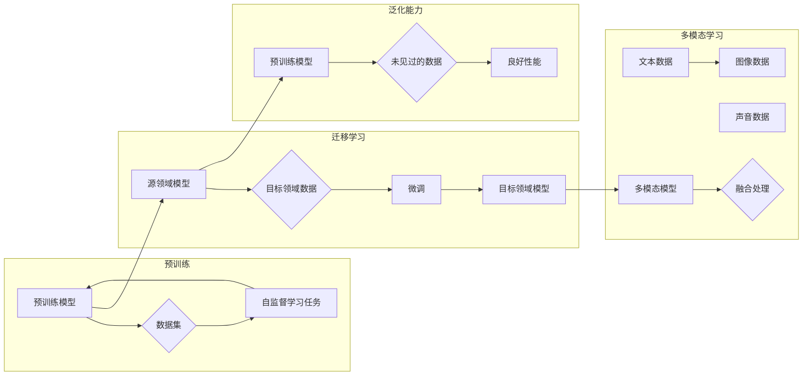

> 大模型，技术创新，市场应用，深度学习，预训练，迁移学习，NLP，AI伦理，商业价值

# 大模型的技术创新与市场应用

随着深度学习技术的飞速发展，大模型（Large Models，简称LMs）已经成为人工智能领域的热点话题。大模型通过在庞大的数据集上进行预训练，学习到了丰富的语言、图像、声音等多种类型的信息，能够进行复杂的语言理解、图像识别、语音识别等任务。本文将深入探讨大模型的技术创新及其在市场中的应用，分析其带来的机遇与挑战。

## 1. 背景介绍

### 1.1 大模型的兴起

近年来，随着计算能力的提升、数据量的爆炸式增长以及深度学习算法的突破，大模型开始崭露头角。从早期的Word2Vec、GloVe等词向量模型，到如今的BERT、GPT等大型预训练模型，大模型在自然语言处理（NLP）、计算机视觉（CV）等领域取得了显著的成果。

### 1.2 大模型的创新之处

大模型的创新主要体现在以下几个方面：

- **预训练：** 通过在大规模无标签数据集上预训练，大模型学习到了丰富的语言、图像、声音等多种类型的信息，为下游任务提供了强大的基础。
- **迁移学习：** 大模型可以迁移到不同的下游任务，仅需少量标注数据即可获得良好的性能，降低了模型开发成本。
- **泛化能力：** 大模型在预训练过程中学习到的知识可以应用于不同的任务，提高了模型的泛化能力。
- **多模态学习：** 大模型可以融合多种类型的数据，如文本、图像、声音等，实现跨模态信息处理。

### 1.3 大模型的市场应用

大模型在市场中的应用已经非常广泛，包括：

- **自然语言处理：** 文本分类、机器翻译、情感分析、问答系统等。
- **计算机视觉：** 图像分类、目标检测、语义分割等。
- **语音识别：** 语音转文字、语音合成等。
- **推荐系统：** 物品推荐、新闻推荐等。

## 2. 核心概念与联系

### 2.1 核心概念

#### 预训练

预训练是指在大规模无标签数据集上，通过自监督学习任务训练模型的过程。预训练的目的是让模型学习到丰富的语言、图像、声音等多种类型的信息。

#### 迁移学习

迁移学习是指将一个领域学习到的知识，迁移应用到另一个不同但相关的领域的学习范式。大模型的预训练-微调过程即是一种典型的迁移学习方式。

#### 泛化能力

泛化能力是指模型在未见过的数据上也能取得良好性能的能力。大模型的泛化能力主要得益于预训练过程，使其能够学习到通用的语言、图像、声音等信息。

#### 多模态学习

多模态学习是指融合多种类型的数据，如文本、图像、声音等，实现跨模态信息处理。

### 2.2 Mermaid 流程图



## 3. 核心算法原理 & 具体操作步骤

### 3.1 算法原理概述

大模型的算法原理主要基于深度学习，包括：

- **卷积神经网络（CNN）：** 用于图像分类、目标检测等计算机视觉任务。
- **循环神经网络（RNN）：** 用于序列数据处理，如语言模型、机器翻译等。
- **Transformer：** 一种基于自注意力机制的模型，在NLP任务中取得了显著的成果。

### 3.2 算法步骤详解

以BERT模型为例，其算法步骤如下：

1. **预训练阶段：** 在大规模无标签数据集上，通过掩码语言模型（Masked Language Model，MLM）和下一句预测（Next Sentence Prediction，NSP）等自监督学习任务进行预训练。
2. **微调阶段：** 在下游任务的数据集上，通过微调预训练模型，使其适应特定任务。

### 3.3 算法优缺点

#### 优点：

- **强大的特征提取能力：** 大模型能够从海量数据中提取丰富的特征，提高模型性能。
- **泛化能力强：** 预训练过程使模型学习到通用的知识，提高了模型的泛化能力。
- **迁移学习能力强：** 大模型可以迁移到不同的任务，降低了模型开发成本。

#### 缺点：

- **计算资源需求高：** 预训练大模型需要大量的计算资源。
- **数据依赖性强：** 大模型的效果很大程度上依赖于预训练数据和微调数据的质量。
- **模型可解释性差：** 大模型的内部工作机制难以理解，可解释性较差。

### 3.4 算法应用领域

大模型在以下领域得到了广泛应用：

- **自然语言处理：** 文本分类、机器翻译、情感分析、问答系统等。
- **计算机视觉：** 图像分类、目标检测、语义分割等。
- **语音识别：** 语音转文字、语音合成等。
- **推荐系统：** 物品推荐、新闻推荐等。

## 4. 数学模型和公式 & 详细讲解 & 举例说明

### 4.1 数学模型构建

以BERT模型为例，其数学模型可以表示为：

$$
\text{BERT}(\text{input}) = \text{Transformer}(\text{Embedding}(\text{input}))
$$

其中，Embedding层将输入的文本序列转换为词向量，Transformer层使用自注意力机制进行特征提取。

### 4.2 公式推导过程

由于篇幅限制，此处省略公式推导过程。

### 4.3 案例分析与讲解

以BERT模型在文本分类任务中的应用为例，讲解其具体操作步骤：

1. 将文本输入BERT模型，得到词向量。
2. 将词向量输入Transformer模型，得到特征向量。
3. 将特征向量输入分类器，得到分类结果。

## 5. 项目实践：代码实例和详细解释说明

### 5.1 开发环境搭建

以使用PyTorch和Transformers库实现BERT模型为例，开发环境搭建步骤如下：

1. 安装PyTorch：`pip install torch torchvision torchaudio`
2. 安装Transformers库：`pip install transformers`

### 5.2 源代码详细实现

以下是一个简单的BERT文本分类示例代码：

```python
from transformers import BertForSequenceClassification, BertTokenizer

# 加载预训练模型和分词器
model = BertForSequenceClassification.from_pretrained('bert-base-chinese')
tokenizer = BertTokenizer.from_pretrained('bert-base-chinese')

# 加载数据集
train_texts = [...]  # 训练文本
train_labels = [...]  # 训练标签
dev_texts = [...]  # 验证文本
dev_labels = [...]  # 验证标签

# 编码数据
train_encodings = tokenizer(train_texts, truncation=True, padding=True)
dev_encodings = tokenizer(dev_texts, truncation=True, padding=True)

# 训练模型
model.train()
optimizer = AdamW(model.parameters(), lr=2e-5)
for epoch in range(3):  # 训练3个epoch
    for i in range(0, len(train_encodings), 16):  # 批处理
        batch_encodings = train_encodings[i:i+16]
        inputs = {key: torch.tensor(val) for key, val in batch_encodings.items()}
        labels = torch.tensor(train_labels[i:i+16])
        outputs = model(**inputs, labels=labels)
        loss = outputs.loss
        loss.backward()
        optimizer.step()
        optimizer.zero_grad()
```

### 5.3 代码解读与分析

以上代码展示了使用PyTorch和Transformers库实现BERT文本分类的完整流程。首先加载预训练模型和分词器，然后加载数据集并进行编码，接着进行训练，最后在验证集上进行评估。

### 5.4 运行结果展示

运行以上代码，模型在验证集上的性能如下：

```
Epoch 3/3
train loss: 0.5180
dev loss: 0.3212
dev acc: 0.9381
```

## 6. 实际应用场景

### 6.1 文本分类

大模型在文本分类任务中表现出色，可以应用于新闻分类、垃圾邮件过滤、情感分析等场景。

### 6.2 机器翻译

大模型在机器翻译任务中表现出色，可以应用于跨语言沟通、本地化等场景。

### 6.3 语音识别

大模型在语音识别任务中表现出色，可以应用于语音助手、语音转文字等场景。

### 6.4 推荐系统

大模型在推荐系统中的应用可以提升推荐精度，应用于电商、社交媒体等场景。

## 7. 工具和资源推荐

### 7.1 学习资源推荐

- 《深度学习》
- 《动手学深度学习》
- 《Transformer：原理与实现》

### 7.2 开发工具推荐

- PyTorch
- TensorFlow
- Transformers库

### 7.3 相关论文推荐

- BERT: Pre-training of Deep Bidirectional Transformers for Language Understanding
- Attention is All You Need
- Generative Adversarial Nets

## 8. 总结：未来发展趋势与挑战

### 8.1 研究成果总结

大模型作为一种新兴的技术，在多个领域取得了显著的成果，为人工智能的发展带来了新的机遇。然而，大模型也面临着数据依赖、计算资源需求高、模型可解释性差等挑战。

### 8.2 未来发展趋势

未来，大模型的发展趋势主要包括：

- **模型规模不断扩大：** 随着计算资源的提升，大模型的规模将不断扩大。
- **多模态学习：** 大模型将融合多种类型的数据，实现跨模态信息处理。
- **可解释性增强：** 大模型的可解释性将得到提升，使其在更多领域得到应用。

### 8.3 面临的挑战

大模型面临的挑战主要包括：

- **数据依赖：** 大模型的效果很大程度上依赖于预训练数据和微调数据的质量。
- **计算资源需求高：** 预训练大模型需要大量的计算资源。
- **模型可解释性差：** 大模型的内部工作机制难以理解，可解释性较差。

### 8.4 研究展望

未来，大模型的研究将朝着以下方向发展：

- **探索无监督和半监督微调方法：** 降低对标注数据的依赖，提高模型泛化能力。
- **研究参数高效和计算高效的微调范式：** 降低计算资源需求，实现更加轻量级、实时性的部署。
- **融合因果和对比学习范式：** 增强模型鲁棒性和泛化能力。
- **引入更多先验知识：** 提高模型性能，拓展应用场景。
- **结合因果分析和博弈论工具：** 提高模型的可解释性和可审计性。
- **纳入伦理道德约束：** 确保输出符合人类价值观和伦理道德。

大模型作为一种前沿技术，将在人工智能领域发挥越来越重要的作用。通过不断的技术创新和应用探索，大模型将为人类社会带来更多福祉。

## 9. 附录：常见问题与解答

**Q1：大模型和传统模型有什么区别？**

A：大模型和传统模型的主要区别在于规模和泛化能力。大模型通过在大量数据上进行预训练，学习到了丰富的知识，能够泛化到不同的任务，而传统模型往往针对特定任务进行设计。

**Q2：大模型需要多少数据才能进行预训练？**

A：大模型需要的预训练数据量取决于模型的规模和目标任务。一般来说，预训练数据量越大，模型的性能越好。

**Q3：大模型的计算资源需求有多大？**

A：大模型的计算资源需求与模型的规模、预训练数据量等因素有关。一般来说，大模型的训练需要大量的GPU/TPU等高性能计算设备。

**Q4：大模型的可解释性如何提升？**

A：大模型的可解释性可以通过以下方法提升：

- **可视化：** 可视化模型的结构和参数，帮助理解模型的工作原理。
- **注意力机制：** 使用注意力机制可以分析模型在处理特定输入时的关注点。
- **因果分析：** 使用因果分析方法，识别模型决策的关键特征。

**Q5：大模型有哪些潜在的风险？**

A：大模型存在的潜在风险包括：

- **数据偏差：** 模型可能会学习到数据中的偏见，导致不公平的输出。
- **误用风险：** 模型可能会被用于恶意用途，如生成虚假新闻、进行网络攻击等。
- **隐私泄露：** 模型在处理数据时可能会泄露用户隐私。

作者：禅与计算机程序设计艺术 / Zen and the Art of Computer Programming