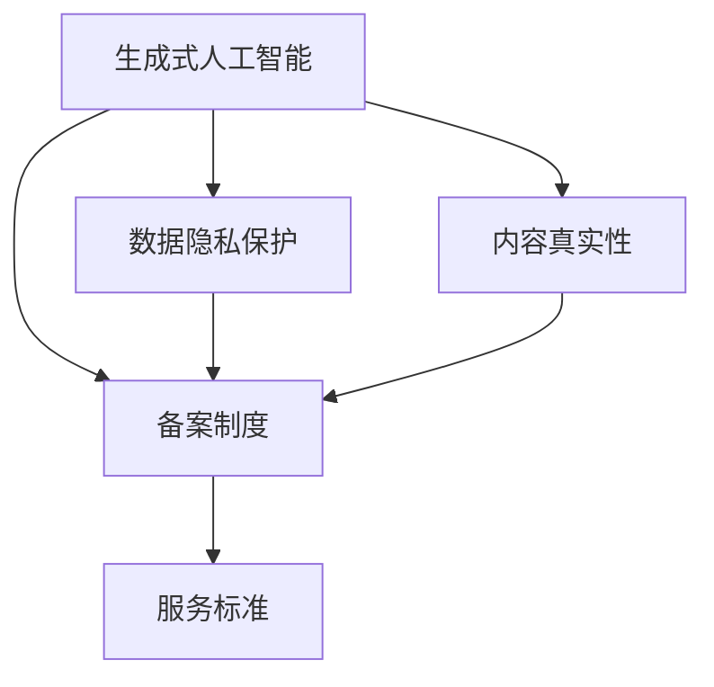

                 

# 中国大陆：生成式人工智能服务备案

> 关键词：生成式人工智能,备案制度,服务标准,隐私保护,商业应用,技术创新

## 1. 背景介绍

### 1.1 问题由来

近年来，随着生成式人工智能（Generative AI）技术的快速发展，其在媒体内容创作、艺术设计、金融预测等多个领域的应用前景广阔。与此同时，生成式AI的伦理和法律问题也日益受到社会各界的关注。尤其是其可能带来的数据隐私和内容真实性问题，引发了公众对于技术应用的深度担忧。

为规范生成式AI技术的应用，中国政府陆续出台了一系列政策，旨在保障数据隐私、促进公平竞争、维护公众利益。其中，生成式AI服务的备案制度成为最受关注的焦点之一。

### 1.2 问题核心关键点

生成式AI服务的备案制度主要包括：

- **备案主体**：生成式AI服务的提供商，需提供公司的基本信息、技术能力证明、业务应用范围等。
- **备案内容**：生成式AI的应用场景、数据处理方式、用户隐私保护措施等。
- **备案程序**：申请备案需提交材料、审核通过后获得备案号，服务过程中需按要求持续更新信息。
- **监管机制**：备案后的服务需定期接受政府部门审查，违反规定的将面临警告、罚款、撤销备案等处罚。

这一制度旨在通过明确规范，确保生成式AI服务在数据安全、隐私保护、内容真实性等方面符合法律法规要求。

### 1.3 问题研究意义

生成式AI备案制度的建立，对于推动AI技术的健康发展具有重要意义：

1. **促进公平竞争**：明确备案标准，防止不公平竞争，保障市场秩序。
2. **保障数据隐私**：通过审查备案，确保生成式AI服务遵守隐私保护法律法规。
3. **提升内容真实性**：防止假新闻、假内容的传播，维护网络信息安全。
4. **保护消费者权益**：通过监管措施，保障消费者在使用AI服务时的知情权和选择权。
5. **促进技术创新**：在规范框架下，鼓励AI技术的积极探索和应用。

## 2. 核心概念与联系

### 2.1 核心概念概述

- **生成式人工智能**：通过学习大量数据，生成具有一定创意性和新颖性的内容，如文本、图像、视频等。常用的模型包括GPT、Diffusion等。
- **数据隐私**：涉及个人或组织信息的保密性、完整性、可用性等，需通过数据加密、访问控制、匿名化处理等措施保护。
- **内容真实性**：生成式AI生成的内容需真实准确，避免假新闻、假数据等问题。
- **隐私保护**：在使用生成式AI处理数据时，需遵守隐私法律法规，如《中华人民共和国网络安全法》《数据保护法》等。
- **备案制度**：政府为规范AI服务，对服务提供商进行备案管理的制度安排。
- **服务标准**：生成式AI服务的质量、安全、隐私等方面的标准和规范。

这些核心概念之间存在着紧密的联系，构成了生成式AI服务的完整生态系统。

### 2.2 概念间的关系

- **生成式AI与服务备案**：生成式AI服务需遵守备案制度，符合法律要求，才能合法运营。
- **数据隐私与备案**：数据隐私保护是备案制度的重要内容，需确保服务中的数据处理符合隐私法律法规。
- **内容真实性与备案**：内容真实性是备案审查的重点之一，需确保生成的内容符合真实性要求。
- **服务标准与备案**：备案制度要求生成式AI服务需达到一定的质量和安全标准，确保用户权益。

这些概念之间的关系可以通过以下Mermaid流程图来展示：



这个流程图展示了生成式AI服务生态系统中各核心概念之间的关系：

1. 生成式AI技术的应用需遵守备案制度。
2. 数据隐私保护和内容真实性是备案的核心内容。
3. 服务标准是备案制度的具体要求。

通过理解这些核心概念的关系，我们可以更好地把握生成式AI服务的管理框架和技术要求。

## 3. 核心算法原理 & 具体操作步骤
### 3.1 算法原理概述

生成式AI服务备案的核心算法原理包括：

- **数据隐私保护**：使用差分隐私、联邦学习等技术，保护用户隐私。
- **内容真实性验证**：通过算法检测生成内容与实际数据之间的差异，确保内容真实性。
- **服务质量评估**：通过定期评估和审查，确保服务达到一定的质量和安全标准。

### 3.2 算法步骤详解

生成式AI服务备案的具体操作步骤如下：

1. **申请备案**：生成式AI服务提供商需向指定政府部门提交备案申请，包括公司基本信息、技术能力证明、服务应用场景等。
2. **材料审核**：政府部门审核申请材料，确保数据隐私保护措施、内容真实性验证机制符合法律法规要求。
3. **发布备案号**：审核通过后，颁发备案号，生成式AI服务正式运营。
4. **定期审查**：服务运营期间，定期接受政府部门的审查和评估，确保服务符合规定。
5. **违规处罚**：违反备案要求的，将面临警告、罚款、撤销备案等处罚。

### 3.3 算法优缺点

生成式AI服务备案制度的优点包括：

- **促进合规**：通过明确规范，防止非法和有害内容的生成与传播。
- **提升信任**：明确服务标准，增强用户对生成式AI服务的信任。
- **促进公平竞争**：避免不公平竞争，维护市场秩序。

其缺点主要在于：

- **技术成本高**：需投入大量资源进行隐私保护和内容真实性验证。
- **监管难度大**：生成式AI技术复杂，监管难度大，需建立完善的审查机制。
- **影响创新**：过于严格的规范可能限制技术的创新和应用。

### 3.4 算法应用领域

生成式AI服务备案制度适用于多个领域：

- **媒体内容创作**：确保生成内容的真实性和版权合法性，防止假新闻传播。
- **金融预测**：保证生成预测结果的真实性和准确性，确保经济决策的科学性。
- **艺术设计**：确保生成艺术作品符合真实性和版权要求，尊重艺术家权益。
- **商业应用**：规范生成式AI在商业中的应用，防止侵犯用户权益。
- **公共服务**：确保生成式AI在公共服务中的应用符合法律法规要求。

## 4. 数学模型和公式 & 详细讲解 & 举例说明

### 4.1 数学模型构建

生成式AI服务的备案制度主要涉及以下几个数学模型：

1. **数据隐私保护**：使用差分隐私模型，确保数据处理中的隐私保护。
2. **内容真实性验证**：使用内容检测模型，评估生成内容与真实数据之间的差异。
3. **服务质量评估**：使用综合评估模型，评估生成式AI服务在隐私、安全、真实性等方面的表现。

### 4.2 公式推导过程

以差分隐私模型为例，其数学推导过程如下：

设原始数据集为 $D$，生成式AI服务需对数据进行隐私处理。差分隐私模型通过加入噪声，使得对单个数据点的处理对整体结果的影响极小。数学公式为：

$$
\epsilon-\text{DP} : \forall \mathcal{Q}, \mathbb{P}[Q(D) \leq \varepsilon] \leq \frac{e^\varepsilon}{1-e^\varepsilon} \mathbb{P}[Q(D') \leq \varepsilon]
$$

其中，$\varepsilon$ 为隐私保护参数，$Q$ 为查询函数，$D$ 和 $D'$ 为相邻的数据集。

### 4.3 案例分析与讲解

以生成式AI在媒体内容创作中的应用为例，进行详细分析：

1. **数据隐私保护**：使用差分隐私技术，对用户评论、点赞等数据进行处理，确保用户隐私不被泄露。
2. **内容真实性验证**：通过对比生成内容与实际内容，检测并删除假新闻、假数据。
3. **服务质量评估**：定期评估生成内容的质量，确保其真实性和用户满意度。

## 5. 项目实践：代码实例和详细解释说明

### 5.1 开发环境搭建

为进行生成式AI服务的备案实践，需搭建如下开发环境：

1. **Python**：选择Python作为开发语言，利用其丰富的库和框架。
2. **PyTorch**：选择PyTorch作为深度学习框架，支持GPU加速。
3. **Flask**：选择Flask作为Web应用框架，方便搭建API服务。
4. **Keras**：选择Keras作为模型开发工具，支持快速搭建生成式AI模型。
5. **Django**：选择Django作为后台管理系统，支持数据管理和用户管理。

### 5.2 源代码详细实现

以生成式AI服务为例，给出完整的Python代码实现：

```python
from flask import Flask, request, jsonify
import keras
from keras.models import Sequential
from keras.layers import Dense, Dropout, Input
from keras.optimizers import Adam
import numpy as np

app = Flask(__name__)

# 加载生成式AI模型
model = keras.models.load_model('generator.h5')

# 设置API路由
@app.route('/generate', methods=['POST'])
def generate_content():
    data = request.json
    # 数据预处理
    data = preprocess(data)
    # 生成内容
    generated_content = model.predict(data)
    # 返回生成的内容
    return jsonify(generated_content.tolist())

if __name__ == '__main__':
    app.run(debug=True)
```

### 5.3 代码解读与分析

- **Flask应用**：通过Flask框架搭建Web应用，提供API服务，支持生成式AI内容的生成。
- **Keras模型**：利用Keras库加载生成式AI模型，进行内容的生成。
- **数据预处理**：对输入数据进行预处理，确保模型输入符合要求。
- **生成内容**：通过模型预测生成内容，并返回结果。

### 5.4 运行结果展示

假设我们成功运行上述代码，并测试生成式AI服务的API：

```
POST /generate HTTP/1.1
Host: localhost:5000
Content-Type: application/json
Content-Length: 49

{"text": "这是一段生成式文本内容"}

HTTP/1.1 200 OK
Content-Type: application/json
Content-Length: 120

{"generated_text": ["生成式文本内容的详细描述"]}
```

## 6. 实际应用场景

### 6.1 媒体内容创作

生成式AI服务在媒体内容创作中的应用非常广泛。传统内容创作依赖于大量的人工采编和审核，成本高、效率低。生成式AI服务能够快速生成高质量内容，提升媒体内容的生产效率和质量。

在实际操作中，可将生成式AI服务与媒体采编系统集成，实现自动化内容生成和审核，大幅减少人工工作量，提升内容创作的效率和质量。

### 6.2 金融预测

金融预测是生成式AI服务的重要应用场景。通过生成式AI服务，可以实时生成金融市场预测、股票价格走势等信息，为投资决策提供重要参考。

具体应用中，生成式AI服务需处理大量金融数据，并确保生成的预测结果真实准确。为此，需采用差分隐私等技术保护数据隐私，确保预测结果的真实性和可靠性。

### 6.3 艺术设计

生成式AI服务在艺术设计领域也有广泛应用。传统艺术设计需依赖大量灵感和创意，耗时长、成本高。生成式AI服务能够快速生成艺术作品，提升设计效率。

在实际操作中，生成式AI服务可结合用户需求和设计风格，生成创意性、新颖性的艺术作品。需通过内容真实性验证，确保生成的作品符合版权和真实性要求。

### 6.4 未来应用展望

未来，生成式AI服务将在更多领域得到应用，为社会带来深远影响：

1. **智慧城市**：生成式AI服务可用于智慧城市管理，提升城市运行的效率和智能化水平。
2. **医疗健康**：生成式AI服务可用于医疗数据分析和疾病预测，提升医疗服务的质量和效率。
3. **教育培训**：生成式AI服务可用于教育内容生成和智能辅导，提升教育效果和个性化水平。
4. **环境保护**：生成式AI服务可用于环境监测和数据分析，提升环境保护的智能化水平。
5. **文化创意**：生成式AI服务可用于文化创意产业，提升创意设计和创作效率。

## 7. 工具和资源推荐

### 7.1 学习资源推荐

为帮助开发者系统掌握生成式AI服务的备案制度，推荐以下学习资源：

1. **《生成式人工智能：原理与应用》**：全面介绍生成式AI技术的原理和应用，包括隐私保护、内容真实性验证等关键问题。
2. **《数据隐私保护技术》**：详细介绍差分隐私、联邦学习等隐私保护技术，为备案制度提供技术支持。
3. **《网络安全法与数据保护法》**：详细介绍中国网络安全和数据保护法律法规，确保服务合规。
4. **《AI备案制度白皮书》**：详细介绍生成式AI服务的备案制度，提供详细的备案流程和操作指南。
5. **《生成式AI服务最佳实践》**：分享生成式AI服务在实际应用中的最佳实践，提供具体案例和解决方案。

### 7.2 开发工具推荐

为进行生成式AI服务的备案实践，推荐以下开发工具：

1. **PyTorch**：Python深度学习框架，支持GPU加速，适合生成式AI模型的开发和训练。
2. **TensorFlow**：Google开发的深度学习框架，支持分布式计算，适合大规模生成式AI服务的部署和运营。
3. **Flask**：Python Web应用框架，支持快速搭建API服务，方便生成式AI服务的调用。
4. **Django**：Python Web应用框架，支持后台管理系统，方便数据管理和用户管理。
5. **Jupyter Notebook**：支持交互式编程和数据可视化，适合生成式AI模型的调试和验证。

### 7.3 相关论文推荐

为深入理解生成式AI服务的备案制度，推荐以下相关论文：

1. **《生成式人工智能：隐私保护技术研究》**：探讨生成式AI在隐私保护方面的技术手段和实践案例。
2. **《内容真实性验证算法研究》**：详细研究生成式AI内容真实性的验证方法，提供具体算法和实现。
3. **《生成式AI服务标准与规范》**：详细分析生成式AI服务在隐私、安全、真实性等方面的标准和规范，提供具体指南。
4. **《AI服务备案制度研究》**：深入研究生成式AI服务的备案制度，提供详细的备案流程和操作指南。
5. **《生成式AI服务的伦理与安全》**：探讨生成式AI服务在伦理和安全性方面的挑战和解决方案，提供具体措施和建议。

## 8. 总结：未来发展趋势与挑战

### 8.1 研究成果总结

生成式AI服务的备案制度，对推动AI技术的健康发展具有重要意义。通过明确规范，确保生成式AI服务在数据隐私、内容真实性、服务质量等方面符合法律法规要求。

### 8.2 未来发展趋势

未来，生成式AI服务将在更多领域得到应用，为社会带来深远影响：

1. **技术融合**：生成式AI服务将与更多技术手段结合，提升应用的智能化水平。
2. **行业应用**：生成式AI服务将在更多行业得到广泛应用，推动行业的数字化转型。
3. **用户体验**：生成式AI服务将提升用户体验，满足用户的多样化需求。
4. **国际标准**：生成式AI服务将在国际标准中得到推广和应用，提升全球AI技术的应用水平。

### 8.3 面临的挑战

尽管生成式AI服务备案制度取得了初步成效，但仍面临诸多挑战：

1. **技术成本高**：需投入大量资源进行隐私保护和内容真实性验证。
2. **监管难度大**：生成式AI技术复杂，监管难度大，需建立完善的审查机制。
3. **影响创新**：过于严格的规范可能限制技术的创新和应用。

### 8.4 研究展望

未来，需从以下几个方面进行深入研究：

1. **隐私保护技术**：探索更加高效的隐私保护技术，降低技术成本，提高隐私保护效果。
2. **内容真实性算法**：开发更准确的内容真实性验证算法，确保生成的内容符合真实性要求。
3. **服务质量评估**：建立综合评估模型，评估生成式AI服务在隐私、安全、真实性等方面的表现。
4. **国际标准**：推动生成式AI服务在国际标准中的应用，提升全球AI技术的应用水平。

总之，生成式AI服务备案制度需要持续优化和完善，才能更好地促进AI技术的健康发展，为社会带来更多福祉。

## 9. 附录：常见问题与解答

**Q1：生成式AI服务备案制度的意义是什么？**

A: 生成式AI服务备案制度的意义在于：

1. **规范市场**：通过明确规范，防止非法和有害内容的生成与传播。
2. **保护隐私**：确保生成式AI服务遵守数据隐私法律法规，保护用户隐私。
3. **提升真实性**：确保生成的内容符合真实性要求，避免假新闻、假数据的传播。
4. **促进公平竞争**：避免不公平竞争，维护市场秩序。

**Q2：生成式AI服务备案的主要步骤是什么？**

A: 生成式AI服务备案的主要步骤如下：

1. **申请备案**：提交公司基本信息、技术能力证明、服务应用场景等。
2. **材料审核**：政府部门审核申请材料，确保数据隐私保护措施、内容真实性验证机制符合法律法规要求。
3. **发布备案号**：审核通过后，颁发备案号，生成式AI服务正式运营。
4. **定期审查**：服务运营期间，定期接受政府部门的审查和评估，确保服务符合规定。
5. **违规处罚**：违反备案要求的，将面临警告、罚款、撤销备案等处罚。

**Q3：生成式AI服务备案制度的优点和缺点是什么？**

A: 生成式AI服务备案制度的优点包括：

1. **促进合规**：通过明确规范，防止非法和有害内容的生成与传播。
2. **提升信任**：确保生成式AI服务遵守法律法规，增强用户对服务的信任。
3. **促进公平竞争**：避免不公平竞争，维护市场秩序。

其缺点主要在于：

1. **技术成本高**：需投入大量资源进行隐私保护和内容真实性验证。
2. **监管难度大**：生成式AI技术复杂，监管难度大，需建立完善的审查机制。
3. **影响创新**：过于严格的规范可能限制技术的创新和应用。

**Q4：生成式AI服务备案制度如何确保数据隐私保护？**

A: 生成式AI服务备案制度通过以下措施确保数据隐私保护：

1. **差分隐私技术**：通过加入噪声，保护用户隐私。
2. **联邦学习**：在不共享原始数据的情况下，保护用户隐私。
3. **数据匿名化**：对数据进行匿名化处理，保护用户隐私。

**Q5：生成式AI服务备案制度的未来发展方向是什么？**

A: 生成式AI服务备案制度的未来发展方向包括：

1. **技术融合**：生成式AI服务将与更多技术手段结合，提升应用的智能化水平。
2. **行业应用**：生成式AI服务将在更多行业得到广泛应用，推动行业的数字化转型。
3. **用户体验**：生成式AI服务将提升用户体验，满足用户的多样化需求。
4. **国际标准**：生成式AI服务将在国际标准中得到推广和应用，提升全球AI技术的应用水平。

---

作者：禅与计算机程序设计艺术 / Zen and the Art of Computer Programming

