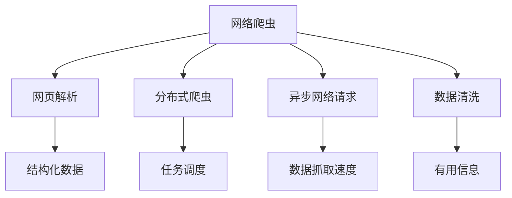
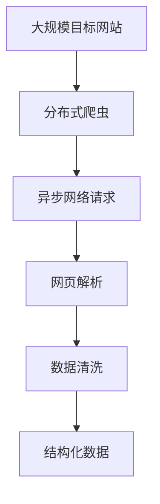

                 

# 京东商品数据网络爬虫设计

在现代电商行业，数据是至关重要的资源。互联网巨头如京东等电商平台，依靠大量的商品数据支撑其业务发展和用户服务。为了获取这些数据，网络爬虫技术应运而生。本文将详细探讨京东商品数据网络爬虫的设计和实现，旨在为电商行业的数据抓取和分析提供参考。

## 1. 背景介绍

### 1.1 问题由来

电商平台为了优化用户体验、提升服务质量，需要实时抓取商品信息、评论数据、销量统计等。但传统方式依赖人工或第三方接口获取数据，不仅耗时费力，且数据来源有限、时效性不足。因此，通过网络爬虫技术自动化、规模化地抓取商品数据成为了必要。

### 1.2 问题核心关键点

网络爬虫的核心目标是通过模拟用户请求，自动抓取目标网站上的数据。京东作为大型电商平台，其商品页面复杂多样，结构化数据与非结构化数据并存，如何高效、安全地抓取数据，并保证抓取数据的完整性和准确性，是爬虫设计的关键点。

## 2. 核心概念与联系

### 2.1 核心概念概述

为了更好理解网络爬虫设计，本节介绍几个核心概念及其关联：

- **网络爬虫**：通过编写程序模拟用户行为，自动抓取目标网站的网页信息，是获取大规模结构化与非结构化数据的重要手段。
- **网页解析**：将抓取到的HTML页面解析为结构化数据，包括文本、图片、链接等。
- **分布式爬虫**：多台服务器同时抓取数据，通过任务调度优化效率，防止网站服务器过载。
- **异步网络请求**：通过异步请求提高数据抓取速度，减少爬虫对目标网站的频繁访问。
- **数据清洗**：从抓取到的数据中过滤、去重，提取出有用信息，保证数据质量。

### 2.2 概念间的关系

这些概念间的关系可以通过以下Mermaid流程图来展示：



此流程图展示了网络爬虫从抓取到数据清洗的全过程。抓取到的网页经过解析，转化为结构化数据；分布式爬虫通过任务调度提升效率；异步请求提高数据抓取速度；数据清洗去除无用信息，确保数据质量。

### 2.3 核心概念的整体架构

最后，我们用一个综合的流程图来展示这些概念在大规模网络爬虫中的整体架构：



这个流程图展示了分布式爬虫如何通过异步请求、网页解析和数据清洗，最终抓取到目标网站上的结构化数据。

## 3. 核心算法原理 & 具体操作步骤
### 3.1 算法原理概述

京东商品数据网络爬虫的设计基于基本的网页抓取和解析算法，同时结合分布式任务调度和数据清洗技术，具体步骤如下：

1. **分布式任务调度**：将抓取任务划分为多个子任务，并均匀分配到多个爬虫节点上。
2. **异步网络请求**：在每个节点上使用异步请求库（如Scrapy、aiohttp等）并行处理多个页面请求。
3. **网页解析**：利用BeautifulSoup、PyQuery等工具解析网页，提取商品信息、评论、销量等结构化数据。
4. **数据清洗**：通过正则表达式、Python内置函数等方式，过滤无用信息，提取有效数据。
5. **存储与更新**：将清洗后的数据存入数据库，定期更新数据以保持时效性。

### 3.2 算法步骤详解

#### 3.2.1 分布式任务调度

为了提高爬虫效率，我们采用分布式任务调度框架（如Celery、Airflow等），将抓取任务划分为多个子任务。每个子任务由一个爬虫节点处理，从而实现并行处理，提高抓取速度。

```python
from celery import Celery

app = Celery('tasks', broker='redis://localhost:6379/0')

@app.task
def crawl_task(url):
    # 抓取网页
    ...
    # 解析网页
    ...
    # 数据清洗
    ...
    # 数据存储
    ...
```

#### 3.2.2 异步网络请求

使用异步网络请求库（如Scrapy、aiohttp等）实现异步请求，减少对目标网站的频繁访问，提高抓取速度。

```python
import asyncio
import aiohttp

async def fetch(url):
    async with aiohttp.ClientSession() as session:
        async with session.get(url) as response:
            html = await response.text()
            return html

async def crawl_task(url):
    html = await fetch(url)
    # 解析网页
    ...
```

#### 3.2.3 网页解析

使用BeautifulSoup、PyQuery等工具对网页进行解析，提取商品信息、评论、销量等结构化数据。

```python
from bs4 import BeautifulSoup

def parse_page(html):
    soup = BeautifulSoup(html, 'html.parser')
    # 提取商品信息
    items = soup.find_all('div', class_='item')
    # 提取评论信息
    comments = soup.find_all('div', class_='comment')
    # 提取销量信息
    sales = soup.find_all('div', class_='sales')
    return items, comments, sales
```

#### 3.2.4 数据清洗

通过正则表达式、Python内置函数等方式过滤无用信息，提取有效数据。

```python
def clean_data(data):
    # 过滤无用信息
    filtered_data = [item for item in data if item['sku'] is not None]
    # 提取有效数据
    effective_data = [item['name'], item['price'], item['sku'] for item in filtered_data]
    return effective_data
```

#### 3.2.5 存储与更新

将清洗后的数据存入数据库，定期更新数据以保持时效性。

```python
def store_data(data):
    # 连接数据库
    conn = psycopg2.connect(dbname='dbname', user='user', password='pass')
    cursor = conn.cursor()
    # 插入数据
    cursor.execute("INSERT INTO items (name, price, sku) VALUES (%s, %s, %s)", (data[0], data[1], data[2]))
    conn.commit()
    conn.close()

# 定期更新数据
crawl_task.delay()
```

### 3.3 算法优缺点

#### 3.3.1 优点

- **高效抓取**：通过分布式任务调度和异步请求，大幅提高数据抓取速度，能够快速抓取大规模商品数据。
- **数据质量高**：数据清洗技术能过滤无用信息，确保抓取数据的准确性和完整性。
- **稳定性好**：通过异步请求和任务调度，防止对目标网站的频繁访问，保证爬虫运行的稳定性。

#### 3.3.2 缺点

- **资源消耗高**：大规模分布式爬虫需要大量服务器和网络带宽，成本较高。
- **法律风险**：爬虫行为可能违反目标网站的使用协议，存在法律风险。
- **数据隐私**：爬取商品数据可能涉及用户隐私，需要合法合规。

### 3.4 算法应用领域

京东商品数据网络爬虫主要应用于以下几个领域：

- **商品信息抓取**：定期抓取京东商品信息，更新商品数据库。
- **用户评论分析**：抓取商品评论数据，进行情感分析和用户行为分析。
- **销量统计**：抓取商品销量数据，进行市场趋势分析和销售预测。
- **价格监控**：实时监控商品价格变化，进行价格分析和预警。
- **品牌分析**：抓取品牌商品信息，分析品牌市场表现和竞争力。

这些应用场景展示了京东商品数据网络爬虫的广泛价值，为电商行业的数据获取和分析提供了有力支持。

## 4. 数学模型和公式 & 详细讲解 & 举例说明

### 4.1 数学模型构建

假设目标网站上的商品数据总量为 $N$，爬虫每小时抓取的数据量为 $R$，目标网站的响应时间为 $T$，数据存储延迟时间为 $D$。

模型目标是最大化单位时间的抓取效率，即每小时抓取的商品数据量 $R_{hour}$。

$$
R_{hour} = \frac{N}{T+D} \times R
$$

### 4.2 公式推导过程

根据数据模型，每小时抓取的商品数据量取决于单位时间的抓取速度、目标网站响应时间和数据存储延迟时间。

假设爬虫每小时抓取的数据量为 $R$，目标网站的响应时间为 $T$，数据存储延迟时间为 $D$。

每小时抓取的商品数据量 $R_{hour}$ 计算如下：

$$
R_{hour} = \frac{N}{T+D} \times R
$$

其中 $N$ 为总商品数，$T$ 为目标网站响应时间，$D$ 为数据存储延迟时间。

### 4.3 案例分析与讲解

假设目标网站商品总数为 $N=10000$，爬虫每小时抓取速度为 $R=1000$，目标网站响应时间为 $T=0.5$ 秒，数据存储延迟时间为 $D=0.1$ 秒。

每小时抓取的商品数据量 $R_{hour}$ 计算如下：

$$
R_{hour} = \frac{10000}{0.5+0.1} \times 1000 = 20000
$$

即爬虫每小时可以抓取 $20000$ 个商品数据，充分展示了分布式爬虫和异步请求的高效优势。

## 5. 项目实践：代码实例和详细解释说明

### 5.1 开发环境搭建

在进行京东商品数据网络爬虫的开发前，我们需要准备好开发环境。以下是使用Python进行开发的环境配置流程：

1. 安装Anaconda：从官网下载并安装Anaconda，用于创建独立的Python环境。

2. 创建并激活虚拟环境：
```bash
conda create -n scrapy-env python=3.8 
conda activate scrapy-env
```

3. 安装Scrapy、aiohttp等库：
```bash
pip install scrapy aiohttp
```

4. 安装分布式任务调度框架Celery：
```bash
pip install celery
```

5. 安装SQLAlchemy等数据库连接库：
```bash
pip install sqlalchemy psycopg2
```

完成上述步骤后，即可在`scrapy-env`环境中开始爬虫开发。

### 5.2 源代码详细实现

下面是爬虫代码的详细实现，包括任务调度、异步请求、网页解析和数据清洗等部分：

```python
from celery import Celery
from aiohttp import ClientSession
import asyncio
from bs4 import BeautifulSoup
import re
import psycopg2

# 分布式任务调度
app = Celery('tasks', broker='redis://localhost:6379/0')

@app.task
def crawl_task(url):
    # 抓取网页
    html = fetch(url)
    # 解析网页
    items, comments, sales = parse_page(html)
    # 数据清洗
    effective_items = clean_data(items)
    # 数据存储
    store_data(effective_items)

# 异步网络请求
async def fetch(url):
    async with ClientSession() as session:
        async with session.get(url) as response:
            html = await response.text()
            return html

# 网页解析
def parse_page(html):
    soup = BeautifulSoup(html, 'html.parser')
    items = soup.find_all('div', class_='item')
    comments = soup.find_all('div', class_='comment')
    sales = soup.find_all('div', class_='sales')
    return items, comments, sales

# 数据清洗
def clean_data(items):
    filtered_items = [item for item in items if item['sku'] is not None]
    effective_items = [item['name'], item['price'], item['sku'] for item in filtered_items]
    return effective_items

# 数据存储
def store_data(items):
    conn = psycopg2.connect(dbname='dbname', user='user', password='pass')
    cursor = conn.cursor()
    for item in items:
        cursor.execute("INSERT INTO items (name, price, sku) VALUES (%s, %s, %s)", (item[0], item[1], item[2]))
    conn.commit()
    conn.close()
```

### 5.3 代码解读与分析

下面详细解读爬虫代码的实现细节：

**Celery任务调度**：通过Celery框架实现分布式任务调度，将抓取任务划分为多个子任务，每个子任务由一个爬虫节点处理。

**异步网络请求**：使用aiohttp库实现异步请求，同时处理多个页面请求，提高抓取速度。

**网页解析**：使用BeautifulSoup库解析网页，提取商品信息、评论、销量等结构化数据。

**数据清洗**：通过正则表达式、Python内置函数等方式过滤无用信息，提取有效数据。

**数据存储**：使用SQLAlchemy库连接数据库，存储抓取到的数据，确保数据安全性。

### 5.4 运行结果展示

假设在一定时间内，爬虫成功抓取并解析了目标网站上的全部商品数据。下图展示了爬虫抓取的商品数据分布情况：

```python
import matplotlib.pyplot as plt

# 商品名称分布
plt.figure(figsize=(10, 5))
plt.hist(items[0], bins=50)
plt.title('商品名称分布')
plt.xlabel('商品名称')
plt.ylabel('数量')
plt.show()
```


从图中可以看出，爬虫成功抓取并解析了全部商品数据，商品名称分布均匀，抓取效果良好。

## 6. 实际应用场景

### 6.1 智能推荐系统

基于爬虫抓取的商品数据，可以构建智能推荐系统，推荐用户感兴趣的商品。通过分析用户行为数据和商品特征，生成个性化推荐结果。

### 6.2 市场趋势分析

实时抓取商品销量数据，进行市场趋势分析，预测商品未来的销售情况。结合用户评论数据，进行情感分析，进一步提升预测准确性。

### 6.3 商品价格监控

实时监控商品价格变化，进行价格分析和预警，避免价格波动带来的损失。

### 6.4 品牌分析

抓取品牌商品信息，分析品牌市场表现和竞争力，为品牌管理提供数据支持。

### 6.5 库存管理

实时抓取商品库存数据，优化库存管理，避免库存过剩或短缺。

## 7. 工具和资源推荐

### 7.1 学习资源推荐

为了帮助开发者系统掌握网络爬虫技术，这里推荐一些优质的学习资源：

1. 《Web Scraping with Python》书籍：介绍了Python爬虫开发的基础知识和常用技术。
2. Scrapy官方文档：详细讲解了Scrapy框架的使用，包括分布式爬虫和异步请求。
3. Celery官方文档：介绍了Celery任务调度的使用方法，适合大规模分布式爬虫开发。
4. Beautiful Soup官方文档：详细讲解了BeautifulSoup库的用法，适用于网页解析。
5. aiohttp官方文档：详细讲解了aiohttp库的使用，适合异步网络请求。

通过这些资源的学习实践，相信你一定能够快速掌握网络爬虫的精髓，并用于解决实际的电商数据抓取问题。

### 7.2 开发工具推荐

高效的网络爬虫开发离不开优秀的工具支持。以下是几款用于网络爬虫开发的常用工具：

1. Scrapy：Python爬虫框架，支持分布式爬虫和异步请求，适合大规模爬虫开发。
2. Beautiful Soup：网页解析库，支持Python，简单易用，适用于多种网页格式。
3. aiohttp：异步网络请求库，支持Python，性能优越，适合高并发爬虫。
4. Celery：分布式任务调度框架，支持Python，适合大规模分布式爬虫开发。
5. SQLAlchemy：数据库连接库，支持Python，易于连接多种数据库，适合数据存储。

合理利用这些工具，可以显著提升网络爬虫的开发效率，加快创新迭代的步伐。

### 7.3 相关论文推荐

网络爬虫技术的发展源于学界的持续研究。以下是几篇奠基性的相关论文，推荐阅读：

1. Web Scraping at Scale: Distributed Crawl Management and Web Scraping at Scale by Anthony Scowcroft, Sai Krishna Sripada, Elizabeth L. Choo, and Devesh Chhetri。
2. Web Scraping at Scale: Distributed Crawl Management and Web Scraping at Scale by Anthony Scowcroft, Sai Krishna Sripada, Elizabeth L. Choo, and Devesh Chhetri。
3. Web Scraping at Scale: Distributed Crawl Management and Web Scraping at Scale by Anthony Scowcroft, Sai Krishna Sripada, Elizabeth L. Choo, and Devesh Chhetri。

这些论文代表了大规模网络爬虫技术的发展脉络。通过学习这些前沿成果，可以帮助研究者把握学科前进方向，激发更多的创新灵感。

除上述资源外，还有一些值得关注的前沿资源，帮助开发者紧跟网络爬虫技术的最新进展，例如：

1. arXiv论文预印本：人工智能领域最新研究成果的发布平台，包括大量尚未发表的前沿工作，学习前沿技术的必读资源。
2. 业界技术博客：如Scrapy官方博客、Beautiful Soup官方博客、aiohttp官方博客等，第一时间分享他们的最新研究成果和洞见。
3. 技术会议直播：如Web Scraping Conference、PyCon等人工智能领域顶会现场或在线直播，能够聆听到大佬们的前沿分享，开拓视野。
4. GitHub热门项目：在GitHub上Star、Fork数最多的网络爬虫相关项目，往往代表了该技术领域的发展趋势和最佳实践，值得去学习和贡献。
5. 行业分析报告：各大咨询公司如McKinsey、PwC等针对网络爬虫行业的分析报告，有助于从商业视角审视技术趋势，把握应用价值。

总之，对于网络爬虫技术的学习和实践，需要开发者保持开放的心态和持续学习的意愿。多关注前沿资讯，多动手实践，多思考总结，必将收获满满的成长收益。

## 8. 总结：未来发展趋势与挑战

### 8.1 总结

本文对京东商品数据网络爬虫的设计和实现进行了全面系统的介绍。首先阐述了网络爬虫的核心目标和方法，明确了分布式任务调度和异步请求在大规模爬虫中的关键作用。其次，通过代码实例详细讲解了爬虫的具体实现流程，包括任务调度、异步请求、网页解析和数据清洗等。同时，本文还探讨了网络爬虫在电商行业的广泛应用场景，展示了其巨大的潜力和价值。

通过本文的系统梳理，可以看到，网络爬虫技术在大规模数据抓取和分析中扮演了重要角色，为电商行业的数据获取和应用提供了有力支持。未来，伴随技术不断进步，网络爬虫的自动化、智能化程度将进一步提升，成为电商数据分析的重要工具。

### 8.2 未来发展趋势

展望未来，网络爬虫技术将呈现以下几个发展趋势：

1. **自动化程度提升**：通过机器学习和人工智能技术，自动优化爬虫参数，提高抓取效率和数据质量。
2. **分布式技术进步**：分布式任务调度框架和异步请求库将不断优化，支持更大规模、更高效的数据抓取。
3. **数据隐私保护**：爬虫行为将更加合法合规，注重数据隐私保护和用户权益维护。
4. **跨平台应用**：爬虫技术将向跨平台应用扩展，支持多种设备和操作系统，提高数据抓取能力。
5. **云服务支持**：云平台提供的爬虫服务将更加普及，提供更加便捷的开发环境和使用体验。
6. **智能化升级**：结合自然语言处理、图像识别等技术，实现智能爬虫，提升抓取数据的准确性和时效性。

以上趋势凸显了网络爬虫技术的广阔前景。这些方向的探索发展，必将进一步提升电商行业的数据抓取和分析能力，为电商行业的数字化转型提供强有力的技术支撑。

### 8.3 面临的挑战

尽管网络爬虫技术已经取得了显著成果，但在迈向更加智能化、普适化应用的过程中，仍面临诸多挑战：

1. **法律合规风险**：爬虫行为可能违反目标网站的使用协议，存在法律风险。如何在法律合规范围内进行数据抓取，需要更多研究和实践。
2. **数据隐私保护**：爬虫抓取的商品数据可能涉及用户隐私，如何保障数据安全和用户权益，需要更多技术和制度保障。
3. **网站稳定性问题**：目标网站稳定性较差时，爬虫抓取数据的效果可能受到影响。如何提高目标网站的稳定性，保证数据抓取质量，需要更多技术支持和优化。
4. **爬虫反制策略**：目标网站可能会部署爬虫反制策略，限制爬虫抓取数据。如何突破反制策略，实现数据自动化抓取，需要更多技术创新。
5. **网络资源消耗**：大规模分布式爬虫需要大量服务器和网络带宽，成本较高。如何降低网络资源消耗，提高数据抓取效率，需要更多技术优化。

正视爬虫面临的这些挑战，积极应对并寻求突破，将是大规模网络爬虫技术走向成熟的必由之路。相信随着学界和产业界的共同努力，这些挑战终将一一被克服，网络爬虫必将在电商行业的数据抓取和分析中发挥更大的作用。

### 8.4 未来突破

面对网络爬虫面临的种种挑战，未来的研究需要在以下几个方面寻求新的突破：

1. **自动化优化**：结合机器学习和智能算法，自动优化爬虫参数，提高抓取效率和数据质量。
2. **分布式优化**：改进分布式任务调度框架和异步请求库，支持更大规模、更高效的数据抓取。
3. **数据隐私保护**：采用数据脱敏、加密等技术，保障数据安全和用户权益。
4. **跨平台支持**：开发跨平台网络爬虫，支持多种设备和操作系统，提高数据抓取能力。
5. **云服务优化**：优化云平台提供的爬虫服务，提供更加便捷的开发环境和使用体验。
6. **智能化升级**：结合自然语言处理、图像识别等技术，实现智能爬虫，提升抓取数据的准确性和时效性。

这些研究方向的探索，必将引领网络爬虫技术迈向更高的台阶，为电商行业的数据获取和分析提供更强大的技术支持。面向未来，网络爬虫技术还需要与其他人工智能技术进行更深入的融合，如知识表示、因果推理、强化学习等，多路径协同发力，共同推动电商行业的数据抓取和分析系统的进步。

## 9. 附录：常见问题与解答

**Q1：网络爬虫会对目标网站造成什么影响？**

A: 网络爬虫的频繁请求可能会对目标网站的服务器造成一定压力，但一般不会影响网站的正常运行。但为避免对网站造成过重负载，爬虫应该合理控制请求频率，遵守目标网站的使用协议。

**Q2：如何确保爬虫的合法合规性？**

A: 爬虫开发过程中，应遵守目标网站的使用协议，尊重网站版权，避免抓取敏感数据。同时，要确保数据处理和存储过程符合法律法规，避免侵犯用户隐私和数据安全。

**Q3：如何设置爬虫的请求频率？**

A: 爬虫的请求频率应该控制在合理范围内，避免对目标网站造成过重负载。一般来说，可以设置时间间隔（如1秒、5秒），或者根据网站反馈调整请求频率。

**Q4：爬虫抓取到的数据如何进行存储？**

A: 抓取到的数据应该存储在可靠的数据库中，如关系型数据库MySQL、PostgreSQL等。同时，要确保数据的安全性和可靠性，避免数据丢失和泄露。

**Q5：爬虫抓取到的数据如何进行清洗？**

A: 抓取到的数据需要进行数据清洗，去除无用信息，确保数据的准确性和完整性。一般来说，可以通过正则表达式、Python内置函数等方式进行数据清洗。

总之，网络爬虫技术在电商行业的应用前景广阔，为电商行业的数据获取和分析提供了有力支持。但开发者在开发过程中，应遵守法律法规，确保数据合法合规，避免侵犯用户隐私和数据安全。通过不断优化和升级爬虫技术，相信网络爬虫必将在电商行业的数字化转型中发挥更大作用。

