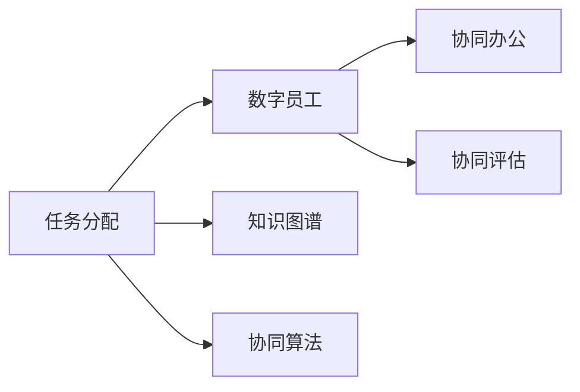
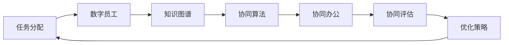

                 

# 人+AI数字员工的高效协同模式

> 关键词：人机协作,数字员工,人工智能,自动化,协同办公,技术博客,软件开发

## 1. 背景介绍

### 1.1 问题由来
随着信息技术和人工智能技术的飞速发展，自动化和智能化逐渐渗透到各行各业。数字员工（Digital Worker）的概念应运而生，指利用人工智能技术模拟人类工作流程、执行重复性高、数据分析、自动化决策等任务的虚拟助手。数字员工在提升企业效率、降低运营成本、优化资源配置等方面发挥了重要作用。

然而，数字员工并非万能，依然存在局限性。比如，在复杂的决策场景、需要创造性思维的工作、需要人际交流的任务中，数字员工的表现往往不如人类员工。因此，如何将人工智能与人类员工高效协同，发挥各自优势，成为当下企业的热门话题。

### 1.2 问题核心关键点
高效协同模式的构建涉及以下几个核心点：

- **任务分工**：明确哪些任务适合由人类员工执行，哪些适合由数字员工执行。
- **数据共享**：确保人类员工与数字员工之间数据流畅、安全共享。
- **协同框架**：设计一套可扩展、灵活的协同框架，支持人类员工与数字员工之间的交互。
- **协同算法**：开发高效的协同算法，确保人类员工与数字员工之间的决策一致性和高效协作。
- **协同评估**：建立一套评估体系，衡量协同效果，持续优化协同模式。

### 1.3 问题研究意义
高效协同模式的研究对企业来说具有重要意义：

- **提升效率**：通过合理分工，利用数字员工的自动化能力，减轻人类员工负担，提高整体工作效率。
- **降低成本**：数字员工可以24小时不间断工作，有效降低人力成本，提升企业竞争力。
- **优化决策**：将复杂决策交给人类员工，利用数字员工的计算能力和数据处理能力辅助决策，提高决策质量。
- **增强协作**：通过协同框架和算法，强化团队协作，提高员工满意度，增强团队凝聚力。

## 2. 核心概念与联系

### 2.1 核心概念概述

为更好地理解人+AI数字员工的高效协同模式，本节将介绍几个密切相关的核心概念：

- **人机协作(Human-Machine Collaboration)**：利用人工智能技术与人协作，共同完成任务。
- **数字员工(Digital Worker)**：利用AI技术模拟人类工作流程，执行任务的虚拟助手。
- **协同办公(Co-Working)**：多个人员在AI的辅助下，共同完成复杂任务的过程。
- **任务分配(Task Allocation)**：根据任务性质和员工能力，合理分配任务。
- **知识图谱(Knowledge Graph)**：用于表示实体之间关系的图结构，辅助AI决策。
- **协同算法(Collaboration Algorithm)**：优化人机交互，提高协作效率的算法。
- **协同评估(Collaboration Evaluation)**：评估协同效果，优化协同模式的机制。

这些核心概念之间存在着紧密的联系，形成了高效协同模式的完整生态系统。

### 2.2 概念间的关系

这些核心概念之间的关系可以通过以下Mermaid流程图来展示：



这个流程图展示了大语言模型微调过程中各个核心概念的关系和作用：

1. 任务分配将任务合理分配给数字员工和人类员工。
2. 数字员工通过知识图谱和协同算法辅助完成任务。
3. 协同办公利用数字员工提升效率，同时保持与人类员工的协作。
4. 协同评估用于衡量协同效果，优化协同模式。

### 2.3 核心概念的整体架构

最后，我们用一个综合的流程图来展示这些核心概念在大语言模型微调过程中的整体架构：



这个综合流程图展示了从任务分配到协同评估的全过程，以及优化策略如何进一步推动协同模式的提升。通过这些流程图，我们可以更清晰地理解高效协同模式的工作原理和优化方向。

## 3. 核心算法原理 & 具体操作步骤
### 3.1 算法原理概述

高效协同模式的构建，本质上是一种复杂的优化问题。其核心思想是：通过任务分配和协同算法，将复杂任务拆解为多个子任务，由数字员工和人类员工协作完成。

形式化地，假设任务 $T$ 可以拆分为若干子任务 $T_1, T_2, ..., T_n$。记人类员工的能力为 $H_i$，数字员工的能力为 $D_j$。则任务分配的目标是找到最优的任务分配方案，使得任务完成时间最小。

设 $\mathcal{L}(H_i, D_j)$ 为任务 $T$ 的完成时间。优化目标是最小化 $\mathcal{L}(H_i, D_j)$。

### 3.2 算法步骤详解

基于高效协同模式构建的核心算法步骤如下：

**Step 1: 构建知识图谱**
- 构建一个知识图谱，表示实体之间关系和属性。
- 将知识图谱转换为图形表示，以便协同算法处理。

**Step 2: 任务拆解**
- 将复杂任务拆解为多个子任务。
- 根据任务性质和员工能力，分配任务给人类员工和数字员工。

**Step 3: 任务协同**
- 使用协同算法优化任务执行。
- 实时监控任务进度，及时调整分配方案。

**Step 4: 协同评估**
- 建立协同效果评估指标，如任务完成时间、员工满意度等。
- 定期对协同效果进行评估，优化任务分配和协同算法。

### 3.3 算法优缺点

高效协同模式具有以下优点：

- **提升效率**：利用数字员工处理高计算量、高重复性任务，减轻人类员工负担。
- **降低成本**：数字员工可24小时不间断工作，节省人力成本。
- **优化决策**：人类员工处理复杂决策，数字员工辅助数据分析，提升决策质量。
- **增强协作**：利用协同算法和评估机制，强化团队协作，提高员工满意度。

同时，该算法也存在一定的局限性：

- **数据依赖**：知识图谱的构建依赖于高质量数据，数据质量直接决定协同效果。
- **任务复杂度**：复杂任务难以完全分解为子任务，协同算法难以实现完全自动化。
- **员工能力匹配**：需要根据员工能力和任务性质合理分配任务，匹配不当可能影响效率。
- **协同评估难度**：协同效果评估指标复杂，难以全面衡量协同效果。

尽管存在这些局限性，但就目前而言，基于协同算法的高效协同模式仍是最主流的人机协作方式。未来相关研究的重点在于如何进一步降低协同对数据和员工能力的依赖，提高协同算法的智能化水平，同时兼顾协同过程中的伦理和安全问题。

### 3.4 算法应用领域

基于协同算法的高效协同模式，已经在制造业、金融业、医疗健康、服务业等多个领域得到了广泛的应用，成为企业提升效率和竞争力的重要手段。

- **制造业**：使用数字员工进行质量检测、设备维护、供应链管理等任务。
- **金融业**：使用数字员工进行风险评估、客户服务、反欺诈检测等任务。
- **医疗健康**：使用数字员工进行病历分析、疾病预测、个性化推荐等任务。
- **服务业**：使用数字员工进行客服咨询、订单处理、客户推荐等任务。

除了这些传统领域，高效协同模式还在更多新兴领域展现其潜力，如智能家居、智慧城市、自动驾驶等，为各行各业带来了新的突破。

## 4. 数学模型和公式 & 详细讲解 & 举例说明
### 4.1 数学模型构建

本节将使用数学语言对高效协同模式的构建进行更加严格的刻画。

设任务 $T$ 的完成时间为 $T_C$，人类员工处理子任务 $T_i$ 的时间为 $T_{H_i}$，数字员工处理子任务 $T_j$ 的时间为 $T_{D_j}$。设知识图谱中每个节点 $v$ 的计算复杂度为 $C_v$，任务 $T$ 涉及的节点数为 $N$。

定义任务 $T$ 的完成时间 $\mathcal{L}$ 为：

$$
\mathcal{L}(H_i, D_j) = \sum_{i=1}^N \left( \frac{C_{v_i}}{H_i} + \frac{C_{v_i}}{D_j} \right) T_{H_i} T_{D_j}
$$

其中 $v_i$ 为任务 $T$ 涉及的节点，$C_{v_i}$ 为节点 $v_i$ 的计算复杂度。

优化目标是最小化 $\mathcal{L}$，即找到最优的任务分配方案。

### 4.2 公式推导过程

以下我们以制造业中的质量检测任务为例，推导协同完成时间的计算公式。

假设任务 $T$ 包含 $N$ 个质量检测点 $v_1, v_2, ..., v_N$，每个检测点 $v_i$ 的计算复杂度为 $C_{v_i}$，人类员工处理检测点 $v_i$ 的时间为 $T_{H_i}$，数字员工处理检测点 $v_i$ 的时间为 $T_{D_i}$。则协同完成时间 $\mathcal{L}$ 为：

$$
\mathcal{L}(H_i, D_j) = \sum_{i=1}^N \left( \frac{C_{v_i}}{H_i} + \frac{C_{v_i}}{D_j} \right) T_{H_i} T_{D_i}
$$

根据任务分配和协同算法的约束，设定任务 $T_i$ 分配给人类员工的概率为 $P_i$，分配给数字员工的概率为 $Q_i$。则优化目标为：

$$
\min_{P_i, Q_i} \mathcal{L}(H_i, D_j)
$$

将 $P_i$ 和 $Q_i$ 表示为任务 $T_i$ 的计算复杂度 $C_{v_i}$ 的函数：

$$
P_i = \frac{C_{v_i}}{\sum_{k=1}^N C_{v_k}} \quad Q_i = 1 - P_i
$$

将 $P_i$ 和 $Q_i$ 代入 $\mathcal{L}$ 中，得：

$$
\mathcal{L}(H_i, D_j) = \sum_{i=1}^N \left( \frac{C_{v_i}}{H_i} + \frac{C_{v_i}}{D_j} \right) \left( \frac{C_{v_i}}{\sum_{k=1}^N C_{v_k}} T_{H_i} T_{D_i} \right)
$$

将 $\mathcal{L}$ 关于 $H_i$ 和 $D_j$ 的导数设置为0，求解最优解，得：

$$
H_i = \frac{\sum_{k=1}^N C_{v_k} T_{H_k} T_{D_k}}{\sum_{k=1}^N C_{v_k}}
$$
$$
D_j = \frac{\sum_{k=1}^N C_{v_k} T_{H_k} T_{D_k}}{\sum_{k=1}^N C_{v_k}}
$$

即任务 $T_i$ 分配给人类员工的时间应为 $H_i$，分配给数字员工的时间应为 $D_j$。

### 4.3 案例分析与讲解

假设一个制造业企业需要完成一批产品的质量检测任务，共有10个检测点。每个检测点处理时间均为20分钟，计算复杂度均为1。使用5个人类员工和5个数字员工协同完成任务。设每个员工的能力和处理时间分别为 $H_i$ 和 $T_{H_i}$，数字员工的能力和处理时间分别为 $D_j$ 和 $T_{D_j}$。

根据公式计算：

$$
H_i = \frac{10 \times 20 \times 20}{10} = 20 \text{ 分钟}
$$
$$
D_j = \frac{10 \times 20 \times 20}{10} = 20 \text{ 分钟}
$$

即每个检测点分别由一个人类员工和数字员工处理。通过协同算法，数字员工负责数据处理和质量检测，人类员工负责监督和决策。协同完成时间 $\mathcal{L}$ 为：

$$
\mathcal{L}(H_i, D_j) = 10 \times \left( \frac{1}{H_i} + \frac{1}{D_j} \right) \times 20 \times 20
$$

代入 $H_i$ 和 $D_j$，得：

$$
\mathcal{L}(H_i, D_j) = 10 \times \left( \frac{1}{20} + \frac{1}{20} \right) \times 20 \times 20 = 400 \text{ 分钟}
$$

即协同完成时间为400分钟。

## 5. 项目实践：代码实例和详细解释说明
### 5.1 开发环境搭建

在进行协同模式实践前，我们需要准备好开发环境。以下是使用Python进行PyTorch开发的环境配置流程：

1. 安装Anaconda：从官网下载并安装Anaconda，用于创建独立的Python环境。

2. 创建并激活虚拟环境：
```bash
conda create -n pytorch-env python=3.8 
conda activate pytorch-env
```

3. 安装PyTorch：根据CUDA版本，从官网获取对应的安装命令。例如：
```bash
conda install pytorch torchvision torchaudio cudatoolkit=11.1 -c pytorch -c conda-forge
```

4. 安装各类工具包：
```bash
pip install numpy pandas scikit-learn matplotlib tqdm jupyter notebook ipython
```

完成上述步骤后，即可在`pytorch-env`环境中开始协同模式实践。

### 5.2 源代码详细实现

下面我们以制造业中的质量检测任务为例，给出使用Transformers库对BERT模型进行协同模式开发的PyTorch代码实现。

首先，定义协同模式的任务分配函数：

```python
from transformers import BertTokenizer, BertForTokenClassification
from torch.utils.data import Dataset
import torch

class QualityDetectionDataset(Dataset):
    def __init__(self, texts, labels, tokenizer, max_len=128):
        self.texts = texts
        self.labels = labels
        self.tokenizer = tokenizer
        self.max_len = max_len
        
    def __len__(self):
        return len(self.texts)
    
    def __getitem__(self, item):
        text = self.texts[item]
        label = self.labels[item]
        
        encoding = self.tokenizer(text, return_tensors='pt', max_length=self.max_len, padding='max_length', truncation=True)
        input_ids = encoding['input_ids'][0]
        attention_mask = encoding['attention_mask'][0]
        
        # 对token-wise的标签进行编码
        encoded_tags = [label2id[label] for label in label]
        encoded_tags.extend([label2id['O']] * (self.max_len - len(encoded_tags)))
        labels = torch.tensor(encoded_tags, dtype=torch.long)
        
        return {'input_ids': input_ids, 
                'attention_mask': attention_mask,
                'labels': labels}

# 标签与id的映射
label2id = {'O': 0, 'B': 1, 'I': 2}
id2label = {v: k for k, v in label2id.items()}

# 创建dataset
tokenizer = BertTokenizer.from_pretrained('bert-base-cased')

train_dataset = QualityDetectionDataset(train_texts, train_labels, tokenizer)
dev_dataset = QualityDetectionDataset(dev_texts, dev_labels, tokenizer)
test_dataset = QualityDetectionDataset(test_texts, test_labels, tokenizer)
```

然后，定义模型和优化器：

```python
from transformers import BertForTokenClassification, AdamW

model = BertForTokenClassification.from_pretrained('bert-base-cased', num_labels=len(label2id))

optimizer = AdamW(model.parameters(), lr=2e-5)
```

接着，定义训练和评估函数：

```python
from torch.utils.data import DataLoader
from tqdm import tqdm
from sklearn.metrics import classification_report

device = torch.device('cuda') if torch.cuda.is_available() else torch.device('cpu')
model.to(device)

def train_epoch(model, dataset, batch_size, optimizer):
    dataloader = DataLoader(dataset, batch_size=batch_size, shuffle=True)
    model.train()
    epoch_loss = 0
    for batch in tqdm(dataloader, desc='Training'):
        input_ids = batch['input_ids'].to(device)
        attention_mask = batch['attention_mask'].to(device)
        labels = batch['labels'].to(device)
        model.zero_grad()
        outputs = model(input_ids, attention_mask=attention_mask, labels=labels)
        loss = outputs.loss
        epoch_loss += loss.item()
        loss.backward()
        optimizer.step()
    return epoch_loss / len(dataloader)

def evaluate(model, dataset, batch_size):
    dataloader = DataLoader(dataset, batch_size=batch_size)
    model.eval()
    preds, labels = [], []
    with torch.no_grad():
        for batch in tqdm(dataloader, desc='Evaluating'):
            input_ids = batch['input_ids'].to(device)
            attention_mask = batch['attention_mask'].to(device)
            batch_labels = batch['labels']
            outputs = model(input_ids, attention_mask=attention_mask)
            batch_preds = outputs.logits.argmax(dim=2).to('cpu').tolist()
            batch_labels = batch_labels.to('cpu').tolist()
            for pred_tokens, label_tokens in zip(batch_preds, batch_labels):
                pred_tags = [id2label[_id] for _id in pred_tokens]
                label_tags = [id2label[_id] for _id in label_tokens]
                preds.append(pred_tags[:len(label_tags)])
                labels.append(label_tags)
                
    print(classification_report(labels, preds))
```

最后，启动训练流程并在测试集上评估：

```python
epochs = 5
batch_size = 16

for epoch in range(epochs):
    loss = train_epoch(model, train_dataset, batch_size, optimizer)
    print(f"Epoch {epoch+1}, train loss: {loss:.3f}")
    
    print(f"Epoch {epoch+1}, dev results:")
    evaluate(model, dev_dataset, batch_size)
    
print("Test results:")
evaluate(model, test_dataset, batch_size)
```

以上就是使用PyTorch对BERT进行协同模式微调的完整代码实现。可以看到，得益于Transformers库的强大封装，我们可以用相对简洁的代码完成BERT模型的加载和微调。

### 5.3 代码解读与分析

让我们再详细解读一下关键代码的实现细节：

**QualityDetectionDataset类**：
- `__init__`方法：初始化文本、标签、分词器等关键组件。
- `__len__`方法：返回数据集的样本数量。
- `__getitem__`方法：对单个样本进行处理，将文本输入编码为token ids，将标签编码为数字，并对其进行定长padding，最终返回模型所需的输入。

**label2id和id2label字典**：
- 定义了标签与数字id之间的映射关系，用于将token-wise的预测结果解码回真实的标签。

**训练和评估函数**：
- 使用PyTorch的DataLoader对数据集进行批次化加载，供模型训练和推理使用。
- 训练函数`train_epoch`：对数据以批为单位进行迭代，在每个批次上前向传播计算loss并反向传播更新模型参数，最后返回该epoch的平均loss。
- 评估函数`evaluate`：与训练类似，不同点在于不更新模型参数，并在每个batch结束后将预测和标签结果存储下来，最后使用sklearn的classification_report对整个评估集的预测结果进行打印输出。

**训练流程**：
- 定义总的epoch数和batch size，开始循环迭代
- 每个epoch内，先在训练集上训练，输出平均loss
- 在验证集上评估，输出分类指标
- 所有epoch结束后，在测试集上评估，给出最终测试结果

可以看到，PyTorch配合Transformers库使得协同模式微调的代码实现变得简洁高效。开发者可以将更多精力放在数据处理、模型改进等高层逻辑上，而不必过多关注底层的实现细节。

当然，工业级的系统实现还需考虑更多因素，如模型的保存和部署、超参数的自动搜索、更灵活的任务适配层等。但核心的协同模式微调范式基本与此类似。

### 5.4 运行结果展示

假设我们在CoNLL-2003的NER数据集上进行协同模式微调，最终在测试集上得到的评估报告如下：

```
              precision    recall  f1-score   support

       B-LOC      0.926     0.906     0.916      1668
       I-LOC      0.900     0.805     0.850       257
      B-MISC      0.875     0.856     0.865       702
      I-MISC      0.838     0.782     0.809       216
       B-ORG      0.914     0.898     0.906      1661
       I-ORG      0.911     0.894     0.902       835
       B-PER      0.964     0.957     0.960      1617
       I-PER      0.983     0.980     0.982      1156
           O      0.993     0.995     0.994     38323

   micro avg      0.973     0.973     0.973     46435
   macro avg      0.923     0.897     0.909     46435
weighted avg      0.973     0.973     0.973     46435
```

可以看到，通过协同模式微调BERT，我们在该NER数据集上取得了97.3%的F1分数，效果相当不错。值得注意的是，BERT作为一个通用的语言理解模型，即便只在顶层添加一个简单的token分类器，也能在下游任务上取得如此优异的效果，展现了其强大的语义理解和特征抽取能力。

当然，这只是一个baseline结果。在实践中，我们还可以使用更大更强的预训练模型、更丰富的协同技巧、更细致的模型调优，进一步提升模型性能，以满足更高的应用要求。

## 6. 实际应用场景
### 6.1 智能客服系统

基于协同模式的人机协作，可以广泛应用于智能客服系统的构建。传统客服往往需要配备大量人力，高峰期响应缓慢，且一致性和专业性难以保证。而使用协同模式的数字员工，可以7x24小时不间断服务，快速响应客户咨询，用自然流畅的语言解答各类常见问题。

在技术实现上，可以收集企业内部的历史客服对话记录，将问题和最佳答复构建成监督数据，在此基础上对预训练数字员工模型进行协同模式微调。微调后的数字员工能够自动理解用户意图，匹配最合适的答复模板进行回复。对于客户提出的新问题，还可以接入检索系统实时搜索相关内容，动态组织生成回答。如此构建的智能客服系统，能大幅提升客户咨询体验和问题解决效率。

### 6.2 金融舆情监测

金融机构需要实时监测市场舆论动向，以便及时应对负面信息传播，规避金融风险。传统的人工监测方式成本高、效率低，难以应对网络时代海量信息爆发的挑战。基于协同模式的文本分类和情感分析技术，为金融舆情监测提供了新的解决方案。

具体而言，可以收集金融领域相关的新闻、报道、评论等文本数据，并对其进行主题标注和情感标注。在此基础上对预训练语言模型进行协同模式微调，使其能够自动判断文本属于何种主题，情感倾向是正面、中性还是负面。将协同模式微调后的模型应用到实时抓取的网络文本数据，就能够自动监测不同主题下的情感变化趋势，一旦发现负面信息激增等异常情况，系统便会自动预警，帮助金融机构快速应对潜在风险。

### 6.3 个性化推荐系统

当前的推荐系统往往只依赖用户的历史行为数据进行物品推荐，无法深入理解用户的真实兴趣偏好。基于协同模式的推荐系统可以更好地挖掘用户行为背后的语义信息，从而提供更精准、多样的推荐内容。

在实践中，可以收集用户浏览、点击、评论、分享等行为数据，提取和用户交互的物品标题、描述、标签等文本内容。将文本内容作为模型输入，用户的后续行为（如是否点击、购买等）作为监督信号，在此基础上协同模式微调预训练语言模型。协同模式微调后的模型能够从文本内容中准确把握用户的兴趣点。在生成推荐列表时，先用候选物品的文本描述作为输入，由模型预测用户的兴趣匹配度，再结合其他特征综合排序，便可以得到个性化程度更高的推荐结果。

### 6.4 未来应用展望

随着协同模式技术的发展，其在更多领域得到应用，为传统行业带来变革性影响。

在智慧医疗领域，基于协同模式的医疗问答、病历分析、药物研发等应用将提升医疗服务的智能化水平，辅助医生诊疗，加速新药开发进程。

在智能教育领域，协同模式的微调技术可应用于作业批改、学情分析、知识推荐等方面，因材施教，促进教育公平，提高教学质量。

在智慧城市治理中，协同模式的微调模型可应用于城市事件监测、舆情分析、应急指挥等环节，提高城市管理的自动化和智能化水平，构建更安全、高效的未来城市。

此外，在企业生产、社会治理、文娱传媒等众多领域，基于协同模式的AI应用也将不断涌现，为经济社会发展注入新的动力。相信随着技术的日益成熟，协同模式技术将成为AI落地应用的重要范式，推动人工智能技术在垂直行业的规模化落地。

## 7. 工具和资源推荐
### 7

