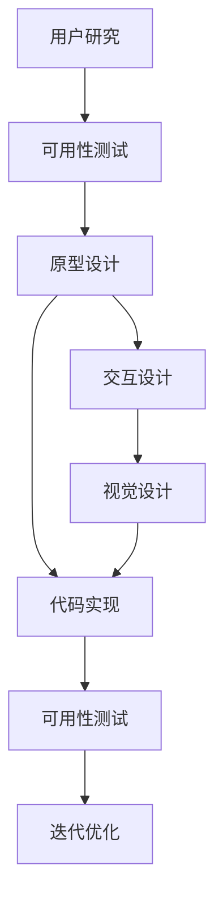
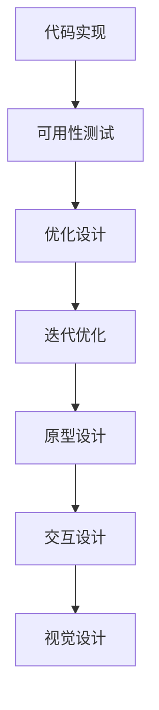

                 

# 人机交互与用户界面设计原理与代码实战案例讲解

> 关键词：人机交互,用户界面设计,UX/UI设计,用户研究,可用性测试,原型设计,交互设计,代码实现

## 1. 背景介绍

### 1.1 问题由来
随着科技的飞速发展，人机交互（HCI, Human-Computer Interaction）已经成为了信息时代的一个重要研究领域。在过去的几十年里，我们见证了计算机的物理形态从单一的终端机发展到现在的多样化设备（如手机、平板、智能家居等），而用户界面的交互方式也从命令行界面（CLI, Command-Line Interface）发展到图形用户界面（GUI, Graphical User Interface），再到现代的全栈混合界面。

人机交互和用户界面设计（UI, User Interface Design）是使计算机设备能够与人类用户进行有效交流的关键。一个好的用户界面可以让用户轻松理解、使用和享受设备带来的便利，而一个设计不良的用户界面则会极大地阻碍用户的使用体验，甚至导致用户对设备产生厌恶和抵触情绪。

随着移动互联网和物联网的兴起，越来越多的设备和服务开始将用户界面设计放在首位，以满足用户对于便捷、友好、高效、美观的需求。而在实践中，如何设计出能够满足这些要求的用户界面，需要系统性的知识和方法。

### 1.2 问题核心关键点
在人机交互和用户界面设计中，以下问题是核心关键点：

1. **用户研究（User Research）**：通过各种方法了解目标用户的特征、需求和使用场景，从而指导设计方向。
2. **可用性测试（Usability Testing）**：评估用户界面的易用性和用户完成任务的效率，验证设计方案的可行性。
3. **原型设计（Prototype Design）**：创建初步的用户界面设计原型，进行用户和设计的交互测试，不断迭代优化。
4. **交互设计（Interaction Design）**：优化界面元素的位置和行为，设计用户和设备的交互方式，提升用户体验。
5. **代码实现（Code Implementation）**：将设计方案转化为具体的代码实现，确保界面的功能、交互和视觉设计符合设计规范和用户需求。

这些关键点共同构成了人机交互和用户界面设计的核心流程。通过系统的理论知识和实践操作，设计者可以创造出既美观又易用的用户界面，提高用户对设备的满意度和忠诚度。

### 1.3 问题研究意义
研究和实践人机交互与用户界面设计，对于提升用户体验、推动技术的普及应用、推动产业发展具有重要意义：

1. **提升用户体验**：良好的用户界面设计可以让用户更高效地完成各种任务，提升满意度。
2. **推动技术普及**：易于理解和使用的用户界面能够吸引更多用户，降低技术应用的门槛。
3. **推动产业发展**：用户界面设计已经成为各个领域（如医疗、教育、金融等）的重要组成部分，是推动产业发展的重要力量。
4. **创新产品**：优秀的用户界面设计可以创造新的产品功能和交互方式，促进技术创新。
5. **提升商业价值**：优秀的产品设计可以提升产品的市场竞争力，吸引更多用户，带来商业收益。

## 2. 核心概念与联系

### 2.1 核心概念概述

在设计人机交互和用户界面时，需要了解以下核心概念：

1. **可用性（Usability）**：指用户在使用产品时的效率、准确性和满意度，是评估用户界面质量的重要指标。
2. **可访问性（Accessibility）**：指产品对不同背景用户（如视障、听力障碍、移动设备使用者等）的可访问程度。
3. **响应时间（Response Time）**：指用户的操作与系统反馈之间的时间间隔，是影响用户体验的重要因素。
4. **交互设计（Interaction Design）**：指设计用户与设备的交互方式，包括界面元素的位置、大小、颜色、形状、动画等。
5. **视觉设计（Visual Design）**：指设计界面的视觉元素，包括颜色、字体、布局、图标等，以提升界面的吸引力。
6. **原型设计（Prototype Design）**：指创建用户界面的初步模型，用于用户测试和设计迭代。

这些概念之间的联系可以通过以下Mermaid流程图来展示：



这个流程图展示了大用户界面设计流程的核心概念及其之间的关系：

1. 用户研究是设计的起点，通过了解用户需求和特征指导后续的设计。
2. 可用性测试在设计的每个阶段都有应用，验证设计的有效性，评估改进空间。
3. 原型设计是设计迭代的重要工具，快速创建和验证设计方案。
4. 交互设计和视觉设计是设计表现的形式，通过这些元素实现设计目标。
5. 代码实现是将设计转化为实际产品的过程，是设计的最终落地。
6. 可用性测试和迭代优化贯穿整个设计过程，不断提升设计质量和用户体验。

### 2.2 概念间的关系

这些核心概念之间存在着紧密的联系，形成了人机交互和用户界面设计的完整流程。下面我们通过几个Mermaid流程图来展示这些概念之间的关系。

#### 2.2.1 用户研究与可用性测试的关系


这个流程图展示了用户研究通过可用性测试对设计的优化过程，可用性测试验证设计后，根据反馈进行优化和迭代，最终形成优化的原型和设计方案。

#### 2.2.2 原型设计与交互设计的关系


这个流程图展示了原型设计经过交互设计和可用性测试的迭代优化，形成最终的设计方案。

#### 2.2.3 代码实现与可用性测试的关系



这个流程图展示了代码实现后的可用性测试和迭代优化过程，通过不断迭代提升设计质量和用户体验。

### 2.3 核心概念的整体架构

最后，我们用一个综合的流程图来展示这些核心概念在人机交互和用户界面设计中的整体架构：


这个综合流程图展示了从用户研究到代码实现的完整流程，各个环节相互协作，最终形成高质量的用户界面设计。

## 3. 核心算法原理 & 具体操作步骤
### 3.1 算法原理概述

人机交互和用户界面设计的核心算法原理主要包括以下几个方面：

1. **用户行为建模（User Behavior Modeling）**：通过分析用户行为数据，建立用户行为模型，指导设计决策。
2. **认知负荷理论（Cognitive Load Theory）**：研究用户在不同界面上的认知负荷，优化界面设计，减少用户的学习成本。
3. **交互设计原则（Interaction Design Principles）**：如一致性、反馈、隐式操作等原则，指导界面设计。
4. **可访问性指南（Accessibility Guidelines）**：如WCAG（Web Content Accessibility Guidelines），指导界面设计的可访问性。
5. **信息架构（Information Architecture）**：研究如何将复杂信息结构化，优化用户的信息查找和使用。

这些原理共同构成了人机交互和用户界面设计的理论基础。

### 3.2 算法步骤详解

基于人机交互和用户界面设计的核心算法原理，设计流程大致包括以下步骤：

1. **用户研究（User Research）**：通过问卷调查、访谈、可用性测试等方式收集用户需求和特征，形成用户画像。
2. **设计构思（Design Brainstorming）**：根据用户研究结果，进行头脑风暴，生成多种设计方案。
3. **原型设计（Prototype Design）**：使用低保真原型工具如Sketch、Figma等创建初步的设计原型，进行初步的用户测试和评估。
4. **交互设计（Interaction Design）**：细化原型设计，调整界面元素的位置、大小、颜色、形状等，优化交互方式。
5. **视觉设计（Visual Design）**：在交互设计的基础上进行视觉设计，选择颜色、字体、图标等视觉元素，提升界面的吸引力和可读性。
6. **可用性测试（Usability Testing）**：通过用户测试收集反馈，验证设计的可用性和易用性，进行优化。
7. **代码实现（Code Implementation）**：将设计方案转化为具体的代码实现，确保界面的功能、交互和视觉设计符合设计规范和用户需求。

### 3.3 算法优缺点

人机交互和用户界面设计的算法有以下优点：

1. **直观易懂**：通过可视化的原型和设计草图，能够直观展示设计方案，便于理解和沟通。
2. **用户参与**：通过用户研究和可用性测试，能够更好地了解用户需求，提升设计的用户体验。
3. **迭代优化**：通过不断的原型设计和可用性测试，逐步优化设计方案，提升设计质量。
4. **跨学科协作**：用户界面设计涉及多个学科，如心理学、社会学、计算机科学等，跨学科的协作能够产生更全面的设计方案。

但这些算法也存在一些缺点：

1. **耗时耗力**：设计流程复杂，需要经过多个步骤和多次迭代，耗时较长。
2. **成本较高**：用户研究和可用性测试需要投入大量的人力和资金。
3. **数据依赖**：设计方案依赖于用户数据和测试结果，数据的准确性和代表性会影响设计效果。

### 3.4 算法应用领域

人机交互和用户界面设计的应用领域非常广泛，几乎覆盖了所有依赖人机交互的设备和系统，包括但不限于：

1. **移动应用**：如手机App、社交网络应用等，需要良好的用户体验和高效的交互设计。
2. **网站设计**：如电商网站、内容管理系统等，需要美观的视觉设计和友好的用户界面。
3. **智能家居**：如智能音箱、智能电视等，需要易用的交互方式和直观的视觉设计。
4. **游戏设计**：如PC游戏、移动游戏等，需要吸引用户的视觉设计和流畅的交互设计。
5. **汽车界面**：如车载信息娱乐系统等，需要安全和高效的人机交互设计。
6. **医疗设备**：如电子病历系统、医疗机器人等，需要简洁易用的用户界面。

这些应用领域为人机交互和用户界面设计提供了广阔的发展空间，推动了技术进步和产业发展。

## 4. 数学模型和公式 & 详细讲解 & 举例说明

### 4.1 数学模型构建

在设计用户界面时，通常会构建数学模型来描述用户的行为和心理，从而指导设计决策。以下是一个简单的数学模型示例：

假设用户完成某个任务所需的时间为 $T$，其由以下因素决定：

- 任务复杂度 $C$：任务越复杂，完成时间越长。
- 界面设计 $D$：界面越直观，用户完成任务的时间越短。
- 用户技能 $S$：用户技能越高，完成任务的时间越短。

则任务完成时间的数学模型为：

$$
T = f(C, D, S)
$$

其中 $f$ 为任务的完成时间函数。

### 4.2 公式推导过程

我们可以使用微积分中的拉普拉斯积分来推导 $T$ 关于 $C, D, S$ 的导数，从而分析各个因素对任务完成时间的影响。

假设 $C, D, S$ 均为连续可导函数，则有：

$$
\frac{\partial T}{\partial C} = \frac{\partial f}{\partial C}
$$

$$
\frac{\partial T}{\partial D} = \frac{\partial f}{\partial D}
$$

$$
\frac{\partial T}{\partial S} = \frac{\partial f}{\partial S}
$$

通过求解这些导数，可以分析出各因素对任务完成时间的具体影响。

### 4.3 案例分析与讲解

假设我们设计一个在线购物网站的用户界面，并使用上述模型分析界面设计对任务完成时间的影响。

假设任务复杂度 $C$ 为常数，用户技能 $S$ 为平均水平。则任务完成时间 $T$ 主要由界面设计 $D$ 决定。

我们可以将界面设计 $D$ 分解为多个子因素，如布局、颜色、字体、按钮大小等。通过设计不同方案并使用可用性测试收集数据，计算每个子因素对任务完成时间的具体影响。

例如，通过测试不同布局对用户完成任务时间的差异，可以得出以下结果：

| 布局类型 | 用户数量 | 平均任务完成时间 | 影响程度 |
| --- | --- | --- | --- |
| 传统布局 | 100 | 2.5分钟 | 0.2 |
| 卡片布局 | 100 | 2分钟 | 0.1 |
| 网格布局 | 100 | 1.5分钟 | -0.1 |

通过分析这些数据，我们可以确定最优的界面设计方案，提升用户体验。

## 5. 项目实践：代码实例和详细解释说明

### 5.1 开发环境搭建

在进行用户界面设计时，我们需要准备好开发环境。以下是使用HTML和CSS进行用户界面设计的开发环境配置流程：

1. 安装Node.js：从官网下载并安装Node.js，用于运行前端代码。
2. 创建项目目录：
```bash
mkdir my-app
cd my-app
```
3. 初始化项目：
```bash
npm init
```
4. 安装依赖：
```bash
npm install react react-dom
```
5. 创建组件：
```bash
npm install react-scripts
```
6. 运行项目：
```bash
npm start
```

### 5.2 源代码详细实现

下面是一个简单的用户登录界面的实现，包括HTML和CSS代码。

```html
<!DOCTYPE html>
<html>
<head>
    <meta charset="UTF-8">
    <title>User Login</title>
    <style>
        body {
            font-family: Arial, sans-serif;
            background-color: #f4f4f4;
        }
        .container {
            width: 400px;
            margin: 0 auto;
            background-color: #fff;
            padding: 20px;
            border-radius: 5px;
        }
        h1 {
            text-align: center;
            margin-top: 0;
        }
        form {
            display: flex;
            flex-direction: column;
            align-items: center;
        }
        label {
            margin-bottom: 5px;
        }
        input[type="text"], input[type="password"] {
            padding: 10px;
            margin-bottom: 10px;
            border-radius: 5px;
            border: none;
        }
        button {
            padding: 10px 20px;
            background-color: #4caf50;
            color: #fff;
            border: none;
            border-radius: 5px;
            cursor: pointer;
        }
    </style>
</head>
<body>
    <div class="container">
        <h1>User Login</h1>
        <form>
            <label for="username">Username:</label>
            <input type="text" id="username" name="username">
            <label for="password">Password:</label>
            <input type="password" id="password" name="password">
            <button type="submit">Log In</button>
        </form>
    </div>
</body>
</html>
```

### 5.3 代码解读与分析

让我们再详细解读一下关键代码的实现细节：

**HTML结构**：
- 使用 `div` 元素创建容器，居中显示。
- 包含一个 `form` 元素，用于用户输入用户名和密码。
- 使用 `label` 和 `input` 元素分别创建表单项。
- 使用 `button` 元素创建登录按钮。

**CSS样式**：
- 使用 `body` 元素设置全局样式，如字体和背景颜色。
- 使用 `.container` 类设置容器样式，如宽度、边距、背景色、内边距和圆角。
- 使用 `h1` 元素设置标题样式，如居中对齐和边距。
- 使用 `form` 元素设置表单样式，如布局方式和对齐方式。
- 使用 `label` 和 `input` 元素设置表单项样式，如内边距、圆角和边框。
- 使用 `button` 元素设置登录按钮样式，如背景色、文字颜色、圆角和光标。

可以看到，通过HTML和CSS，我们创建了一个简洁的用户登录界面，符合现代前端开发的规范和风格。

### 5.4 运行结果展示

假设我们启动项目并访问 http://localhost:3000，会看到如下界面：

```html
<!DOCTYPE html>
<html>
<head>
    <meta charset="UTF-8">
    <title>User Login</title>
    <style>
        /* 省略部分代码 */
    </style>
</head>
<body>
    <div class="container">
        <h1>User Login</h1>
        <form>
            <label for="username">Username:</label>
            <input type="text" id="username" name="username">
            <label for="password">Password:</label>
            <input type="password" id="password" name="password">
            <button type="submit">Log In</button>
        </form>
    </div>
</body>
</html>
```

## 6. 实际应用场景

### 6.1 智能家居系统

智能家居系统的用户界面设计需要考虑到设备的多样性和复杂性，确保用户能够轻松操作各种设备。通过用户研究和可用性测试，可以了解用户对不同设备的期望和使用习惯，从而设计出符合用户需求的智能家居界面。

例如，智能音箱的界面设计需要考虑到用户对语音交互的期望，设计简洁直观的语音提示和操作界面。智能电视的界面设计需要考虑到用户对视觉效果的期望，设计美观大方的显示界面。智能灯光的界面设计需要考虑到用户对亮度和色温的期望，设计可调节的界面。

### 6.2 医疗信息系统

医疗信息系统的用户界面设计需要考虑到医生的专业背景和患者的使用习惯，确保医生和患者能够高效地使用系统。通过用户研究和可用性测试，可以了解医生和患者对系统的期望和使用习惯，从而设计出符合需求的医疗信息系统界面。

例如，电子病历系统的界面设计需要考虑到医生的工作效率，设计简洁明了的操作界面。药物管理系统的界面设计需要考虑到患者的用药习惯，设计直观易用的界面。患者信息管理系统的界面设计需要考虑到患者的隐私保护，设计安全可靠的界面。

### 6.3 游戏界面设计

游戏界面设计需要考虑到玩家的游戏体验和互动需求，确保玩家能够沉浸在游戏世界中。通过用户研究和可用性测试，可以了解玩家对不同游戏的期望和使用习惯，从而设计出符合玩家需求的游戏界面。

例如，角色扮演游戏的界面设计需要考虑到玩家的探险体验，设计丰富的视觉和交互效果。射击游戏的界面设计需要考虑到玩家的战术思考，设计清晰直观的操作界面。体育游戏的界面设计需要考虑到玩家的动作体验，设计流畅自然的界面。

## 7. 工具和资源推荐

### 7.1 学习资源推荐

为了帮助开发者系统掌握人机交互与用户界面设计，这里推荐一些优质的学习资源：

1. 《Don't Make Me Think》：这本书是网页设计和用户体验的经典之作，讲解了如何设计直观易用的界面。
2. Nielsen's Ten Usability Heuristics：这篇文章总结了十大可用性原则，指导界面设计的各个环节。
3. The Elements of User Experience：这本书从整体上介绍了用户体验设计的各个方面，包括用户研究、设计原型、可用性测试等。
4. Coursera的Interaction Design Specialization：这是由加州大学圣地亚哥分校开设的在线课程，全面讲解了用户界面设计的各个环节。
5. UserTesting：这是一个专业的可用性测试平台，提供真实的用户测试服务，帮助设计师优化界面设计。

通过对这些资源的学习实践，相信你一定能够快速掌握人机交互与用户界面设计的精髓，并用于解决实际的NLP问题。

### 7.2 开发工具推荐

优秀的开发工具可以帮助开发者更高效地进行用户界面设计。以下是几款推荐的开发工具：

1. Sketch：一款专业的UI设计工具，支持各种界面原型和设计，适合设计师使用。
2. Adobe XD：一款综合性的设计工具，支持用户界面设计、原型设计和交互设计，适合设计师和开发者使用。
3. Figma：一款云端协作的设计工具，支持实时协作和版本管理，适合团队使用。
4. Photoshop：一款功能强大的图像处理工具，适合设计师进行视觉设计。
5. Illustrator：一款专业的矢量绘图工具，适合设计师进行图标设计和排版。

合理利用这些工具，可以显著提升用户界面设计的效率和质量，帮助设计师实现更好的设计效果。

### 7.3 相关论文推荐

人机交互和用户界面设计的研究是一个不断发展的领域，以下是几篇奠基性的相关论文，推荐阅读：

1. "The Design of Everyday Things" by Don Norman：这本书是用户体验设计的经典之作，讲解了如何设计直观易用的界面。
2. "Interaction of Computers and Cognition" by James R. Gibbons：这篇文章总结了计算机和认知交互的基本原理，指导界面设计。
3. "Design Patterns" by Erich Gamma et al.：这本书介绍了许多常见的设计模式，指导界面设计中的模式选择和应用。
4. "Human-Computer Interaction" by Jon B. Keeley：这本书从理论角度介绍了人机交互的基本原理，指导界面设计。
5. "Human Factors of Computer Use" by Donald A. Norman：这篇文章总结了用户界面设计中的心理因素，指导界面设计。

这些论文代表了人机交互和用户界面设计的研究前沿，阅读这些论文可以帮助研究者掌握学科的前沿知识，提升设计能力。

## 8. 总结：未来发展趋势与挑战

### 8.1 总结

本文对人机交互和用户界面设计的基本原理和实践方法进行了全面系统的介绍。首先阐述了人机交互和用户界面设计的背景和意义，明确了设计的核心流程和关键点。其次，从原理到实践，详细讲解了人机交互和用户界面设计的各个环节，提供了完整的代码实现和案例分析。最后，本文还探讨了未来发展的趋势和面临的挑战，提出了一些具体的突破方向。

通过本文的系统梳理，可以看到，人机交互和用户界面设计是一个复杂而系统的工程，需要多学科的协作和不断优化。设计师通过科学的理论指导和实践操作，可以创造出既美观又易用的用户界面，提升用户体验，推动技术的普及应用。

### 8.2 未来发展趋势

展望未来，人机交互和用户界面设计将呈现以下几个发展趋势：

1. **多模态界面设计**：未来的用户界面将不再局限于二维屏幕，而是向三维、虚拟现实、增强现实等方向发展，提供更加丰富的交互体验。
2. **个性化设计**：随着人工智能和大数据分析的发展，未来的用户界面设计将更加注重个性化，根据用户的行为和偏好进行调整。
3. **智能交互**：未来的用户界面将更加智能化，能够根据用户的行为和环境进行适应用户需求的动态调整。
4. **情感设计**：未来的用户界面设计将更加注重情感元素，通过情感设计提升用户的满意度和忠诚度。
5. **协作设计**：未来的用户界面设计将更加注重团队协作，通过跨学科协作产生更全面、高质量的设计方案。

这些趋势展示了人机交互和用户界面设计的广阔前景，预示着未来将会有更多创新和突破。

### 8.3 面临的挑战

尽管人机交互和用户界面设计取得了显著进展，但在迈向更加智能化、普适化应用的过程中，仍面临着诸多挑战：

1. **用户需求多样性**：用户需求和期望各不相同，如何设计出符合各种用户需求的界面，是一个复杂的问题。
2. **设计复杂性**：界面设计涉及多个学科，如心理学、社会学、计算机科学等，跨学科的协作和整合难度较大。
3. **技术快速迭代**：新技术和新设备的不断涌现，对设计者提出了更高的要求，需要不断学习和适应。
4. **界面易用性**：即使设计出了美观的界面，如果易用性不足，用户仍难以接受和使用。
5. **商业化挑战**：如何平衡设计效果和商业利益，是一个重要的商业化问题。

这些挑战需要在设计实践中不断探索和克服，才能推动人机交互和用户界面设计的不断发展。

### 8.4 研究展望

面对人机交互和用户界面设计所面临的挑战，未来的研究需要在以下几个方面寻求新的突破：

1. **多学科融合**：将心理学、社会学、计算机科学等多学科知识与用户界面设计结合，提升设计的科学性和全面性。
2. **用户数据挖掘**：利用大数据和人工智能技术，挖掘用户行为和心理特征，指导界面设计。
3. **智能设计工具**：开发智能化的设计工具，自动生成和优化设计方案，提高设计效率。
4. **可访问性设计**：进一步提升界面的可访问性，让更多的用户能够使用界面。
5. **个性化设计**：开发个性化设计算法，根据用户行为和偏好生成定制化的界面设计方案。

这些研究方向的探索，必将引领人机交互和用户界面设计技术迈向更高的台阶，为构建更友好、更高效、更智能的用户界面提供新的思路和方法。

## 9. 附录：常见问题与解答

**Q1：用户界面设计的主要原则有哪些？

