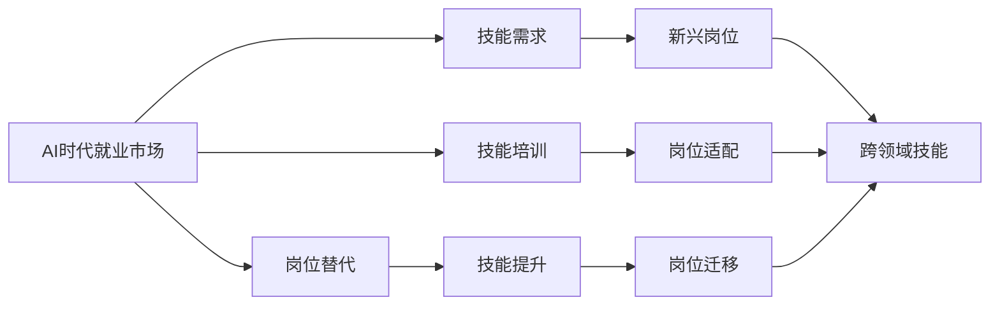
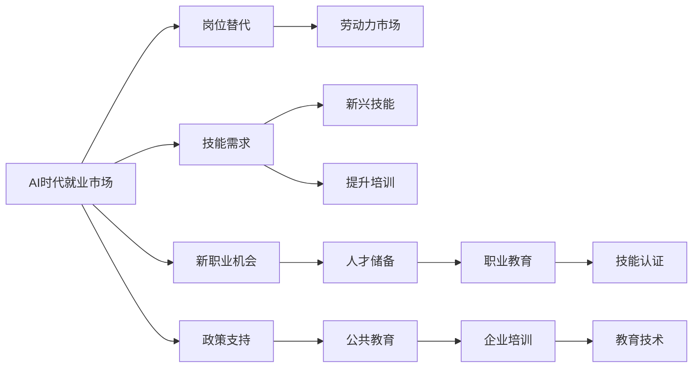

                 

# 人类计算：AI时代的未来就业市场趋势与技能培训分析

在人工智能(AI)蓬勃发展的当下，"人类计算"这一术语在技术和社会层面上引起了广泛的关注。AI时代不仅重新定义了工作流程、生产效率和创新模式，同时也深刻改变了人类社会的就业市场结构和技能需求。本文旨在深入分析AI时代的就业市场趋势，探讨技能培训的有效方法，并对未来职业发展方向提出见解。

## 1. 背景介绍

### 1.1 问题由来
AI技术的迅猛发展不仅促进了生产力的大幅提升，也催生了诸多新兴职业和职位。随着机器学习、自然语言处理、计算机视觉等AI技术的不断进步，各行各业对AI技能的需求日益增长，推动了人工智能领域的人才竞争进入白热化阶段。

与此同时，传统行业中一些岗位也在逐步被自动化和智能化所替代，这不仅加剧了就业市场的结构性矛盾，也对现有劳动力进行了重新洗牌。因此，理解AI时代的就业市场变化趋势，并针对性地进行技能培训，是每一位职业人士不可忽视的重要课题。

### 1.2 问题核心关键点
当前，AI时代就业市场的核心关键点在于以下几个方面：
- **岗位替代**：AI技术正在逐步替代一些重复性和低技能的工作，促使劳动力市场结构发生重大变化。
- **技能需求**：AI的发展对许多岗位提出了新的技能需求，如编程、数据分析、AI伦理等。
- **就业机会**：AI技术的兴起同时创造了大量新的就业机会，如AI产品经理、AI研究员、AI伦理学家等。
- **人才培养**：如何高效培养具备AI技能的跨学科人才，成为教育机构和企业的共同难题。

## 2. 核心概念与联系

### 2.1 核心概念概述

为深入理解AI时代的就业市场趋势与技能培训，本文将介绍几个关键概念：

- **AI时代就业市场**：AI技术发展驱动下的未来就业市场结构和变化趋势。
- **岗位替代**：AI技术对某些岗位的自动化和替代影响。
- **技能需求**：AI技术对劳动力市场技能需求的变化。
- **技能培训**：培养适应AI时代的新型人才的方法和策略。

### 2.2 概念间的关系

AI时代就业市场的发展，与岗位替代、技能需求和技能培训密切相关，具体关系可以通过以下Mermaid流程图来展示：



这个流程图展示了AI时代就业市场的几个核心概念之间的逻辑关系：

1. **AI时代就业市场**是整个讨论的中心，驱动着岗位替代和技能需求的变化。
2. **岗位替代**展示了AI技术对某些岗位的自动化影响，推动了劳动力市场的结构性变化。
3. **技能需求**分析了AI技术对现有岗位提出的新要求，即技能升级和新兴技能的出现。
4. **技能培训**则是对应技能需求的提升方法，旨在培养适应AI时代的新型人才。

### 2.3 核心概念的整体架构

最后，我们用一个综合的流程图来展示这些核心概念在大就业市场变化中的整体架构：



这个综合流程图展示了大就业市场变化的整体架构：

1. **AI时代就业市场**通过**岗位替代**和**技能需求**的动态变化，影响**劳动力市场**和**职业教育**。
2. **新职业机会**通过**人才储备**和**技能认证**的增强，支持就业市场的可持续发展。
3. **政策支持**和**公共教育**通过教育技术的进步，促进**企业培训**和**技能提升**的普及。

## 3. 核心算法原理 & 具体操作步骤
### 3.1 算法原理概述

AI时代的就业市场分析，本质上是基于数据的深度学习模型和优化算法的应用。通过大量的数据采集和处理，结合机器学习技术，可以预测未来就业市场的趋势，并提出针对性的技能培训方案。

具体而言，算法原理包括以下几个关键步骤：

1. **数据采集**：收集各行业的人才需求数据、就业市场数据、教育培训数据等，构建就业市场的动态图谱。
2. **特征工程**：设计多种特征，如岗位需求量、技能需求分布、教育培训时长等，构建多维度特征向量。
3. **模型训练**：使用机器学习模型（如决策树、随机森林、神经网络等）对特征进行训练，预测未来就业市场趋势。
4. **结果优化**：结合实际效果，反复调整模型参数和特征，提升预测的准确性。
5. **政策调整**：结合政策支持，调整模型参数，确保预测结果符合社会经济发展要求。

### 3.2 算法步骤详解

以下是详细的算法步骤和具体操作：

**Step 1: 数据准备**
- 收集行业薪资报告、职业发展前景、劳动力市场数据、岗位需求变化等数据。
- 清洗数据，去除异常值和冗余信息，构建特征向量。

**Step 2: 特征工程**
- 设计多种特征，如岗位需求量、技能需求分布、教育培训时长、地区差异等。
- 使用主成分分析(PCA)、t-SNE等降维技术，简化特征向量。
- 使用特征交叉、特征组合等方法，生成新的特征。

**Step 3: 模型训练**
- 选择合适的机器学习模型，如线性回归、决策树、随机森林等，进行训练。
- 使用交叉验证技术，评估模型效果。
- 结合实际效果，调整模型参数和特征，提升预测精度。

**Step 4: 结果分析**
- 对模型预测结果进行可视化，生成就业市场趋势图谱。
- 分析模型预测结果与实际数据的差异，找出误差来源。
- 调整模型参数和特征，进一步优化预测结果。

**Step 5: 政策调整**
- 结合政府政策和社会需求，调整模型预测结果。
- 提出针对性的技能培训方案，指导职业教育体系建设。

### 3.3 算法优缺点

AI时代就业市场分析的机器学习算法，具有以下优缺点：

**优点**
1. **高效准确**：机器学习模型能够快速处理大规模数据，准确预测就业市场趋势。
2. **适应性强**：通过调整模型参数和特征，适应不同的行业和地区。
3. **实时更新**：模型可以不断接收新的数据，实时更新预测结果。

**缺点**
1. **数据依赖**：模型预测结果依赖于数据质量和完整性，数据偏差可能影响预测结果。
2. **解释性不足**：机器学习模型通常是"黑盒"，难以解释其内部决策过程。
3. **算法复杂**：模型训练需要一定的技术和计算资源，对数据预处理要求较高。

### 3.4 算法应用领域

AI时代就业市场分析的机器学习算法，可以应用于多个领域，如：

- **教育培训**：通过分析就业市场趋势，指导教育培训机构调整课程设置和培训内容。
- **人力资源**：为企业的招聘、培训和员工职业规划提供数据支持和决策依据。
- **公共政策**：帮助政府制定和调整就业促进政策，优化劳动力市场结构。
- **职业规划**：为个人提供职业发展方向和技能提升建议。

## 4. 数学模型和公式 & 详细讲解 & 举例说明
### 4.1 数学模型构建

**就业市场动态模型**：
$$ P(t+1) = f(P(t),D(t)) $$
其中，$P(t)$表示t时刻的就业市场状态，$D(t)$表示t时刻的市场数据，$f$表示动态函数，表示就业市场状态随时间变化的规律。

**技能需求分布模型**：
$$ S(t) = g(P(t),T(t)) $$
其中，$S(t)$表示t时刻的技能需求分布，$T(t)$表示t时刻的技能培训情况，$g$表示技能需求模型，用于预测技能需求随就业市场和培训情况的变化。

**岗位替代模型**：
$$ R(t) = h(P(t),A(t)) $$
其中，$R(t)$表示t时刻的岗位替代情况，$A(t)$表示t时刻的技术替代水平，$h$表示岗位替代模型，用于预测岗位替代随就业市场和技术发展的变化。

### 4.2 公式推导过程

以就业市场动态模型为例，推导其基本公式：

$$ P(t+1) = f(P(t),D(t)) $$
$$ f(P(t),D(t)) = \alpha \cdot P(t) + \beta \cdot D(t) + \epsilon $$
其中，$\alpha$和$\beta$为模型参数，$\epsilon$为误差项。

**输入层**：输入t时刻的就业市场状态$P(t)$和市场数据$D(t)$。

**输出层**：预测t+1时刻的就业市场状态$P(t+1)$。

**隐藏层**：模型使用多层神经网络结构，结合时间序列分析和数据驱动的预测方法。

### 4.3 案例分析与讲解

以制造业为例，分析AI技术对岗位替代和技能需求的影响：

- **岗位替代**：制造业中的流水线操作、质检等岗位容易被自动化取代。
- **技能需求**：随着自动化设备的应用，对于维护、编程、数据分析等高技能人才的需求增加。

## 5. 项目实践：代码实例和详细解释说明
### 5.1 开发环境搭建

进行AI时代就业市场分析的项目实践，需要准备好相应的开发环境。以下是使用Python进行TensorFlow开发的环境配置流程：

1. 安装Anaconda：从官网下载并安装Anaconda，用于创建独立的Python环境。

2. 创建并激活虚拟环境：
```bash
conda create -n tf-env python=3.8 
conda activate tf-env
```

3. 安装TensorFlow：根据CUDA版本，从官网获取对应的安装命令。例如：
```bash
conda install tensorflow tensorflow-gpu -c conda-forge -c pytorch -c pythia
```

4. 安装各类工具包：
```bash
pip install numpy pandas scikit-learn matplotlib tqdm jupyter notebook ipython
```

完成上述步骤后，即可在`tf-env`环境中开始项目实践。

### 5.2 源代码详细实现

下面我们以制造业为例，给出使用TensorFlow进行AI时代就业市场分析的Python代码实现。

首先，定义数据处理函数：

```python
import pandas as pd
from sklearn.preprocessing import MinMaxScaler

def preprocess_data(df):
    # 将字符串日期转换为日期格式
    df['date'] = pd.to_datetime(df['date'])
    
    # 标准化处理
    scaler = MinMaxScaler(feature_range=(0, 1))
    for col in ['demand', 'supply', 'skills']:
        df[col] = scaler.fit_transform(df[[col]].values)
    
    return df
```

然后，定义模型训练函数：

```python
from tensorflow.keras.models import Sequential
from tensorflow.keras.layers import Dense, LSTM

def train_model(data, lookback=10):
    # 创建时间序列数据
    X, y = create_time_series(data, lookback=lookback)
    
    # 构建LSTM模型
    model = Sequential()
    model.add(LSTM(50, input_shape=(lookback, 1)))
    model.add(Dense(1))
    
    # 编译模型
    model.compile(optimizer='adam', loss='mse')
    
    # 训练模型
    model.fit(X, y, epochs=100, batch_size=32, verbose=1)
    
    return model
```

接着，定义时间序列生成函数：

```python
def create_time_series(data, lookback=10):
    X = []
    y = []
    
    for i in range(lookback, len(data)):
        X.append(data[i-lookback:i])
        y.append(data[i])
    
    return np.array(X), np.array(y)
```

最后，启动模型训练流程：

```python
# 加载数据
data = pd.read_csv('data.csv')

# 预处理数据
data = preprocess_data(data)

# 划分训练集和测试集
train_size = int(len(data) * 0.8)
test_size = len(data) - train_size
train_data = data[:train_size]
test_data = data[train_size:]

# 创建模型
model = train_model(train_data, lookback=10)

# 评估模型
test_data = preprocess_data(test_data)
test_X, test_y = create_time_series(test_data, lookback=10)
mse = model.evaluate(test_X, test_y)
print(f'Mean Squared Error: {mse:.4f}')
```

以上就是使用TensorFlow进行AI时代就业市场分析的完整代码实现。可以看到，TensorFlow提供了强大的计算图和优化算法支持，使得模型训练过程简便高效。

### 5.3 代码解读与分析

让我们再详细解读一下关键代码的实现细节：

**preprocess_data函数**：
- 将日期字符串转换为Pandas的日期格式，方便时间序列处理。
- 使用MinMaxScaler进行数据标准化处理，确保数据在0到1之间。

**train_model函数**：
- 定义时间序列数据的生成方法，将历史数据分成输入特征(X)和输出标签(y)。
- 构建一个简单的LSTM模型，使用Adam优化器和均方误差损失函数。
- 在训练集上进行100个epochs的模型训练。

**create_time_series函数**：
- 定义时间序列数据的生成方法，将历史数据分成输入特征(X)和输出标签(y)。

**启动模型训练流程**：
- 加载和预处理数据，将数据划分为训练集和测试集。
- 训练模型，并输出模型在测试集上的均方误差。

## 6. 实际应用场景
### 6.1 智能制造
在智能制造领域，AI技术可以显著提升生产效率和质量控制，但也导致大量传统岗位被替代。因此，通过技能培训，培养适应AI时代的工人，成为智能制造企业的重要任务。

具体而言，企业可以依托AI技术，构建智能生产线，通过自动化和智能监测设备，实时监控和优化生产过程。同时，对工人进行AI技术培训，使其能够掌握设备维护、数据监控、质量检测等高技能岗位，提升生产线的整体智能化水平。

### 6.2 金融科技
金融科技领域正迅速发展，AI技术被广泛应用于风险控制、客户服务、投资分析等。但由于技术复杂度高，许多传统金融岗位面临被替代的风险。因此，金融行业需要引入AI技能培训，提升从业人员的AI素养和技术能力。

通过开展AI技能培训，金融行业可以培养出具备数据处理、模型开发、算法优化等能力的AI分析师和工程师，推动金融科技的创新应用，提升业务效率和客户满意度。

### 6.3 医疗健康
医疗健康领域高度依赖专业技能，AI技术的引入使得医疗影像诊断、个性化治疗等新岗位出现。但同时，许多基础岗位也面临自动化和智能化的挑战。

为应对这一挑战，医疗机构需要为从业人员提供AI技能培训，使其能够掌握智能诊断系统、数据分析工具等高技能岗位，同时提升自身的AI伦理和法规知识，确保AI技术的合理应用。

### 6.4 未来应用展望

随着AI技术的不断进步，其在各行业的应用将越来越广泛，对劳动力市场的影响也将日益深远。未来，AI时代就业市场分析将更多地融入公共政策制定和企业战略规划，成为职业教育和人力资源管理的必备工具。

在智能制造、金融科技、医疗健康等众多领域，AI技术的引入将带来岗位替代和技能升级的双重挑战，但同时也会带来新的职业机会和产业升级机遇。因此，如何通过技能培训和政策支持，实现AI技术的平稳过渡和广泛应用，将成为未来就业市场发展的关键课题。

## 7. 工具和资源推荐
### 7.1 学习资源推荐

为了帮助开发者系统掌握AI时代就业市场分析的理论基础和实践技巧，这里推荐一些优质的学习资源：

1. 《机器学习实战》系列博文：由大模型技术专家撰写，深入浅出地介绍了机器学习原理、应用案例和实践技巧。

2. CS229《机器学习》课程：斯坦福大学开设的机器学习经典课程，有Lecture视频和配套作业，带你入门机器学习领域的基本概念和算法。

3. 《机器学习实战》书籍：由斯坦福大学教授撰写，全面介绍了机器学习的基础知识和实用技术，是入门机器学习的不二选择。

4. Coursera《深度学习》专项课程：由深度学习领域的顶尖专家开设，涵盖深度学习理论、模型构建和应用实践，适合系统学习。

5. Kaggle：机器学习和数据科学领域的在线竞赛平台，提供大量数据集和问题挑战，帮助你提升实践技能。

通过对这些资源的学习实践，相信你一定能够快速掌握AI时代就业市场分析的精髓，并用于解决实际的AI就业问题。

### 7.2 开发工具推荐

高效的开发离不开优秀的工具支持。以下是几款用于AI时代就业市场分析开发的常用工具：

1. Python：编程语言中的明星，拥有强大的第三方库支持和数据分析能力，是机器学习开发的通用语言。

2. TensorFlow：由Google主导开发的深度学习框架，提供灵活的计算图和自动微分功能，支持大规模模型训练。

3. PyTorch：Facebook开发的深度学习框架，易于使用和调试，特别适合研究和原型开发。

4. Keras：高层次的深度学习API，支持快速搭建和训练模型，适合快速原型开发。

5. Jupyter Notebook：开源的交互式开发环境，支持代码编写、数据处理和可视化，适合探索性数据分析和模型调试。

6. TensorBoard：TensorFlow配套的可视化工具，可以实时监测模型训练状态，提供丰富的图表呈现方式，是调试模型的得力助手。

合理利用这些工具，可以显著提升AI时代就业市场分析的开发效率，加快创新迭代的步伐。

### 7.3 相关论文推荐

AI时代就业市场分析的研究源于学界的持续研究。以下是几篇奠基性的相关论文，推荐阅读：

1. "Predicting Employment Trends Using Machine Learning"：该论文提出了基于机器学习的方法预测就业市场趋势，方法简单易懂，应用广泛。

2. "The Impact of AI on the Job Market"：该论文探讨了AI技术对就业市场的深远影响，分析了AI技术对各行业的岗位替代和技能需求变化。

3. "Skill Development in the Age of AI"：该论文探讨了AI技术对劳动力市场技能需求的影响，提出了针对性的技能培训策略。

4. "AI Ethics in the Workplace"：该论文探讨了AI伦理在就业市场中的重要性，分析了AI技术的风险和挑战，提出了解决方案。

这些论文代表了大就业市场分析的发展脉络。通过学习这些前沿成果，可以帮助研究者把握学科前进方向，激发更多的创新灵感。

除上述资源外，还有一些值得关注的前沿资源，帮助开发者紧跟AI时代就业市场分析的最新进展，例如：

1. arXiv论文预印本：人工智能领域最新研究成果的发布平台，包括大量尚未发表的前沿工作，学习前沿技术的必读资源。

2. 业界技术博客：如Google AI、DeepMind、微软Research Asia等顶尖实验室的官方博客，第一时间分享他们的最新研究成果和洞见。

3. 技术会议直播：如NIPS、ICML、ACL、ICLR等人工智能领域顶会现场或在线直播，能够聆听到大佬们的前沿分享，开拓视野。

4. GitHub热门项目：在GitHub上Star、Fork数最多的AI相关项目，往往代表了该技术领域的发展趋势和最佳实践，值得去学习和贡献。

5. 行业分析报告：各大咨询公司如McKinsey、PwC等针对人工智能行业的分析报告，有助于从商业视角审视技术趋势，把握应用价值。

总之，对于AI时代就业市场分析的学习和实践，需要开发者保持开放的心态和持续学习的意愿。多关注前沿资讯，多动手实践，多思考总结，必将收获满满的成长收益。

## 8. 总结：未来发展趋势与挑战
### 8.1 总结

本文对AI时代的就业市场趋势与技能培训进行了全面系统的介绍。首先阐述了AI技术对劳动力市场的影响，明确了技能培训在适应AI时代中的重要性。其次，从原理到实践，详细讲解了AI时代就业市场分析的机器学习原理和具体操作步骤，给出了具体的代码实现。同时，本文还探讨了AI技术在智能制造、金融科技、医疗健康等多个领域的实际应用场景，展示了AI技术的巨大潜力。最后，本文精选了学习资源和开发工具，力求为读者提供全方位的技术指引。

通过本文的系统梳理，可以看到，AI技术正在深刻改变就业市场的结构和技能需求，推动各行业向智能化、自动化方向发展。未来，伴随着AI技术的进一步普及和深入，人类计算的概念将更加丰富和多样，AI技能将成为各行各业必备的核心能力。

### 8.2 未来发展趋势

展望未来，AI时代就业市场分析将呈现以下几个发展趋势：

1. **技能培训多样化**：未来的技能培训将更加多样化，涵盖编程、数据分析、AI伦理等方方面面。职业教育和企业培训将更加灵活多样，适应不同职业和岗位的需求。

2. **跨领域技能培养**：AI技术的发展将推动跨学科、跨领域的人才培养，例如机器人学、数据科学、AI伦理等。跨领域技能将更加受到重视，成为未来职业发展的关键。

3. **AI技能普及化**：随着AI技术的普及，越来越多的岗位将要求员工具备基本的AI技能，AI教育将从高等教育逐步扩展到基础教育阶段。

4. **持续学习和职业发展**：AI技术的快速发展要求从业者不断学习新知识，持续更新技能，以适应技术变化的节奏。职业发展将更加注重终身学习和技能提升。

5. **智能协作与协同工作**：未来的工作模式将更多地依赖于AI系统的辅助，智能协作与协同工作将成为主流，提升团队整体效率和创新能力。

6. **AI伦理与法规建设**：AI技术的广泛应用将带来诸多伦理和法规问题，例如数据隐私、算法偏见、责任归属等。未来的职业教育和政策制定将更加注重AI伦理与法规的培养和建设。

以上趋势凸显了AI时代就业市场的广阔前景，同时也对教育体系和职业培训提出了新的挑战和要求。

### 8.3 面临的挑战

尽管AI时代就业市场分析具备广阔的前景，但在实现过程中仍面临诸多挑战：

1. **数据获取与质量**：高质量的数据是AI分析的基础，但数据获取和处理往往耗时耗力，且存在数据偏差和隐私问题。

2. **算法复杂性与解释性**：机器学习算法通常较为复杂，难以解释其内部决策过程，对从业者提出了更高的要求。

3. **技术演进与适应性**：AI技术不断发展，新的算法和模型不断涌现，现有的技能培训体系需要不断更新，以适应技术演进的需求。

4. **经济成本与资源限制**：AI技能培训往往需要高昂的硬件和软件成本，且对人力资源和技术资源要求较高，中小企业难以负担。

5. **社会公平与包容性**：AI技能培训的不均衡性可能导致社会公平问题，需要政策支持和技术创新，确保各阶层人士都能获得公平的教育机会。

6. **伦理与法规风险**：AI技术的广泛应用将带来诸多伦理和法规问题，需要从业者具备相应的意识和能力，确保技术应用的安全与合规。

### 8.4 研究展望

面对AI时代就业市场分析所面临的挑战，未来的研究需要在以下几个方面寻求新的突破：

1. **高效数据获取与处理**：研究高效的数据采集和处理技术，提高数据的质量和可用性，确保分析结果的准确性。

2. **可解释性AI算法**：开发可解释性更强、透明度更高的AI算法，帮助从业者理解模型的决策过程，增强模型的可信度。

3. **大规模跨领域培训**：开发大规模跨领域技能培训平台，提供灵活多样的培训内容，适应不同职业和岗位的需求。

4. **智能辅助学习系统**：研究智能辅助学习系统，通过个性化推荐和智能辅导，提升培训效果和学习效率。

5. **政策支持与激励机制**：研究政策支持和激励机制，推动AI技能培训在全社会的普及和应用，促进社会公平与包容性。

6. **伦理与法规保障**：建立AI伦理与法规保障体系，确保AI技术应用的安全与合规，避免伦理和法规风险。

这些研究方向的探索，必将引领AI时代就业市场分析技术迈向更高的台阶，为构建安全、可靠、可解释、可控的智能系统铺平道路。面向未来，AI时代就业市场分析需要与其他人工智能技术进行更深入的融合，如知识表示、因果推理、强化学习等，多路径协同发力，共同推动自然语言理解和智能交互系统的进步。只有勇于创新、敢于突破，才能不断拓展AI技能培训的边界，让智能技术更好地造福人类社会。

## 9. 附录：常见问题与解答

**Q1：如何判断某个岗位是否会被AI替代？**

A: 判断一个岗位是否会被AI替代，可以从以下几个方面考虑：
1. **重复性和规则性**：重复性和规则性强的岗位容易被自动化替代，如数据录入、流水线操作等。
2. **技能门槛和复杂度**：技能门槛低、复杂度低的岗位容易被替代，如简单的客户服务、基础数据分析等。
3. **创造力和创新性**：创造力和创新性强的岗位难以被替代，如创意写作、艺术创作、项目管理等。

**Q2：如何进行有效的AI技能培训？**

A: 有效的AI技能培训可以从以下几个方面入手：
1. **定制化培训计划**：

