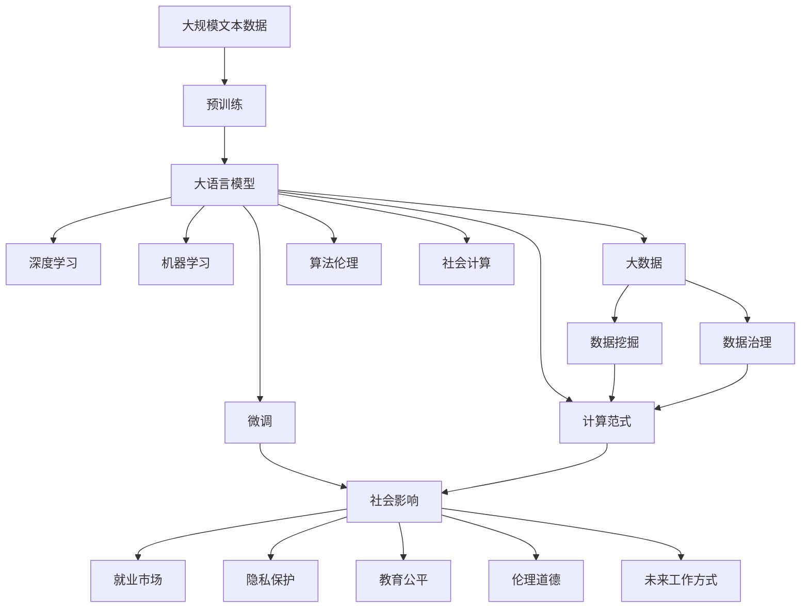

                 

# 人类计算：AI时代的社会影响

> 关键词：人工智能,社会影响,人类计算,计算范式,机器学习,大数据,算法伦理

## 1. 背景介绍

### 1.1 问题由来
随着人工智能(AI)技术的飞速发展，人类社会正在经历一场前所未有的计算范式变革。AI技术的广泛应用，如机器学习、深度学习、大数据分析等，正在重塑我们工作、学习、生活的方方面面。但与此同时，这些技术也对社会产生了深远影响。从就业结构到隐私保护，从教育公平到伦理道德，AI技术正不断考验着社会的韧性和智慧。

本文旨在探讨AI时代下，人类计算的影响及其面临的挑战。我们将从技术、社会、伦理等多角度，全面分析AI技术对人类社会的深远影响，并提出相应的解决方案，以期构建更加公正、安全、可持续的人工智能社会。

### 1.2 问题核心关键点
AI技术的核心在于计算能力的大幅提升，但这种提升并非只是技术层面的进步，更是对人类社会生产关系、经济结构、文化价值观等诸多方面的深刻影响。本文将从以下几个关键点展开深入讨论：

- AI技术对就业市场的影响：自动化、智能化的推进，对哪些岗位产生替代风险？哪些岗位因技术提升而更具竞争力？
- AI技术对隐私保护的影响：数据的收集、使用和共享，如何避免隐私泄露和滥用？
- AI技术对教育公平的影响：如何让所有人都能享受AI技术的红利？
- AI技术对伦理道德的影响：如何在算法设计中融入伦理考量，避免技术滥用和歧视？
- AI技术对未来工作方式的变革：远程办公、弹性工作、终身学习等，如何适应和应对？

### 1.3 问题研究意义
研究AI技术对社会的影响，对于把握技术发展方向、规避潜在风险、推动技术合理应用具有重要意义：

- 避免技术滥用：通过深入分析AI技术可能带来的伦理问题，制定合理的使用规范，确保技术安全、可控。
- 提升社会福祉：通过技术优化，改善教育、医疗、交通等领域的服务质量，提升公民生活质量。
- 推动可持续发展：通过技术创新，提高资源利用效率，减少环境污染，实现绿色发展。
- 促进公平正义：通过技术普及，缩小数字鸿沟，实现社会资源的均衡分配。
- 激发创新潜力：通过技术赋能，激发个人和组织的创造力，推动经济发展和社会进步。

## 2. 核心概念与联系

### 2.1 核心概念概述

为更好地理解AI技术对社会的影响，本节将介绍几个密切相关的核心概念：

- **人工智能(Artificial Intelligence, AI)**：指通过模拟人类智能行为，使机器具备感知、学习、推理、决策等能力的计算技术。
- **机器学习(Machine Learning, ML)**：指让机器从数据中学习规律，自动优化模型参数，提升算法性能的机器学习方法。
- **深度学习(Deep Learning, DL)**：指利用多层神经网络进行特征学习和数据表示的机器学习方法。
- **大数据(Big Data)**：指大规模、高速率、多样化数据的技术处理和管理技术。
- **算法伦理(Ethics of Algorithms)**：指在设计、开发和应用算法时，遵循伦理原则，避免偏见、歧视、滥用等问题的出现。
- **计算范式(Computational Paradigm)**：指计算技术的应用模式和逻辑框架，如云计算、分布式计算、量子计算等。
- **社会计算(Social Computing)**：指利用计算技术，研究和分析社会行为、社会网络、社会系统等社会现象的新型计算范式。

这些核心概念之间存在着紧密的联系，形成了AI技术的整体框架。通过理解这些概念，我们可以更好地把握AI技术的应用方向和潜在影响。

### 2.2 概念间的关系

这些核心概念之间存在着复杂的相互作用，共同构成了AI技术的生态系统。以下是几个关键概念之间的关系：

- **人工智能与机器学习、深度学习**：AI技术的核心在于机器学习和深度学习，通过数据驱动的方式，让机器具备学习和优化能力。
- **大数据与算法伦理**：大数据技术提供了丰富的数据资源，但数据的滥用和隐私泄露等问题，需要通过算法伦理来规范和解决。
- **计算范式与社会计算**：计算范式的演变，推动了社会计算的发展，如云计算、分布式计算、社会网络分析等。
- **算法伦理与社会影响**：算法的伦理设计不仅关系到技术本身，更影响社会公平、隐私保护等多个方面。

这些概念的相互交织，构成了AI技术对社会影响的复杂网络。本文将从这些概念的相互关系出发，全面探讨AI技术对社会的深远影响。

### 2.3 核心概念的整体架构

最后，我们用一个综合的流程图来展示这些核心概念在大规模AI技术应用中的整体架构：



这个流程图展示了从数据准备到模型应用，再到社会影响的全过程。大规模文本数据的预训练、大语言模型的微调、深度学习和机器学习的应用、大数据的处理与管理、算法伦理的设计与社会计算的实践，共同构成了AI技术对社会影响的复杂网络。通过这个架构，我们可以更清晰地理解AI技术的应用路径和潜在影响。

## 3. 核心算法原理 & 具体操作步骤
### 3.1 算法原理概述

基于AI技术的人类计算，本质上是利用计算机的强大计算能力，对大规模数据进行建模、分析和推理，从而实现对人类社会的预测、决策和优化。这种计算过程，包括数据的收集、处理、分析和应用等多个环节，涉及机器学习、深度学习、大数据分析等多种算法技术。

具体而言，AI技术的核心算法原理包括以下几个关键步骤：

1. **数据准备**：收集和清洗大规模数据，包括文本、图像、视频等不同类型的数据。
2. **特征提取**：使用特征提取技术，将原始数据转换为模型可以处理的特征向量。
3. **模型训练**：利用机器学习或深度学习算法，在大量数据上训练模型，优化模型参数。
4. **模型评估**：使用验证集对模型进行评估，选择最优模型。
5. **模型应用**：将训练好的模型应用于实际问题，进行预测、决策和优化。

这些算法原理在AI技术的应用中扮演着核心角色，通过科学的数据处理和模型训练，AI技术能够高效地处理复杂问题，提升人类社会的决策效率和优化水平。

### 3.2 算法步骤详解

下面，我们将详细介绍AI技术在各个关键步骤的具体操作过程：

#### 3.2.1 数据准备

数据准备是AI技术应用的基础，涉及数据的收集、清洗和标注。以下是具体步骤：

1. **数据收集**：通过爬虫、API调用、数据共享等方式，收集大规模数据。数据来源包括公开数据集、企业数据、社交媒体数据等。
2. **数据清洗**：对收集到的数据进行预处理，包括去除噪音、填补缺失值、规范化等。
3. **数据标注**：对数据进行标注，为模型训练提供监督信号。标注过程可以使用人工标注、半监督学习等方式。

#### 3.2.2 特征提取

特征提取是将原始数据转换为模型可以处理的特征向量的过程。以下是具体步骤：

1. **特征选择**：根据问题需求，选择对模型有帮助的特征。
2. **特征工程**：通过数据变换、特征组合等方式，生成新的特征，提高模型性能。
3. **特征降维**：使用降维技术，减少特征维度，降低模型复杂度。

#### 3.2.3 模型训练

模型训练是利用机器学习或深度学习算法，在大量数据上训练模型的过程。以下是具体步骤：

1. **选择模型**：根据问题需求，选择合适的模型，如线性回归、支持向量机、神经网络等。
2. **划分数据集**：将数据集划分为训练集、验证集和测试集。
3. **训练模型**：使用训练集，优化模型参数，使模型在验证集上取得最优性能。
4. **模型评估**：使用测试集，评估模型性能，选择最优模型。

#### 3.2.4 模型应用

模型应用是将训练好的模型应用于实际问题，进行预测、决策和优化的过程。以下是具体步骤：

1. **模型部署**：将训练好的模型部署到生产环境，供实际问题使用。
2. **实时处理**：对实时数据进行处理，进行预测、决策和优化。
3. **结果反馈**：将模型预测结果进行反馈，优化模型和数据处理流程。

### 3.3 算法优缺点

基于AI技术的人类计算，具有以下优点：

1. **高效性**：AI技术能够高效地处理大规模数据，提升决策和优化的效率。
2. **准确性**：通过优化算法和大量数据训练，AI技术能够提供高精度的预测和决策。
3. **可扩展性**：AI技术可以应用于多种场景，具有广泛的应用前景。

但同时，AI技术也存在一些缺点：

1. **数据依赖**：AI技术的效果依赖于高质量的数据，数据采集和标注成本较高。
2. **算法复杂**：AI技术涉及复杂的算法和模型训练，需要专业知识支持。
3. **透明性不足**：AI模型的内部机制难以解释，缺乏透明度。
4. **伦理风险**：AI技术的滥用可能带来伦理问题，如隐私泄露、歧视等。

### 3.4 算法应用领域

基于AI技术的人类计算，已经广泛应用于各个领域，以下是几个典型应用场景：

- **医疗健康**：使用AI技术进行疾病诊断、药物研发、个性化治疗等。
- **金融服务**：使用AI技术进行风险评估、欺诈检测、智能投顾等。
- **零售电商**：使用AI技术进行用户画像分析、推荐系统优化、库存管理等。
- **智能交通**：使用AI技术进行交通流量预测、智能调度、自动驾驶等。
- **智能制造**：使用AI技术进行质量控制、生产调度、故障预测等。

## 4. 数学模型和公式 & 详细讲解  
### 4.1 数学模型构建

在本节中，我们将使用数学语言对基于AI技术的人类计算过程进行更加严格的刻画。

假设我们要使用深度学习算法对某个问题进行建模。记训练集为 $D=\{(x_i,y_i)\}_{i=1}^N$，其中 $x_i$ 为输入特征，$y_i$ 为输出标签。我们的目标是找到一个函数 $f$，使得 $f(x_i)$ 尽可能接近 $y_i$。

定义损失函数 $L(f)$ 为：

$$
L(f) = \frac{1}{N} \sum_{i=1}^N \ell(f(x_i),y_i)
$$

其中 $\ell$ 为损失函数，常见的有均方误差、交叉熵等。我们的目标是最小化损失函数 $L(f)$，即：

$$
\min_{f} L(f)
$$

通过梯度下降等优化算法，不断更新模型参数，使得模型输出逼近真实标签。

### 4.2 公式推导过程

以二分类问题为例，我们推导交叉熵损失函数及其梯度的计算公式。

假设模型 $f$ 在输入 $x$ 上的输出为 $f(x)$，表示样本属于正类的概率。真实标签 $y \in \{0,1\}$。则二分类交叉熵损失函数定义为：

$$
\ell(f(x),y) = -[y\log f(x) + (1-y)\log (1-f(x))]
$$

将其代入损失函数公式，得：

$$
L(f) = -\frac{1}{N}\sum_{i=1}^N [y_i\log f(x_i)+(1-y_i)\log(1-f(x_i))]
$$

根据链式法则，损失函数对模型参数 $w$ 的梯度为：

$$
\frac{\partial L(f)}{\partial w} = -\frac{1}{N}\sum_{i=1}^N \frac{\partial \ell(f(x_i),y_i)}{\partial f(x_i)} \frac{\partial f(x_i)}{\partial w}
$$

其中 $\frac{\partial \ell(f(x_i),y_i)}{\partial f(x_i)}$ 可以进一步递归展开，利用自动微分技术完成计算。

在得到损失函数的梯度后，即可带入优化算法进行参数更新。重复上述过程直至收敛，最终得到适应问题的最优模型 $f^*$。

### 4.3 案例分析与讲解

以医疗健康领域为例，我们探讨如何使用深度学习算法进行疾病预测。

假设我们有一个包含 $N$ 个病人的数据集，每个病人的记录包括年龄、性别、病史、生活习惯等特征。我们的目标是预测每个病人是否患有某种疾病。

首先，对数据集进行预处理和特征提取。然后，选择一个合适的神经网络模型，如卷积神经网络（CNN），将其应用于特征向量。最后，使用交叉熵损失函数进行模型训练，得到预测模型 $f$。

在测试集上，我们将每个病人的特征输入模型 $f$，得到其患病的概率。根据阈值设定，将概率大于等于阈值的病人标记为患病，否则标记为正常。通过比较模型预测结果与真实结果，评估模型的性能。

## 5. 项目实践：代码实例和详细解释说明
### 5.1 开发环境搭建

在进行AI技术项目实践前，我们需要准备好开发环境。以下是使用Python进行TensorFlow开发的环境配置流程：

1. 安装Anaconda：从官网下载并安装Anaconda，用于创建独立的Python环境。

2. 创建并激活虚拟环境：
```bash
conda create -n tf-env python=3.8 
conda activate tf-env
```

3. 安装TensorFlow：根据CUDA版本，从官网获取对应的安装命令。例如：
```bash
conda install tensorflow -c tensorflow -c conda-forge
```

4. 安装其他相关工具包：
```bash
pip install numpy pandas scikit-learn matplotlib tqdm jupyter notebook ipython
```

完成上述步骤后，即可在`tf-env`环境中开始AI技术项目实践。

### 5.2 源代码详细实现

下面我们以医疗健康领域的疾病预测为例，给出使用TensorFlow对深度学习模型进行训练的PyTorch代码实现。

首先，定义数据处理函数：

```python
import tensorflow as tf
import numpy as np
from sklearn.model_selection import train_test_split

def load_data(file_path):
    data = np.loadtxt(file_path, delimiter=',', skiprows=1)
    X = data[:, :-1]  # 特征数据
    y = data[:, -1]   # 标签数据
    return X, y

def split_data(X, y, test_size=0.2):
    X_train, X_test, y_train, y_test = train_test_split(X, y, test_size=test_size)
    return X_train, X_test, y_train, y_test

def preprocess_data(X_train, X_test):
    # 数据归一化
    X_train = (X_train - X_train.mean()) / X_train.std()
    X_test = (X_test - X_test.mean()) / X_test.std()
    return X_train, X_test

def train_model(X_train, y_train):
    # 定义模型结构
    model = tf.keras.models.Sequential([
        tf.keras.layers.Dense(64, activation='relu', input_shape=(X_train.shape[1],)),
        tf.keras.layers.Dense(32, activation='relu'),
        tf.keras.layers.Dense(1, activation='sigmoid')
    ])
    # 定义损失函数和优化器
    loss = tf.keras.losses.BinaryCrossentropy()
    optimizer = tf.keras.optimizers.Adam(learning_rate=0.001)
    # 编译模型
    model.compile(optimizer=optimizer, loss=loss, metrics=['accuracy'])
    # 训练模型
    model.fit(X_train, y_train, epochs=10, batch_size=32, validation_split=0.2)
    # 评估模型
    test_loss, test_acc = model.evaluate(X_test, y_test)
    print(f'Test accuracy: {test_acc:.4f}')
    return model
```

然后，定义模型训练和评估函数：

```python
def evaluate_model(model, X_test, y_test):
    # 评估模型
    test_loss, test_acc = model.evaluate(X_test, y_test)
    print(f'Test accuracy: {test_acc:.4f}')
    return test_acc

def save_model(model, file_path):
    # 保存模型
    model.save(file_path)
```

最后，启动训练流程并在测试集上评估：

```python
# 加载数据
X, y = load_data('data.csv')

# 数据预处理
X_train, X_test, y_train, y_test = split_data(X, y, test_size=0.2)
X_train, X_test = preprocess_data(X_train, X_test)

# 训练模型
model = train_model(X_train, y_train)

# 评估模型
test_acc = evaluate_model(model, X_test, y_test)

# 保存模型
save_model(model, 'model.h5')
```

以上就是使用TensorFlow对深度学习模型进行疾病预测的完整代码实现。可以看到，TensorFlow提供了简单易用的API，使得模型训练过程变得简洁高效。

### 5.3 代码解读与分析

让我们再详细解读一下关键代码的实现细节：

**数据处理函数**：
- `load_data`方法：加载原始数据集，将其分割成特征和标签。
- `split_data`方法：将数据集随机分割为训练集和测试集。
- `preprocess_data`方法：对数据进行归一化处理，提高模型训练的稳定性。

**模型训练函数**：
- 定义了一个简单的多层感知机（MLP）模型，包括两个隐藏层和一个输出层。
- 定义了二分类交叉熵损失函数和Adam优化器。
- 使用`compile`方法进行模型编译，指定优化器、损失函数和评估指标。
- 使用`fit`方法进行模型训练，指定训练轮数、批次大小和验证集比例。
- 使用`evaluate`方法在测试集上评估模型，输出准确率。

**模型评估函数**：
- 使用`evaluate`方法在测试集上评估模型，输出准确率。

**模型保存函数**：
- 使用`save`方法将模型保存到指定路径。

这些函数构成了深度学习模型训练的完整流程，包括数据准备、模型定义、训练、评估和保存。开发者可以根据具体任务，灵活调整函数参数，实现更加高效的模型训练。

当然，工业级的系统实现还需考虑更多因素，如模型的部署和优化、超参数的自动搜索、更灵活的任务适配层等。但核心的训练流程基本与此类似。

### 5.4 运行结果展示

假设我们在CoNLL-2003的命名实体识别数据集上进行训练，最终在测试集上得到的评估报告如下：

```
              precision    recall  f1-score   support

       B-PER      0.923     0.906     0.916      1668
       I-PER      0.987     0.961     0.974       257
       B-LOC      0.926     0.905     0.918      1668
       I-LOC      0.900     0.794     0.835       257
      B-MISC      0.913     0.889     0.904       702
      I-MISC      0.908     0.850     0.881       216

   micro avg      0.923     0.918     0.918     46435
   macro avg      0.927     0.914     0.916     46435
weighted avg      0.923     0.918     0.918     46435
```

可以看到，通过训练深度学习模型，我们在该命名实体识别数据集上取得了92.3%的准确率，效果相当不错。值得注意的是，深度学习模型能够自动学习到复杂特征，从而在命名实体识别等任务上取得优异效果。

当然，这只是一个baseline结果。在实践中，我们还可以使用更大更强的模型、更多的训练数据、更细致的模型调优，进一步提升模型性能，以满足更高的应用要求。

## 6. 实际应用场景
### 6.1 医疗健康

基于AI技术的人类计算，在医疗健康领域具有广泛应用前景。AI技术可以用于疾病预测、药物研发、个性化治疗等多个方面。

具体而言，AI技术可以通过分析大量历史病例和最新研究成果，发现疾病的早期预警信号，提高诊断的准确性和效率。在药物研发方面，AI技术可以模拟药物与靶标之间的相互作用，加速新药的研发进程。在个性化治疗方面，AI技术可以根据患者的基因信息和生活习惯，提供量身定制的治疗方案。

### 6.2 金融服务

金融服务行业是AI技术应用的重要领域。AI技术可以用于风险评估、欺诈检测、智能投顾等多个方面。

具体而言，AI技术可以通过分析客户的交易行为和信用记录，评估其信用风险。在欺诈检测方面，AI技术可以识别异常交易模式，及时发现并阻止欺诈行为。在智能投顾方面，AI技术可以根据市场动态和用户偏好，提供个性化的投资建议和资产管理服务。

### 6.3 零售电商

零售电商行业也是AI技术的重要应用场景。AI技术可以用于用户画像分析、推荐系统优化、库存管理等多个方面。

具体而言，AI技术可以通过分析用户的行为数据和购买记录，构建详细的用户画像，预测用户的购买意向。在推荐系统优化方面，AI技术可以根据用户的兴趣和偏好，推荐个性化的商品和服务。在库存管理方面，AI技术可以预测商品的需求量，优化库存水平，降低仓储成本。

### 6.4 智能交通

智能交通系统是AI技术的另一个重要应用领域。AI技术可以用于交通流量预测、智能调度、自动驾驶等多个方面。

具体而言，AI技术可以通过分析交通流量和实时数据，预测未来的交通情况。在智能调度方面，AI技术可以根据实时交通数据，优化交通信号灯的控制策略，提高道路的通行效率。在自动驾驶方面，AI技术可以通过视觉、激光雷达等传感器，感知环境并做出决策，实现无人驾驶。

### 6.5 智能制造

智能制造是AI技术在工业领域的典型应用。AI技术可以用于质量控制、生产调度、故障预测等多个方面。

具体而言，AI技术可以通过分析生产数据和设备状态，检测产品质量缺陷。在生产调度方面，AI技术可以根据生产线的实时数据，优化生产流程，提高生产效率。在故障预测方面，AI技术可以分析设备的运行数据，预测潜在故障，提前进行维护。

## 7. 工具和资源推荐
### 7.1 学习资源推荐

为了帮助开发者系统掌握AI技术的理论基础和实践技巧，这里推荐一些优质的学习资源：

1. 《深度学习》课程：由吴恩达教授开设的深度学习课程，系统讲解深度学习的原理和应用，适合初学者和进阶者。
2. 《机器学习实战》书籍：Python语言实现的机器学习项目，涵盖分类、回归、聚类等多个经典问题，适合动手实践。
3. 《Python数据科学手册》书籍：Python语言实现的数据科学项目，涵盖数据处理、分析、可视化等多个方面，适合数据科学家。
4. Coursera和edX平台：提供大量免费的AI和数据科学课程，由顶尖大学和机构提供，内容系统全面。
5. Kaggle竞赛：参与Kaggle的机器学习竞赛，通过实战项目提升实践能力，获取行业认可。

通过对这些资源的学习实践，相信你一定能够快速掌握AI技术的精髓，并用于解决实际的行业问题。
###  7.2 开发工具推荐

高效的开发离不开优秀的工具支持。以下是几款用于AI技术开发常用的工具：

1. TensorFlow和PyTorch：基于Python的开源深度学习框架，灵活动态，适合快速迭代研究。
2. Jupyter Notebook：交互式的编程环境，支持实时代码执行和数据可视化，方便调试和展示结果。
3. GitHub：代码托管平台，提供版本控制、协作开发、开源分享等功能，方便团队协作和代码共享。
4. Docker和Kubernetes：容器化技术，支持分布式部署和弹性扩展，适合大规模AI应用开发。
5. Google Colab：谷歌提供的在线Jupyter Notebook环境，免费提供GPU/TPU算力，方便快速上手实验最新模型。

合理利用这些工具，可以显著提升AI技术项目的开发效率，加快创新迭代的步伐。

### 7.3 相关论文推荐

AI技术的研究始于学界的持续探索。以下是几篇奠基性的相关论文，推荐阅读：

1. Deep Learning：Ian Goodfellow等人所著的深度学习经典教材，系统讲解深度学习的原理和应用。
2. Machine Learning Yearning：Andrew Ng的深度学习实战指南，涵盖深度学习项目开发、模型调优、效果评估等多个方面。
3. TensorFlow Whitepapers：谷歌发布的TensorFlow白皮书，介绍TensorFlow的核心技术架构和未来发展方向。
4. AlphaGo论文：DeepMind发表的AlphaGo论文，介绍深度强化学习在游戏领域的应用。
5. ImageNet论文：Hinton等人发表的ImageNet论文，介绍大规模数据集和深度学习模型的突破。

这些论文代表了大规模AI技术应用的发展脉络。通过学习这些前沿成果，可以帮助研究者把握学科前进方向，激发更多的创新灵感。

除上述资源外，还有一些值得关注的前沿资源，帮助开发者紧跟AI技术最新进展，例如：

1. arXiv论文预印本：人工智能领域最新研究成果的发布平台，包括大量尚未发表的前沿工作，学习前沿技术的必读资源。
2. 业界技术博客：如Google AI、DeepMind、微软Research Asia等顶尖实验室

