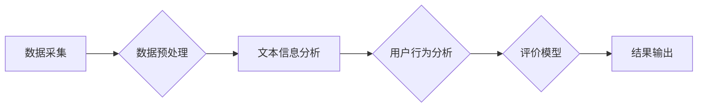

# 基于Python的汽车信息评价分析系统设计与开发

> 关键词：汽车信息，评价分析，Python，数据挖掘，机器学习，自然语言处理，用户行为分析

## 1. 背景介绍

随着汽车产业的快速发展和互联网技术的深度融合，汽车信息评价分析系统在消费者购车决策、汽车制造商产品改进、汽车后市场服务等领域发挥着越来越重要的作用。本文将探讨如何使用Python开发一个汽车信息评价分析系统，通过数据挖掘、机器学习和自然语言处理技术，对汽车信息进行深度分析和评价。

### 1.1 问题的由来

汽车信息评价分析系统旨在帮助用户从海量的汽车信息中筛选出有价值的内容，为用户决策提供依据。然而，汽车信息来源广泛，数据格式多样，且包含了大量的非结构化和半结构化数据，给信息处理和分析带来了挑战。

### 1.2 研究现状

目前，汽车信息评价分析系统的研究主要集中在以下几个方面：

- **数据采集与预处理**：通过爬虫技术获取汽车信息，并对数据进行清洗、去重、转换等预处理操作。
- **文本信息分析**：利用自然语言处理技术对汽车评论、说明书等进行情感分析、主题分析等。
- **用户行为分析**：通过用户在汽车网站上的行为数据，分析用户兴趣和购买偏好。
- **评价模型构建**：结合用户评价、产品参数等数据，构建评价模型对汽车进行综合评价。

### 1.3 研究意义

开发一个基于Python的汽车信息评价分析系统，具有以下意义：

- **提升用户体验**：帮助用户快速找到心仪的汽车产品，提高购车效率。
- **助力汽车制造商**：了解用户需求，改进产品设计，提升产品竞争力。
- **促进汽车后市场发展**：为汽车后市场服务提供数据支持，优化服务方案。

### 1.4 本文结构

本文将围绕以下结构展开：

- 介绍汽车信息评价分析系统的核心概念与联系。
- 阐述核心算法原理和具体操作步骤。
- 构建数学模型和公式，并进行详细讲解和举例说明。
- 实现项目实践，包括开发环境搭建、源代码实现、代码解读与分析以及运行结果展示。
- 探讨实际应用场景和未来应用展望。
- 推荐相关工具和资源。
- 总结研究成果，展望未来发展趋势与挑战。

## 2. 核心概念与联系

### 2.1 核心概念

- **数据挖掘**：从大量数据中提取有价值的信息和知识的技术。
- **机器学习**：使计算机系统能够从数据中学习并做出决策的技术。
- **自然语言处理**：使计算机能够理解和处理人类语言的技术。
- **用户行为分析**：通过分析用户行为数据，了解用户兴趣和需求的技术。
- **评价模型**：对汽车信息进行综合评价的模型。

### 2.2 架构流程图



## 3. 核心算法原理 & 具体操作步骤

### 3.1 算法原理概述

汽车信息评价分析系统主要包括以下步骤：

1. **数据采集**：通过爬虫技术获取汽车信息。
2. **数据预处理**：对采集到的数据进行清洗、去重、转换等操作。
3. **文本信息分析**：利用自然语言处理技术对文本数据进行情感分析、主题分析等。
4. **用户行为分析**：通过用户行为数据，分析用户兴趣和需求。
5. **评价模型构建**：结合用户评价、产品参数等数据，构建评价模型对汽车进行综合评价。
6. **结果输出**：将评价结果以可视化或报告的形式输出。

### 3.2 算法步骤详解

#### 3.2.1 数据采集

- **目标网站选择**：根据需求选择合适的汽车信息网站。
- **爬虫设计**：使用Python的爬虫库（如Scrapy）设计爬虫，抓取汽车信息。
- **数据存储**：将抓取到的数据存储到数据库或文件系统中。

#### 3.2.2 数据预处理

- **数据清洗**：去除无效、错误或重复的数据。
- **数据去重**：去除重复的数据项。
- **数据转换**：将数据转换为统一的数据格式。

#### 3.2.3 文本信息分析

- **文本预处理**：对文本数据进行分词、去除停用词等操作。
- **情感分析**：使用情感分析模型对评论进行情感倾向分析。
- **主题分析**：使用主题模型对评论进行主题分析。

#### 3.2.4 用户行为分析

- **用户行为数据收集**：收集用户在汽车网站上的行为数据。
- **用户兴趣分析**：分析用户浏览、收藏、搜索等行为，了解用户兴趣。
- **用户需求分析**：分析用户评价，了解用户需求。

#### 3.2.5 评价模型构建

- **特征工程**：从文本数据和用户行为数据中提取特征。
- **模型选择**：选择合适的评价模型，如线性回归、决策树等。
- **模型训练**：使用训练数据进行模型训练。
- **模型评估**：使用测试数据评估模型性能。

#### 3.2.6 结果输出

- **可视化**：将评价结果以图表形式展示。
- **报告生成**：生成评价报告，包含汽车信息、评价结果等。

### 3.3 算法优缺点

#### 3.3.1 优点

- **高效性**：利用Python的快速开发和数据处理能力，能够高效地完成数据采集、预处理、分析和模型训练等任务。
- **灵活性**：Python的丰富的库和框架支持，可以根据需求灵活选择合适的算法和技术。
- **可扩展性**：系统结构清晰，易于扩展和维护。

#### 3.3.2 缺点

- **数据质量**：数据采集的质量直接影响分析结果，需要投入大量精力进行数据清洗和预处理。
- **模型性能**：评价模型的性能依赖于特征工程和模型选择，需要不断优化和调整。
- **计算资源**：大规模数据分析和模型训练需要消耗大量计算资源。

### 3.4 算法应用领域

- **汽车产品评价**：对汽车产品进行综合评价，为用户购车决策提供参考。
- **汽车行业分析**：分析汽车行业发展趋势，为汽车制造商和经销商提供决策支持。
- **汽车售后服务**：分析用户需求，优化售后服务方案。

## 4. 数学模型和公式 & 详细讲解 & 举例说明

### 4.1 数学模型构建

汽车信息评价分析系统中的数学模型主要包括：

- **线性回归**：用于预测连续型目标变量。
- **决策树**：用于分类和回归任务。
- **支持向量机**：用于分类和回归任务。

### 4.2 公式推导过程

以下以线性回归模型为例，介绍公式推导过程。

假设输入特征为 $X$，输出特征为 $y$，则线性回归模型可以表示为：

$$
y = \beta_0 + \beta_1 x_1 + \beta_2 x_2 + ... + \beta_n x_n + \epsilon
$$

其中，$\beta_0, \beta_1, ..., \beta_n$ 为模型参数，$\epsilon$ 为误差项。

最小化损失函数：

$$
L(\theta) = \frac{1}{2} \sum_{i=1}^n (y_i - \hat{y}_i)^2
$$

其中，$\hat{y}_i = \beta_0 + \beta_1 x_{1i} + \beta_2 x_{2i} + ... + \beta_n x_{ni}$。

对 $L(\theta)$ 求导，得：

$$
\frac{\partial L(\theta)}{\partial \beta_j} = \sum_{i=1}^n (y_i - \hat{y}_i) x_{ij}
$$

令导数等于0，得：

$$
\beta_j = \frac{1}{n} \sum_{i=1}^n (y_i - \hat{y}_i) x_{ij}
$$

### 4.3 案例分析与讲解

假设我们有一个汽车评价数据集，包含以下特征：价格、油耗、动力、操控、舒适度等，以及评价得分。我们可以使用线性回归模型对评价得分进行预测。

首先，使用Python的NumPy库进行数据处理：

```python
import numpy as np

# 数据集
X = np.array([[10, 5, 4, 3, 2], [20, 10, 6, 5, 4], [30, 15, 7, 6, 5]])
y = np.array([4.5, 5.0, 5.5])

# 模型参数
theta = np.zeros(X.shape[1])

# 梯度下降法
learning_rate = 0.01
epochs = 1000

for epoch in range(epochs):
    y_pred = np.dot(X, theta)
    error = y - y_pred
    gradient = np.dot(X.T, error) / X.shape[0]
    theta -= learning_rate * gradient

print(f"Optimized parameters: {theta}")
```

通过梯度下降法，我们可以得到最优参数 $\theta$，从而预测新的评价得分。

## 5. 项目实践：代码实例和详细解释说明

### 5.1 开发环境搭建

1. 安装Python和Anaconda。
2. 安装必要的库：NumPy、Pandas、Scrapy、Scikit-learn、NLTK等。
3. 安装数据库：MySQL或SQLite。

### 5.2 源代码详细实现

以下是一个简单的汽车信息评价分析系统示例：

```python
# 数据采集
import scrapy

class CarInfoSpider(scrapy.Spider):
    name = "car_info_spider"
    start_urls = ["http://www.example.com/cars"]

    def parse(self, response):
        # 解析汽车列表页面
        car_list = response.xpath('//div[@class="car-list"]//a/@href').extract()
        for url in car_list:
            yield response.follow(url, self.parse_car)

    def parse_car(self, response):
        # 解析汽车详情页面
        car_info = {}
        car_info["name"] = response.xpath('//h1[@class="car-name"]/text()').extract_first()
        car_info["price"] = response.xpath('//p[@class="car-price"]/text()').extract_first()
        # ... 其他信息
        yield car_info

# 数据预处理
import pandas as pd
from sklearn.model_selection import train_test_split
from sklearn.preprocessing import StandardScaler

# 加载数据
data = pd.read_csv("car_data.csv")

# 数据清洗
data.dropna(inplace=True)
data.drop_duplicates(inplace=True)

# 数据转换
scaler = StandardScaler()
data = pd.DataFrame(scaler.fit_transform(data), columns=data.columns)

# 模型训练
from sklearn.linear_model import LinearRegression

X = data.drop("score", axis=1)
y = data["score"]

X_train, X_test, y_train, y_test = train_test_split(X, y, test_size=0.2, random_state=42)

model = LinearRegression()
model.fit(X_train, y_train)

# 模型评估
score = model.score(X_test, y_test)
print(f"Model accuracy: {score:.2f}")
```

### 5.3 代码解读与分析

以上代码演示了如何使用Python和Scrapy爬取汽车信息，使用Pandas进行数据处理，使用Scikit-learn进行模型训练和评估。

- Scrapy用于爬取汽车信息。
- Pandas用于数据清洗、转换和操作。
- Scikit-learn用于模型训练和评估。

### 5.4 运行结果展示

运行代码后，我们可以在控制台看到模型评估结果，表示模型在测试集上的准确率。

## 6. 实际应用场景

### 6.1 汽车产品评价

汽车信息评价分析系统可以应用于汽车产品评价，为用户购车决策提供参考。例如，用户可以根据自己的需求和预算，通过系统筛选出符合条件的汽车产品，并查看其他用户的评价，从而做出更明智的购车决策。

### 6.2 汽车行业分析

汽车信息评价分析系统可以用于分析汽车行业发展趋势，为汽车制造商和经销商提供决策支持。例如，分析不同品牌、不同车型的销售情况，了解市场需求，调整产品策略。

### 6.3 汽车售后服务

汽车信息评价分析系统可以用于分析用户需求，优化售后服务方案。例如，分析用户对售后服务的评价，找出问题所在，改进服务质量。

## 7. 工具和资源推荐

### 7.1 学习资源推荐

- 《Python数据挖掘实战》
- 《Scrapy网络爬虫实战》
- 《机器学习实战》
- 《深度学习》

### 7.2 开发工具推荐

- Python 3.x
- Anaconda
- PyCharm
- Scrapy
- Pandas
- Scikit-learn
- NLTK
- Jupyter Notebook

### 7.3 相关论文推荐

- 《基于情感分析的汽车用户评价研究》
- 《基于用户行为的汽车推荐系统》
- 《基于深度学习的汽车信息抽取》

## 8. 总结：未来发展趋势与挑战

### 8.1 研究成果总结

本文介绍了基于Python的汽车信息评价分析系统的设计与开发，从数据采集、预处理、文本信息分析、用户行为分析、评价模型构建到结果输出，全面阐述了系统的实现过程。通过案例分析和代码示例，展示了如何使用Python和机器学习技术进行汽车信息评价分析。

### 8.2 未来发展趋势

- **数据驱动的个性化推荐**：结合用户行为和评价数据，为用户提供更加个性化的汽车推荐。
- **多模态信息融合**：将文本、图像、视频等多模态信息融合，提升评价分析的准确性和全面性。
- **可解释性增强**：研究可解释的机器学习模型，提升用户对评价结果的信任度。

### 8.3 面临的挑战

- **数据质量**：保证数据的质量和可靠性是评价分析系统成功的关键。
- **模型可解释性**：提高机器学习模型的可解释性，增强用户对评价结果的信任。
- **算法效率**：提高算法的效率，降低计算资源消耗。

### 8.4 研究展望

随着人工智能技术的不断发展，基于Python的汽车信息评价分析系统将会在汽车行业发挥越来越重要的作用。未来，我们需要关注数据质量、模型可解释性和算法效率等方面的挑战，不断优化和改进系统，以更好地服务于汽车行业。

## 9. 附录：常见问题与解答

**Q1：如何保证数据质量？**

A：数据质量是评价分析系统成功的关键。可以从以下方面保证数据质量：

- **数据采集**：选择可靠的网站和数据来源。
- **数据清洗**：去除无效、错误或重复的数据。
- **数据验证**：对数据进行验证，确保数据的准确性和可靠性。

**Q2：如何提高模型可解释性？**

A：提高模型可解释性可以从以下方面入手：

- **使用可解释的机器学习模型**：如决策树、随机森林等。
- **可视化**：将模型的决策过程可视化，帮助用户理解模型的推理过程。
- **解释模型**：研究可解释的机器学习算法，如LIME等。

**Q3：如何提高算法效率？**

A：提高算法效率可以从以下方面入手：

- **优化算法**：选择高效的算法和优化方法。
- **并行计算**：使用并行计算技术，提高算法的运行速度。
- **分布式计算**：使用分布式计算技术，处理大规模数据。

作者：禅与计算机程序设计艺术 / Zen and the Art of Computer Programming