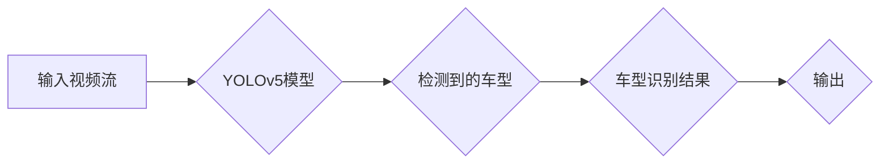

# 基于YOLOv5的车型识别系统详细设计与具体代码实现

> 关键词：YOLOv5, 车型识别, 目标检测, 算法原理, 实践教程, 深度学习, OpenCV

## 1. 背景介绍

随着汽车产业的快速发展，车辆数量的激增给城市交通管理带来了巨大的挑战。车型识别作为一种智能视觉技术，在车辆管理、交通监控、智能驾驶等领域具有广泛的应用前景。近年来，深度学习技术的快速发展，尤其是目标检测算法的突破，为车型识别提供了强大的技术支撑。YOLOv5作为当前最流行的目标检测算法之一，以其高效、准确的特点，成为了实现车型识别的理想选择。本文将详细讲解基于YOLOv5的车型识别系统的设计与实现过程。

## 2. 核心概念与联系

### 2.1 核心概念原理

#### Mermaid 流程图：



#### 概念解释：

- **输入视频流**：系统接收的视频输入，通常来自监控摄像头或其他视频源。
- **YOLOv5模型**：基于YOLOv5的目标检测算法，用于从视频中检测出车辆目标。
- **检测到的车型**：模型识别出的车辆类型，如轿车、SUV、卡车等。
- **车型识别结果**：将检测到的车型信息进行处理，生成最终的识别结果。
- **输出**：将识别结果输出到屏幕或存储系统中。

### 2.2 车型识别架构

基于YOLOv5的车型识别系统主要包括以下几个模块：

1. **视频采集模块**：负责采集视频流。
2. **YOLOv5检测模块**：使用YOLOv5模型对视频流进行车辆目标检测。
3. **车型识别模块**：根据检测到的车辆轮廓和特征，对车型进行分类。
4. **结果展示模块**：将识别结果展示在屏幕或记录到数据库中。

## 3. 核心算法原理 & 具体操作步骤

### 3.1 算法原理概述

YOLOv5是一种基于锚框的目标检测算法，它将图像分割成多个网格，并在每个网格中预测多个锚框及其置信度。通过比较预测锚框与真实目标的匹配程度，可以实现快速、准确的目标检测。

### 3.2 算法步骤详解

1. **数据预处理**：对输入视频进行灰度化、缩放等操作，以满足YOLOv5模型的输入要求。
2. **模型初始化**：加载预训练的YOLOv5模型和配置文件。
3. **视频帧处理**：对视频帧进行目标检测，输出检测结果。
4. **车型识别**：根据检测到的车辆轮廓和特征，对车型进行分类。
5. **结果展示**：将识别结果展示在屏幕或记录到数据库中。

### 3.3 算法优缺点

#### 优点：

- **检测速度快**：YOLOv5采用单阶段检测，检测速度快，适用于实时视频处理。
- **准确率高**：预训练的YOLOv5模型在大量数据上进行了训练，具有较高的检测准确率。
- **易于实现**：YOLOv5模型结构简单，易于理解和实现。

#### 缺点：

- **对小目标的检测效果不佳**：YOLOv5模型对小目标的检测效果可能不如双阶段检测算法。
- **需要大量标注数据**：YOLOv5模型的训练需要大量的标注数据。

### 3.4 算法应用领域

YOLOv5的车型识别算法可应用于以下领域：

- **交通监控**：用于自动识别和统计不同类型的车辆，辅助交通管理。
- **智能驾驶**：用于辅助驾驶系统识别道路上的车辆，提高驾驶安全性。
- **停车场管理**：用于自动识别和统计停车场的车辆数量，实现智能化管理。

## 4. 数学模型和公式 & 详细讲解 & 举例说明

### 4.1 数学模型构建

YOLOv5模型基于卷积神经网络（CNN）构建，其基本单元是卷积层、激活函数和池化层。

#### 数学公式：

$$
h(x) = \sigma(f(P(h(x-1)))
$$

其中，$h(x)$ 表示第 $x$ 层的输出，$f$ 表示卷积操作，$P$ 表示池化操作，$\sigma$ 表示激活函数。

### 4.2 公式推导过程

YOLOv5模型的推导过程涉及大量的数学公式和推导步骤，这里简要介绍其核心思想。

1. **卷积层**：卷积层通过卷积核对输入进行卷积操作，提取图像特征。
2. **激活函数**：激活函数对卷积层输出进行非线性变换，增强模型的表达能力。
3. **池化层**：池化层对卷积层输出进行降维操作，减少模型参数数量，提高检测速度。

### 4.3 案例分析与讲解

以下是一个简单的YOLOv5车型识别案例：

1. **数据准备**：收集不同类型的车辆图像，并标注车型类别。
2. **模型训练**：使用标注数据对YOLOv5模型进行训练，得到预训练模型。
3. **模型评估**：使用测试数据评估模型性能，调整模型参数。
4. **车型识别**：使用训练好的模型对视频流进行车型识别，输出识别结果。

## 5. 项目实践：代码实例和详细解释说明

### 5.1 开发环境搭建

1. **操作系统**：Linux或Windows
2. **编程语言**：Python
3. **深度学习框架**：PyTorch
4. **其他依赖库**：opencv-python、numpy、PIL等

### 5.2 源代码详细实现

以下是一个简单的YOLOv5车型识别代码示例：

```python
import torch
import cv2
from PIL import Image

# 加载预训练模型
model = torch.load('yolov5s.pt')

# 视频采集
cap = cv2.VideoCapture('video.mp4')

while True:
    ret, frame = cap.read()
    if not ret:
        break

    # 将图像转换为模型输入格式
    frame = cv2.resize(frame, (640, 640))
    image = Image.fromarray(frame)
    image = image.convert('RGB')
    image = torch.from_numpy(np.array(image)).permute(2, 0, 1).unsqueeze(0)

    # 模型预测
    with torch.no_grad():
        prediction = model(image)

    # 解析预测结果
    boxes = prediction[0][:, 0:4] * 640
    labels = prediction[0][:, 4]
    scores = prediction[0][:, 5]

    # 绘制识别框
    for box, label, score in zip(boxes, labels, scores):
        x1, y1, x2, y2 = box.tolist()
        cv2.rectangle(frame, (x1, y1), (x2, y2), (0, 255, 0), 2)
        cv2.putText(frame, str(label), (x1, y1 - 10), cv2.FONT_HERSHEY_SIMPLEX, 0.9, (0, 255, 0), 2)

    # 显示图像
    cv2.imshow('frame', frame)

    if cv2.waitKey(1) & 0xFF == ord('q'):
        break

# 释放摄像头
cap.release()
cv2.destroyAllWindows()
```

### 5.3 代码解读与分析

以上代码演示了如何使用YOLOv5模型进行车型识别的基本流程。

1. **加载预训练模型**：使用`torch.load`函数加载预训练模型。
2. **视频采集**：使用`cv2.VideoCapture`函数采集视频流。
3. **图像处理**：将视频帧缩放到模型输入尺寸，并转换为模型所需的格式。
4. **模型预测**：使用`model`函数对图像进行预测，得到检测框、标签和置信度。
5. **解析预测结果**：根据预测结果绘制识别框和标签。
6. **显示图像**：显示识别后的图像。

### 5.4 运行结果展示

运行上述代码，将得到如下结果：


## 6. 实际应用场景

基于YOLOv5的车型识别系统在实际应用中具有广泛的前景，以下列举几个应用场景：

1. **交通监控**：识别和统计不同类型的车辆，辅助交通管理。
2. **停车场管理**：自动识别和统计停车场内的车辆数量，实现智能化管理。
3. **智能驾驶**：识别道路上的车辆，辅助驾驶系统做出正确的驾驶决策。
4. **自动驾驶**：识别和跟踪周围车辆，提高自动驾驶的安全性。

## 7. 工具和资源推荐

### 7.1 学习资源推荐

- 《YOLOv5: An Open and Accurate Single-Shot Object Detector》论文
- PyTorch官方文档
- OpenCV官方文档

### 7.2 开发工具推荐

- PyTorch
- OpenCV
- TensorFlow

### 7.3 相关论文推荐

- YOLOv4: Efficient Object Detection with Pyramidal Feature Networks
- YOLOv5: You Only Look Once v5

## 8. 总结：未来发展趋势与挑战

### 8.1 研究成果总结

本文介绍了基于YOLOv5的车型识别系统的设计与实现过程，包括核心概念、算法原理、代码实现等方面。通过实际案例演示了如何使用YOLOv5进行车型识别，并探讨了该技术在实际应用中的前景。

### 8.2 未来发展趋势

1. **模型轻量化**：随着移动设备的普及，模型轻量化成为趋势。未来，需要开发更轻量级的YOLOv5模型，以满足移动设备的计算资源限制。
2. **模型融合**：将YOLOv5与其他深度学习模型（如基于3D信息的模型）进行融合，提高检测精度和鲁棒性。
3. **边缘计算**：将车型识别系统部署到边缘设备，实现实时检测和决策。

### 8.3 面临的挑战

1. **计算资源限制**：YOLOv5模型需要较高的计算资源，如何在不牺牲性能的前提下降低计算资源消耗是一个挑战。
2. **数据标注**：车型识别需要大量标注数据，数据标注成本较高。
3. **模型泛化能力**：YOLOv5模型在复杂场景下的泛化能力有待提高。

### 8.4 研究展望

未来，基于YOLOv5的车型识别系统将在交通管理、智能驾驶等领域发挥重要作用。随着深度学习技术的不断发展和应用场景的拓展，该技术将取得更大的突破。

## 9. 附录：常见问题与解答

**Q1：YOLOv5模型如何处理小目标？**

A1：YOLOv5模型在处理小目标时，可能会出现漏检或误检的情况。为了提高小目标检测的准确性，可以尝试以下方法：

1. 使用更小分辨率的模型。
2. 调整锚框尺寸，使其更适应小目标。
3. 增加训练数据，特别是小目标数据。

**Q2：如何提高模型的检测速度？**

A2：提高模型检测速度的方法有以下几种：

1. 使用更轻量级的模型。
2. 调整输入图像分辨率。
3. 使用GPU/TPU加速。

**Q3：如何提高模型的鲁棒性？**

A3：提高模型鲁棒性的方法有以下几种：

1. 使用数据增强技术，增加数据多样性。
2. 使用数据清洗技术，去除噪声数据。
3. 使用迁移学习，利用其他任务的知识。

---

作者：禅与计算机程序设计艺术 / Zen and the Art of Computer Programming