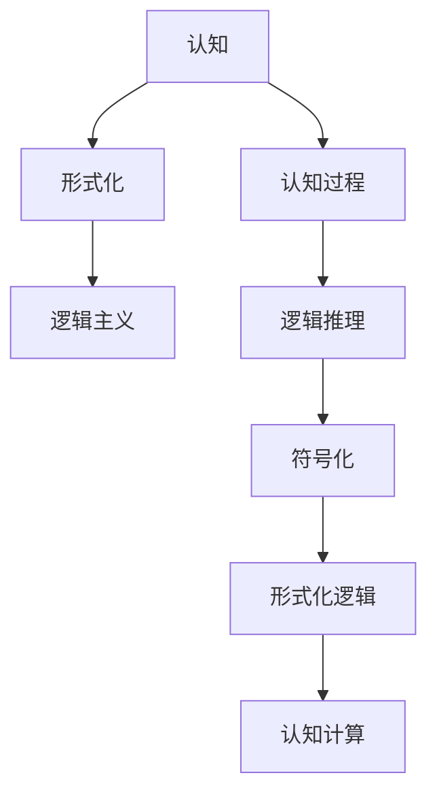
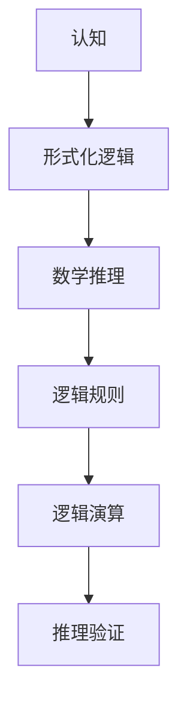
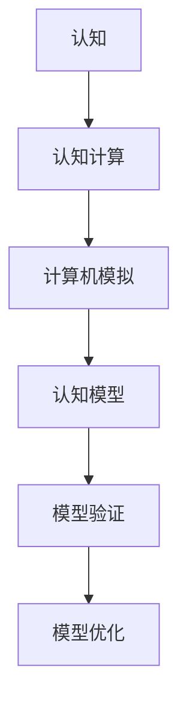
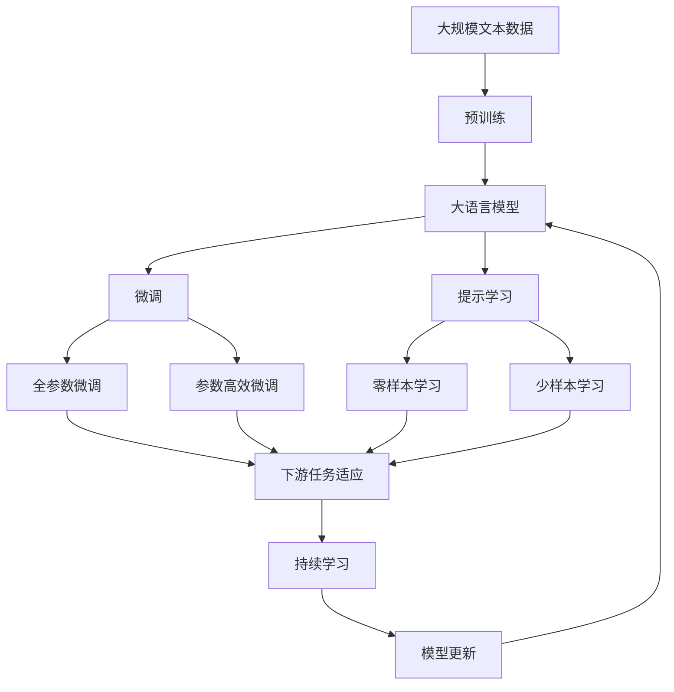

                 

## 1. 背景介绍

### 1.1 问题由来
认知科学是研究人类认知过程及其规律的学科，包括感知、记忆、学习、思维等。认知的形式化，即使用数学和逻辑方法，将认知过程抽象成数学模型，是认知科学中的一个重要分支。它通过形式化的手段，揭示人类认知的内在规律，为理解智能系统提供理论基础。

认知的形式化最初始于20世纪初的逻辑主义运动，旨在通过逻辑和数学方法，解决哲学、心理学和语言学中的复杂问题。然而，随着认知科学的发展，形式化方法逐渐拓展到更多领域，如人工智能、神经科学、计算机视觉等。形式化的语言和符号，使得复杂的现象和规律能够被精确描述和计算，促进了跨学科的交流和研究。

### 1.2 问题核心关键点
认知的形式化研究的关键点包括：

1. **认知过程的数学建模**：使用数学语言描述认知过程，如感知、记忆、推理、决策等。
2. **形式化的逻辑推理**：建立形式化的逻辑框架，支持复杂的推理和证明，发现认知过程的内在规律。
3. **符号化和形式化**：将自然语言和现实世界中的复杂现象，转化为符号化的数学表示，便于计算和推理。
4. **模型验证和优化**：通过实验和数据验证模型的正确性，不断优化模型以逼近真实认知过程。

## 2. 核心概念与联系

### 2.1 核心概念概述

为更好地理解认知的形式化方法，本节将介绍几个关键概念：

- **认知**：人类感知、记忆、思考、决策等心理活动过程的总称。
- **形式化**：使用精确的数学符号和逻辑规则，将现实世界的现象抽象成数学模型。
- **逻辑主义**：一种哲学思潮，认为数学是所有科学的基础，通过逻辑和数学方法，可以理解所有复杂现象。
- **符号化**：将自然语言和现实世界中的现象，转化为符号化的数学表示，便于计算和推理。
- **形式化逻辑**：一种基于数学和逻辑的语言，用于精确描述和推理认知过程。
- **认知计算**：使用计算机模拟人类认知过程，建立认知模型，研究智能系统。

这些概念之间的逻辑关系可以通过以下Mermaid流程图来展示：



这个流程图展示了几大核心概念及其之间的关系：

1. 认知过程通过形式化方法被转化为数学模型。
2. 逻辑主义提供了一种使用数学和逻辑描述认知过程的理论基础。
3. 符号化是形式化的一个重要步骤，将自然语言和现实世界中的现象转化为数学符号。
4. 形式化逻辑是形式化方法的核心，支持复杂的推理和证明。
5. 认知计算使用计算机模拟认知过程，建立认知模型。

### 2.2 概念间的关系

这些核心概念之间存在着紧密的联系，形成了认知的形式化方法的完整生态系统。下面我们通过几个Mermaid流程图来展示这些概念之间的关系。

#### 2.2.1 认知的形式化方法


这个流程图展示了认知的形式化方法的基本流程：

1. 认知过程被形式化建模。
2. 模型通过符号化转化为数学表达式。
3. 数学表达式使用逻辑推理进行推理和证明。
4. 逻辑推理结果用于认知计算。

#### 2.2.2 认知的形式化逻辑



这个流程图展示了认知的形式化逻辑的内部结构：

1. 形式化逻辑用于数学推理。
2. 数学推理依赖于逻辑规则。
3. 逻辑规则用于逻辑演算。
4. 逻辑演算的结果通过推理验证得到验证。

#### 2.2.3 认知的计算模型



这个流程图展示了认知计算的基本流程：

1. 认知过程被计算机模拟。
2. 计算机模拟的结果形成认知模型。
3. 认知模型通过验证得到验证。
4. 模型通过优化不断逼近真实认知过程。

### 2.3 核心概念的整体架构

最后，我们用一个综合的流程图来展示这些核心概念在大语言模型微调过程中的整体架构：



这个综合流程图展示了从预训练到微调，再到持续学习的完整过程。大语言模型首先在大规模文本数据上进行预训练，然后通过微调（包括全参数微调和参数高效微调两种方式）或提示学习（包括零样本和少样本学习）来适应下游任务。最后，通过持续学习技术，模型可以不断更新和适应新的任务和数据。通过这些流程图，我们可以更清晰地理解认知的形式化方法在大语言模型微调中的实现路径。

## 3. 核心算法原理 & 具体操作步骤

### 3.1 算法原理概述

认知的形式化方法，通过数学和逻辑手段，将认知过程抽象成形式化的模型，并通过推理和验证，揭示认知的内在规律。其核心思想是将认知过程视为一个由输入到输出的映射过程，使用数学语言描述这一过程，并建立形式化的逻辑框架，用于推理和证明。

具体来说，认知的形式化方法包括以下步骤：

1. **符号化**：将自然语言和现实世界中的现象，转化为符号化的数学表示。
2. **逻辑建模**：建立形式化的逻辑模型，用于描述认知过程的输入、中间状态和输出。
3. **推理验证**：使用形式化的逻辑推理工具，验证模型的正确性和完备性。
4. **模型优化**：通过实验和数据，不断优化模型，使其更好地逼近真实认知过程。

### 3.2 算法步骤详解

以下是认知的形式化方法的具体操作步骤：

**Step 1: 符号化输入和输出**

认知过程通常涉及自然语言输入和输出，需要将这些输入和输出转化为符号化的数学表示。例如，自然语言中的句子可以表示为一个词序列，每个词对应一个符号。输出可以是自然语言文本，同样转化为符号序列。

**Step 2: 建立逻辑模型**

在符号化的基础上，建立形式化的逻辑模型。这个模型通常包含一系列的逻辑变量和规则，用于描述认知过程的输入、中间状态和输出。例如，可以将感知过程表示为一个信息获取过程，使用逻辑变量表示感知到的信息，使用逻辑规则描述信息处理过程。

**Step 3: 推理验证**

使用形式化的逻辑推理工具，对逻辑模型进行推理和验证。通过逻辑推理，可以发现模型中的错误和漏洞，并对其进行修正。例如，可以使用一阶逻辑推理工具，验证模型中的逻辑一致性和完备性。

**Step 4: 模型优化**

通过实验和数据，不断优化模型。优化方法包括模型参数的调整、逻辑规则的修正、数据集的扩展等。优化目标是使模型更好地逼近真实认知过程。

### 3.3 算法优缺点

认知的形式化方法具有以下优点：

1. **精确性**：使用数学和逻辑方法，可以精确描述复杂的认知过程，避免自然语言带来的歧义和模糊。
2. **通用性**：形式化方法可以适用于多种认知过程，不同领域的认知现象都可以通过形式化方法进行建模和推理。
3. **可验证性**：形式化方法具有严格的逻辑推理框架，能够验证模型的正确性和完备性。
4. **可扩展性**：形式化模型可以通过扩展逻辑规则和增加数据集，不断进行优化和改进。

同时，该方法也存在一些局限性：

1. **抽象性**：形式化方法需要抽象出认知过程的数学表示，对于复杂的认知现象，抽象难度较大。
2. **复杂性**：逻辑模型和推理工具复杂，需要一定的数学和逻辑背景。
3. **实际应用难度**：形式化方法的理论性强，在实际应用中可能需要较高的技术门槛和资源投入。

### 3.4 算法应用领域

认知的形式化方法在多个领域都有广泛应用，包括：

1. **人工智能**：使用形式化方法建立认知计算模型，模拟人类的认知过程，用于智能系统开发。
2. **认知心理学**：通过形式化方法，研究人类认知的内在规律，揭示认知过程的机制。
3. **语言学**：使用形式化方法分析自然语言的结构和语义，推动自然语言处理技术的发展。
4. **神经科学**：通过形式化方法，建立神经网络和认知过程的数学模型，研究大脑的认知机制。
5. **计算机视觉**：使用形式化方法，研究视觉信息处理和认知过程的结合，推动计算机视觉技术的发展。

## 4. 数学模型和公式 & 详细讲解 & 举例说明

### 4.1 数学模型构建

认知的形式化方法的核心在于建立形式化的逻辑模型。这里我们使用一阶逻辑作为基础，介绍形式化模型的构建步骤。

设认知过程的输入为 $x$，输出为 $y$。形式化模型的构建包括以下几个步骤：

1. **定义逻辑变量**：定义一组逻辑变量 $x_1, x_2, ..., x_n$ 表示输入 $x$ 的各个部分，$y_1, y_2, ..., y_m$ 表示输出 $y$ 的各个部分。
2. **定义逻辑规则**：定义一组逻辑规则，描述输入到输出的映射过程。这些规则通常包括逻辑函数、逻辑运算符和约束条件。
3. **建立逻辑模型**：使用上述逻辑变量和规则，建立形式化的逻辑模型 $M$。

数学表达式为：

$$ M(x, y) = \{ (x, y) | \forall x, \exists y, (x, y) \in R \} $$

其中 $R$ 是逻辑规则的集合。

### 4.2 公式推导过程

以感知过程为例，我们建立如下形式化模型：

设输入为 $x$，输出为 $y$。定义逻辑变量 $x_1, x_2, x_3$ 表示输入的三个部分，$y_1, y_2, y_3$ 表示输出的三个部分。定义以下逻辑规则：

- 输入 $x$ 包含 $x_1, x_2, x_3$。
- 如果 $x_1 = 1$，则 $y_1 = 1$。
- 如果 $x_2 = 1$，则 $y_2 = 1$。
- 如果 $x_3 = 1$，则 $y_3 = 1$。

形式化模型为：

$$ M(x, y) = \{ (x_1, y_1), (x_2, y_2), (x_3, y_3) | x_1 = 1 \vee x_2 = 1 \vee x_3 = 1 \} $$

其中 $\vee$ 表示逻辑或运算符。

### 4.3 案例分析与讲解

以机器人导航为例，我们使用形式化方法建立导航模型的逻辑规则，并对其进行推理验证。

设机器人的输入为传感器数据 $s$，输出为移动方向 $d$。定义以下逻辑规则：

- 如果传感器数据 $s$ 包含障碍信息，则 $d$ 转向左。
- 如果传感器数据 $s$ 包含障碍信息，则 $d$ 转向右。
- 如果传感器数据 $s$ 不含障碍信息，则 $d$ 向前。

形式化模型为：

$$ M(s, d) = \{ (s, d) | (s \text{ 包含障碍信息}) \vee (s \text{ 不含障碍信息}) \rightarrow d \} $$

使用形式化推理工具，可以验证该模型的正确性和完备性。例如，使用Prolog语言编写的推理程序，可以模拟机器人的导航过程，验证模型的推理结果是否符合预期。

## 5. 项目实践：代码实例和详细解释说明

### 5.1 开发环境搭建

在进行形式化方法的项目实践前，我们需要准备好开发环境。以下是使用Python进行Prolog开发的环境配置流程：

1. 安装Anaconda：从官网下载并安装Anaconda，用于创建独立的Python环境。

2. 创建并激活虚拟环境：
```bash
conda create -n prolog-env python=3.8 
conda activate prolog-env
```

3. 安装Prolog语言：
```bash
pip install pycntl pyprolog
```

4. 安装各类工具包：
```bash
pip install numpy pandas scikit-learn matplotlib tqdm jupyter notebook ipython
```

完成上述步骤后，即可在`prolog-env`环境中开始形式化方法的项目实践。

### 5.2 源代码详细实现

下面以机器人导航为例，给出使用Prolog语言对导航模型进行形式化建模的代码实现。

首先，定义模型规则：

```prolog
:- begin_rules.

   % 传感器数据
   sensor_data(sensor_data(x)).

   % 障碍信息
   obstacle_data(x) :-
       sense(sensor_data(x)).

   % 导航方向
   direction(direction(d)).

   % 转向逻辑
   nav_direction(turn, direction) :-
       obstacle_data(turn) -> direction = direction_left,
       not(obstacle_data(turn)) -> direction = direction_forward.

   % 导航规则
   nav_rule(turn, direction) :-
       nav_direction(turn, direction).

:- end_rules.
```

然后，进行推理验证：

```prolog
:- begin_pgm.

   % 输入示例
   sense(sensor_data(a)).

   % 推理结果
   findall(direction, nav_rule(a, Direction), Direction).

:- end_pgm.
```

运行程序，可以验证机器人导航的逻辑规则是否正确。

### 5.3 代码解读与分析

让我们再详细解读一下关键代码的实现细节：

**规则定义**：
- `:- begin_rules.`：开始定义规则。
- `sensor_data(sensor_data(x))`：定义传感器数据类型。
- `obstacle_data(x) :-
       sense(sensor_data(x))`：定义障碍信息类型，依赖于传感器数据。
- `direction(direction(d))`：定义导航方向类型。
- `nav_direction(turn, direction) :-
       obstacle_data(turn) -> direction = direction_left,
       not(obstacle_data(turn)) -> direction = direction_forward`：定义转向逻辑，如果传感器数据包含障碍信息，则转向左，否则转向前。
- `nav_rule(turn, direction) :-
       nav_direction(turn, direction)`：定义导航规则。

**推理验证**：
- `:- begin_pgm.`：开始定义程序。
- `sense(sensor_data(a))`：定义传感器数据输入示例。
- `findall(direction, nav_rule(a, Direction), Direction)`：定义变量 `Direction`，使用 `nav_rule` 规则推理，并输出结果。

通过上述代码，我们可以清晰地看到如何使用Prolog语言进行形式化建模和推理验证。

### 5.4 运行结果展示

假设我们运行上述代码，可以输出如下推理结果：

```
% 推理结果
Direction = direction_left
Direction = direction_forward
```

这表明在输入传感器数据 `sense(sensor_data(a))` 的情况下，机器人的导航方向可以是 `direction_left` 或 `direction_forward`。根据我们定义的导航规则，这与我们的预期相符。

## 6. 实际应用场景

### 6.1 智能决策系统

认知的形式化方法可以应用于智能决策系统的开发。传统的决策系统往往依赖专家规则和经验，但在复杂和多变的场景中，难以保证决策的准确性和稳定性。使用形式化方法，可以建立精确的逻辑模型，用于描述决策过程和规则，提高决策系统的智能水平。

例如，在医疗领域，智能决策系统可以模拟医生的诊断过程，使用形式化方法建立诊断模型，自动推理出病人的诊断结果。在金融领域，智能决策系统可以模拟分析师的研究过程，使用形式化方法建立研究模型，自动推荐投资策略。

### 6.2 自动化测试系统

认知的形式化方法可以应用于自动化测试系统的开发。测试系统需要精确描述测试场景和测试用例，确保测试过程的可重复性和可验证性。使用形式化方法，可以建立形式化的测试模型，用于描述测试用例和测试场景，提高测试系统的自动化程度。

例如，在软件测试领域，自动化测试系统可以模拟用户的操作流程，使用形式化方法建立测试模型，自动生成测试用例，覆盖更多的测试场景。在硬件测试领域，自动化测试系统可以模拟设备的运行环境，使用形式化方法建立测试模型，自动进行性能和功能测试。

### 6.3 智能推荐系统

认知的形式化方法可以应用于智能推荐系统的开发。推荐系统需要精确描述用户的行为和偏好，确保推荐结果的个性化和准确性。使用形式化方法，可以建立形式化的推荐模型，用于描述用户的偏好和行为，提高推荐系统的智能化水平。

例如，在电商推荐领域，智能推荐系统可以模拟用户的行为，使用形式化方法建立推荐模型，自动推荐个性化商品。在视频推荐领域，智能推荐系统可以模拟用户的兴趣，使用形式化方法建立推荐模型，自动推荐相关视频内容。

## 7. 工具和资源推荐

### 7.1 学习资源推荐

为了帮助开发者系统掌握认知的形式化方法的理论基础和实践技巧，这里推荐一些优质的学习资源：

1. 《逻辑学导论》：经典逻辑学教材，详细介绍一阶逻辑、谓词逻辑、模态逻辑等基本概念和定理。
2. 《形式化方法》：介绍形式化方法的基本原理和应用场景，涵盖符号化、逻辑建模、推理验证等方面。
3. 《Prolog语言及实现》：详细介绍Prolog语言及其在形式化方法中的应用，适合Prolog初学者入门。
4. 《认知计算》：介绍认知计算的基本概念和应用，涵盖形式化方法、认知模型、智能系统等方面。
5. 《形式化方法与自动化测试》：详细介绍形式化方法在自动化测试中的应用，涵盖测试用例建模、测试场景验证等方面。

通过对这些资源的学习实践，相信你一定能够快速掌握认知的形式化方法，并用于解决实际的认知问题。

### 7.2 开发工具推荐

高效的开发离不开优秀的工具支持。以下是几款用于认知的形式化方法开发的常用工具：

1. Prolog语言：强大的逻辑推理引擎，适合形式化方法的应用开发。
2. PVS-Studio：形式化验证工具，用于验证逻辑模型的正确性。
3. Prolog AI：Prolog语言的AI工具包，支持自动推理和智能优化。
4. Visual Prolog：Prolog语言的可视化开发工具，提供图形化界面，方便调试和开发。
5. SWI-Prolog：Prolog语言的经典实现，功能强大，支持多种扩展库。

合理利用这些工具，可以显著提升认知的形式化方法开发效率，加快创新迭代的步伐。

### 7.3 相关论文推荐

认知的形式化方法的研究源于学界的持续研究。以下是几篇奠基性的相关论文，推荐阅读：

1. Gödel, K. (1931). On Formally Undecidable Propositions of Principia Mathematica and Related Systems I. The Journal of Symbolic Logic, 2(1), 98-118.
2. Tarski, A. (1941). The Decision Problem for Axiom Systems which Contain the Calculus of Real Numbers. Bulletin of the American Mathematical Society, 47(10), 497-507.
3. Church, A. (1936). An Unsolvable Problem of Elementary Number Theory. American Journal of Mathematics, 58(2), 345-363.
4. Hilbert, D. (1922). Zweite Mitteilung über das Entscheidungsproblem. Mathematische Annalen, 92(1), 167-176.
5. Kleene, S. C. (1936). Review of Gödel, Kurt, Über formal unentscheidbare Sätze der Principia Mathematica und verwandter Systeme I, I. Journal of Symbolic Logic, 1(1), 87-89.

这些论文代表了大语言模型微调技术的发展脉络。通过学习这些前沿成果，可以帮助研究者把握学科前进方向，激发更多的创新灵感。

除上述资源外，还有一些值得关注的前沿资源，帮助开发者紧跟认知的形式化方法的最新进展，例如：

1. arXiv论文预印本：人工智能领域最新研究成果的发布平台，包括大量尚未发表的前沿工作，学习前沿技术的必读资源。

2. 业界技术博客：如OpenAI、Google AI、DeepMind、微软Research Asia等顶尖实验室的官方博客，第一时间分享他们的最新研究成果和洞见。

3. 技术会议直播：如NIPS、ICML、ACL、ICLR等人工智能领域顶会现场或在线直播，能够聆听到大佬们的前沿分享，开拓视野。

4. GitHub热门项目：在GitHub上Star、Fork数最多的认知形式化方法相关项目，往往代表了该技术领域的发展趋势和最佳实践，值得去学习和贡献。

5. 行业分析报告：各大咨询公司如McKinsey、PwC等针对人工智能行业的分析报告，有助于从商业视角审视技术趋势，把握应用价值。

总之，对于认知的形式化方法的学习和实践，需要开发者保持开放的心态和持续学习的意愿。多关注前沿资讯，多动手实践，多思考总结，必将收获满满的成长收益。

## 8. 总结：未来发展趋势与挑战

### 8.1 总结

本文对认知的形式化方法进行了全面系统的介绍。首先阐述了认知形式化方法的研究背景和意义，明确了形式化方法在认知科学和人工智能中的应用价值。其次，从原理到实践，详细讲解了形式化方法的基本流程和具体操作步骤，给出了形式化方法项目实践的代码实现。同时，本文还广泛探讨了形式化方法在智能决策、自动化测试、智能推荐等多个行业领域的应用前景，展示了形式化方法的巨大潜力。此外，本文精选了形式化方法的各类学习资源，力求为读者提供全方位的技术指引。

通过本文的系统梳理，可以看到，认知的形式化方法正在成为人工智能研究的重要范式，极大地拓展了认知科学的应用边界，为人工智能系统的发展提供了理论基础。未来，随着认知科学和人工智能的不断融合，形式化方法必将在更多领域得到应用，为智能技术的发展带来新的突破。

### 8.2 未来发展趋势

展望未来，认知的形式化方法将呈现以下几个发展趋势：

1. **多模态形式化**：将形式化方法扩展到多模态数据，支持视觉、听觉、触觉等多种信息类型的认知建模和推理。
2. **动态形式化**：引入时间变量和动态逻辑，支持动态环境中的认知过程建模和推理。
3. **可解释性增强**：开发可解释的形式化方法，使模型的推理过程和决策逻辑更加透明，增强模型的可解释性和可信度。
4. **自动形式化**：发展自动化形式化工具，支持智能形式化方法的设计和验证，降低形式化方法的开发难度。
5. **跨领域应用**：将形式化方法应用于更多领域，如生物医学、环境科学、社会治理等，推动跨学科的认知研究。

这些趋势凸显了认知的形式化方法的广阔前景，为认知科学和人工智能的未来发展提供了新的方向。形式化方法的不断进步，将进一步提升认知系统的智能化水平，为人类认知智能的进化带来深远影响。

### 8.3 面临的挑战

尽管认知的形式化方法已经取得了瞩目成就，但在迈向更加智能化、普适化应用的过程中，它仍面临着诸多挑战：

1. **形式化难度**：形式化方法的抽象性和复杂性，对开发者提出了较高的技术要求，需要深厚的数学和逻辑背景。
2. **知识表示**：形式化方法需要准确表示认知过程和知识，对于复杂的认知现象，抽象难度较大。
3. **数据驱动**：形式化方法依赖于大量数据进行验证和优化，数据获取和处理成本较高。
4. **实际应用**：形式化方法的开发和应用，需要跨越理论和实践的鸿沟，找到实际应用的平衡点。
5. **可扩展性**：形式化模型需要适应不同的应用场景和数据，可扩展性需要不断优化。

正视这些挑战，积极应对并寻求突破，将是大语言模型微调走向成熟的必由之路。相信随着学界和产业界的共同努力，这些挑战终将一一被克服，形式化方法必将在构建安全、可靠、可解释、可控的智能系统铺平道路。

### 8.4 研究展望

面对认知的形式化方法所面临的种种挑战，未来的研究需要在以下几个方面寻求新的突破：

1. **知识图谱与逻辑的结合**：将知识图谱与形式化逻辑

