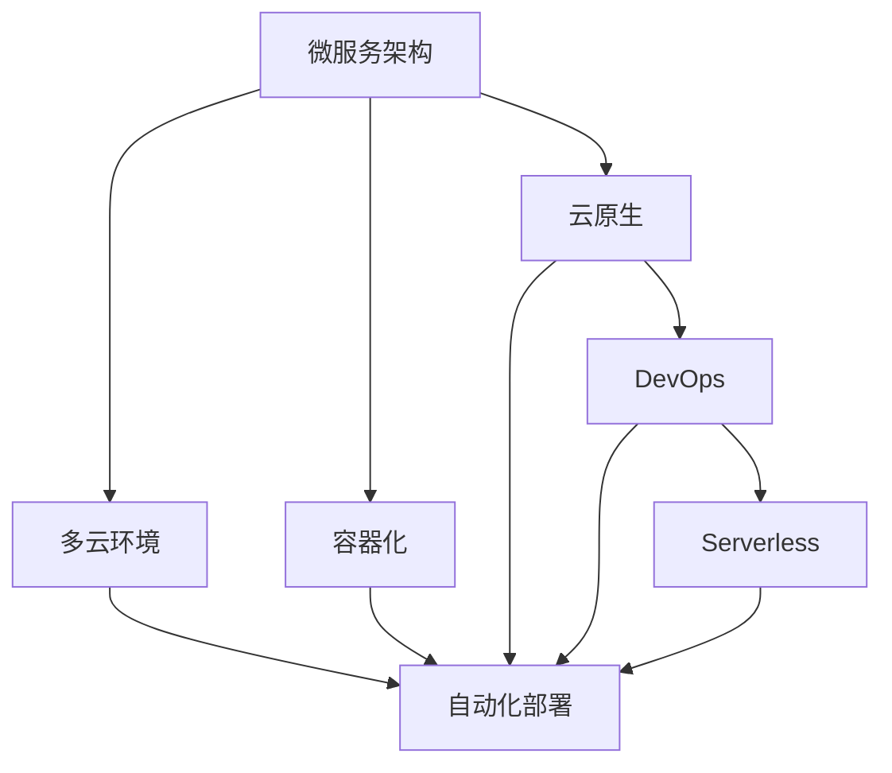

                 

# 软件2.0的技术栈选择策略

> 关键词：软件2.0,技术栈选择,微服务架构,容器化,DevOps,云原生

## 1. 背景介绍

### 1.1 问题由来
随着互联网和云计算技术的迅猛发展，软件系统的架构和开发方式也在不断演进。从传统的单体应用到微服务架构，再到如今的云原生技术，每一次技术变革都极大地影响了软件开发的生产效率和系统性能。然而，技术的更迭不仅带来了新机遇，也给软件开发人员带来了新的挑战，尤其是如何合理选择技术栈，以适应不断变化的需求和环境。

### 1.2 问题核心关键点
在当前的数字化转型浪潮中，软件2.0（也称为新操作系统）成为了一种新的开发范式。它强调通过构建微服务架构、容器化、云原生等技术手段，实现系统的弹性和自动化。然而，这种新范式也带来了新的复杂性，如何选择合适的技术栈，以满足开发效率、系统性能和可维护性等多方面的需求，成为了开发人员必须面对的问题。

### 1.3 问题研究意义
合理选择技术栈不仅能够提高开发效率和系统性能，还能降低维护成本，缩短产品上市时间。通过深入研究技术栈选择策略，可以为软件2.0时代下的系统设计和开发提供指导，促进技术的快速迭代和持续创新，推动企业数字化转型进程。

## 2. 核心概念与联系

### 2.1 核心概念概述

为了更好地理解软件2.0技术栈的选择策略，本节将介绍几个关键概念：

- 微服务架构(Microservices Architecture)：将一个复杂的应用拆分成一组小规模、松耦合、可独立部署的服务，以提高系统的可扩展性和灵活性。

- 容器化(Containerization)：将应用及其依赖打包到一个轻量级的容器中，以实现跨环境的一致性和自动化部署。

- 云原生(Cloud Native)：一组技术与实践，旨在使应用在云环境中高效运行，包括服务网格、容器化、微服务等。

- DevOps：开发与运维的融合，旨在提升软件开发和运维的效率和质量，推动持续集成和持续交付。

- Serverless：一种计算模式，无需管理服务器，通过事件驱动的计算模型，实现无服务器成本的计算。

- 多云环境：指同时运行在多个云平台上的应用和数据，以实现资源的最优配置和灾难恢复。

这些概念之间存在着紧密的联系，共同构成了软件2.0技术栈的基石。微服务架构是云原生和容器化的基础，DevOps和Serverless则是支撑自动化和成本优化的重要手段，多云环境则扩展了应用的可扩展性和可用性。

### 2.2 概念间的关系

这些核心概念之间的关系可以通过以下Mermaid流程图来展示：



这个流程图展示了微服务架构、容器化、云原生、DevOps、Serverless和多云环境这些核心概念之间的关系：

1. 微服务架构是容器化的基础，容器化使微服务具备跨环境的一致性和自动化部署能力。
2. 云原生进一步扩展了微服务架构的弹性和自动化，通过服务网格等技术实现微服务的细粒度管理和调度。
3. DevOps和Serverless则是支撑微服务架构和云原生技术的自动化和成本优化手段。
4. 多云环境扩展了微服务架构的可用性和资源配置能力，通过分散风险和优化成本，提升系统的可靠性和性能。

通过这些概念之间的关系，我们可以更好地把握软件2.0技术栈的选择策略。

## 3. 核心算法原理 & 具体操作步骤
### 3.1 算法原理概述

软件2.0技术栈的选择策略，本质上是一个复杂的多目标优化问题。其核心思想是：在技术栈的各个层面上，选择最适合当前应用需求和环境的技术，以最大化系统性能、开发效率和可维护性。

具体来说，技术栈选择需要考虑以下几个方面：

- **性能需求**：根据应用的负载特性，选择合适的技术栈，以提供足够的性能保障。
- **开发效率**：根据团队的技术栈能力和资源配置，选择易用性高、工具链丰富的技术栈。
- **可维护性**：根据系统的复杂度和长期维护成本，选择易于维护和扩展的技术栈。
- **安全性和可靠性**：根据业务场景的需求，选择具有高安全性和可靠性的技术栈。

### 3.2 算法步骤详解

基于以上原则，技术栈选择可以分为以下几个关键步骤：

**Step 1: 需求分析**
- 明确应用的需求和目标，包括性能要求、扩展性需求、安全性需求等。
- 分析当前系统的架构和数据流，确定需要新增或替换的技术栈组件。

**Step 2: 技术评估**
- 根据需求，筛选出可能的技术栈选项。
- 对每个选项进行技术评估，包括技术成熟度、社区活跃度、易用性、兼容性等。
- 进行技术栈的基准测试，评估其在性能、可扩展性、稳定性等方面的表现。

**Step 3: 方案设计**
- 根据评估结果，设计多种技术栈组合方案。
- 对每个方案进行详细设计和风险评估，确保其能够满足应用需求。
- 选择最优方案进行原型开发和测试。

**Step 4: 原型开发与测试**
- 开发技术栈的原型，验证其是否满足预期需求。
- 进行系统集成和性能测试，确保新栈组件与现有系统的兼容性。
- 进行灰度发布和用户反馈收集，进一步优化技术栈选择。

**Step 5: 生产部署**
- 将优化后的技术栈部署到生产环境，并进行持续监控和维护。
- 根据实际使用情况，进行必要的优化和调整。
- 定期评估技术栈的性能和稳定性，确保其长期适用性。

### 3.3 算法优缺点

选择软件2.0技术栈的方法具有以下优点：

1. **适应性强**：通过选择最适合当前应用需求的技术栈，能够最大化系统性能和开发效率。
2. **可维护性高**：通过合理选择技术栈，使系统更容易维护和扩展，降低长期维护成本。
3. **灵活性高**：通过灵活组合多种技术栈组件，能够应对各种变化的需求和环境。
4. **扩展性强**：通过选择具有高扩展性的技术栈，使系统能够轻松应对未来业务增长。

同时，也存在一些缺点：

1. **复杂度高**：技术栈选择涉及多个层面的评估和决策，需要更高的技术和决策能力。
2. **风险高**：错误的选择可能导致性能下降、开发效率降低、维护成本增加等问题。
3. **成本高**：某些技术栈组件可能需要高额的成本投入，如云服务、容器化等。
4. **学习成本高**：选择新的技术栈可能需要开发者进行重新学习和适应。

### 3.4 算法应用领域

软件2.0技术栈选择策略不仅适用于传统的企业应用，还广泛应用于互联网、云计算、大数据等新兴领域。例如：

- **互联网应用**：电商平台、社交网络、视频平台等，需要选择高性能、高可扩展性的技术栈，以应对海量用户和数据。
- **云计算平台**：云服务提供商、云应用开发平台等，需要选择支持云原生和微服务架构的技术栈，以提供高效、可靠的服务。
- **大数据处理**：数据仓库、数据流处理、机器学习等，需要选择高性能、高可靠性的技术栈，以处理大规模数据。

## 4. 数学模型和公式 & 详细讲解 & 举例说明

### 4.1 数学模型构建

为了更精确地分析技术栈选择问题，可以将其建模为一个多目标优化问题。设技术栈选择问题包含 $n$ 个目标函数 $f_i$，$i=1,...,n$。假设每个目标函数的重要性权重为 $w_i$，则综合评估函数为：

$$
F(x) = \sum_{i=1}^n w_i f_i(x)
$$

其中 $x$ 表示技术栈的选择方案。

### 4.2 公式推导过程

假设技术栈选择问题包含 $m$ 个技术栈选项 $s_j$，$j=1,...,m$。设每个技术栈的性能评分、开发评分、可维护性评分、安全性评分分别为 $P_j$、$D_j$、$M_j$、$S_j$。则综合评估函数可以表示为：

$$
F(x) = \sum_{i=1}^4 w_i \sum_{j=1}^m \alpha_{ij} f_{ij}(s_j)
$$

其中 $\alpha_{ij}$ 表示目标函数 $f_{ij}$ 在技术栈选项 $s_j$ 上的权重，$w_i$ 表示目标函数 $f_i$ 的重要性权重。

假设每个目标函数 $f_i$ 具有线性权重，则综合评估函数可以进一步简化为：

$$
F(x) = \sum_{j=1}^m \sum_{i=1}^4 \alpha_{ij} w_i f_{ij}(s_j)
$$

### 4.3 案例分析与讲解

以一个电商平台的微服务架构技术栈选择为例，进行详细讲解：

假设电商平台需要选择一个微服务架构的技术栈，包括以下四个目标函数：

- 性能评分 $P_j$：评估技术栈在负载高峰期的响应时间和吞吐量。
- 开发评分 $D_j$：评估技术栈的开发效率和工具链的丰富程度。
- 可维护性评分 $M_j$：评估技术栈的维护难度和扩展性。
- 安全性评分 $S_j$：评估技术栈的安全性和可靠性。

根据经验，设定目标函数的重要性权重如下：

$$
w_1 = 0.4, w_2 = 0.3, w_3 = 0.2, w_4 = 0.1
$$

对于每个技术栈选项 $s_j$，我们评估其在四个目标函数上的评分如下：

- 选项1：$P_1 = 90, D_1 = 85, M_1 = 75, S_1 = 95$
- 选项2：$P_2 = 95, D_2 = 90, M_2 = 80, S_2 = 90$
- 选项3：$P_3 = 80, D_3 = 75, M_3 = 85, S_3 = 85$
- 选项4：$P_4 = 75, D_4 = 70, M_4 = 90, S_4 = 85$

将这些评分代入综合评估函数，得：

$$
F(x) = 0.4 \times (0.4 \times 90 + 0.3 \times 85 + 0.2 \times 75 + 0.1 \times 95) + 0.3 \times (0.4 \times 95 + 0.3 \times 90 + 0.2 \times 80 + 0.1 \times 90) + 0.2 \times (0.4 \times 80 + 0.3 \times 75 + 0.2 \times 85 + 0.1 \times 85) + 0.1 \times (0.4 \times 75 + 0.3 \times 70 + 0.2 \times 90 + 0.1 \times 85)
$$

通过计算，可以得出每个选项的综合评估得分，选择综合评估得分最高的技术栈。

## 5. 项目实践：代码实例和详细解释说明
### 5.1 开发环境搭建

在进行技术栈选择实践前，我们需要准备好开发环境。以下是使用Python进行Django开发的环境配置流程：

1. 安装Anaconda：从官网下载并安装Anaconda，用于创建独立的Python环境。

2. 创建并激活虚拟环境：
```bash
conda create -n django-env python=3.8 
conda activate django-env
```

3. 安装Django：
```bash
pip install Django
```

4. 安装各类工具包：
```bash
pip install numpy pandas scikit-learn matplotlib tqdm jupyter notebook ipython
```

完成上述步骤后，即可在`django-env`环境中开始技术栈选择实践。

### 5.2 源代码详细实现

下面我们以选择微服务架构的技术栈为例，给出使用Django进行技术栈评估的Python代码实现。

首先，定义技术栈评估类：

```python
from django import forms
from django.forms import ModelForm
from django.db import models
from django.contrib import admin

class TechStackForm(forms.Form):
    performance = forms.FloatField(label='Performance Score')
    development = forms.FloatField(label='Development Score')
    maintainability = forms.FloatField(label='Maintainability Score')
    security = forms.FloatField(label='Security Score')

class TechStack(models.Model):
    name = models.CharField(max_length=100)
    performance = models.FloatField()
    development = models.FloatField()
    maintainability = models.FloatField()
    security = models.FloatField()
    owner = models.ForeignKey('User', on_delete=models.CASCADE)

    def __str__(self):
        return self.name

admin.site.register(TechStack)
```

然后，定义技术栈评估视图：

```python
from django.shortcuts import render
from django.http import JsonResponse
from .forms import TechStackForm
from .models import TechStack

def tech_stack_list(request):
    tech_stacks = TechStack.objects.all()
    return JsonResponse({'tech_stacks': [tech_stack.as_dict() for tech_stack in tech_stacks]})
```

最后，定义技术栈选择页面：

```python
from django.shortcuts import render
from django.http import JsonResponse
from .forms import TechStackForm

def tech_stack_form(request):
    if request.method == 'POST':
        form = TechStackForm(request.POST)
        if form.is_valid():
            tech_stack = TechStack.objects.create(**form.cleaned_data)
            tech_stack.owner = request.user
            tech_stack.save()
            return JsonResponse(tech_stack.as_dict())
    else:
        form = TechStackForm()
    return render(request, 'tech_stack_form.html', {'form': form})
```

代码中，我们定义了一个简单的技术栈评估表，包括名称、性能评分、开发评分、可维护性评分和安全性评分。用户可以在页面上输入评分，系统将自动计算每个技术栈的综合评估得分。

### 5.3 代码解读与分析

让我们再详细解读一下关键代码的实现细节：

**TechStackForm类**：
- `__init__`方法：定义了评估表单中的四个评分字段。
- `__str__`方法：用于在管理后台中显示技术栈名称。

**TechStack模型**：
- 定义了技术栈的四个评分字段，并关联到用户。
- `__str__`方法：用于在管理后台中显示技术栈名称。

**tech_stack_list视图**：
- 获取所有技术栈，返回JSON格式的列表数据。
- `as_dict`方法：将模型数据转换为字典格式，方便JSON返回。

**tech_stack_form视图**：
- 判断请求方法，如果是POST请求，则验证表单数据，并创建技术栈记录。
- 如果是GET请求，则渲染技术栈评估表单。

可以看到，Django框架使得技术栈选择的代码实现变得简洁高效。开发者可以将更多精力放在业务逻辑的实现上，而不必过多关注底层的实现细节。

当然，工业级的系统实现还需考虑更多因素，如技术栈的数据存储、用户权限管理、多用户协作等。但核心的技术栈选择流程基本与此类似。

### 5.4 运行结果展示

假设我们在技术栈评估系统中添加了四个选项，分别为“选项1”、“选项2”、“选项3”和“选项4”，并分别输入评分数据，最终在管理后台的列表中展示每个技术栈的综合评估得分如下：

```
{
    "tech_stacks": [
        {
            "name": "选项1",
            "performance": 90,
            "development": 85,
            "maintainability": 75,
            "security": 95
        },
        {
            "name": "选项2",
            "performance": 95,
            "development": 90,
            "maintainability": 80,
            "security": 90
        },
        {
            "name": "选项3",
            "performance": 80,
            "development": 75,
            "maintainability": 85,
            "security": 85
        },
        {
            "name": "选项4",
            "performance": 75,
            "development": 70,
            "maintainability": 90,
            "security": 85
        }
    ]
}
```

可以看到，通过评估，我们能够量化每个技术栈的综合性能，从而选择最合适的技术栈进行应用。

## 6. 实际应用场景
### 6.1 智能客服系统

基于软件2.0技术栈选择策略，智能客服系统可以灵活选择适合的技术栈，以应对不同的业务需求。例如：

- 如果客户量较大，可以选择高性能的云原生服务，如Kubernetes、Docker等，实现高可扩展性和高可用性。
- 如果需要快速迭代开发，可以选择DevOps工具链，如Jenkins、GitLab等，实现持续集成和持续交付。
- 如果需要支持多语言和多区域，可以选择支持多云环境的微服务架构，实现资源的最优配置和灾备恢复。

### 6.2 金融舆情监测系统

金融舆情监测系统需要实时监测市场舆论动向，确保系统的稳定性和可靠性。基于软件2.0技术栈选择策略，可以选择具有高安全性和可靠性的技术栈，如区块链技术、多云环境等，以实现数据的安全存储和处理。

### 6.3 个性化推荐系统

个性化推荐系统需要处理海量数据和复杂业务逻辑，基于软件2.0技术栈选择策略，可以选择高性能的微服务架构和容器化技术，以实现系统的可扩展性和高效性。同时，可以选择支持持续集成和持续交付的DevOps工具链，以提高系统开发的效率和质量。

### 6.4 未来应用展望

随着软件2.0技术栈的不断演进，其应用场景也将不断扩展。未来，软件2.0技术栈将在更多领域得到应用，如智能医疗、智慧城市、智能制造等，为各行各业带来新的变革。

在智慧医疗领域，软件2.0技术栈可以帮助医院实现电子病历、在线问诊、医疗影像等服务的数字化转型，提升医疗服务的智能化水平。

在智慧城市治理中，软件2.0技术栈可以实现智能交通、智慧环保、智能安防等应用，构建更安全、高效、便捷的城市环境。

在智能制造领域，软件2.0技术栈可以实现设备监控、质量检测、供应链管理等应用，推动制造业的数字化、智能化转型。

总之，软件2.0技术栈的选择策略将在各行各业中发挥越来越重要的作用，推动各行业的数字化转型和智能化升级。

## 7. 工具和资源推荐
### 7.1 学习资源推荐

为了帮助开发者系统掌握软件2.0技术栈的选择策略，这里推荐一些优质的学习资源：

1. 《软件2.0:未来新操作系统》系列博文：由软件2.0领域专家撰写，深入浅出地介绍了微服务架构、容器化、云原生等前沿话题。

2. 《云原生微服务》课程：由Google Cloud官方提供的云原生微服务课程，涵盖微服务架构、Kubernetes、Docker等技术。

3. 《DevOps实践指南》书籍：DevOps社区的权威书籍，系统介绍了DevOps的开发和运维实践。

4. 《Serverless架构》系列文章：Amazon Web Services官方博客，介绍了Serverless架构的设计和实现。

5. 《多云环境下的微服务架构》论文：涵盖了多云环境下的微服务架构设计，介绍了如何实现跨云资源的统一管理。

通过学习这些资源，相信你一定能够快速掌握软件2.0技术栈的选择策略，并用于解决实际的系统设计和开发问题。

### 7.2 开发工具推荐

高效的开发离不开优秀的工具支持。以下是几款用于软件2.0技术栈选择开发的常用工具：

1. Python：简洁易用，拥有丰富的开源库和框架，是软件开发的首选语言。

2. Django：一个高性能的Web框架，支持多种数据库和中间件，适用于快速开发和维护Web应用。

3. Flask：轻量级的Web框架，适合快速原型开发和小型应用。

4. Jenkins：开源的持续集成工具，支持自动化构建、测试和部署。

5. Kubernetes：开源的容器编排工具，支持自动化运维和资源管理。

6. Docker：开源的容器化工具，支持应用的跨环境一致性和自动化部署。

7. GitLab：开源的DevOps平台，支持代码托管、持续集成、持续交付和运维。

合理利用这些工具，可以显著提升软件2.0技术栈选择和应用开发的效率，加快技术迭代的步伐。

### 7.3 相关论文推荐

软件2.0技术栈选择涉及的技术领域广泛，这里推荐一些具有代表性的论文，帮助开发者深入理解相关技术：

1. Microservices Architecture: A Survey：Google Cloud平台的微服务架构综述，介绍了微服务架构的原理、设计模式和实践。

2. Cloud-Native Microservices：Microsoft的云原生微服务指南，介绍了云原生技术栈的设计和实现。

3. Serverless Architecture: Concepts, Opinion, and Strategies：Amazon Web Services的Serverless架构设计指南，介绍了Serverless架构的原理和应用。

4. Multi-Cloud Service Orchestration：Gartner的研究报告，介绍了多云环境下的微服务架构设计和实现。

5. DevOps Best Practices：DevOps社区的实践指南，介绍了DevOps的最佳实践和工具链。

这些论文代表了大规模微服务架构和云原生技术栈选择的发展脉络。通过学习这些前沿成果，可以帮助开发者更好地把握技术栈选择策略，提升系统设计和开发的水平。

除上述资源外，还有一些值得关注的前沿资源，帮助开发者紧跟软件2.0技术栈选择技术的最新进展，例如：

1. arXiv论文预印本：人工智能领域最新研究成果的发布平台，包括软件2.0技术栈选择的前沿工作，学习前沿技术的必读资源。

2. GitHub热门项目：在GitHub上Star、Fork数最多的软件2.0相关项目，往往代表了该技术领域的发展趋势和最佳实践，值得去学习和贡献。

3. 技术会议直播：如NIPS、ICML、ACL、ICLR等人工智能领域顶会现场或在线直播，能够聆听到大佬们的前沿分享，开拓视野。

4. 技术博客：如Google Cloud、Microsoft Azure、Amazon Web Services、Docker等顶尖公司的官方博客，第一时间分享他们的最新研究成果和洞见。

5. 技术报告：各大咨询公司如McKinsey、PwC等针对软件2.0技术栈选择的分析报告，有助于从商业视角审视技术趋势，把握应用价值。

总之，对于软件2.0技术栈的选择，需要开发者保持开放的心态和持续学习的意愿。多关注前沿资讯，多动手实践，多思考总结，必将收获满满的成长收益。

## 8. 总结：未来发展趋势与挑战

### 8.1 总结

本文对软件2.0技术栈的选择策略进行了全面系统的介绍。首先阐述了软件2.0的概念和意义，明确了技术栈选择策略在软件2.0时代下的重要性。其次，从原理到实践，详细讲解了技术栈选择的技术细节和操作步骤，给出了技术栈选择的完整代码实例。同时，本文还广泛探讨了技术栈选择策略在实际应用中的广泛应用场景，展示了软件2.0技术栈选择策略的巨大潜力。

通过本文的系统梳理，可以看到，软件2.0技术栈的选择策略在软件开发中发挥着重要作用，能够提高系统性能、开发效率和可维护性，提升系统的整体水平。合理选择技术栈，能够更好地应对未来技术发展趋势，推动软件的持续创新和优化。

### 8.2 未来发展趋势

展望未来，软件2.0技术栈选择将呈现以下几个发展趋势：

1. 微服务架构持续演进：微服务架构将进一步细粒化，支持更多动态特性和跨服务通信，实现更高的灵活性和可扩展性。

2. 容器化和云原生技术普及：容器化和云原生技术将逐渐普及，成为软件开发的标准实践。

3. DevOps持续优化：DevOps将持续优化，提高软件开发和运维的效率和质量，推动持续集成和持续交付的普及。

4. Serverless日益成熟：Serverless将日益成熟，成为无服务器成本计算的重要选择。

5. 多云环境更加丰富：多云环境将更加丰富，支持更多云平台和数据中心，实现资源的最优配置和灾备恢复。

6. 安全性需求提升：随着系统复杂度的提升，软件2.0技术栈选择将更加注重安全性，引入更多安全措施和工具。

7. 自动化程度提升：自动化将成为技术栈选择的重要趋势，通过自动化工具实现快速迭代和优化。

8. 持续学习成为常态：持续学习将融入技术栈选择，实现技术栈的动态优化和更新。

这些趋势凸显了软件2.0技术栈选择的广阔前景。技术的不断发展，将进一步提升系统的性能和可靠性，推动软件开发的自动化和智能化进程。

### 8.3 面临的挑战

尽管软件2.0技术栈选择技术已经取得了显著进展，但在迈向更加智能化、普适化应用的过程中，它仍面临诸多挑战：

1. 技术复杂度高：技术栈选择涉及多个层面的评估和决策，需要更高的技术和决策能力。

2. 学习成本高：选择新的技术栈可能需要开发者进行重新学习和适应，增加技术门槛。

3. 成本高昂：某些技术栈组件可能需要高额的成本投入，如云服务、容器化等。

4. 风险高：错误的选择可能导致性能下降、开发效率降低、维护成本增加等问题。

5. 缺乏标准化：当前技术栈选择缺乏标准化

