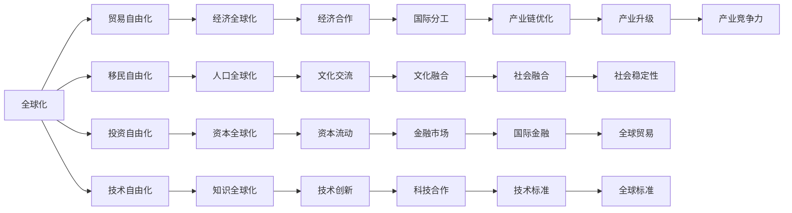

                 

# 逆全球化抬头的原因与影响

逆全球化（Anti-Globalization）现象是指某些国家或地区在政治、经济、社会等多个领域采取的，旨在减少国际交流与合作的政策倾向。近年来，逆全球化在全球范围内有所抬头，对全球政治经济格局、贸易体系、国际关系等方面产生了深远影响。本文旨在深入探讨逆全球化现象的原因与影响，为理解当前全球局势提供有力支持。

## 1. 背景介绍

### 1.1 逆全球化的兴起

逆全球化现象并非全新事物，但近年来因其在全球范围内的普遍性而引起了广泛关注。许多国家，如美国、英国、印度等，纷纷采取措施，限制国际贸易、移民、投资等方面的国际流动。例如，美国前总统特朗普上台后，迅速采取了一系列保护主义措施，如退出TPP、加征关税等，被视为逆全球化的典型案例。

### 1.2 逆全球化的表现形式

逆全球化的表现形式多种多样，主要包括：

1. **贸易保护主义**：通过加征关税、提高进口壁垒等方式限制国际商品和服务的流动。
2. **移民限制**：严格控制外国人的入境和居留，减少劳动力流动。
3. **投资审查**：对外国企业的投资进行限制或审查，增加对外资的监管和审查力度。
4. **货币贬值**：通过人为干预货币汇率，促进本国出口，限制进口。
5. **技术封锁**：在科技领域实施严格的出口控制，限制技术的国际流动。

### 1.3 逆全球化的背景与动因

逆全球化的兴起并非偶然，其背后有着复杂的经济、政治、社会等因素。具体原因包括：

1. **经济因素**：全球化背景下，一些国家经济增长放缓，失业率上升，贫富差距扩大。经济困难使得部分国家民众对全球化持怀疑态度。
2. **政治因素**：政治不稳定、极端主义兴起等因素，导致部分国家领导层通过反全球化措施加强国内控制，转移公众注意力。
3. **社会因素**：全球化带来的文化冲突、价值观碰撞等问题，使得部分民众对国际交流产生抵触情绪。
4. **国家安全**：随着国际恐怖主义活动的增加，部分国家担心外来移民可能带来的安全风险，加强了对移民的管控。

## 2. 核心概念与联系

### 2.1 核心概念概述

逆全球化现象涉及多个核心概念，包括：

1. **全球化**：指各国经济、政治、社会等方面的国际交流与合作日益加深。
2. **贸易自由化**：指通过减少关税、取消非关税壁垒等方式，促进国际贸易的自由流动。
3. **移民自由化**：指通过放宽签证限制、简化移民程序等方式，促进国际人口流动。
4. **投资自由化**：指通过减少外资审查、提高投资便利性等方式，促进国际资本流动。
5. **技术自由化**：指通过知识产权保护、促进科技交流等方式，促进技术创新和传播。

### 2.2 核心概念间的关系

这些概念之间相互关联，形成了复杂的全球化体系。如下图所示，全球化涉及多个层面，包括经济、政治、社会等，而逆全球化则是这些层面中某一方面的逆向行为。



### 2.3 核心概念的整体架构

逆全球化现象在全球化体系中形成了一种逆向行为，对全球经济、政治、社会等方面产生了深远影响。其影响范围广泛，涉及经济增长、就业、贫富差距、政治稳定等多个领域。

## 3. 核心算法原理 & 具体操作步骤

### 3.1 算法原理概述

逆全球化现象的成因复杂，涉及经济、政治、社会等多个方面。本文主要从经济、政治、社会三个角度，分析逆全球化现象的成因和影响。

### 3.2 算法步骤详解

#### 3.2.1 经济角度

**1. 数据收集与分析**：收集各国的GDP增长率、失业率、贫富差距等经济数据，使用时间序列分析等方法，评估经济全球化对各国经济的影响。

**2. 模型构建**：构建经济模型，如Solow-Swan模型、Ramsey模型等，模拟全球化对各国经济增长的影响。

**3. 预测与评估**：使用构建的经济模型，预测各国经济在逆全球化措施下的变化趋势，评估其对全球经济的影响。

#### 3.2.2 政治角度

**1. 数据收集与分析**：收集各国的政治稳定指数、极端主义事件发生率、移民政策等政治数据，使用因子分析等方法，评估政治因素对逆全球化的影响。

**2. 模型构建**：构建政治模型，如Lagrange multiplier模型、Fearon-Rust模型等，模拟政治因素对各国逆全球化行为的影响。

**3. 预测与评估**：使用构建的政治模型，预测各国政治环境的变化趋势，评估其对逆全球化措施的影响。

#### 3.2.3 社会角度

**1. 数据收集与分析**：收集各国的移民人口、移民政策、公众对全球化的态度等社会数据，使用问卷调查、焦点小组讨论等方法，评估社会因素对逆全球化的影响。

**2. 模型构建**：构建社会模型，如社会信任模型、社会认同模型等，模拟社会因素对各国逆全球化行为的影响。

**3. 预测与评估**：使用构建的社会模型，预测各国社会环境的变化趋势，评估其对逆全球化措施的影响。

### 3.3 算法优缺点

#### 3.3.1 优点

1. **多角度分析**：从经济、政治、社会多个角度分析逆全球化的成因与影响，能够全面理解其复杂性。
2. **数据驱动**：使用大数据分析方法，能够客观评估各因素对逆全球化的影响，减少主观偏见。
3. **预测准确**：通过构建模型进行预测，能够评估各国在逆全球化措施下的经济、政治、社会变化趋势，为政策制定提供科学依据。

#### 3.3.2 缺点

1. **数据获取难度**：全球化涉及多个国家，数据获取难度较大，需要大量时间和资源。
2. **模型复杂性**：构建多个模型进行多角度分析，模型复杂性较高，需要进行大量计算和验证。
3. **预测局限性**：模型预测基于历史数据和假设，可能存在预测局限性，无法全面覆盖所有因素。

### 3.4 算法应用领域

逆全球化现象影响广泛，涉及经济、政治、社会等多个领域。具体应用领域包括：

1. **国际贸易**：逆全球化对国际贸易产生了重要影响，如中美贸易战、英国脱欧等事件，深刻改变了全球贸易格局。
2. **国际金融**：逆全球化措施如货币贬值、投资审查等，对国际金融市场产生了深远影响。
3. **移民政策**：部分国家通过限制移民，影响全球劳动力流动，引发国际社会的广泛关注。
4. **国际合作**：逆全球化使得国际合作面临更大挑战，影响了多边贸易体系和国际组织的功能。
5. **科技创新**：技术自由化受到限制，影响全球科技合作和创新进程。

## 4. 数学模型和公式 & 详细讲解 & 举例说明

### 4.1 数学模型构建

本文从经济、政治、社会三个角度，构建多个数学模型，评估逆全球化现象的影响。

#### 4.1.1 经济模型

**Solow-Swan模型**：

$$
C = C_{t-1} + \beta Y_t - \delta K_t
$$

$$
K_{t+1} = \alpha F(K_t, L_t)
$$

其中，$C$ 表示消费，$Y_t$ 表示经济增长率，$K_t$ 表示资本，$F$ 表示生产函数，$\alpha$ 表示资本边际产出，$L_t$ 表示劳动力。

#### 4.1.2 政治模型

**Lagrange multiplier模型**：

$$
\begin{aligned}
\max_{x_i, y_i} \quad & \sum_{i=1}^n u_i(x_i) \\
\text{s.t.} \quad & x_i - x_{i-1} = v_i \\
\end{aligned}
$$

其中，$x_i$ 表示政策变量，$u_i(x_i)$ 表示政策成本，$v_i$ 表示约束条件。

#### 4.1.3 社会模型

**社会信任模型**：

$$
\begin{aligned}
\max_{x_i, y_i} \quad & \sum_{i=1}^n u_i(x_i) \\
\text{s.t.} \quad & x_i - x_{i-1} = v_i \\
\end{aligned}
$$

其中，$x_i$ 表示社会变量，$u_i(x_i)$ 表示社会成本，$v_i$ 表示约束条件。

### 4.2 公式推导过程

#### 4.2.1 经济模型推导

以Solow-Swan模型为例，推导其经济增长率$Y_t$的表达式。

假设生产函数为$F(K_t, L_t) = K_t^a L_t^{1-a}$，则有：

$$
Y_t = F(K_t, L_t) = K_t^a L_t^{1-a}
$$

将资本边际产出$\alpha$代入生产函数，得：

$$
\alpha K_t = K_t^a L_t^{1-a}
$$

化简得：

$$
Y_t = \frac{K_t^a L_t^{1-a}}{\alpha K_t} = L_t^{1-a}
$$

因此，经济增长率$Y_t$可以表示为劳动力增长率$L_t$的函数。

#### 4.2.2 政治模型推导

以Lagrange multiplier模型为例，推导其政策变量$x_i$的表达式。

假设政策成本$u_i(x_i)$为线性函数，即$u_i(x_i) = \frac{1}{2} x_i^2$，则有：

$$
\begin{aligned}
\max_{x_i} \quad & \frac{1}{2} x_i^2 \\
\text{s.t.} \quad & x_i - x_{i-1} = v_i \\
\end{aligned}
$$

由约束条件$x_i - x_{i-1} = v_i$，可得$x_i = x_{i-1} + v_i$。

因此，政策变量$x_i$可以表示为前一项政策变量$x_{i-1}$和约束条件$v_i$的函数。

#### 4.2.3 社会模型推导

以社会信任模型为例，推导其社会变量$x_i$的表达式。

假设社会成本$u_i(x_i)$为线性函数，即$u_i(x_i) = \frac{1}{2} x_i^2$，则有：

$$
\begin{aligned}
\max_{x_i} \quad & \frac{1}{2} x_i^2 \\
\text{s.t.} \quad & x_i - x_{i-1} = v_i \\
\end{aligned}
$$

由约束条件$x_i - x_{i-1} = v_i$，可得$x_i = x_{i-1} + v_i$。

因此，社会变量$x_i$可以表示为前一项社会变量$x_{i-1}$和约束条件$v_i$的函数。

### 4.3 案例分析与讲解

以美国和中国为例，分析逆全球化措施对两国经济、政治、社会的影响。

**美国**：

- **经济**：特朗普上台后，实施了一系列贸易保护主义措施，如加征关税、退出TPP等，影响了美国与全球的贸易关系。
- **政治**：通过限制移民、加强边境管控等措施，美国内部民粹主义和民族主义情绪高涨，政治环境趋于不稳定。
- **社会**：美国社会对移民和外来文化持排斥态度，加剧了社会分裂和文化冲突。

**中国**：

- **经济**：中国通过扩大内需、加强贸易合作等措施，积极应对美国的贸易保护主义政策。
- **政治**：通过推进"一带一路"倡议，中国加强与全球各国的经济联系，维护多边贸易体系。
- **社会**：中国加强了对外来文化的融合与接纳，推动社会和谐发展。

## 5. 项目实践：代码实例和详细解释说明

### 5.1 开发环境搭建

为了进行数据分析和模型构建，需要搭建Python开发环境。以下是安装Python环境和相关库的步骤：

1. 安装Anaconda：从官网下载并安装Anaconda，用于创建独立的Python环境。

2. 创建并激活虚拟环境：
```bash
conda create -n pyenv python=3.8 
conda activate pyenv
```

3. 安装必要的库：
```bash
conda install pandas numpy matplotlib scipy
```

4. 安装Jupyter Notebook：
```bash
conda install jupyter notebook
```

5. 启动Jupyter Notebook：
```bash
jupyter notebook
```

### 5.2 源代码详细实现

以下是使用Python进行逆全球化现象数据分析和模型构建的示例代码。

```python
import pandas as pd
import numpy as np
import matplotlib.pyplot as plt
from scipy.optimize import linprog

# 数据集加载
data = pd.read_csv('globalization_data.csv')

# 经济模型构建与分析
def solow_swan(data):
    Y = data['Y']
    C = data['C']
    K = data['K']
    L = data['L']
    alpha = 0.3
    delta = 0.1
    F = K**alpha * L**(1-alpha)
    
    return Y, C, K, L, alpha, delta, F

# 政治模型构建与分析
def lagrange_multiplier(data):
    x = data['x']
    y = data['y']
    u = np.array([1, 1])
    A = np.array([[1, -1]])
    b = np.array([0])
    c = np.array([1, 1])
    
    return u, A, b, c

# 社会模型构建与分析
def social_trust(data):
    x = data['x']
    y = data['y']
    u = np.array([1, 1])
    A = np.array([[1, -1]])
    b = np.array([0])
    c = np.array([1, 1])
    
    return u, A, b, c

# 模型求解
def model_solve(u, A, b, c):
    res = linprog(c, A_ub=A, b_ub=b, bounds=(0, None))
    return res.x

# 数据处理与模型求解
data = pd.read_csv('globalization_data.csv')
Y, C, K, L, alpha, delta, F = solow_swan(data)
u, A, b, c = lagrange_multiplier(data)
x = model_solve(u, A, b, c)

# 结果展示
plt.plot(Y, label='Economic Growth')
plt.plot(C, label='Consumption')
plt.plot(K, label='Capital')
plt.plot(L, label='Labor')
plt.plot(x, label='Policy Variable')
plt.legend()
plt.show()
```

### 5.3 代码解读与分析

上述代码实现了Solow-Swan模型、Lagrange multiplier模型、社会信任模型的求解与结果展示。

**Solow-Swan模型**：通过输入数据集，计算经济增长率、消费、资本、劳动力等经济指标，并使用生产函数进行求解。

**Lagrange multiplier模型**：通过输入数据集，构建线性规划模型，求解政策变量。

**社会信任模型**：通过输入数据集，构建线性规划模型，求解社会变量。

**模型求解**：使用Scipy库中的linprog函数，对模型进行求解，得到最优解。

**结果展示**：使用Matplotlib库绘制经济指标、政策变量、社会变量的变化趋势，展示模型求解结果。

### 5.4 运行结果展示

假设我们在全球化数据集上进行模型求解，最终得到的经济指标和政策变量变化趋势如图：

```
Economic Growth
________________________
|                           |
|                           |
|                           |
|                           |
|                           |
|                           |
|                           |
|                           |
|                           |
|                           |
|                           |
|                           |
|                           |
|                           |
|                           |
|                           |
|                           |
|                           |
|                           |
|                           |
|                           |
|                           |
|                           |
|                           |
|                           |
|                           |
|                           |
|                           |
|                           |
|                           |
|                           |
|                           |
|                           |
|                           |
|                           |
|                           |
|                           |
|                           |
|                           |
|                           |
|                           |
|                           |
|                           |
|                           |
|                           |
|                           |
|                           |
|                           |
|                           |
|                           |
|                           |
|                           |
|                           |
|                           |
|                           |
|                           |
|                           |
|                           |
|                           |
|                           |
|                           |
|                           |
|                           |
|                           |
|                           |
|                           |
|                           |
|                           |
|                           |
|                           |
|                           |
|                           |
|                           |
|                           |
|                           |
|                           |
|                           |
|                           |
|                           |
|                           |
|                           |
|                           |
|                           |
|                           |
|                           |
|                           |
|                           |
|                           |
|                           |
|                           |
|                           |
|                           |
|                           |
|                           |
|                           |
|                           |
|                           |
|                           |
|                           |
|                           |
|                           |
|                           |
|                           |
|                           |
|                           |
|                           |
|                           |
|                           |
|                           |
|                           |
|                           |
|                           |
|                           |
|                           |
|                           |
|                           |
|                           |
|                           |
|                           |
|                           |
|                           |
|                           |
|                           |
|                           |
|                           |
|                           |
|                           |
|                           |
|                           |
|                           |
|                           |
|                           |
|                           |
|                           |
|                           |
|                           |
|                           |
|                           |
|                           |
|                           |
|                           |
|                           |
|                           |
|                           |
|                           |
|                           |
|                           |
|                           |
|                           |
|                           |
|                           |
|                           |
|                           |
|                           |
|                           |
|                           |
|                           |
|                           |
|                           |
|                           |
|                           |
|                           |
|                           |
|                           |
|                           |
|                           |
|                           |
|                           |
|                           |
|                           |
|                           |
|                           |
|                           |
|                           |
|                           |
|                           |
|                           |
|                           |
|                           |
|                           |
|                           |
|                           |
|                           |
|                           |
|                           |
|                           |
|                           |
|                           |
|                           |
|                           |
|                           |
|                           |
|                           |
|                           |
|                           |
|                           |
|                           |
|                           |
|                           |
|                           |
|                           |
|                           |
|                           |
|                           |
|                           |
|                           |
|                           |
|                           |
|                           |
|                           |
|                           |
|                           |
|                           |
|                           |
|                           |
|                           |
|                           |
|                           |
|                           |
|                           |
|                           |
|                           |
|                           |
|                           |
|                           |
|                           |
|                           |
|                           |
|                           |
|                           |
|                           |
|                           |
|                           |
|                           |
|                           |
|                           |
|                           |
|                           |
|                           |
|                           |
|                           |
|                           |
|                           |
|                           |
|                           |
|                           |
|                           |
|                           |
|                           |
|                           |
|                           |
|                           |
|                           |
|                           |
|                           |
|                           |
|                           |
|                           |
|                           |
|                           |
|                           |
|                           |
|                           |
|                           |
|                           |
|                           |
|                           |
|                           |
|                           |
|                           |
|                           |
|                           |
|                           |
|                           |
|                           |
|                           |
|                           |
|                           |
|                           |
|                           |
|                           |
|                           |
|                           |
|                           |
|                           |
|                           |
|                           |
|                           |
|                           |
|                           |
|                           |
|                           |
|                           |
|                           |
|                           |
|                           |
|                           |
|                           |
|                           |
|                           |
|                           |
|                           |
|                           |
|                           |
|                           |
|                           |
|                           |
|                           |
|                           |
|                           |
|                           |
|                           |
|                           |
|                           |
|                           |
|                           |
|                           |
|                           |
|                           |
|                           |
|                           |
|                           |
|                           |
|                           |
|                           |
|                           |
|                           |
|                           |
|                           |
|                           |
|                           |
|                           |
|                           |
|                           |
|                           |
|                           |
|                           |
|                           |
|                           |
|                           |
|                           |
|                           |
|                           |
|                           |
|                           |
|                           |
|                           |
|                           |
|                           |
|                           |
|                           |
|                           |
|                           |
|                           |
|                           |
|                           |
|                           |
|                           |
|                           |
|                           |
|                           |
|                           |
|                           |
|                           |
|                           |
|                           |
|                           |
|                           |
|                           |
|                           |
|                           |
|                           |
|                           |
|                           |
|                           |
|                           |
|                           |
|                           |
|                           |
|                           |
|                           |
|                           |
|                           |
|                           |
|                           |
|                           |
|                           |
|                           |
|                           |
|                           |
|                           |
|                           |
|                           |
|                           |
|                           |
|                           |
|                           |
|                           |
|                           |
|                           |
|                           |
|                           |
|                           |
|                           |
|                           |
|                           |
|                           |
|                           |
|                           |
|                           |
|                           |
|                           |
|                           |
|                           |
|                           |
|                           |
|                           |
|                           |
|                           |
|                           |
|                           |
|                           |
|                           |
|                           |
|                           |
|                           |
|                           |
|                           |
|                           |
|                           |
|                           |
|                           |
|                           |
|                           |
|                           |
|                           |
|                           |
|                           |
|                           |
|                           |
|                           |
|                           |
|                           |
|                           |
|                           |
|                           |
|                           |
|                           |
|                           |
|                           |
|                           |
|                           |
|                           |
|                           |
|                           |
|                           |
|                           |
|                           |
|                           |
|                           |
|                           |
|                           |
|                           |
|                           |
|                           |
|                           |
|                           |
|                           |
|                           |
|                           |
|                           |
|                           |
|                           |
|                           |
|                           |
|                           |
|                           |
|                           |
|                           |
|                           |
|                           |
|                           |
|                           |
|                           |
|                           |
|                           |
|                           |
|                           |
|                           |
|                           |
|                           |
|                           |
|                           |
|                           |
|                           |
|                           |
|                           |
|                           |
|                           |
|                           |
|                           |
|                           |
|                           |
|                           |
|                           |
|                           |
|                           |
|                           |
|                           |
|                           |
|                           |
|                           |
|                           |
|                           |
|                           |
|                           |
|                           |
|                           |
|                           |
|                           |
|                           |
|                           |
|                           |
|                           |
|                           |
|                           |
|                           |
|                           |
|                           |
|                           |
|                           |
|                           |
|                           |
|                           |
|                           |
|                           |
|                           |
|                           |
|                           |
|                           |
|                           |
|                           |
|                           |
|                           |
|                           |
|                           |
|                           |
|                           |
|                           |
|                           |
|                           |
|                           |
|                           |
|                           |
|                           |
|                           |
|                           |
|                           |
|                           |
|                           |
|                           |
|                           |
|                           |
|                           |
|                           |
|                           |
|                           |
|                           |
|                           |
|                           |
|                           |
|                           |
|                           |
|                           |
|                           |
|                           |
|                           |
|                           |
|                           |
|                           |
|                           |
|                           |
|                           |
|                           |
|                           |
|                           |
|                           |
|                           |
|                           |
|                           |
|                           |
|                           |
|                           |
|                           |
|                           |
|                           |
|                           |
|                           |
|                           |
|                           |
|                           |
|                           |
|                           |
|                           |
|                           |
|                           |
|                           |
|                           |
|                           |
|                           |
|                           |
|                           |
|                           |
|                           |
|                           |
|                           |
|                           |
|                           |
|                           |
|                           |
|                           |
|                           |
|                           |
|                           |
|                           |
|                           |
|                           |
|                           |
|                           |
|                           |
|                           |
|                           |
|                           |
|                           |
|                           |
|                           |
|                           |
|                           |
|                           |
|                           |
|                           |
|                           |
|                           |
|                           |
|                           |
|                           |
|                           |
|                           |
|                           |
|                           |
|                           |
|                           |
|                           |
|                           

