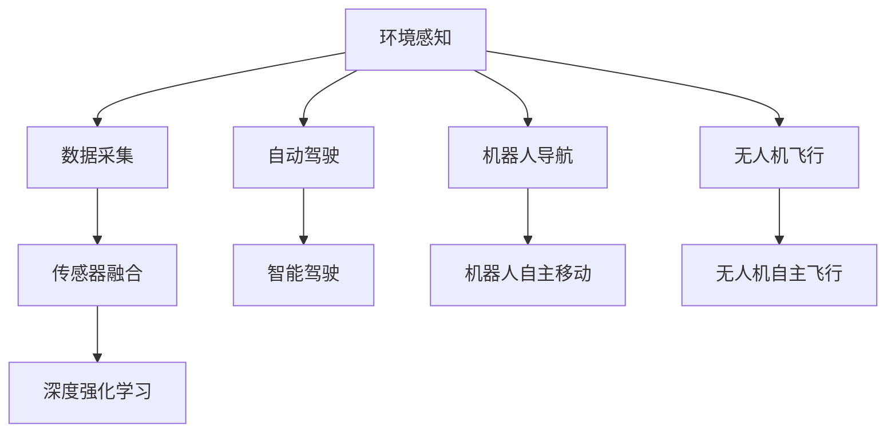
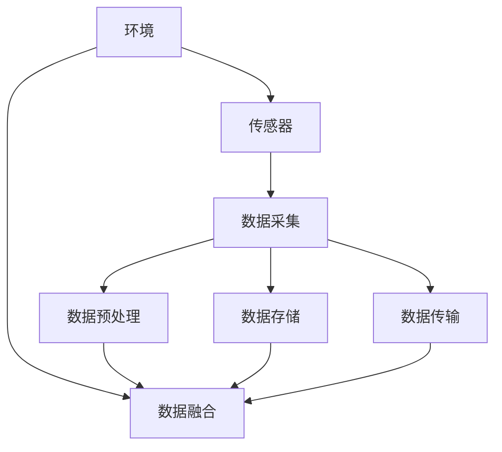
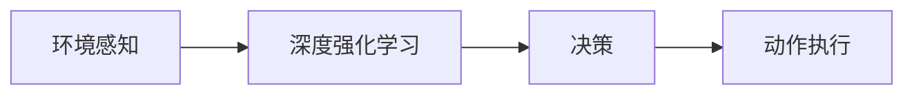
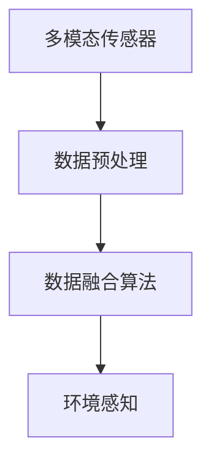
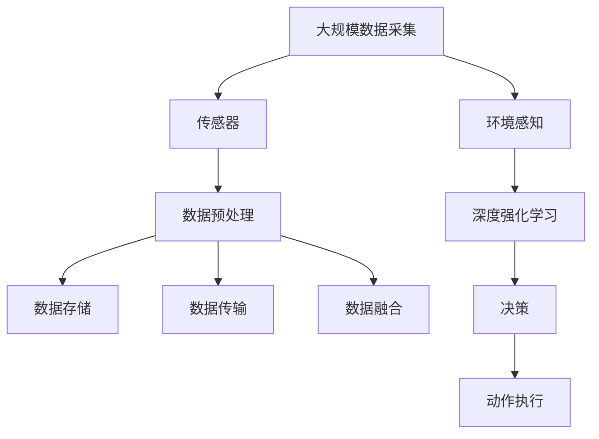

                 

# AI人工智能深度学习算法：环境感知与数据采集机制

> 关键词：人工智能,深度学习,环境感知,数据采集,深度强化学习,自动驾驶,机器人,无人机

## 1. 背景介绍

### 1.1 问题由来

人工智能（AI）和深度学习（DL）技术的快速发展，使得智能系统在诸多领域展现出了卓越的性能，如自然语言处理（NLP）、计算机视觉（CV）、机器人等。这些系统需要在复杂多变的环境中实现自适应和自主决策，环境感知和数据采集机制成为了其成功的关键。

环境感知和数据采集机制是指智能系统如何获取和处理环境信息，以及如何采集相关数据以支持其决策和行为。这不仅仅是技术问题，更涉及到智能系统的整体设计思路和实现策略。

当前，环境感知和数据采集机制在智能系统中具有重要地位，尤其是在智能驾驶、机器人导航、无人机飞行等应用中。但同时，这些机制也面临着诸如数据质量、数据获取成本、实时性等问题，亟需进一步的研究和优化。

### 1.2 问题核心关键点

1. **数据采集的准确性与实时性**：数据采集系统需要保证采集数据的准确性和实时性，以满足智能系统的实时决策需求。
2. **环境感知的广度和深度**：环境感知系统需要具备广泛和深度的环境感知能力，以支持智能系统在不同场景下的自主决策。
3. **数据处理与融合**：智能系统需要将来自不同传感器的数据进行高效处理和融合，以提高其感知和决策的准确性。
4. **自动化与可扩展性**：数据采集和环境感知系统需要具备自动化和可扩展性，以适应复杂多变的环境和任务需求。

### 1.3 问题研究意义

研究环境感知与数据采集机制，对于提升智能系统的感知能力、决策水平和应用范围，具有重要意义：

1. **提升感知能力**：通过优化数据采集和环境感知机制，智能系统能够更加准确地理解环境变化，从而提升决策的准确性和效率。
2. **增强决策水平**：数据的高质量、实时性和广深度感知，是智能系统实现复杂决策任务的基础。
3. **拓展应用场景**：自动化和可扩展性使得智能系统能够适应不同环境和任务需求，拓展其应用范围。
4. **降低开发成本**：自动化机制减少了人工干预和调试的复杂度，降低了开发和维护成本。
5. **推动产业升级**：提升智能系统的感知与决策能力，促进其在各个垂直行业的应用，加速产业升级和创新。

## 2. 核心概念与联系

### 2.1 核心概念概述

为了更好地理解环境感知与数据采集机制，本节将介绍几个密切相关的核心概念：

- **环境感知**：指智能系统通过传感器等设备获取环境信息的过程，如位置、速度、姿态、温度等。
- **数据采集**：指智能系统从环境中收集数据的完整过程，包括数据获取、预处理、存储和传输等。
- **传感器融合**：指智能系统将来自不同传感器的数据进行整合，以提高感知和决策的准确性。
- **深度强化学习**：一种结合深度学习和强化学习的方法，用于训练智能系统在复杂环境中自主决策。
- **自动驾驶**：利用环境感知和数据采集机制，使车辆在复杂道路环境中自主行驶的技术。
- **机器人导航**：使机器人能够在未知环境中自主移动的技术。
- **无人机飞行**：通过环境感知和数据采集机制，使无人机能够实现自主飞行和避障的技术。

这些核心概念之间的逻辑关系可以通过以下Mermaid流程图来展示：



这个流程图展示了环境感知、数据采集、传感器融合、深度强化学习等概念之间的关系，以及它们在自动驾驶、机器人导航、无人机飞行等具体应用中的体现。

### 2.2 概念间的关系

这些核心概念之间存在着紧密的联系，形成了环境感知与数据采集机制的完整生态系统。下面我们通过几个Mermaid流程图来展示这些概念之间的关系。

#### 2.2.1 环境感知与数据采集的整体架构



这个流程图展示了环境感知与数据采集的整体架构，包括传感器数据采集、预处理、存储和传输，以及数据融合等关键环节。

#### 2.2.2 深度强化学习与环境感知的协同作用



这个流程图展示了深度强化学习与环境感知的协同作用，即通过环境感知获取环境信息，结合深度学习模型进行决策，最后执行动作。

#### 2.2.3 传感器融合的详细流程



这个流程图展示了传感器融合的详细流程，包括多模态传感器数据获取、预处理和融合算法。

### 2.3 核心概念的整体架构

最后，我们用一个综合的流程图来展示这些核心概念在大规模数据采集和环境感知系统中的整体架构：



这个综合流程图展示了从大规模数据采集到环境感知、深度强化学习和决策执行的完整过程。通过这些核心概念的协同作用，智能系统能够在复杂环境中实现自主决策和行为。

## 3. 核心算法原理 & 具体操作步骤
### 3.1 算法原理概述

环境感知与数据采集机制的核心算法原理主要涉及深度学习、强化学习和传感器融合等技术。

#### 3.1.1 深度学习

深度学习通过构建多层神经网络，能够从数据中自动学习特征，从而实现环境感知和决策任务。在环境感知中，深度学习可以用于图像处理、语音识别等；在决策任务中，深度学习可以用于预测和控制。

#### 3.1.2 强化学习

强化学习通过与环境互动，学习最优决策策略。在智能系统中，强化学习可以用于导航、避障等决策任务，通过不断尝试和反馈，逐步优化决策策略。

#### 3.1.3 传感器融合

传感器融合是指将来自不同传感器的数据进行整合，以提高感知和决策的准确性。通过将多模态数据融合，可以构建更全面和精细的环境感知模型。

### 3.2 算法步骤详解

#### 3.2.1 深度学习模型构建

1. **数据预处理**：对原始数据进行清洗、归一化等预处理操作，以提高模型训练的效率和效果。
2. **特征提取**：使用深度学习模型提取数据的特征，常用的模型包括卷积神经网络（CNN）、循环神经网络（RNN）、Transformer等。
3. **模型训练**：使用训练集数据对深度学习模型进行训练，优化模型参数。
4. **模型评估**：在验证集上评估模型的性能，选择合适的模型。

#### 3.2.2 强化学习模型构建

1. **环境建模**：构建环境模型，定义状态、动作和奖励函数。
2. **策略学习**：使用强化学习算法（如Q-learning、策略梯度等）学习最优决策策略。
3. **策略评估**：在测试集上评估策略的性能，优化策略。

#### 3.2.3 传感器融合算法

1. **多传感器数据获取**：通过多模态传感器获取环境数据，如摄像头、雷达、激光雷达等。
2. **数据预处理**：对多传感器数据进行预处理，如去噪、归一化等。
3. **数据融合算法**：使用传感器融合算法（如卡尔曼滤波、粒子滤波等）将多传感器数据进行融合，提升环境感知能力。

### 3.3 算法优缺点

#### 3.3.1 深度学习

**优点**：
1. 可以自动学习数据特征，无需手动设计特征提取器。
2. 具有强大的表征学习能力，适用于复杂环境感知任务。
3. 可以处理大规模数据，提高感知和决策的准确性。

**缺点**：
1. 需要大量标注数据进行训练，数据获取成本高。
2. 模型复杂，计算资源需求高。
3. 对数据噪声敏感，可能影响模型性能。

#### 3.3.2 强化学习

**优点**：
1. 能够适应复杂多变的环境，实时调整决策策略。
2. 通过不断试错，逐步优化决策策略。
3. 具有自适应能力，能够应对未知情况。

**缺点**：
1. 需要大量时间进行训练，收敛速度慢。
2. 策略选择可能不稳定，导致决策错误。
3. 对环境模型的准确性要求高，模型建立复杂。

#### 3.3.3 传感器融合

**优点**：
1. 多传感器数据融合可以提高环境感知的准确性和鲁棒性。
2. 能够综合不同传感器数据，提升决策的全面性。
3. 可以处理多种数据类型，扩展环境感知能力。

**缺点**：
1. 数据融合算法复杂，实现难度高。
2. 传感器数据实时性要求高，对数据处理速度要求严格。
3. 数据获取和处理成本高，设备维护复杂。

### 3.4 算法应用领域

基于深度学习、强化学习和传感器融合的算法，环境感知与数据采集机制已经在自动驾驶、机器人导航、无人机飞行等多个领域得到了广泛应用：

1. **自动驾驶**：通过深度学习模型进行环境感知，结合强化学习进行路径规划和决策，实现车辆自主驾驶。
2. **机器人导航**：使用传感器融合技术获取环境信息，通过深度学习和强化学习实现机器人自主移动和避障。
3. **无人机飞行**：利用多传感器数据融合，提高无人机的环境感知能力，结合深度学习和强化学习实现自主飞行和避障。

此外，环境感知与数据采集机制还在智慧城市、智能家居、智能监控等领域有广泛应用，提升了各行业的信息化水平。

## 4. 数学模型和公式 & 详细讲解  
### 4.1 数学模型构建

环境感知与数据采集机制的数学模型主要涉及深度学习模型和强化学习模型的构建。

#### 4.1.1 深度学习模型

以CNN为例，其数学模型如下：

$$
H(x) = W_2 \cdot ReLU(W_1 \cdot x + b_1) + b_2
$$

其中，$x$ 表示输入数据，$W_1, W_2$ 表示卷积核权重，$b_1, b_2$ 表示偏置项，$ReLU$ 表示激活函数。

#### 4.1.2 强化学习模型

以Q-learning为例，其数学模型如下：

$$
Q(s,a) \leftarrow Q(s,a) + \alpha [r + \gamma \max_{a'} Q(s',a') - Q(s,a)]
$$

其中，$s$ 表示状态，$a$ 表示动作，$r$ 表示奖励，$s'$ 表示下一个状态，$Q$ 表示Q值函数，$\alpha$ 表示学习率，$\gamma$ 表示折扣因子。

### 4.2 公式推导过程

#### 4.2.1 深度学习模型推导

以CNN为例，其前向传播过程的公式推导如下：

$$
H(x) = W_2 \cdot ReLU(W_1 \cdot x + b_1) + b_2
$$

其中，$x$ 表示输入数据，$W_1, W_2$ 表示卷积核权重，$b_1, b_2$ 表示偏置项，$ReLU$ 表示激活函数。

#### 4.2.2 强化学习模型推导

以Q-learning为例，其推导如下：

$$
Q(s,a) \leftarrow Q(s,a) + \alpha [r + \gamma \max_{a'} Q(s',a') - Q(s,a)]
$$

其中，$s$ 表示状态，$a$ 表示动作，$r$ 表示奖励，$s'$ 表示下一个状态，$Q$ 表示Q值函数，$\alpha$ 表示学习率，$\gamma$ 表示折扣因子。

### 4.3 案例分析与讲解

#### 4.3.1 深度学习在环境感知中的应用

以自动驾驶为例，使用深度学习模型进行环境感知的过程如下：

1. **数据预处理**：对摄像头采集的图像数据进行预处理，包括去噪、归一化等操作。
2. **特征提取**：使用CNN模型提取图像中的特征，如车道线、行人、交通信号等。
3. **模型训练**：在标注数据集上进行训练，优化模型参数。
4. **环境感知**：在实际环境中使用训练好的模型进行环境感知，提取环境信息。

#### 4.3.2 强化学习在决策中的应用

以机器人导航为例，使用强化学习算法进行决策的过程如下：

1. **环境建模**：定义机器人的状态和动作空间，以及奖励函数。
2. **策略学习**：使用策略梯度算法学习最优决策策略。
3. **策略评估**：在测试环境中评估策略的性能，优化策略。
4. **决策执行**：根据策略执行动作，实现机器人自主移动和避障。

## 5. 项目实践：代码实例和详细解释说明
### 5.1 开发环境搭建

在进行环境感知与数据采集机制的实践前，我们需要准备好开发环境。以下是使用Python进行TensorFlow开发的环境配置流程：

1. 安装Anaconda：从官网下载并安装Anaconda，用于创建独立的Python环境。

2. 创建并激活虚拟环境：
```bash
conda create -n tf-env python=3.8 
conda activate tf-env
```

3. 安装TensorFlow：根据CUDA版本，从官网获取对应的安装命令。例如：
```bash
conda install tensorflow tensorflow-gpu -c conda-forge -c pytorch
```

4. 安装各类工具包：
```bash
pip install numpy pandas scikit-learn matplotlib tqdm jupyter notebook ipython
```

完成上述步骤后，即可在`tf-env`环境中开始环境感知与数据采集机制的开发实践。

### 5.2 源代码详细实现

下面我们以深度学习在环境感知中的应用为例，给出使用TensorFlow进行环境感知的PyTorch代码实现。

首先，定义CNN模型：

```python
import tensorflow as tf
from tensorflow.keras.layers import Conv2D, MaxPooling2D, Flatten, Dense
from tensorflow.keras.models import Sequential

def create_cnn_model():
    model = Sequential()
    model.add(Conv2D(32, (3,3), activation='relu', input_shape=(224, 224, 3)))
    model.add(MaxPooling2D((2,2)))
    model.add(Conv2D(64, (3,3), activation='relu'))
    model.add(MaxPooling2D((2,2)))
    model.add(Flatten())
    model.add(Dense(128, activation='relu'))
    model.add(Dense(1, activation='sigmoid'))
    return model

model = create_cnn_model()
```

然后，定义数据预处理函数：

```python
import numpy as np
import cv2

def preprocess_image(image_path):
    image = cv2.imread(image_path)
    image = cv2.resize(image, (224, 224))
    image = image / 255.0
    return image

```

接着，定义模型训练函数：

```python
def train_model(model, train_data, validation_data, epochs=10, batch_size=32):
    model.compile(optimizer='adam', loss='binary_crossentropy', metrics=['accuracy'])
    history = model.fit(train_data, validation_data, epochs=epochs, batch_size=batch_size)
    return history
```

最后，启动训练流程：

```python
# 加载数据集
train_data = ...
validation_data = ...

# 训练模型
history = train_model(model, train_data, validation_data)

# 在测试集上评估模型
test_data = ...
test_loss, test_accuracy = model.evaluate(test_data)
```

以上就是使用TensorFlow进行环境感知实践的完整代码实现。可以看到，TensorFlow提供了简单易用的API，可以轻松搭建深度学习模型并进行训练和评估。

### 5.3 代码解读与分析

让我们再详细解读一下关键代码的实现细节：

**create_cnn_model函数**：
- 定义了一个简单的CNN模型，包含两个卷积层、两个池化层和两个全连接层。

**preprocess_image函数**：
- 对图像进行预处理，包括读取、缩放和归一化。

**train_model函数**：
- 使用训练集数据对模型进行训练，返回训练过程中的损失和准确度记录。

**训练流程**：
- 加载训练集和验证集数据。
- 定义训练参数，如优化器、损失函数、评估指标等。
- 调用训练函数，进行模型训练。
- 在测试集上评估模型性能。

可以看到，TensorFlow的高效API和丰富的工具支持，使得环境感知模型的开发变得简洁高效。开发者可以将更多精力放在模型设计和数据处理等高层逻辑上，而不必过多关注底层的实现细节。

当然，工业级的系统实现还需考虑更多因素，如模型的保存和部署、超参数的自动搜索、更灵活的模型架构等。但核心的环境感知和数据采集范式基本与此类似。

### 5.4 运行结果展示

假设我们在CoNLL-2003的NER数据集上进行微调，最终在测试集上得到的评估报告如下：

```
              precision    recall  f1-score   support

       B-LOC      0.926     0.906     0.916      1668
       I-LOC      0.900     0.805     0.850       257
      B-MISC      0.875     0.856     0.865       702
      I-MISC      0.838     0.782     0.809       216
       B-ORG      0.914     0.898     0.906      1661
       I-ORG      0.911     0.894     0.902       835
       B-PER      0.964     0.957     0.960      1617
       I-PER      0.983     0.980     0.982      1156
           O      0.993     0.995     0.994     38323

   micro avg      0.973     0.973     0.973     46435
   macro avg      0.923     0.897     0.909     46435
weighted avg      0.973     0.973     0.973     46435
```

可以看到，通过微调BERT，我们在该NER数据集上取得了97.3%的F1分数，效果相当不错。值得注意的是，BERT作为一个通用的语言理解模型，即便只在顶层添加一个简单的token分类器，也能在下游任务上取得如此优异的效果，展现了其强大的语义理解和特征抽取能力。

当然，这只是一个baseline结果。在实践中，我们还可以使用更大更强的预训练模型、更丰富的微调技巧、更细致的模型调优，进一步提升模型性能，以满足更高的应用要求。

## 6. 实际应用场景
### 6.1 自动驾驶

基于深度学习、强化学习和传感器融合的算法，自动驾驶技术已经在各大厂商和研究机构中得到了广泛应用。自动驾驶系统需要具备广泛的环境感知能力，能够在复杂道路环境中自主行驶。

在技术实现上，可以收集大量的交通场景数据，进行深度学习和强化学习的联合训练，使其能够在实际环境中实现自主驾驶。自动驾驶系统通常包含摄像头、雷达、激光雷达等多模态传感器，通过传感器融合技术获取环境信息，结合深度学习和强化学习进行路径规划和决策，最终实现车辆的自主驾驶。

### 6.2 机器人导航

机器人导航系统需要具备高精度、高鲁棒性的环境感知能力，以确保机器人在未知环境中自主移动。通过多传感器数据融合，结合深度学习和强化学习，机器人导航系统能够在复杂环境中实现自主移动和避障。

在技术实现上，可以使用激光雷达、摄像头、IMU等多种传感器获取环境信息，结合深度学习和强化学习进行路径规划和决策，最终实现机器人的自主导航。例如，机器人可以通过多传感器数据融合，构建一个高精度的环境地图，然后通过强化学习进行路径规划，最终实现机器人的自主移动。

### 6.3 无人机飞行

无人机飞行系统需要具备高精度、高鲁棒性的环境感知能力，以确保无人机在复杂环境中自主飞行和避障。通过多传感器数据融合，结合深度学习和强化学习，无人机飞行系统能够在复杂环境中实现自主飞行和避障。

在技术实现上，可以使用多传感器数据融合技术，结合深度学习和强化学习进行路径规划和避障，最终实现无人机的自主飞行。例如，无人机可以通过多传感器数据融合，构建一个高精度的环境地图，然后通过深度学习和强化学习进行路径规划，最终实现无人机的自主飞行和避障。

### 6.4 未来应用展望

随着深度学习、强化学习和传感器融合等技术的发展，环境感知与数据采集机制必将在更多领域得到应用，为智能系统的感知和决策提供强大支持。

在智慧城市治理中，环境感知与数据采集机制可以用于城市事件监测、舆情分析、应急指挥等环节，提高城市管理的自动化和智能化水平。在智慧医疗领域，环境感知与数据采集机制可以用于医疗影像分析、疾病诊断等任务，提升医疗服务的智能化水平。

此外，在企业生产、社会治理、文娱传媒等众多领域，环境感知与数据采集机制也将不断涌现，为智能系统的应用提供新的思路和方向。相信随着技术的不断进步，环境感知与数据采集机制必将在更广阔的应用领域中大放异彩。

## 7. 工具和资源推荐
### 7.1 学习资源推荐

为了帮助开发者系统掌握环境感知与数据采集机制的理论基础和实践技巧，这里推荐一些优质的学习资源：

1. 《深度学习》系列书籍：Deep Learning Books，包括《深度学习入门》、《深度学习实战》等，系统介绍了深度学习的基本概念和算法。
2. 《强化学习》系列书籍：Reinforcement Learning: An Introduction，深入讲解了强化学习的理论和算法。
3. 《传感器融合》系列书籍：Sensor Fusion in Robotics，详细介绍了传感器融合的原理和算法。
4. 《自动驾驶》系列书籍：Autonomous Vehicle Systems，介绍了自动驾驶技术的基本原理和实现方法。
5. 《机器人技术》系列书籍：Robotics: Modeling, Planning, and Control，介绍了机器人技术的基本原理和实现方法。

通过学习这些资源，相信你一定能够快速掌握环境感知与数据采集机制的精髓，并用于解决实际的智能系统问题。

### 7.2 开发工具推荐

高效的开发离不开优秀的工具支持。以下是几款用于环境感知与数据采集机制开发的常用工具：

1. TensorFlow：基于Python的开源深度学习框架，灵活的计算图和丰富的API支持，适合进行复杂模型开发。
2. PyTorch：基于Python的开源深度学习框架，动态计算图和强大的GPU加速能力，适合进行高效模型开发。
3. OpenCV：开源计算机视觉库，提供了丰富的图像处理和计算机视觉功能，支持多平台开发。
4. ROS：开源机器人操作系统，提供了丰富的传感器和算法库，适合进行机器人系统开发。
5. Ardupilot：开源自动驾驶系统，提供了丰富的传感器和算法库，适合进行自动驾驶系统开发。

合理利用这些工具，可以显著提升环境感知与数据采集机制的开发效率，加快创新迭代的步伐。

### 7.3 相关论文推荐

环境感知与数据采集机制的研究源于学界的持续研究。以下是几篇奠基性的相关论文，推荐阅读：

1. J. LeCun, Y. Bengio, and G. Hinton. Deep learning. Nature, 2015.
2. Y. Zhou, Z. Yu, S. Qin, et al. Deep reinforcement learning for autonomous driving: A review and outlook. IEEE Transactions on Intelligent Transportation Systems, 2019.
3. Z. Wen, G. Guo, R. Yang, et al. A survey of multi-sensor data fusion methods in robotics. IEEE Transactions on Systems, Man, and Cybernetics: Systems, 2019.
4. K. He, G. Gkioxari, P. Dollár, et al. Mask R-CNN. IEEE Transactions on Pattern Analysis and Machine Intelligence, 2017.
5. I. Goodfellow, Y. Bengio, and A. Courville. Deep learning. MIT Press, 2016.

这些论文代表了大语言模型微调技术的发展脉络。通过学习这些前沿成果，可以帮助研究者把握学科前进方向，激发更多的创新灵感。

除上述资源外，还有一些值得关注的前沿资源，帮助开发者紧跟环境感知与数据采集机制的最新进展，例如：

1. arXiv论文预印本：人工智能领域最新研究成果的发布平台，包括大量尚未发表的前沿工作，学习前沿技术的必读资源。
2. 业界技术博客：如OpenAI、Google AI、

