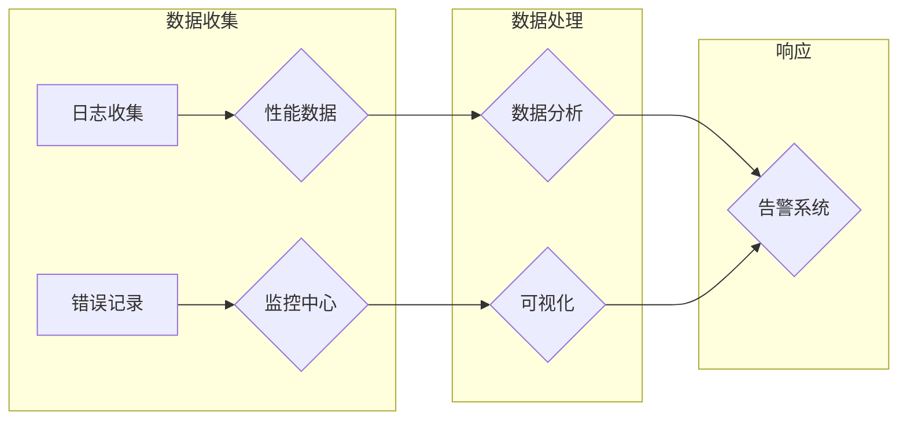

> 关键词：LangChain, 编程，应用监控，日志分析，性能监控，错误追踪，可视化，自动化，告警系统

# 【LangChain编程：从入门到实践】应用监控

随着LangChain编程的兴起，构建复杂、交互式的应用程序变得更加便捷。然而，应用程序的运行状态和性能监控同样至关重要，它帮助开发者及时发现问题、优化性能，并保障用户体验。本文将深入探讨LangChain编程中的应用监控，从入门到实践，带你了解如何构建高效、可靠的应用监控系统。

## 1. 背景介绍

### 1.1 LangChain简介

LangChain是一种基于自然语言处理（NLP）技术的编程框架，它允许开发者使用自然语言描述代码行为，而不是传统的编程语言。这种编程范式极大地降低了代码开发的门槛，使得非技术背景的用户也能够参与到软件开发过程中。

### 1.2 应用监控的重要性

应用程序的监控是确保其稳定运行和良好用户体验的关键。通过监控，开发者可以：

- 及时发现和解决问题，减少系统故障时间。
- 分析应用程序的性能，优化资源使用。
- 收集用户行为数据，改进产品设计和功能。

### 1.3 监控的挑战

随着应用程序的复杂性和规模的增长，监控也面临着新的挑战，包括：

- 数据量庞大，处理和分析数据需要高效的方法。
- 需要跨多个系统和平台进行监控。
- 监控数据可视化需要直观易用。
- 监控系统本身也需要高效和稳定。

## 2. 核心概念与联系

### 2.1 监控核心概念

- **日志收集**：从应用程序中收集运行日志。
- **性能监控**：监控应用程序的响应时间和资源使用情况。
- **错误追踪**：追踪和记录应用程序中的错误和异常。
- **可视化**：将监控数据以图表和仪表板的形式展示。
- **告警系统**：在检测到异常时自动通知开发者。

### 2.2 监控架构图



## 3. 核心算法原理 & 具体操作步骤

### 3.1 算法原理概述

应用监控的核心算法主要包括日志分析、性能监控和错误追踪。以下是对这些算法的概述：

- **日志分析**：使用模式识别和自然语言处理技术分析日志数据，提取关键信息。
- **性能监控**：通过监控系统的性能指标，如CPU、内存、网络等，评估系统健康状况。
- **错误追踪**：使用堆栈跟踪和错误报告分析系统中的异常和错误。

### 3.2 算法步骤详解

#### 3.2.1 日志分析

1. **数据采集**：从应用程序服务器、数据库和其他系统组件中收集日志数据。
2. **数据清洗**：过滤和清理无用的日志信息，确保数据质量。
3. **模式识别**：使用NLP技术识别日志中的模式和信息。
4. **可视化**：将分析结果以图表或仪表板的形式展示。

#### 3.2.2 性能监控

1. **指标收集**：收集CPU、内存、网络等性能指标。
2. **阈值设置**：根据历史数据和业务需求设置阈值。
3. **异常检测**：实时监测指标，当指标超出阈值时触发告警。
4. **分析**：分析性能数据，找出性能瓶颈。

#### 3.2.3 错误追踪

1. **错误报告**：收集应用程序中的错误报告。
2. **堆栈跟踪**：分析堆栈跟踪信息，定位错误发生位置。
3. **错误分类**：根据错误类型和严重程度对错误进行分类。
4. **修复建议**：根据错误分析结果提出修复建议。

### 3.3 算法优缺点

#### 3.3.1 日志分析

- **优点**：能够提供详细的系统运行信息，有助于问题诊断。
- **缺点**：日志数据量大，分析过程复杂。

#### 3.3.2 性能监控

- **优点**：实时监测系统性能，提前发现潜在问题。
- **缺点**：需要收集和处理大量性能数据。

#### 3.3.3 错误追踪

- **优点**：能够快速定位错误，提高问题修复效率。
- **缺点**：错误信息可能不完整，分析难度大。

### 3.4 算法应用领域

这些算法在以下领域有广泛的应用：

- **Web应用程序**：监控用户访问、错误和性能。
- **移动应用程序**：监控用户行为、电池消耗和网络使用情况。
- **云计算平台**：监控虚拟机性能和资源使用情况。
- **物联网（IoT）**：监控设备状态和性能。

## 4. 数学模型和公式 & 详细讲解 & 举例说明

### 4.1 数学模型构建

应用监控中的数学模型主要包括：

- **时间序列分析**：用于分析随时间变化的性能数据。
- **机器学习**：用于预测系统行为和识别异常模式。

### 4.2 公式推导过程

以下是一个时间序列分析的例子：

$$
y_t = \alpha y_{t-1} + (1 - \alpha) u_t
$$

其中，$y_t$ 是当前时间点的数据，$\alpha$ 是平滑系数，$u_t$ 是当前时间点的扰动。

### 4.3 案例分析与讲解

假设我们有一个Web应用程序，需要监控其响应时间。我们可以使用以下公式来计算移动平均：

$$
\bar{y}_n = \frac{1}{n} \sum_{i=1}^n y_i
$$

其中，$y_i$ 是连续n个时间点的响应时间。

## 5. 项目实践：代码实例和详细解释说明

### 5.1 开发环境搭建

为了进行应用监控实践，我们需要以下开发环境：

- Python 3.8+
- Docker
- Prometheus
- Grafana

### 5.2 源代码详细实现

以下是一个使用Prometheus和Grafana监控Web应用程序响应时间的简单示例：

```python
from flask import Flask, request, jsonify
from prometheus_client import start_http_server, Summary

app = Flask(__name__)

# 创建Prometheus监控指标
request_summary = Summary('web_server_request_time_seconds', 'HTTP request latency')

@app.route('/')
@request_summary.time()
def home():
    return jsonify({"message": "Hello, World!"})

if __name__ == '__main__':
    # 启动Prometheus HTTP服务器
    start_http_server(8000)
    # 运行Flask应用
    app.run(port=8000)
```

### 5.3 代码解读与分析

这段代码定义了一个简单的Flask Web应用程序，并使用Prometheus客户端来监控HTTP请求的响应时间。`Summary` 函数创建了一个名为 `web_server_request_time_seconds` 的监控指标，用于记录每个请求的响应时间。

### 5.4 运行结果展示

通过运行上述代码，并访问 `http://localhost:8000/`，我们可以使用Grafana查看监控数据：

- 在Grafana中创建一个仪表板，添加 `web_server_request_time_seconds` 指标，并设置适当的查询和仪表板布局。
- Grafana将自动显示请求响应时间的分布图和统计数据。

## 6. 实际应用场景

### 6.1 Web应用程序监控

对于Web应用程序，监控响应时间、错误率和用户访问量等指标至关重要。

### 6.2 移动应用程序监控

移动应用程序监控需要关注用户行为、电池消耗和网络使用情况。

### 6.3 云计算平台监控

云计算平台监控需要关注虚拟机性能、资源使用情况和网络流量。

### 6.4 物联网（IoT）监控

物联网设备监控需要关注设备状态、性能和通信质量。

## 7. 工具和资源推荐

### 7.1 学习资源推荐

- Prometheus官方文档：https://prometheus.io/docs
- Grafana官方文档：https://grafana.com/docs
- Python Prometheus客户端：https://github.com/prometheus-client/python

### 7.2 开发工具推荐

- Docker：https://www.docker.com
- Prometheus：https://prometheus.io/download
- Grafana：https://grafana.com/download

### 7.3 相关论文推荐

- **"A Scalable Monitoring System for Internet Services"**：介绍了一种用于互联网服务的可扩展监控系统。
- **"The Prometheus Monitoring and Alerting System: Observability at Scale"**：介绍了Prometheus监控系统。

## 8. 总结：未来发展趋势与挑战

### 8.1 研究成果总结

应用监控技术已经取得了显著进展，包括监控工具的完善、数据分析方法的改进以及可视化技术的提升。

### 8.2 未来发展趋势

- **智能化监控**：利用机器学习技术自动识别异常模式。
- **自动化响应**：在检测到异常时自动触发修复措施。
- **多维度监控**：结合多种监控指标，提供更全面的系统视图。

### 8.3 面临的挑战

- **数据隐私**：监控数据可能包含敏感信息，需要确保数据安全。
- **复杂性**：随着系统规模的扩大，监控变得更加复杂。
- **实时性**：需要提高监控数据的实时性，以快速响应异常。

### 8.4 研究展望

未来，应用监控技术将继续向智能化、自动化和全面化方向发展，为构建稳定、可靠、高效的应用程序提供有力支持。

## 9. 附录：常见问题与解答

**Q1：应用监控的主要挑战是什么？**

A1：应用监控的主要挑战包括数据隐私、系统复杂性和实时性要求。

**Q2：如何选择合适的监控工具？**

A2：选择监控工具时，需要考虑以下因素：功能、易用性、可扩展性、社区支持和成本。

**Q3：如何确保监控数据的准确性？**

A3：确保监控数据准确性的关键在于数据采集、处理和分析的准确性。

**Q4：监控数据可以用于哪些方面？**

A4：监控数据可以用于性能优化、问题诊断、容量规划和业务分析。

---

作者：禅与计算机程序设计艺术 / Zen and the Art of Computer Programming