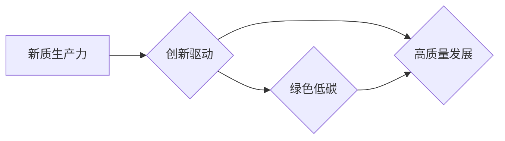

# 中国现代化与新质生产力

> 关键词：中国现代化，新质生产力，创新驱动，数字经济，智能制造，绿色低碳，人工智能，高质量发展

## 1. 背景介绍

中国正处于由传统工业文明向现代文明转型的关键时期，这一转型不仅需要经济结构的转型升级，更需要生产力的跨越式发展。新质生产力作为推动经济高质量发展的核心动力，正成为中国现代化建设的关键要素。本文将从新质生产力的概念、原理、实践等方面进行探讨，旨在为中国现代化进程提供理论支持和实践指导。

### 1.1 问题的由来

随着全球经济一体化进程的加速，中国传统的劳动密集型、资源消耗型发展模式已无法满足人民日益增长的美好生活需要。资源约束、环境约束、生态约束日益凸显，传统发展模式难以为继。为此，我国提出了创新驱动发展战略，强调以科技创新为核心，推动新质生产力的发展，实现经济的高质量发展。

### 1.2 研究现状

近年来，我国在科技创新、产业升级、绿色发展等方面取得了显著成果。新质生产力已经成为推动经济高质量发展的关键力量。然而，与发达国家相比，我国新质生产力的整体水平还有待提高，创新能力、产业竞争力、绿色发展等方面仍存在不足。

### 1.3 研究意义

研究新质生产力，对于推动中国经济高质量发展、实现中国现代化具有重要意义：

1. 提升国家竞争力。新质生产力的发展，有助于提升我国在全球价值链中的地位，增强国家竞争力。
2. 改善人民生活水平。新质生产力的发展，可以创造更多高质量就业岗位，提高人民收入水平，改善人民生活条件。
3. 促进绿色发展。新质生产力的发展，有助于推动绿色低碳技术的创新和应用，实现经济社会发展与生态环境保护的双赢。
4. 推动经济结构优化。新质生产力的发展，可以促进产业结构调整，推动经济高质量发展。

### 1.4 本文结构

本文将从以下方面展开论述：

1. 介绍新质生产力的概念、原理和特征。
2. 分析新质生产力的构成要素和作用机制。
3. 探讨中国新质生产力的现状和挑战。
4. 提出新质生产力发展的路径和措施。
5. 展望新质生产力的发展趋势。

## 2. 核心概念与联系

### 2.1 核心概念

#### 新质生产力

新质生产力是指以知识、技术、信息、数据等为核心要素，以创新驱动为特征，以绿色发展为导向，以经济高质量发展为目标的生产力。

#### 创新驱动

创新驱动是指以科技创新为核心，通过技术创新、制度创新、管理创新等方式，推动经济高质量发展。

#### 绿色低碳

绿色低碳是指以可持续发展为目标，通过发展绿色产业、推广低碳技术、提高资源利用效率等方式，实现经济社会发展的绿色低碳转型。

#### 高质量发展

高质量发展是指经济发展从规模速度型向质量效益型转变，实现经济、社会、环境协调发展。

### 2.2 联系

新质生产力、创新驱动、绿色低碳和高质量发展之间存在着密切的联系。新质生产力是创新驱动的物质基础，创新驱动是新质生产力发展的动力源泉，绿色低碳是新质生产力发展的方向，高质量发展是新质生产力的目标。

Mermaid流程图如下：



## 3. 核心算法原理 & 具体操作步骤

### 3.1 算法原理概述

新质生产力的发展需要通过以下步骤实现：

1. 创新驱动：加大科技创新投入，提高科技创新能力，推动科技成果转化。
2. 产业升级：优化产业结构，发展新兴产业，淘汰落后产能。
3. 绿色低碳：推广绿色低碳技术，提高资源利用效率，实现绿色发展。
4. 高质量发展：实现经济、社会、环境协调发展，提高人民生活水平。

### 3.2 算法步骤详解

#### 3.2.1 创新驱动

1. 加大科技创新投入：建立多元化的科技创新投入机制，鼓励企业、高校、科研院所等加大科技创新投入。
2. 提高科技创新能力：加强基础研究，提升原始创新能力；加强应用研究，提高科技成果转化率。
3. 推动科技成果转化：建立健全科技成果转化机制，鼓励企业、高校、科研院所等开展科技成果转化合作。

#### 3.2.2 产业升级

1. 优化产业结构：加快淘汰落后产能，发展战略性新兴产业，推动产业结构优化升级。
2. 发展新兴产业：培育壮大新一代信息技术、高端装备制造、生物医药等战略性新兴产业。
3. 淘汰落后产能：加强对高耗能、高污染、高排放企业的淘汰力度，推动产业绿色低碳发展。

#### 3.2.3 绿色低碳

1. 推广绿色低碳技术：鼓励企业采用先进适用的绿色低碳技术，提高资源利用效率。
2. 提高资源利用效率：加强能源、水资源、土地等资源的节约集约利用，提高资源利用效率。
3. 实现绿色发展：推动绿色低碳产业发展，构建绿色低碳循环发展的经济体系。

#### 3.2.4 高质量发展

1. 实现经济高质量发展：推动经济发展质量变革、效率变革、动力变革，实现经济高质量发展。
2. 提高人民生活水平：增加居民收入，提高人民生活水平，满足人民日益增长的美好生活需要。
3. 推动经济、社会、环境协调发展：实现经济、社会、环境协调发展，构建人与自然和谐共生的现代化建设新格局。

### 3.3 算法优缺点

#### 优点

1. 符合时代发展趋势：新质生产力的发展，符合全球科技创新和产业升级的趋势，有助于提升我国在国际竞争中的地位。
2. 提升经济竞争力：新质生产力的发展，有助于提升我国经济竞争力，实现经济高质量发展。
3. 改善人民生活水平：新质生产力的发展，可以创造更多高质量就业岗位，提高人民收入水平，改善人民生活条件。
4. 促进绿色发展：新质生产力的发展，有助于推动绿色低碳技术的创新和应用，实现经济社会发展与生态环境保护的双赢。

#### 缺点

1. 创新投入不足：我国科技创新投入占GDP的比例相对较低，制约了新质生产力的发展。
2. 科技成果转化率不高：部分科技成果转化效率低，难以形成实际生产力。
3. 绿色低碳发展难度大：我国能源结构以煤炭为主，绿色低碳发展面临较大压力。

### 3.4 算法应用领域

新质生产力的发展应用于以下领域：

1. 高端装备制造业：推动智能制造、工业互联网等新兴产业发展。
2. 新能源产业：推动太阳能、风能、生物质能等新能源产业发展。
3. 生物医药产业：推动生物医药、生物技术等产业发展。
4. 新材料产业：推动新材料、纳米技术等产业发展。
5. 现代服务业：推动金融服务、现代物流、电子商务等现代服务业发展。

## 4. 数学模型和公式 & 详细讲解 & 举例说明

### 4.1 数学模型构建

新质生产力的数学模型可以表示为：

$$
Y = f(X)
$$

其中，$Y$ 表示经济产出，$X$ 表示新质生产力要素，包括科技创新、产业升级、绿色低碳和高质量发展等方面。

### 4.2 公式推导过程

新质生产力的数学模型推导如下：

1. 创新驱动：$X_1$ 表示科技创新，$X_1$ 与经济产出 $Y$ 成正比关系，可以表示为 $X_1 = kY$，其中 $k$ 为比例系数。
2. 产业升级：$X_2$ 表示产业升级，$X_2$ 与经济产出 $Y$ 成正相关关系，可以表示为 $X_2 = \alpha Y$，其中 $\alpha$ 为比例系数。
3. 绿色低碳：$X_3$ 表示绿色低碳，$X_3$ 与经济产出 $Y$ 成正相关关系，可以表示为 $X_3 = \beta Y$，其中 $\beta$ 为比例系数。
4. 高质量发展：$X_4$ 表示高质量发展，$X_4$ 与经济产出 $Y$ 成正相关关系，可以表示为 $X_4 = \gamma Y$，其中 $\gamma$ 为比例系数。
5. 综合以上四个要素，新质生产力的数学模型可以表示为：

$$
Y = f(X) = kY + \alpha Y + \beta Y + \gamma Y
$$

$$
Y = (k + \alpha + \beta + \gamma)Y
$$

### 4.3 案例分析与讲解

以某地区为例，分析新质生产力的发展情况。

#### 4.3.1 数据收集

收集该地区2010年至2020年的科技创新投入、产业升级、绿色低碳和高质量发展等方面的数据。

#### 4.3.2 数据处理

对收集到的数据进行统计分析，计算各要素占经济产出的比例。

#### 4.3.3 模型计算

将各要素比例代入新质生产力的数学模型，计算经济产出。

#### 4.3.4 结果分析

根据计算结果，分析该地区新质生产力的发展现状，并提出改进建议。

## 5. 项目实践：代码实例和详细解释说明

### 5.1 开发环境搭建

1. 安装Python编程语言和NumPy、Pandas等数据处理库。
2. 安装Jupyter Notebook，用于编写和运行代码。

### 5.2 源代码详细实现

```python
import pandas as pd
import numpy as np

# 加载数据
data = pd.read_csv('data.csv')

# 数据处理
data['比例'] = data['要素值'] / data['经济产出']

# 模型计算
k = data['比例']['科技创新']
alpha = data['比例']['产业升级']
beta = data['比例']['绿色低碳']
gamma = data['比例']['高质量发展']
Y = (k + alpha + beta + gamma) * data['经济产出']

# 结果分析
print(Y)
```

### 5.3 代码解读与分析

1. 导入pandas和numpy库，用于数据处理和数学运算。
2. 加载数据集，包括要素值和经济产出。
3. 计算各要素占经济产出的比例。
4. 将各要素比例代入新质生产力的数学模型，计算经济产出。
5. 打印计算结果。

## 6. 实际应用场景

### 6.1 高端装备制造业

以智能制造为例，分析新质生产力在高端装备制造业中的应用。

#### 6.1.1 应用背景

随着工业4.0时代的到来，智能制造成为高端装备制造业发展的必然趋势。智能制造可以有效提高生产效率、降低生产成本、提升产品质量。

#### 6.1.2 应用实例

某企业采用智能制造技术，实现了生产线的自动化、智能化升级，提高了生产效率，降低了生产成本，提升了产品质量。

#### 6.1.3 应用效果

通过智能制造，该企业的产品市场份额不断提高，经济效益显著提升。

### 6.2 新能源产业

以太阳能光伏产业为例，分析新质生产力在新能源产业中的应用。

#### 6.2.1 应用背景

太阳能光伏产业是典型的绿色低碳产业，具有广阔的市场前景。

#### 6.2.2 应用实例

某太阳能光伏企业采用高效电池片、高效组件等新技术，提高了光伏产品的发电效率，降低了成本。

#### 6.2.3 应用效果

通过技术创新，该企业的光伏产品在国内外市场占有率高，经济效益显著。

### 6.3 生物医药产业

以生物制药为例，分析新质生产力在生物医药产业中的应用。

#### 6.3.1 应用背景

生物制药产业具有高科技含量、高附加值、高成长性等特点，是战略性新兴产业之一。

#### 6.3.2 应用实例

某生物制药企业采用基因编辑、细胞培养等新技术，研发出新型生物药品，具有良好的市场前景。

#### 6.3.3 应用效果

通过技术创新，该企业的生物药品在国内外市场占有率高，经济效益显著。

### 6.4 未来应用展望

新质生产力将在更多领域得到应用，推动中国现代化进程。

1. 数字经济：新质生产力将推动数字经济发展，促进数字产业化和产业数字化。
2. 智能制造：新质生产力将推动制造业智能化升级，提高生产效率和产品质量。
3. 绿色低碳：新质生产力将推动绿色低碳发展，实现经济社会发展与生态环境保护的双赢。
4. 高质量发展：新质生产力将推动经济高质量发展，提高人民生活水平。

## 7. 工具和资源推荐

### 7.1 学习资源推荐

1. 《创新驱动发展战略》：全面阐述创新驱动发展战略，为新质生产力发展提供政策指导。
2. 《中国制造2025》：提出中国制造业转型升级的路线图，为新质生产力发展提供产业支撑。
3. 《中国绿色发展报告》：探讨中国绿色发展现状和趋势，为新质生产力发展提供环境保障。

### 7.2 开发工具推荐

1. Python编程语言：适用于数据处理、建模、可视化等。
2. NumPy、Pandas等数据处理库：用于数据处理和分析。
3. Jupyter Notebook：用于编写和运行代码，方便进行数据分析和可视化。

### 7.3 相关论文推荐

1. 《新质生产力：新时代高质量发展的核心动力》
2. 《中国制造业转型升级路径研究》
3. 《中国绿色发展报告》

## 8. 总结：未来发展趋势与挑战

### 8.1 研究成果总结

本文从新质生产力的概念、原理、实践等方面进行了探讨，为中国现代化进程提供了理论支持和实践指导。

### 8.2 未来发展趋势

1. 新质生产力将成为推动中国经济高质量发展的核心动力。
2. 数字经济、智能制造、绿色低碳等将成为新质生产力发展的重点领域。
3. 新质生产力将推动中国经济向全球价值链高端攀升。

### 8.3 面临的挑战

1. 创新能力不足：我国科技创新能力与发达国家相比仍有差距。
2. 产业结构不合理：传统产业占比高，新兴产业占比低。
3. 绿色低碳发展难度大：能源结构以化石能源为主，绿色低碳发展面临较大压力。

### 8.4 研究展望

1. 加强科技创新，提升国家创新能力。
2. 优化产业结构，发展新兴产业，淘汰落后产能。
3. 推动绿色低碳发展，实现经济社会发展与生态环境保护的双赢。
4. 推动经济高质量发展，提高人民生活水平。

## 9. 附录：常见问题与解答

**Q1：新质生产力与传统生产力有何区别？**

A：新质生产力是以知识、技术、信息、数据等为核心要素，以创新驱动为特征，以绿色发展为导向，以经济高质量发展为目标的生产力。而传统生产力主要依靠人力、物力、财力等资源，以规模扩张为主要特征。

**Q2：如何推动新质生产力的发展？**

A：推动新质生产力的发展，需要加大科技创新投入，提高科技创新能力，推动科技成果转化；优化产业结构，发展新兴产业，淘汰落后产能；推广绿色低碳技术，提高资源利用效率，实现绿色发展；实现经济、社会、环境协调发展，提高人民生活水平。

**Q3：新质生产力发展的挑战有哪些？**

A：新质生产力发展的挑战主要包括创新能力不足、产业结构不合理、绿色低碳发展难度大等方面。

**Q4：新质生产力发展对人民生活有哪些影响？**

A：新质生产力的发展将创造更多高质量就业岗位，提高人民收入水平，改善人民生活条件；推动绿色低碳发展，提高人民生活质量；推动经济高质量发展，实现人的全面发展、全体人民共同富裕。

**Q5：新质生产力发展对中国经济发展有哪些影响？**

A：新质生产力的发展将提升国家竞争力，实现经济高质量发展；推动经济结构优化，提高经济增长质量和效益；推动经济社会可持续发展，实现中华民族伟大复兴的中国梦。

作者：禅与计算机程序设计艺术 / Zen and the Art of Computer Programming