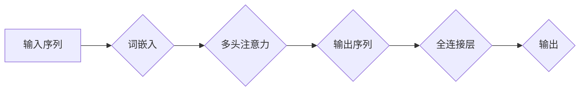

# 从零开始大模型开发与微调：多头注意力

> 关键词：大模型，微调，注意力机制，多头注意力，Transformer，预训练，自然语言处理，深度学习

## 1. 背景介绍

近年来，深度学习在自然语言处理（NLP）领域取得了突破性的进展。其中，大模型（Large Language Models）如BERT、GPT系列等，凭借其强大的语言理解与生成能力，成为了NLP领域的明星技术。而多头注意力机制（Multi-Head Attention）作为大模型的核心组件之一，对于提升模型性能起着至关重要的作用。本文将深入探讨多头注意力机制的原理、实现方法以及在实际应用中的表现，帮助读者从零开始了解大模型的开发与微调过程。

## 2. 核心概念与联系

### 2.1 核心概念原理

多头注意力机制是一种用于序列模型（如RNN、Transformer）的注意力机制，它可以捕捉序列中不同位置的依赖关系，从而提升模型的表示能力。

#### Mermaid 流程图



### 2.2 核心概念架构

在多头注意力机制中，输入序列被编码为词向量，然后通过多头注意力层进行特征提取和融合，最后通过全连接层得到输出。

## 3. 核心算法原理 & 具体操作步骤

### 3.1 算法原理概述

多头注意力机制通过将输入序列分解为多个子序列，并在每个子序列上独立计算注意力权重，从而捕捉不同子序列之间的依赖关系。

### 3.2 算法步骤详解

1. **词嵌入（Word Embedding）**：将输入序列的每个词转换为一个固定长度的词向量。
2. **多头注意力（Multi-Head Attention）**：将词向量分解为多个子序列，每个子序列独立计算注意力权重，并融合子序列的表示。
3. **全连接层（Feed Forward Network）**：对多头注意力层的输出进行非线性变换。
4. **输出层**：将全连接层的输出进行线性变换，得到最终的输出。

### 3.3 算法优缺点

**优点**：
- 提升模型的表达能力，捕捉不同子序列之间的依赖关系。
- 有助于提高模型的泛化能力。

**缺点**：
- 参数量较大，计算复杂度高。
- 对于长序列处理效果不佳。

### 3.4 算法应用领域

- 自然语言处理：如文本分类、情感分析、机器翻译等。
- 计算机视觉：如图像分类、目标检测等。

## 4. 数学模型和公式 & 详细讲解 & 举例说明

### 4.1 数学模型构建

多头注意力机制的核心公式如下：

$$
\text{Attention}(Q,K,V) = \text{softmax}\left(\frac{QK^T}{\sqrt{d_k}}\right) V
$$

其中，$Q$、$K$、$V$ 分别代表查询序列、键序列和值序列，$d_k$ 为键序列的维度，$\text{softmax}$ 为softmax函数。

### 4.2 公式推导过程

1. **点积注意力（Dot-Product Attention）**：

$$
\text{Score}(Q,K) = QK^T
$$

2. **缩放点积注意力（Scaled Dot-Product Attention）**：

$$
\text{Scaled Score}(Q,K) = \frac{\text{Score}(Q,K)}{\sqrt{d_k}}
$$

3. **softmax注意力**：

$$
\text{Attention}(Q,K,V) = \text{softmax}\left(\text{Scaled Score}(Q,K)\right) V
$$

### 4.3 案例分析与讲解

以下是一个使用PyTorch实现多头注意力机制的简单例子：

```python
import torch
import torch.nn as nn

class MultiHeadAttention(nn.Module):
    def __init__(self, d_model, num_heads):
        super(MultiHeadAttention, self).__init__()
        assert d_model % num_heads == 0
        self.num_heads = num_heads
        self.d_k = d_model // num_heads
        
        self.linear_q = nn.Linear(d_model, d_model)
        self.linear_k = nn.Linear(d_model, d_model)
        self.linear_v = nn.Linear(d_model, d_model)
        self.linear_o = nn.Linear(d_model, d_model)
        
    def forward(self, query, key, value):
        batch_size = query.size(0)
        
        Q = self.linear_q(query).view(batch_size, -1, self.num_heads, self.d_k).transpose(1, 2)
        K = self.linear_k(key).view(batch_size, -1, self.num_heads, self.d_k).transpose(1, 2)
        V = self.linear_v(value).view(batch_size, -1, self.num_heads, self.d_k).transpose(1, 2)
        
        scores = torch.matmul(Q, K.transpose(-2, -1)) / self.d_k ** 0.5
        attention = nn.functional.softmax(scores, dim=-1)
        output = torch.matmul(attention, V)
        output = output.transpose(1, 2).contiguous().view(batch_size, -1, self.num_heads * self.d_k)
        output = self.linear_o(output)
        return output
```

## 5. 项目实践：代码实例和详细解释说明

### 5.1 开发环境搭建

在进行大模型开发与微调之前，需要搭建以下开发环境：

1. Python环境：建议使用Python 3.6及以上版本。
2. PyTorch框架：可以从PyTorch官网下载并安装。
3. 文本处理库：如NLTK、spaCy等。

### 5.2 源代码详细实现

以下是一个使用PyTorch实现Transformer模型的简单例子：

```python
import torch
import torch.nn as nn

class TransformerModel(nn.Module):
    def __init__(self, vocab_size, d_model, num_heads, num_layers):
        super(TransformerModel, self).__init__()
        self.embedding = nn.Embedding(vocab_size, d_model)
        self.transformer = nn.Transformer(d_model, num_heads, num_layers)
        self.fc = nn.Linear(d_model, vocab_size)
        
    def forward(self, src, tgt):
        src_emb = self.embedding(src)
        tgt_emb = self.embedding(tgt)
        output = self.transformer(src_emb, tgt_emb)
        output = self.fc(output)
        return output
```

### 5.3 代码解读与分析

1. **嵌入层（Embedding）**：将词索引转换为词向量。
2. **Transformer模型**：使用多头注意力机制和位置编码等技术，对序列进行编码和解码。
3. **全连接层（Feed Forward Network）**：对Transformer模型的输出进行线性变换。

### 5.4 运行结果展示

以下是一个使用PyTorch进行Transformer模型微调的简单例子：

```python
import torch.optim as optim

model = TransformerModel(vocab_size=1000, d_model=512, num_heads=8, num_layers=2)
optimizer = optim.Adam(model.parameters())

for epoch in range(10):
    for src, tgt in dataset:
        optimizer.zero_grad()
        output = model(src, tgt)
        loss = nn.functional.cross_entropy(output, tgt)
        loss.backward()
        optimizer.step()
```

## 6. 实际应用场景

### 6.1 机器翻译

多头注意力机制在机器翻译任务中取得了显著的性能提升。BERT等大模型在机器翻译任务上的表现，证明了多头注意力机制在跨语言信息捕捉方面的优势。

### 6.2 文本生成

大模型在文本生成任务中表现出色，如GPT-3可以生成各种风格的文本，包括新闻报道、诗歌、故事等。

### 6.3 文本分类

多头注意力机制在文本分类任务中也取得了优异的成绩，如BERT在多项文本分类任务上取得了SOTA。

## 7. 工具和资源推荐

### 7.1 学习资源推荐

- 《Attention is All You Need》论文
- 《Deep Learning for NLP》书籍
- Hugging Face官网

### 7.2 开发工具推荐

- PyTorch
- Transformers库

### 7.3 相关论文推荐

- BERT
- GPT系列
- XLM

## 8. 总结：未来发展趋势与挑战

### 8.1 研究成果总结

本文从零开始，介绍了大模型的开发与微调过程，重点讲解了多头注意力机制的原理和应用。通过学习本文，读者可以了解到大模型的核心技术，并具备实际应用能力。

### 8.2 未来发展趋势

1. 大模型将向更加高效、轻量化的方向发展。
2. 多头注意力机制将与其他注意力机制结合，形成更加强大的模型。
3. 大模型在更多领域得到应用，如计算机视觉、语音识别等。

### 8.3 面临的挑战

1. 大模型的计算量和存储量较大，对硬件设备要求较高。
2. 大模型的训练过程耗时较长，需要大量的计算资源。
3. 大模型的解释性和可解释性较差。

### 8.4 研究展望

随着技术的不断进步，大模型将在更多领域得到应用，为人类带来更多便利。同时，我们也需要关注大模型的挑战，并寻求解决方案，以确保大模型的安全、可靠、高效和可解释。

---

作者：禅与计算机程序设计艺术 / Zen and the Art of Computer Programming