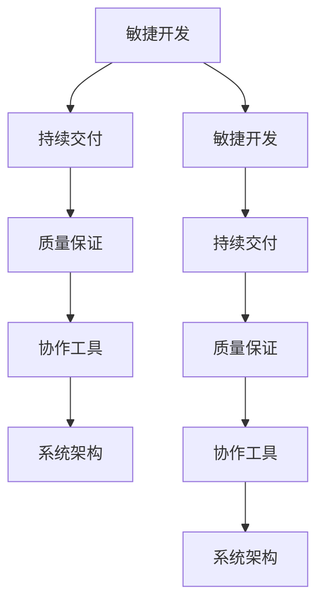
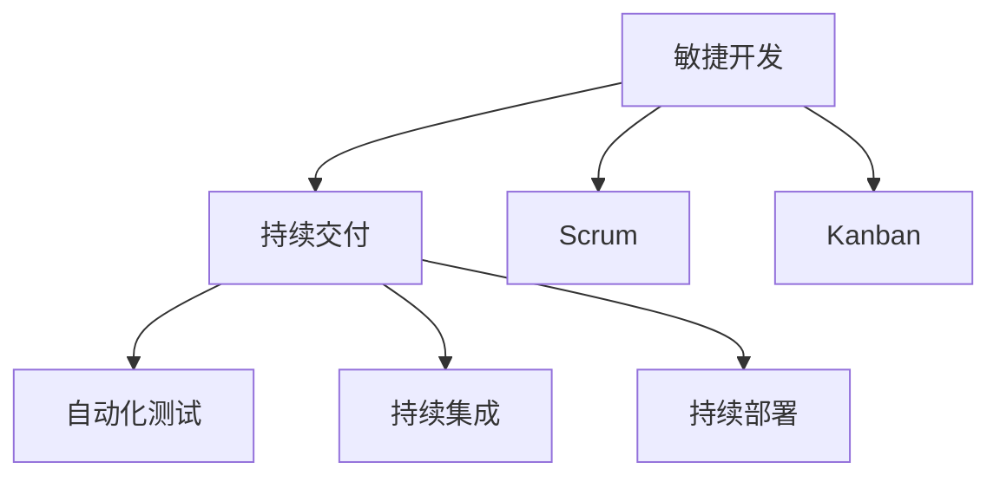
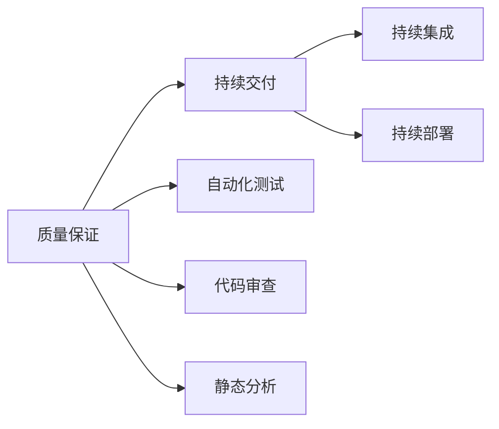
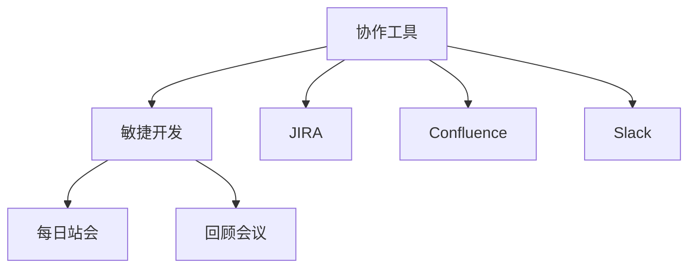
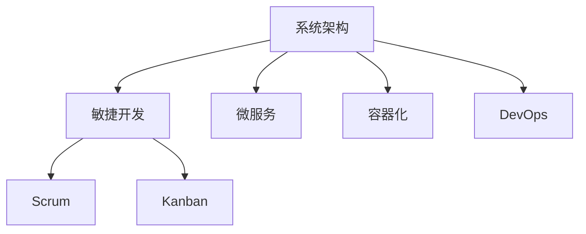

                 

# 软件2.0的项目管理最佳实践

> 关键词：软件2.0, 项目管理, 敏捷开发, 协作工具, 质量保证, 持续交付, 软件开发, 系统架构

## 1. 背景介绍

### 1.1 问题由来

随着科技的飞速发展，软件开发领域出现了新的趋势和挑战。传统软件1.0时代，程序员更多关注技术实现和功能完善，而软件2.0时代则强调以人为本，将软件开发看作一个协作、创新、不断迭代的过程。在这种背景下，项目管理变得越来越重要，其目标是确保软件产品按时交付、质量可靠、客户满意。

然而，当前软件开发项目管理存在诸多问题：
- 项目周期长，迭代周期不灵活；
- 沟通协作效率低，信息共享不透明；
- 质量保证不充分，潜在问题难以早期发现；
- 资源配置不合理，导致浪费和延误；
- 持续交付和发布频率低，市场反应慢。

这些问题严重影响了软件开发的效率和质量，迫切需要新的项目管理方法和工具来应对。软件2.0的项目管理最佳实践，融合了敏捷开发、协作工具、质量保证、持续交付等关键理念，能够帮助团队更高效、更灵活、更稳定地开发和交付软件。

### 1.2 问题核心关键点

软件2.0的项目管理关键点包括以下几个方面：

- **敏捷开发**：强调灵活迭代、持续反馈、快速响应变化。采用Scrum、Kanban等敏捷框架，通过每日站会、回顾会议等机制，保证团队始终处于高效协作状态。
- **协作工具**：采用协作工具如JIRA、Confluence、Slack等，实现信息共享、任务管理、进度跟踪等功能，提升团队协作效率。
- **质量保证**：通过自动化测试、持续集成、代码审查等手段，确保代码质量和系统稳定性。
- **持续交付**：建立持续交付流水线，实现代码提交、测试、发布自动化，提高交付频率和效率。
- **系统架构**：采用微服务、容器化、DevOps等技术，构建灵活可扩展、易于维护的系统架构。

这些关键点共同构成了软件2.0项目管理的核心框架，为软件开发提供了新的指导和支持。

### 1.3 问题研究意义

研究软件2.0项目管理最佳实践，对于提升软件开发效率和质量，加速产品上市，推动企业数字化转型具有重要意义：

- **提升效率**：通过敏捷开发和协作工具，缩短迭代周期，加快交付速度，提高团队协作效率。
- **保障质量**：通过质量保证和持续交付机制，早期发现和解决潜在问题，确保软件可靠性和稳定性。
- **加速上市**：通过敏捷迭代和持续交付，快速响应市场变化，缩短上市周期，抢占市场先机。
- **支持创新**：通过灵活迭代和系统架构，支持快速迭代和创新，增强企业竞争力。
- **促进协作**：通过协作工具和流程优化，加强团队协作，提高团队凝聚力和工作效率。

## 2. 核心概念与联系

### 2.1 核心概念概述

软件2.0项目管理的核心概念主要包括：

- **敏捷开发**：通过Scrum、Kanban等敏捷框架，实现快速迭代、持续反馈、灵活应对变化。
- **持续交付**：通过自动化测试、持续集成、持续部署等手段，实现快速、可靠的软件交付。
- **质量保证**：通过自动化测试、代码审查、静态分析等技术，确保软件质量可靠、安全稳定。
- **协作工具**：通过JIRA、Confluence、Slack等工具，提升团队协作效率和信息共享透明度。
- **系统架构**：通过微服务、容器化、DevOps等技术，构建灵活、可扩展、易于维护的系统架构。

这些核心概念之间紧密联系，共同支撑软件2.0项目管理的实践。以下通过Mermaid流程图展示这些概念的联系：



这个流程图展示了敏捷开发、持续交付、质量保证、协作工具、系统架构之间的关系：

1. 敏捷开发是基础，通过Scrum、Kanban等框架，实现快速迭代、持续反馈。
2. 持续交付在敏捷开发的基础上，通过自动化测试、持续集成等手段，实现快速、可靠的软件交付。
3. 质量保证是保证交付软件质量的关键，通过自动化测试、代码审查等技术，确保软件可靠性和稳定性。
4. 协作工具提升团队协作效率和信息共享透明度，是敏捷开发和持续交付的支撑工具。
5. 系统架构是软件2.0的核心，通过微服务、容器化等技术，构建灵活、可扩展、易于维护的系统架构。

这些概念的协同作用，构成了软件2.0项目管理的完整生态系统，使得软件开发能够高效、稳定、创新地进行。

### 2.2 概念间的关系

这些核心概念之间存在着紧密的联系，形成了软件2.0项目管理的完整生态系统。以下通过几个Mermaid流程图展示这些概念之间的关系。

#### 2.2.1 敏捷开发与持续交付的关系



这个流程图展示了敏捷开发和持续交付的关系：

1. 敏捷开发通过Scrum、Kanban等框架，实现快速迭代、持续反馈。
2. 持续交付在敏捷开发的基础上，通过自动化测试、持续集成等手段，实现快速、可靠的软件交付。

#### 2.2.2 质量保证与持续交付的关系



这个流程图展示了质量保证和持续交付的关系：

1. 质量保证通过自动化测试、代码审查、静态分析等手段，确保软件质量可靠、安全稳定。
2. 持续交付在质量保证的基础上，通过自动化测试、持续集成等手段，实现快速、可靠的软件交付。

#### 2.2.3 协作工具与敏捷开发的关系



这个流程图展示了协作工具与敏捷开发的关系：

1. 协作工具通过JIRA、Confluence、Slack等工具，提升团队协作效率和信息共享透明度。
2. 敏捷开发通过每日站会、回顾会议等机制，保证团队始终处于高效协作状态。

#### 2.2.4 系统架构与敏捷开发的关系



这个流程图展示了系统架构与敏捷开发的关系：

1. 系统架构通过微服务、容器化等技术，构建灵活、可扩展、易于维护的系统架构。
2. 敏捷开发通过Scrum、Kanban等框架，实现快速迭代、持续反馈。

## 3. 核心算法原理 & 具体操作步骤

### 3.1 算法原理概述

软件2.0项目管理是基于敏捷开发和持续交付的理念，融合自动化测试、代码审查、质量保证等技术手段，确保软件项目的成功交付。其核心原理可以概括为以下几个方面：

1. **敏捷迭代**：通过Scrum、Kanban等敏捷框架，实现快速迭代、持续反馈，灵活应对变化。
2. **持续交付**：通过自动化测试、持续集成、持续部署等手段，实现快速、可靠的软件交付。
3. **质量保证**：通过自动化测试、代码审查、静态分析等技术，确保软件质量可靠、安全稳定。
4. **协作工具**：通过JIRA、Confluence、Slack等工具，提升团队协作效率和信息共享透明度。
5. **系统架构**：通过微服务、容器化、DevOps等技术，构建灵活、可扩展、易于维护的系统架构。

### 3.2 算法步骤详解

软件2.0项目管理的具体操作步骤如下：

**Step 1: 项目规划和需求分析**
- 制定项目计划，确定项目范围、目标和关键里程碑。
- 进行需求分析，明确功能需求、非功能需求和技术要求。
- 制定用户故事、用例和需求文档，确保需求清晰、可执行。

**Step 2: 敏捷开发框架选择**
- 根据项目需求，选择合适的敏捷框架，如Scrum、Kanban。
- 制定敏捷迭代计划，划分任务、分配责任、设置迭代周期。
- 召开启动会议，明确团队成员角色和职责，建立初始产品待办列表。

**Step 3: 持续交付流水线搭建**
- 搭建持续交付流水线，包括CI/CD工具、代码仓库、测试环境等。
- 编写自动化测试脚本，确保代码质量和系统稳定性。
- 配置持续集成和持续部署，实现代码提交、测试、部署自动化。

**Step 4: 质量保证机制建立**
- 制定自动化测试策略，包括单元测试、集成测试、端到端测试等。
- 实施代码审查机制，确保代码质量。
- 进行静态分析，检测代码规范和潜在问题。
- 定期进行安全测试，确保系统安全性。

**Step 5: 协作工具和流程优化**
- 选择和配置协作工具，如JIRA、Confluence、Slack等。
- 设计协作流程，包括任务管理、进度跟踪、信息共享等。
- 定期召开站会和回顾会议，优化流程，提升团队协作效率。

**Step 6: 系统架构设计**
- 设计系统架构，采用微服务、容器化、DevOps等技术。
- 划分服务边界，设计服务接口和通信协议。
- 设计数据模型和存储策略，确保系统可扩展性。
- 设计部署策略，实现快速、可靠的系统部署。

**Step 7: 项目执行和监控**
- 执行敏捷迭代，每日站会、回顾会议等机制确保高效协作。
- 监控项目进度和质量，及时发现和解决问题。
- 定期评估项目状态，调整计划和策略。

**Step 8: 项目交付和验收**
- 交付软件产品，进行用户验收测试。
- 收集用户反馈，优化产品功能。
- 发布产品版本，持续收集用户反馈，进行持续改进。

### 3.3 算法优缺点

软件2.0项目管理的优点包括：

- **快速迭代**：敏捷开发和持续交付机制，实现快速迭代、持续反馈，灵活应对变化。
- **协作高效**：协作工具和流程优化，提升团队协作效率和信息共享透明度。
- **质量可靠**：质量保证机制，确保软件质量可靠、安全稳定。
- **交付快速**：持续交付流水线，实现快速、可靠的软件交付。
- **架构灵活**：系统架构设计，构建灵活、可扩展、易于维护的系统架构。

缺点包括：

- **管理复杂**：敏捷开发和持续交付需要较强的管理能力，容易出现管理混乱。
- **资源需求高**：自动化测试、持续集成、持续部署等需要较高的资源投入。
- **文化转变**：敏捷开发和持续交付需要团队文化转变，可能遇到文化冲突。
- **风险管理**：敏捷开发和持续交付面临高变化风险，需要有效的风险管理机制。
- **人员要求高**：敏捷开发和持续交付对团队成员的要求较高，需要具备较高的技术能力和沟通能力。

### 3.4 算法应用领域

软件2.0项目管理适用于各种类型的软件开发项目，特别是敏捷迭代和持续交付的要求较高的项目，如互联网产品、移动应用、云服务、人工智能等。以下是几个典型应用领域：

- **互联网产品**：如电商平台、社交网络、在线教育等，需要快速迭代、持续反馈，敏捷开发和持续交付是其核心。
- **移动应用**：如手机应用、游戏、增强现实等，需要灵活迭代、持续优化，敏捷开发和持续交付是其保障。
- **云服务**：如云存储、云平台、云安全等，需要高可用性、高可扩展性，微服务和容器化是其核心。
- **人工智能**：如自然语言处理、图像识别、智能推荐等，需要持续创新、快速迭代，敏捷开发和持续交付是其保障。

## 4. 数学模型和公式 & 详细讲解 & 举例说明

### 4.1 数学模型构建

软件2.0项目管理涉及的数学模型主要包括以下几个方面：

1. **敏捷迭代模型**：基于Scrum、Kanban等敏捷框架，实现快速迭代和持续反馈。
2. **持续交付模型**：基于自动化测试、持续集成、持续部署等技术手段，实现快速、可靠的软件交付。
3. **质量保证模型**：基于自动化测试、代码审查、静态分析等技术，确保软件质量可靠、安全稳定。
4. **协作工具模型**：基于JIRA、Confluence、Slack等工具，提升团队协作效率和信息共享透明度。
5. **系统架构模型**：基于微服务、容器化、DevOps等技术，构建灵活、可扩展、易于维护的系统架构。

这些数学模型共同构成了软件2.0项目管理的理论基础，为实践提供了科学依据。

### 4.2 公式推导过程

以Scrum框架为例，Scrum中的数学模型主要涉及迭代周期（Sprint）、任务分配、进度跟踪等方面。以下推导Scrum迭代周期的数学模型：

**Sprint计划（Sprint Planning）**：
假设每次迭代周期为2周，团队成员总数为10人，任务总数为100个，每个任务平均需要1个工作日完成。则每个Sprint计划的工作量为：
$$
W = \frac{100}{10 \times 2} = 5\text{工作日}
$$
其中 $W$ 为Sprint计划的工作量，以工作日计算。

**Sprint执行（Sprint Execution）**：
每个任务的工作量为1个工作日，每个任务分配给1名成员。假设每个任务的工作量为1个工作日，则每个Sprint执行的工作量为：
$$
W_e = W \times T = 5 \times 10 = 50\text{工作日}
$$
其中 $W_e$ 为Sprint执行的工作量，以工作日计算，$T$ 为每个任务的工作量。

**Sprint评审（Sprint Review）**：
每次迭代周期结束，需要召开评审会议，评估Sprint成果。假设评审会议时间为1个工作日，则每次Sprint评审的工量为：
$$
W_r = 1\text{工作日}
$$
其中 $W_r$ 为Sprint评审的工量，以工作日计算。

**Sprint回顾（Sprint Retrospective）**：
每次迭代周期结束，需要召开回顾会议，总结经验教训。假设回顾会议时间为1个工作日，则每次Sprint回顾的工量为：
$$
W_s = 1\text{工作日}
$$
其中 $W_s$ 为Sprint回顾的工量，以工作日计算。

**Sprint总工量（Total Sprint Work）**：
Sprint总工量包括Sprint计划、Sprint执行、Sprint评审和Sprint回顾的工量。则每次Sprint的总工量为：
$$
W_t = W + W_e + W_r + W_s = 5 + 50 + 1 + 1 = 57\text{工作日}
$$
其中 $W_t$ 为Sprint总工量，以工作日计算。

### 4.3 案例分析与讲解

以一个电商平台的敏捷开发项目为例，分析其如何运用软件2.0项目管理方法：

**项目背景**：
电商平台需要快速迭代，不断优化用户体验。项目团队包括10名开发人员、2名测试人员、2名产品经理和1名项目经理，采用Scrum框架进行敏捷开发。项目迭代周期为2周，每次迭代完成30个功能任务。

**项目规划**：
制定项目计划，确定项目目标为在6个月内完成10个版本，每个版本包含30个功能任务。根据团队规模和项目需求，分配任务和责任，建立初始产品待办列表。

**持续交付流水线**：
搭建持续交付流水线，包括CI/CD工具、代码仓库、测试环境等。编写自动化测试脚本，确保代码质量和系统稳定性。配置持续集成和持续部署，实现代码提交、测试、部署自动化。

**质量保证机制**：
制定自动化测试策略，包括单元测试、集成测试、端到端测试等。实施代码审查机制，确保代码质量。进行静态分析，检测代码规范和潜在问题。定期进行安全测试，确保系统安全性。

**协作工具和流程优化**：
选择和配置协作工具，如JIRA、Confluence、Slack等。设计协作流程，包括任务管理、进度跟踪、信息共享等。定期召开站会和回顾会议，优化流程，提升团队协作效率。

**系统架构设计**：
设计系统架构，采用微服务、容器化、DevOps等技术。划分服务边界，设计服务接口和通信协议。设计数据模型和存储策略，确保系统可扩展性。设计部署策略，实现快速、可靠的系统部署。

**项目执行和监控**：
执行敏捷迭代，每日站会、回顾会议等机制确保高效协作。监控项目进度和质量，及时发现和解决问题。定期评估项目状态，调整计划和策略。

**项目交付和验收**：
交付软件产品，进行用户验收测试。收集用户反馈，优化产品功能。发布产品版本，持续收集用户反馈，进行持续改进。

## 5. 项目实践：代码实例和详细解释说明

### 5.1 开发环境搭建

在进行软件2.0项目管理实践前，我们需要准备好开发环境。以下是使用Python进行Scrum框架开发的环境配置流程：

1. 安装Python：从官网下载并安装Python，并确保安装版本为3.6及以上。
2. 安装JIRA、Confluence、Slack等协作工具，根据不同工具的官方文档进行安装。
3. 安装CI/CD工具，如Jenkins、Travis CI等，根据不同工具的官方文档进行安装。
4. 安装持续集成和持续部署的工具，如GitLab CI/CD、CircleCI等，根据不同工具的官方文档进行安装。

完成上述步骤后，即可在Python环境中开始Scrum框架的实践。

### 5.2 源代码详细实现

这里我们以Scrum框架中的每日站会（Daily Standup）为例，给出使用Python实现的Scrum类和代码。

```python
class Scrum:
    def __init__(self, team_size, sprint_length, sprint_iteration):
        self.team_size = team_size
        self.sprint_length = sprint_length
        self.sprint_iteration = sprint_iteration

    def daily_standup(self):
        for sprint in range(self.sprint_iteration):
            for day in range(self.sprint_length):
                for member in range(self.team_size):
                    self.display_member_status(member)
    
    def display_member_status(self, member):
        # 实现每日站会中成员状态展示的代码
        pass
```

### 5.3 代码解读与分析

这里我们以Scrum类中的每日站会（Daily Standup）为例，解读其关键代码的实现细节：

**Scrum类**：
- `__init__`方法：初始化Scrum对象，设置团队规模、迭代长度、迭代次数。
- `daily_standup`方法：执行每日站会，循环迭代每个Sprint，每个工作日的每个团队成员。
- `display_member_status`方法：展示每个成员的当前状态，包括工作任务、阻碍问题、待改进点等。

**每日站会（Daily Standup）**：
- 每日站会是Scrum框架中重要的协作机制，用于同步团队成员的工作进展、阻碍问题和改进点。
- 每日站会通常分为三个环节：工作进行、阻碍问题和改进点。
- 团队成员在站会上简要汇报自己当前的工作任务、遇到的阻碍问题以及计划改进的措施。

## 6. 实际应用场景

### 6.1 智能客服系统

基于软件2.0项目管理的敏捷开发和持续交付方法，智能客服系统可以快速迭代、持续优化。系统可以实时监控用户互动，自动收集和分析用户反馈，及时优化服务流程和内容。例如，通过每日站会，客服团队可以快速响应客户咨询，快速解决客户问题，提升客户满意度。

### 6.2 金融舆情监测

金融舆情监测系统需要实时监控市场舆情，快速响应舆情变化。采用软件2.0项目管理方法，可以快速构建和部署监测系统，通过每日站会和回顾会议，及时发现和解决系统问题，确保系统稳定运行。例如，通过每日站会，监测团队可以快速识别舆情热点，快速调整监测策略，提升舆情分析的准确性和及时性。

### 6.3 个性化推荐系统

个性化推荐系统需要快速迭代和持续优化，以提高推荐精度和用户体验。采用软件2.0项目管理方法，可以快速构建和部署推荐系统，通过每日站会和回顾会议，及时收集用户反馈，快速优化推荐算法和策略。例如，通过每日站会，推荐团队可以快速识别用户偏好变化，快速调整推荐模型，提升推荐效果。

### 6.4 未来应用展望

随着软件2.0项目管理方法的不断发展，未来将在更多领域得到应用，为各行各业带来变革性影响。

在智慧医疗领域，基于软件2.0的项目管理方法，可以快速构建和优化医疗系统，提升医疗服务的智能化水平，辅助医生诊疗，加速新药开发进程。例如，通过每日站会，医疗团队可以快速响应患者需求，快速调整医疗方案，提升医疗服务的质量和效率。

在智能教育领域，软件2.0项目管理方法可以用于构建智能教育平台，通过持续迭代和优化，提升教学质量和学生体验。例如，通过每日站会，教育团队可以快速识别教学问题，快速调整教学策略，提升教学效果。

在智慧城市治理中，软件2.0项目管理方法可以用于构建智慧城市管理系统，通过持续迭代和优化，提升城市管理的自动化和智能化水平，构建更安全、高效的未来城市。例如，通过每日站会，城市管理团队可以快速识别城市问题，快速调整管理策略，提升城市治理的效率和效果。

此外，在企业生产、社会治理、文娱传媒等众多领域，软件2.0项目管理方法也将不断涌现，为传统行业带来变革性影响。相信随着技术的日益成熟，软件2.0项目管理将进一步推动人工智能技术在各个领域的普及和应用。

## 7. 工具和资源推荐

### 7.1 学习资源推荐

为了帮助开发者系统掌握软件2.0项目管理的理论基础和实践技巧，这里推荐一些优质的学习资源：

1. 《敏捷软件开发：原则、模式与实践》：Eric R. Bobak，Douglas R. Crockford等作者，深入讲解了敏捷开发的原则、模式和实践，是敏捷开发的标准入门教材。
2. 《Scrum敏捷项目管理》：Ken Schwaber等作者，详细介绍了Scrum框架和敏捷开发的管理实践，是敏捷项目管理的经典之作。
3. 《持续集成：构建高质量的软件和服务》：Gene Kim，Patrick Debois，John Willis等作者，系统讲解了持续集成和持续交付的理念和技术，是持续交付的必备参考书。
4. JIRA官方文档：JIRA是常用的敏捷项目管理工具，其官方文档详细介绍了如何使用JIRA进行敏捷开发和持续交付，是软件项目管理的基础资源。
5. Confluence官方文档：Confluence是常用的协作文档工具，其官方文档详细介绍了如何使用Confluence进行信息共享和知识管理，是团队协作的重要工具。
6. Scrum指南：Scrum指南是由Scrum联盟发布的官方文档，详细介绍了Scrum框架的规范和最佳实践，是敏捷开发的权威指南。

通过对这些资源的学习实践，相信你一定能够快速掌握软件2.0项目管理的精髓，并用于解决实际的开发问题。

### 7.2 开发工具推荐

高效的开发离不开优秀的工具支持。以下是几款用于软件2.0项目管理开发的常用工具：

1. JIRA：敏捷项目管理工具，支持Scrum、Kanban等多种敏捷框架，提供任务管理、进度跟踪、信息共享等功能。
2. Confluence：协作文档工具，支持团队协作、信息共享、知识管理等功能。
3. Slack：即时通讯工具，支持团队协作、消息管理、通知提醒等功能。
4. Jenkins：持续集成工具，支持代码仓库、自动化测试、持续集成等功能。
5. GitLab CI/CD：持续集成和持续部署工具，支持自动化测试、持续部署、流水线管理等功能。
6. GitHub Actions：持续集成和持续部署工具，支持自动化测试、持续部署、流水线管理等功能。

合理利用这些工具，可以显著提升软件2.0项目管理的开发效率，加快创新迭代的步伐。

### 7.3 相关论文推荐

软件2.0项目管理的理论研究源于学界的持续探索。以下是几篇奠基性的相关论文，推荐阅读：

1. 《敏捷开发：一种轻量级、自组织、自驱动的软件开发模式》：Ken Schwaber，Mike Beedle等作者，详细介绍了敏捷开发的原则和实践，是敏捷开发的经典之作。
2. 《Scrum：敏捷开发框架》：Ken Schwaber等作者，详细介绍了Scrum框架和敏捷开发的管理实践，是敏捷项目管理的经典之作。
3. 《持续集成：构建高质量的软件和服务》：Gene Kim，Patrick Debois，John Willis等作者，系统讲解了持续集成和持续交付的理念和技术，是持续交付的必备参考书。
4. 《软件

