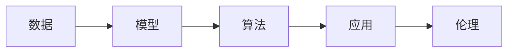
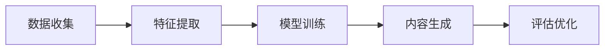

                 

## 1. 背景介绍

### 1.1 问题由来

随着人工智能技术的不断发展，人工智能生成内容（AIGC）在媒体、娱乐、教育、商业等领域逐渐崭露头角，成为新一代技术变革的重要推动力。AIGC不仅仅是技术的简单应用，而是通过连接过去、现在和未来，极大地拓展了人类获取知识和创造力的可能性，使得拥有数据和算力的人能够在信息社会中取得巨大优势。

AIGC作为一项颠覆性技术，将彻底改变传统的生产关系和工作方式，带来前所未有的社会变革。它不仅影响着媒体和娱乐行业的内容生产与分发，还在教育、医疗、金融等领域产生了深远的影响。在教育领域，AIGC可以提供个性化、灵活的在线教育平台，帮助学生自主学习；在医疗领域，AIGC能够辅助医生进行快速诊断，提供高效的医疗服务；在金融领域，AIGC可以帮助分析师进行预测分析，提高金融决策的准确性。

### 1.2 问题核心关键点

AIGC的核心关键点在于其对数据的依赖和高效利用能力。AIGC通过对海量数据的学习和分析，可以生成高质量的内容，满足用户的多样化需求。它能够自动生成文本、图片、音频、视频等多模态内容，支持自然语言处理、计算机视觉、音频生成等多个领域。AIGC的应用不仅体现在生成内容本身，还包括推荐系统、语音识别、情感分析等多个方面，能够极大地提升应用场景的智能化和自动化水平。

AIGC的另一个重要特点是其动态演进和自我学习能力。通过对用户行为数据的持续收集和分析，AIGC能够不断调整模型参数，优化生成策略，提升内容质量和用户体验。同时，AIGC也具有良好的迁移能力，能够在多个领域应用，提高整体生产力。

### 1.3 问题研究意义

AIGC技术的研究和发展，对于推动信息社会的智能化进程具有重要意义：

1. **提升生产力**：AIGC能够自动生成大量高质量的内容，减少人工创作成本，提升生产效率。
2. **丰富用户体验**：通过个性化推荐、智能客服等方式，提升用户的使用体验。
3. **拓展应用场景**：AIGC在多个领域的应用，拓展了其价值空间。
4. **加速知识普及**：通过生成教学内容、科普文章等方式，加速知识的传播和普及。
5. **促进创新创业**：AIGC为创业者提供了新的技术手段和市场机会。

AIGC技术的发展，不仅能够推动传统产业的数字化转型，还能够催生新的商业模式和产业链。掌握AIGC技术，意味着掌握了未来的竞争优势。

## 2. 核心概念与联系

### 2.1 核心概念概述

AIGC作为新一代人工智能技术，涵盖了从数据获取、模型训练到内容生成的全过程。其核心概念包括：

- **数据**：AIGC的基础，AIGC的效果很大程度上取决于数据的质量和数量。
- **模型**：AIGC的核心模型，包括语言模型、图像生成模型、视频生成模型等，通常基于深度学习架构。
- **算法**：包括数据预处理、特征提取、模型训练、内容生成等算法。
- **应用**：AIGC在各领域的应用，如推荐系统、智能客服、内容生成、数据分析等。
- **伦理**：AIGC的伦理问题，如版权、隐私保护、偏见消除等。

这些核心概念之间存在紧密的联系，通过数据的输入和处理，模型能够学习到丰富的语言或视觉等知识，进而生成高质量的内容。模型训练过程需要算法的支持，同时算法需要应用领域的指导和优化。AIGC技术的应用场景不断拓展，但始终离不开伦理的规范和指导。

### 2.2 概念间的关系

AIGC的核心概念之间存在复杂的互动关系，通过数据、模型、算法和应用的结合，形成了完整的技术生态系统。以下是这些概念之间的关系：

- **数据-模型**：模型通过数据进行训练，数据质量影响模型性能。
- **模型-算法**：算法是模型训练和内容生成的基础，包括特征工程、损失函数设计、优化器选择等。
- **算法-应用**：应用场景需要特定的算法支持，如推荐系统需要协同过滤算法，内容生成需要语言模型。
- **应用-伦理**：应用过程中需要考虑伦理问题，如版权保护、隐私保护等。

这些概念之间的关系可以通过以下Mermaid流程图来展示：



这个流程图展示了AIGC技术生态系统的核心概念及其之间的关系。数据输入到模型中进行训练，模型通过算法生成内容，内容在实际应用中体现价值，同时需要考虑伦理问题。

## 3. 核心算法原理 & 具体操作步骤

### 3.1 算法原理概述

AIGC的核心算法原理主要包括：

- **数据预处理**：对原始数据进行清洗、标注、分词等预处理，以便于模型训练。
- **特征提取**：通过特征工程将原始数据转化为适合模型训练的特征向量。
- **模型训练**：基于预处理后的数据，使用深度学习模型进行训练，学习语言或视觉等知识。
- **内容生成**：模型通过训练得到知识，自动生成文本、图像、视频等多模态内容。
- **优化算法**：包括梯度下降、Adam、RMSprop等，用于模型参数的更新和优化。
- **评价指标**：如BLEU、ROUGE、CIDEr等，用于评估生成内容的质量。

AIGC算法的原理基于深度学习，通过多层神经网络的学习和推理，生成高质量的内容。深度学习模型的结构和参数调整直接影响AIGC的效果。

### 3.2 算法步骤详解

AIGC的核心算法步骤包括：

1. **数据收集**：收集原始数据，并进行预处理和标注。
2. **特征提取**：对原始数据进行特征工程，生成适合模型训练的特征向量。
3. **模型训练**：使用深度学习模型进行训练，优化模型参数。
4. **内容生成**：使用训练好的模型生成文本、图像、视频等多模态内容。
5. **评估优化**：对生成的内容进行评估，调整模型参数，提高生成质量。

以下是一个简化的算法步骤流程图：



这个流程图展示了AIGC的核心算法步骤。通过数据收集、特征提取、模型训练和内容生成等步骤，最终生成高质量的内容，并通过评估和优化进一步提升效果。

### 3.3 算法优缺点

AIGC算法的优点包括：

- **高效性**：通过大规模数据训练，能够快速生成高质量的内容，提升生产效率。
- **多样化**：能够生成文本、图像、视频等多种形式的内容，满足不同用户的需求。
- **可扩展性**：算法和技术框架易于扩展和优化，适应不同的应用场景。

AIGC算法的缺点包括：

- **数据依赖**：依赖高质量的数据进行训练，数据质量和数量直接影响生成效果。
- **计算资源需求高**：需要大量的计算资源和算力支持。
- **伦理问题**：生成内容可能存在版权、隐私、偏见等问题，需要严格规范和管理。

### 3.4 算法应用领域

AIGC在多个领域得到了广泛应用，包括：

- **媒体娱乐**：自动生成视频、电影、音乐等内容，提升内容创作效率。
- **教育**：自动生成教学材料、练习题等，提供个性化学习资源。
- **医疗**：自动生成诊断报告、治疗方案等内容，辅助医生决策。
- **金融**：自动生成市场分析报告、预测模型等内容，提高金融决策准确性。
- **智能客服**：自动生成对话模板、回答内容，提升客服效率和质量。
- **虚拟现实**：自动生成虚拟场景、角色对话等内容，提升虚拟现实体验。
- **艺术创作**：自动生成绘画、音乐等内容，辅助艺术创作。

## 4. 数学模型和公式 & 详细讲解 & 举例说明

### 4.1 数学模型构建

AIGC的核心数学模型主要包括：

- **语言模型**：用于生成文本内容，常见的有GPT、BERT、T5等。
- **图像生成模型**：用于生成图像内容，常见的有GAN、VQ-VAE等。
- **视频生成模型**：用于生成视频内容，常见的有VQGAN、VideoGAN等。

以语言模型为例，其数学模型构建如下：

$$
P(X_i | X_{i-1}, ..., X_1) = \prod_{i=1}^{n} P(X_i | X_{i-1}, ..., X_1)
$$

其中，$P(X_i | X_{i-1}, ..., X_1)$表示在给定前文$X_{i-1}, ..., X_1$的情况下，生成单词$X_i$的概率。通过最大似然估计等方法，可以训练出最优的语言模型。

### 4.2 公式推导过程

以语言模型为例，其训练过程的公式推导如下：

$$
\theta = \mathop{\arg\min}_{\theta} \frac{1}{N}\sum_{i=1}^{N} \log P(X_i | X_{i-1}, ..., X_1)
$$

其中，$\theta$表示模型参数，$N$表示训练样本数量。通过优化算法如梯度下降，可以最小化损失函数，得到最优模型参数。

### 4.3 案例分析与讲解

以BERT为例，其训练过程的案例分析如下：

1. **数据预处理**：将原始数据进行清洗、标注、分词等预处理，生成适合模型训练的数据集。
2. **特征提取**：使用BERT的WordPiece分词技术，将文本转化为Token向量。
3. **模型训练**：使用BERT架构进行训练，优化模型参数。
4. **内容生成**：使用训练好的BERT模型，自动生成文本内容。
5. **评估优化**：通过BLEU、ROUGE等评价指标，评估生成内容的质量，并调整模型参数。

## 5. 项目实践：代码实例和详细解释说明

### 5.1 开发环境搭建

AIGC的开发环境搭建主要包括以下步骤：

1. **环境安装**：安装Python、TensorFlow、PyTorch等深度学习框架。
2. **库安装**：安装相关的AIGC库，如TensorFlow Addons、PyTorch Pretrained Models等。
3. **数据准备**：准备原始数据，并进行预处理和标注。
4. **模型训练**：使用深度学习模型进行训练，调整模型参数。
5. **内容生成**：使用训练好的模型生成文本、图像、视频等内容。
6. **评估优化**：评估生成内容的质量，并进行优化。

以下是一个简化的开发环境搭建流程：

```bash
# 安装Python和相关库
sudo apt-get update
sudo apt-get install python3 python3-pip
pip install tensorflow pytorch torchvision

# 安装AIGC库
pip install tensorflow-addons pytorch-pretrained-bert

# 数据准备
# 数据预处理
# 特征提取
# 模型训练
# 内容生成
# 评估优化
```

### 5.2 源代码详细实现

以下是一个使用TensorFlow Addons和PyTorch Pretrained Models库进行BERT微调的代码实现：

```python
import tensorflow as tf
import tensorflow_addons as addons
from pytorch_pretrained_bert import BertTokenizer, BertForSequenceClassification
from transformers import BertTokenizer, BertForSequenceClassification

# 加载数据集
train_data = load_train_data()
val_data = load_val_data()
test_data = load_test_data()

# 加载预训练模型和分词器
model = BertForSequenceClassification.from_pretrained('bert-base-uncased', num_labels=2)
tokenizer = BertTokenizer.from_pretrained('bert-base-uncased')

# 设置超参数
batch_size = 16
learning_rate = 2e-5
num_epochs = 5

# 定义优化器
optimizer = tf.keras.optimizers.Adam(learning_rate=learning_rate)

# 定义训练函数
def train_epoch(model, train_data, optimizer):
    for batch in train_data:
        input_ids = tf.convert_to_tensor(batch['input_ids'])
        attention_mask = tf.convert_to_tensor(batch['attention_mask'])
        labels = tf.convert_to_tensor(batch['labels'])
        with tf.GradientTape() as tape:
            logits = model(input_ids, attention_mask=attention_mask)
            loss = addons.text_losses.segmentation_sequence_cross_entropy(labels, logits)
        gradients = tape.gradient(loss, model.trainable_variables)
        optimizer.apply_gradients(zip(gradients, model.trainable_variables))

# 定义评估函数
def evaluate(model, val_data):
    for batch in val_data:
        input_ids = tf.convert_to_tensor(batch['input_ids'])
        attention_mask = tf.convert_to_tensor(batch['attention_mask'])
        labels = tf.convert_to_tensor(batch['labels'])
        logits = model(input_ids, attention_mask=attention_mask)
        loss = addons.text_losses.segmentation_sequence_cross_entropy(labels, logits)
        return loss

# 训练模型
for epoch in range(num_epochs):
    train_epoch(model, train_data, optimizer)
    loss = evaluate(model, val_data)
    print('Epoch {0}, Loss: {1}'.format(epoch+1, loss))

# 保存模型
model.save('bert_model')
```

### 5.3 代码解读与分析

上述代码实现了一个基于BERT的文本分类任务微调过程。主要步骤如下：

1. **数据加载**：从数据集中加载训练数据、验证数据和测试数据，并进行预处理和标注。
2. **模型加载**：加载预训练的BERT模型和分词器。
3. **超参数设置**：设置学习率、批次大小和训练轮数等超参数。
4. **优化器定义**：定义Adam优化器。
5. **训练函数**：定义训练函数，进行前向传播和反向传播，更新模型参数。
6. **评估函数**：定义评估函数，计算验证集的损失。
7. **模型训练**：通过循环迭代，训练模型。
8. **模型保存**：保存训练好的模型。

## 6. 实际应用场景

### 6.1 媒体娱乐

AIGC在媒体娱乐领域的应用包括自动生成视频、电影、音乐等内容。例如，使用DALL-E、Stable Diffusion等图像生成模型，可以根据文本描述自动生成高质量的图像。使用Tacotron2、WaveNet等音频生成模型，可以根据文本自动生成音乐、语音等。使用GPT等语言生成模型，可以根据文本自动生成电影剧本、故事大纲等。

### 6.2 教育

AIGC在教育领域的应用包括自动生成教学材料、练习题等。例如，使用GPT等语言生成模型，可以自动生成英语写作、数学题等。使用YOLO等目标检测模型，可以自动生成教育动画等。使用DeepSpeech等语音识别模型，可以自动生成语音教材等。

### 6.3 医疗

AIGC在医疗领域的应用包括自动生成诊断报告、治疗方案等。例如，使用BERT等语言生成模型，可以自动生成医学论文、患者案例等。使用GAN等图像生成模型，可以自动生成医学影像等。使用DeepLearning-based等模型，可以自动生成疾病预测模型等。

### 6.4 金融

AIGC在金融领域的应用包括自动生成市场分析报告、预测模型等。例如，使用RNN等序列模型，可以自动生成股票分析报告、交易策略等。使用GAN等生成模型，可以自动生成金融新闻、市场分析报告等。使用LSTM等循环神经网络，可以自动生成财务预测模型等。

## 7. 工具和资源推荐

### 7.1 学习资源推荐

为了掌握AIGC的核心技术，以下是一些推荐的学习资源：

1. **《深度学习》（Ian Goodfellow等著）**：深入浅出地介绍了深度学习的原理和算法。
2. **《自然语言处理综论》（Christopher D. Manning等著）**：系统介绍了自然语言处理的基本概念和技术。
3. **《计算机视觉：模型、学习和推理》（Karen Simonyan等著）**：介绍了计算机视觉的基本概念和技术。
4. **《Transformer: From原理到实践》系列博文**：介绍了Transformer的原理和实践。
5. **HuggingFace官方文档**：提供了丰富的预训练模型和微调样例代码。
6. **ArXiv论文预印本**：最新的前沿研究和技术进展。

### 7.2 开发工具推荐

以下是一些推荐的开发工具：

1. **PyTorch**：一个灵活的深度学习框架，适合研究型任务和模型开发。
2. **TensorFlow**：一个生产部署友好的深度学习框架，适合大规模工程应用。
3. **HuggingFace Transformers库**：提供了丰富的预训练模型和微调样例代码。
4. **Google Colab**：一个免费的在线Jupyter Notebook环境，适合快速原型开发。
5. **Weights & Biases**：模型训练的实验跟踪工具。
6. **TensorBoard**：模型训练的可视化工具。

### 7.3 相关论文推荐

以下是一些推荐的相关论文：

1. **《语言模型是未曾监督的多任务学习者》（Lilian Edwards等著）**：介绍了语言模型的原理和应用。
2. **《GPT-3：新一代语言生成模型》（OpenAI团队著）**：介绍了GPT-3模型及其应用。
3. **《用于图像生成对抗网络的修改后梯度下降》（Alec Radford等著）**：介绍了GAN的原理和应用。
4. **《多任务学习的跨领域迁移学习》（Niels Rogge等著）**：介绍了多任务学习的原理和应用。
5. **《用于图像生成的连续型提示》（Jamie Chan等著）**：介绍了Prefix-Tuning的原理和应用。

## 8. 总结：未来发展趋势与挑战

### 8.1 研究成果总结

AIGC技术的研究和发展已经取得了显著的成果，主要体现在以下几个方面：

1. **模型规模**：模型规模的不断增大，使得生成内容的质量和多样性得到了极大的提升。
2. **应用领域**：AIGC在多个领域的应用不断拓展，推动了信息社会的智能化进程。
3. **技术演进**：从简单的文本生成到多模态内容生成，技术不断演进和优化。
4. **伦理规范**：对AIGC的伦理问题进行了深入研究和规范，推动了技术应用的健康发展。

### 8.2 未来发展趋势

未来，AIGC技术将呈现以下几个发展趋势：

1. **规模化和多样化**：模型规模将进一步增大，生成内容将更加多样化，满足不同用户的需求。
2. **智能化和自主化**：AIGC将进一步智能化，具备自主生成和推理能力。
3. **跨模态融合**：多模态内容的生成和融合将成为新的发展方向，提升内容的综合表现力。
4. **伦理和规范**：对AIGC的伦理问题将进行更深入的研究和规范，确保技术应用的安全性和可靠性。
5. **开源化和普及化**：AIGC技术将进一步开源化和普及化，推动技术的广泛应用。

### 8.3 面临的挑战

尽管AIGC技术已经取得了显著的成果，但在发展过程中仍然面临诸多挑战：

1. **数据质量**：高质量的数据是AIGC技术的基础，但数据收集和标注的成本较高，数据质量和数量直接影响生成效果。
2. **计算资源**：AIGC需要大量的计算资源和算力支持，计算成本较高。
3. **伦理问题**：生成内容可能存在版权、隐私、偏见等问题，需要严格规范和管理。
4. **可解释性**：AIGC模型的黑盒特性使得其可解释性不足，难以解释生成内容的决策逻辑。
5. **安全和可靠性**：AIGC生成的内容可能存在误导性和安全性问题，需要严格规范和管理。

### 8.4 研究展望

未来，AIGC技术的研究可以从以下几个方面进行突破：

1. **无监督和半监督学习**：摆脱对大规模标注数据的依赖，利用自监督学习、主动学习等技术，提高模型的泛化能力。
2. **参数高效和计算高效**：开发更加参数高效和计算高效的微调方法，提高模型的效率和性能。
3. **因果分析和对比学习**：引入因果分析和对比学习技术，增强模型的可解释性和鲁棒性。
4. **跨模态融合和多领域迁移**：引入多模态数据的融合和多领域迁移技术，提升模型的通用性和适应性。
5. **伦理和规范研究**：对AIGC的伦理问题进行深入研究，制定规范和标准，确保技术应用的安全性和可靠性。

## 9. 附录：常见问题与解答

**Q1: AIGC技术在未来有哪些应用前景？**

A1: AIGC技术在未来将有广阔的应用前景，主要体现在以下几个方面：

1. **媒体娱乐**：自动生成视频、电影、音乐等内容，提升内容创作效率。
2. **教育**：自动生成教学材料、练习题等，提供个性化学习资源。
3. **医疗**：自动生成诊断报告、治疗方案等，辅助医生决策。
4. **金融**：自动生成市场分析报告、预测模型等，提高金融决策准确性。
5. **智能客服**：自动生成对话模板、回答内容，提升客服效率和质量。
6. **虚拟现实**：自动生成虚拟场景、角色对话等内容，提升虚拟现实体验。
7. **艺术创作**：自动生成绘画、音乐等内容，辅助艺术创作。

**Q2: AIGC技术的优势和劣势是什么？**

A2: AIGC技术的优势包括：

1. **高效性**：通过大规模数据训练，能够快速生成高质量的内容，提升生产效率。
2. **多样化**：能够生成文本、图像、视频等多种形式的内容，满足不同用户的需求。
3. **可扩展性**：算法和技术框架易于扩展和优化，适应不同的应用场景。

AIGC技术的劣势包括：

1. **数据依赖**：依赖高质量的数据进行训练，数据质量和数量直接影响生成效果。
2. **计算资源需求高**：需要大量的计算资源和算力支持。
3. **伦理问题**：生成内容可能存在版权、隐私、偏见等问题，需要严格规范和管理。

**Q3: AIGC技术在实际应用中需要注意哪些问题？**

A3: AIGC技术在实际应用中需要注意以下问题：

1. **数据质量**：保证高质量的数据，避免数据噪声和偏差。
2. **计算资源**：合理配置计算资源，避免计算资源的浪费和不足。
3. **伦理问题**：严格规范和管理，确保生成内容的版权、隐私、偏见等符合伦理要求。
4. **可解释性**：增强模型的可解释性，便于用户理解和信任。
5. **安全和可靠性**：确保生成内容的安全性和可靠性，避免误导性和安全隐患。

**Q4: 如何有效利用AIGC技术提升应用场景的智能化水平？**

A4: 要有效利用AIGC技术提升应用场景的智能化水平，可以从以下几个方面进行：

1. **数据收集和标注**：收集和标注高质量的数据，确保模型训练的可靠性。
2. **模型选择和训练**：选择合适的AIGC模型，并进行高效的训练和优化。
3. **应用场景适配**：根据具体应用场景，设计合适的任务适配层和优化策略。
4. **评估和优化**：对生成内容进行评估，优化模型参数，提升生成质量。
5. **集成部署**：将生成模型集成到实际应用系统中，进行测试和部署。

**Q5: AIGC技术在哪些领域具有潜在价值？**

A5: AIGC技术在以下几个领域具有潜在价值：

1. **媒体娱乐**：自动生成视频、电影、音乐等内容，提升内容创作效率。
2. **教育**：自动生成教学材料、练习题等，提供个性化学习资源。
3. **医疗**：自动生成诊断报告、治疗方案等，辅助医生决策。
4. **金融**：自动生成市场分析报告、预测模型等，提高金融决策准确性。
5. **智能客服**：自动生成对话模板、回答内容，提升客服效率和质量。
6. **虚拟现实**：自动生成虚拟场景、角色对话等内容，提升虚拟现实体验。
7. **艺术创作**：自动生成绘画、音乐等内容，辅助艺术创作。

**Q6: AIGC技术的未来发展方向是什么？**

A6: AIGC技术的未来发展方向包括：

1. **规模化和多样化**：模型规模将进一步增大，生成内容将更加多样化。
2. **智能化和自主化**：AIGC将进一步智能化，具备自主生成和推理能力。
3. **跨模态融合**：多模态内容的生成和融合将成为新的发展方向。
4. **伦理和规范研究**：对AIGC的伦理问题进行深入研究，制定规范和标准。
5. **开源化和普及化**：AIGC技术将进一步开源化和普及化，推动技术的广泛应用。

作者：禅与计算机程序设计艺术 / Zen and the Art of Computer Programming

