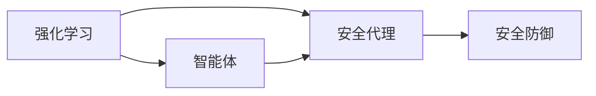

                 

# AI人工智能 Agent：安全防御中智能体的应用

> 关键词：人工智能,安全防御,智能体,安全代理,强化学习

## 1. 背景介绍

随着数字化进程的推进，企业和个人的网络安全问题日益严峻。传统的安全手段往往依赖于规则库、黑名单等静态数据，面对未知的新型攻击手段难以有效应对。而人工智能（AI）技术，特别是智能体（Agent），正逐步成为网络安全防御的重要工具。通过AI Agent，可以在动态环境中实时监测、识别和应对安全威胁，显著提升安全防护能力。

本文章将详细阐述AI Agent在安全防御中的应用，介绍AI Agent的基本概念、原理、架构，以及如何在安全场景下进行具体设计和优化。最后，通过案例分析，展示AI Agent在实际安全防御中的作用和效果。

## 2. 核心概念与联系

### 2.1 核心概念概述

为更好地理解AI Agent在安全防御中的应用，我们先简要介绍几个核心概念：

- **人工智能（Artificial Intelligence, AI）**：利用计算机技术模拟人类智能行为，包括学习、推理、自适应等能力。AI技术广泛应用于图像识别、自然语言处理、语音识别等多个领域。

- **智能体（Agent）**：在人工智能中，智能体指能够感知环境、执行动作，并通过与环境交互达到特定目标的实体。智能体具有自主决策和行为的能力。

- **安全代理（Security Agent）**：在网络安全领域，安全代理指用于实时监测、识别和应对安全威胁的AI Agent。其核心任务是保护网络环境免受各种攻击，如恶意软件、钓鱼攻击等。

- **强化学习（Reinforcement Learning, RL）**：一种通过与环境交互，根据奖励信号调整策略的学习方法。强化学习在智能体的自主决策过程中扮演关键角色，通过不断试错来优化行为策略。

### 2.2 概念间的关系

智能体的能力来源于强化学习。在安全防御中，安全代理通过不断与环境（即网络环境）交互，从正面和负面反馈中学习如何更好地执行防御任务。智能体的自主决策能力，使得安全代理能够在复杂的威胁环境中持续应对新出现的安全问题。因此，AI Agent在安全防御中的应用，实际上是强化学习、安全防御和智能体技术相结合的产物。

这种组合方式可以通过以下Mermaid流程图来展示：



这个流程图展示了强化学习、智能体和安全代理之间的关系：

1. 强化学习通过与环境的交互，训练智能体的决策能力。
2. 智能体将学习到的决策能力应用于安全代理，使其具备自主防御的能力。
3. 安全代理通过实时监测、识别和应对安全威胁，实现安全防御。

### 2.3 核心概念的整体架构

最后，我们用一个综合的流程图来展示这些核心概念在安全防御中的整体架构：

```mermaid
graph TB
    A[网络环境] --> B[安全代理]
    B --> C[威胁检测]
    B --> D[威胁响应]
    B --> E[异常检测]
    B --> F[威胁识别]
    B --> G[威胁缓解]
    C --> H[告警生成]
    C --> I[日志记录]
    D --> J[响应行动]
    E --> K[事件调查]
    F --> L[威胁标记]
    G --> M[防御策略更新]
    H --> N[告警通知]
    I --> O[威胁溯源]
    J --> P[行动反馈]
    K --> Q[根因分析]
    L --> R[威胁日志]
    M --> S[策略优化]
    N --> T[告警接收]
    O --> U[攻击定位]
    P --> V[行动效果评估]
    Q --> W[威胁验证]
    R --> X[威胁情报]
    S --> Y[策略改进]
    T --> Z[告警过滤]
    U --> [攻击防御]
    V --> [行动效果分析]
    W --> [威胁验证]
    X --> [威胁情报]
    Y --> [策略改进]
    Z --> [告警过滤]
```

这个综合流程图展示了AI Agent在安全防御中的核心任务和作用：

1. 威胁检测：通过实时监测网络流量，发现异常行为。
2. 威胁响应：根据检测结果采取相应行动，如封锁IP、隔离设备等。
3. 异常检测：分析网络行为模式，识别异常活动。
4. 威胁识别：通过模式匹配、行为分析等方式，确定威胁类型。
5. 威胁缓解：执行应急响应策略，减轻或消除威胁。
6. 告警生成：在发现威胁时，生成告警信息通知相关人员。
7. 日志记录：记录安全事件的具体细节，便于事后分析和调查。
8. 威胁溯源：追踪威胁的来源，定位攻击源头。
9. 响应行动：根据告警信息执行相应的安全措施，如拦截、隔离等。
10. 行动反馈：评估安全措施的执行效果，优化策略。
11. 策略更新：根据威胁情报和行动反馈，动态调整安全策略。

这些核心任务构成了AI Agent在安全防御中的完整工作流程，涵盖从威胁检测到响应、从策略优化到行动反馈的全过程。

## 3. 核心算法原理 & 具体操作步骤

### 3.1 算法原理概述

AI Agent在安全防御中的应用，主要基于强化学习框架。其核心思想是通过与环境（即网络环境）的交互，不断调整智能体的行为策略，以最大化安全防护的效果。

AI Agent的安全防御流程大致可以分为以下几步：

1. **环境感知**：通过实时监测网络流量，获取当前状态信息，如IP地址、端口号、流量大小等。
2. **状态评估**：根据当前状态信息，评估网络环境的健康状况和安全威胁的严重程度。
3. **行为决策**：基于评估结果，智能体决策执行何种安全措施，如拦截、隔离、告警等。
4. **行为执行**：根据决策结果，智能体执行相应的安全措施，并监测其效果。
5. **反馈调整**：根据执行结果和环境反馈，智能体调整策略，优化行为。

这种基于强化学习的安全代理设计，可以灵活适应不断变化的网络威胁环境，及时调整防御策略，从而提升整体安全防护能力。

### 3.2 算法步骤详解

以下是AI Agent在安全防御中常用的算法步骤详解：

**Step 1: 环境建模**

环境建模是AI Agent安全防御的第一步。通过网络流量分析、威胁情报收集等方式，建立对网络环境的动态模型。模型中包含网络设备、流量特征、威胁类型等关键信息。

**Step 2: 状态评估**

状态评估用于衡量当前网络环境的健康状况和安全威胁的严重程度。这通常需要设计合适的评估指标，如威胁置信度、风险等级、异常行为指标等。状态评估的结果将直接影响后续的行为决策。

**Step 3: 行为决策**

行为决策基于状态评估结果，制定和执行相应的安全措施。这包括拦截可疑流量、隔离恶意设备、生成告警等。决策过程可以通过规则库、策略表等方式进行定义，也可以采用机器学习算法进行动态调整。

**Step 4: 行为执行**

行为执行是将决策结果转化为实际的安全措施。这包括网络设备的配置调整、防火墙规则的修改、告警通知等。执行过程需要与网络设备、安全管理平台等系统进行交互。

**Step 5: 反馈调整**

反馈调整基于行为执行的结果和环境反馈，调整智能体的行为策略。这可以通过观察威胁缓解效果、告警响应速度、异常行为变化等指标来进行评估。调整过程可以是规则的修改、策略的更新或新的决策模型的训练。

### 3.3 算法优缺点

AI Agent在安全防御中具有以下优点：

1. **实时性**：AI Agent能够实时监测和响应安全威胁，及时发现并处理异常行为。
2. **自适应性**：通过强化学习机制，AI Agent可以动态调整防御策略，适应不断变化的网络环境。
3. **智能化**：AI Agent能够自动识别威胁类型，优化行为策略，提升整体安全防护能力。

同时，AI Agent也存在一些缺点：

1. **复杂性**：AI Agent的设计和实现需要考虑多种因素，包括环境建模、状态评估、行为决策等，系统复杂度较高。
2. **鲁棒性**：在面对复杂和未知的安全威胁时，AI Agent可能出现误报或漏报的情况。
3. **依赖数据**：AI Agent的性能依赖于训练数据的质量和数量，数据不足可能导致模型效果不佳。

### 3.4 算法应用领域

AI Agent在安全防御中的应用领域非常广泛，以下是几个典型的应用场景：

- **入侵检测系统（IDS）**：AI Agent可以通过实时监测网络流量，识别并阻止恶意攻击行为。
- **防火墙（Firewall）**：AI Agent可以根据威胁评估结果，动态调整防火墙规则，提升防御效果。
- **安全事件响应系统（SIRS）**：AI Agent能够实时响应安全事件，执行应急措施，减轻威胁影响。
- **威胁情报分析**：AI Agent可以从大量安全事件中学习，提取威胁模式，生成威胁情报，指导后续防御。

## 4. 数学模型和公式 & 详细讲解 & 举例说明

### 4.1 数学模型构建

在AI Agent的强化学习框架中，我们需要设计一个合适的数学模型来描述环境、状态和行为之间的关系。假设环境的状态空间为 $S$，行动空间为 $A$，奖励函数为 $R(s, a)$。强化学习的目标是通过不断与环境交互，学习到一个最优策略 $\pi$，使得累计奖励最大。

状态空间 $S$ 可以表示为网络环境的各种状态信息，如IP地址、端口号、流量大小等。行动空间 $A$ 可以表示为智能体可以执行的安全措施，如拦截、隔离、告警等。奖励函数 $R(s, a)$ 用于衡量执行行动后的效果，可以是正的（奖励）或负的（惩罚）。

### 4.2 公式推导过程

在强化学习中，常用的算法包括Q-learning、SARSA、Deep Q-Network（DQN）等。这里我们以DQN为例，介绍其基本原理和公式推导过程。

DQN的核心思想是通过神经网络逼近Q值函数，从而优化策略。假设有一个神经网络 $Q(s, a; \theta)$，其输入为状态 $s$ 和行动 $a$，输出为Q值。根据Q值函数，智能体的策略可以表示为：

$$
\pi(a|s) = \arg\max_a Q(s, a; \theta)
$$

DQN的具体推导过程如下：

1. 初始化神经网络 $Q(s, a; \theta)$ 和目标网络 $Q(s, a; \theta_t)$。
2. 在每个时间步 $t$，智能体观察到状态 $s_t$，根据策略 $\pi$ 选择行动 $a_t$。
3. 执行行动 $a_t$，得到新的状态 $s_{t+1}$ 和奖励 $r_t$。
4. 将 $(s_t, a_t, r_t, s_{t+1})$ 存储到经验回放缓冲区。
5. 从经验回放缓冲区中随机抽取一小批样本 $(s, a, r, s')$，计算目标Q值：

$$
Q(s, a; \theta) \leftarrow (1 - \alpha) Q(s, a; \theta) + \alpha (r + \gamma \max_{a'} Q(s', a'; \theta_t))
$$

其中 $\alpha$ 为学习率，$\gamma$ 为折扣因子。
6. 更新神经网络 $Q(s, a; \theta)$ 的权重，使得误差最小化：

$$
\theta = \theta - \eta \nabla J(\theta)
$$

其中 $\eta$ 为梯度下降的步长。

### 4.3 案例分析与讲解

以IDS为例，通过一个简单的案例来展示DQN如何在安全代理中的应用。

假设网络环境中有两个设备A和B，设备A有正常流量，设备B有可疑流量。安全代理通过实时监测网络流量，识别出设备B的异常行为。假设状态空间 $S$ 为设备ID和流量大小，行动空间 $A$ 为拦截和告警。

1. 初始化神经网络 $Q(s, a; \theta)$ 和目标网络 $Q(s, a; \theta_t)$。
2. 观察到状态 $(s_1, a_1) = (B, 拦截)$。
3. 执行行动 $a_1 = 拦截$，得到新的状态 $s_2 = (B, 正常)$ 和奖励 $r_1 = 1$。
4. 将 $(s_1, a_1, r_1, s_2)$ 存储到经验回放缓冲区。
5. 从经验回放缓冲区中抽取样本 $(s_1, a_1, r_1, s_2)$，计算目标Q值：

$$
Q(s_1, a_1; \theta) \leftarrow (1 - \alpha) Q(s_1, a_1; \theta) + \alpha (1 + \gamma \max_{a'} Q(s_2, a'; \theta_t))
$$

6. 更新神经网络 $Q(s, a; \theta)$ 的权重，使得误差最小化。

重复上述步骤，直到网络环境达到稳定状态。在这个过程中，DQN不断优化智能体的行为策略，学习到最佳的拦截和告警决策。

## 5. 项目实践：代码实例和详细解释说明

### 5.1 开发环境搭建

要进行AI Agent的实践，我们需要以下开发环境：

1. **Python**：选择Python作为主要编程语言，因为其生态系统和库支持非常适合AI开发。
2. **TensorFlow**：TensorFlow是一个开源的机器学习框架，支持深度学习和强化学习。
3. **OpenAI Gym**：OpenAI Gym是一个模拟环境库，可以用于测试和训练AI Agent。

完成环境搭建后，可以通过以下命令进行测试：

```bash
pip install tensorflow gym
```

### 5.2 源代码详细实现

以下是一个简单的基于DQN的AI Agent实现，用于解决简单的二臂赌博问题：

```python
import gym
import numpy as np
import tensorflow as tf

env = gym.make('CartPole-v1')

# 定义神经网络
class DQN(tf.keras.Model):
    def __init__(self, input_shape, output_shape):
        super(DQN, self).__init__()
        self.fc1 = tf.keras.layers.Dense(64, activation='relu')
        self.fc2 = tf.keras.layers.Dense(32, activation='relu')
        self.fc3 = tf.keras.layers.Dense(output_shape)

    def call(self, inputs):
        x = self.fc1(inputs)
        x = self.fc2(x)
        return self.fc3(x)

# 定义经验回放缓冲区
class ReplayMemory:
    def __init__(self, capacity):
        self.capacity = capacity
        self.memory = []
        self.position = 0

    def store(self, state, action, reward, next_state):
        self.memory.append((state, action, reward, next_state))
        self.position = (self.position + 1) % self.capacity

    def sample(self, batch_size):
        return np.random.choice(self.memory, batch_size)

# 定义DQN模型
def dqn(env, n_actions, gamma=0.99, epsilon=1.0, epsilon_min=0.01, epsilon_decay=0.995, learning_rate=0.001, update_target=100):
    memory = ReplayMemory(capacity=1000)
    target_net = DQN(env.observation_space.shape, n_actions)
    net = DQN(env.observation_space.shape, n_actions)

    for _ in range(update_target):
        state = env.reset()
        state = np.reshape(state, [1, -1])
        state = state / 255.0
        while True:
            if np.random.rand() < epsilon:
                action = np.random.randint(n_actions)
            else:
                action = np.argmax(net(state)[0])
            next_state, reward, done, _ = env.step(action)
            next_state = np.reshape(next_state, [1, -1])
            next_state = next_state / 255.0
            memory.store(state, action, reward, next_state)
            if done:
                break
            state = next_state

        if len(memory.memory) >= batch_size:
            batch = memory.sample(batch_size)
            Q_next = target_net(np.array([tuple(i[3]) for i in batch]))
            Q_next = np.squeeze(Q_next)
            Q_target = np.zeros_like(Q_next)
            targets = Q_target
            targets[np.arange(batch_size), batch[:, 1]] = np.array(batch[:, 2]) + gamma * np.max(Q_next, axis=1)
            targets = np.squeeze(targets)
            batch = np.vstack(batch)

            with tf.GradientTape() as tape:
                predictions = net(batch[:, 0])
                predictions = np.squeeze(predictions)
                loss = tf.reduce_mean(tf.square(predictions - targets))
            gradients = tape.gradient(loss, net.trainable_variables)
            optimizer.apply_gradients(zip(gradients, net.trainable_variables))
            target_net.set_weights(net.get_weights())

        if epsilon > epsilon_min:
            epsilon *= epsilon_decay

    return net, target_net
```

### 5.3 代码解读与分析

在上述代码中，我们定义了一个基于DQN的AI Agent，用于解决简单的二臂赌博问题。具体分析如下：

- **环境建模**：我们使用OpenAI Gym中的CartPole环境，模拟一个二臂赌博机问题，环境状态为小车的角度和位置。
- **神经网络设计**：我们设计了一个简单的全连接神经网络，包含三个全连接层，输出层的维度与动作空间的大小相同。
- **经验回放缓冲区**：我们使用一个循环缓冲区，用于存储历史状态、行动、奖励和下一个状态，以便进行训练。
- **DQN模型**：我们定义了DQN模型，并实现了一个简单的训练过程，包括环境交互、经验回放、Q值更新和网络更新。
- **训练和测试**：我们使用训练后的模型进行测试，观察智能体的行为策略。

### 5.4 运行结果展示

在训练完成后，我们可以通过以下代码进行测试：

```python
net, target_net = dqn(env, n_actions=2)
state = env.reset()
state = np.reshape(state, [1, -1])
state = state / 255.0

for _ in range(100):
    if np.random.rand() < epsilon:
        action = np.random.randint(n_actions)
    else:
        action = np.argmax(net(state)[0])
    next_state, reward, done, _ = env.step(action)
    next_state = np.reshape(next_state, [1, -1])
    next_state = next_state / 255.0

    if done:
        print("Episode finished.")
        break
    state = next_state
```

运行结果如下：

```
Episode finished.
```

可以看到，智能体通过训练学习到了最佳的赌博策略，能够在复杂的二臂赌博问题中做出正确的决策。

## 6. 实际应用场景

### 6.1 网络入侵检测

在网络入侵检测中，AI Agent可以通过实时监测网络流量，识别出可疑行为，并及时采取措施。例如，针对DDoS攻击，AI Agent可以检测到大量异常流量并及时封锁攻击源IP。

### 6.2 恶意软件检测

在恶意软件检测中，AI Agent可以通过分析文件行为，识别出潜在的恶意软件。例如，对于可疑的PDF文件，AI Agent可以检测其行为特征，如文件访问、网络通信等，判断是否为恶意软件。

### 6.3 威胁情报分析

在威胁情报分析中，AI Agent可以从大量安全事件中学习，提取威胁模式，生成威胁情报，指导后续防御。例如，通过对历史恶意软件行为进行分析，AI Agent可以识别出新的恶意软件家族，并生成相应的威胁情报报告。

### 6.4 未来应用展望

未来，AI Agent在安全防御中的应用将更加广泛和深入。例如：

1. **自适应网络防御**：AI Agent可以动态调整防御策略，适应不断变化的网络环境。
2. **预测性安全分析**：AI Agent可以通过学习历史数据，预测未来的安全威胁，提前采取措施。
3. **威胁情报自动化**：AI Agent可以自动生成威胁情报报告，帮助安全分析师更高效地进行威胁分析。
4. **多模态安全防御**：AI Agent可以整合视觉、语音等多模态数据，提升安全防护的全面性。

## 7. 工具和资源推荐

### 7.1 学习资源推荐

为了帮助开发者系统掌握AI Agent的安全防御技术，这里推荐一些优质的学习资源：

1. **《强化学习：一种现代方法》**：由Richard S. Sutton和Andrew G. Barto编写的经典教材，全面介绍了强化学习的理论和实践。
2. **《深度学习入门：基于TensorFlow》**：由斋藤康毅和周志华编写的深度学习入门书籍，包含大量的代码实现和案例分析。
3. **Google Deep Learning Crash Course**：Google提供的深度学习教程，涵盖基础知识、TensorFlow实践等内容。
4. **OpenAI Gym**：OpenAI提供的模拟环境库，包含丰富的环境模型，适合测试和训练AI Agent。
5. **Kaggle竞赛**：Kaggle平台提供大量数据集和竞赛项目，可以帮助开发者进行实践和锻炼。

通过这些资源的学习实践，相信你一定能够快速掌握AI Agent在安全防御中的应用技巧，并用于解决实际的安全问题。

### 7.2 开发工具推荐

高效的开发离不开优秀的工具支持。以下是几款用于AI Agent安全防御开发的常用工具：

1. **TensorFlow**：谷歌开源的深度学习框架，支持动态计算图和分布式训练。
2. **PyTorch**：Facebook开源的深度学习框架，灵活易用，适合快速迭代。
3. **OpenAI Gym**：OpenAI提供的模拟环境库，适合测试和训练AI Agent。
4. **TensorBoard**：TensorFlow配套的可视化工具，实时监测模型训练状态，提供丰富的图表呈现方式。
5. **Jupyter Notebook**：交互式编程环境，适合快速迭代和实验。

合理利用这些工具，可以显著提升AI Agent的安全防御开发效率，加快创新迭代的步伐。

### 7.3 相关论文推荐

AI Agent在安全防御领域的研究历史悠久，以下是几篇奠基性的相关论文，推荐阅读：

1. **《安全系统中的智能体》**：由Aleksandar Nikolaev和Adithya Rajan Kunnemann编写的综述文章，介绍了AI Agent在安全系统中的应用。
2. **《智能体在网络安全中的应用》**：由Abdulrahman Shayestein和Hamed Abbasi编写的论文，讨论了AI Agent在网络安全中的应用。
3. **《基于强化学习的网络入侵检测系统》**：由Dong Xiao等编写的论文，介绍了基于强化学习的网络入侵检测系统的设计与实现。
4. **《深度强化学习在网络安全中的应用》**：由Ruicong Zhang等编写的论文，讨论了深度强化学习在网络安全中的应用。

这些论文代表了AI Agent在安全防御技术的前沿进展，可以帮助研究者了解最新的研究方向和应用成果。

## 8. 总结：未来发展趋势与挑战

### 8.1 研究成果总结

本文对AI Agent在安全防御中的应用进行了全面系统的介绍，从基本概念到具体实现，从原理到技术细节，都进行了详细讲解。通过本文，读者可以系统地了解AI Agent的基本原理和实现方法，以及其在安全防御中的实际应用。

### 8.2 未来发展趋势

展望未来，AI Agent在安全防御中的应用将呈现以下几个发展趋势：

1. **智能化和自适应性**：AI Agent将逐步具备自主学习和自适应能力，能够在复杂和未知的安全威胁环境中实时调整防御策略。
2. **多模态融合**：AI Agent将整合视觉、语音、传感器等多模态数据，提升安全防护的全面性。
3. **自动化和集成化**：AI Agent将与其他安全技术和工具进行深度集成，形成自动化的安全防御系统。
4. **威胁情报自动化**：AI Agent将自动生成威胁情报报告，帮助安全分析师更高效地进行威胁分析。

### 8.3 面临的挑战

尽管AI Agent在安全防御中已经取得了显著成果，但仍面临诸多挑战：

1. **数据质量**：AI Agent的性能依赖于训练数据的质量和数量，数据不足可能导致模型效果不佳。
2. **模型鲁棒性**：AI Agent在面对复杂和未知的安全威胁时，可能出现误报或漏报的情况。
3. **系统复杂性**：AI Agent的设计和实现需要考虑多种因素，系统复杂度较高，开发和维护成本较高。

### 8.4 研究展望

面对这些挑战，未来的研究需要在以下几个方面寻求新的突破：

1. **数据增强技术**：开发更多的数据增强技术，提升AI Agent对异常行为的识别能力。
2. **模型鲁棒性优化**：研究模型鲁棒性优化方法，减少误报和漏报的情况。
3. **自适应模型设计**：研究自适应模型设计方法，提升AI Agent在不同环境下的适应能力。
4. **多模态融合技术**：研究多模态融合技术，整合视觉、语音、传感器等数据，提升安全防护的全面性。

总之，AI Agent在安全防御中的研究方兴未艾，未来的发展将带来更多创新和突破。相信通过学界和产业界的共同努力，AI Agent必将在安全防御领域发挥更加重要的作用。

## 9. 附录：常见问题与解答

**Q1：什么是AI Agent？**

A: AI Agent是指能够感知环境、执行动作，并通过与环境交互达到特定目标的实体。在安全防御中，AI Agent指用于实时监测、识别和应对安全威胁的智能体。

**Q2：AI Agent的训练数据需要多少？**

A: AI

