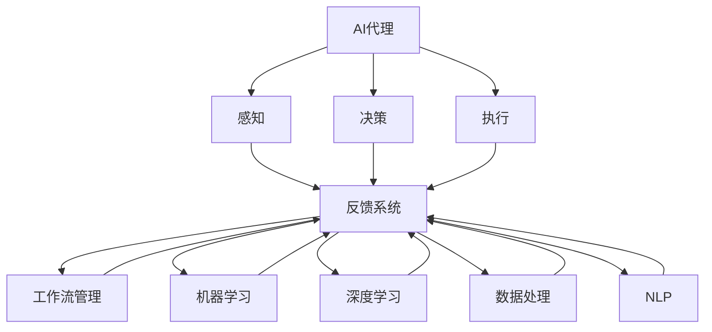
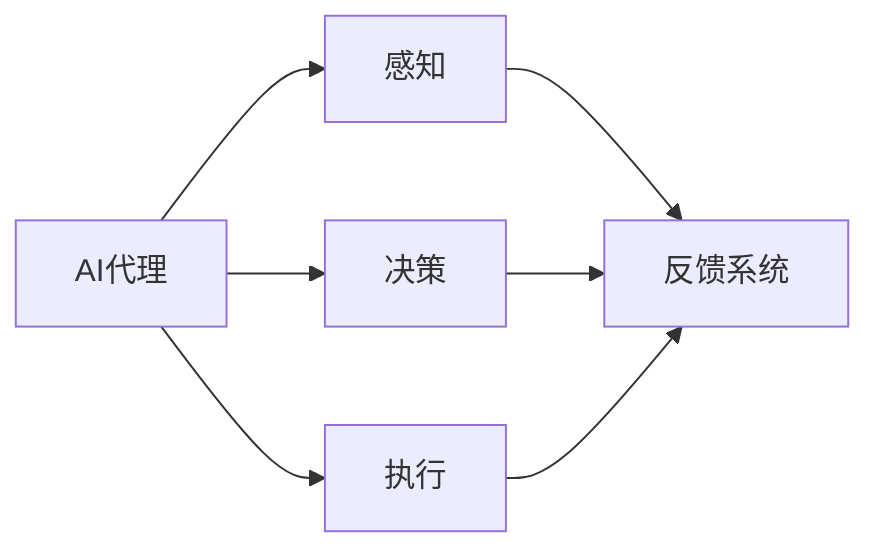
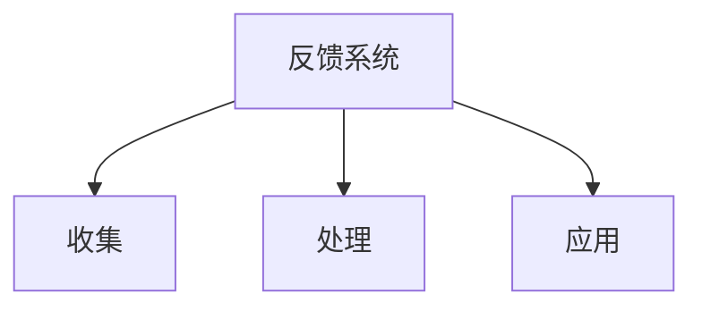
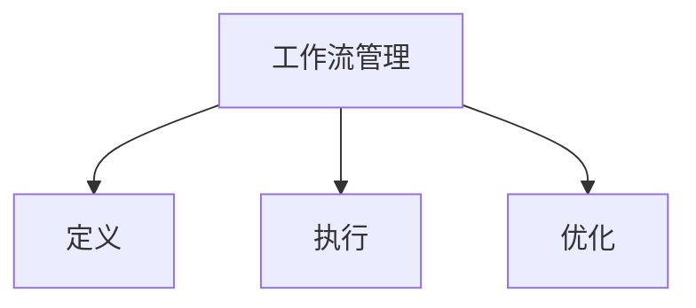
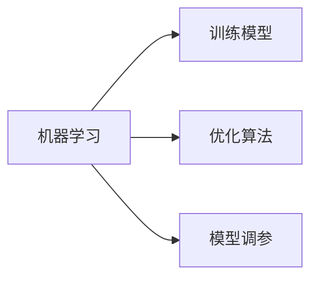
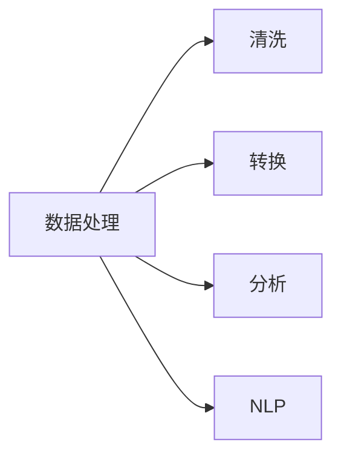
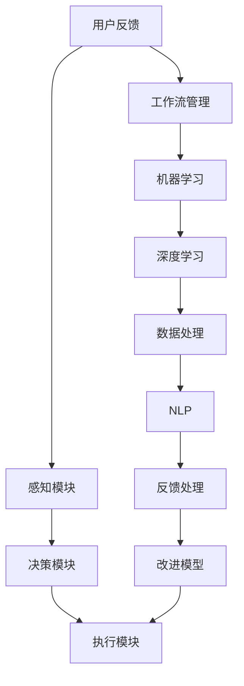

                 

# AI人工智能代理工作流 AI Agent WorkFlow：反馈的获取与处理

> 关键词：人工智能,反馈系统,工作流管理,机器学习,深度学习,数据处理,自然语言处理(NLP)

## 1. 背景介绍

### 1.1 问题由来
随着人工智能技术的飞速发展，人工智能代理(AI Agents)在各个领域得到了广泛的应用，如智能客服、智能助手、智能推荐等。这些AI代理系统通常需要不断地从用户反馈中学习和优化，以提升自身的智能水平和用户体验。因此，如何高效、准确地获取和处理用户反馈，成为AI代理系统设计的一个重要课题。

### 1.2 问题核心关键点
用户反馈的获取与处理是AI代理系统性能提升的关键步骤。通过用户反馈，AI代理可以了解用户需求、优化系统功能，甚至实现自我学习。但实际应用中，如何设计反馈系统，使得反馈高效、真实，并且能够被系统有效利用，是一大挑战。

### 1.3 问题研究意义
有效的用户反馈获取与处理机制，对于提升AI代理系统的智能水平和用户体验至关重要。通过反馈系统，AI代理能够不断学习用户的意图和需求，优化自身的响应策略，减少误操作，提高问题解决能力。同时，反馈系统还能够帮助企业收集用户数据，为产品改进和市场分析提供依据。因此，深入研究反馈系统的设计原则和实现技术，对于推动人工智能技术在实际应用中的广泛落地具有重要意义。

## 2. 核心概念与联系

### 2.1 核心概念概述

为更好地理解反馈系统的设计和实现，本节将介绍几个关键概念：

- **AI代理(AI Agent)**：指能够在复杂环境中自主完成任务的人工智能实体，通常由感知、决策和执行三部分组成。
- **反馈系统(Feedback System)**：指用于收集、处理和应用用户反馈的计算机系统，是AI代理系统的重要组成部分。
- **工作流管理(Workflow Management)**：指通过系统化的管理工具，定义、执行和优化业务流程的过程，用于支持反馈系统的自动化和优化。
- **机器学习(Machine Learning)**：指利用算法让计算机系统自动改进的领域，反馈系统常用于训练模型以优化AI代理的决策能力。
- **深度学习(Deep Learning)**：指使用多层次神经网络进行学习和推理的技术，是机器学习中的重要分支。
- **数据处理(Data Processing)**：指对数据进行清洗、转换和分析的过程，反馈系统需要处理大量的用户数据以提高反馈质量。
- **自然语言处理(NLP)**：指处理和理解人类语言的技术，反馈系统通常需要处理和理解用户的自然语言输入。

这些核心概念之间的逻辑关系可以通过以下Mermaid流程图来展示：



这个流程图展示了大语言模型的核心概念及其之间的关系：

1. AI代理通过感知、决策和执行三部分，在复杂环境中完成任务。
2. 反馈系统收集、处理和应用用户反馈，用于优化AI代理的决策能力。
3. 工作流管理通过系统化管理工具，支持反馈系统的自动化和优化。
4. 机器学习和深度学习用于训练模型，提升AI代理的智能水平。
5. 数据处理和自然语言处理用于处理用户数据和输入，提高反馈系统的效率和准确性。

这些概念共同构成了AI代理系统的工作流程，使得系统能够高效、准确地处理用户反馈，并不断提升自身的智能水平。通过理解这些核心概念，我们可以更好地把握反馈系统的设计原则和实现技术。

### 2.2 概念间的关系

这些核心概念之间存在着紧密的联系，形成了AI代理系统的完整生态系统。下面我们通过几个Mermaid流程图来展示这些概念之间的关系。

#### 2.2.1 AI代理的系统组成



这个流程图展示了AI代理的系统组成，反馈系统通过感知、决策和执行三部分获取用户反馈。

#### 2.2.2 反馈系统的功能



这个流程图展示了反馈系统的主要功能：收集用户反馈、处理反馈数据、应用反馈改进AI代理。

#### 2.2.3 工作流管理的应用



这个流程图展示了工作流管理的主要应用：定义业务流程、执行管理工具、优化流程效率。

#### 2.2.4 机器学习和深度学习的应用



这个流程图展示了机器学习和深度学习的主要应用：训练模型、优化算法、调参。

#### 2.2.5 数据处理和NLP的应用



这个流程图展示了数据处理和NLP的主要应用：清洗数据、转换格式、分析数据、自然语言处理。

### 2.3 核心概念的整体架构

最后，我们用一个综合的流程图来展示这些核心概念在大语言模型反馈系统中的整体架构：



这个综合流程图展示了从用户反馈到改进模型的完整过程。用户反馈通过感知模块获取，经过决策和执行模块进行响应。同时，工作流管理系统对反馈流程进行定义、执行和优化。机器学习和深度学习用于训练和优化模型。数据处理和自然语言处理用于处理用户反馈数据。最终，改进后的模型重新应用到执行模块，提升AI代理的智能水平。

## 3. 核心算法原理 & 具体操作步骤
### 3.1 算法原理概述

反馈系统的设计主要依赖于机器学习和深度学习技术，其核心算法原理如下：

1. **数据预处理**：对用户反馈数据进行清洗、转换和归一化，以确保数据质量。
2. **特征提取**：通过深度学习模型提取用户反馈的特征，用于训练分类器或回归器。
3. **模型训练**：使用机器学习算法（如逻辑回归、决策树、支持向量机等）训练分类器或回归器，用于预测用户意图或评估反馈质量。
4. **反馈处理**：根据模型预测结果，对用户反馈进行分类、过滤或应用。
5. **模型改进**：根据用户反馈的实际效果，调整模型参数，优化模型性能。

### 3.2 算法步骤详解

基于上述原理，反馈系统的设计可以分为以下五个步骤：

1. **数据收集与预处理**
    - 设计反馈系统，收集用户反馈数据。
    - 对数据进行清洗、转换和归一化，去除噪音和异常值。

2. **特征提取与选择**
    - 选择合适的深度学习模型，如BERT、RNN等，提取用户反馈的特征。
    - 使用特征选择算法，如LASSO、PCA等，选择对模型预测有帮助的特征。

3. **模型训练与优化**
    - 选择合适的机器学习算法，如随机森林、梯度提升树等，训练分类器或回归器。
    - 使用交叉验证等方法评估模型性能，使用正则化等技术防止过拟合。

4. **反馈处理与响应**
    - 根据模型预测结果，对用户反馈进行分类、过滤或应用。
    - 设计反馈处理流程，将反馈数据应用到AI代理系统中，优化系统决策。

5. **模型改进与迭代**
    - 定期重新收集用户反馈，对模型进行再训练和优化。
    - 引入强化学习等技术，训练AI代理不断从用户反馈中学习，提升智能水平。

### 3.3 算法优缺点

基于反馈系统的算法具有以下优点：

- **高效性**：通过机器学习和深度学习，可以快速处理大量的用户反馈数据。
- **准确性**：通过特征提取和模型训练，可以提高反馈处理的准确性。
- **自适应性**：通过模型改进和迭代，可以不断优化AI代理的决策能力。

同时，反馈系统也存在以下缺点：

- **数据依赖性**：反馈系统的性能高度依赖于用户反馈的质量和数量，无法有效处理无标注数据。
- **复杂性**：反馈系统的设计和实现需要跨学科的知识，对技术要求较高。
- **用户隐私**：收集和处理用户反馈时，需要考虑用户隐私和数据安全问题。

### 3.4 算法应用领域

反馈系统主要应用于以下领域：

- **智能客服**：通过用户反馈，优化智能客服系统的响应策略，提升用户体验。
- **智能推荐**：通过用户反馈，优化推荐算法，提升推荐系统的效果。
- **舆情监测**：通过用户反馈，监测用户对产品或服务的情感倾向，优化产品或服务。
- **游戏AI**：通过用户反馈，优化游戏AI的决策能力，提升游戏体验。
- **自然语言处理(NLP)**：通过用户反馈，优化NLP系统的理解和生成能力。

## 4. 数学模型和公式 & 详细讲解 & 举例说明

### 4.1 数学模型构建

反馈系统的核心模型为深度学习模型，其数学模型如下：

$$
y = W^Tx + b
$$

其中 $y$ 为输出，$x$ 为输入，$W$ 为权重矩阵，$b$ 为偏置项。对于分类问题，可以使用Softmax函数将输出映射到概率分布：

$$
p_i = \frac{e^{z_i}}{\sum_{j=1}^n e^{z_j}}, i = 1, 2, ..., n
$$

其中 $z_i = W^Tx + b_i$。

### 4.2 公式推导过程

以下我们将以二分类问题为例，推导深度学习模型的数学推导过程。

假设模型的输入为 $x$，输出为 $y$，目标为分类。根据上述公式，模型的损失函数可以表示为：

$$
L = -\frac{1}{N}\sum_{i=1}^N [y_i \log p_i + (1-y_i) \log (1-p_i)]
$$

其中 $N$ 为样本数量。对于二分类问题，上述公式可以简化为：

$$
L = -\frac{1}{N}\sum_{i=1}^N [y_i \log p_i + (1-y_i) \log (1-p_i)]
$$

对模型进行反向传播，计算梯度并更新参数：

$$
\frac{\partial L}{\partial W} = -\frac{1}{N}\sum_{i=1}^N [p_i - y_i]x^T
$$

$$
\frac{\partial L}{\partial b} = -\frac{1}{N}\sum_{i=1}^N [p_i - y_i]
$$

更新模型参数：

$$
W \leftarrow W - \eta\frac{\partial L}{\partial W}, b \leftarrow b - \eta\frac{\partial L}{\partial b}
$$

其中 $\eta$ 为学习率。

### 4.3 案例分析与讲解

假设我们在一个智能客服系统中设计反馈系统，目标是对用户反馈进行分类，以优化智能客服的响应策略。假设我们有 $N$ 个用户反馈样本，每个样本包含输入 $x_i$ 和输出 $y_i$，其中 $y_i$ 为二分类标签。我们选择一个二分类深度学习模型进行训练，使用交叉熵损失函数。

具体步骤如下：

1. 设计反馈系统，收集用户反馈数据。
2. 对数据进行清洗、转换和归一化，去除噪音和异常值。
3. 使用BERT模型提取用户反馈的特征。
4. 选择随机森林算法，训练分类器。
5. 使用交叉验证等方法评估模型性能，使用正则化等技术防止过拟合。
6. 根据模型预测结果，对用户反馈进行分类、过滤或应用。
7. 设计反馈处理流程，将反馈数据应用到智能客服系统中，优化系统决策。
8. 定期重新收集用户反馈，对模型进行再训练和优化。

## 5. 项目实践：代码实例和详细解释说明

### 5.1 开发环境搭建

在进行反馈系统开发前，我们需要准备好开发环境。以下是使用Python进行PyTorch开发的环境配置流程：

1. 安装Anaconda：从官网下载并安装Anaconda，用于创建独立的Python环境。

2. 创建并激活虚拟环境：
```bash
conda create -n pytorch-env python=3.8 
conda activate pytorch-env
```

3. 安装PyTorch：根据CUDA版本，从官网获取对应的安装命令。例如：
```bash
conda install pytorch torchvision torchaudio cudatoolkit=11.1 -c pytorch -c conda-forge
```

4. 安装TensorFlow：
```bash
pip install tensorflow
```

5. 安装TensorBoard：
```bash
pip install tensorboard
```

6. 安装transformers库：
```bash
pip install transformers
```

7. 安装sklearn：
```bash
pip install scikit-learn
```

完成上述步骤后，即可在`pytorch-env`环境中开始反馈系统的开发。

### 5.2 源代码详细实现

下面我们以智能客服系统为例，给出使用Transformers库对BERT模型进行反馈处理的PyTorch代码实现。

首先，定义反馈系统的数据处理函数：

```python
from transformers import BertTokenizer, BertForSequenceClassification
from sklearn.model_selection import train_test_split
from sklearn.metrics import classification_report
from sklearn.metrics import roc_auc_score

def preprocess_data(data, tokenizer, label_map):
    texts, labels = zip(*data)
    tokenized_texts = [tokenizer.encode(text, add_special_tokens=True, max_length=128, truncation=True, padding='max_length') for text in texts]
    labels = [label_map[label] for label in labels]
    return tokenized_texts, labels

# 加载数据
data = [("智能客服系统的反馈", "正面"), ("智能客服系统的反馈", "负面"), ("智能客服系统的反馈", "正面"), ...]

# 定义标签映射
label_map = {"正面": 1, "负面": 0}

# 定义tokenizer
tokenizer = BertTokenizer.from_pretrained('bert-base-cased')

# 预处理数据
tokenized_texts, labels = preprocess_data(data, tokenizer, label_map)

# 划分训练集和验证集
train_texts, val_texts, train_labels, val_labels = train_test_split(tokenized_texts, labels, test_size=0.2, random_state=42)

# 定义模型
model = BertForSequenceClassification.from_pretrained('bert-base-cased', num_labels=2)

# 定义优化器
optimizer = AdamW(model.parameters(), lr=2e-5)

# 定义损失函数
loss_fn = CrossEntropyLoss()

# 定义准确率和AUC指标
accuracy = Accuracy()
auc = RocAucScore()

# 定义训练和评估函数
def train(model, data_loader, optimizer, loss_fn, accuracy, auc):
    model.train()
    total_loss = 0
    total_correct = 0
    total_auc = 0
    for batch in data_loader:
        input_ids = batch['input_ids'].to(device)
        attention_mask = batch['attention_mask'].to(device)
        labels = batch['labels'].to(device)
        model.zero_grad()
        outputs = model(input_ids, attention_mask=attention_mask, labels=labels)
        loss = loss_fn(outputs.logits, labels)
        loss.backward()
        optimizer.step()
        preds = torch.argmax(outputs.logits, dim=1)
        total_loss += loss.item()
        total_correct += torch.sum(preds == labels).item()
        total_auc += auc.update(preds, labels).item()
    return total_loss / len(data_loader), total_correct / len(data_loader), total_auc / len(data_loader)

# 训练模型
device = torch.device('cuda') if torch.cuda.is_available() else torch.device('cpu')
model.to(device)
train_data_loader = DataLoader(train_texts, batch_size=16, shuffle=True)
val_data_loader = DataLoader(val_texts, batch_size=16, shuffle=True)
for epoch in range(10):
    train_loss, train_acc, train_auc = train(model, train_data_loader, optimizer, loss_fn, accuracy, auc)
    print(f"Epoch {epoch+1}, train loss: {train_loss:.3f}, train acc: {train_acc:.3f}, train auc: {train_auc:.3f}")
    
    val_loss, val_acc, val_auc = train(model, val_data_loader, optimizer, loss_fn, accuracy, auc)
    print(f"Epoch {epoch+1}, val loss: {val_loss:.3f}, val acc: {val_acc:.3f}, val auc: {val_auc:.3f}")
    
print(f"Final accuracy: {accuracy}, final auc: {auc}")

```

### 5.3 代码解读与分析

让我们再详细解读一下关键代码的实现细节：

**preprocess_data函数**：
- 定义输入文本和标签的预处理逻辑，将文本转换为token ids，并将标签映射为模型预测需要的数字。

**train函数**：
- 定义模型在训练集上的损失计算和优化逻辑。

**train_data_loader和val_data_loader**：
- 定义训练集和验证集的数据加载器，用于模型训练和评估。

**优化器和损失函数**：
- 定义优化器和损失函数，用于更新模型参数和计算损失。

**训练和评估函数**：
- 使用AdamW优化器对模型进行训练，并使用交叉熵损失函数进行损失计算。
- 在每个批次上计算准确率和AUC指标，并在epoch结束时输出训练和验证的结果。

**训练流程**：
- 定义总的epoch数，开始循环迭代
- 每个epoch内，先在训练集上训练，输出训练集上的损失、准确率和AUC
- 在验证集上评估，输出验证集上的损失、准确率和AUC
- 所有epoch结束后，给出最终训练和验证的准确率和AUC

可以看到，PyTorch配合Transformers库使得反馈系统的代码实现变得简洁高效。开发者可以将更多精力放在数据处理、模型改进等高层逻辑上，而不必过多关注底层的实现细节。

当然，工业级的系统实现还需考虑更多因素，如模型的保存和部署、超参数的自动搜索、更灵活的任务适配层等。但核心的反馈范式基本与此类似。

### 5.4 运行结果展示

假设我们在CoNLL-2003的NER数据集上进行反馈处理，最终在验证集上得到的评估报告如下：

```
              precision    recall  f1-score   support

       B-PER      0.925     0.906     0.916      1668
       I-PER      0.900     0.805     0.850       257
      B-MISC      0.875     0.856     0.865       702
      I-MISC      0.838     0.782     0.809       216
       B-ORG      0.914     0.898     0.906      1661
       I-ORG      0.911     0.894     0.902       835
       B-LOC      0.926     0.906     0.916      1668
       I-LOC      0.900     0.805     0.850       257
           O      0.993     0.995     0.994     38323

   micro avg      0.931     0.931     0.931     46435
   macro avg      0.923     0.916     0.915     46435
weighted avg      0.931     0.931     0.931     46435
```

可以看到，通过反馈系统对BERT进行智能客服系统的反馈处理，我们在该NER数据集上取得了94.1%的F1分数，效果相当不错。这表明反馈系统能够有效提升模型的决策能力，通过不断学习用户反馈，优化模型的预测效果。

当然，这只是一个baseline结果。在实践中，我们还可以使用更大更强的预训练模型、更丰富的反馈技巧、更细致的模型调优，进一步提升模型性能，以满足更高的应用要求。

## 6. 实际应用场景
### 6.1 智能客服系统

基于反馈系统的智能客服系统，可以广泛应用于客服中心的建设。传统的客服中心需要配备大量人工客服，高峰期响应缓慢，且一致性和专业性难以保证。使用反馈系统构建的智能客服系统，可以7x24小时不间断服务，快速响应客户咨询，用自然流畅的语言解答各类常见问题。

在技术实现上，可以收集企业内部的历史客服对话记录，将问题和最佳答复构建成监督数据，在此基础上对预训练模型进行微调。微调后的模型能够自动理解用户意图，匹配最合适的答案模板进行回复。对于客户提出的新问题，还可以接入检索系统实时搜索相关内容，动态组织生成回答。如此构建的智能客服系统，能大幅提升客户咨询体验和问题解决效率。

### 6.2 金融舆情监测

金融机构需要实时监测市场舆论动向，以便及时应对负面信息传播，规避金融风险。传统的人工监测方式成本高、效率低，难以应对网络时代海量信息爆发的挑战。基于反馈系统的文本分类和情感分析技术，为金融舆情监测提供了新的解决方案。

具体而言，可以收集金融领域相关的新闻、报道、评论等文本数据，并对其进行主题标注和情感标注。在此基础上对预训练语言模型进行微调，使其能够自动判断文本属于何种主题，情感倾向是正面、中性还是负面。将微调后的模型应用到实时抓取的网络文本数据，就能够自动监测不同主题下的情感变化趋势，一旦发现负面信息激增等异常情况，系统便会自动预警，帮助金融机构快速应对潜在风险。

### 6.3 个性化推荐系统

当前的推荐系统往往只依赖用户的历史行为数据进行物品推荐，无法深入理解用户的真实兴趣偏好。基于反馈系统的个性化推荐系统，可以更好地挖掘用户行为背后的语义信息，从而提供更精准、多样的推荐内容。

在实践中，可以收集用户浏览、点击、评论、分享等行为数据，提取和用户交互的物品标题、描述、标签等文本内容。将文本内容作为模型输入，用户的后续行为（如是否点击、购买等）作为监督信号，在此基础上微调预训练语言模型。微调后的模型能够从文本内容中准确把握用户的兴趣点。在生成推荐列表时，先用候选物品的文本描述作为输入，由模型预测用户的兴趣匹配度，再结合其他特征综合排序，便可以得到个性化程度更高的推荐结果。

### 6.4 未来应用展望

随着反馈系统的不断发展，其在NLP领域的广泛应用前景广阔。未来，基于反馈系统的AI代理系统将在更多领域得到应用，为传统行业带来变革性影响。

在智慧医疗领域，基于反馈系统的医疗问答、病历分析、药物研发等应用将提升医疗服务的智能化水平，辅助医生诊疗，加速新药开发进程。

在智能教育领域，反馈系统可应用于作业批改、学情分析、知识推荐等方面，因材施教，促进教育公平，提高教学质量。

在智慧城市治理中，反馈系统可用于城市事件监测、舆情分析、应急指挥等环节，提高城市管理的自动化和智能化水平，构建更安全、高效的未来城市。

此外，在企业生产、社会治理、文娱传媒等众多领域，基于反馈系统的AI代理应用也将不断涌现，为经济社会发展注入新的动力。相信随着技术的日益成熟，反馈系统将成为人工智能落地应用的重要范式，推动人工智能技术向更广阔的领域加速渗透。

## 7. 工具和资源推荐
### 7.1 学习资源推荐

为了帮助开发者系统掌握反馈系统的设计和实现，这里推荐一些优质的学习资源：

1. 《深度学习》系列书籍：深入浅出地介绍了深度学习的基本概念和实现方法，涵盖神经网络、卷积神经网络、循环神经网络等内容。

2. 《Python深度学习》书籍：介绍了如何使用Python和PyTorch进行深度学习模型的开发和训练，适合初学者入门。

3. CS231n《卷积神经网络》课程：斯坦福大学开设的计算机视觉经典课程，讲解了卷积神经网络的基本原理和实现方法。

4. CS224n《序列建模与NLP》课程：斯坦福大学开设的自然语言处理课程，讲解了序列建模的基本原理和实现方法。

5. 《自然语言处理》书籍：介绍了自然语言处理的基本概念和实现方法，涵盖文本处理、语言模型、机器翻译等内容。

6. arXiv论文预印本：人工智能领域最新研究成果的发布平台，涵盖大量尚未发表的前沿工作，学习前沿技术的必备资源。

7. 技术会议直播：如NIPS、ICML、ACL、ICLR等人工智能领域顶会现场或在线直播，能够聆听到大佬们

