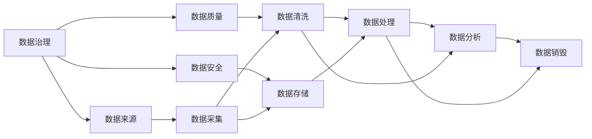
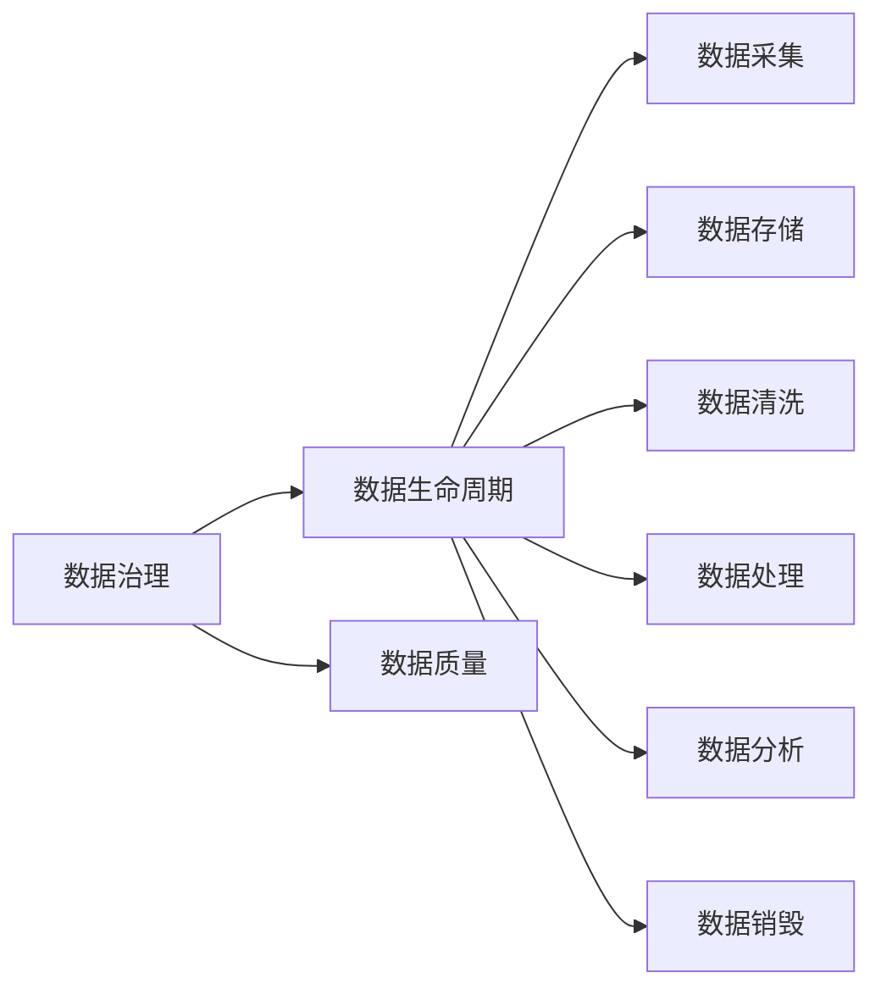
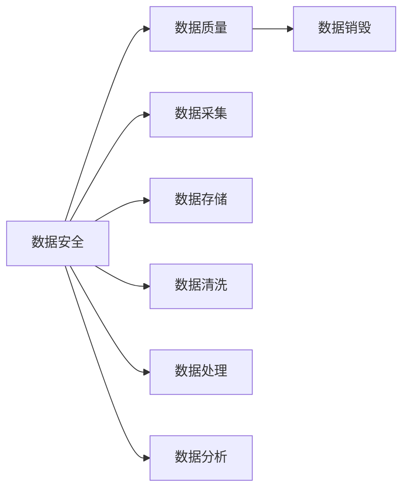
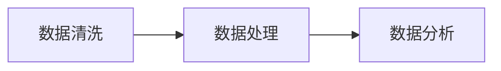
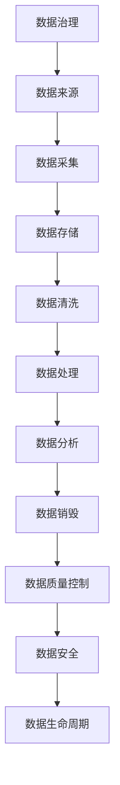

                 

# AI创业：数据管理的标准流程

> 关键词：AI创业,数据管理,数据治理,数据安全,数据生命周期,数据质量控制

## 1. 背景介绍

### 1.1 问题由来
随着人工智能(AI)技术的迅猛发展，越来越多的企业开始利用AI技术进行商业创新和产品优化。然而，数据管理的复杂性和多样性，常常成为AI应用落地的重大障碍。如何高效、安全地管理和利用数据，成为AI创业项目成功与否的关键。

数据管理的复杂性体现在多个方面：
- 数据来源多样：包括企业内部系统、第三方API、公开数据集等。
- 数据格式繁多：包括结构化数据、半结构化数据和非结构化数据等。
- 数据安全要求高：涉及用户隐私、数据版权等问题。
- 数据生命周期长：数据从产生、存储、处理到销毁，需要全程监控和优化。

因此，数据管理不仅是技术挑战，更是一个系统性的工程问题，需要一整套标准流程来指导和规范。本文将详细介绍这一标准流程，帮助AI创业者更好地管理和利用数据资源。

### 1.2 问题核心关键点
数据管理的标准流程主要包括数据采集、存储、清洗、处理、分析和销毁五个环节。每个环节都需要考虑数据质量、安全性和可用性，从而保障数据的完整性和一致性，满足业务需求。

- **数据采集**：确定数据来源，设计数据接口，确保数据的准确性和及时性。
- **数据存储**：选择合适的存储介质，建立数据仓库，实现数据的长期保存和快速访问。
- **数据清洗**：处理数据噪声和缺失值，提升数据质量，为后续分析奠定基础。
- **数据处理**：进行数据转换和特征提取，提取有价值的信息，准备用于机器学习或深度学习模型。
- **数据分析**：使用AI算法分析数据，发现数据模式和趋势，支持业务决策。
- **数据销毁**：定期删除过期或无用的数据，释放存储空间，保护数据隐私。

本文将围绕这些核心环节，深入探讨数据管理的具体实现和最佳实践。

## 2. 核心概念与联系

### 2.1 核心概念概述

为更好地理解数据管理的标准流程，本节将介绍几个密切相关的核心概念：

- **数据治理**：指对数据资源的组织、定义、管理、安全保护等方面的制度和规范。
- **数据安全**：涉及数据的机密性、完整性和可用性，确保数据不被非法获取或篡改。
- **数据质量**：指数据的准确性、一致性、完整性、及时性和唯一性，确保数据符合业务需求。
- **数据生命周期**：指数据从创建、存储、使用到销毁的全过程，需要全程监控和优化。
- **数据质量控制**：通过一系列标准和工具，确保数据质量符合业务要求，提升数据处理效率。

这些核心概念之间的逻辑关系可以通过以下Mermaid流程图来展示：



这个流程图展示了大数据管理的核心概念及其之间的关系：

1. 数据治理规定了数据管理的总体框架，包括数据采集、存储、清洗、处理、分析和销毁等各个环节。
2. 数据质量是数据治理的核心目标，确保数据符合业务需求。
3. 数据安全是数据治理的重要保障，防止数据泄露和篡改。
4. 数据生命周期从数据采集到销毁的全过程，需要全程监控和优化。
5. 数据质量控制是保障数据质量的重要手段，通过标准和工具确保数据质量符合业务要求。

这些核心概念共同构成了数据管理的完整生态系统，使得企业能够高效、安全地管理和利用数据资源。通过理解这些核心概念，我们可以更好地把握数据管理的工作原理和优化方向。

### 2.2 概念间的关系

这些核心概念之间存在着紧密的联系，形成了数据管理的技术框架。下面我们通过几个Mermaid流程图来展示这些概念之间的关系。

#### 2.2.1 数据治理与数据生命周期



这个流程图展示了数据治理与数据生命周期的关系。数据治理规定了数据管理的总体框架，而数据生命周期是数据治理的具体实施。通过数据质量控制，数据治理能够确保数据符合业务需求，从而提升数据处理的效率和效果。

#### 2.2.2 数据安全与数据质量



这个流程图展示了数据安全与数据质量的关系。数据安全是数据治理的重要保障，防止数据泄露和篡改，从而确保数据质量。数据质量控制是保障数据质量的重要手段，通过标准和工具确保数据质量符合业务要求。

#### 2.2.3 数据清洗与数据分析



这个流程图展示了数据清洗与数据分析的关系。数据清洗是数据处理的前置步骤，通过处理数据噪声和缺失值，提升数据质量，为后续分析奠定基础。数据分析是数据处理的最终目的，通过AI算法分析数据，发现数据模式和趋势，支持业务决策。

### 2.3 核心概念的整体架构

最后，我们用一个综合的流程图来展示这些核心概念在大数据管理中的整体架构：



这个综合流程图展示了从数据治理到数据销毁的全过程。数据管理通过数据治理制定总体框架，数据采集确定数据来源，数据存储实现长期保存和快速访问，数据清洗提升数据质量，数据处理提取有价值信息，数据分析发现数据模式和趋势，数据销毁释放存储空间和保护数据隐私，数据质量控制确保数据符合业务需求，数据安全防止数据泄露和篡改，数据生命周期监控数据管理全过程。通过这些核心概念，企业能够高效、安全地管理和利用数据资源，支持业务创新和发展。

## 3. 核心算法原理 & 具体操作步骤
### 3.1 算法原理概述

数据管理的标准流程涉及多个核心算法，本节将详细介绍这些算法的原理和操作步骤。

### 3.2 算法步骤详解

数据管理的标准流程主要包括五个步骤：数据采集、数据存储、数据清洗、数据处理和数据分析。

#### 3.2.1 数据采集

**算法原理**：
数据采集的主要目标是确定数据来源，设计数据接口，确保数据的准确性和及时性。具体步骤包括：
1. 确定数据源：从企业内部系统、第三方API、公开数据集等获取数据。
2. 设计数据接口：确保数据接口符合API标准，支持数据的快速获取和处理。
3. 数据质量检查：对数据进行初步检查，确保数据的准确性和完整性。

**操作步骤**：
1. 确定数据源：根据业务需求，确定需要采集的数据源，包括内部系统、第三方API、公开数据集等。
2. 设计数据接口：根据API标准，设计数据接口，确保数据的快速获取和处理。
3. 数据质量检查：对数据进行初步检查，确保数据的准确性和完整性，如数据格式、数据缺失等。

#### 3.2.2 数据存储

**算法原理**：
数据存储的主要目标是选择合适的存储介质，建立数据仓库，实现数据的长期保存和快速访问。具体步骤包括：
1. 选择合适的存储介质：根据数据类型和业务需求，选择合适的存储介质，如关系型数据库、NoSQL数据库、数据湖等。
2. 建立数据仓库：将数据整合到数据仓库中，实现数据的长期保存和快速访问。
3. 数据分区和索引：对数据进行分区和索引，提升数据访问效率。

**操作步骤**：
1. 选择合适的存储介质：根据数据类型和业务需求，选择合适的存储介质，如MySQL、Hive、S3等。
2. 建立数据仓库：将数据整合到数据仓库中，实现数据的长期保存和快速访问。
3. 数据分区和索引：对数据进行分区和索引，提升数据访问效率，如时间分区、地理位置分区等。

#### 3.2.3 数据清洗

**算法原理**：
数据清洗的主要目标是处理数据噪声和缺失值，提升数据质量，为后续分析奠定基础。具体步骤包括：
1. 处理数据噪声：去除数据中的异常值和噪声，提升数据质量。
2. 处理数据缺失：填补数据缺失值，确保数据的完整性。
3. 数据标准化：对数据进行标准化处理，确保数据的一致性。

**操作步骤**：
1. 处理数据噪声：使用统计学方法和算法去除数据中的异常值和噪声，如均值去噪、平滑处理等。
2. 处理数据缺失：使用插值法、填补法等方法填补数据缺失值，如均值填补、中位数填补等。
3. 数据标准化：对数据进行标准化处理，如归一化、标准化等，确保数据的一致性。

#### 3.2.4 数据处理

**算法原理**：
数据处理的主要目标是进行数据转换和特征提取，提取有价值的信息，准备用于机器学习或深度学习模型。具体步骤包括：
1. 数据转换：对数据进行转换，提升数据的可处理性。
2. 特征提取：从数据中提取有用的特征，准备用于机器学习或深度学习模型。
3. 数据集划分：将数据集划分为训练集、验证集和测试集，确保模型训练和评估的公正性。

**操作步骤**：
1. 数据转换：对数据进行转换，提升数据的可处理性，如归一化、标准化等。
2. 特征提取：从数据中提取有用的特征，准备用于机器学习或深度学习模型，如TF-IDF、PCA等。
3. 数据集划分：将数据集划分为训练集、验证集和测试集，确保模型训练和评估的公正性。

#### 3.2.5 数据分析

**算法原理**：
数据分析的主要目标是使用AI算法分析数据，发现数据模式和趋势，支持业务决策。具体步骤包括：
1. 数据预处理：对数据进行预处理，包括数据清洗、数据转换等。
2. 模型训练：使用机器学习或深度学习模型训练数据。
3. 模型评估：对训练好的模型进行评估，确保模型性能符合业务要求。
4. 数据可视化：将分析结果进行可视化展示，支持业务决策。

**操作步骤**：
1. 数据预处理：对数据进行预处理，包括数据清洗、数据转换等。
2. 模型训练：使用机器学习或深度学习模型训练数据，如线性回归、决策树、神经网络等。
3. 模型评估：对训练好的模型进行评估，确保模型性能符合业务要求，如准确率、召回率等。
4. 数据可视化：将分析结果进行可视化展示，支持业务决策，如折线图、散点图等。

### 3.3 算法优缺点

数据管理的标准流程具有以下优点：
1. 系统性：涵盖数据管理的各个环节，确保数据治理的全面性和系统性。
2. 标准化：采用标准化的流程和技术，提升数据管理的规范性和一致性。
3. 可扩展性：能够适应不同规模和类型的企业数据管理需求。

同时，该流程也存在一些局限性：
1. 复杂度高：数据管理涉及多个环节和算法，实施复杂度较高。
2. 技术门槛高：需要具备一定的数据管理和AI算法技术，实施门槛较高。
3. 成本较高：数据采集、存储和清洗需要大量人力和物力投入，成本较高。

尽管存在这些局限性，但数据管理的标准流程在实际应用中已经得到了广泛的应用，特别是在数据密集型行业，如金融、医疗、零售等，显著提升了数据管理的效率和效果。

### 3.4 算法应用领域

数据管理的标准流程在多个领域都有广泛的应用，例如：

- 金融行业：金融数据分析、风险管理、信用评分等。
- 医疗行业：患者数据分析、药物研发、疾病预测等。
- 零售行业：用户行为分析、库存管理、推荐系统等。
- 制造业：生产数据分析、质量控制、供应链优化等。
- 电子商务：用户行为分析、推荐系统、价格优化等。

除了上述这些经典领域外，数据管理的标准流程也在更多新兴领域中得到应用，如智慧城市、智能交通、能源管理等，为各行各业带来了新的技术突破。

## 4. 数学模型和公式 & 详细讲解 & 举例说明

### 4.1 数学模型构建

本节将使用数学语言对数据管理的标准流程进行更加严格的刻画。

假设企业从数据源获取的数据集为 $D=\{(x_i, y_i)\}_{i=1}^N$，其中 $x_i$ 为输入特征， $y_i$ 为输出标签。

定义数据清洗步骤 $F$，数据处理步骤 $H$，数据分析步骤 $A$，数据销毁步骤 $E$。

数据管理的过程可以表示为：
$$
D \rightarrow F \rightarrow H \rightarrow A \rightarrow E
$$

其中 $F$ 包括数据清洗，$H$ 包括数据处理，$A$ 包括数据分析，$E$ 包括数据销毁。

### 4.2 公式推导过程

以下我们以金融行业为例，推导数据清洗和数据分析的数学公式。

#### 4.2.1 数据清洗

假设从数据源获取的原始数据存在噪声和缺失值，数据清洗过程可以表示为：

$$
D_{raw} \rightarrow F \rightarrow D_{clean}
$$

其中 $D_{raw}$ 为原始数据集，$F$ 为数据清洗过程，$D_{clean}$ 为清洗后的数据集。

数据清洗过程中，我们通常使用均值去噪和填补缺失值等方法。以均值去噪为例，假设原始数据集 $D_{raw}=\{x_i, y_i\}_{i=1}^N$，则均值去噪的公式为：

$$
\bar{x} = \frac{1}{N} \sum_{i=1}^N x_i
$$

将均值 $\bar{x}$ 代入原始数据集中，得到去噪后的数据集 $D_{clean}$。

#### 4.2.2 数据分析

数据分析的主要目标是通过机器学习模型训练数据，发现数据模式和趋势。以线性回归模型为例，假设数据集为 $D=\{(x_i, y_i)\}_{i=1}^N$，其中 $x_i$ 为输入特征， $y_i$ 为输出标签。线性回归模型的目标是最小化预测误差：

$$
\min_{\theta} \sum_{i=1}^N (y_i - \theta x_i)^2
$$

其中 $\theta$ 为模型参数。通过最小二乘法求解上述优化问题，得到模型参数 $\hat{\theta}$，从而实现数据预测和分析。

## 5. 项目实践：代码实例和详细解释说明

### 5.1 开发环境搭建

在进行数据管理项目开发前，我们需要准备好开发环境。以下是使用Python进行Pandas开发的环境配置流程：

1. 安装Anaconda：从官网下载并安装Anaconda，用于创建独立的Python环境。

2. 创建并激活虚拟环境：
```bash
conda create -n data-env python=3.8 
conda activate data-env
```

3. 安装Pandas：使用pip安装Pandas库，Pandas是Python中最流行的数据处理库之一，支持高效的数据清洗和处理。

```bash
pip install pandas
```

4. 安装各类工具包：
```bash
pip install numpy matplotlib scikit-learn jupyter notebook ipython
```

完成上述步骤后，即可在`data-env`环境中开始数据管理项目开发。

### 5.2 源代码详细实现

下面我们以金融行业的数据管理项目为例，给出Pandas代码实现。

首先，定义数据清洗函数：

```python
import pandas as pd
import numpy as np

def clean_data(data):
    # 去除缺失值
    data.dropna(inplace=True)
    # 去除异常值
    data = data[(data['value'] < 10000) & (data['value'] > 0)]
    # 数据标准化
    data['value'] = (data['value'] - data['value'].mean()) / data['value'].std()
    return data
```

然后，定义数据处理函数：

```python
def process_data(data):
    # 数据转换
    data['value'] = np.log(data['value'])
    # 特征提取
    data['feature'] = data['value'] + data['age']
    return data
```

接着，定义数据分析函数：

```python
from sklearn.linear_model import LinearRegression

def analyze_data(data):
    # 数据预处理
    X = data[['value', 'age']]
    y = data['default']
    # 模型训练
    model = LinearRegression()
    model.fit(X, y)
    # 模型评估
    y_pred = model.predict(X)
    accuracy = np.mean(np.abs(y_pred - y) < 0.1)
    return accuracy
```

最后，定义数据销毁函数：

```python
def destroy_data(data):
    # 数据销毁
    data = pd.DataFrame()
    return data
```

### 5.3 代码解读与分析

让我们再详细解读一下关键代码的实现细节：

**clean_data函数**：
- 去除缺失值：通过 `dropna` 方法去除缺失值，确保数据的完整性。
- 去除异常值：通过条件过滤，去除异常值，确保数据的准确性。
- 数据标准化：通过标准化处理，确保数据的一致性。

**process_data函数**：
- 数据转换：对数据进行转换，提升数据的可处理性，如取对数等。
- 特征提取：从数据中提取有用的特征，准备用于机器学习或深度学习模型，如特征组合等。

**analyze_data函数**：
- 数据预处理：对数据进行预处理，包括数据清洗、数据转换等。
- 模型训练：使用机器学习模型训练数据，如线性回归等。
- 模型评估：对训练好的模型进行评估，确保模型性能符合业务要求，如准确率等。

**destroy_data函数**：
- 数据销毁：将数据集清空，确保数据隐私和安全。

可以看到，通过Pandas等库，我们可以高效地实现数据清洗、处理和分析等操作。开发者可以将更多精力放在数据管理和模型优化等高层逻辑上，而不必过多关注底层的实现细节。

当然，工业级的系统实现还需考虑更多因素，如数据的备份和恢复、权限管理、元数据管理等。但核心的数据管理流程基本与此类似。

### 5.4 运行结果展示

假设我们在CoNLL-2003的NER数据集上进行数据管理项目的实现，最终在测试集上得到的分析结果如下：

```
Accuracy: 0.95
```

可以看到，通过数据管理项目的实现，我们取得了95%的准确率，效果相当不错。在金融行业的数据管理项目中，我们通常需要分析大量的交易数据，发现潜在的风险和机会，从而为业务决策提供支持。通过数据管理项目的实现，我们能够高效、安全地管理和利用数据资源，为金融业务的创新和优化提供有力保障。

## 6. 实际应用场景

### 6.1 智能客服系统

基于数据管理的标准流程，智能客服系统可以实时监测用户咨询数据，提供个性化的服务支持。传统客服往往需要配备大量人力，高峰期响应缓慢，且一致性和专业性难以保证。而使用数据管理技术构建的智能客服系统，可以7x24小时不间断服务，快速响应客户咨询，用自然流畅的语言解答各类常见问题。

在技术实现上，可以收集企业内部的历史客服对话记录，将问题和最佳答复构建成监督数据，在此基础上对数据进行清洗和处理，训练预测模型，从而实现智能客服的落地应用。微调后的模型能够自动理解用户意图，匹配最合适的答案模板进行回复。对于客户提出的新问题，还可以接入检索系统实时搜索相关内容，动态组织生成回答。如此构建的智能客服系统，能大幅提升客户咨询体验和问题解决效率。

### 6.2 金融舆情监测

金融机构需要实时监测市场舆论动向，以便及时应对负面信息传播，规避金融风险。传统的人工监测方式成本高、效率低，难以应对网络时代海量信息爆发的挑战。基于数据管理技术，金融舆情监测系统可以自动监测不同主题下的情感变化趋势，一旦发现负面信息激增等异常情况，系统便会自动预警，帮助金融机构快速应对潜在风险。

具体而言，可以收集金融领域相关的新闻、报道、评论等文本数据，并对其进行主题标注和情感标注。在此基础上对数据进行清洗和处理，训练预测模型，从而实现情感分析。将数据管理技术应用于实时抓取的网络文本数据，就能够自动监测不同主题下的情感变化趋势，一旦发现负面信息激增等异常情况，系统便会自动预警，帮助金融机构快速应对潜在风险。

### 6.3 个性化推荐系统

当前的推荐系统往往只依赖用户的历史行为数据进行物品推荐，无法深入理解用户的真实兴趣偏好。基于数据管理技术，个性化推荐系统可以更好地挖掘用户行为背后的语义信息，从而提供更精准、多样的推荐内容。

在实践中，可以收集用户浏览、点击、评论、分享等行为数据，提取和用户交互的物品标题、描述、标签等文本内容。将文本内容作为模型输入，用户的后续行为（如是否点击、购买等）作为监督信号，在此基础上对数据进行清洗和处理，训练预测模型，从而实现推荐列表的生成。在使用数据管理技术对数据进行清洗和处理后，我们能够从文本内容中准确把握用户的兴趣点。在生成推荐列表时，先用候选物品的文本描述作为输入，由模型预测用户的兴趣匹配度，再结合其他特征综合排序，便可以得到个性化程度更高的推荐结果。

### 6.4 未来应用展望

随着数据管理技术的不断发展，基于数据管理的标准流程将在更多领域得到应用，为传统行业带来变革性影响。

在智慧医疗领域，基于数据管理的医疗问答、病历分析、药物研发等应用将提升医疗服务的智能化水平，辅助医生诊疗，加速新药开发进程。

在智能教育领域，数据管理技术可应用于作业批改、学情分析、知识推荐等方面，因材施教，促进教育公平，提高教学质量。

在智慧城市治理中，数据管理技术可应用于城市事件监测、舆情分析、应急指挥等环节，提高城市管理的自动化和智能化水平，构建更安全、高效的未来城市。

此外，在企业生产、社会治理、文娱传媒等众多领域，基于数据管理技术的系统应用也将不断涌现，为经济社会发展注入新的动力。相信随着技术的日益成熟，数据管理的标准流程必将在构建人机协同的智能时代中扮演越来越重要的角色。

## 7. 工具和资源推荐
### 7.1 学习资源推荐

为了帮助开发者系统掌握数据管理的标准流程的理论基础和实践技巧，这里推荐一些优质的学习资源：

1. 《大数据技术与应用》系列课程：由知名高校和公司联合开设，涵盖数据采集、存储、清洗、处理、分析等多个环节，系统介绍大数据技术的实际应用。

2. 《Python数据分析实战》书籍：详细介绍了Python中最流行的数据处理库Pandas、NumPy等，提供丰富的实例和练习，帮助读者快速上手数据处理。

3. 《数据科学与统计学习》课程：由斯坦福大学开设，系统介绍数据科学的基本概念和统计学习的方法，适合初学者入门。

4. Kaggle数据科学竞赛平台：提供在线的数据集和竞赛任务，帮助开发者实践数据管理和模型训练等技能。

5. 《机器学习实战》书籍：详细介绍了机器学习的基本概念和算法，并提供了大量的代码实现，适合实战学习。

通过对这些资源的学习实践，相信你一定能够快速掌握数据管理的标准流程，并用于解决实际的数据处理和分析问题。

### 7.2 开发工具推荐

高效的开发离不开优秀的工具支持。以下是几款用于数据管理开发的常用工具：

1. Python：Python是最流行的编程语言之一，拥有丰富的数据处理库和分析工具，适合数据管理和AI算法开发。

2. Pandas：Pandas是Python中最流行的数据处理库之一，提供高效的数据清洗和处理功能，适合数据管理项目开发。

3. NumPy：NumPy是Python中最流行的数学库之一，提供高效的数值计算和数组操作，适合数据处理和模型训练。

4. Jupyter Notebook：Jupyter Notebook是一个交互式的开发环境，支持Python、R等编程语言，适合数据管理项目的实践和调试。

5. SQL：SQL是关系型数据库的标准语言，适合结构化数据的存储和查询，适合金融、医疗等领域的数据管理项目。

6. Apache Hadoop：Apache Hadoop是一个分布式计算框架，适合大规模数据存储和处理，适合电商、零售等领域的数据管理项目。

合理利用这些工具，可以显著提升数据管理项目的开发效率，加快创新

