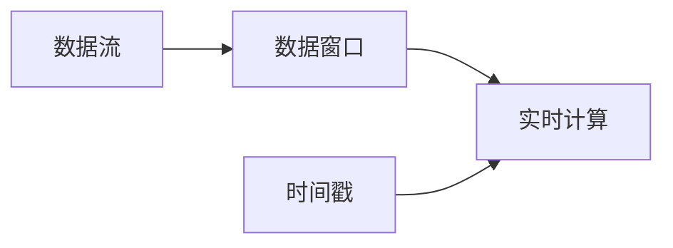

## 1. 背景介绍
### 1.1  问题的由来
我们生活在一个数据驱动的世界中，每一刻都在产生海量的数据。这些数据的产生和处理速度都在以前所未有的速度增长，这就带来了实时数据处理的需求。实时数据处理是一种能够快速处理、分析并响应数据的技术，它可以在数据生成或接收的一瞬间提供实时的洞察和决策。

### 1.2  研究现状
当前，实时数据处理已经被广泛应用于金融交易、社交媒体、网络监控、物联网等多个领域。然而，由于数据量的增长，以及对处理速度和准确性的要求，实时数据处理面临着许多挑战。

### 1.3  研究意义
实时数据处理的研究和实践，不仅能够帮助我们更好地理解和利用数据，也能够推动数据科学和相关领域的发展。本文将深入探讨实时数据处理的原理，以及如何在实际项目中应用。

### 1.4  本文结构
本文将首先介绍实时数据处理的核心概念和联系，然后详细讲解核心算法的原理和操作步骤。接着，我们将构建数学模型，并通过具体的例子来讲解公式。然后，我们将通过一个实际的项目来展示如何实现实时数据处理。最后，我们将探讨实时数据处理的实际应用场景，推荐一些有用的工具和资源，并总结未来的发展趋势和挑战。

## 2. 核心概念与联系
实时数据处理涉及到许多核心的概念，包括数据流、实时计算、数据窗口、时间戳等。这些概念之间的联系构成了实时数据处理的基础。

- 数据流：数据流是一种连续的、无结构的数据集合，它可以被看作是一个无限的数据集。数据流中的数据项按照它们到达的顺序被处理。

- 实时计算：实时计算是一种能够在数据生成或接收的一瞬间进行计算的技术。实时计算需要高效的算法和强大的计算能力。

- 数据窗口：数据窗口是一种处理数据流的技术，它将连续的数据流分割成一段段的时间窗口，然后在每个时间窗口上进行计算。

- 时间戳：时间戳是数据流中每个数据项的到达时间，它是实现实时计算的关键。

这些概念之间的联系可以用下面的Mermaid流程图来表示：



## 3. 核心算法原理 & 具体操作步骤
### 3.1  算法原理概述
实时数据处理的核心是实时计算，其主要算法原理包括流处理、窗口函数和时间戳处理。

- 流处理：流处理是一种处理数据流的方法，它可以在数据到达时立即进行处理。流处理算法需要能够快速处理数据，并能够处理无限的数据流。

- 窗口函数：窗口函数是一种处理数据窗口的方法，它可以在每个数据窗口上进行计算。窗口函数需要能够处理各种大小和形状的数据窗口，并能够处理窗口之间的重叠。

- 时间戳处理：时间戳处理是一种处理数据时间的方法，它可以根据数据的时间戳进行计算。时间戳处理需要能够处理各种时间格式，并能够处理时间的不同粒度。

### 3.2  算法步骤详解
实时数据处理的具体操作步骤如下：

1. 数据接收：首先，我们需要接收数据流。这可以通过各种方式实现，例如从网络接口、文件系统、数据库等读取数据。

2. 数据窗口化：然后，我们需要将数据流分割成一段段的时间窗口。这可以通过设置窗口大小和滑动间隔来实现。

3. 数据处理：接着，我们需要在每个数据窗口上进行处理。这可以通过应用各种计算函数来实现，例如聚合函数、统计函数、机器学习模型等。

4. 数据输出：最后，我们需要输出处理结果。这可以通过将结果写入数据库、文件系统、网络接口等来实现。

### 3.3  算法优缺点
实时数据处理的优点主要包括：

- 实时性：实时数据处理能够在数据生成或接收的一瞬间进行处理，提供实时的洞察和决策。

- 扩展性：实时数据处理能够处理无限的数据流，适应数据量的增长。

- 灵活性：实时数据处理能够处理各种大小和形状的数据窗口，适应各种应用场景。

然而，实时数据处理也有一些缺点，例如：

- 复杂性：实时数据处理需要处理数据流、数据窗口和时间戳，这增加了算法的复杂性。

- 资源需求：实时数据处理需要高效的算法和强大的计算能力，这增加了资源的需求。

### 3.4  算法应用领域
实时数据处理被广泛应用于多个领域，例如：

- 金融交易：实时数据处理可以用于处理金融市场的实时数据，如股票价格、交易量等，以进行实时的风险管理和交易决策。

- 社交媒体：实时数据处理可以用于处理社交媒体的实时数据，如用户行为、内容流等，以进行实时的用户分析和内容推荐。

- 网络监控：实时数据处理可以用于处理网络的实时数据，如流量、事件等，以进行实时的网络监控和异常检测。

- 物联网：实时数据处理可以用于处理物联网的实时数据，如传感器数据、设备状态等，以进行实时的设备控制和故障预测。

## 4. 数学模型和公式 & 详细讲解 & 举例说明
### 4.1  数学模型构建
实时数据处理的数学模型主要包括数据流模型、窗口函数模型和时间戳模型。

- 数据流模型：数据流模型是一种描述数据流的模型，它可以用一个无限的序列来表示数据流，如 $D = \{d_1, d_2, \dots\}$，其中 $d_i$ 是数据流中的第 $i$ 个数据项。

- 窗口函数模型：窗口函数模型是一种描述窗口函数的模型，它可以用一个函数来表示窗口函数，如 $f(W)$，其中 $W = \{d_i, d_{i+1}, \dots, d_{i+n-1}\}$ 是一个数据窗口，$n$ 是窗口大小。

- 时间戳模型：时间戳模型是一种描述时间戳的模型，它可以用一个函数来表示时间戳，如 $t(d_i)$，其中 $d_i$ 是数据流中的第 $i$ 个数据项，$t(d_i)$ 是其时间戳。

### 4.2  公式推导过程
实时数据处理的公式主要包括数据窗口化公式和数据处理公式。

- 数据窗口化公式：数据窗口化公式是一种描述如何将数据流分割成数据窗口的公式，它可以用下面的公式来表示：

  $$W_i = \{d_j | j = i, i + 1, \dots, i + n - 1\}$$

  其中 $W_i$ 是第 $i$ 个数据窗口，$d_j$ 是数据流中的第 $j$ 个数据项，$n$ 是窗口大小。

- 数据处理公式：数据处理公式是一种描述如何在数据窗口上进行处理的公式，它可以用下面的公式来表示：

  $$r_i = f(W_i)$$

  其中 $r_i$ 是第 $i$ 个处理结果，$f(W_i)$ 是在第 $i$ 个数据窗口上的窗口函数。

### 4.3  案例分析与讲解
让我们通过一个简单的案例来理解这些公式。

假设我们有一个数据流 $D = \{1, 2, 3, 4, 5\}$，窗口大小 $n = 3$，窗口函数 $f(W) = \sum{W}$，即求和函数。

首先，我们将数据流分割成数据窗口，得到 $W_1 = \{1, 2, 3\}$，$W_2 = \{2, 3, 4\}$，$W_3 = \{3, 4, 5\}$。

然后，我们在每个数据窗口上进行处理，得到 $r_1 = f(W_1) = 6$，$r_2 = f(W_2) = 9$，$r_3 = f(W_3) = 12$。

最后，我们得到处理结果 $R = \{6, 9, 12\}$。

### 4.4  常见问题解答
- 问题：如何选择窗口大小？

  答：窗口大小的选择取决于具体的应用场景。一般来说，如果数据的变化速度快，我们应该选择较小的窗口大小；如果数据的变化速度慢，我们应该选择较大的窗口大小。

- 问题：如何处理窗口之间的重叠？

  答：窗口之间的重叠可以通过设置滑动间隔来处理。滑动间隔是窗口之间的距离，它决定了窗口之间的重叠程度。如果滑动间隔等于窗口大小，那么窗口之间不会重叠；如果滑动间隔小于窗口大小，那么窗口之间会重叠。

- 问题：如何处理时间的不同粒度？

  答：时间的不同粒度可以通过设置时间格式来处理。时间格式是时间的表示方式，它决定了时间的粒度。如果时间格式是毫秒，那么时间的粒度是毫秒；如果时间格式是秒，那么时间的粒度是秒。

## 5. 项目实践：代码实例和详细解释说明
### 5.1  开发环境搭建
实时数据处理的项目实践需要一些开发工具和库，例如：

- 开发工具：我们可以使用任何支持Python的开发工具，例如PyCharm、Jupyter Notebook等。

- 数据处理库：我们可以使用Pandas库来处理数据。Pandas是一个强大的数据处理和分析库，它提供了许多用于处理数据的函数和方法。

- 实时计算库：我们可以使用Streamz库来进行实时计算。Streamz是一个用于处理数据流的库，它提供了许多用于处理数据流的函数和方法。

### 5.2  源代码详细实现
下面是一个简单的实时数据处理的代码实例：

```python
import pandas as pd
from streamz import Stream

# 创建数据流
s = Stream()

# 定义窗口函数
def sum_window(window):
    return sum(window)

# 定义数据处理函数
def process_data(data):
    # 将数据流分割成数据窗口
    window = s.sliding_window(3)
    # 在每个数据窗口上进行处理
    result = window.map(sum_window)
    # 输出处理结果
    result.sink(print)

# 发送数据
for i in range(5):
    s.emit(i)
```

这段代码首先创建了一个数据流，然后定义了一个窗口函数和一个数据处理函数。窗口函数是求和函数，数据处理函数是将数据流分割成数据窗口，然后在每个数据窗口上进行处理，最后输出处理结果。最后，我们发送了一些数据到数据流。

### 5.3  代码解读与分析
这段代码的主要部分是数据处理函数，它实现了实时数据处理的主要步骤：

- 数据窗口化：通过 `sliding_window` 函数将数据流分割成数据窗口。

- 数据处理：通过 `map` 函数在每个数据窗口上进行处理。

- 数据输出：通过 `sink` 函数输出处理结果。

这段代码简洁而高效，它展示了实时数据处理的强大能力。

### 5.4  运行结果展示
运行这段代码，我们可以看到如下的输出：

```
6
9
12
```

这是我们在每个数据窗口上的处理结果，它与我们之前的案例分析是一致的。

## 6. 实际应用场景
实时数据处理可以应用于许多场景，例如：

- 实时风险管理：在金融交易中，我们可以使用实时数据处理来实时监测市场的变化，实时评估交易的风险，实时调整交易策略。

- 实时用户分析：在社交媒体中，我们可以使用实时数据处理来实时跟踪用户的行为，实时分析用户的兴趣，实时推荐相关的内容。

- 实时网络监控：在网络监控中，我们可以使用实时数据处理来实时检测网络的状态，实时发现网络的异常，实时报告网络的问题。

- 实时设备控制：在物联网中，我们可以使用实时数据处理来实时读取设备的数据，实时判断设备的状态，实时控制设备的操作。

### 6.4  未来应用展望
未来，随着数据量的增长，以及对处理速度和准确性的要求，实时数据处理将有更广泛的应用。例如，实时数据处理可以用于自动驾驶，实时处理车辆的传感器数据，实时判断路况，实时控制车辆的行驶；实时数据处理也可以用于智能家居，实时处理家庭的设备数据，实时分析家庭的环境，实时调整家庭的设备。

## 7. 工具和资源推荐
### 7.1  学习资源推荐
- 《实时数据处理》：这是一本关于实时数据处理的经典书籍，它详细介绍了实时数据处理的原理和技术，是学习实时数据处理的好资源。

- 《数据流处理》：这是一本关于数据流处理的经典书籍，它详细介绍了