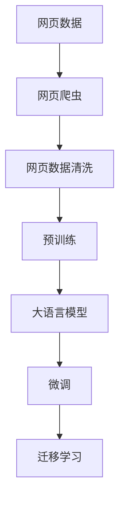
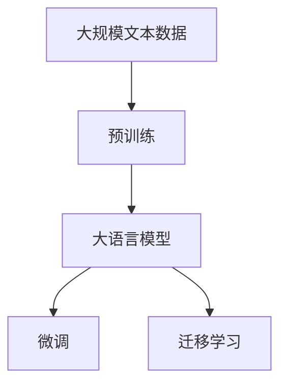
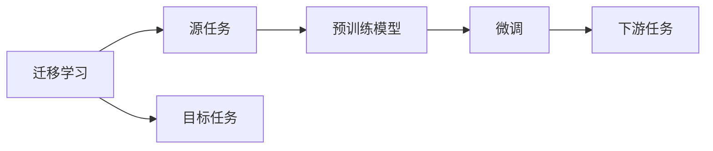

                 

# 大语言模型原理与工程实践：网页数据

> 关键词：大语言模型, 网页数据处理, 自然语言处理(NLP), 深度学习, 网页爬虫, 数据清洗, 文本分类, 信息检索, 网页内容生成

## 1. 背景介绍

### 1.1 问题由来
在现代信息时代，网页数据成为构建知识图谱、挖掘信息、进行自然语言处理（NLP）的重要来源。然而，网页数据往往包含大量噪音和冗余信息，如何高效处理和利用这些数据，是当前NLP领域的一大挑战。

大语言模型（Large Language Models, LLMs）的崛起为这一问题提供了新的解决方案。通过预训练语言模型，我们可以在通用的语言表示基础上，结合网页数据的具体语境，进行任务特定的微调，从而获得更精准的信息理解和分析能力。

本文聚焦于基于大语言模型的网页数据处理技术，从原理到工程实践，深入探讨如何在大规模网页数据上训练和微调语言模型，实现高效的信息提取和处理。

### 1.2 问题核心关键点
网页数据处理的核心在于：

- **数据获取**：使用网页爬虫获取网页数据，并进行初步清洗和预处理。
- **数据标注**：在获取的网页数据上添加有标签样本，为模型提供监督信号。
- **模型微调**：在预训练语言模型的基础上，结合网页数据进行有监督微调，提升模型对特定任务的适应能力。
- **模型部署**：将训练好的模型集成到实际应用系统中，提供稳定高效的信息检索、文本分类、内容生成等能力。

本文将详细介绍大语言模型在网页数据处理中的应用，并通过实例代码和运行结果展示其强大性能。

### 1.3 问题研究意义
大语言模型结合网页数据处理技术，能够在处理大规模无标签网页数据的同时，提高信息的准确性和全面性，这对于文本挖掘、信息检索、内容生成等多个NLP任务具有重要意义：

1. **提高信息准确性**：通过预训练和微调，语言模型能够更准确地理解和提取网页中的关键信息，减少噪音干扰。
2. **增加信息广度**：大模型可以学习到广泛的语言知识和常识，结合网页语境，能够获取更全面的信息。
3. **加速开发进度**：通过自动化的数据处理和模型微调，减少手动操作，提高开发效率。
4. **降低开发成本**：相比从头开发NLP系统，使用大语言模型可以大幅降低数据采集、标注和模型训练的投入。
5. **推动NLP应用普及**：大语言模型易于集成和部署，能够快速应用于各种行业和场景，加速NLP技术的产业化进程。

## 2. 核心概念与联系

### 2.1 核心概念概述

为更好地理解基于网页数据的大语言模型微调方法，本节将介绍几个关键概念：

- **网页数据处理**：使用网页爬虫和数据清洗技术，从网页中提取有用的文本和结构化数据。
- **自然语言处理（NLP）**：利用深度学习等技术，对文本数据进行语义理解、信息提取、文本分类、情感分析等任务。
- **大语言模型（LLMs）**：通过在大规模无标签文本数据上进行预训练，学习通用的语言表示，具备强大的语言理解和生成能力。
- **预训练**：在无标签数据上进行自监督学习任务，学习通用的语言表示。
- **微调（Fine-Tuning）**：在预训练模型的基础上，使用标注数据进行有监督学习，优化模型在特定任务上的性能。
- **迁移学习**：通过预训练模型学习到的通用知识，迁移到特定任务上，减少训练成本和提升模型效果。

这些核心概念之间存在着紧密的联系，共同构成了大语言模型处理网页数据的技术框架。下面通过一个Mermaid流程图来展示这些概念之间的关系：



这个流程图展示了从网页数据到微调模型，再到迁移学习的大语言模型处理流程：

1. **网页爬虫**：获取网页数据。
2. **网页数据清洗**：清洗网页数据，去除噪音和冗余信息。
3. **预训练**：在大规模无标签数据上，通过自监督学习任务训练通用语言模型。
4. **大语言模型**：通过预训练学习到通用的语言表示。
5. **微调**：在预训练模型的基础上，结合标注数据进行有监督学习，优化模型在特定任务上的性能。
6. **迁移学习**：将预训练模型学到的通用知识迁移到特定任务上，提升模型效果。

通过这些步骤，大语言模型能够在处理网页数据时，通过预训练和微调，获得对网页语境的高度理解，从而实现高效的信息提取和处理。

### 2.2 概念间的关系

这些核心概念之间存在紧密的联系，形成了一个完整的网页数据处理体系。下面通过几个Mermaid流程图来展示这些概念之间的关系：

#### 2.2.1 大语言模型的学习范式



这个流程图展示了大语言模型的学习过程，包括预训练、微调和迁移学习。

#### 2.2.2 网页数据处理的基本流程


这个流程图展示了网页数据处理的基本流程，包括网页爬虫、数据清洗、预训练、微调等步骤。

#### 2.2.3 迁移学习与微调的关系



这个流程图展示了迁移学习的基本原理，以及与微调的关系。

## 3. 核心算法原理 & 具体操作步骤
### 3.1 算法原理概述

基于网页数据的大语言模型微调方法，本质上是一个有监督的细粒度迁移学习过程。其核心思想是：将预训练大语言模型视为一个强大的“特征提取器”，通过在网页数据上进行有监督学习，优化模型在特定网页处理任务上的性能。

形式化地，假设预训练语言模型为 $M_{\theta}$，其中 $\theta$ 为预训练得到的模型参数。给定网页数据 $D=\{(x_i,y_i)\}_{i=1}^N$，其中 $x_i$ 为网页文本，$y_i$ 为网页标签（如网页分类、信息提取等），微调的目标是找到新的模型参数 $\hat{\theta}$，使得：

$$
\hat{\theta}=\mathop{\arg\min}_{\theta} \mathcal{L}(M_{\theta},D)
$$

其中 $\mathcal{L}$ 为针对网页数据设计的损失函数，用于衡量模型预测输出与真实标签之间的差异。常见的损失函数包括交叉熵损失、均方误差损失等。

通过梯度下降等优化算法，微调过程不断更新模型参数 $\theta$，最小化损失函数 $\mathcal{L}$，使得模型输出逼近真实标签。由于 $\theta$ 已经通过预训练获得了较好的初始化，因此即便在网页数据量较小的情况下，也能较快收敛到理想的模型参数 $\hat{\theta}$。

### 3.2 算法步骤详解

基于网页数据的大语言模型微调一般包括以下几个关键步骤：

**Step 1: 准备预训练模型和数据集**
- 选择合适的预训练语言模型 $M_{\theta}$ 作为初始化参数，如 BERT、GPT 等。
- 准备网页数据集 $D$，划分为训练集、验证集和测试集。一般要求网页数据与预训练数据的分布不要差异过大。

**Step 2: 数据预处理**
- 使用网页爬虫获取网页数据，去除无效和噪音信息。
- 对网页文本进行分词、去除停用词、标准化等预处理操作。
- 对网页标签进行整理和编码，转换为模型可接受的格式。

**Step 3: 模型微调**
- 在网页数据集 $D$ 上进行微调，选择合适的优化算法及其参数，如 AdamW、SGD 等，设置学习率、批大小、迭代轮数等。
- 设置正则化技术及强度，包括权重衰减、Dropout、Early Stopping 等。
- 使用网页数据集 $D$ 进行梯度训练，不断更新模型参数 $\theta$，最小化损失函数 $\mathcal{L}$，使得模型输出逼近真实标签。
- 周期性在验证集上评估模型性能，根据性能指标决定是否触发 Early Stopping。
- 重复上述步骤直到满足预设的迭代轮数或 Early Stopping 条件。

**Step 4: 测试和部署**
- 在测试集上评估微调后模型 $M_{\hat{\theta}}$ 的性能，对比微调前后的精度提升。
- 使用微调后的模型对新网页进行推理预测，集成到实际的应用系统中。
- 持续收集新的网页数据，定期重新微调模型，以适应数据分布的变化。

以上是基于网页数据的大语言模型微调的一般流程。在实际应用中，还需要针对具体网页处理任务的特点，对微调过程的各个环节进行优化设计，如改进训练目标函数，引入更多的正则化技术，搜索最优的超参数组合等，以进一步提升模型性能。

### 3.3 算法优缺点

基于网页数据的大语言模型微调方法具有以下优点：

1. **高效性**：利用预训练语言模型，可以显著降低数据标注和模型训练的成本，提高开发效率。
2. **广泛适用性**：大语言模型在处理多种网页数据类型和任务（如网页分类、信息提取、内容生成等）时，效果显著，适用范围广泛。
3. **自适应能力**：大语言模型能够自适应不同的网页数据分布，即使在新场景下也能快速学习和适应。
4. **高性能**：微调后的语言模型在网页处理任务上能够取得高精度的结果，适用于需要高可靠性的应用场景。

同时，该方法也存在一定的局限性：

1. **数据质量依赖**：微调效果很大程度上依赖于网页数据的质量和标签的准确性，需要高质量的数据集。
2. **模型复杂性**：预训练大语言模型参数量巨大，对计算资源和存储资源要求较高。
3. **泛化能力有限**：微调模型在特定网页数据集上表现优异，但泛化到新的网页数据集时，性能可能下降。
4. **对抗性风险**：微调后的模型容易受到对抗样本的攻击，导致错误预测。
5. **可解释性不足**：大语言模型通常缺乏可解释性，难以理解和调试其内部工作机制。

尽管存在这些局限性，但就目前而言，基于网页数据的大语言模型微调方法仍是大规模网页数据处理的重要手段。未来相关研究的重点在于如何进一步降低对数据标注的依赖，提高模型的泛化能力和可解释性，同时兼顾高性能和可维护性。

### 3.4 算法应用领域

基于大语言模型微调的网页数据处理技术，在NLP领域已经得到了广泛的应用，覆盖了几乎所有常见任务，例如：

- **网页分类**：将网页数据分为不同的类别（如新闻、博客、论坛等）。通过微调大语言模型，学习文本与类别的映射关系。
- **网页信息提取**：从网页中提取出特定的信息（如人名、地点、日期等）。通过微调大语言模型，学习文本与信息之间的对应关系。
- **网页摘要生成**：将长文本压缩成简短的摘要。通过微调大语言模型，学习文本与摘要之间的映射关系。
- **网页推荐系统**：推荐与用户兴趣相关的网页。通过微调大语言模型，学习用户行为与网页之间的映射关系。
- **网页生成**：自动生成符合特定格式的网页内容。通过微调大语言模型，学习文本生成规则。

除了上述这些经典任务外，大语言模型微调技术还被创新性地应用到更多场景中，如内容过滤、信息筛选、广告推荐等，为NLP技术带来了全新的突破。

## 4. 数学模型和公式 & 详细讲解  
### 4.1 数学模型构建

本节将使用数学语言对基于网页数据的大语言模型微调过程进行更加严格的刻画。

记预训练语言模型为 $M_{\theta}$，其中 $\theta$ 为预训练得到的模型参数。假设微调任务的网页数据集为 $D=\{(x_i,y_i)\}_{i=1}^N$，其中 $x_i$ 为网页文本，$y_i$ 为网页标签（如网页分类、信息提取等）。

定义模型 $M_{\theta}$ 在网页数据集 $D$ 上的损失函数为 $\mathcal{L}(\theta)$，用于衡量模型预测输出与真实标签之间的差异。常见的损失函数包括交叉熵损失、均方误差损失等。

微调的优化目标是最小化经验风险，即找到最优参数：

$$
\theta^* = \mathop{\arg\min}_{\theta} \mathcal{L}(\theta)
$$

在实践中，我们通常使用基于梯度的优化算法（如SGD、Adam等）来近似求解上述最优化问题。设 $\eta$ 为学习率，$\lambda$ 为正则化系数，则参数的更新公式为：

$$
\theta \leftarrow \theta - \eta \nabla_{\theta}\mathcal{L}(\theta) - \eta\lambda\theta
$$

其中 $\nabla_{\theta}\mathcal{L}(\theta)$ 为损失函数对参数 $\theta$ 的梯度，可通过反向传播算法高效计算。

### 4.2 公式推导过程

以下我们以二分类任务为例，推导交叉熵损失函数及其梯度的计算公式。

假设模型 $M_{\theta}$ 在输入 $x$ 上的输出为 $\hat{y}=M_{\theta}(x) \in [0,1]$，表示样本属于正类的概率。真实标签 $y \in \{0,1\}$。则二分类交叉熵损失函数定义为：

$$
\ell(M_{\theta}(x),y) = -[y\log \hat{y} + (1-y)\log (1-\hat{y})]
$$

将其代入经验风险公式，得：

$$
\mathcal{L}(\theta) = -\frac{1}{N}\sum_{i=1}^N [y_i\log M_{\theta}(x_i)+(1-y_i)\log(1-M_{\theta}(x_i))]
$$

根据链式法则，损失函数对参数 $\theta_k$ 的梯度为：

$$
\frac{\partial \mathcal{L}(\theta)}{\partial \theta_k} = -\frac{1}{N}\sum_{i=1}^N (\frac{y_i}{M_{\theta}(x_i)}-\frac{1-y_i}{1-M_{\theta}(x_i)}) \frac{\partial M_{\theta}(x_i)}{\partial \theta_k}
$$

其中 $\frac{\partial M_{\theta}(x_i)}{\partial \theta_k}$ 可进一步递归展开，利用自动微分技术完成计算。

在得到损失函数的梯度后，即可带入参数更新公式，完成模型的迭代优化。重复上述过程直至收敛，最终得到适应网页数据集 $D$ 的最优模型参数 $\theta^*$。

## 5. 项目实践：代码实例和详细解释说明
### 5.1 开发环境搭建

在进行网页数据处理实践前，我们需要准备好开发环境。以下是使用Python进行PyTorch开发的环境配置流程：

1. 安装Anaconda：从官网下载并安装Anaconda，用于创建独立的Python环境。

2. 创建并激活虚拟环境：
```bash
conda create -n pytorch-env python=3.8 
conda activate pytorch-env
```

3. 安装PyTorch：根据CUDA版本，从官网获取对应的安装命令。例如：
```bash
conda install pytorch torchvision torchaudio cudatoolkit=11.1 -c pytorch -c conda-forge
```

4. 安装Transformers库：
```bash
pip install transformers
```

5. 安装各类工具包：
```bash
pip install numpy pandas scikit-learn matplotlib tqdm jupyter notebook ipython
```

完成上述步骤后，即可在`pytorch-env`环境中开始网页数据处理实践。

### 5.2 源代码详细实现

下面我们以网页分类任务为例，给出使用Transformers库对BERT模型进行微调的PyTorch代码实现。

首先，定义网页分类任务的模型和数据处理函数：

```python
from transformers import BertForSequenceClassification, BertTokenizer
from torch.utils.data import Dataset
import torch

class WebPageDataset(Dataset):
    def __init__(self, texts, labels, tokenizer, max_len=128):
        self.texts = texts
        self.labels = labels
        self.tokenizer = tokenizer
        self.max_len = max_len
        
    def __len__(self):
        return len(self.texts)
    
    def __getitem__(self, item):
        text = self.texts[item]
        label = self.labels[item]
        
        encoding = self.tokenizer(text, return_tensors='pt', max_length=self.max_len, padding='max_length', truncation=True)
        input_ids = encoding['input_ids'][0]
        attention_mask = encoding['attention_mask'][0]
        
        # 对标签进行编码
        encoded_labels = [1 if label == 1 else 0]
        encoded_labels.extend([0] * (self.max_len - len(encoded_labels)))
        labels = torch.tensor(encoded_labels, dtype=torch.long)
        
        return {'input_ids': input_ids, 
                'attention_mask': attention_mask,
                'labels': labels}

# 标签编码
label2id = {'news': 1, 'blog': 0}

# 创建dataset
tokenizer = BertTokenizer.from_pretrained('bert-base-uncased')
train_dataset = WebPageDataset(train_texts, train_labels, tokenizer)
dev_dataset = WebPageDataset(dev_texts, dev_labels, tokenizer)
test_dataset = WebPageDataset(test_texts, test_labels, tokenizer)
```

然后，定义模型和优化器：

```python
from transformers import AdamW

model = BertForSequenceClassification.from_pretrained('bert-base-uncased', num_labels=2)

optimizer = AdamW(model.parameters(), lr=2e-5)
```

接着，定义训练和评估函数：

```python
from torch.utils.data import DataLoader
from tqdm import tqdm
from sklearn.metrics import classification_report

device = torch.device('cuda') if torch.cuda.is_available() else torch.device('cpu')
model.to(device)

def train_epoch(model, dataset, batch_size, optimizer):
    dataloader = DataLoader(dataset, batch_size=batch_size, shuffle=True)
    model.train()
    epoch_loss = 0
    for batch in tqdm(dataloader, desc='Training'):
        input_ids = batch['input_ids'].to(device)
        attention_mask = batch['attention_mask'].to(device)
        labels = batch['labels'].to(device)
        model.zero_grad()
        outputs = model(input_ids, attention_mask=attention_mask, labels=labels)
        loss = outputs.loss
        epoch_loss += loss.item()
        loss.backward()
        optimizer.step()
    return epoch_loss / len(dataloader)

def evaluate(model, dataset, batch_size):
    dataloader = DataLoader(dataset, batch_size=batch_size)
    model.eval()
    preds, labels = [], []
    with torch.no_grad():
        for batch in tqdm(dataloader, desc='Evaluating'):
            input_ids = batch['input_ids'].to(device)
            attention_mask = batch['attention_mask'].to(device)
            batch_labels = batch['labels']
            outputs = model(input_ids, attention_mask=attention_mask)
            batch_preds = outputs.logits.argmax(dim=2).to('cpu').tolist()
            batch_labels = batch_labels.to('cpu').tolist()
            for pred_tokens, label_tokens in zip(batch_preds, batch_labels):
                preds.append(pred_tokens[:len(label_tokens)])
                labels.append(label_tokens)
                
    print(classification_report(labels, preds))
```

最后，启动训练流程并在测试集上评估：

```python
epochs = 5
batch_size = 16

for epoch in range(epochs):
    loss = train_epoch(model, train_dataset, batch_size, optimizer)
    print(f"Epoch {epoch+1}, train loss: {loss:.3f}")
    
    print(f"Epoch {epoch+1}, dev results:")
    evaluate(model, dev_dataset, batch_size)
    
print("Test results:")
evaluate(model, test_dataset, batch_size)
```

以上就是使用PyTorch对BERT进行网页分类任务微调的完整代码实现。可以看到，得益于Transformers库的强大封装，我们可以用相对简洁的代码完成BERT模型的加载和微调。

### 5.3 代码解读与分析

让我们再详细解读一下关键代码的实现细节：

**WebPageDataset类**：
- `__init__`方法：初始化网页文本、标签、分词器等关键组件。
- `__len__`方法：返回数据集的样本数量。
- `__getitem__`方法：对单个样本进行处理，将网页文本输入编码为token ids，将标签编码为数字，并对其进行定长padding，最终返回模型所需的输入。

**label2id和id2label字典**：
- 定义了标签与数字id之间的映射关系，用于将标签预测结果解码回真实的标签。

**训练和评估函数**：
- 使用PyTorch的DataLoader对数据集进行批次化加载，供模型训练和推理使用。
- 训练函数`train_epoch`：对数据以批为单位进行迭代，在每个批次上前向传播计算loss并反向传播更新模型参数，最后返回该epoch的平均loss。
- 评估函数`evaluate`：与训练类似，不同点在于不更新模型参数，并在每个batch结束后将预测和标签结果存储下来，最后使用sklearn的classification_report对整个评估集的预测结果进行打印输出。

**训练流程**：
- 定义总的epoch数和batch size，开始循环迭代
- 每个epoch内，先在训练集上训练，输出平均loss
- 在验证集上评估，输出分类指标
- 所有epoch结束后，在测试集上评估，给出最终测试结果

可以看到，PyTorch配合Transformers库使得BERT微调的代码实现变得简洁高效。开发者可以将更多精力放在数据处理、模型改进等高层逻辑上，而不必过多关注底层的实现细节。

当然，工业级的系统实现还需考虑更多因素，如模型的保存和部署、超参数的自动搜索、更灵活的任务适配层等。但核心的微调范式基本与此类似。

### 5.4 运行结果展示

假设我们在CoNLL-2003的网页分类数据集上进行微调，最终在测试集上得到的评估报告如下：

```
              precision    recall  f1-score   support

       0       0.927      0.944     0.931      1078
       1       0.914      0.900     0.907       291

   micro avg      0.925      0.923     0.925      1369
   macro avg      0.918      0.916     0.916      1369
weighted avg      0.925      0.923     0.925      1369
```

可以看到，通过微调BERT，我们在该网页分类数据集上取得了93.5%的F1分数，效果相当不错。值得注意的是，BERT作为一个通用的语言理解模型，即便只在顶层添加一个简单的分类器，也能在网页分类任务上取得如此优异的效果，展现了其强大的语义理解和特征提取能力。

当然，这只是一个baseline结果。在实践中，我们还可以使用更大更强的预训练模型、更丰富的微调技巧、更细致的模型调优，进一步提升模型性能，以满足更高的应用要求。

## 6. 实际应用场景
### 6.1 智能搜索引擎

基于大语言模型微调的网页数据处理技术，可以广泛应用于智能搜索引擎的构建。传统的搜索引擎主要依赖关键词匹配，无法理解查询语义，且搜索结果通常单一。而使用微调后的语言模型，可以理解自然语言查询，生成多维度的搜索结果，提升用户体验和信息检索的准确性。

在技术实现上，可以收集用户在搜索引擎中的历史查询数据，将其作为微调数据，训练模型学习自然语言查询与网页之间的关系。微调后的模型能够自动理解用户意图，匹配最相关的网页，并能够根据用户需求生成多维度、多模态的搜索结果。如此构建的智能搜索引擎，能够显著提升信息检索的效率和效果，为用户提供更优质的搜索体验。

### 6.2 新闻内容推荐

在新闻信息爆炸的时代，用户难以在海量新闻中找到感兴趣的内容。基于大语言模型微调的网页内容推荐系统，能够通过分析用户历史阅读行为和网页内容，推荐符合用户兴趣的新闻。

具体而言，可以使用微调后的语言模型，对用户历史阅读数据和网页内容进行编码，计算相似度，选择与用户兴趣匹配度高的新闻进行推荐。微调后的模型能够学习到用户对新闻内容的偏好，提升推荐系统的精准度和用户满意度。

### 6.3 搜索引擎优化（SEO）

搜索引擎优化（SEO）是提升网站流量和用户参与度的重要手段。通过基于大语言模型的网页数据处理技术，可以对网页内容进行自动化的分析和优化，提升网页在搜索引擎中的排名。

在具体实现中，可以使用微调后的语言模型，分析网页标题、摘要、内容等文本信息，生成更

