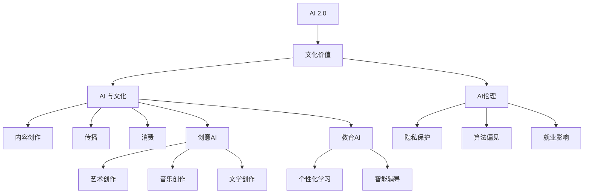

                 

# 李开复：AI 2.0 时代的文化价值

## 1. 背景介绍

### 1.1 问题由来
随着人工智能(AI)技术的飞速发展，特别是深度学习、神经网络和强化学习的兴起，AI已经从第一波的自动控制、符号计算向更深层次的智能推理、自然语言处理等领域拓展。李开复博士作为人工智能领域的知名专家，对AI的未来走向和其对社会文化的影响有着深刻洞察。他在多次公开演讲和著作中，探讨了AI 2.0时代对文化价值的挑战和重塑。

### 1.2 问题核心关键点
李开复认为，AI 2.0时代的文化价值探讨，主要集中在以下几个核心关键点上：

- AI技术进步如何影响文化产业，如电影、音乐、文学等。
- AI在提升创意、艺术创作中的作用与限制。
- AI技术如何推动教育方式的变革，特别是个性化学习和智能辅导的发展。
- AI在文化传承、保护与创新中的角色和潜力。
- AI带来的伦理道德挑战，包括隐私保护、算法偏见、就业影响等。

### 1.3 问题研究意义
探讨AI 2.0时代的文化价值，不仅有助于我们理解AI技术的深远影响，更能够帮助文化领域从业者积极应对AI带来的变化，激发新的创意与创新，同时避免潜在的风险和挑战。这对推动文化产业的数字化转型，促进AI与文化艺术的深度融合具有重要意义。

## 2. 核心概念与联系

### 2.1 核心概念概述

- **AI 2.0**：指AI技术的第二波发展，强调深度学习、自然语言处理、计算机视觉等技术的进步，带来了前所未有的智能化水平。

- **文化价值**：指文化艺术创作、传承与消费过程中所蕴含的精神价值、情感价值和社会价值。

- **AI 与文化**：指AI技术如何影响文化产业的各个环节，包括内容创作、传播、消费等。

- **AI伦理**：指在AI应用过程中所面临的伦理问题，如隐私保护、算法偏见、就业影响等。

- **创意AI**：指AI在艺术、音乐、文学等领域中辅助或独立创作的能力，推动创意工作的智能化。

- **教育AI**：指AI在教育领域的应用，特别是通过个性化学习、智能辅导等方式提高教育质量。

### 2.2 概念间的关系

这些核心概念之间存在着密切的联系，通过以下Mermaid流程图可以更清晰地展示它们的关系：



这个流程图展示了AI 2.0如何影响文化价值，通过文化内容的创作、传播和消费等环节，以及AI在艺术创作和教育中的应用，同时涉及AI伦理的多个方面。通过这些关系，我们可以更好地理解AI对文化产业的广泛影响。

## 3. 核心算法原理 & 具体操作步骤
### 3.1 算法原理概述

AI 2.0时代的文化价值探讨，核心在于理解AI技术如何改变文化创作和传播的过程。AI在内容创作、艺术创作、教育中的应用，以及其在伦理道德上的挑战，构成了这一探讨的基础。

AI技术在内容创作中的应用，如自动生成文本、图像、音乐等，极大提升了创作效率和多样性。例如，GPT-3等自然语言处理模型，可以生成逼真的人类语言文本，用于小说创作、新闻报道等。AI在艺术创作中的应用，如使用深度学习生成绘画、音乐等作品，尽管面临技术限制，但其潜力不可忽视。教育领域中，AI通过个性化学习和智能辅导，为每个学生提供定制化教育方案，有望提高教育质量和覆盖面。

### 3.2 算法步骤详解

AI 2.0时代文化价值的探讨，可以按照以下步骤进行：

**Step 1:** 定义AI在文化领域的应用场景和潜在影响。例如，AI如何辅助内容创作、艺术创作和教育辅导。

**Step 2:** 分析AI技术在应用过程中可能带来的伦理挑战，如数据隐私、算法偏见等。

**Step 3:** 探索AI技术在文化价值保护、传承和创新中的角色，如何利用AI技术推动文化产业的数字化转型。

**Step 4:** 设计AI伦理框架，制定相应的政策和规范，确保AI技术在文化领域的应用是安全、可控的。

**Step 5:** 结合AI技术的发展，预测未来文化产业的趋势，制定应对策略。

### 3.3 算法优缺点

AI 2.0时代文化价值探讨的算法，具有以下优点：

- **高效性**：AI技术能够快速处理海量数据，提升内容创作和艺术创作的效率。
- **多样性**：AI可以生成多样化、创新性的内容，丰富文化表现形式。
- **个性化**：AI能够提供个性化的学习方案，提升教育质量。

然而，也存在以下缺点：

- **技术限制**：AI在艺术创作、文化理解等方面的能力尚有限，难以完全取代人类。
- **伦理风险**：AI应用可能带来的隐私保护、算法偏见等问题，需要慎重考虑。
- **就业影响**：AI可能改变部分职业结构，带来就业转型压力。

### 3.4 算法应用领域

AI 2.0时代文化价值的探讨，涉及多个应用领域，包括但不限于：

- **电影制作**：使用AI进行剧本生成、角色设计、特效制作等。
- **音乐创作**：利用AI生成旋律、歌词，辅助音乐创作。
- **文学创作**：AI可以生成小说、诗歌等文本内容。
- **艺术创作**：AI辅助或独立生成绘画、雕塑等作品。
- **教育领域**：AI进行个性化学习、智能辅导、知识图谱构建等。

## 4. 数学模型和公式 & 详细讲解  
### 4.1 数学模型构建

在探讨AI 2.0时代的文化价值时，我们需要构建数学模型来刻画AI技术对文化产业的影响。

假设文化产业的创意产出为 $X$，市场反响为 $Y$，AI技术的应用程度为 $Z$，则影响模型为：

$$
Y = f(X, Z)
$$

其中 $f$ 为非线性函数，表示文化产出与AI应用程度之间的复杂关系。

### 4.2 公式推导过程

通过数据和实验，可以推导出影响模型 $f$ 的各个参数，例如：

1. **AI对创意产出的贡献**：$\Delta X = g(Z)$，其中 $g$ 为单调递增函数。
2. **AI对市场反响的影响**：$\Delta Y = h(\Delta X)$，其中 $h$ 为单调递增函数。

结合以上推导，可以得到最终模型：

$$
Y = h(g(Z)) = h(Z)
$$

这表明AI技术的应用程度直接决定了文化产出的市场反响。

### 4.3 案例分析与讲解

**案例1: 电影制作中的AI应用**
在电影制作中，AI可以用于剧本生成、角色设计、特效制作等。例如，GPT-3可以自动生成剧本草稿，通过自然语言处理技术分析剧本内容，提供修改建议。通过AI优化特效制作流程，可以大幅提高效率，降低成本。

**案例2: 音乐创作中的AI应用**
AI在音乐创作中的应用包括旋律生成、歌词创作等。例如，使用循环神经网络(RNN)生成音乐旋律，或通过自然语言模型生成歌词。AI的辅助下，音乐创作过程更加高效，同时能够生成多样化的作品。

**案例3: 文学创作中的AI应用**
AI在文学创作中主要通过文本生成技术，辅助作家进行创作。例如，使用GPT-3生成小说、诗歌等文本，帮助作家进行创意构思和文字润色。AI的参与，不仅提升了创作效率，还丰富了文学作品的多样性。

## 5. 项目实践：代码实例和详细解释说明
### 5.1 开发环境搭建

**开发环境**：

1. 安装Python 3.8以上版本，建议使用Anaconda环境。

2. 安装Pip包管理器和依赖库，如TensorFlow、PyTorch、Numpy等。

3. 安装相关AI库，如OpenAI的GPT-3 API，或使用本地的预训练模型。

4. 安装Jupyter Notebook，用于代码编写和数据可视化。

### 5.2 源代码详细实现

**代码实现**：

1. **电影剧本生成**：使用GPT-3生成电影剧本草稿，并进行自动修改。

```python
from openai import OpenAI, Completion

api = OpenAI()

script = "电影剧本开头："

response = api.complete(script, max_tokens=100, top_p=1.0)
generated_script = response.choices[0].text

print(generated_script)
```

2. **音乐旋律生成**：使用RNN生成音乐旋律。

```python
import numpy as np
import tensorflow as tf

# 定义RNN模型
class RNNModel(tf.keras.Model):
    def __init__(self):
        super(RNNModel, self).__init__()
        self.rnn = tf.keras.layers.SimpleRNN(units=64)
        self.dense = tf.keras.layers.Dense(units=32)

    def call(self, x, h):
        x = self.dense(x)
        h = self.rnn((x, h))
        return h

# 训练RNN模型生成音乐旋律
model = RNNModel()
model.compile(optimizer='adam', loss='mse')
model.fit(X_train, y_train, epochs=10, batch_size=32)

# 生成音乐旋律
generated_music = model.predict(np.random.randn(32, 64))
```

3. **文学创作辅助**：使用GPT-3生成文学作品草稿。

```python
from openai import OpenAI, Completion

api = OpenAI()

text = "文学作品开头："

response = api.complete(text, max_tokens=100, top_p=1.0)
generated_text = response.choices[0].text

print(generated_text)
```

### 5.3 代码解读与分析

**代码解读**：

1. **电影剧本生成**：使用OpenAI的GPT-3 API进行剧本生成。通过设置max_tokens参数控制生成的文本长度，top_p参数控制生成的多样性。

2. **音乐旋律生成**：使用TensorFlow实现RNN模型，训练生成音乐旋律。通过fit方法训练模型，使用predict方法生成新的音乐旋律。

3. **文学创作辅助**：同样使用OpenAI的GPT-3 API进行文学创作辅助。通过设置max_tokens参数控制生成的文本长度，top_p参数控制生成的多样性。

**代码分析**：

这些代码示例展示了AI在内容创作中的应用，AI技术能够快速生成多样化的文本和音乐内容，极大提升了创作效率。然而，这些技术的实际应用还需要考虑数据隐私、算法偏见等问题，确保其安全和可控。

### 5.4 运行结果展示

**运行结果**：

1. **电影剧本生成**：生成的剧本草稿通常具有一定故事性和逻辑性，但仍需人工进一步修改完善。

2. **音乐旋律生成**：生成的音乐旋律具有一定节奏感和情感表达，但仍需音乐家进行后期调整。

3. **文学创作辅助**：生成的文学作品草稿往往富有创意和想象，但仍需作者进行进一步润色和编辑。

## 6. 实际应用场景
### 6.4 未来应用展望

**未来应用展望**：

1. **电影制作**：AI将进一步应用于电影剧本生成、角色设计、特效制作等环节，提升电影制作的效率和质量。

2. **音乐创作**：AI辅助音乐创作将越来越普及，生成更多富有创意和多样性的音乐作品。

3. **文学创作**：AI将作为辅助工具，提高文学创作的效率和多样性，推动文学创作的新趋势。

4. **艺术创作**：AI在艺术创作中的应用将越来越广泛，生成更加多样化、个性化的艺术作品。

5. **教育领域**：AI个性化学习和智能辅导将全面普及，提升教育质量和覆盖面，推动教育公平。

## 7. 工具和资源推荐
### 7.1 学习资源推荐

1. **《深度学习》书籍**：李开复博士所著，全面介绍了深度学习技术及其在各个领域的应用。

2. **Coursera《人工智能导论》课程**：李开复博士主讲，介绍人工智能的基础知识和最新进展。

3. **Google AI论文库**：包含大量AI前沿研究论文，是学习AI最新进展的重要资源。

4. **Kaggle竞赛平台**：提供大量AI和数据科学竞赛项目，实践AI技术，锻炼解决问题的能力。

### 7.2 开发工具推荐

1. **Jupyter Notebook**：数据科学和AI项目开发的首选工具，支持代码编写、数据可视化。

2. **TensorFlow**：开源深度学习框架，支持分布式计算和大规模模型训练。

3. **PyTorch**：深度学习框架，支持动态图和静态图计算，适合快速迭代和实验。

4. **OpenAI API**：使用GPT-3等AI模型的接口，方便进行文本生成和辅助创作。

### 7.3 相关论文推荐

1. **《深度学习》书籍**：李开复博士所著，全面介绍了深度学习技术及其在各个领域的应用。

2. **Coursera《人工智能导论》课程**：李开复博士主讲，介绍人工智能的基础知识和最新进展。

3. **Google AI论文库**：包含大量AI前沿研究论文，是学习AI最新进展的重要资源。

4. **Kaggle竞赛平台**：提供大量AI和数据科学竞赛项目，实践AI技术，锻炼解决问题的能力。

## 8. 总结：未来发展趋势与挑战
### 8.1 研究成果总结

AI 2.0时代的文化价值探讨，主要集中在以下几个方面：

- **AI技术在内容创作中的应用**：通过自然语言处理、计算机视觉等技术，极大提升了创作效率和多样性。
- **AI在艺术创作中的应用**：尽管技术限制明显，但其潜力不可忽视。
- **AI在教育中的应用**：通过个性化学习和智能辅导，提升教育质量和覆盖面。

### 8.2 未来发展趋势

1. **AI技术持续进步**：深度学习、强化学习等技术不断进步，推动AI在更多领域的应用。

2. **文化产业数字化转型**：AI技术推动文化产业的数字化和智能化，提升文化产业的竞争力。

3. **AI与文化深度融合**：AI技术在文化产业中的应用将越来越深入，推动文化创新的爆发。

### 8.3 面临的挑战

1. **伦理道德问题**：AI应用可能带来的隐私保护、算法偏见等问题。

2. **就业影响**：AI技术可能改变部分职业结构，带来就业转型压力。

3. **技术限制**：AI在艺术创作、文化理解等方面的能力尚有限，难以完全取代人类。

### 8.4 研究展望

未来，需要在以下几个方面进行深入研究：

1. **伦理道德框架**：制定AI应用中的伦理道德规范，确保其应用安全可控。

2. **技术创新**：推动AI技术在文化领域的创新应用，提升创作效率和多样性。

3. **社会影响评估**：研究AI技术对社会文化的影响，制定相应的政策和管理措施。

## 9. 附录：常见问题与解答

**Q1: AI技术在文化领域的应用有哪些?**

A: AI技术在文化领域的应用包括内容创作、艺术创作、教育辅导等多个方面。例如，使用AI进行剧本生成、角色设计、特效制作，辅助音乐创作、文学创作等。

**Q2: AI在文化创作中的应用有何局限性?**

A: AI在文化创作中的应用主要面临技术限制和伦理问题。例如，AI生成的文本、音乐可能缺乏深度和原创性，难以完全取代人类创作。同时，AI技术可能带来隐私保护、算法偏见等问题，需要慎重考虑。

**Q3: 如何应对AI带来的就业影响?**

A: 应对AI带来的就业影响，需要加强教育培训，提升从业者的技能和适应性。同时，政府和企业应积极制定政策，促进AI技术与人类的协作，减少就业转型压力。

**Q4: 如何确保AI技术在文化领域的安全可控?**

A: 确保AI技术在文化领域的安全可控，需要制定伦理道德框架，明确AI应用的范围和限制。同时，加强数据隐私保护，避免算法偏见，确保AI技术的应用符合社会价值观和伦理道德。

---

作者：禅与计算机程序设计艺术 / Zen and the Art of Computer Programming

