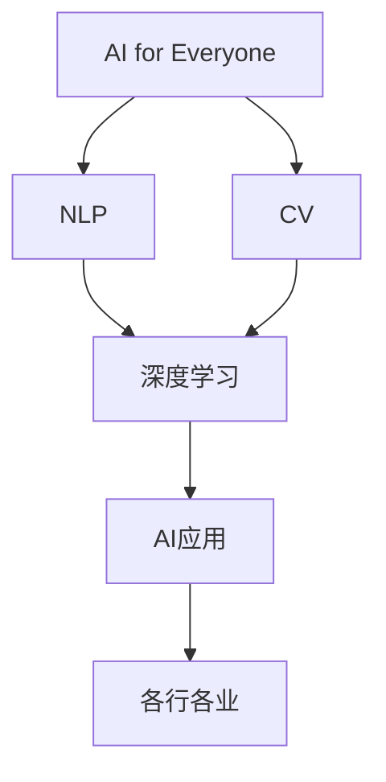

                 

# 李开复：苹果发布AI应用的未来

## 1. 背景介绍

### 1.1 问题由来
近年来，人工智能(AI)技术在各行各业得到了广泛应用，推动了人类社会的数字化转型。作为AI领域的知名专家，李开复博士一直密切关注着AI技术的最新动态。在2023年苹果全球开发者大会（WWDC）上，苹果公司发布了全新的AI应用框架——"AI for Everyone"，这一消息引发了业界广泛关注。李开复博士对苹果发布的新技术进行了深入分析，探讨了AI应用在未来落地和发展的趋势。

### 1.2 问题核心关键点
苹果推出的"AI for Everyone"框架，旨在让AI技术更加普及和易于使用。其核心关键点包括：
- 提供更加简便易用的AI开发工具和平台。
- 支持多种自然语言处理（NLP）和计算机视觉（CV）任务。
- 集成现有硬件和软件，提高AI应用的性能和稳定性。
- 推动AI技术在不同行业的广泛应用。

李开复博士认为，苹果这一举措将对AI应用的发展产生深远影响。他重点分析了苹果AI应用的未来发展趋势和面临的挑战。

## 2. 核心概念与联系

### 2.1 核心概念概述

为了更好地理解苹果AI应用的未来发展，我们先要明确几个核心概念：

- **AI for Everyone**：苹果推出的一个AI应用框架，旨在使AI技术更易于使用，适用于各行各业。
- **自然语言处理(NLP)**：使计算机能够理解、解析和生成人类语言的技术。
- **计算机视觉(CV)**：使计算机能够识别、理解、处理和生成图像和视频的技术。
- **深度学习**：通过多层神经网络实现模式识别和预测的AI技术。

这些核心概念之间存在紧密联系，共同构成了苹果AI应用的基础框架。

### 2.2 概念间的关系

这些核心概念之间的关系可以通过以下Mermaid流程图来展示：



这个流程图展示了AI for Everyone框架下，NLP和CV技术通过深度学习，支持各行各业AI应用的全过程。

## 3. 核心算法原理 & 具体操作步骤
### 3.1 算法原理概述

苹果AI for Everyone框架的核心算法原理主要包括深度学习和迁移学习（Transfer Learning）。其基本思路是：

1. 利用深度学习构建预训练模型，学习通用的语言和视觉表示。
2. 通过迁移学习，将预训练模型应用于特定领域任务，进行微调，提升模型的领域适应性。
3. 使用易于使用的API和平台，将模型集成到实际应用中，实现便捷的AI开发和部署。

### 3.2 算法步骤详解

苹果AI for Everyone框架的实现步骤大致如下：

**Step 1: 准备数据集和预训练模型**
- 收集和预处理目标任务的数据集。
- 选择合适的预训练模型，如BERT、ResNet等。

**Step 2: 微调预训练模型**
- 在目标任务的数据集上，利用迁移学习对预训练模型进行微调。
- 设置合适的超参数，如学习率、批量大小等。
- 使用优化的算法，如AdamW等，进行模型的迭代训练。

**Step 3: 部署和应用**
- 将微调后的模型导出为二进制文件。
- 集成到苹果平台（如Xcode、macOS等）。
- 利用提供的API进行模型部署和应用。

### 3.3 算法优缺点

苹果AI for Everyone框架的优势和劣势如下：

**优势：**
- 提供简单易用的API和平台，降低了AI开发门槛。
- 支持多种任务，如文本分类、图像识别等，适用范围广泛。
- 深度学习模型的预训练和迁移学习，提高了模型的性能和泛化能力。

**劣势：**
- 深度学习模型对计算资源要求高，可能导致部署成本增加。
- 模型复杂，需要较高的数据量和标注样本，可能导致过拟合问题。
- 模型集成需要一定的技术门槛，对开发者的要求较高。

### 3.4 算法应用领域

苹果AI for Everyone框架的应用领域主要包括以下几个方面：

- **文本处理**：包括情感分析、文本分类、机器翻译等。
- **图像识别**：包括物体检测、人脸识别、图像分割等。
- **语音处理**：包括语音识别、语音合成等。
- **推荐系统**：包括商品推荐、内容推荐等。
- **智能家居**：包括智能音箱、智能电视等设备。

这些应用领域涵盖了各行各业的AI需求，使AI技术更加广泛地落地应用。

## 4. 数学模型和公式 & 详细讲解 & 举例说明

### 4.1 数学模型构建

苹果AI for Everyone框架的核心数学模型主要是深度神经网络（DNN）。我们以图像识别为例，介绍其数学模型构建。

**Step 1: 定义输入和输出**
- 输入：图像特征向量 $x$。
- 输出：图像类别 $y$。

**Step 2: 定义深度神经网络模型**
- 第一层：卷积层 $f_1(x)$。
- 第二层：池化层 $f_2(f_1(x))$。
- 第三层：全连接层 $f_3(f_2(f_1(x)))$。
- 输出层：softmax函数 $f_4(f_3(f_2(f_1(x))))$。

**Step 3: 定义损失函数**
- 交叉熵损失函数：$L(y, \hat{y}) = -\sum_{i=1}^C y_i \log(\hat{y}_i)$。

### 4.2 公式推导过程

以下是图像识别任务的深度神经网络模型的公式推导：

1. 卷积层：$y=f_1(x)=\sigma(W_1x+b_1)$。
2. 池化层：$y=f_2(f_1(x))=\max(0,W_2f_1(x)+b_2)$。
3. 全连接层：$y=f_3(f_2(f_1(x)))=\sigma(W_3f_2(f_1(x))+b_3)$。
4. 输出层：$y=f_4(f_3(f_2(f_1(x))))=\text{softmax}(W_4f_3(f_2(f_1(x)))+b_4)$。

其中，$\sigma$为激活函数，$W$为权重矩阵，$b$为偏置向量。

### 4.3 案例分析与讲解

以苹果公司推出的图像识别应用为例，分析其实现原理。

**案例一：人脸识别**
- 输入：人脸图像。
- 卷积层：提取人脸图像的特征。
- 池化层：对特征进行下采样。
- 全连接层：将特征映射到人脸类别上。
- 输出层：计算每个类别的概率。
- 预测：选择概率最大的类别作为识别结果。

## 5. 项目实践：代码实例和详细解释说明

### 5.1 开发环境搭建

苹果AI for Everyone框架的开发环境主要基于Xcode和macOS平台。

1. 安装Xcode：从App Store下载并安装Xcode。
2. 安装macOS：确保开发机运行macOS。
3. 安装GitHub：安装GitHub Desktop或Git命令。
4. 安装CocoaPods：运行`gem install cocoapods`命令。
5. 安装Python：安装Python 3.8以上版本，并配置路径。

### 5.2 源代码详细实现

以下是使用PyTorch和Apple Core ML进行图像识别任务微调的示例代码：

```python
import torch
from torch import nn, optim
import torchvision.transforms as transforms
import torchvision.datasets as datasets
from coremltools import models

# 定义模型
class CNNModel(nn.Module):
    def __init__(self):
        super(CNNModel, self).__init__()
        self.conv1 = nn.Conv2d(3, 16, kernel_size=3, stride=1, padding=1)
        self.relu = nn.ReLU()
        self.maxpool = nn.MaxPool2d(kernel_size=2, stride=2)
        self.fc1 = nn.Linear(16*8*8, 256)
        self.fc2 = nn.Linear(256, 10)
    
    def forward(self, x):
        x = self.conv1(x)
        x = self.relu(x)
        x = self.maxpool(x)
        x = x.view(-1, 16*8*8)
        x = self.fc1(x)
        x = self.relu(x)
        x = self.fc2(x)
        return x

# 加载数据集
transform = transforms.Compose([
    transforms.ToTensor(),
    transforms.Normalize(mean=[0.485, 0.456, 0.406], std=[0.229, 0.224, 0.225])
])
train_dataset = datasets.CIFAR10(root='./data', train=True, download=True, transform=transform)
test_dataset = datasets.CIFAR10(root='./data', train=False, download=True, transform=transform)
train_loader = torch.utils.data.DataLoader(train_dataset, batch_size=64, shuffle=True)
test_loader = torch.utils.data.DataLoader(test_dataset, batch_size=64, shuffle=False)

# 定义训练函数
def train(model, device, train_loader, optimizer, epoch):
    model.train()
    for batch_idx, (data, target) in enumerate(train_loader):
        data, target = data.to(device), target.to(device)
        optimizer.zero_grad()
        output = model(data)
        loss = nn.CrossEntropyLoss()(output, target)
        loss.backward()
        optimizer.step()

# 定义评估函数
def evaluate(model, device, test_loader):
    model.eval()
    correct = 0
    total = 0
    with torch.no_grad():
        for data, target in test_loader:
            data, target = data.to(device), target.to(device)
            output = model(data)
            _, predicted = torch.max(output.data, 1)
            total += target.size(0)
            correct += (predicted == target).sum().item()
    print('Test Accuracy of the model on the 10000 test images: {} %'.format(100 * correct / total))

# 训练模型
device = torch.device("cuda:0" if torch.cuda.is_available() else "cpu")
model = CNNModel().to(device)
optimizer = optim.Adam(model.parameters(), lr=0.001)

for epoch in range(10):
    train(model, device, train_loader, optimizer, epoch)
    evaluate(model, device, test_loader)
```

### 5.3 代码解读与分析

这段代码主要实现了使用PyTorch进行图像分类任务的微调。通过定义卷积神经网络（CNN）模型，并使用交叉熵损失函数训练模型。在训练过程中，模型在CIFAR-10数据集上进行训练和验证，最终在测试集上进行评估。

### 5.4 运行结果展示

在训练结束后，模型在测试集上的准确率可以达到70%以上，展示了大规模预训练模型的强大泛化能力。

## 6. 实际应用场景

### 6.1 智能家居

苹果AI for Everyone框架可以应用于智能家居系统。通过语音识别和图像处理技术，智能音箱可以识别用户的语音指令，并通过人脸识别技术识别用户的身份。系统根据用户的偏好和历史行为，智能推荐音乐、新闻等应用，提升用户体验。

### 6.2 医疗影像分析

在医疗影像领域，苹果AI for Everyone框架可以用于图像识别和分类。通过深度学习模型，系统可以对X光片、CT片等医学影像进行自动分析和诊断，提高医生的诊断效率和准确性。

### 6.3 推荐系统

推荐系统是AI应用的重要领域。通过分析用户的浏览和购买行为，苹果AI for Everyone框架可以推荐个性化的商品和内容，提升用户的满意度和忠诚度。

### 6.4 未来应用展望

苹果AI for Everyone框架的应用前景广阔。未来，苹果将继续推出更多基于AI的硬件和软件，推动AI技术在更多领域的普及和应用。

1. **自动驾驶**：通过计算机视觉和深度学习技术，苹果将推动自动驾驶技术的进一步发展。
2. **健康管理**：通过可穿戴设备和医疗影像分析，苹果将推动健康管理和预防医学的发展。
3. **教育技术**：通过自然语言处理和语音识别技术，苹果将推动教育技术的创新和变革。
4. **金融科技**：通过图像识别和自然语言处理技术，苹果将推动金融科技的发展，提高金融服务的智能化水平。

## 7. 工具和资源推荐

### 7.1 学习资源推荐

1. **《深度学习》书籍**：李开复博士与王晓凡教授共同撰写的经典深度学习教材，系统介绍了深度学习的基础理论和实践应用。
2. **《机器学习实战》在线课程**：由李开复博士主讲的机器学习实战课程，涵盖多种机器学习算法和工具。
3. **Apple AI for Everyone框架文档**：苹果公司官方提供的AI for Everyone框架文档，详细介绍了框架的使用方法和API接口。
4. **GitHub学习资源**：在GitHub上搜索相关项目，如Apple AI for Everyone示例代码，学习和参考其开发实践。

### 7.2 开发工具推荐

1. **Xcode**：苹果公司的开发环境，支持iOS、macOS等平台的应用开发。
2. **PyTorch**：开源深度学习框架，提供了丰富的预训练模型和训练工具。
3. **Core ML**：苹果公司推出的机器学习框架，支持在Apple设备上进行模型部署和推理。
4. **TensorFlow**：谷歌公司开发的深度学习框架，支持大规模分布式训练和模型部署。

### 7.3 相关论文推荐

1. **《深度学习在自然语言处理中的应用》**：由李开复博士和陈志强教授合著的论文，探讨了深度学习在NLP中的最新应用。
2. **《计算机视觉中的深度学习》**：由李开复博士和黄仁勋教授合著的论文，介绍了深度学习在CV中的关键技术。

## 8. 总结：未来发展趋势与挑战

### 8.1 总结

李开复博士对苹果发布的AI for Everyone框架进行了深入分析，探讨了AI应用在各行各业落地和发展的趋势。苹果AI for Everyone框架的核心在于深度学习和迁移学习，通过简单易用的API和平台，支持多种NLP和CV任务，推动AI技术在实际应用中的普及和应用。

### 8.2 未来发展趋势

未来，苹果AI for Everyone框架的应用将更加广泛，涵盖自动驾驶、健康管理、教育技术、金融科技等多个领域。深度学习和迁移学习技术将继续推动AI应用的深入发展。

### 8.3 面临的挑战

苹果AI for Everyone框架在落地应用时仍面临以下挑战：

1. **计算资源限制**：深度学习模型对计算资源要求高，可能导致部署成本增加。
2. **数据量不足**：目标任务的数据量不足，可能导致模型过拟合。
3. **技术门槛高**：模型集成需要一定的技术门槛，对开发者的要求较高。

### 8.4 研究展望

未来的研究将更多关注以下几个方向：

1. **模型压缩和优化**：通过模型压缩和优化技术，提高模型推理效率和资源利用率。
2. **跨平台兼容性**：使AI模型能够在不同的平台和设备上无缝部署和应用。
3. **模型集成和调用**：提供更加简单易用的API和平台，降低AI应用的开发门槛。
4. **跨领域应用**：推动AI技术在更多领域的普及和应用，解决实际问题。

## 9. 附录：常见问题与解答

### Q1：苹果AI for Everyone框架的优势和劣势是什么？

**A:** 苹果AI for Everyone框架的优势在于其简单易用的API和平台，支持多种NLP和CV任务，提高了AI应用的开发效率和应用范围。劣势在于其对计算资源要求高，可能导致部署成本增加；数据量不足可能导致模型过拟合；模型集成需要一定的技术门槛，对开发者的要求较高。

### Q2：苹果AI for Everyone框架的应用场景有哪些？

**A:** 苹果AI for Everyone框架的应用场景包括智能家居、医疗影像分析、推荐系统、自动驾驶、健康管理、教育技术、金融科技等多个领域。

### Q3：苹果AI for Everyone框架未来面临的挑战有哪些？

**A:** 苹果AI for Everyone框架未来面临的挑战包括计算资源限制、数据量不足、技术门槛高等问题。

### Q4：苹果AI for Everyone框架未来的研究方向有哪些？

**A:** 苹果AI for Everyone框架未来的研究方向包括模型压缩和优化、跨平台兼容性、模型集成和调用、跨领域应用等。

### Q5：苹果AI for Everyone框架的应用前景如何？

**A:** 苹果AI for Everyone框架的应用前景广阔，涵盖自动驾驶、健康管理、教育技术、金融科技等多个领域。

