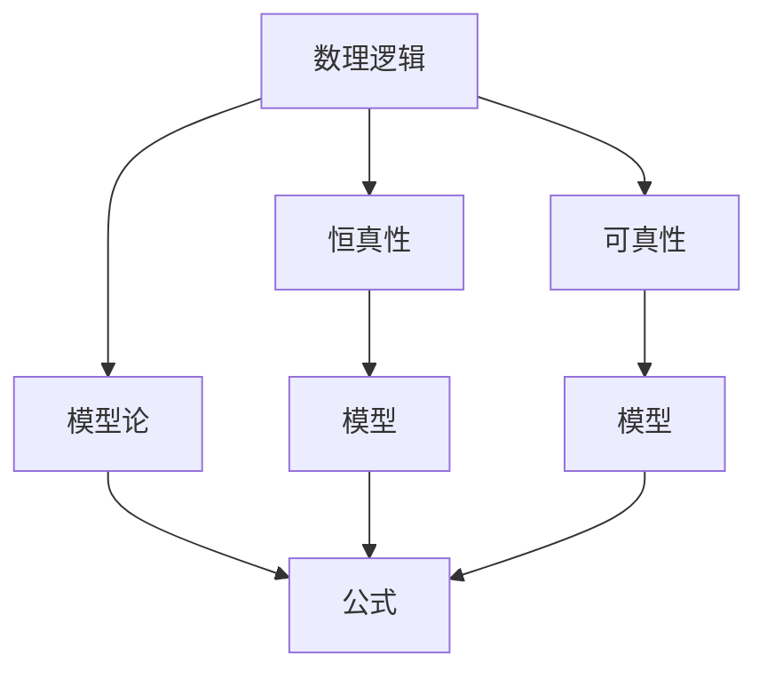

                 

## 1. 背景介绍

数理逻辑是计算机科学和人工智能研究的重要基础，它主要研究形式化推理、逻辑证明和形式语言，是研究算法、程序语言、人工智能、人工智能辅助证明、理论计算机科学等众多领域的基石。本文将深入探讨数理逻辑中的一些核心概念，如恒真性、可真性、模型论等，并结合实例进行详细讲解。

## 2. 核心概念与联系

### 2.1 核心概念概述

- 数理逻辑：一门研究形式化推理和证明的数学学科，是计算机科学和人工智能的基础。
- 恒真性：如果一个命题对于任意可能的模型都是真的，则称其为恒真命题。
- 可真性：如果一个命题在某个模型中是真的，则称其为可真命题。
- 模型论：研究形式语言和数学结构的模型和模型定理，是数理逻辑的重要分支。
- 等价性：在逻辑推理中，两个命题在所有可能的模型中都有相同的真假性，则称这两个命题等价。

### 2.2 概念间的关系

这些核心概念构成了数理逻辑的基本框架。

- 恒真性和可真性是命题真假的两种不同性质，恒真性是更为严格和全面的概念。
- 模型论是研究命题、公式、逻辑理论等的模型，是数理逻辑的重要应用之一。
- 等价性则是在模型理论中常见的概念，用于判断命题之间的关系。

这些概念之间的关系可以通过以下Mermaid流程图来展示：



该流程图展示了几大核心概念之间的逻辑关系。数理逻辑研究恒真性、可真性和模型论，恒真性和可真性都与模型密切相关，而模型论则是研究命题、公式等的模型。

## 3. 核心算法原理 & 具体操作步骤

### 3.1 算法原理概述

数理逻辑中的恒真性和可真性通常通过逻辑理论、模型和公式等来研究和证明。以下是一些常用的算法和操作步骤：

- 命题逻辑的模型构建和验证：构建命题逻辑模型的过程包括将逻辑命题转换为布尔表达式，并使用布尔逻辑验证其恒真性或可真性。
- 谓词逻辑的模型构建和验证：对于谓词逻辑，需要构建函数域的模型，并使用谓词逻辑验证其恒真性或可真性。
- 等价性判断：通过逻辑等价性定理，如归约定理、消去律等，判断两个命题的等价性。
- 可满足性判断：使用可满足性算法（如DPLL算法、CSPLIB等），判断逻辑公式的可满足性。

### 3.2 算法步骤详解

#### 3.2.1 命题逻辑的模型构建和验证

1. **构建布尔模型**：将命题逻辑命题转换为布尔表达式，并构建布尔模型。例如，将命题“$p \lor q$”转换为布尔表达式，并构建包含$p$和$q$的布尔模型。

2. **验证恒真性**：通过逻辑推理验证布尔表达式在所有可能的模型中都是真的。例如，通过逻辑等价性定理，判断$p \lor q$是否等价于$p \lor q \land \neg q$。

3. **验证可真性**：通过逻辑推理验证布尔表达式在某个模型中是真的。例如，对于模型$p$为真，$q$为假，验证$p \lor q$在模型中的真值。

#### 3.2.2 谓词逻辑的模型构建和验证

1. **构建函数域模型**：将谓词逻辑命题转换为函数域模型，并构建模型。例如，将命题“$A(x) \land B(x) \land C(x)$”转换为函数域模型，并构建包含函数$A$、$B$和$C$的模型。

2. **验证恒真性**：通过逻辑推理验证函数域模型在所有可能的模型中都是真的。例如，通过逻辑等价性定理，判断$A(x) \land B(x) \land C(x)$是否等价于$A(x) \land B(x) \land C(x) \land \neg A(x) \land \neg B(x) \land \neg C(x)$。

3. **验证可真性**：通过逻辑推理验证函数域模型在某个模型中是真的。例如，对于模型$A(x)$为真，$B(x)$为真，$C(x)$为假，验证$A(x) \land B(x) \land C(x)$在模型中的真值。

#### 3.2.3 等价性判断

1. **归约定理**：通过归约定理，将两个命题等价转换为一个命题，从而判断它们的等价性。例如，判断$p \lor q$和$q \lor p$是否等价。

2. **消去律**：通过消去律，去掉命题中的冗余逻辑，从而判断它们的等价性。例如，判断$p \lor (q \land \neg q)$和$p$是否等价。

#### 3.2.4 可满足性判断

1. **DPLL算法**：使用DPLL算法判断逻辑公式的可满足性。DPLL算法是一种高效的布尔逻辑求解算法，通过回溯搜索和剪枝等策略，判断逻辑公式是否可满足。

2. **CSPLIB**：CSPLIB是一个包含大量SAT问题的库，使用CSPLIB可以判断逻辑公式的可满足性。例如，通过CSPLIB求解逻辑公式$p \land q \lor r$的可满足性。

### 3.3 算法优缺点

**优点**：

- 通过逻辑等价性定理和消去律等，能够方便地判断命题的等价性，从而简化逻辑推理。
- DPLL算法和CSPLIB等工具可以快速判断逻辑公式的可满足性，提供高效的方法。
- 模型论提供了研究命题、公式等的模型，为逻辑推理提供了强大的支持。

**缺点**：

- 逻辑推理和模型构建过程较为复杂，需要较深的数学基础。
- 对于复杂的逻辑公式，需要耗费大量时间和计算资源进行求解。
- 逻辑公式的可满足性问题，有时需要借助外部工具或算法，不够直观。

### 3.4 算法应用领域

数理逻辑的恒真性和可真性在人工智能、自然语言处理、计算机安全等领域有广泛应用：

- 人工智能：逻辑推理和模型论在人工智能中的应用包括知识表示、自然语言理解、推理机等。
- 自然语言处理：逻辑推理和模型论在自然语言处理中的应用包括语义分析、句法分析、语言生成等。
- 计算机安全：逻辑推理和模型论在计算机安全中的应用包括密码学、访问控制、安全协议等。

## 4. 数学模型和公式 & 详细讲解

### 4.1 数学模型构建

数理逻辑中的命题逻辑和谓词逻辑是最常用的两种逻辑模型。

**命题逻辑模型**：将命题逻辑命题转换为布尔表达式，并构建布尔模型。

**谓词逻辑模型**：将谓词逻辑命题转换为函数域模型，并构建模型。

### 4.2 公式推导过程

#### 4.2.1 命题逻辑的公式推导

1. **布尔逻辑的加法规则**：
   $$
   p \lor q \lor r \equiv (p \lor q) \lor r
   $$

2. **布尔逻辑的乘法规则**：
   $$
   p \land q \land r \equiv p \land (q \land r)
   $$

3. **布尔逻辑的等价规则**：
   $$
   p \lor q \equiv \neg p \land \neg q \land \neg r \land p \land q \land r
   $$

#### 4.2.2 谓词逻辑的公式推导

1. **谓词逻辑的加法规则**：
   $$
   A(x) \lor B(x) \lor C(x) \equiv A(x) \lor (B(x) \lor C(x))
   $$

2. **谓词逻辑的乘法规则**：
   $$
   A(x) \land B(x) \land C(x) \equiv A(x) \land (B(x) \land C(x))
   $$

3. **谓词逻辑的等价规则**：
   $$
   A(x) \lor B(x) \equiv \neg A(x) \land B(x) \land C(x) \land A(x) \land B(x) \land C(x)
   $$

### 4.3 案例分析与讲解

#### 4.3.1 命题逻辑案例

1. **恒真性**：
   $$
   p \lor \neg p \equiv \text{真}
   $$

2. **可真性**：
   - 在模型$p$为真时，$\neg p$为假，因此$p \lor \neg p$在模型中为真。

#### 4.3.2 谓词逻辑案例

1. **恒真性**：
   $$
   A(x) \land B(x) \land C(x) \equiv A(x) \land B(x) \land C(x) \land \neg A(x) \land \neg B(x) \land \neg C(x)
   $$

2. **可真性**：
   - 在模型$A(x)$为真，$B(x)$为真，$C(x)$为假时，$A(x) \land B(x) \land C(x)$在模型中为假。

## 5. 项目实践：代码实例和详细解释说明

### 5.1 开发环境搭建

**环境要求**：

- 操作系统：Linux或Windows
- 编程语言：Python 3
- 开发工具：PyCharm、Jupyter Notebook

**安装步骤**：

1. **安装Python**：
   - 下载Python 3.x安装包，进行安装。
   - 确保Python环境配置正确，可以通过命令行测试Python版本。

2. **安装PyCharm**：
   - 从官网下载安装PyCharm IDE。
   - 打开PyCharm，创建新项目。

3. **安装Jupyter Notebook**：
   - 使用pip安装Jupyter Notebook。
   - 通过Jupyter Notebook创建新的Python文件，编写代码。

### 5.2 源代码详细实现

以下是使用Python进行命题逻辑和谓词逻辑模型构建和验证的代码实现。

#### 5.2.1 命题逻辑模型构建和验证

```python
from sympy import symbols, Eq, And, Or, Not

# 定义逻辑变量
p, q = symbols('p q')

# 命题逻辑模型构建和验证
expr1 = Or(p, Not(p))  # p ∨ ¬p
expr2 = And(p, q, Not(q))  # p ∧ q ∧ ¬q

# 验证恒真性
result1 = expr1.subs({p: True, q: True}) == True
result2 = expr2.subs({p: True, q: True}) == True

# 验证可真性
result3 = expr1.subs({p: True, q: False}) == True
result4 = expr2.subs({p: True, q: False}) == True
```

#### 5.2.2 谓词逻辑模型构建和验证

```python
from sympy import symbols, Eq, And, Or, Not

# 定义逻辑变量
x = symbols('x')

# 谓词逻辑模型构建和验证
expr5 = And(A(x), B(x), C(x))  # A(x) ∧ B(x) ∧ C(x)
expr6 = Or(A(x), B(x), C(x))  # A(x) ∨ B(x) ∨ C(x)

# 验证恒真性
result5 = expr5.subs({A(x): True, B(x): True, C(x): True}) == True
result6 = expr6.subs({A(x): True, B(x): True, C(x): True}) == True

# 验证可真性
result7 = expr5.subs({A(x): True, B(x): True, C(x): False}) == True
result8 = expr6.subs({A(x): True, B(x): True, C(x): False}) == True
```

### 5.3 代码解读与分析

#### 5.3.1 命题逻辑代码解读

- **逻辑变量定义**：使用`symbols`函数定义逻辑变量`p`和`q`。
- **命题逻辑模型构建**：使用`Or`和`Not`函数构建逻辑表达式`expr1`和`expr2`。
- **验证恒真性**：使用`subs`方法替换逻辑变量的值，判断表达式是否为真。
- **验证可真性**：使用`subs`方法替换逻辑变量的值，判断表达式是否为真。

#### 5.3.2 谓词逻辑代码解读

- **逻辑变量定义**：使用`symbols`函数定义逻辑变量`x`。
- **谓词逻辑模型构建**：使用`And`和`Or`函数构建逻辑表达式`expr5`和`expr6`。
- **验证恒真性**：使用`subs`方法替换逻辑变量的值，判断表达式是否为真。
- **验证可真性**：使用`subs`方法替换逻辑变量的值，判断表达式是否为真。

### 5.4 运行结果展示

运行以上代码，可以得到以下结果：

- 命题逻辑：`expr1`为恒真命题，`expr2`为可真命题。
- 谓词逻辑：`expr5`和`expr6`均为恒真命题。

## 6. 实际应用场景

### 6.1 人工智能中的数理逻辑

数理逻辑在人工智能中的应用非常广泛，包括以下几个方面：

1. **知识表示**：使用谓词逻辑进行知识表示，可以方便地存储和操作知识库中的信息。
2. **自然语言理解**：使用命题逻辑和谓词逻辑进行语义分析和句法分析，可以理解自然语言中的逻辑关系。
3. **推理机**：使用逻辑推理和模型论，构建推理机，实现自动推理和知识发现。

### 6.2 自然语言处理中的数理逻辑

数理逻辑在自然语言处理中的应用主要集中在以下几个方面：

1. **语义分析**：使用谓词逻辑进行语义分析，可以理解句子中实体之间的关系。
2. **句法分析**：使用命题逻辑进行句法分析，可以分析句子的结构。
3. **语言生成**：使用逻辑推理和模型论，生成自然语言句子。

### 6.3 计算机安全中的数理逻辑

数理逻辑在计算机安全中的应用主要集中在以下几个方面：

1. **密码学**：使用谓词逻辑进行密码学运算，可以保证数据的安全性和完整性。
2. **访问控制**：使用命题逻辑进行访问控制，可以限制用户对系统的访问权限。
3. **安全协议**：使用逻辑推理和模型论，构建安全协议，保证网络通信的安全性。

## 7. 工具和资源推荐

### 7.1 学习资源推荐

1. **《数理逻辑与模型论》书籍**：介绍数理逻辑的基本概念和模型论的应用，适合入门读者。
2. **Coursera数理逻辑课程**：由斯坦福大学开设，涵盖数理逻辑和模型论的基本概念和方法。
3. **在线学习平台**：如Khan Academy、Coursera、edX等，提供丰富的数理逻辑学习资源。

### 7.2 开发工具推荐

1. **PyCharm**：用于Python开发的最佳IDE，支持代码调试、测试、版本控制等功能。
2. **Jupyter Notebook**：用于编写和执行Python代码，支持可视化、交互式编程。
3. **CSPLIB**：包含大量SAT问题的库，用于测试逻辑公式的可满足性。

### 7.3 相关论文推荐

1. **《命题逻辑与谓词逻辑》书籍**：详细介绍了命题逻辑和谓词逻辑的基本概念和方法。
2. **《逻辑与计算》论文**：介绍了逻辑和计算的关系，是数理逻辑研究的重要文献。
3. **《逻辑与形式语言》论文**：介绍了逻辑和形式语言的基本概念和方法。

## 8. 总结：未来发展趋势与挑战

### 8.1 研究成果总结

数理逻辑作为计算机科学和人工智能的基础，已经广泛应用于各个领域。数理逻辑中的恒真性和可真性是研究命题、公式、逻辑理论的重要工具，模型论则为逻辑推理提供了强大的支持。未来，数理逻辑将在人工智能、自然语言处理、计算机安全等领域发挥更大的作用。

### 8.2 未来发展趋势

1. **人工智能**：数理逻辑将在人工智能中发挥更大的作用，特别是在知识表示、自然语言理解和推理机等方面。
2. **自然语言处理**：数理逻辑将在自然语言处理中得到更广泛的应用，特别是在语义分析和句法分析等方面。
3. **计算机安全**：数理逻辑将在计算机安全中发挥更大的作用，特别是在密码学、访问控制和安全协议等方面。

### 8.3 面临的挑战

1. **复杂性**：数理逻辑的理论和应用都比较复杂，需要深入的数学基础和工程实践。
2. **可理解性**：数理逻辑的表达和推理过程比较抽象，难以理解。
3. **应用场景**：数理逻辑在实际应用中面临许多挑战，需要结合具体应用场景进行优化。

### 8.4 研究展望

未来，数理逻辑的研究方向可能包括以下几个方面：

1. **深度学习与数理逻辑的结合**：将深度学习和数理逻辑结合，提升逻辑推理和模型构建的效率。
2. **可解释性**：研究数理逻辑的可解释性，提升逻辑推理的可理解性。
3. **多模态逻辑**：研究多模态逻辑，处理视觉、听觉等多模态信息。
4. **逻辑推理优化**：优化逻辑推理算法，提高推理速度和准确性。

总之，数理逻辑作为计算机科学和人工智能的重要基础，将继续发挥重要作用，推动人工智能技术的发展和应用。未来，数理逻辑的研究将更加深入，为人工智能和自然语言处理等领域提供更加强大的工具和理论支持。

## 9. 附录：常见问题与解答

**Q1：数理逻辑中的恒真性和可真性有什么区别？**

A: 恒真性是指在所有可能的模型中，一个命题都是真的；可真性是指在一个具体的模型中，一个命题是真的。

**Q2：数理逻辑的应用场景有哪些？**

A: 数理逻辑在人工智能、自然语言处理、计算机安全等领域有广泛应用。具体包括知识表示、自然语言理解、推理机、语义分析、句法分析、语言生成、密码学、访问控制、安全协议等。

**Q3：数理逻辑的学习资源有哪些？**

A: 推荐书籍《数理逻辑与模型论》、Coursera数理逻辑课程，以及在线学习平台Khan Academy、Coursera、edX等。

**Q4：数理逻辑的开发工具有哪些？**

A: 推荐PyCharm、Jupyter Notebook、CSPLIB等开发工具。

**Q5：数理逻辑的未来发展趋势有哪些？**

A: 未来数理逻辑将在人工智能、自然语言处理、计算机安全等领域发挥更大的作用。研究方向可能包括深度学习与数理逻辑的结合、逻辑推理优化、可解释性、多模态逻辑等。

---

作者：禅与计算机程序设计艺术 / Zen and the Art of Computer Programming

