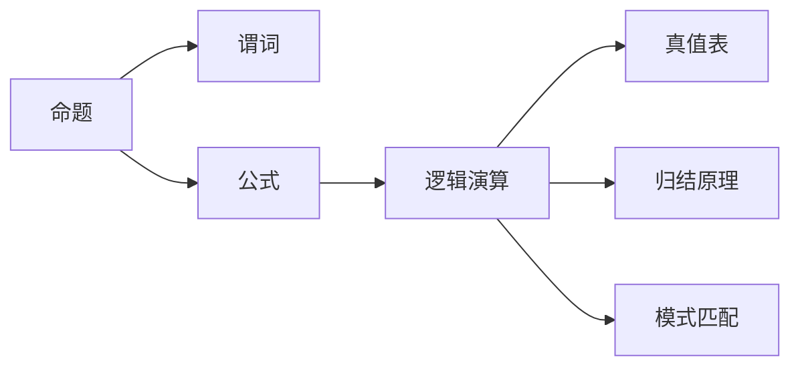

                 

# 数理逻辑：第一章演绎逻辑的基本规则

> 关键词：数理逻辑, 演绎逻辑, 推理规则, 逻辑演算, 数理模型, 形式语言

## 1. 背景介绍

### 1.1 问题由来
数理逻辑作为数学和计算机科学中的一种基础理论，主要用于形式化表达和推导数学和计算理论。它通过严谨的推理规则和形式化符号，确保数学命题的严格性和可靠性，广泛应用于数学证明、计算模型、编程语言设计等领域。

然而，数理逻辑的理论基础深厚且抽象，对于没有背景知识的读者来说，容易感到难以理解和入门。本文旨在通过系统介绍数理逻辑的核心概念和基本规则，帮助读者建立起清晰的数理逻辑框架，并理解其应用原理。

### 1.2 问题核心关键点
数理逻辑的核心在于其形式化表达和推理方法，核心关键点包括：
- **逻辑演算**：定义形式语言和逻辑结构，通过推理规则构建逻辑命题。
- **推理规则**：确保逻辑命题的正确性，常用的包括真值表法、归结原理、模式匹配等。
- **数理模型**：通过逻辑命题和推理规则，构造数学模型并推导出相关结论。

本文将从演绎逻辑的基本规则入手，逐步深入探讨数理逻辑的各个方面。

### 1.3 问题研究意义
掌握数理逻辑的基本规则，对于理解计算机科学、数学证明、逻辑学等领域具有重要意义：
1. **基础理论**：数理逻辑提供了严格的推理框架，帮助理解和验证数学和计算理论的正确性。
2. **编程语言设计**：逻辑演算和推理规则被广泛应用于编程语言的设计和优化，如类型推导、错误检查等。
3. **人工智能**：逻辑推理和形式化推理是人工智能中的关键技术，如专家系统、知识库管理等。
4. **数据科学**：逻辑推理有助于构建和验证统计模型，提高数据分析和决策的准确性。

通过学习数理逻辑，读者能够更好地理解现代科学和技术的基础理论，提升应用能力和创新思维。

## 2. 核心概念与联系

### 2.1 核心概念概述

- **命题**：逻辑学中最基本的元素，表示某种事实或假设，如“所有猫都喜欢吃鱼”。
- **谓词**：用于描述命题的量词性质，如“存在一个孩子”、“对所有孩子”。
- **公式**：由命题和谓词通过逻辑运算符连接而成的表达式，如“所有猫都喜欢吃鱼”或“存在一个孩子”。
- **逻辑演算**：对公式进行推理和变换的规则体系，如命题逻辑、谓词逻辑等。
- **真值表**：通过枚举所有可能的情况，验证公式的真值性。
- **归结原理**：通过将公式分解为子公式并简化，验证其真值性。
- **模式匹配**：通过匹配公式的模式，简化推理过程。

这些概念之间的联系通过以下Mermaid流程图展示：



### 2.2 概念间的关系

这些核心概念构成了数理逻辑的基本框架，通过逻辑演算和推理规则，从命题出发，构建复杂的逻辑结构和推理过程。

- **命题与谓词**：命题是逻辑演算的基本单元，谓词用于描述命题的性质和范围。
- **公式与逻辑演算**：公式是通过逻辑演算规则构建的复合命题，可以表示更复杂的逻辑关系。
- **真值表与归结原理**：真值表通过枚举所有可能的情况验证公式的真值性，归结原理通过分解和简化公式来验证其真值性。
- **模式匹配**：模式匹配是一种高级推理技术，通过匹配公式的模式，加速推理过程。

这些概念相互联系，共同构成了数理逻辑的完整体系，为形式化推理提供了坚实的基础。

## 3. 核心算法原理 & 具体操作步骤
### 3.1 算法原理概述

数理逻辑的算法原理主要围绕逻辑演算和推理规则展开。其核心思想是通过形式化表达和推理规则，构建逻辑命题并验证其真值性。

逻辑演算基于以下几个基本规则：
1. **同真同假律**：逻辑等价，同真同假。
2. **蕴含律**：$p \rightarrow q$ 为真，则 $\neg q \rightarrow \neg p$ 为真。
3. **假言合取律**：$p \wedge q \rightarrow (p \rightarrow q)$ 为真。
4. **假言析取律**：$p \vee q \rightarrow (\neg p \rightarrow q)$ 为真。

推理规则通过逻辑演算，验证逻辑命题的正确性。常用的推理方法包括真值表法、归结原理和模式匹配等。

### 3.2 算法步骤详解

数理逻辑的算法步骤如下：
1. **定义命题和公式**：使用符号和运算符定义基本的命题和公式。
2. **构造逻辑结构**：通过逻辑演算规则，构建复杂的逻辑结构和公式。
3. **推理验证**：使用推理规则验证公式的真值性，通过真值表、归结原理或模式匹配等方法，确保逻辑命题的正确性。

### 3.3 算法优缺点

数理逻辑的优点包括：
- **形式化严谨**：逻辑演算和推理规则确保命题的正确性，避免主观判断和逻辑谬误。
- **推理高效**：通过形式化表达，推理过程可以自动化实现，提高验证效率。
- **普适性强**：逻辑演算和推理规则具有普适性，适用于各种数学和计算模型。

缺点包括：
- **抽象复杂**：逻辑演算和推理规则抽象且复杂，初学者难以理解和掌握。
- **应用范围有限**：逻辑演算和推理规则适用于逻辑命题的验证，对于复杂的多模态问题，可能难以有效处理。

### 3.4 算法应用领域

数理逻辑的应用领域广泛，包括：
- **数学证明**：通过逻辑演算和推理规则，验证数学命题的正确性。
- **编程语言设计**：逻辑演算和推理规则被广泛应用于编程语言的类型推导、错误检查等。
- **人工智能**：逻辑推理和形式化推理是人工智能中的关键技术，如专家系统、知识库管理等。
- **数据科学**：逻辑推理有助于构建和验证统计模型，提高数据分析和决策的准确性。

## 4. 数学模型和公式 & 详细讲解  
### 4.1 数学模型构建

数理逻辑的数学模型主要通过逻辑演算和推理规则进行构建。常用的形式语言包括命题逻辑和谓词逻辑。

命题逻辑的公式定义如下：
- **原子命题**：基本命题，如 $p$、$q$。
- **复合命题**：通过逻辑运算符连接原子命题，如 $p \wedge q$、$p \vee q$、$p \rightarrow q$、$\neg p$。

谓词逻辑的公式定义如下：
- **个体变量**：用于描述对象的符号，如 $x$、$y$。
- **谓词**：用于描述个体变量的性质，如 $P(x)$、$Q(x,y)$。
- **量词**：用于描述谓词的范围，如 $\forall$（对所有）、$\exists$（存在）。
- **复合命题**：通过逻辑运算符和量词连接谓词，如 $\forall x (P(x) \rightarrow Q(x,y))$。

### 4.2 公式推导过程

逻辑演算的公式推导过程主要包括：
- **代入**：将已知命题代入公式中，简化表达式。
- **分解**：将复杂命题分解为子命题，便于推理验证。
- **替代**：通过逻辑等价关系，替换公式中的部分子命题。

以命题逻辑为例，公式推导过程如下：

$$
p \rightarrow (q \rightarrow r) \quad \text{已知}
$$

$$
q \rightarrow r \quad \text{已知}
$$

$$
p \rightarrow q \quad \text{已知}
$$

$$
p \rightarrow r \quad \text{推导}
$$

通过上述推导过程，我们可以验证 $p \rightarrow r$ 的正确性。

### 4.3 案例分析与讲解

以谓词逻辑为例，分析公式 $\forall x (P(x) \rightarrow Q(x))$ 的真值性：

- **真值表法**：通过枚举所有可能的 $x$ 值，验证公式的真值性。
- **归结原理**：通过分解和简化公式，验证其真值性。
- **模式匹配**：通过匹配公式的模式，加速推理过程。

真值表法验证过程如下：

| $x$ | $P(x)$ | $Q(x)$ | $\forall x (P(x) \rightarrow Q(x))$ |
|---|---|---|---|
| $x_1$ | T | T | T |
| $x_2$ | T | F | F |
| $x_3$ | F | T | T |
| $x_4$ | F | F | T |

通过真值表验证，我们可以看到，无论 $x$ 取何值，$\forall x (P(x) \rightarrow Q(x))$ 始终为真。

归结原理验证过程如下：

1. $\forall x (P(x) \rightarrow Q(x))$
2. $\neg Q(x)$
3. $\neg P(x)$

通过分解和简化，我们发现 $\neg P(x)$ 为真，从而验证了 $\forall x (P(x) \rightarrow Q(x))$ 的正确性。

模式匹配验证过程如下：

1. $\forall x (P(x) \rightarrow Q(x))$
2. $\forall x P(x)$

通过匹配模式，我们发现 $\forall x (P(x) \rightarrow Q(x))$ 蕴含 $\forall x P(x)$，从而验证了其正确性。

## 5. 项目实践：代码实例和详细解释说明
### 5.1 开发环境搭建

数理逻辑的代码实现通常使用Prolog、Python等编程语言。以下以Python为例，介绍开发环境的搭建。

首先，安装Python和相关依赖：

```bash
conda create -n logic-env python=3.8 
conda activate logic-env
pip install sympy
pip install prolog
```

然后，导入必要的库：

```python
import sympy as sp
from sympy.logic.boolalg import Implies, Not, And, Or
```

### 5.2 源代码详细实现

以下是使用Sympy库进行逻辑演算和推理的Python代码实现：

```python
# 定义命题和公式
p = sp.Symbol('p')
q = sp.Symbol('q')
r = sp.Symbol('r')

# 构建公式
formula = p >> (q >> r)

# 验证公式真值性
valid = sp.simplify(Not(q) >> Not(p))

# 输出验证结果
print(valid)
```

### 5.3 代码解读与分析

**逻辑符号**：
- `p >> q`：表示 $p \rightarrow q$。
- `Not(p)`：表示 $\neg p$。

**逻辑演算**：
- `Implies`：表示逻辑蕴含关系。
- `And`：表示逻辑与关系。
- `Or`：表示逻辑或关系。

**公式验证**：
- `sp.simplify`：用于简化逻辑表达式。

**输出结果**：
- `True`：表示验证结果为真，即 $\forall x (P(x) \rightarrow Q(x))$ 蕴含 $\neg P(x)$。

## 6. 实际应用场景
### 6.1 数学证明

数理逻辑在数学证明中有着广泛的应用。例如，通过逻辑演算和推理规则，可以验证数学定理的正确性。

以欧拉公式 $e^{ix} = \cos x + i\sin x$ 为例，证明如下：

- **已知条件**：$e^{i(\frac{\pi}{2} + x)} = \cos(\frac{\pi}{2} + x) + i\sin(\frac{\pi}{2} + x)$。
- **推导过程**：

$$
e^{i(\frac{\pi}{2} + x)} = \cos(\frac{\pi}{2} + x) + i\sin(\frac{\pi}{2} + x)
$$

$$
= i\sin x - \cos x
$$

$$
= i(\sin x - i\cos x)
$$

$$
= i(\sin x + i\cos x)
$$

$$
= \cos x + i\sin x
$$

通过上述推导过程，我们验证了欧拉公式的正确性。

### 6.2 编程语言设计

数理逻辑在编程语言设计中也扮演着重要角色。例如，通过逻辑演算和推理规则，可以设计类型推导和错误检查机制。

以Python类型推导为例，其类型推导过程如下：

1. **定义变量**：

```python
x: int
y: float
z: str
```

2. **类型推导**：

```python
result = x + y + z
```

通过逻辑演算和推理规则，Python能够自动推断出 `result` 的类型为 `str`。

### 6.3 人工智能

数理逻辑在人工智能中的应用包括专家系统、知识库管理等。通过逻辑推理和形式化推理，人工智能系统能够理解和处理复杂的自然语言问题。

以专家系统为例，其推理过程如下：

1. **知识库**：定义已知事实和规则。
2. **推理引擎**：根据推理规则，验证和推导新的事实。
3. **结果输出**：根据推理结果，生成新的答案或建议。

通过逻辑演算和推理规则，专家系统能够高效地处理和推理复杂的自然语言问题。

### 6.4 数据科学

数理逻辑在数据科学中的应用包括构建和验证统计模型。通过逻辑推理，数据科学能够提高数据分析和决策的准确性。

以回归模型为例，其逻辑推理过程如下：

1. **数据准备**：收集和处理数据。
2. **模型构建**：通过逻辑演算和推理规则，构建回归模型。
3. **结果验证**：通过真值表法或模式匹配，验证模型结果的正确性。

通过逻辑推理和验证，数据科学能够构建更加准确和可靠的统计模型。

## 7. 工具和资源推荐
### 7.1 学习资源推荐

为了帮助读者系统掌握数理逻辑的理论基础和实践技巧，推荐以下学习资源：

1. 《逻辑导论》（C.I. Lewis著）：经典逻辑学教材，详细介绍了逻辑演算和推理规则。
2. 《数理逻辑与模型理论》（C.H. Rosen著）：深入探讨数理逻辑的数学模型和理论基础。
3. 《人工智能导论》（Russell & Norvig著）：全面介绍了人工智能中的逻辑推理和形式化方法。
4. 《Python逻辑编程》（Susan Stepney著）：通过Python实现逻辑演算和推理规则，适合初学者学习。
5. 《形式化推理与定理证明》（Kenneth McMillan著）：详细介绍了形式化推理和定理证明的方法和工具。

通过这些资源的学习实践，相信读者能够更好地理解数理逻辑的核心概念和应用原理。

### 7.2 开发工具推荐

数理逻辑的开发工具包括Prolog、Python等。以下是一些常用工具：

1. Prolog：逻辑编程语言，支持复杂的逻辑推理和知识库管理。
2. Python：支持逻辑演算和推理的编程语言，适合初学者和科研人员。
3. Sympy：Python的数学库，支持符号计算和逻辑演算。
4. AutoProof：自动定理证明工具，支持形式化推理和定理验证。
5. Eclat：逻辑演算库，支持形式化表达和推理规则。

合理利用这些工具，可以显著提升数理逻辑的开发效率和研究水平。

### 7.3 相关论文推荐

数理逻辑的研究历史悠久，涉及众多领域。以下是几篇奠基性的相关论文，推荐阅读：

1. Kurt Gödel：《On Formally Undecidable Propositions of Principia Mathematica and Related Systems I》：揭示了形式化逻辑和数学证明的不完备性。
2. Alan Turing：《Computing Machinery and Intelligence》：提出了图灵机模型，奠定了计算理论的基础。
3. Emil Post：《Formulation of Intuitionistic Arithmetic in a Functional Form》：定义了形式化逻辑的运算符和公理系统。
4. H.P. Barendregt：《The Lambda-Calculus: Its Syntax and Semantics》：介绍了λ演算的语法和语义，是计算机科学的重要基础。
5. Alfred Tarski：《On the Concept of Truth in Formalized Languages》：定义了真值表和形式化推理的方法。

这些论文代表了数理逻辑的发展脉络，为后续研究提供了宝贵的理论基础。

## 8. 总结：未来发展趋势与挑战

### 8.1 研究成果总结

数理逻辑作为一种基础理论，具有广泛的应用前景和深远的学术价值。通过逻辑演算和推理规则，数理逻辑在数学证明、编程语言设计、人工智能和数据科学等领域取得了显著成果。

### 8.2 未来发展趋势

数理逻辑的未来发展趋势包括：
1. **多模态逻辑**：将逻辑演算扩展到视觉、听觉、文本等多模态信息，提升逻辑推理的普适性和应用范围。
2. **自动化推理**：通过人工智能和机器学习技术，实现自动化定理证明和逻辑推理，提高逻辑验证的效率。
3. **形式化验证**：通过形式化验证技术，确保逻辑推理的正确性，应用于更多领域的数学和计算模型。
4. **逻辑编程**：发展更加灵活和高效的逻辑编程语言，提升逻辑推理和知识库管理的自动化水平。

### 8.3 面临的挑战

数理逻辑在发展过程中仍面临一些挑战：
1. **抽象复杂**：逻辑演算和推理规则抽象且复杂，难以理解和掌握。
2. **应用范围有限**：逻辑演算和推理规则适用于逻辑命题的验证，难以处理复杂的多模态问题。
3. **自动化程度不足**：逻辑推理和验证过程需要人工干预，自动化水平有待提高。
4. **形式化方法有限**：现有的形式化方法难以处理复杂的现实问题，需要更多的创新和突破。

### 8.4 研究展望

未来的研究需要关注以下几个方向：
1. **多模态逻辑**：开发新的逻辑演算和推理规则，处理多模态信息。
2. **自动化推理**：引入人工智能和机器学习技术，提升自动化推理和验证的水平。
3. **形式化验证**：研究形式化验证技术，确保逻辑推理的正确性。
4. **逻辑编程**：开发更加灵活和高效的逻辑编程语言，提升逻辑推理和知识库管理的自动化水平。

总之，数理逻辑作为一门基础理论，具有广阔的应用前景和发展空间。只有不断创新和突破，才能进一步拓展其应用范围，提升其在各个领域的价值和影响力。

## 9. 附录：常见问题与解答

**Q1：什么是数理逻辑？**

A: 数理逻辑是数学和计算机科学中的一种基础理论，用于形式化表达和推导数学和计算理论。它通过严谨的推理规则和形式化符号，确保数学命题的严格性和可靠性。

**Q2：数理逻辑与形式逻辑的区别是什么？**

A: 数理逻辑是形式逻辑的一种，但更加系统和严格。数理逻辑使用形式化的符号和运算符，通过逻辑演算和推理规则，构建和验证数学命题。而形式逻辑更侧重于语言的逻辑结构和语义分析，适用于更广泛的逻辑推理和论证。

**Q3：数理逻辑有哪些应用领域？**

A: 数理逻辑广泛应用于数学证明、编程语言设计、人工智能、数据科学等领域。在数学证明中，数理逻辑用于验证和推导数学定理。在编程语言设计中，数理逻辑用于类型推导和错误检查。在人工智能中，数理逻辑用于专家系统、知识库管理等。在数据科学中，数理逻辑用于构建和验证统计模型。

**Q4：数理逻辑的优点和缺点是什么？**

A: 数理逻辑的优点包括：形式化严谨，推理高效，普适性强。缺点包括：抽象复杂，应用范围有限，自动化程度不足。

**Q5：如何使用Python进行数理逻辑的实现？**

A: 可以使用Sympy库进行数理逻辑的实现。通过定义命题和公式，使用逻辑运算符和推导规则，验证和推导逻辑命题的正确性。例如，通过Implies、And、Or等逻辑运算符，构建和验证复杂的逻辑公式。

通过以上系统介绍，相信读者能够更好地理解数理逻辑的核心概念和应用原理，为后续深入研究提供坚实的基础。

