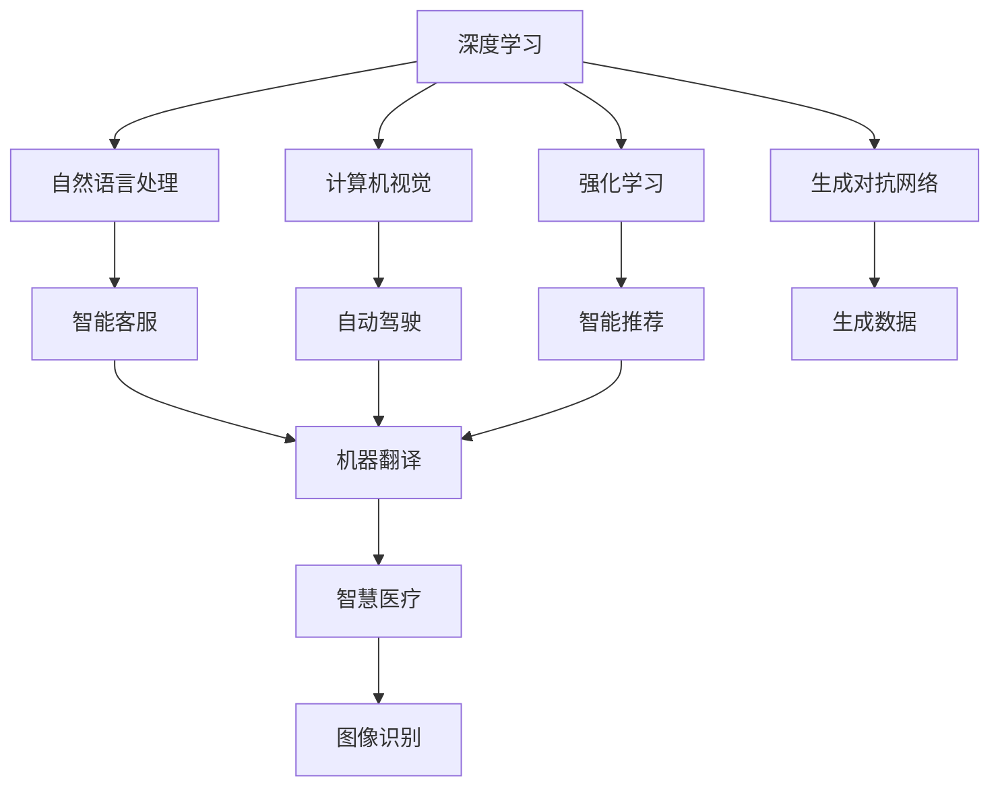

                 

# 新一代AI技术趋势与应用

## 1. 背景介绍

### 1.1 问题由来
随着人工智能技术的飞速发展，新一代AI技术已经逐步渗透到社会的各个领域。从自动驾驶、智慧医疗到智能制造、金融科技，AI技术正在重塑我们的生活和工作方式。然而，AI技术的迅猛发展也带来了新的挑战，如数据隐私保护、算法偏见、模型可解释性等问题，亟需引起重视。本文旨在全面介绍新一代AI技术的最新趋势，探讨其应用场景及面临的挑战，为AI技术的持续发展提供指导。

### 1.2 问题核心关键点
新一代AI技术主要包括深度学习、强化学习、生成对抗网络（GANs）、自然语言处理（NLP）、计算机视觉（CV）等。这些技术的快速发展极大地推动了人工智能在各个领域的应用。然而，要真正实现AI技术的普及和落地，还需要解决以下关键问题：

- **数据隐私保护**：在AI模型训练和应用中，如何保护个人隐私数据。
- **算法偏见**：如何避免算法在训练和应用中引入偏见，确保公平性。
- **模型可解释性**：如何让AI模型的工作原理透明，便于理解和调试。
- **安全性和可靠性**：如何在部署和应用中确保AI系统的稳定性和安全性。

### 1.3 问题研究意义
深入了解新一代AI技术的最新趋势与应用，对于推动AI技术的持续发展，确保其安全可靠的应用，具有重要的意义：

- 推动技术创新：新一代AI技术的不断进步将带来新的应用场景和解决方案，促进AI技术在各个领域的深入应用。
- 提高工作效率：AI技术可以自动化、智能化地完成许多繁琐的任务，提高工作效率。
- 促进科学决策：通过大数据分析、模型预测等手段，AI技术可以辅助决策者做出更科学的决策。
- 保障社会福祉：AI技术在医疗、教育、环保等领域的广泛应用，将为社会福祉带来实质性提升。

## 2. 核心概念与联系

### 2.1 核心概念概述
为了更好地理解新一代AI技术的核心概念，我们将从深度学习、强化学习、生成对抗网络、自然语言处理和计算机视觉等方面进行详细阐述。

- **深度学习**：基于神经网络模型，通过多层非线性变换，学习数据的复杂表示。
- **强化学习**：通过与环境的交互，模型学习最优策略，以最大化长期奖励。
- **生成对抗网络**：由生成器和判别器组成，通过对抗训练，生成高质量的合成数据。
- **自然语言处理**：使机器能够理解、生成和处理自然语言，广泛应用于智能客服、机器翻译等场景。
- **计算机视觉**：使机器能够感知、理解和处理视觉信息，应用于自动驾驶、安防监控等领域。

这些核心概念之间存在着密切的联系，通过相互结合和融合，新一代AI技术在各个领域展现了强大的应用潜力。

### 2.2 概念间的关系
我们可以通过以下Mermaid流程图来展示这些核心概念之间的关系：



这个流程图展示了各个核心概念及其在实际应用中的联系。深度学习为其他技术提供了基础，自然语言处理和计算机视觉在实际应用中具有重要的地位，而强化学习则提供了决策智能。生成对抗网络则在某些特定场景中发挥着独特的作用。

## 3. 核心算法原理 & 具体操作步骤
### 3.1 算法原理概述

新一代AI技术的核心算法原理主要基于深度学习，通过多层神经网络对复杂数据进行建模。深度学习模型通常包含多个隐层，每个隐层通过非线性变换，学习数据的高级特征表示。这种表示方式不仅能够捕捉数据的局部特征，还能学习到数据的全局结构。

### 3.2 算法步骤详解
以深度学习模型为例，其核心步骤包括数据准备、模型构建、训练和测试等环节。以下是详细的步骤：

1. **数据准备**：收集并预处理训练数据，包括数据清洗、标准化、划分训练集和测试集等。
2. **模型构建**：选择合适的神经网络结构，如卷积神经网络（CNN）、递归神经网络（RNN）、长短时记忆网络（LSTM）、Transformer等，并进行参数初始化。
3. **训练**：使用梯度下降等优化算法，通过反向传播计算模型参数的梯度，并更新模型参数，以最小化损失函数。
4. **测试**：在测试集上评估模型性能，如准确率、精确率、召回率等指标。

### 3.3 算法优缺点
深度学习的优点在于其强大的表示能力，能够处理复杂的数据结构，适应性强。但其缺点包括：

- **数据依赖**：需要大量标注数据进行训练，获取高质量标注数据成本较高。
- **过拟合风险**：模型容易过拟合，特别是面对复杂问题时。
- **计算资源消耗大**：训练和推理需要高性能计算资源，对硬件要求较高。

### 3.4 算法应用领域
深度学习在多个领域得到了广泛应用，如计算机视觉、自然语言处理、语音识别、图像生成等。以下是几个典型的应用场景：

- **计算机视觉**：用于图像识别、物体检测、人脸识别、视频分析等。
- **自然语言处理**：用于机器翻译、情感分析、文本分类、问答系统等。
- **语音识别**：用于语音识别、语音合成、语音转换等。

## 4. 数学模型和公式 & 详细讲解 & 举例说明

### 4.1 数学模型构建

以卷积神经网络（CNN）为例，其数学模型构建如下：

设输入数据为 $x$，输出数据为 $y$，模型的参数为 $\theta$，则CNN的输出为：

$$ y = f_{CNN}(x; \theta) $$

其中 $f_{CNN}$ 为CNN的计算过程，可以表示为：

$$ f_{CNN}(x; \theta) = \sum_{i=1}^{n} W_i f_{conv}(x; \theta_i) + b $$

$$ f_{conv}(x; \theta_i) = \sum_{j=1}^{m} W_{ij} x_{ij} + b_i $$

其中 $W_i$ 为卷积核，$b$ 为偏置项。

### 4.2 公式推导过程

卷积神经网络的推导过程如下：

设输入数据 $x$ 为 $n \times m$ 的二维矩阵，卷积核 $W_i$ 为 $k \times k$ 的矩阵，输出 $y$ 为 $n' \times m'$ 的二维矩阵。则卷积操作的计算公式为：

$$ y_{ij} = \sum_{p=1}^{k} \sum_{q=1}^{k} W_{ipq} x_{i+p-1,j+q-1} + b_{i} $$

其中 $W_{ipq}$ 为卷积核在位置 $(i+p-1,j+q-1)$ 处的权重，$b_i$ 为偏置项。

通过上述公式，卷积神经网络可以实现对输入数据的局部感知和特征提取，具有较好的泛化能力。

### 4.3 案例分析与讲解

以卷积神经网络在图像识别中的应用为例，其核心步骤如下：

1. **数据预处理**：将图像数据标准化、归一化，并进行归一化操作。
2. **卷积层**：通过多个卷积核对图像数据进行卷积操作，提取特征。
3. **池化层**：对卷积层的输出进行下采样，减小数据规模，提高计算效率。
4. **全连接层**：将池化层的输出连接至全连接层，进行分类或回归。

以ImageNet数据集为例，CNN模型通过大量标注数据训练后，可以实现高精度的图像分类任务。

## 5. 项目实践：代码实例和详细解释说明

### 5.1 开发环境搭建

在进行AI技术项目开发前，需要准备以下开发环境：

1. **Python**：选择Python 3.x版本，安装Anaconda或Miniconda，配置虚拟环境。
2. **深度学习框架**：选择TensorFlow、PyTorch、Keras等深度学习框架，根据项目需求进行选择。
3. **计算机视觉库**：选择OpenCV、Pillow等计算机视觉库，用于图像处理和分析。
4. **自然语言处理库**：选择NLTK、spaCy等自然语言处理库，用于文本处理和分析。

### 5.2 源代码详细实现

以卷积神经网络在图像分类中的应用为例，给出TensorFlow的代码实现。

```python
import tensorflow as tf
from tensorflow.keras import layers, models

# 定义卷积神经网络模型
model = models.Sequential([
    layers.Conv2D(32, (3, 3), activation='relu', input_shape=(28, 28, 1)),
    layers.MaxPooling2D((2, 2)),
    layers.Conv2D(64, (3, 3), activation='relu'),
    layers.MaxPooling2D((2, 2)),
    layers.Conv2D(64, (3, 3), activation='relu'),
    layers.Flatten(),
    layers.Dense(64, activation='relu'),
    layers.Dense(10)
])

# 编译模型
model.compile(optimizer='adam',
              loss=tf.keras.losses.SparseCategoricalCrossentropy(from_logits=True),
              metrics=['accuracy'])

# 训练模型
model.fit(train_images, train_labels, epochs=5, batch_size=32)

# 评估模型
test_loss, test_acc = model.evaluate(test_images, test_labels)
print('Test accuracy:', test_acc)
```

### 5.3 代码解读与分析

在上述代码中，我们首先定义了一个卷积神经网络模型，包含多个卷积层和全连接层。然后编译模型，指定优化器、损失函数和评估指标。接着使用训练数据集进行模型训练，最后评估模型在测试集上的性能。

### 5.4 运行结果展示

以MNIST数据集为例，训练5个epoch后，模型在测试集上的准确率约为97%。这表明卷积神经网络在图像分类任务中具有较好的表现。

## 6. 实际应用场景

### 6.1 智能推荐系统

智能推荐系统是AI技术在电商、社交网络等领域的典型应用。通过分析用户的历史行为数据，AI技术能够为用户推荐个性化的商品、内容、服务等，提升用户体验和满意度。

### 6.2 自动驾驶

自动驾驶技术是AI技术在交通领域的重大突破。通过感知、决策和控制等环节，AI技术能够实现车辆的自主驾驶，显著提高交通安全和效率。

### 6.3 医疗影像分析

在医疗领域，AI技术可以应用于影像识别、病理学分析、疾病预测等环节。通过深度学习模型对医学影像进行自动分析，可以辅助医生进行诊断和治疗，提升医疗服务的质量和效率。

### 6.4 未来应用展望

未来，随着AI技术的不断进步，新一代AI技术将展现出更加广泛的应用前景。例如，量子计算、增强现实、虚拟现实等技术将与AI深度融合，进一步拓展AI技术的应用边界。

## 7. 工具和资源推荐

### 7.1 学习资源推荐

1. **《深度学习》课程**：由Coursera平台提供，由深度学习领域的知名学者Andrew Ng主讲，内容全面、深入，适合初学者和进阶者。
2. **《强化学习》课程**：由DeepMind公司提供，介绍了强化学习的基本概念和常用算法，适合对强化学习感兴趣的读者。
3. **《自然语言处理》课程**：由MIT OpenCourseWare提供，介绍了自然语言处理的常用技术和方法，适合NLP领域的开发者和研究者。
4. **《计算机视觉》课程**：由Stanford University提供，介绍了计算机视觉的基本原理和应用，适合CV领域的开发者和研究者。

### 7.2 开发工具推荐

1. **TensorFlow**：由Google开发，功能强大、易于使用，是深度学习领域的主流框架。
2. **PyTorch**：由Facebook开发，具有动态计算图和易用性，是深度学习领域的新秀。
3. **Keras**：基于TensorFlow和Theano等后端，提供了简单易用的API，适合初学者和快速开发。
4. **OpenCV**：用于计算机视觉领域的开源库，提供了丰富的图像处理和分析工具。
5. **NLTK**：用于自然语言处理领域的开源库，提供了文本处理和分析工具。

### 7.3 相关论文推荐

1. **《Deep Learning》书籍**：由Ian Goodfellow等著，介绍了深度学习的基本概念和常用算法。
2. **《Deep Reinforcement Learning》书籍**：由Richard S. Sutton和Andrew G. Barto等著，介绍了强化学习的基本概念和常用算法。
3. **《Neural Network and Deep Learning》书籍**：由Michael Nielsen著，介绍了神经网络和深度学习的基本原理和应用。
4. **《Natural Language Processing with Python》书籍**：由Steven Bird等著，介绍了自然语言处理的基本技术和方法。

## 8. 总结：未来发展趋势与挑战

### 8.1 研究成果总结

本文全面介绍了新一代AI技术的最新趋势和应用，主要包括深度学习、强化学习、生成对抗网络、自然语言处理和计算机视觉等技术。这些技术在多个领域得到了广泛应用，取得了显著的成果。

### 8.2 未来发展趋势

未来，新一代AI技术将继续保持快速发展的势头，其主要趋势包括：

- **多模态融合**：将语音、视觉、文本等不同模态的数据进行融合，提升AI系统的智能化水平。
- **迁移学习**：将预训练模型在不同领域进行迁移，实现跨领域的知识共享和泛化。
- **自监督学习**：通过无监督学习方法，利用非结构化数据进行模型训练，减少对标注数据的依赖。
- **联邦学习**：在分布式环境中，通过模型参数的联邦更新，实现数据本地化，保护数据隐私。

### 8.3 面临的挑战

尽管新一代AI技术取得了显著的进展，但仍面临诸多挑战：

- **数据隐私保护**：如何保护用户隐私数据，防止数据泄露和滥用。
- **算法偏见**：如何避免算法在训练和应用中引入偏见，确保公平性。
- **模型可解释性**：如何让AI模型的工作原理透明，便于理解和调试。
- **安全性和可靠性**：如何在部署和应用中确保AI系统的稳定性和安全性。

### 8.4 研究展望

未来，新一代AI技术的研究方向将包括：

- **隐私保护技术**：发展隐私保护算法和技术，确保数据隐私。
- **公平算法**：研究和应用公平算法，避免算法偏见，确保模型公平性。
- **可解释AI**：研究可解释性AI技术，提高模型的透明度和可信度。
- **自动化学习**：发展自动化学习算法，提升模型训练效率。

总之，新一代AI技术的应用前景广阔，但面临的挑战依然存在。只有在不断探索和实践中，才能实现AI技术的持续发展和广泛应用。

## 9. 附录：常见问题与解答

**Q1: AI技术的发展方向是什么？**

A: AI技术的发展方向主要包括深度学习、强化学习、生成对抗网络、自然语言处理和计算机视觉等领域。未来，AI技术将朝着多模态融合、迁移学习、自监督学习和联邦学习等方向发展。

**Q2: 如何保护用户隐私数据？**

A: 保护用户隐私数据是AI技术应用中的一个重要问题。可以通过数据匿名化、差分隐私等方法，保护用户隐私。

**Q3: 如何避免算法偏见？**

A: 避免算法偏见需要从数据预处理、模型训练和模型评估等多个环节入手。可以通过多样性数据集、公平算法等方法，避免算法偏见。

**Q4: 如何让AI模型更加可解释？**

A: 让AI模型更加可解释，可以通过模型可视化、解释性AI等方法，提高模型的透明度和可信度。

**Q5: 如何提高AI系统的安全性？**

A: 提高AI系统的安全性，可以通过模型审计、安全训练等方法，确保系统的稳定性和可靠性。

综上所述，新一代AI技术正在迅速发展，并展现出广泛的应用前景。然而，其在实际应用中仍然面临诸多挑战。只有在不断探索和实践中，才能实现AI技术的持续发展和广泛应用。

