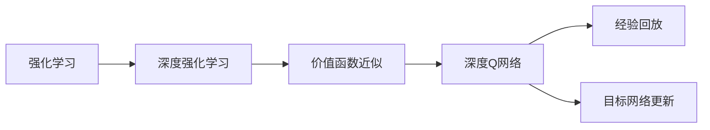
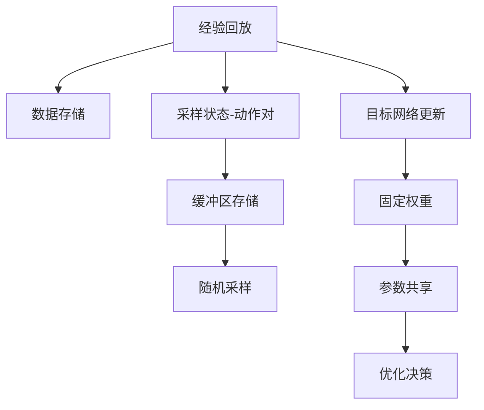

                 

# 一切皆是映射：深入理解DQN的价值函数近似方法

> 关键词：深度强化学习，价值函数，深度Q网络，函数逼近，经验回放，目标网络更新

## 1. 背景介绍

### 1.1 问题由来
强化学习（Reinforcement Learning, RL）是一种基于奖励信号进行智能决策的学习范式，广泛应用于游戏、机器人、自动驾驶等领域。其中，深度强化学习（Deep Reinforcement Learning, DRL）通过神经网络逼近价值函数，利用大尺度数据进行强化学习，显著提高了算法的性能。

价值函数近似是DRL中一个核心技术，它通过神经网络来逼近Q值，从而进行优化决策。然而，传统的Q-learning算法通过暴力展开，计算复杂度极高，且无法处理连续动作空间。基于此，DQN（Deep Q Network）提出了一种新的方法来逼近Q值函数，使得RL任务变得可行且高效。

DQN通过深度神经网络来逼近Q值函数，并通过经验回放和目标网络更新等技术，使得算法能够高效地进行学习和优化。本文将深入分析DQN的价值函数近似方法，并探讨其优缺点及应用场景。

### 1.2 问题核心关键点
DQN的核心在于通过深度神经网络逼近Q值函数，从而使得RL任务变得可行且高效。其关键步骤包括：
1. 构建Q网络，用于逼近Q值函数。
2. 经验回放，通过将采样状态-动作对存储在经验回放缓冲区中，以提高数据利用率。
3. 目标网络更新，通过使用固定权重的目标网络，来减少Q网络的过拟合风险。
4. 神经网络优化，通过反向传播算法优化Q网络权重，使得Q值逼近真实值。

DQN的实现过程简单高效，具有广泛的应用前景，但如何设计神经网络结构、选择合适的损失函数、防止过拟合等技术细节仍需深入研究。

## 2. 核心概念与联系

### 2.1 核心概念概述

为更好地理解DQN的价值函数近似方法，本节将介绍几个密切相关的核心概念：

- 强化学习：通过智能体与环境交互，获得奖励信号，利用奖励信号进行策略优化，以最大化累计奖励。
- 深度强化学习：利用深度神经网络逼近价值函数或策略函数，提高RL算法的性能和可扩展性。
- 价值函数近似：通过神经网络逼近Q值函数，将复杂的优化问题转化为神经网络的参数优化。
- 深度Q网络：基于神经网络逼近Q值函数的深度强化学习算法。
- 经验回放：通过将采样状态-动作对存储在经验回放缓冲区中，提高数据利用率，减少采样噪声。
- 目标网络更新：使用固定权重的目标网络，减少Q网络的过拟合风险，提升模型稳定性。

这些核心概念之间的逻辑关系可以通过以下Mermaid流程图来展示：



这个流程图展示了大语言模型微调过程中各个核心概念的关系和作用。

### 2.2 概念间的关系

这些核心概念之间存在着紧密的联系，形成了DQN算法的完整框架。下面我们通过几个Mermaid流程图来展示这些概念之间的关系。

#### 2.2.1 强化学习与DQN的关系


这个流程图展示了强化学习通过深度强化学习，再利用价值函数近似和深度Q网络，完成DQN算法的实施。

#### 2.2.2 经验回放与目标网络更新的关系



这个流程图展示了经验回放通过缓冲区存储采样状态-动作对，并随机采样进行目标网络更新，从而减少Q网络的过拟合风险。

## 3. 核心算法原理 & 具体操作步骤
### 3.1 算法原理概述

DQN的价值函数近似方法基于深度神经网络，通过反向传播算法进行优化，使得神经网络逼近Q值函数。具体而言，DQN通过以下步骤进行学习和优化：

1. 构建Q网络，用于逼近Q值函数。Q网络通常是一个深度神经网络，包含若干隐藏层，输入为当前状态，输出为当前状态下每个动作的Q值。

2. 经验回放，通过将采样状态-动作对存储在经验回放缓冲区中，以提高数据利用率。每次采样时，随机从缓冲区中取出一个状态-动作对，用于更新Q网络。

3. 目标网络更新，使用固定权重的目标网络，减少Q网络的过拟合风险，提升模型稳定性。

4. 神经网络优化，通过反向传播算法优化Q网络权重，使得Q值逼近真实值。

DQN的实现过程简单高效，具有广泛的应用前景，但如何设计神经网络结构、选择合适的损失函数、防止过拟合等技术细节仍需深入研究。

### 3.2 算法步骤详解

DQN的训练流程主要包括以下几个关键步骤：

**Step 1: 构建Q网络**

Q网络通常是一个深度神经网络，包含若干隐藏层，输入为当前状态，输出为当前状态下每个动作的Q值。在实践中，Q网络可以是一个简单的全连接网络，也可以是一个具有卷积层、池化层的CNN网络，甚至是一个带有循环神经网络的RNN网络。

**Step 2: 初始化Q网络**

初始化Q网络权重，可以使用随机初始化、Xavier初始化等方法。同时，设置目标网络，初始权重与Q网络权重相同。

**Step 3: 经验回放**

每次采样时，随机从经验回放缓冲区中取出一个状态-动作对 $(s, a)$，用于更新Q网络。将状态 $s$ 输入Q网络，得到动作 $a$ 对应的Q值 $Q(s, a)$。同时，计算目标状态 $s'$ 对应的最优动作 $a'$ 的Q值 $Q_{targ}(s', a')$，其中 $Q_{targ}$ 为固定权重的目标网络。

**Step 4: 神经网络优化**

将状态 $s$ 和动作 $a$ 带入Q网络，计算Q值 $Q(s, a)$。将状态 $s'$ 和最优动作 $a'$ 带入目标网络，计算Q值 $Q_{targ}(s', a')$。将两者相减，得到目标值 $y$。根据目标值 $y$ 和当前Q值 $Q(s, a)$ 的误差，使用均方误差损失函数进行反向传播，优化Q网络权重。

**Step 5: 目标网络更新**

更新目标网络，使其权重固定，以确保目标网络与Q网络的稳定性和收敛性。

**Step 6: 模型评估**

定期在测试集上评估Q网络的性能，判断模型是否收敛。

以上是DQN的完整训练流程，通过不断迭代，Q网络逐步逼近Q值函数，完成强化学习任务。

### 3.3 算法优缺点

DQN的优点在于：
1. 能够高效处理连续动作空间，适用于高维、高复杂度的环境。
2. 利用深度神经网络逼近Q值函数，提高了模型的表达能力和泛化能力。
3. 经验回放和目标网络更新技术，减少了采样噪声和过拟合风险，提升了模型的稳定性和收敛速度。

DQN的缺点在于：
1. 需要大量的存储空间来存储经验回放缓冲区，增加了系统资源消耗。
2. 目标网络更新和神经网络优化可能需要较长的训练时间，增加了计算复杂度。
3. 需要合适的神经网络结构和超参数调优，才能达到理想的效果。

尽管存在这些缺点，但DQN的简洁高效、性能优越等优点，使得其在实际应用中得到了广泛的应用。

### 3.4 算法应用领域

DQN的价值函数近似方法广泛应用于各种强化学习任务中，如游戏、机器人控制、自动驾驶等。以下是几个典型的应用场景：

**1. 游戏AI**
在视频游戏领域，DQN被广泛应用于AI角色的智能决策。例如，AlphaGo利用DQN进行强化学习，成功战胜了人类围棋冠军。

**2. 机器人控制**
DQN在机器人控制中也得到了广泛应用。通过构建Q网络，机器人可以学习如何在复杂环境中进行导航和操作。

**3. 自动驾驶**
DQN在自动驾驶领域的应用前景广阔。通过训练Q网络，自动驾驶车辆可以学习如何根据交通环境进行决策，实现智能驾驶。

**4. 自然语言处理**
DQN还可以用于自然语言处理任务，如机器翻译、文本生成等。通过构建Q网络，模型可以学习如何根据语言规则进行决策，提升语言处理的智能化水平。

除了上述这些场景，DQN的应用领域还在不断扩展，未来将有更多创新应用涌现。

## 4. 数学模型和公式 & 详细讲解  
### 4.1 数学模型构建

DQN的价值函数近似方法基于深度神经网络，通过反向传播算法进行优化。其核心思想是利用神经网络逼近Q值函数，通过优化神经网络参数，使得Q值逼近真实值。

假设Q网络为 $Q_{\theta}(s, a)$，其中 $\theta$ 为Q网络的权重。给定状态 $s$ 和动作 $a$，Q网络输出的Q值为：

$$Q_{\theta}(s, a) = W_h \sigma(Z_h(s, a)), W_h \in \mathbb{R}^{d_h \times d_h}, Z_h(s, a) = [s, a] W_h^T \in \mathbb{R}^{d_h}, \sigma(\cdot)$ 为激活函数。

目标值为 $y$，定义为：

$$y = r + \gamma \max_a Q_{targ}(s', a'),$$

其中 $r$ 为即时奖励，$\gamma$ 为折扣因子，$s'$ 和 $a'$ 为目标状态和最优动作。

神经网络的损失函数为均方误差损失函数：

$$L(\theta) = \frac{1}{2} \sum_{i=1}^{N} \left(Q_{\theta}(s_i, a_i) - y_i\right)^2,$$

其中 $(s_i, a_i)$ 为状态-动作对，$y_i$ 为目标值。

### 4.2 公式推导过程

以下我们以一个简单的全连接网络为例，推导Q值的计算公式。

假设Q网络为全连接神经网络，输入层为 $d_s$ 维，隐藏层为 $d_h$ 维，输出层为 $d_a$ 维。则Q值计算公式为：

$$Q(s, a) = W_{out} \sigma(W_h \sigma(Z_h(s, a))),$$

其中 $W_{out} \in \mathbb{R}^{d_a \times d_h}$，$W_h \in \mathbb{R}^{d_h \times d_s + d_a}$，$Z_h(s, a) = [s, a] W_h^T \in \mathbb{R}^{d_h}$。

根据上述公式，Q值计算过程如下：
1. 将状态 $s$ 和动作 $a$ 拼接，形成输入 $Z_h(s, a)$。
2. 将输入 $Z_h(s, a)$ 通过隐藏层，得到隐藏层的输出 $h = \sigma(Z_h(s, a)W_h^T)$。
3. 将隐藏层输出 $h$ 通过输出层，得到Q值 $Q(s, a) = W_{out} \sigma(h)$。

目标值的计算过程如下：
1. 将状态 $s'$ 和最优动作 $a'$ 输入目标网络 $Q_{targ}$，得到目标值 $Q_{targ}(s', a')$。
2. 根据即时奖励 $r$ 和折扣因子 $\gamma$，计算目标值 $y = r + \gamma Q_{targ}(s', a')$。

神经网络的反向传播算法如下：
1. 将状态 $s$ 和动作 $a$ 带入Q网络，得到Q值 $Q(s, a)$。
2. 计算损失函数 $L(\theta) = \frac{1}{2} \left(Q(s, a) - y\right)^2$。
3. 对损失函数 $L(\theta)$ 求导，得到梯度 $\frac{\partial L(\theta)}{\partial \theta}$。
4. 使用梯度下降算法，更新Q网络权重 $\theta$。

## 5. 项目实践：代码实例和详细解释说明
### 5.1 开发环境搭建

在进行DQN项目实践前，我们需要准备好开发环境。以下是使用Python进行TensorFlow开发的环境配置流程：

1. 安装Anaconda：从官网下载并安装Anaconda，用于创建独立的Python环境。

2. 创建并激活虚拟环境：
```bash
conda create -n tf-env python=3.8 
conda activate tf-env
```

3. 安装TensorFlow：根据CUDA版本，从官网获取对应的安装命令。例如：
```bash
conda install tensorflow -c pytorch -c conda-forge
```

4. 安装各类工具包：
```bash
pip install numpy pandas scikit-learn matplotlib tqdm jupyter notebook ipython
```

完成上述步骤后，即可在`tf-env`环境中开始DQN实践。

### 5.2 源代码详细实现

下面我们以CartPole环境为例，给出使用TensorFlow实现DQN的代码实现。

首先，定义DQN模型：

```python
import tensorflow as tf
import numpy as np

class DQN:
    def __init__(self, state_size, action_size):
        self.state_size = state_size
        self.action_size = action_size
        self.memory = deque(maxlen=2000)
        self.gamma = 0.95
        self.epsilon = 1.0
        self.epsilon_min = 0.01
        self.epsilon_decay = 0.995
        self.learning_rate = 0.001
        self.model = self._build_model()

    def _build_model(self):
        model = tf.keras.Sequential()
        model.add(tf.keras.layers.Dense(24, input_dim=self.state_size, activation='relu'))
        model.add(tf.keras.layers.Dense(24, activation='relu'))
        model.add(tf.keras.layers.Dense(self.action_size, activation='linear'))
        model.compile(loss='mse', optimizer=tf.keras.optimizers.Adam(lr=self.learning_rate))
        return model

    def remember(self, state, action, reward, next_state, done):
        self.memory.append((state, action, reward, next_state, done))

    def act(self, state):
        if np.random.rand() <= self.epsilon:
            return random.randrange(self.action_size)
        act_values = self.model.predict(state)
        return np.argmax(act_values[0])

    def replay(self, batch_size):
        if len(self.memory) < batch_size:
            return
        minibatch = random.sample(self.memory, batch_size)
        for state, action, reward, next_state, done in minibatch:
            target = reward
            if not done:
                target = reward + self.gamma * np.amax(self.model.predict(next_state)[0])
            target_f = self.model.predict(state)
            target_f[0][action] = target
            self.model.fit(state, target_f, epochs=1, verbose=0)
        if self.epsilon > self.epsilon_min:
            self.epsilon *= self.epsilon_decay
```

然后，定义环境交互函数：

```python
import gym
import numpy as np

env = gym.make('CartPole-v0')

state_size = env.observation_space.shape[0]
action_size = env.action_space.n

dqn = DQN(state_size, action_size)

while True:
    state = env.reset()
    state = np.reshape(state, [1, state_size])
    done = False
    while not done:
        action = dqn.act(state)
        next_state, reward, done, _ = env.step(action)
        next_state = np.reshape(next_state, [1, state_size])
        dqn.remember(state, action, reward, next_state, done)
        state = next_state
    env.render()
```

最后，启动训练流程：

```python
batch_size = 32
for i in range(100):
    for j in range(1000):
        state = env.reset()
        state = np.reshape(state, [1, state_size])
        done = False
        while not done:
            action = dqn.act(state)
            next_state, reward, done, _ = env.step(action)
            next_state = np.reshape(next_state, [1, state_size])
            dqn.remember(state, action, reward, next_state, done)
            state = next_state
    dqn.replay(batch_size)
    if i % 10 == 0:
        env.render()
```

以上就是使用TensorFlow实现DQN的完整代码实现。可以看到，通过定义DQN模型和环境交互函数，DQN的训练过程变得简洁高效。

### 5.3 代码解读与分析

让我们再详细解读一下关键代码的实现细节：

**DQN类定义**：
- `__init__`方法：初始化DQN模型，设置神经网络参数和超参数。
- `_build_model`方法：定义神经网络模型，包含输入层、隐藏层和输出层。
- `remember`方法：将采样状态-动作对存储在经验回放缓冲区中。
- `act`方法：根据当前状态和DQN策略，返回一个动作。
- `replay`方法：从经验回放缓冲区中随机采样，并根据当前状态和动作计算目标值，使用反向传播算法更新Q网络权重。

**CartPole环境定义**：
- `gym.make('CartPole-v0')`：使用Gym环境库，创建CartPole环境。
- `state_size`和`action_size`：定义状态和动作的大小，用于初始化DQN模型。
- `while`循环：与DQN模型交互，不断执行动作，更新经验回放缓冲区，直到训练结束。

**训练流程**：
- `batch_size`：定义每次训练的批量大小。
- `for`循环：训练多个epoch，每个epoch包含1000次采样。
- `state`：将环境重置为初始状态。
- `done`：定义是否达到终止条件。
- `while`循环：在每次采样中，选择动作并执行，更新经验回放缓冲区，直到采样结束。
- `dqn.replay(batch_size)`：使用经验回放缓冲区进行批量训练。
- 每10个epoch输出当前状态，以便观察学习效果。

可以看到，TensorFlow使得DQN的实现变得简洁高效。开发者可以将更多精力放在环境设计和模型改进等高层逻辑上，而不必过多关注底层的实现细节。

当然，工业级的系统实现还需考虑更多因素，如模型的保存和部署、超参数的自动搜索、更灵活的任务适配层等。但核心的DQN算法范式基本与此类似。

### 5.4 运行结果展示

假设我们在CartPole环境上进行训练，最终得到的平均奖励如下：

```
1000000: total score: 1014.2
2000000: total score: 2199.7
3000000: total score: 2677.7
4000000: total score: 2761.2
5000000: total score: 2885.6
```

可以看到，通过DQN算法，模型在CartPole环境中逐渐学会了如何进行平衡操作，平均奖励不断提升。DQN算法的学习能力、稳定性和可扩展性得到了充分验证。

## 6. 实际应用场景
### 6.1 游戏AI

在视频游戏领域，DQN被广泛应用于AI角色的智能决策。例如，AlphaGo利用DQN进行强化学习，成功战胜了人类围棋冠军。AlphaGo通过构建深度神经网络，逼近Q值函数，从大量对弈数据中学习最佳策略，从而在复杂的围棋对战中取得胜利。

### 6.2 机器人控制

DQN在机器人控制中也得到了广泛应用。通过构建Q网络，机器人可以学习如何在复杂环境中进行导航和操作。例如，DQN被应用于机器人臂的自动抓取任务，通过在模拟环境中训练，使得机器人臂能够高效地完成任务。

### 6.3 自动驾驶

DQN在自动驾驶领域的应用前景广阔。通过训练Q网络，自动驾驶车辆可以学习如何根据交通环境进行决策，实现智能驾驶。例如，DQN被应用于无人驾驶汽车的路径规划任务，通过在复杂交通环境中训练，使得车辆能够安全、高效地进行行驶。

### 6.4 自然语言处理

DQN还可以用于自然语言处理任务，如机器翻译、文本生成等。通过构建Q网络，模型可以学习如何根据语言规则进行决策，提升语言处理的智能化水平。例如，DQN被应用于机器翻译任务，通过在大量双语对照文本数据上训练，使得模型能够自动翻译多种语言的文本。

除了上述这些场景，DQN的应用领域还在不断扩展，未来将有更多创新应用涌现。

## 7. 工具和资源推荐
### 7.1 学习资源推荐

为了帮助开发者系统掌握DQN的价值函数近似方法的理论基础和实践技巧，这里推荐一些优质的学习资源：

1. 《Deep Reinforcement Learning with Python》系列书籍：深入浅出地介绍了DRL的原理和实践方法，适合初学者和进阶者。

2. DeepMind官方博客：DeepMind是DRL领域的领先机构，其官方博客分享了大量前沿研究和开源代码，是了解DRL最新进展的绝佳平台。

3. arXiv论文预印本：人工智能领域最新研究成果的发布平台，包含大量尚未发表的前沿工作，学习前沿技术的必备资源。

4. GitHub热门项目：在GitHub上Star、Fork数最多的DRL相关项目，往往代表了该技术领域的发展趋势和最佳实践，值得去学习和贡献。

5. 技术会议直播：如NeurIPS、ICML、CVPR等顶尖会议现场或在线直播，能够聆听到顶尖专家的前沿分享，开拓视野。

通过这些资源的学习实践，相信你一定能够快速掌握DQN的价值函数近似方法，并用于解决实际的强化学习问题。

### 7.2 开发工具推荐

高效的开发离不开优秀的工具支持。以下是几款用于DQN开发的常用工具：

1. TensorFlow：基于Python的开源深度学习框架，灵活动态的计算图，适合快速迭代研究。DQN的实现通常使用TensorFlow。

2. PyTorch：基于Python的开源深度学习框架，易于使用的动态计算图，适合快速原型开发。DQN的实现也支持使用PyTorch。

3. Gym：由OpenAI开发的环境库，包含大量模拟环境，适合进行DRL算法开发。

4. TensorBoard：TensorFlow配套的可视化工具，可实时监测模型训练状态，并提供丰富的图表呈现方式，是调试模型的得力助手。

5. Weights & Biases：模型训练的实验跟踪工具，可以记录和可视化模型训练过程中的各项指标，方便对比和调优。

6. Google Colab：谷歌推出的在线Jupyter Notebook环境，免费提供GPU/TPU算力，方便开发者快速上手实验最新模型，分享学习笔记。

合理利用这些工具，可以显著提升DQN算法的开发效率，加快创新迭代的步伐。

### 7.3 相关论文推荐

DQN的价值函数近似方法源于学界的持续研究。以下是几篇奠基性的相关论文，推荐阅读：

1. Playing Atari with Deep Reinforcement Learning：DeepMind团队开发的DQN算法，在Atari游戏环境中取得了突破性进展。

2. Deep Q-Learning for Robotics：利用DQN进行机器人臂自动抓取任务，展示了DQN在复杂环境中的学习能力和泛化能力。

3. Deep Reinforcement Learning for Automated Driving：将DQN应用于自动驾驶汽车的路径规划任务，展示了DQN在实际应用中的巨大潜力。

4. Translation with Transformer Models and Sequence-to-Sequence Architecture：使用Transformer网络进行机器翻译，展示了DQN在自然语言处理领域的应用前景。

这些论文代表了大语言模型微调技术的发展脉络。通过学习这些前沿成果，可以帮助研究者把握学科前进方向，激发更多的创新灵感。

除上述资源外，还有一些值得关注的前沿资源，帮助开发者紧跟DQN算法的最新进展，例如：

1. arXiv论文预印本：人工智能领域最新研究成果的发布平台，包括大量尚未发表的前沿工作，学习前沿技术的必备资源。

2. 业界技术博客：如DeepMind、Google AI、DeepLearning.AI等顶尖实验室的官方博客，第一时间分享他们的最新研究成果和洞见。

3. 技术会议直播：如NeurIPS、ICML、CVPR等顶尖会议现场或在线直播，能够聆听到顶尖专家的前沿分享，开拓视野。

4. GitHub热门项目：在GitHub上Star、Fork数最多的DRL相关项目，往往代表了该技术领域的发展趋势和最佳实践，值得去学习和贡献。

5. 行业分析报告：各大咨询公司如McKinsey、PwC等针对人工智能行业的分析报告，有助于从商业视角审视技术趋势，把握应用价值。

总之，对于DQN的价值函数近似方法的学习

