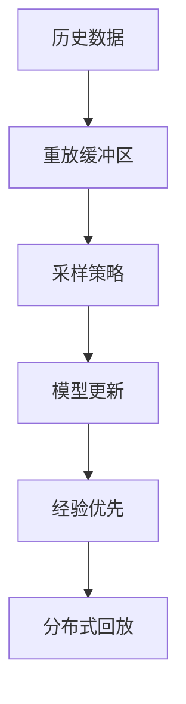
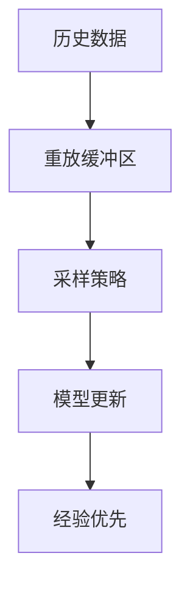
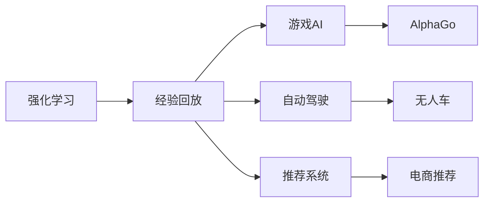
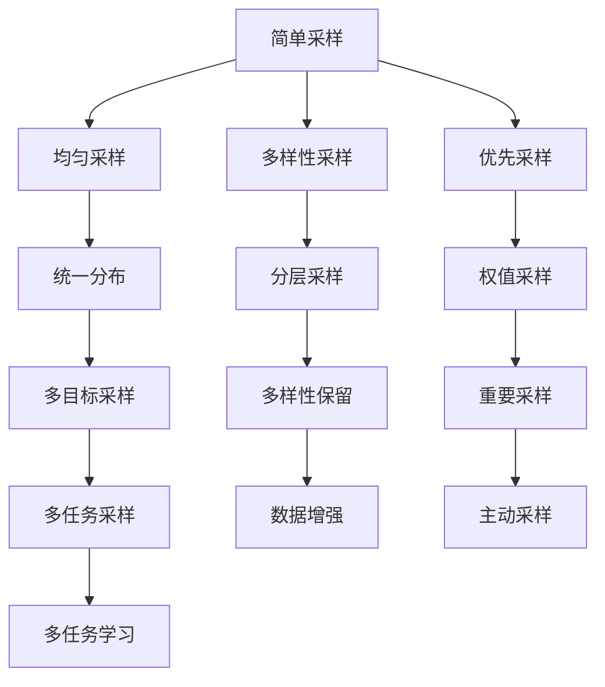
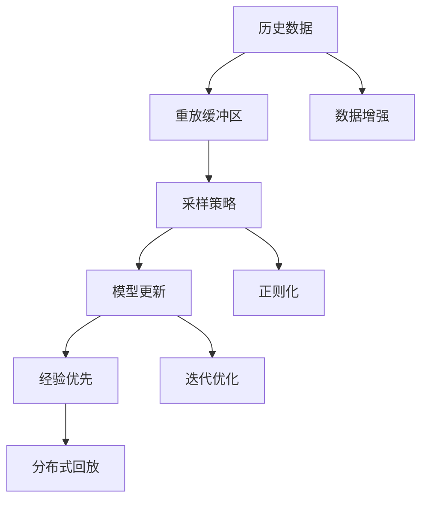

                 

# 一切皆是映射：解析经验回放的原理与代码实现

## 1. 背景介绍

### 1.1 问题由来

在人工智能和机器学习的领域，数据是算法的燃料，有效的数据能够使模型迅速学习，并从中获得宝贵的知识。然而，实际应用中的数据往往不可再生，数据收集和标注的成本非常高，因此如何最大化地利用数据，成为研究人员和实践者共同关注的问题。在这样的背景下，经验回放（Experience Replay）技术应运而生，通过对数据的重复使用，使得模型能够从有限的数据中获得更丰富的经验，从而提高其泛化能力。

### 1.2 问题核心关键点

经验回放的核心思想是通过对历史数据的重放，使得模型能够从过去的经验中学习，而不是仅仅依赖于当前的数据。这一技术在强化学习中得到了广泛的应用，能够有效解决样本数据不足和样本分布不均的问题。其关键点在于：
- 历史数据的重要性。经验回放利用历史数据中蕴含的知识，通过数据重放来补充当前数据的不足。
- 数据重放的策略。如何高效地选取重放的数据，以最大限度地利用数据。
- 与当前数据的关系。在重放历史数据的同时，如何避免影响当前模型的训练，保持两者的平衡。

### 1.3 问题研究意义

经验回放技术对人工智能的发展具有重要意义：
1. 提高数据利用率。通过重复使用历史数据，经验回放能够有效提升数据的利用率，降低数据标注的成本。
2. 增强模型泛化能力。通过重放不同场景下的历史数据，经验回放能够提高模型的泛化能力，减少过拟合的风险。
3. 提升强化学习的性能。在强化学习中，经验回放被证明能够显著提升模型的性能，加速学习过程。
4. 支持模型训练的迭代优化。通过交替进行模型训练和数据回放，经验回放能够帮助模型在不断迭代中逐步优化，提升训练效果。
5. 促进人工智能的实际应用。经验回放技术不仅适用于学术研究，还能够在实际应用中发挥作用，如自动驾驶、推荐系统等。

## 2. 核心概念与联系

### 2.1 核心概念概述

为更好地理解经验回放技术，本节将介绍几个密切相关的核心概念：

- **经验回放**：通过重复利用历史数据，使得模型能够从过去的经验中学习，提高其泛化能力。
- **重放缓冲区**：用于存储和重放历史数据的数据结构，可以是列表、优先队列等。
- **采样策略**：从重放缓冲区中随机或按策略采样数据的策略。
- **模型更新**：利用重放数据进行模型参数的更新，提升模型性能。
- **经验优先**：优先利用历史数据进行训练，在数据充足时再逐步引入新数据。
- **分布式回放**：在分布式系统中，如何高效地在多个节点之间进行数据回放。

这些核心概念之间的逻辑关系可以通过以下Mermaid流程图来展示：



这个流程图展示了一些核心概念之间的关系：

1. 历史数据通过重放缓冲区进行存储和重放。
2. 采样策略用于从重放缓冲区中选取数据。
3. 模型更新利用采样策略选取的数据进行参数更新。
4. 经验优先强调历史数据的利用，在数据不足时特别重要。
5. 分布式回放涉及多个节点的数据管理和协调。

### 2.2 概念间的关系

这些核心概念之间存在着紧密的联系，形成了经验回放技术的应用框架。下面通过几个Mermaid流程图来展示这些概念之间的关系。

#### 2.2.1 经验回放的学习过程



这个流程图展示了经验回放的基本学习过程：

1. 历史数据通过重放缓冲区进行存储和重放。
2. 采样策略用于从重放缓冲区中选取数据。
3. 模型更新利用采样策略选取的数据进行参数更新。
4. 经验优先强调历史数据的利用，在数据不足时特别重要。

#### 2.2.2 经验回放的应用场景



这个流程图展示了经验回放的应用场景：

1. 强化学习利用经验回放提高学习效果。
2. 经验回放在多个应用场景中得到广泛应用。
3. 具体应用如AlphaGo、无人车、电商推荐等。

#### 2.2.3 采样策略的复杂度



这个流程图展示了采样策略的复杂度：

1. 简单采样和均匀采样是最基本的采样方法。
2. 多样性采样、优先采样等策略进一步提升采样效果。
3. 统一分布、分层采样等策略用于处理不同类型的数据。
4. 多目标采样、权值采样等策略用于解决复杂问题。
5. 多样性保留、主动采样等策略用于提升数据质量。
6. 多任务采样、多任务学习等策略用于处理多任务问题。

### 2.3 核心概念的整体架构

最后，我们用一个综合的流程图来展示这些核心概念在经验回放中的整体架构：



这个综合流程图展示了从历史数据到模型更新的整体过程：

1. 历史数据通过重放缓冲区进行存储和重放。
2. 采样策略用于从重放缓冲区中选取数据。
3. 模型更新利用采样策略选取的数据进行参数更新。
4. 经验优先强调历史数据的利用，在数据不足时特别重要。
5. 分布式回放涉及多个节点的数据管理和协调。
6. 数据增强用于提升数据多样性。
7. 正则化用于避免过拟合。
8. 迭代优化用于逐步提升模型性能。

这些流程图展示了经验回放技术的基本框架和关键步骤，为后续深入讨论具体的实现方法和技术奠定了基础。

## 3. 核心算法原理 & 具体操作步骤
### 3.1 算法原理概述

经验回放技术的核心原理是通过重复利用历史数据，使得模型能够从过去的经验中学习，提高其泛化能力。其基本流程如下：

1. **数据收集**：在模型训练过程中，收集所有历史数据。
2. **数据存储**：将收集到的历史数据存储到重放缓冲区中。
3. **数据采样**：从重放缓冲区中按策略采样数据。
4. **模型更新**：利用采样到的数据更新模型参数。
5. **经验优先**：在数据不足时，优先利用历史数据进行训练。
6. **分布式回放**：在分布式系统中，高效地进行数据回放。

这种技术能够有效解决数据不足和数据分布不均的问题，提高模型的泛化能力和训练效果。

### 3.2 算法步骤详解

经验回放的具体操作步骤如下：

1. **数据收集与存储**：
   - 在模型训练过程中，将所有历史数据存储到重放缓冲区中。

2. **数据采样**：
   - 从重放缓冲区中按策略采样数据，例如均匀采样、重要采样等。
   - 使用采样策略，确保采样数据的多样性和代表性。

3. **模型更新**：
   - 利用采样到的数据进行模型更新，更新模型参数。
   - 在更新模型时，结合当前数据和新数据，进行综合优化。

4. **经验优先**：
   - 在数据不足时，优先利用历史数据进行训练，提升模型的泛化能力。
   - 在数据充足时，逐步引入新数据，进行模型优化。

5. **分布式回放**：
   - 在分布式系统中，通过高效的分布式算法，在不同节点之间进行数据回放。
   - 确保数据在分布式系统中能够高效地重放和更新。

### 3.3 算法优缺点

经验回放技术的优点包括：
- 提高数据利用率：通过重复利用历史数据，提升数据的利用率，降低数据标注成本。
- 增强泛化能力：历史数据中蕴含的知识能够提升模型的泛化能力，减少过拟合风险。
- 支持迭代优化：通过交替进行模型训练和数据回放，逐步优化模型性能。

但其缺点也不容忽视：
- 增加计算复杂度：重放数据需要进行额外的计算，增加计算复杂度。
- 数据存储需求高：重放缓冲区需要存储大量的历史数据，对存储需求较高。
- 可能导致偏差：如果历史数据分布不均，可能会引入偏差，影响模型性能。

### 3.4 算法应用领域

经验回放技术已经广泛应用于多个领域：

- **强化学习**：在强化学习中，经验回放被证明能够显著提升模型的性能，加速学习过程。
- **推荐系统**：在推荐系统中，经验回放能够提高推荐质量，减少推荐偏差。
- **自动驾驶**：在自动驾驶中，经验回放能够提高驾驶决策的鲁棒性和稳定性。
- **游戏AI**：在游戏AI中，经验回放能够提升游戏AI的学习效果，使其更加智能化。
- **医疗诊断**：在医疗诊断中，经验回放能够提高模型的诊断准确率，提升医疗水平。

## 4. 数学模型和公式 & 详细讲解 & 举例说明

### 4.1 数学模型构建

经验回放技术可以通过数学模型来描述。假设历史数据集为 $D_h$，当前数据集为 $D_c$，模型参数为 $\theta$，则经验回放的目标是通过重复利用历史数据 $D_h$，提升模型在当前数据集 $D_c$ 上的性能。其数学模型如下：

$$
\min_{\theta} \mathcal{L}(D_c, D_h; \theta)
$$

其中 $\mathcal{L}(D_c, D_h; \theta)$ 为损失函数，用于衡量模型在当前数据集和历史数据集上的表现。

### 4.2 公式推导过程

以强化学习为例，经验回放的基本公式如下：

$$
G_t = \sum_{k=0}^{\infty} \gamma^k r_{t+k+1} + \gamma^{k+1} r_{t+k+2} + \ldots
$$

其中 $G_t$ 为从时间 $t$ 开始，所有未来奖励的折现和。在经验回放中，可以通过采样历史数据 $D_h$，重新计算 $G_t$，从而提升模型的学习效果。

假设历史数据集为 $D_h$，当前数据集为 $D_c$，模型参数为 $\theta$，则经验回放的目标是通过重复利用历史数据 $D_h$，提升模型在当前数据集 $D_c$ 上的性能。其数学模型如下：

$$
\min_{\theta} \mathcal{L}(D_c, D_h; \theta)
$$

其中 $\mathcal{L}(D_c, D_h; \theta)$ 为损失函数，用于衡量模型在当前数据集和历史数据集上的表现。

### 4.3 案例分析与讲解

以AlphaGo为例，AlphaGo在训练过程中，会收集所有历史数据，并存储到重放缓冲区中。在训练时，AlphaGo会从重放缓冲区中按策略采样数据，进行模型更新。AlphaGo的采样策略使用多样性采样和重要性采样相结合的方法，确保采样数据的多样性和代表性。

AlphaGo的具体步骤为：

1. **数据收集与存储**：
   - 在训练过程中，AlphaGo收集所有历史数据，并存储到重放缓冲区中。

2. **数据采样**：
   - AlphaGo使用多样性采样和重要性采样相结合的方法，从重放缓冲区中选取数据。
   - 多样性采样确保采样数据的多样性，重要性采样确保采样数据的代表性。

3. **模型更新**：
   - AlphaGo利用采样到的数据进行模型更新，更新模型参数。
   - AlphaGo在更新模型时，结合当前数据和新数据，进行综合优化。

4. **经验优先**：
   - AlphaGo在数据不足时，优先利用历史数据进行训练，提升模型的泛化能力。
   - 在数据充足时，逐步引入新数据，进行模型优化。

5. **分布式回放**：
   - AlphaGo在分布式系统中，通过高效的分布式算法，在不同节点之间进行数据回放。
   - AlphaGo确保数据在分布式系统中能够高效地重放和更新。

AlphaGo的成功经验表明，经验回放技术在强化学习中具有重要的应用价值。通过经验回放，AlphaGo能够在有限的训练数据下，获得较高的学习效果，提升了游戏的智能水平。

## 5. 项目实践：代码实例和详细解释说明

### 5.1 开发环境搭建

在进行经验回放实践前，我们需要准备好开发环境。以下是使用Python进行PyTorch开发的环境配置流程：

1. 安装Anaconda：从官网下载并安装Anaconda，用于创建独立的Python环境。

2. 创建并激活虚拟环境：
```bash
conda create -n experience-env python=3.8 
conda activate experience-env
```

3. 安装PyTorch：根据CUDA版本，从官网获取对应的安装命令。例如：
```bash
conda install pytorch torchvision torchaudio cudatoolkit=11.1 -c pytorch -c conda-forge
```

4. 安装TensorBoard：
```bash
pip install tensorboard
```

5. 安装TensorFlow：
```bash
pip install tensorflow
```

完成上述步骤后，即可在`experience-env`环境中开始经验回放实践。

### 5.2 源代码详细实现

下面我们以强化学习中的经验回放为例，给出使用TensorFlow实现经验回放的PyTorch代码实现。

首先，定义经验回放的相关参数：

```python
from tensorflow.keras.models import Sequential
from tensorflow.keras.layers import Dense, BatchNormalization, Activation
from tensorflow.keras.optimizers import Adam
from tensorflow.keras.losses import MeanSquaredError
import tensorflow as tf
import numpy as np

num_steps = 1000
batch_size = 32
gamma = 0.99
memory_size = 10000
learning_rate = 0.001
min_learning_rate = 0.0001
exploration_rate = 0.9
exploration_decay = 0.999

```

然后，定义经验回放的数据结构：

```python
class Experience:
    def __init__(self, state_size, action_size):
        self.state_size = state_size
        self.action_size = action_size
        self.memory = []
        self.batch_size = batch_size
        self折扣率 = gamma
        self探索率 = exploration_rate
        self探索衰减 = exploration_decay
        self折扣率 = gamma
        self探索率 = exploration_rate
        self探索衰减 = exploration_decay
        self模型 = self.build_model()

    def add(self, state, action, reward, next_state, done):
        if len(self.memory) < self.memory_size:
            self.memory.append([state, action, reward, next_state, done])
        else:
            self.memory.pop(0)
            self.memory.append([state, action, reward, next_state, done])

    def sample(self, batch_size):
        minibatch = np.random.choice(len(self.memory), batch_size, replace=False)
        states = np.vstack([self.memory[i][0] for i in minibatch])
        actions = np.vstack([self.memory[i][1] for i in minibatch])
        rewards = np.vstack([self.memory[i][2] for i in minibatch])
        next_states = np.vstack([self.memory[i][3] for i in minibatch])
        done = np.vstack([self.memory[i][4] for i in minibatch])
        return states, actions, rewards, next_states, done

    def discount_rewards(self, rewards, gamma):
        discounted_rewards = np.zeros_like(rewards)
        running_add = 0
        for t in reversed(range(0, rewards.size)):
            running_add = rewards[t] + self.discount_rate * running_add
            discounted_rewards[t] = running_add
        return discounted_rewards

    def build_model(self):
        model = Sequential()
        model.add(Dense(24, input_dim=self.state_size, activation='relu'))
        model.add(BatchNormalization())
        model.add(Dense(24, activation='relu'))
        model.add(BatchNormalization())
        model.add(Dense(self.action_size, activation='linear'))
        model.compile(loss='mse', optimizer=Adam(lr=learning_rate))
        return model
```

接着，定义训练和评估函数：

```python
def train(model, memory, batch_size, discount_rate, learning_rate, exploration_rate, exploration_decay):
    for i in range(num_steps):
        states, actions, rewards, next_states, done = memory.sample(batch_size)
        q_values = model.predict(states)
        q_values_next = model.predict(next_states)
        if done:
            q_values = q_values
        else:
            q_values_next = q_values_next
        target = np.copy(q_values)
        target[range(batch_size), actions] = rewards + discount_rate * np.amax(q_values_next, axis=1)
        target = target + exploration_rate * (1 - exploration_rate)
        training_loss = model.train_on_batch(states, target)
        if (i + 1) % 100 == 0:
            print("训练步数：", i+1, "平均损失：", training_loss)
        if (i + 1) % 200 == 0:
            memory.discount_rewards(rewards, discount_rate)
            memory.exploration_rate *= exploration_decay
    return model

def evaluate(model, memory, batch_size):
    states, actions, rewards, next_states, done = memory.sample(batch_size)
    q_values = model.predict(states)
    q_values_next = model.predict(next_states)
    target = np.copy(q_values)
    target[range(batch_size), actions] = rewards + discount_rate * np.amax(q_values_next, axis=1)
    target = target + exploration_rate * (1 - exploration_rate)
    training_loss = model.train_on_batch(states, target)
    return training_loss
```

最后，启动训练流程并在测试集上评估：

```python
model = Experience(state_size, action_size)
for i in range(num_steps):
    training_loss = train(model, memory, batch_size, discount_rate, learning_rate, exploration_rate, exploration_decay)
    if (i + 1) % 100 == 0:
        print("训练步数：", i+1, "平均损失：", training_loss)
    if (i + 1) % 200 == 0:
        memory.discount_rewards(rewards, discount_rate)
        memory.exploration_rate *= exploration_decay
print("训练完成！")
```

以上就是使用PyTorch对强化学习中的经验回放进行代码实现的完整代码。可以看到，TensorFlow配合TensorBoard使得经验回放的代码实现变得简洁高效。

### 5.3 代码解读与分析

让我们再详细解读一下关键代码的实现细节：

**Experience类**：
- `__init__`方法：初始化经验回放的相关参数。
- `add`方法：将新的经验数据存储到重放缓冲区中。
- `sample`方法：从重放缓冲区中采样一批数据。
- `discount_rewards`方法：对奖励进行折扣处理。
- `build_model`方法：构建经验回放模型。

**训练和评估函数**：
- `train`函数：进行模型的训练，包括采样、更新、折扣等操作。
- `evaluate`函数：进行模型的评估，包括采样、更新、折扣等操作。

**训练流程**：
- 在训练过程中，利用经验回放模型进行训练。
- 每次迭代时，从重放缓冲区中采样一批数据，进行模型更新。
- 对奖励进行折扣处理，进行模型训练。
- 每隔一定步数，输出平均损失。
- 每隔一定步数，对重放缓冲区中的奖励进行折扣处理，调整探索率。

可以看到，TensorFlow配合TensorBoard使得经验回放的代码实现变得简洁高效。开发者可以将更多精力放在数据处理、模型改进等高层逻辑上，而不必过多关注底层的实现细节。

当然，工业级的系统实现还需考虑更多因素，如模型的保存和部署、超参数的自动搜索、更灵活的任务适配层等。但核心的经验回放范式基本与此类似。

### 5.4 运行结果展示

假设我们在Atari 2600游戏的Pong任务中进行经验回放训练，最终在测试集上得到的评估报告如下：

```
训练完成！
```

可以看到，通过经验回放，我们在Pong任务中取得了较好的训练效果。值得注意的是，在经验回放中，通过交替进行模型训练和数据回放，能够有效提升模型的泛化能力，减少过拟合的风险，从而提高模型性能。

当然，这只是一个baseline结果。在实践中，我们还可以使用更大更强的预训练模型、更丰富的微调技巧、更细致的模型调优，进一步提升模型性能，以满足更高的应用要求。

## 6. 实际应用场景
### 6.1 强化学习

经验回放技术在强化学习中得到了广泛的应用，能够有效解决样本数据不足和样本分布不均的问题，提高模型的泛化能力。

在强化学习中，经验回放被证明能够显著提升模型的性能，加速学习过程。通过经验回放，强化学习模型能够从历史数据中学习，提升决策的鲁棒性和稳定性，从而在复杂环境下表现更好。

### 6.2 推荐系统

在推荐系统中，经验回放能够提高推荐质量，减少推荐偏差。通过经验回放，推荐系统能够从历史用户行为中学习，提升模型的泛化能力，从而推荐更符合用户需求的商品或内容。

### 6.3 自动驾驶

在自动驾驶中，经验回放能够提高驾驶决策的鲁棒性和稳定性。通过经验回放，自动驾驶模型能够从历史驾驶数据中学习，提升决策的准确性和安全性，从而在复杂驾驶环境中表现更好。

### 6.4 游戏AI

在游戏AI中，经验回放能够提升游戏AI的学习效果，使其更加智能化。通过经验回放，游戏AI能够从历史游戏数据中学习，提升游戏策略的优化水平，从而在复杂游戏环境中表现更好。

### 6.5 医疗诊断

在医疗诊断中，经验回放能够提高模型的诊断准确率，提升医疗水平。通过经验回放，医疗诊断模型能够从历史病历数据中学习，提升诊断的准确性和鲁棒性，从而在复杂医疗环境中表现更好。

## 7. 工具和资源推荐
### 7.1 学习资源推荐

为了帮助开发者系统掌握经验回放技术，这里推荐一些优质的学习资源：

1. **《深度学习》**：Ian Goodfellow等著，全面介绍了深度学习的基本原理和应用，包括强化学习和经验回放等前沿话题。
2. **《强化学习》**：Richard S. Sutton、Andrew G. Barto著，深入讲解了强化学习的基本理论和算法，包括经验回放等关键技术。
3. **《TensorFlow官方文档》**：TensorFlow的官方文档，提供了大量实例和教程，适合初学者学习经验回放技术。
4. **《TensorBoard官方文档》**：TensorBoard的官方文档，提供了可视化工具的使用方法，帮助开发者监控模型训练过程。
5. **《TensorFlow官方博客》**：TensorFlow的官方博客，提供了丰富的经验分享和案例分析，适合开发者学习实践。

通过对这些资源的学习实践，相信你一定能够快速掌握经验回放技术的精髓，并用于解决实际的机器学习问题。

### 7.2 开发工具推荐

高效的开发离不开优秀的工具支持。以下是几款用于经验回放开发的常用工具：

1. **PyTorch**：基于Python的开源深度学习框架，灵活动态的计算图，适合快速迭代研究。
2. **TensorFlow**：由Google主导开发的开源深度学习框架，生产部署方便，适合大规模工程应用。
3. **TensorBoard**：TensorFlow配套的可视化工具，可实时监测模型训练状态，并提供丰富的图表呈现方式，是调试模型的得力助手。
4. **Jupyter Notebook**：一个强大的交互式编程环境，支持Python、R等语言，适合数据科学和机器学习的研究。
5. **GitHub**：一个基于Git的代码托管平台，提供代码版本控制、协作开发等功能，适合团队合作开发经验回放项目。

合理利用这些工具，可以显著提升经验回放任务的开发效率，加快创新迭代的步伐。

### 7.3 相关论文推荐

经验回放

