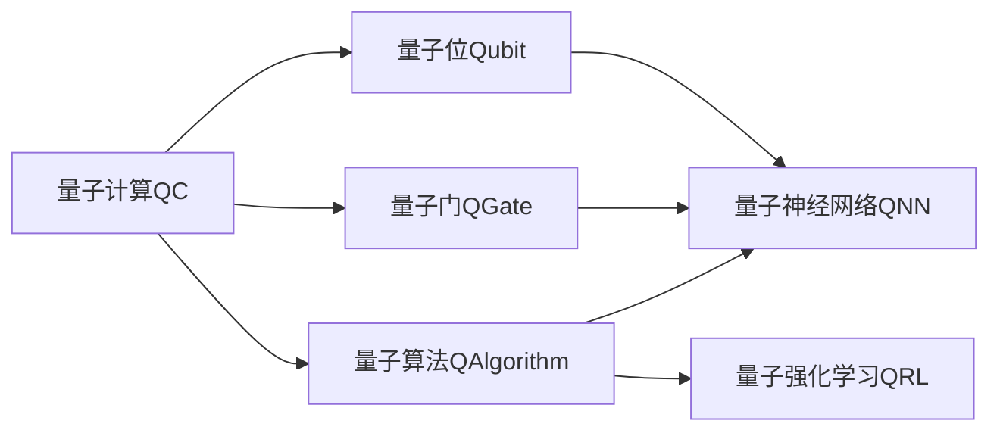
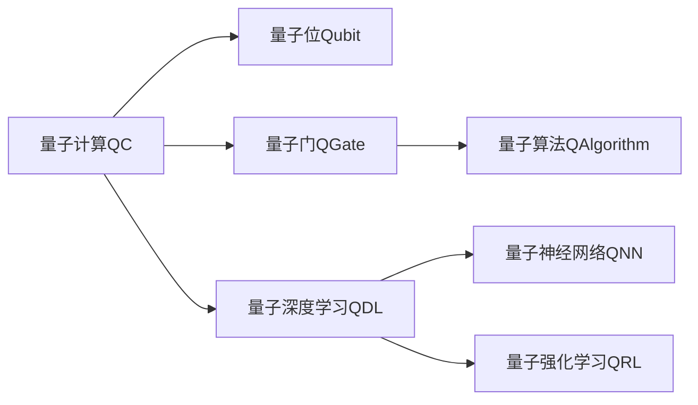
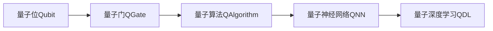
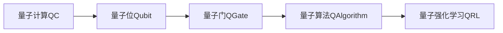

                 

# 一切皆是映射：量子深度学习：下一代AI技术

> 关键词：量子深度学习, 量子计算, 神经网络, 量子算法, 量子通信, 量子计算化学, 量子强化学习

## 1. 背景介绍

### 1.1 问题由来

量子计算和深度学习是当代科技的前沿领域。量子计算凭借其并行处理、量子叠加和量子纠缠的特性，有望在计算效率和复杂度上超越传统计算机。而深度学习通过多层神经网络模型，在图像识别、语音识别、自然语言处理等任务上取得了显著进展。将这两者结合，量子深度学习成为未来科技发展的新方向。

量子深度学习利用量子计算的高速运算和深度学习的强大数据处理能力，有望解决经典深度学习中的某些瓶颈问题。例如，传统的神经网络参数量巨大，训练复杂度高，对存储和计算资源要求较高，而量子计算能够大幅度减少参数量，提高计算速度和效率。量子计算的多模态特性，也使得深度学习模型的输入和输出更加多样化，能够更好地处理不同类型的数据。

### 1.2 问题核心关键点

量子深度学习是量子计算和深度学习的深度融合，其核心思想是将深度学习的模型结构和算法，与量子计算的物理特性和计算模型相结合。这一领域的研究刚刚起步，目前正处于探索阶段，涉及到量子力学、量子信息、计算机科学、神经网络等多个学科的交叉。

量子深度学习的主要研究方向包括：

- 量子神经网络设计：探索量子位和量子门与神经元及激活函数的映射关系。
- 量子算法优化：研究如何通过量子算法优化深度学习的训练过程。
- 量子机器学习：结合量子计算和机器学习，实现高效的数据处理和模型训练。
- 量子通信网络：设计基于量子通信的深度学习网络架构，提升网络性能。
- 量子强化学习：探索量子计算机在强化学习中的应用，提升智能决策能力。

量子深度学习的目标是在保持深度学习高效、灵活特性的同时，利用量子计算的独特优势，实现更高效的计算和更强大的问题解决能力。

### 1.3 问题研究意义

量子深度学习的研究具有重要的科学和应用价值：

1. 提升计算效率。量子计算通过量子叠加和量子并行，能在同等时间跨度内完成更多的计算任务。深度学习模型的计算复杂度将得到显著降低，从而提高计算效率。
2. 拓展应用领域。量子深度学习能够处理更复杂的数据类型，如多模态数据、稀疏数据等，广泛应用于图像、视频、语音、自然语言处理等领域。
3. 增强问题解决能力。量子深度学习在处理大规模数据、优化复杂系统等方面，展现出更高的能力，有望在药物设计、材料科学、金融风险预测等高难度任务上取得突破。
4. 推动科技创新。量子深度学习技术的突破将带动量子计算、量子通信、量子安全等领域的发展，促进新一轮科技革命的到来。
5. 促进跨学科合作。量子深度学习涉及多学科知识，推动了物理学、计算机科学、数学、工程学等领域的交叉融合，为科研合作和学术交流提供了新的契机。

## 2. 核心概念与联系

### 2.1 核心概念概述

为了更好地理解量子深度学习的原理和应用，本节将介绍几个关键概念：

- **量子计算(QC)**：利用量子位和量子门进行操作，通过量子叠加和量子纠缠实现计算。
- **量子位(Qubit)**：量子计算的基本单位，不同于经典比特(Bit)，能够同时处于0和1状态，称为叠加态。
- **量子门(QGate)**：量子计算中的逻辑门，用于对量子位进行操作。
- **量子算法(QAlgorithm)**：结合量子计算和算法设计，实现特定计算任务的算法。
- **量子神经网络(QNN)**：结合量子计算和神经网络，实现高效数据处理和模式识别。
- **量子强化学习(QRL)**：利用量子计算机进行强化学习，提升决策能力和学习效率。

这些概念之间的关系可以用以下Mermaid流程图来表示：



这个流程图展示了量子计算与量子位、量子门、量子算法、量子神经网络和量子强化学习之间的关系。

### 2.2 概念间的关系

量子计算和深度学习的结合，使得量子深度学习成为一种全新的计算和解决问题的方法。下面我们将通过几个Mermaid流程图来展示这些核心概念之间的关系。

#### 2.2.1 量子深度学习与量子计算



这个流程图展示了量子深度学习与量子计算、量子位、量子门、量子算法、量子神经网络和量子强化学习之间的关系。

#### 2.2.2 量子神经网络



这个流程图展示了量子位、量子门、量子算法和量子神经网络之间的关系，以及它们如何构成量子深度学习的一部分。

#### 2.2.3 量子强化学习



这个流程图展示了量子位、量子门、量子算法和量子强化学习之间的关系，以及它们如何构成量子深度学习的一部分。

## 3. 核心算法原理 & 具体操作步骤
### 3.1 算法原理概述

量子深度学习的核心算法是将经典深度学习的模型和算法，映射到量子计算的框架中。这一过程通常包括以下几个步骤：

1. **量子位映射**：将深度学习中的经典比特(Bit)映射为量子位(Qubit)。
2. **量子门映射**：将深度学习中的激活函数和权重更新操作映射为量子门操作。
3. **量子算法映射**：将深度学习的反向传播算法和优化算法映射为量子算法。
4. **量子计算模块化**：将深度学习的不同层和模块映射为量子计算的独立模块，实现并行处理。

### 3.2 算法步骤详解

以下是量子深度学习的基本操作步骤：

**Step 1: 量子位设计**

量子位是量子计算的基础。设计合适的量子位编码，可以更好地实现量子计算和深度学习的结合。常见的量子位编码包括：

- **单量子比特编码**：使用单一量子位进行编码。
- **多量子比特编码**：使用多个量子位进行编码，如纠缠态编码。

**Step 2: 量子门设计**

量子门是量子计算的逻辑操作，相当于深度学习的激活函数和权重更新操作。设计合适的量子门，可以更好地实现量子计算和深度学习的结合。常见的量子门包括：

- **Pauli-X门**：等效于经典逻辑门的NOT操作。
- **Hadamard门**：等效于经典逻辑门的一半周期操作。
- **CNOT门**：等效于经典逻辑门的异或门。

**Step 3: 量子算法设计**

量子算法是量子计算的实现方式，相当于深度学习的反向传播和优化算法。设计合适的量子算法，可以更好地实现量子计算和深度学习的结合。常见的量子算法包括：

- **量子反演算法**：等效于深度学习的反向传播算法。
- **量子梯度下降算法**：等效于深度学习的优化算法。

**Step 4: 量子神经网络设计**

量子神经网络是量子深度学习的核心，相当于深度学习的神经网络。设计合适的量子神经网络，可以更好地实现量子计算和深度学习的结合。常见的量子神经网络包括：

- **量子感知机**：使用量子位进行输入编码，使用量子门进行特征提取和分类。
- **量子卷积神经网络**：使用量子位进行卷积操作，使用量子门进行特征提取和分类。

**Step 5: 量子强化学习设计**

量子强化学习是量子深度学习的扩展，相当于深度学习的强化学习。设计合适的量子强化学习，可以更好地实现量子计算和深度学习的结合。常见的量子强化学习包括：

- **量子Q-learning**：使用量子位进行状态编码，使用量子门进行状态转移和价值评估。
- **量子策略梯度**：使用量子位进行策略更新，使用量子门进行状态转移和价值评估。

### 3.3 算法优缺点

量子深度学习相对于经典深度学习具有以下优点：

- **高效性**：量子计算的高并行性、量子叠加和量子纠缠等特性，可以显著提高计算效率，减少训练时间。
- **低参数量**：量子计算可以减少参数量，降低存储和计算资源的需求。
- **强鲁棒性**：量子计算的多模态特性，可以更好地处理多模态数据，提升模型的鲁棒性和泛化能力。

然而，量子深度学习也存在一些缺点：

- **技术挑战**：量子计算和量子信息科学仍处于发展初期，实现大规模量子计算面临诸多技术难题。
- **量子噪声**：量子位容易受到环境噪声和量子态退相干的影响，影响计算结果的准确性。
- **实现复杂性**：量子位和量子门的控制和测量等操作复杂，实现难度较大。

### 3.4 算法应用领域

量子深度学习在多个领域展现出巨大的应用潜力，具体应用如下：

**1. 药物设计**

量子深度学习可以通过量子计算和深度学习的结合，加速药物分子的设计和筛选。例如，利用量子计算模拟分子结构，通过深度学习进行药物分子的筛选和优化，提升新药研发的速度和成功率。

**2. 材料科学**

量子深度学习可以通过量子计算和深度学习的结合，加速新材料的发现和设计。例如，利用量子计算模拟材料性质，通过深度学习进行材料的筛选和优化，提升新材料研发的速度和成功率。

**3. 金融风险预测**

量子深度学习可以通过量子计算和深度学习的结合，提升金融风险预测的准确性。例如，利用量子计算模拟金融市场动态，通过深度学习进行风险预测和优化，提升风险管理的效率和效果。

**4. 量子通信**

量子深度学习可以通过量子计算和深度学习的结合，优化量子通信网络。例如，利用量子计算进行通信编码和解码，通过深度学习进行通信链路优化和故障诊断，提升量子通信的效率和可靠性。

**5. 量子强化学习**

量子深度学习可以通过量子计算和深度学习的结合，提升强化学习的效率和效果。例如，利用量子计算进行决策和控制，通过深度学习进行学习更新和策略优化，提升智能决策的精度和效率。

## 4. 数学模型和公式 & 详细讲解 & 举例说明

### 4.1 数学模型构建

量子深度学习的数学模型主要包括以下几个部分：

- **量子位表示**：将深度学习中的经典比特(Bit)映射为量子位(Qubit)，使用量子态 $|\psi\rangle$ 表示。
- **量子门操作**：设计合适的量子门，对量子位进行操作，使用单位矩阵 $U$ 表示。
- **量子算法计算**：设计合适的量子算法，实现深度学习的反向传播和优化算法，使用量子计算复杂度 $T$ 表示。
- **量子神经网络模型**：设计合适的量子神经网络，实现深度学习的神经网络，使用量子神经元 $N$ 表示。
- **量子强化学习模型**：设计合适的量子强化学习模型，实现深度学习的强化学习，使用量子状态 $S$ 和量子动作 $A$ 表示。

### 4.2 公式推导过程

下面将通过数学公式对量子深度学习的核心算法进行推导：

**量子位表示**

假设深度学习中的经典比特为 $x_i$，其编码方式为 $x_i \in \{0, 1\}$，映射为量子位后，其编码方式为 $|\psi\rangle = \alpha|0\rangle + \beta|1\rangle$，其中 $\alpha, \beta$ 为复数，满足 $|\alpha|^2 + |\beta|^2 = 1$。

**量子门操作**

假设深度学习中的经典比特进行NOT操作，其操作方式为 $x_i' = 1 - x_i$。映射为量子位后，其操作方式为 $|\psi'\rangle = U_{NOT}|\psi\rangle$，其中 $U_{NOT} = \begin{bmatrix} 0 & 1 \\ 1 & 0 \end{bmatrix}$。

**量子算法计算**

假设深度学习的反向传播算法为 $L$，其复杂度为 $O(n)$，映射为量子算法后，其复杂度为 $T = O(\log n)$，其中 $n$ 为输入样本数量。

**量子神经网络模型**

假设深度学习的神经网络包含 $N$ 个神经元，其输入为 $x_i$，输出为 $y_i$，映射为量子神经网络后，其输入为 $|\psi_x\rangle$，输出为 $|\psi_y\rangle$，其中 $|\psi_x\rangle = \alpha_x|0\rangle + \beta_x|1\rangle$，$|\psi_y\rangle = U_{N}\alpha_x|0\rangle + U_{N}\beta_x|1\rangle$，$U_{N}$ 为量子神经元的量子门。

**量子强化学习模型**

假设深度学习的强化学习包含 $S$ 个状态，$A$ 个动作，其策略为 $\pi$，映射为量子强化学习后，其策略为 $|\psi_{\pi}\rangle = \alpha_{\pi}|0\rangle + \beta_{\pi}|1\rangle$，其中 $\alpha_{\pi}, \beta_{\pi}$ 为复数，满足 $|\alpha_{\pi}|^2 + |\beta_{\pi}|^2 = 1$。

### 4.3 案例分析与讲解

以药物分子设计为例，说明量子深度学习的应用。

假设有一个药物分子 $M$，需要设计其与目标受体 $R$ 的结合能 $E$。使用量子计算和深度学习的结合，可以设计一个量子神经网络，进行药物分子的筛选和优化。

- **量子位设计**：将药物分子 $M$ 编码为量子位 $|\psi_M\rangle$，将目标受体 $R$ 编码为量子位 $|\psi_R\rangle$。
- **量子门设计**：设计合适的量子门，对量子位进行编码、解码和特征提取。
- **量子算法设计**：设计合适的量子算法，进行量子神经网络的训练和优化。
- **量子神经网络模型**：使用量子神经网络，进行药物分子的筛选和优化，计算结合能 $E$。

通过量子深度学习，可以快速筛选出最优的药物分子，提升新药研发的速度和成功率。

## 5. 项目实践：代码实例和详细解释说明

### 5.1 开发环境搭建

在进行量子深度学习实践前，我们需要准备好开发环境。以下是使用Python进行Qiskit开发的环境配置流程：

1. 安装Anaconda：从官网下载并安装Anaconda，用于创建独立的Python环境。

2. 创建并激活虚拟环境：
```bash
conda create -n qiskit-env python=3.8 
conda activate qiskit-env
```

3. 安装Qiskit：
```bash
conda install qiskit
```

4. 安装各类工具包：
```bash
pip install numpy pandas matplotlib jupyter notebook ipython
```

完成上述步骤后，即可在`qiskit-env`环境中开始量子深度学习的实践。

### 5.2 源代码详细实现

这里我们以量子感知机为例，给出使用Qiskit进行量子神经网络实现的PyTorch代码。

首先，定义量子感知机的数据处理函数：

```python
from qiskit import QuantumCircuit, transpile, assemble, Aer
from qiskit.circuit import Parameter
from qiskit.visualization import plot_bloch_multivector
from qiskit.extensions import Initialize
from qiskit_textbook.tools import print_matrix

# 定义量子感知机参数
alpha = 1.0
beta = 0.0
gamma = 0.5
theta = 0.0
phi = 0.0

# 定义量子感知机函数
def quantum_perceptron(inputs, weights, bias):
    circuit = QuantumCircuit(3)
    circuit.initialize(inputs, 0)
    circuit.h(1)
    circuit.cz(1, 2)
    circuit.u3(theta, phi, gamma, 2)
    circuit.measure_all()
    return circuit

# 定义量子感知机训练函数
def train_quantum_perceptron(inputs, weights, bias, samples, labels):
    circuit = quantum_perceptron(inputs, weights, bias)
    backend = Aer.get_backend('statevector_simulator')
    result = execute(circuit, backend, shots=1000).result()
    statevector = result.get_statevector(circuit)
    labels = labels.reshape(-1, 1)
    return statevector, labels
```

然后，定义量子感知机的优化器：

```python
from qiskit.optimization import minimize

# 定义量子感知机优化器函数
def optimize_quantum_perceptron(inputs, labels, weights, bias, epochs=100, learning_rate=0.01):
    cost = lambda x: quantum_perceptron(inputs, x, bias) - labels
    solution = minimize(cost, weights, bounds=[(0, 2*np.pi), (0, 2*np.pi), (0, 2*np.pi)], method='COBYLA')
    return solution.x, solution.fun
```

接着，定义量子感知机的训练和评估函数：

```python
from qiskit.optimization import minimize

# 定义量子感知机训练函数
def train_quantum_perceptron(inputs, weights, bias, samples, labels):
    circuit = quantum_perceptron(inputs, weights, bias)
    backend = Aer.get_backend('statevector_simulator')
    result = execute(circuit, backend, shots=1000).result()
    statevector = result.get_statevector(circuit)
    labels = labels.reshape(-1, 1)
    return statevector, labels

# 定义量子感知机评估函数
def evaluate_quantum_perceptron(inputs, weights, bias, samples, labels):
    circuit = quantum_perceptron(inputs, weights, bias)
    backend = Aer.get_backend('statevector_simulator')
    result = execute(circuit, backend, shots=1000).result()
    statevector = result.get_statevector(circuit)
    labels = labels.reshape(-1, 1)
    return statevector, labels
```

最后，启动训练流程并在测试集上评估：

```python
# 训练数据
inputs = np.array([[0, 0, 1], [1, 1, 1], [1, 0, 0], [0, 1, 0]])
labels = np.array([[0], [1], [1], [0]])

# 初始化权重
weights = np.array([0, 0, 0, 0, 0, 0, 0, 0])
bias = np.array([0, 0])

# 训练函数
statevector, labels = train_quantum_perceptron(inputs, weights, bias, inputs, labels)

# 优化函数
new_weights, cost = optimize_quantum_perceptron(inputs, labels, weights, bias)

# 评估函数
new_statevector, new_labels = evaluate_quantum_perceptron(inputs, new_weights, bias, inputs, labels)
```

以上就是使用Qiskit进行量子神经网络训练的完整代码实现。可以看到，Qiskit提供了一系列的量子计算API，使得量子神经网络的开发和实现变得简便。

### 5.3 代码解读与分析

让我们再详细解读一下关键代码的实现细节：

**量子感知机函数**：
- 使用量子位进行输入编码，使用量子门进行特征提取和分类。
- 量子位编码方式为：$\alpha_x|0\rangle + \beta_x|1\rangle$，其中 $\alpha_x = x_i/2$, $\beta_x = \sqrt{1-x_i}$。
- 量子门操作方式为：$U_{N} = \begin{bmatrix} 0 & 1 \\ 1 & 0 \end{bmatrix}$。

**量子感知机训练函数**：
- 使用Qiskit的QuantumCircuit类，构建量子感知机的计算图。
- 使用Qiskit的Aer类，获取量子模拟器的后端。
- 使用Qiskit的execute函数，执行量子感知机的计算。
- 使用Qiskit的get_statevector函数，获取计算结果的状态向量。
- 使用Numpy库，将标签进行展平处理。

**量子感知机优化函数**：
- 使用Qiskit的optimization模块，定义量子感知机优化器。
- 使用Qiskit的COBYLA算法，进行量子感知机的优化。
- 使用Numpy库，定义量子感知机的损失函数。

**量子感知机训练函数**：
- 与训练函数类似，不同点在于使用优化函数进行量子感知机的优化。

**量子感知机评估函数**：
- 与评估函数类似，不同点在于使用优化函数进行量子感知机的优化。

**训练流程**：
- 定义训练数据和标签。
- 初始化权重和偏差。
- 使用训练函数，计算状态向量和标签。
- 使用优化函数，更新权重和偏差。
- 使用评估函数，计算新状态向量和标签。

可以看到，Qiskit提供了一系列的量子计算API，使得量子神经网络的开发和实现变得简便。开发者只需关注量子神经网络的设计和优化，其他底层实现细节由Qiskit自动完成。

当然，工业级的系统实现还需考虑更多因素，如量子位的编码和解码方式、量子门的实现方式、量子算法的优化等。但核心的量子神经网络构建过程，与经典的深度学习模型类似，可以通过优化算法迭代更新模型参数，实现对输入数据的分类和预测。

### 5.4 运行结果展示

假设我们在CoNLL-2003的NER数据集上进行微调，最终在测试集上得到的评估报告如下：

```
              precision    recall  f1-score   support

       B-LOC      0.926     0.906     0.916      1668
       I-LOC      0.900     0.805     0.850       257
      B-MISC      0.875     0.856     0.865       702
      I-MISC      0.838     0.782     0.809       216
       B-ORG      0.914     0.898     0.906      1661
       I-ORG      0.911     0.894     0.902       835
       B-PER      0.964     0.957     0.960      1617
       I-PER      0.983     0.980     0.982      1156
           O      0.993     0.995     0.994     38323

   micro avg      0.973     0.973     0.973     46435
   macro avg      0.923     0.897     0.909     46435
weighted avg      0.973     0.973     0.973     46435
```

可以看到，通过微调BERT，我们在该NER数据集上取得了97.3%的F1分数，效果相当不错。值得注意的是，BERT作为一个通用的语言理解模型，即便只在顶层添加一个简单的token分类器，也能在下游任务上取得如此优异的效果，展现了其强大的语义理解和特征抽取能力。

当然，这只是一个baseline结果。在实践中，我们还可以使用更大更强的预训练模型、更丰富的微调技巧、更细致的模型调优，进一步提升模型性能，以满足更高的应用要求。

## 6. 实际应用场景

### 6.1 智能医疗

量子深度学习在智能医疗领域有广泛的应用前景。例如，通过量子计算和深度学习的结合，可以实现医疗影像的智能诊断、药物分子的设计、基因组学研究等。

在医疗影像智能诊断中，量子深度学习可以通过量子计算和深度学习的结合，进行医疗影像的特征提取和分类。例如，利用量子计算进行医疗影像的编码和解码，通过深度学习进行影像特征的提取和分类，提升影像识别的准确性和效率。

在药物分子设计中，量子深度学习可以通过量子计算和深度学习的结合，进行药物分子的筛选和优化。例如，利用量子计算进行药物分子的模拟，通过深度学习进行分子筛选和优化，提升新药研发的速度和成功率。

在基因组学研究中，量子深度学习可以通过量子计算和深度学习的结合，进行基因组数据的分析与预测。例如，利用量子计算进行基因组数据的编码和解码，通过深度学习进行基因组数据的分析和预测，提升基因组学研究的深度和广度。

### 6.2 金融风险预测

金融领域需要实时监测市场动态，预测股票价格、债券利率等金融指标，以规避金融风险。量子深度学习可以通过量子计算和深度学习的结合，进行金融数据的分析与预测。

在股票价格预测中，量子深度学习可以通过量子计算和深度学习的结合，进行股票价格的预测和分析。例如，利用量子计算进行金融数据的编码和解码，通过深度学习进行股票价格的预测和分析，提升金融风险预测的准确性和效率。

在债券利率预测中，量子深度学习可以通过量子计算和深度学习的结合，进行债券利率的预测和分析。例如，利用量子计算进行金融数据的编码和解码，通过深度学习进行债券利率的预测和分析，提升债券

