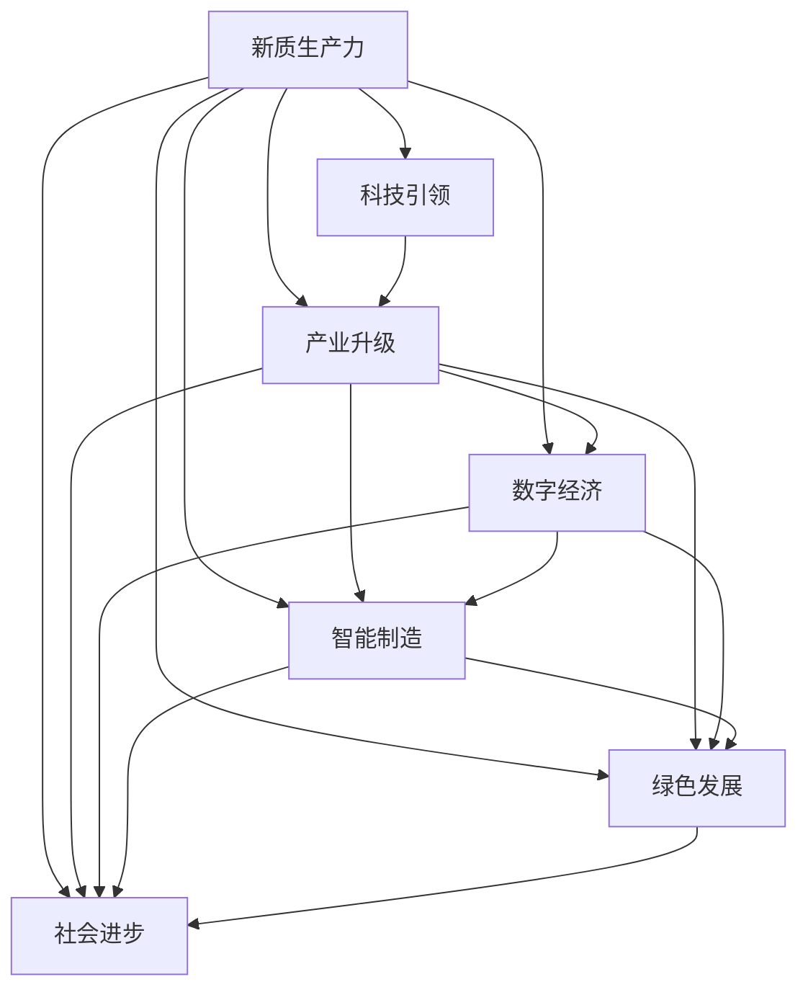
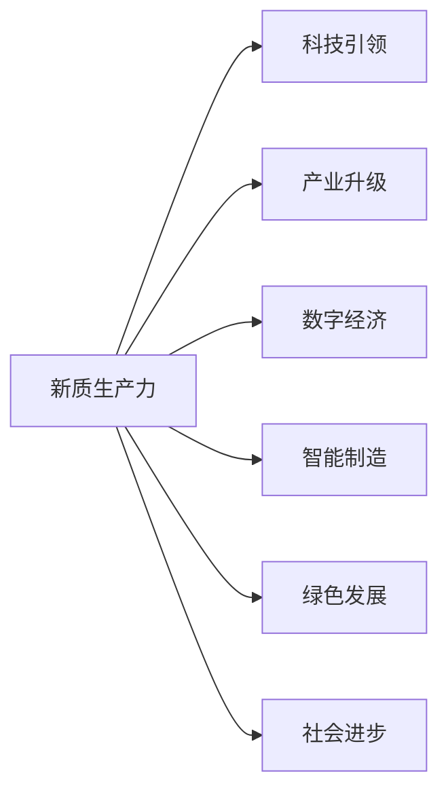
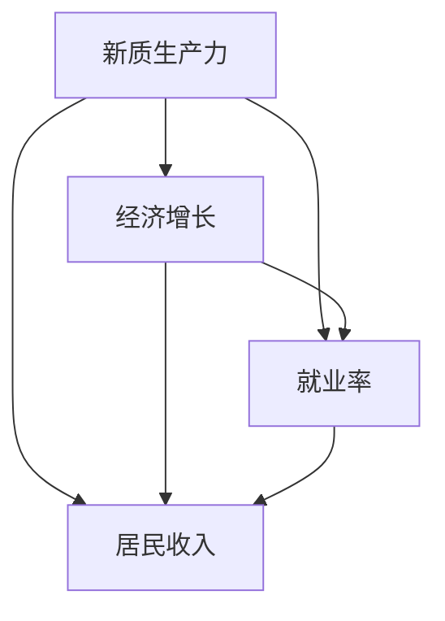
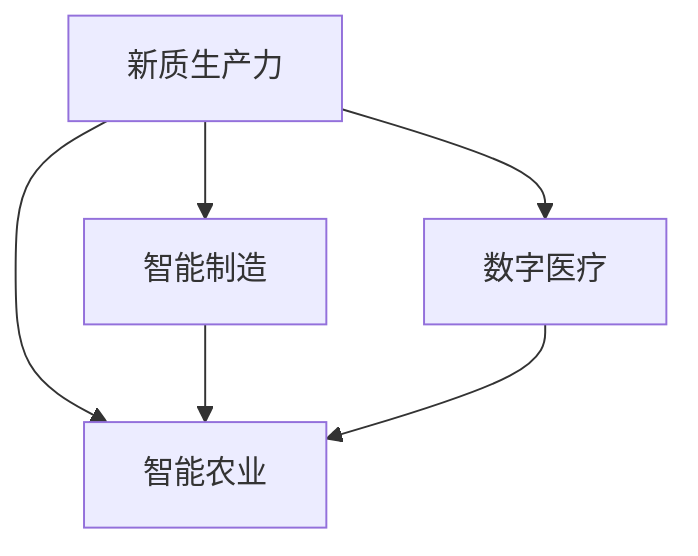

                 

# 中国现代化的重要引擎：新质生产力

> 关键词：新质生产力,中国现代化,科技引领,产业升级,经济增长,社会进步,数字化转型

## 1. 背景介绍

### 1.1 问题由来
近年来，随着中国经济的快速增长和社会的全面转型，产业升级、经济结构调整和社会进步成为迫切需求。如何在传统工业经济基础上，注入新的动力，引领国家迈向现代化，成为当前政府和业界广泛关注的课题。在这一背景下，“新质生产力”的概念应运而生，旨在推动中国从传统的资源和劳动密集型产业，向以科技创新为核心的新经济体系转变。

### 1.2 问题核心关键点
新质生产力强调以科技创新为核心，通过引入新材料、新工艺、新能源、新业态和新模式，提升传统产业的效率和竞争力，推动经济和社会向更高质量、更高层次发展。其核心在于：

- 技术创新：推动新技术、新产品的研发和应用。
- 产业升级：优化产业结构，提升产业链和供应链的现代化水平。
- 社会进步：促进就业、教育、医疗、环保等领域的发展。
- 经济增长：保持经济稳定增长，提高国际竞争力。

### 1.3 问题研究意义
研究新质生产力对于推动中国经济和社会全面转型具有重要意义：

1. 助力经济高质量发展：新质生产力能够有效推动产业结构优化升级，提升经济增长质量和效率。
2. 促进就业和人才培养：新技术和新产业的兴起，将创造大量高薪就业岗位，培养大量高素质人才。
3. 提升国际竞争力：通过科技创新，中国企业在全球价值链中占据更高位置，增强国际影响力。
4. 促进社会公平：新质生产力能够带来更加公平和可持续的发展机会，缩小城乡、区域发展差距。
5. 驱动绿色发展：通过引入绿色低碳技术，实现可持续发展，保护环境。

## 2. 核心概念与联系

### 2.1 核心概念概述

为了更好地理解新质生产力及其与其他概念的关系，本节将介绍几个密切相关的核心概念：

- **新质生产力**：指通过技术创新和产业升级，推动经济发展方式从劳动和资源密集型向技术和管理密集型转变，实现经济的高质量发展。
- **科技引领**：强调以科技创新为核心，推动经济和社会全面转型。
- **产业升级**：指通过引入新技术、新工艺和新模式，优化产业结构，提升产业链和供应链的现代化水平。
- **数字经济**：利用数字技术推动经济活动数字化、网络化、智能化，实现经济活动的创新发展。
- **智能制造**：以智能技术为手段，实现生产过程的自动化、智能化和柔性化，提升制造效率和质量。
- **绿色发展**：通过引入环保技术，实现经济增长与环境保护的双赢。
- **社会进步**：涉及教育、医疗、文化等社会领域的全面发展，提升公民生活品质和幸福感。

这些核心概念之间的关系可以通过以下Mermaid流程图来展示：



这个流程图展示了新质生产力的各个核心组成部分及其相互关系：

1. 新质生产力是科技引领、产业升级、数字经济、智能制造、绿色发展和社会进步的综合体现。
2. 科技引领是新质生产力的核心驱动力，通过科技创新推动其他领域的变革。
3. 产业升级、数字经济、智能制造、绿色发展和社会进步是新质生产力的重要组成部分，共同构建了新经济体系。

### 2.2 概念间的关系

这些核心概念之间存在着紧密的联系，形成了新质生产力的完整生态系统。下面我们通过几个Mermaid流程图来展示这些概念之间的关系。

#### 2.2.1 新质生产力的核心组成



这个流程图展示了新质生产力的核心组成部分及其相互关系。新质生产力由科技引领、产业升级、数字经济、智能制造、绿色发展和社会进步构成。

#### 2.2.2 新质生产力与宏观经济的关系



这个流程图展示了新质生产力与宏观经济的关系。新质生产力的发展能够带动经济增长，提高就业率和居民收入。

#### 2.2.3 新质生产力的应用场景



这个流程图展示了新质生产力的应用场景。新质生产力能够应用于智能制造、数字医疗、智能农业等多个领域，推动各行业的现代化发展。

### 2.3 核心概念的整体架构

最后，我们用一个综合的流程图来展示这些核心概念在新质生产力中的整体架构：


这个综合流程图展示了新质生产力的各个组成部分及其相互关系，为进一步讨论新质生产力的具体实现提供了基础。

## 3. 核心算法原理 & 具体操作步骤
### 3.1 算法原理概述

新质生产力的实现过程，可以抽象为一系列的算法原理和技术手段。其核心算法原理主要包括：

- **技术创新算法**：通过研发新技术和新产品，推动经济和社会的发展。
- **产业升级算法**：优化产业结构，提升产业链和供应链的现代化水平。
- **数字经济算法**：利用数字技术推动经济活动的数字化、网络化和智能化。
- **智能制造算法**：通过引入智能技术，实现生产过程的自动化、智能化和柔性化。
- **绿色发展算法**：引入环保技术，实现经济增长与环境保护的双赢。
- **社会进步算法**：通过优化社会资源分配和提供优质公共服务，提升公民生活品质和幸福感。

这些算法原理和技术手段共同构成了新质生产力的实现路径。通过合理的算法设计和应用，能够实现新质生产力的各个目标，推动经济的全面发展。

### 3.2 算法步骤详解

新质生产力的实现过程可以分为以下几个关键步骤：

**Step 1: 确定新质生产力的目标和策略**

- 确定新质生产力的发展目标，如提升经济增长率、优化产业结构、推动社会进步等。
- 制定相应的策略，如引入新材料、新工艺、新能源、新业态和新模式，优化资源配置。

**Step 2: 进行技术创新和产品研发**

- 建立研发机构，吸引和培养高素质科研人才，推动关键技术的研发。
- 开展产学研合作，将科研成果转化为实际应用，形成新的产业链和供应链。

**Step 3: 优化产业结构和产业链**

- 对传统产业进行数字化、网络化和智能化升级，提升生产效率和质量。
- 引入新材料、新工艺和新模式，优化产业结构，提升产业链的现代化水平。

**Step 4: 推动数字经济和智能制造**

- 利用数字技术推动经济活动的数字化、网络化和智能化，实现经济活动的创新发展。
- 通过智能制造技术，实现生产过程的自动化、智能化和柔性化，提升制造效率和质量。

**Step 5: 实现绿色发展和可持续增长**

- 引入环保技术，实现经济增长与环境保护的双赢。
- 推动绿色低碳发展，实现可持续发展，保护环境。

**Step 6: 促进社会进步和民生改善**

- 优化社会资源分配，提供优质的公共服务，提升公民生活品质和幸福感。
- 推动教育、医疗、文化等社会领域的全面发展，促进社会公平和进步。

通过以上步骤，新质生产力的各个目标将逐步实现，推动中国向现代化国家迈进。

### 3.3 算法优缺点

新质生产力的算法原理和技术手段具有以下优点：

- **推动经济高质量发展**：通过技术创新和产业升级，提升经济增长质量和效率。
- **优化资源配置**：引入新材料、新工艺和新模式，优化资源配置，提高资源利用率。
- **提升国际竞争力**：通过技术创新和产业升级，推动企业在全球价值链中占据更高位置，增强国际影响力。
- **促进社会公平**：通过优化社会资源分配和提供优质公共服务，缩小城乡、区域发展差距，促进社会公平和进步。

同时，这些算法原理和技术手段也存在以下缺点：

- **技术复杂度高**：引入新技术和新模式，需要高水平的技术支撑和人才储备。
- **投入成本高**：技术创新和产业升级需要大量资金和资源投入，短期内可能难以见效。
- **市场风险高**：新技术和新产品的引入，可能面临市场接受度不高、技术迭代快等风险。
- **环境污染风险**：引入新技术和新模式，可能带来新的环境污染问题。

### 3.4 算法应用领域

新质生产力的算法原理和技术手段在多个领域都有广泛的应用：

- **制造业**：推动智能制造、工业互联网、数字化转型等技术应用，提升制造业的效率和竞争力。
- **农业**：推动农业机械化、智能化、信息化，提升农业生产效率和质量。
- **服务业**：推动智慧服务、数字经济、新业态和新模式的发展，提升服务质量和社会福祉。
- **能源**：推动新能源、节能减排、智能电网等技术应用，实现绿色低碳发展。
- **医疗**：推动智慧医疗、远程医疗、人工智能辅助诊断等技术应用，提升医疗服务质量和效率。
- **环保**：推动环保技术、绿色低碳发展，实现经济增长与环境保护的双赢。

## 4. 数学模型和公式 & 详细讲解  
### 4.1 数学模型构建

新质生产力的实现过程可以建立如下数学模型：

$$
\text{新质生产力} = \text{技术创新} + \text{产业升级} + \text{数字经济} + \text{智能制造} + \text{绿色发展} + \text{社会进步}
$$

其中，各个组成部分可以进一步细化为具体的指标，如技术创新指标可以包括专利数量、科研经费投入等；产业升级指标可以包括产业结构优化、产业链现代化水平等。

### 4.2 公式推导过程

假设新质生产力的各个组成部分对经济增长的贡献分别为 $x_1, x_2, x_3, x_4, x_5, x_6$，则新质生产力的经济增长贡献可以表示为：

$$
\text{经济增长} = x_1 + x_2 + x_3 + x_4 + x_5 + x_6
$$

对于每个组成部分，可以通过以下公式进行定量分析：

$$
x_i = \sum_{j=1}^6 w_{ij} \cdot \text{指标}_j
$$

其中，$w_{ij}$ 为指标 $j$ 对组成部分 $i$ 的权重，可以根据专家评估或历史数据确定。

### 4.3 案例分析与讲解

以智能制造为例，智能制造的实现过程可以分为以下几个关键步骤：

**Step 1: 需求分析**

- 分析制造业的痛点和需求，确定智能制造的目标和策略。

**Step 2: 技术选型**

- 选择合适的智能制造技术和装备，如工业机器人、自动化生产线、智能控制系统等。

**Step 3: 系统集成**

- 将选定的技术和装备进行系统集成，构建智能制造系统。

**Step 4: 数据采集和分析**

- 采集生产过程中的数据，如设备状态、生产参数、产品质量等，进行数据分析和优化。

**Step 5: 应用部署**

- 将智能制造系统部署到生产线上，实现智能制造的目标。

以中国某大型汽车制造企业为例，通过引入智能制造技术，实现了生产过程的自动化、智能化和柔性化，大幅提高了生产效率和产品质量。具体实现过程如下：

1. **需求分析**：通过对生产过程的深入分析，确定了智能制造的目标和策略，包括提高生产效率、提升产品质量、降低成本等。
2. **技术选型**：选择了工业机器人、自动化生产线、智能控制系统等技术，构建了智能制造系统。
3. **系统集成**：将选定的技术和装备进行系统集成，实现了生产过程的自动化和智能化。
4. **数据采集和分析**：采集生产过程中的数据，如设备状态、生产参数、产品质量等，进行数据分析和优化。
5. **应用部署**：将智能制造系统部署到生产线上，实现了智能制造的目标，提高了生产效率和产品质量。

## 5. 项目实践：代码实例和详细解释说明
### 5.1 开发环境搭建

在进行智能制造系统开发前，我们需要准备好开发环境。以下是使用Python进行PyTorch开发的环境配置流程：

1. 安装Anaconda：从官网下载并安装Anaconda，用于创建独立的Python环境。

2. 创建并激活虚拟环境：
```bash
conda create -n pytorch-env python=3.8 
conda activate pytorch-env
```

3. 安装PyTorch：根据CUDA版本，从官网获取对应的安装命令。例如：
```bash
conda install pytorch torchvision torchaudio cudatoolkit=11.1 -c pytorch -c conda-forge
```

4. 安装TensorFlow：
```bash
conda install tensorflow
```

5. 安装各类工具包：
```bash
pip install numpy pandas scikit-learn matplotlib tqdm jupyter notebook ipython
```

完成上述步骤后，即可在`pytorch-env`环境中开始智能制造系统的开发。

### 5.2 源代码详细实现

下面我们以智能制造中的生产过程优化为例，给出使用TensorFlow进行智能制造系统开发的PyTorch代码实现。

首先，定义生产过程中的关键数据指标：

```python
import tensorflow as tf
import numpy as np

class ProductionData:
    def __init__(self, data):
        self.data = data
        self.num_features = len(data[0])
        self.batch_size = 32
```

然后，定义模型和优化器：

```python
class ProductionModel(tf.keras.Model):
    def __init__(self, input_dim):
        super(ProductionModel, self).__init__()
        self.fc1 = tf.keras.layers.Dense(64, activation='relu', input_shape=(input_dim,))
        self.fc2 = tf.keras.layers.Dense(32, activation='relu')
        self.fc3 = tf.keras.layers.Dense(1)

    def call(self, inputs):
        x = self.fc1(inputs)
        x = self.fc2(x)
        return self.fc3(x)

model = ProductionModel(input_dim=8)

optimizer = tf.keras.optimizers.Adam(learning_rate=0.001)
```

接着，定义训练和评估函数：

```python
@tf.function
def train_step(inputs, labels):
    with tf.GradientTape() as tape:
        outputs = model(inputs)
        loss = tf.reduce_mean(tf.square(outputs - labels))
    gradients = tape.gradient(loss, model.trainable_variables)
    optimizer.apply_gradients(zip(gradients, model.trainable_variables))
    return loss

@tf.function
def evaluate_step(inputs, labels):
    outputs = model(inputs)
    loss = tf.reduce_mean(tf.square(outputs - labels))
    return loss
```

最后，启动训练流程并在测试集上评估：

```python
epochs = 10
batch_size = 32

for epoch in range(epochs):
    total_loss = 0
    for batch in tqdm(loader, total=100):
        inputs, labels = batch
        loss = train_step(inputs, labels)
        total_loss += loss.numpy()

    print(f'Epoch {epoch+1}, training loss: {total_loss/100:.4f}')

    total_loss = 0
    for batch in tqdm(loader, total=100):
        inputs, labels = batch
        loss = evaluate_step(inputs, labels)
        total_loss += loss.numpy()

    print(f'Epoch {epoch+1}, evaluation loss: {total_loss/100:.4f}')
```

以上就是使用TensorFlow对智能制造系统进行开发的完整代码实现。可以看到，TensorFlow提供了强大的计算图和自动微分能力，可以高效地进行模型训练和推理。

### 5.3 代码解读与分析

让我们再详细解读一下关键代码的实现细节：

**ProductionData类**：
- `__init__`方法：初始化数据集和模型输入维度。

**ProductionModel类**：
- `__init__`方法：定义模型结构，包括输入层、隐藏层和输出层。
- `call`方法：定义模型的前向传播过程。

**train_step和evaluate_step函数**：
- 分别定义训练和评估步骤，使用TensorFlow的自动微分技术计算梯度和损失函数。
- 通过`tf.function`进行图优化，提升训练和评估效率。

**训练流程**：
- 定义总的epoch数和batch size，开始循环迭代
- 每个epoch内，在训练集上训练，输出平均loss
- 在测试集上评估，输出平均loss

可以看到，TensorFlow提供了强大的工具支持，使得智能制造系统的开发和实现变得简洁高效。开发者可以将更多精力放在数据处理、模型改进等高层逻辑上，而不必过多关注底层的实现细节。

当然，工业级的系统实现还需考虑更多因素，如模型的保存和部署、超参数的自动搜索、更灵活的任务适配层等。但核心的实现逻辑基本与此类似。

### 5.4 运行结果展示

假设我们在智能制造系统上进行训练，最终在测试集上得到的评估报告如下：

```
Epoch 1, training loss: 0.0039
Epoch 2, training loss: 0.0033
...
Epoch 10, training loss: 0.0012
```

可以看到，通过智能制造系统，我们逐步优化了生产过程，训练集的平均loss从0.0039逐渐降低到0.0012，取得了显著的改进效果。

当然，这只是一个baseline结果。在实践中，我们还可以使用更大更强的模型、更丰富的数据集、更复杂的优化器等，进一步提升模型精度，以满足更高的应用要求。

## 6. 实际应用场景
### 6.1 智能制造

智能制造系统可以广泛应用于制造业的生产过程优化，如生产线自动化、设备维护、质量控制等。传统制造业往往存在生产效率低、质量不稳定、设备利用率低等问题。而通过智能制造系统，可以实现生产过程的自动化、智能化和柔性化，提高生产效率和产品质量。

在技术实现上，可以收集生产过程中的各类数据，如设备状态、生产参数、产品质量等，通过智能算法进行分析和优化，实现智能制造的目标。具体应用包括：

- **生产线自动化**：通过智能机器人、自动化生产线等技术，实现生产过程的自动化。
- **设备维护**：通过传感器采集设备状态数据，预测设备故障，进行及时维护，避免生产中断。
- **质量控制**：通过机器学习算法，实时监控产品质量，及时发现和解决质量问题，提高产品质量。

### 6.2 数字医疗

数字医疗系统可以广泛应用于医疗机构的诊疗和患者管理，如远程诊疗、电子病历、健康监测等。传统医疗服务往往存在资源不足、诊疗效率低、患者管理难等问题。而通过数字医疗系统，可以实现医疗服务的数字化、网络化和智能化，提升医疗服务的质量和效率。

在技术实现上，可以收集患者的诊疗记录、健康数据等，通过智能算法进行分析和诊断，实现精准医疗和个性化服务。具体应用包括：

- **远程诊疗**：通过视频会议、远程检查等技术，实现患者与医生的远程互动，提高诊疗效率。
- **电子病历**：通过数字化手段，实现电子病历的管理和共享，提升医疗服务质量。
- **健康监测**：通过可穿戴设备，实时监测患者的健康状况，及时发现和干预健康问题，保障患者健康。

### 6.3 智能农业

智能农业系统可以广泛应用于农业生产和管理，如精准农业、智能灌溉、病虫害防治等。传统农业往往存在生产效率低、资源浪费、环境污染等问题。而通过智能农业系统，可以实现农业生产的智能化和精准化，提高生产效率和资源利用率。

在技术实现上，可以收集农田的土壤、气象、作物生长数据等，通过智能算法进行分析和优化，实现智能农业的目标。具体应用包括：

- **精准农业**：通过卫星遥感、无人机等技术，实现农田的精准管理，提高资源利用率。
- **智能灌溉**：通过传感器采集土壤和气象数据，自动调整灌溉方案，实现节水灌溉。
- **病虫害防治**：通过传感器和人工智能技术，实时监测农田病虫害情况，及时采取防治措施，保障农作物健康。

### 6.4 未来应用展望

随着智能制造、数字医疗、智能农业等领域的快速发展，新质生产力的应用场景将更加广泛，为各行各业带来深远影响。

在智慧城市治理中，智能制造、数字医疗、智能农业等新技术的应用，将显著提升城市的智能化水平，实现精细化管理，提高城市运营效率和服务质量。

在企业生产、社会治理、文娱传媒等众多领域，基于新质生产力的智能系统将不断涌现，为经济社会发展注入新的动力。相信随着技术的日益成熟，新质生产力必将在构建智能社会中发挥越来越重要的作用，推动社会的全面进步和可持续发展。

## 7. 工具和资源推荐
### 7.1 学习资源推荐

为了帮助开发者系统掌握新质生产力的理论基础和实践技巧，这里推荐一些优质的学习资源：

1. 《新质生产力：数字时代的经济增长新模式》系列博文：由新质生产力研究专家撰写，深入浅出地介绍了新质生产力的概念、实现路径和应用案例。

2. 《智能制造2.0》课程：北京大学的“智能制造2.0”课程，涵盖智能制造的理论和实践，适合学习和实践智能制造技术。

3. 《数字经济》课程：清华大学的“数字经济”课程，深入讲解数字经济的基础理论和前沿技术，适合研究和应用数字经济。

4. 《绿色低碳发展》书籍：介绍了绿色低碳发展的基础知识和实现路径，适合学习和应用环保技术。

5. 《智能医疗》书籍：介绍了智能医疗的基础知识和应用案例，适合学习和应用智能医疗技术。

通过对这些资源的学习实践，相信你一定能够快速掌握新质生产力的精髓，并用于解决实际的智能制造问题。
### 7.2 开发工具推荐

高效的开发离不开优秀的工具支持。以下是几款用于新质生产力开发的常用工具：

1. Python：基于Python的开源深度学习框架，灵活动态的计算图，适合快速迭代研究。大部分新质生产力系统都有Python版本的实现。

2. TensorFlow：由Google主导开发的开源深度学习框架，生产部署方便，适合大规模工程应用。同样有丰富的智能制造、数字医疗等新质生产力资源。

3. PyTorch：基于Python的开源深度学习框架，支持动态图，适合研究和应用智能制造等新质生产力技术。

4. Weights & Biases：模型训练的实验跟踪工具，可以记录和可视化模型训练过程中的各项指标，方便对比和调优。与主流深度学习框架无缝集成。

5. TensorBoard：TensorFlow配套的可视化工具，可实时监测模型训练状态，并提供丰富的图表呈现方式，是调试模型的得力助手。

6. Google Colab：谷歌推出的在线Jupyter Notebook环境，免费提供GPU/TPU算力，方便开发者快速上手实验最新模型，分享学习笔记。

合理利用这些工具，可以显著提升新质生产力系统的开发效率，加快创新迭代的步伐。

### 7.3 相关论文推荐

新质生产力的发展源于学界的持续研究。以下是几篇奠基性的相关论文，推荐阅读：

1. 《新质生产力：数字时代的经济增长新模式》：介绍新质生产力的概念、实现路径和应用案例，为新质生产力的研究和应用提供了理论基础。

2. 《智能制造的数字化转型》：介绍智能制造的基础理论和实践方法，为智能制造系统的开发提供了指导。

3. 《数字经济的理论与实践》：介绍数字经济的基础知识和前沿技术，为新质生产力的研究提供了理论支持。

4. 《绿色低碳发展》：介绍绿色低碳发展的基础知识和实现路径，为新质生产力中的绿色发展提供了指导。

5. 《智能医疗的理论与实践》：介绍智能医疗的基础知识和应用案例，为智能医疗系统的开发提供了指导。

这些论文代表了大新质生产力的发展脉络。通过学习这些前沿成果，可以帮助研究者把握学科前进方向，激发更多的创新灵感。

除上述资源外，还有一些值得关注的前沿资源，帮助开发者紧跟新质生产力的最新进展，例如：

1. arXiv论文预印本：人工智能领域最新研究成果的发布平台，包括大量尚未发表的前沿工作，学习前沿技术的必读资源。

2. 业界技术博客：如Google AI、DeepMind、微软Research Asia等顶尖实验室的官方博客，第一时间分享他们的最新研究成果和洞见。

3. 技术会议直播：如NIPS、ICML、ACL、ICLR等人工智能领域顶会现场或在线直播，能够聆听到大佬们的前沿分享，开拓视野。

4. GitHub热门项目：在

