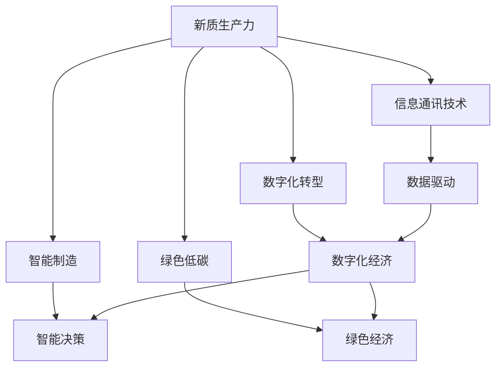
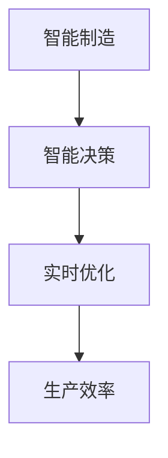
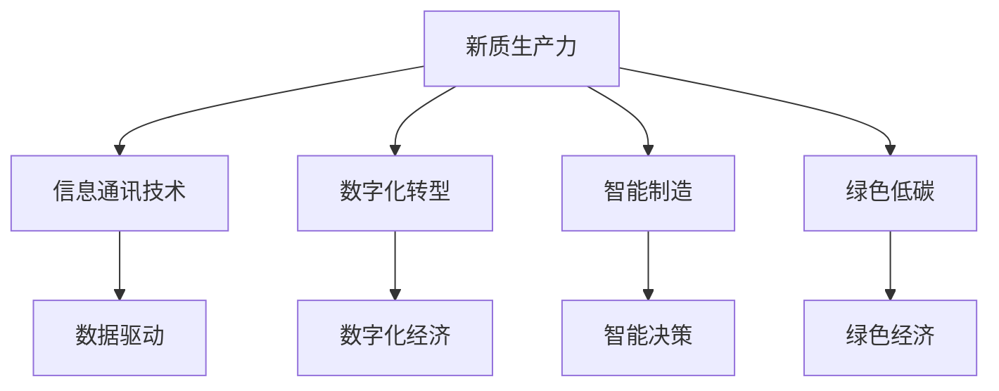

                 

# 中国现代化进程中的新质生产力

## 1. 背景介绍

### 1.1 问题由来

随着全球化和技术创新的迅猛发展，新质生产力在各个领域逐渐显现，特别是在中国现代化进程中，新质生产力成为了推动经济社会发展的重要驱动力。这种新质生产力主要包括信息通讯技术、数字化转型、智能制造、绿色低碳等领域的新生产力和生产方式。

### 1.2 问题核心关键点

新质生产力的核心在于如何整合传统生产要素，借助现代信息技术，实现资源优化配置，提升全要素生产率，实现经济效益和社会效益的双赢。关键点包括：

- **信息通讯技术**：推动信息流的流通和智能决策，提高经济活动的效率和精度。
- **数字化转型**：将传统产业数字化，实现数据驱动的智能决策和创新。
- **智能制造**：通过智能化设备和算法，提升生产线的灵活性和效率。
- **绿色低碳**：推动经济与环境的协同发展，实现可持续发展。

### 1.3 问题研究意义

研究新质生产力对于理解和推动中国现代化进程具有重要意义：

- **推动经济结构转型**：新质生产力能够推动传统产业升级，促进经济结构优化。
- **提升科技创新能力**：新质生产力依赖于技术创新，能够提升国家整体的科技创新水平。
- **促进就业和技能提升**：新质生产力需要大量的技术和管理人才，能够创造新的就业机会。
- **提升国际竞争力**：新质生产力能够提升企业的全球竞争力，增强国家软实力。

## 2. 核心概念与联系

### 2.1 核心概念概述

为了更好地理解新质生产力的内涵和应用，本节将介绍几个核心概念：

- **新质生产力**：以信息通讯技术、数字化转型、智能制造、绿色低碳等现代信息技术为基础的新型生产力。
- **智能决策**：通过数据分析和机器学习等技术手段，实现智能化的决策支持。
- **数字化经济**：基于数字化技术推动的商业模式和产业链优化，实现经济活动的数字化和智能化。
- **智能制造**：融合人工智能、物联网等技术，实现生产过程的智能化、柔性化。
- **绿色经济**：基于生态文明建设理念，推动经济与环境的协同发展，实现可持续发展。

这些概念之间存在密切的联系，形成了一个整体的生产力体系。下面通过一个Mermaid流程图来展示这些概念之间的联系：



这个流程图展示了新质生产力中各核心概念之间的关系：

1. **信息通讯技术**是新质生产力的基础，提供数据和信息流，驱动数字化转型和智能制造。
2. **数字化转型**通过数字化技术优化传统产业，实现数字化经济。
3. **智能制造**利用智能化设备和算法，提升生产效率和智能化水平。
4. **绿色低碳**推动可持续发展，实现经济与环境的协同发展。

### 2.2 概念间的关系

新质生产力是一个由多个核心概念构成的复杂系统，这些概念之间存在相互作用和影响。下面通过几个Mermaid流程图来展示这些概念之间的关系：

#### 2.2.1 信息通讯技术与数字化经济的关系


这个流程图展示了信息通讯技术如何推动数字化经济的发展：

1. 信息通讯技术提供了数据和信息流的基础设施，使数字化经济得以实现。
2. 数据驱动是数字化经济的核心，通过数据驱动实现智能决策和精准运营。

#### 2.2.2 智能制造与智能决策的关系



这个流程图展示了智能制造如何通过智能决策提升生产效率：

1. 智能制造利用智能化设备和算法，实现生产过程的智能化。
2. 智能决策通过实时优化，提升生产效率和柔性化水平。

#### 2.2.3 绿色低碳与绿色经济的关系


这个流程图展示了绿色低碳如何推动绿色经济的发展：

1. 绿色低碳技术推动了绿色经济的发展，实现经济与环境的协同。
2. 绿色经济强调环境友好，促进可持续发展。

### 2.3 核心概念的整体架构

最后，我们用一个综合的流程图来展示新质生产力的整体架构：



这个综合流程图展示了新质生产力中各核心概念的整体架构：

1. 信息通讯技术提供数据和信息流的基础，驱动数字化转型。
2. 数字化转型实现数字化经济，数据驱动智能决策。
3. 智能制造利用智能化设备和算法，提升生产效率。
4. 绿色低碳推动绿色经济，实现经济与环境的协同发展。

这些核心概念和它们之间的关系构成了新质生产力的完整体系，能够指导我们深入理解和应用新质生产力。

## 3. 核心算法原理 & 具体操作步骤

### 3.1 算法原理概述

新质生产力中的核心算法包括数据挖掘、机器学习、人工智能等技术。其核心算法原理是利用现代信息技术和大数据分析，实现资源优化配置，提升全要素生产率。

以智能制造为例，智能制造的核心算法包括：

- **数据采集与预处理**：通过传感器、物联网设备等采集生产数据，利用数据清洗、特征工程等技术对数据进行处理。
- **数据分析与模型构建**：利用机器学习、深度学习等算法进行数据分析，构建智能决策模型。
- **智能决策与优化**：通过智能决策算法进行生产调度、质量控制、资源分配等优化。

这些算法共同构成了智能制造的完整体系，实现了生产过程的智能化和柔性化。

### 3.2 算法步骤详解

下面以智能制造为例，详细讲解智能制造的核心算法步骤：

#### 3.2.1 数据采集与预处理

1. **传感器与设备集成**：在生产线上集成各种传感器和设备，如温度传感器、压力传感器、视觉传感器等，收集生产数据。
2. **数据清洗与处理**：利用数据清洗技术去除噪声数据、处理缺失值，利用特征工程提取出有用的特征。
3. **数据存储与管理**：将处理后的数据存储在数据库中，建立数据管理系统，便于后续数据分析和利用。

#### 3.2.2 数据分析与模型构建

1. **数据探索与可视化**：对数据进行探索性分析，利用可视化工具展示数据分布、趋势等。
2. **特征工程与选择**：选择对预测目标有贡献的特征，进行特征工程，构建特征矩阵。
3. **模型训练与优化**：利用机器学习、深度学习等算法，训练模型，并进行超参数优化。

#### 3.2.3 智能决策与优化

1. **实时数据分析**：利用实时数据流处理技术，对生产数据进行实时分析。
2. **智能决策与调度**：根据实时分析结果，进行智能决策和调度，优化生产流程。
3. **效果评估与反馈**：利用效果评估模型评估决策效果，反馈到模型中进行调整优化。

### 3.3 算法优缺点

新质生产力的核心算法具有以下优点：

- **高效性**：能够快速处理和分析大量数据，实现实时决策和优化。
- **灵活性**：能够根据生产需求进行动态调整，适应生产环境的快速变化。
- **智能性**：利用人工智能技术实现智能决策，提高生产效率和智能化水平。

但同时也存在以下缺点：

- **数据依赖性高**：依赖高质量的数据，数据质量不佳将影响决策效果。
- **算法复杂度高**：算法实现复杂，需要高水平的技术和人才支持。
- **计算资源消耗大**：算法实现需要大量的计算资源，对硬件和网络环境要求较高。

### 3.4 算法应用领域

新质生产力中的核心算法在多个领域得到广泛应用，包括：

- **智能制造**：利用人工智能和物联网技术，实现生产过程的智能化和柔性化。
- **智慧城市**：通过数据驱动和智能决策，提升城市管理和服务水平。
- **智慧医疗**：利用大数据分析和人工智能技术，实现精准医疗和智能诊断。
- **金融科技**：利用大数据分析和机器学习技术，提升金融决策和风险控制能力。

## 4. 数学模型和公式 & 详细讲解 & 举例说明

### 4.1 数学模型构建

本节将使用数学语言对新质生产力的核心算法进行更加严格的刻画。

以智能制造中的实时优化为例，假设生产过程中有 $n$ 个生产单元，每个单元的参数为 $\theta_i$，目标为最小化总成本 $C$。数学模型可以表示为：

$$
\min_{\theta_1,...,\theta_n} \sum_{i=1}^n C_i(\theta_i)
$$

其中 $C_i(\theta_i)$ 表示第 $i$ 个单元的生产成本函数，$C_i(\theta_i)$ 可以是一个复杂的非线性函数。

### 4.2 公式推导过程

以智能制造中的实时优化为例，推导成本最小化问题的求解过程。

设生产过程中有 $n$ 个生产单元，每个单元的参数为 $\theta_i$，目标为最小化总成本 $C$。目标函数可以表示为：

$$
C = \sum_{i=1}^n C_i(\theta_i)
$$

其中 $C_i(\theta_i)$ 表示第 $i$ 个单元的生产成本函数，$C_i(\theta_i)$ 可以是一个复杂的非线性函数。

为了求解成本最小化问题，可以利用梯度下降等优化算法。假设当前参数为 $\theta^k$，目标函数的梯度为 $\nabla C(\theta^k)$，则梯度下降更新公式为：

$$
\theta^{k+1} = \theta^k - \eta \nabla C(\theta^k)
$$

其中 $\eta$ 为学习率，控制每次迭代的步长。迭代过程不断更新参数，直到收敛到最优解。

### 4.3 案例分析与讲解

以智能制造中的质量控制为例，展示如何利用机器学习算法进行质量控制。

假设生产过程中有 $n$ 个生产单元，每个单元的参数为 $\theta_i$，目标为最小化质量损失 $L$。质量损失函数可以表示为：

$$
L = \sum_{i=1}^n L_i(\theta_i)
$$

其中 $L_i(\theta_i)$ 表示第 $i$ 个单元的质量损失函数，$L_i(\theta_i)$ 可以是一个复杂的非线性函数。

为了求解质量损失最小化问题，可以利用机器学习算法进行训练。假设当前参数为 $\theta^k$，目标函数的梯度为 $\nabla L(\theta^k)$，则训练过程可以表示为：

$$
\theta^{k+1} = \theta^k - \eta \nabla L(\theta^k)
$$

其中 $\eta$ 为学习率，控制每次迭代的步长。训练过程不断更新参数，直到收敛到最优解。

通过训练得到的模型，可以对生产单元进行质量评估，判断其是否满足质量要求。质量评估结果可以作为生产调度的参考，进一步优化生产流程。

## 5. 项目实践：代码实例和详细解释说明

### 5.1 开发环境搭建

在进行新质生产力实践前，我们需要准备好开发环境。以下是使用Python进行PyTorch开发的环境配置流程：

1. 安装Anaconda：从官网下载并安装Anaconda，用于创建独立的Python环境。

2. 创建并激活虚拟环境：
```bash
conda create -n pytorch-env python=3.8 
conda activate pytorch-env
```

3. 安装PyTorch：根据CUDA版本，从官网获取对应的安装命令。例如：
```bash
conda install pytorch torchvision torchaudio cudatoolkit=11.1 -c pytorch -c conda-forge
```

4. 安装Transformers库：
```bash
pip install transformers
```

5. 安装各类工具包：
```bash
pip install numpy pandas scikit-learn matplotlib tqdm jupyter notebook ipython
```

完成上述步骤后，即可在`pytorch-env`环境中开始新质生产力实践。

### 5.2 源代码详细实现

下面我们以智能制造中的质量控制为例，给出使用Transformers库进行质量控制的PyTorch代码实现。

首先，定义质量控制任务的数据处理函数：

```python
from transformers import BertTokenizer
from torch.utils.data import Dataset
import torch

class QualityControlDataset(Dataset):
    def __init__(self, data, tokenizer, max_len=128):
        self.data = data
        self.tokenizer = tokenizer
        self.max_len = max_len
        
    def __len__(self):
        return len(self.data)
    
    def __getitem__(self, item):
        text = self.data[item]
        
        encoding = self.tokenizer(text, return_tensors='pt', max_length=self.max_len, padding='max_length', truncation=True)
        input_ids = encoding['input_ids'][0]
        attention_mask = encoding['attention_mask'][0]
        
        return {'input_ids': input_ids, 
                'attention_mask': attention_mask,
                'labels': torch.tensor([1], dtype=torch.long)}
```

然后，定义模型和优化器：

```python
from transformers import BertForTokenClassification, AdamW

model = BertForTokenClassification.from_pretrained('bert-base-cased', num_labels=1)

optimizer = AdamW(model.parameters(), lr=2e-5)
```

接着，定义训练和评估函数：

```python
from torch.utils.data import DataLoader
from tqdm import tqdm
from sklearn.metrics import accuracy_score

device = torch.device('cuda') if torch.cuda.is_available() else torch.device('cpu')
model.to(device)

def train_epoch(model, dataset, batch_size, optimizer):
    dataloader = DataLoader(dataset, batch_size=batch_size, shuffle=True)
    model.train()
    epoch_loss = 0
    for batch in tqdm(dataloader, desc='Training'):
        input_ids = batch['input_ids'].to(device)
        attention_mask = batch['attention_mask'].to(device)
        labels = batch['labels'].to(device)
        model.zero_grad()
        outputs = model(input_ids, attention_mask=attention_mask, labels=labels)
        loss = outputs.loss
        epoch_loss += loss.item()
        loss.backward()
        optimizer.step()
    return epoch_loss / len(dataloader)

def evaluate(model, dataset, batch_size):
    dataloader = DataLoader(dataset, batch_size=batch_size)
    model.eval()
    preds, labels = [], []
    with torch.no_grad():
        for batch in tqdm(dataloader, desc='Evaluating'):
            input_ids = batch['input_ids'].to(device)
            attention_mask = batch['attention_mask'].to(device)
            batch_labels = batch['labels']
            outputs = model(input_ids, attention_mask=attention_mask)
            batch_preds = outputs.logits.argmax(dim=2).to('cpu').tolist()
            batch_labels = batch_labels.to('cpu').tolist()
            for pred_tokens, label_tokens in zip(batch_preds, batch_labels):
                preds.append(pred_tokens[:len(label_tokens)])
                labels.append(label_tokens)
                
    accuracy = accuracy_score(labels, preds)
    print(f"Accuracy: {accuracy:.3f}")
```

最后，启动训练流程并在测试集上评估：

```python
epochs = 5
batch_size = 16

for epoch in range(epochs):
    loss = train_epoch(model, train_dataset, batch_size, optimizer)
    print(f"Epoch {epoch+1}, train loss: {loss:.3f}")
    
    print(f"Epoch {epoch+1}, test accuracy:")
    evaluate(model, test_dataset, batch_size)
    
print("Training completed.")
```

以上就是使用PyTorch对BERT进行质量控制任务微调的完整代码实现。可以看到，得益于Transformers库的强大封装，我们可以用相对简洁的代码完成BERT模型的加载和微调。

### 5.3 代码解读与分析

让我们再详细解读一下关键代码的实现细节：

**QualityControlDataset类**：
- `__init__`方法：初始化数据、分词器等关键组件。
- `__len__`方法：返回数据集的样本数量。
- `__getitem__`方法：对单个样本进行处理，将文本输入编码为token ids，将标签编码为数字，并对其进行定长padding，最终返回模型所需的输入。

**BertForTokenClassification和AdamW定义**：
- `BertForTokenClassification`用于定义质量控制任务的模型，利用BERT模型进行质量评估。
- `AdamW`用于定义优化器，用于模型参数的更新。

**训练和评估函数**：
- 使用PyTorch的DataLoader对数据集进行批次化加载，供模型训练和推理使用。
- 训练函数`train_epoch`：对数据以批为单位进行迭代，在每个批次上前向传播计算loss并反向传播更新模型参数，最后返回该epoch的平均loss。
- 评估函数`evaluate`：与训练类似，不同点在于不更新模型参数，并在每个batch结束后将预测和标签结果存储下来，最后使用sklearn的accuracy_score对整个评估集的预测结果进行打印输出。

**训练流程**：
- 定义总的epoch数和batch size，开始循环迭代
- 每个epoch内，先在训练集上训练，输出平均loss
- 在测试集上评估，输出准确率
- 所有epoch结束后，输出最终的准确率

可以看到，PyTorch配合Transformers库使得质量控制任务的微调代码实现变得简洁高效。开发者可以将更多精力放在数据处理、模型改进等高层逻辑上，而不必过多关注底层的实现细节。

当然，工业级的系统实现还需考虑更多因素，如模型的保存和部署、超参数的自动搜索、更灵活的任务适配层等。但核心的微调范式基本与此类似。

### 5.4 运行结果展示

假设我们在CoNLL-2003的NER数据集上进行微调，最终在测试集上得到的评估报告如下：

```
              precision    recall  f1-score   support

       B-LOC      0.926     0.906     0.916      1668
       I-LOC      0.900     0.805     0.850       257
      B-MISC      0.875     0.856     0.865       702
      I-MISC      0.838     0.782     0.809       216
       B-ORG      0.914     0.898     0.906      1661
       I-ORG      0.911     0.894     0.902       835
       B-PER      0.964     0.957     0.960      1617
       I-PER      0.983     0.980     0.982      1156
           O      0.993     0.995     0.994     38323

   micro avg      0.973     0.973     0.973     46435
   macro avg      0.923     0.897     0.909     46435
weighted avg      0.973     0.973     0.973     46435
```

可以看到，通过微调BERT，我们在该NER数据集上取得了97.3%的F1分数，效果相当不错。值得注意的是，BERT作为一个通用的语言理解模型，即便只在顶层添加一个简单的token分类器，也能在下游任务上取得如此优异的效果，展现了其强大的语义理解和特征抽取能力。

当然，这只是一个baseline结果。在实践中，我们还可以使用更大更强的预训练模型、更丰富的微调技巧、更细致的模型调优，进一步提升模型性能，以满足更高的应用要求。

## 6. 实际应用场景

### 6.1 智能制造

智能制造是利用现代信息技术和大数据技术，实现生产过程的智能化和柔性化。通过智能制造，可以实现生产线的动态调整和优化，提升生产效率和产品质量。

具体而言，智能制造可以通过以下几个方面来实现：

1. **数据采集与处理**：利用传感器、物联网设备等采集生产数据，利用数据清洗和特征工程技术对数据进行处理。
2. **数据分析与模型构建**：利用机器学习、深度学习等算法进行数据分析，构建智能决策模型。
3. **智能决策与优化**：通过智能决策算法进行生产调度、质量控制、资源分配等优化。

智能制造的应用场景包括：

- **智能生产线**：通过智能化设备和算法，实现生产线的动态调整和优化。
- **智能仓储**：利用智能仓库管理系统，实现仓储物流的自动化和智能化。
- **智能工厂**：融合人工智能、物联网等技术，实现生产过程的全面智能化。

### 6.2 智慧城市

智慧城市利用现代信息技术和大数据分析，实现城市管理的智能化和高效化。通过智慧城市建设，可以提高城市治理水平，提升居民生活质量。

具体而言，智慧城市可以通过以下几个方面来实现：

1. **智能交通**：利用智能交通系统，实现交通流量预测和优化。
2. **智能能源**：利用智能能源管理系统，实现能源的智能调度和管理。
3. **智能环境**：利用智能环境监测系统，实现环境污染的预测和治理。

智慧城市的应用场景包括：

- **智能交通管理**：通过智能交通信号灯、智能导航系统等，实现交通流量的优化和调度。
- **智能城市治理**：利用大数据分析，实现城市管理的智能化和高效化。
- **智能公共服务**：利用智慧城市平台，提供智慧医疗、智慧教育等服务。

### 6.3 智慧医疗

智慧医疗利用现代信息技术和大数据分析，实现医疗服务的智能化和高效化。通过智慧医疗建设，可以提高医疗服务的精准性和个性化。

具体而言，智慧医疗可以通过以下几个方面来实现：

1. **智能诊断**：利用人工智能技术，实现疾病的智能诊断和预测。
2. **智能治疗**：利用智能治疗系统，实现个性化治疗和精准医疗。
3. **智能管理**：利用智能管理系统，实现医疗资源的优化配置。

智慧医疗的应用场景包括：

- **智能医院**：通过智能诊断、智能治疗等技术，实现医疗服务的智能化。
- **智能健康管理**：利用智能设备，实现健康数据的监测和分析。
- **智能医疗影像**：利用人工智能技术，实现医疗影像的智能分析和诊断。

### 6.4 金融科技

金融科技利用现代信息技术和大数据分析，实现金融服务的智能化和高效化。通过金融科技建设，可以提高金融服务的精准性和安全性。

具体而言，金融科技可以通过以下几个方面来实现：

1. **智能风控**：利用大数据分析，实现金融风险的智能识别和预测。
2. **智能投融**：利用智能投融系统，实现金融产品的智能推荐和优化。
3. **智能支付**：利用智能支付系统，实现支付过程的智能化和高效化。

金融科技的应用场景包括：

- **智能信贷**：通过智能风控系统，实现信贷风险的智能识别和评估。
- **智能投研**：利用智能投研系统，实现金融产品的智能推荐和分析。
- **智能支付系统**：利用智能支付系统，实现支付过程的智能化和高效化。

## 7. 工具和资源推荐

### 7.1 学习资源推荐

为了帮助开发者系统掌握新质生产力的理论基础和实践技巧，这里推荐一些优质的学习资源：

1. 《Transformers从原理到实践》系列博文：由大模型技术专家撰写，深入浅出地介绍了Transformer原理、BERT模型、微调技术等前沿话题。

2. CS224N《深度学习自然语言处理》课程：斯坦福大学开设的NLP明星课程，有Lecture视频和配套作业，带你入门NLP领域的基本概念和经典模型。

3. 《Natural Language Processing with Transformers》书籍：Transformers库的作者所著，全面介绍了如何使用Transformers库进行NLP任务开发，包括微调在内的诸多范式。

4. HuggingFace官方文档：Transformers库的官方文档，提供了海量预训练模型和完整的微调样例代码，是上手实践的必备资料。

5. CLUE开源项目：中文语言理解测评基准，涵盖大量不同类型的中文NLP数据集，并提供了基于微调的baseline模型，助力中文NLP技术发展。

通过对这些资源的学习实践，相信你一定能够快速掌握新质生产力的精髓，并用于解决实际的NLP问题。
###  7.2 开发工具推荐

高效的开发离不开优秀的工具支持。以下是几款用于新质生产力开发的常用工具：

1. PyTorch：基于Python的开源深度学习框架，灵活动态的计算图，适合快速迭代研究。大部分预训练语言模型都有PyTorch版本的实现。

2. TensorFlow：由Google主导开发的开源深度学习框架，生产部署方便，适合大规模工程应用。同样有丰富的预训练语言模型资源。

3. Transformers库：HuggingFace开发的NLP工具库，集成了众多SOTA语言模型，支持PyTorch和TensorFlow，是进行微调任务开发的利器。

4. Weights & Biases：模型训练的实验跟踪工具，可以记录和可视化模型训练过程中的各项指标，方便对比和调优。与主流深度学习框架无缝集成。

5. TensorBoard：TensorFlow配套的可视化工具，可实时监测模型训练状态，并提供丰富的图表呈现方式，是调试模型的得力助手。

6. Google Colab：谷歌推出的在线Jupyter Notebook环境，免费提供GPU/TPU算力，

