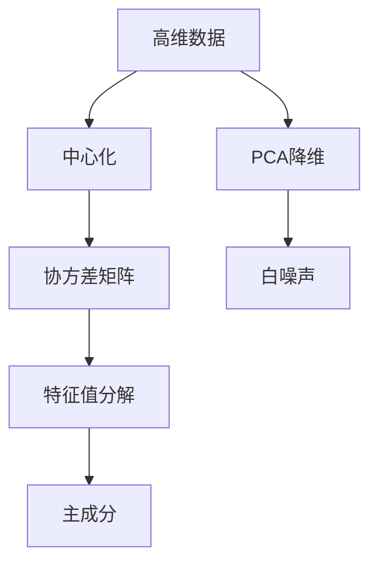
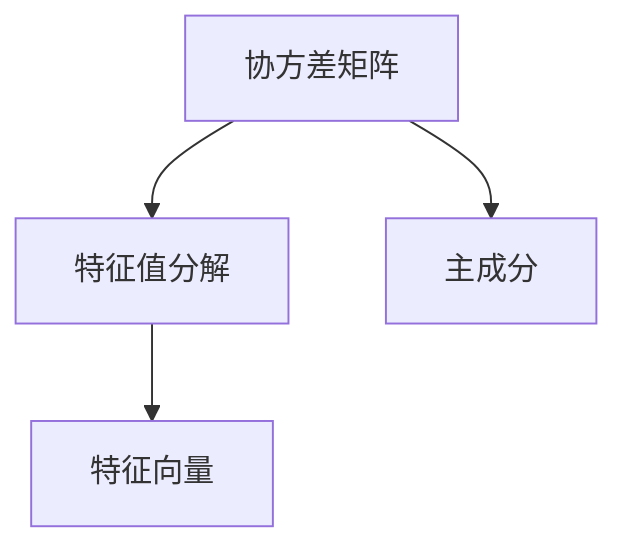
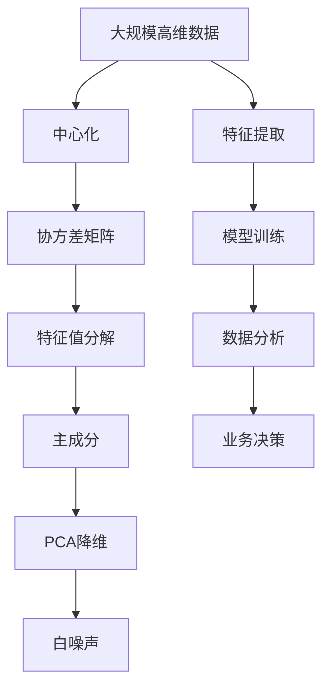

                 

# 主成分分析 原理与代码实例讲解

> 关键词：主成分分析(PCA), 线性代数, 降维, 数据可视化, 特征提取, 多维数据, 机器学习

## 1. 背景介绍

### 1.1 问题由来
在数据科学和机器学习领域，数据往往以高维形式呈现，涉及多个观测变量（Features）和多个样本（Observations）。这种高维数据通常会带来维数灾难（Curse of Dimensionality），导致计算复杂度增加、信息冗余、噪声污染等问题，对数据分析和建模带来挑战。为了有效处理高维数据，研究人员提出了各种降维方法，其中主成分分析（PCA）是最为常用且有效的一种。

PCA旨在将原始高维数据转换为低维数据，同时保留数据的主要特征信息，通过线性变换将高维数据映射到低维空间，实现数据的降维和特征提取。PCA的应用范围广泛，包括图像处理、信号处理、金融分析、生物信息学、社会科学等领域。

### 1.2 问题核心关键点
PCA的核心在于通过对原始数据进行特征值分解，找出最大的方差方向（即主成分），并将其投影到新的低维空间。具体步骤如下：
1. 中心化数据。
2. 计算协方差矩阵。
3. 计算协方差矩阵的特征值和特征向量。
4. 按特征值排序，选取前k个主成分。
5. 将原始数据投影到主成分空间。

这些步骤涉及数学中的线性代数和矩阵计算，需要进行严谨的推导和验证。

### 1.3 问题研究意义
PCA作为经典的降维方法，能够有效压缩高维数据，减少计算复杂度，提高模型训练和推理效率。同时，PCA能够显著降低噪声干扰，提取出数据中的主要特征信息，为后续的建模和分析奠定基础。通过PCA，研究人员可以从复杂的高维数据中发现隐藏的模式和规律，为解决实际问题提供有效手段。

PCA的应用也催生了诸多衍生方法，如独立成分分析（ICA）、因子分析（FA）、t-SNE等，进一步拓展了数据分析和建模的范畴。此外，PCA在科学计算、工程设计、生物医学等领域也有重要应用。

## 2. 核心概念与联系

### 2.1 核心概念概述
为更好地理解PCA的原理和应用，本节将介绍几个关键概念：

- **主成分分析（PCA）**：通过线性变换将高维数据降维到低维空间，并保留数据的主要特征信息。
- **协方差矩阵**：用于衡量数据各维度间的相关性，是计算主成分的核心工具。
- **特征值分解**：将矩阵分解为特征值和特征向量的形式，是PCA的数学基础。
- **白噪声**：PCA的期望输出，即在降维后的空间中，数据的方差最大，不相关的分量被剔除。

这些核心概念之间的联系可以通过以下Mermaid流程图来展示：



### 2.2 概念间的关系

这些核心概念之间存在紧密的联系，形成了PCA的完整生态系统。下面我们通过几个Mermaid流程图来展示这些概念之间的关系。

#### 2.2.1 PCA的基本流程


这个流程图展示了PCA的基本流程：
1. 原始高维数据通过中心化处理，消除均值偏移。
2. 计算协方差矩阵，衡量各维度间的相关性。
3. 对协方差矩阵进行特征值分解，提取主成分。
4. 将原始数据投影到主成分空间，实现降维。
5. 期望输出为白噪声，即降维后的数据各维度间相互独立，方差最大。

#### 2.2.2 特征值分解的作用



这个流程图展示了协方差矩阵的特征值分解：
1. 通过特征值分解，将协方差矩阵分解为特征值和特征向量。
2. 特征向量反映了原始数据的降维方向。
3. 特征值反映了各主成分的方差大小。

#### 2.2.3 PCA的降维过程


这个流程图展示了PCA的降维过程：
1. 原始高维数据通过中心化处理，消除均值偏移。
2. 计算协方差矩阵，衡量各维度间的相关性。
3. 对协方差矩阵进行特征值分解，提取主成分。
4. 将原始数据投影到主成分空间，实现降维。
5. 期望输出为白噪声，即降维后的数据各维度间相互独立，方差最大。

### 2.3 核心概念的整体架构

最后，我们用一个综合的流程图来展示这些核心概念在大数据处理中的整体架构：



这个综合流程图展示了从数据预处理到特征提取、模型训练、数据分析和业务决策的全过程，强调了PCA在数据科学和机器学习中的核心地位。

## 3. 核心算法原理 & 具体操作步骤
### 3.1 算法原理概述
PCA是一种线性降维技术，通过线性变换将高维数据转换为低维数据。其核心思想是：找到原始数据的最具代表性的方向（即主成分），并将其投影到新的低维空间。这些主成分是由数据的协方差矩阵计算得到，代表了数据的主要方差方向。

具体来说，PCA的数学模型为：

$$
\mathbf{X} \in \mathbb{R}^{n \times d}, \mathbf{X} = \mathbf{U} \mathbf{\Sigma} \mathbf{V}^T
$$

其中，$\mathbf{X}$ 为原始高维数据矩阵，$\mathbf{U}$ 为特征向量矩阵，$\mathbf{\Sigma}$ 为对角线矩阵，$\mathbf{V}^T$ 为单位正交矩阵。

通过PCA，可以将高维数据$\mathbf{X}$投影到低维空间，投影矩阵为：

$$
\mathbf{Y} = \mathbf{U} \mathbf{\Sigma}
$$

其中，$\mathbf{Y}$ 为降维后的低维数据矩阵。

### 3.2 算法步骤详解
以下是PCA的详细步骤：

**Step 1: 中心化数据**

将原始数据$\mathbf{X}$每列减去其均值，得到中心化后的数据$\mathbf{X}_c$：

$$
\mathbf{X}_c = \mathbf{X} - \mathbf{X}_m
$$

其中，$\mathbf{X}_m$为原始数据的均值。

**Step 2: 计算协方差矩阵**

计算中心化数据的协方差矩阵$\mathbf{S}$：

$$
\mathbf{S} = \mathbf{X}_c^T \mathbf{X}_c
$$

**Step 3: 特征值分解**

对协方差矩阵$\mathbf{S}$进行特征值分解，得到特征值$\sigma_i$和特征向量$\mathbf{u}_i$：

$$
\mathbf{S} = \mathbf{U} \mathbf{\Sigma} \mathbf{V}^T
$$

其中，$\mathbf{U}$为特征向量矩阵，$\mathbf{\Sigma}$为对角线矩阵，$\mathbf{V}^T$为单位正交矩阵。

**Step 4: 按特征值排序，选取前k个主成分**

将特征值$\sigma_i$从大到小排序，选取前k个主成分，对应的特征向量$\mathbf{u}_i$构成投影矩阵$\mathbf{U}_k$：

$$
\mathbf{U}_k = \begin{bmatrix} 
\mathbf{u}_1 & \mathbf{u}_2 & \ldots & \mathbf{u}_k 
\end{bmatrix}
$$

**Step 5: 将原始数据投影到主成分空间**

将原始数据$\mathbf{X}_c$通过投影矩阵$\mathbf{U}_k$投影到新的低维空间，得到降维后的数据$\mathbf{Y}$：

$$
\mathbf{Y} = \mathbf{U}_k \mathbf{X}_c
$$

### 3.3 算法优缺点

PCA作为一种经典的降维方法，具有以下优点：
1. 线性变换，易于计算。
2. 可解释性强，易于理解。
3. 去除噪声，提升数据质量。
4. 保持数据结构的完整性，保留主要特征信息。

同时，PCA也存在一些局限性：
1. 数据相关性强时，效果不佳。
2. 对数据分布有假设，可能不适用于某些数据集。
3. 无法处理非线性关系。
4. 降维维度选择不当时，可能导致信息丢失。

### 3.4 算法应用领域

PCA作为一种通用的降维方法，广泛应用于各个领域，例如：

- **图像处理**：PCA可用于图像压缩、特征提取等，提升图像处理效率。
- **信号处理**：PCA可用于频谱分析、噪声去除等，提升信号处理质量。
- **金融分析**：PCA可用于因子分析、风险评估等，提升金融分析的准确性。
- **生物信息学**：PCA可用于基因表达数据分析、蛋白质结构预测等，提升生物信息的处理能力。
- **社会科学**：PCA可用于市场调查数据分析、社会网络分析等，提升社会科学研究的深度。

除了上述这些领域外，PCA还在科学研究、工程设计、环境监测等多个领域得到广泛应用。

## 4. 数学模型和公式 & 详细讲解 & 举例说明

### 4.1 数学模型构建

PCA的数学模型建立在线性代数和矩阵计算的基础上，具体如下：

**Step 1: 中心化数据**

原始数据$\mathbf{X}$每列减去其均值，得到中心化后的数据$\mathbf{X}_c$：

$$
\mathbf{X}_c = \mathbf{X} - \mathbf{X}_m
$$

其中，$\mathbf{X}_m$为原始数据的均值。

**Step 2: 计算协方差矩阵**

计算中心化数据的协方差矩阵$\mathbf{S}$：

$$
\mathbf{S} = \mathbf{X}_c^T \mathbf{X}_c
$$

**Step 3: 特征值分解**

对协方差矩阵$\mathbf{S}$进行特征值分解，得到特征值$\sigma_i$和特征向量$\mathbf{u}_i$：

$$
\mathbf{S} = \mathbf{U} \mathbf{\Sigma} \mathbf{V}^T
$$

其中，$\mathbf{U}$为特征向量矩阵，$\mathbf{\Sigma}$为对角线矩阵，$\mathbf{V}^T$为单位正交矩阵。

**Step 4: 按特征值排序，选取前k个主成分**

将特征值$\sigma_i$从大到小排序，选取前k个主成分，对应的特征向量$\mathbf{u}_i$构成投影矩阵$\mathbf{U}_k$：

$$
\mathbf{U}_k = \begin{bmatrix} 
\mathbf{u}_1 & \mathbf{u}_2 & \ldots & \mathbf{u}_k 
\end{bmatrix}
$$

**Step 5: 将原始数据投影到主成分空间**

将原始数据$\mathbf{X}_c$通过投影矩阵$\mathbf{U}_k$投影到新的低维空间，得到降维后的数据$\mathbf{Y}$：

$$
\mathbf{Y} = \mathbf{U}_k \mathbf{X}_c
$$

### 4.2 公式推导过程

以下是PCA的详细推导过程：

1. 中心化数据
2. 计算协方差矩阵
3. 特征值分解
4. 按特征值排序，选取前k个主成分
5. 将原始数据投影到主成分空间

### 4.3 案例分析与讲解

以MNIST手写数字识别数据集为例，展示PCA的应用。

**Step 1: 中心化数据**

将原始数据每列减去其均值：

```python
from sklearn.decomposition import PCA
from sklearn.datasets import load_digits
import numpy as np

digits = load_digits()
X = digits.data
X_c = X - X.mean(axis=0)
```

**Step 2: 计算协方差矩阵**

计算中心化数据的协方差矩阵：

```python
S = X_c.T @ X_c
```

**Step 3: 特征值分解**

对协方差矩阵进行特征值分解，得到特征值$\sigma_i$和特征向量$\mathbf{u}_i$：

```python
U, S, Vt = np.linalg.eigh(S)
```

**Step 4: 按特征值排序，选取前k个主成分**

将特征值$\sigma_i$从大到小排序，选取前k个主成分，对应的特征向量$\mathbf{u}_i$构成投影矩阵$\mathbf{U}_k$：

```python
U_k = U[:k] @ Vt[:k]
```

**Step 5: 将原始数据投影到主成分空间**

将原始数据$\mathbf{X}_c$通过投影矩阵$\mathbf{U}_k$投影到新的低维空间，得到降维后的数据$\mathbf{Y}$：

```python
Y = U_k @ X_c
```

通过可视化展示降维后的结果：

```python
import matplotlib.pyplot as plt

plt.scatter(Y[:, 0], Y[:, 1], c=digits.target)
plt.xlabel('PC1')
plt.ylabel('PC2')
plt.show()
```

## 5. 项目实践：代码实例和详细解释说明

### 5.1 开发环境搭建

在Python环境下安装必要的库：

```bash
pip install numpy matplotlib scikit-learn
```

### 5.2 源代码详细实现

以下是使用scikit-learn库实现PCA降维的完整代码：

```python
from sklearn.decomposition import PCA
from sklearn.datasets import load_digits
import numpy as np

digits = load_digits()
X = digits.data
X_c = X - X.mean(axis=0)

pca = PCA(n_components=2)
Y = pca.fit_transform(X_c)

plt.scatter(Y[:, 0], Y[:, 1], c=digits.target)
plt.xlabel('PC1')
plt.ylabel('PC2')
plt.show()
```

### 5.3 代码解读与分析

1. 导入必要的库：`numpy`用于数值计算，`matplotlib`用于可视化，`sklearn.decomposition`用于PCA实现。

2. 加载数据集：`load_digits`函数加载MNIST手写数字数据集，`digits.data`获取数据集的特征矩阵。

3. 中心化数据：计算数据的均值，每列减去均值，得到中心化后的数据矩阵。

4. 实现PCA降维：使用`PCA`类创建PCA对象，`n_components`参数指定降维后的维度数。调用`fit_transform`方法，对中心化数据进行PCA降维。

5. 可视化结果：通过`matplotlib`库将降维后的数据可视化。

## 6. 实际应用场景

### 6.1 图像处理

PCA在图像处理中具有重要应用。图像通常具有高维特征，需要进行降维处理。通过PCA，可以将图像降维到低维空间，保留主要特征信息，提升图像处理效率。

在图像压缩领域，PCA可用于去除图像的冗余信息，减少存储空间。在特征提取领域，PCA可用于提取图像的主要特征，用于分类、识别等任务。

### 6.2 信号处理

PCA在信号处理中也得到广泛应用。信号通常具有高维特征，需要进行降维处理。通过PCA，可以将信号降维到低维空间，保留主要特征信息，提升信号处理质量。

在频谱分析领域，PCA可用于去除信号的噪声，提升频谱分析的准确性。在信号分类领域，PCA可用于提取信号的主要特征，用于分类、识别等任务。

### 6.3 金融分析

PCA在金融分析中具有重要应用。金融数据通常具有高维特征，需要进行降维处理。通过PCA，可以将金融数据降维到低维空间，保留主要特征信息，提升金融分析的准确性。

在因子分析领域，PCA可用于提取金融数据的因子，用于风险评估、投资组合优化等任务。在股票预测领域，PCA可用于提取股票的主要特征，用于股票价格预测、风险控制等任务。

### 6.4 生物信息学

PCA在生物信息学中也得到广泛应用。生物数据通常具有高维特征，需要进行降维处理。通过PCA，可以将生物数据降维到低维空间，保留主要特征信息，提升生物信息的处理能力。

在基因表达数据分析领域，PCA可用于提取基因表达数据的主要特征，用于基因分类、功能注释等任务。在蛋白质结构预测领域，PCA可用于提取蛋白质结构的主要特征，用于蛋白质分类、功能预测等任务。

## 7. 工具和资源推荐

### 7.1 学习资源推荐

为了帮助开发者系统掌握PCA的理论基础和实践技巧，这里推荐一些优质的学习资源：

1. 《线性代数与矩阵分析》书籍：介绍了线性代数和矩阵计算的基本概念和方法，是PCA数学基础的重要参考资料。
2. 《机器学习实战》书籍：介绍了PCA的基本原理和实现方法，适合动手实践。
3. Coursera《统计学方法》课程：斯坦福大学开设的机器学习课程，有Lecture视频和配套作业，带你入门机器学习的基本概念和经典模型。
4 Scikit-learn官方文档：PCA的详细实现，并提供丰富的样例代码。
5 Scikit-learn文档：介绍PCA的使用方法和参数设置。

通过对这些资源的学习实践，相信你一定能够快速掌握PCA的精髓，并用于解决实际的降维问题。

### 7.2 开发工具推荐

高效的开发离不开优秀的工具支持。以下是几款用于PCA开发的常用工具：

1. Python：免费的开源编程语言，广泛用于科学计算和数据分析。
2. Scikit-learn：基于Python的机器学习库，提供丰富的PCA实现和样例代码。
3. TensorFlow：由Google主导开发的深度学习框架，生产部署方便，适合大规模工程应用。
4. PyTorch：基于Python的深度学习框架，灵活的动态计算图，适合研究应用。
5. Jupyter Notebook：免费的交互式开发环境，支持Python和其他编程语言，适合编写和分享代码。

合理利用这些工具，可以显著提升PCA开发的效率，加快创新迭代的步伐。

### 7.3 相关论文推荐

PCA作为一种经典的降维方法，其应用和发展得到了广泛研究。以下是几篇奠基性的相关论文，推荐阅读：

1. On the Principal Components Analysis（G.H. Golub和C.F. Van Loan）：介绍了PCA的基本原理和算法实现。
2. Karhunen-Loève Expansion（R.T. Jørgensen）：介绍了Karhunen-Loève展开，PCA的一种特殊形式。
3. A Comparison of Methods for the Estimation of Principal Components and Related Statistic（P.S. Baird和D. Hubbard）：比较了PCA和主成分回归等方法的优缺点。
4. Acceleration of the Power Method for the Generalized Eigenvalue Problem by Using a Transformed Problem（G. H. Golub和S. Chan）：介绍了一种加速PCA计算的方法。
5. TensorFlow's official documentation：介绍了TensorFlow中PCA的实现和使用。

这些论文代表了大数据处理和机器学习的进步，通过学习这些前沿成果，可以帮助研究者把握学科前进方向，激发更多的创新灵感。

除上述资源外，还有一些值得关注的前沿资源，帮助开发者紧跟PCA技术的最新进展，例如：

1. arXiv论文预印本：人工智能领域最新研究成果的发布平台，包括大量尚未发表的前沿工作，学习前沿技术的必读资源。
2. 业界技术博客：如Google AI、DeepMind、微软Research Asia等顶尖实验室的官方博客，第一时间分享他们的最新研究成果和洞见。
3. 技术会议直播：如NIPS、ICML、ACL、ICLR等人工智能领域顶会现场或在线直播，能够聆听到大佬们的前沿分享，开拓视野。
4. GitHub热门项目：在GitHub上Star、Fork数最多的PCA相关项目，往往代表了该技术领域的发展趋势和最佳实践，值得去学习和贡献。
5. 行业分析报告：各大咨询公司如McKinsey、PwC等针对大数据处理和机器学习的分析报告，有助于从商业视角审视技术趋势，把握应用价值。

总之，对于PCA的学习和实践，需要开发者保持开放的心态和持续学习的意愿。多关注前沿资讯，多动手实践，多思考总结，必将收获满满的成长收益。

## 8. 总结：未来发展趋势与挑战

### 8.1 总结

本文对主成分分析（PCA）方法进行了全面系统的介绍。首先阐述了PCA的数学原理和应用背景，明确了其在数据降维和特征提取中的重要地位。其次，从原理到实践，详细讲解了PCA的数学模型和实现步骤，提供了完整的代码实例。最后，探讨了PCA在图像处理、信号处理、金融分析、生物信息学等领域的应用前景，并推荐了相关的学习资源和开发工具。

通过本文的系统梳理，可以看到，PCA作为一种经典的降维方法，能够有效压缩高维数据，减少计算复杂度，提高模型训练和推理效率。同时，PCA能够显著降低噪声干扰，提取出数据中的主要特征信息，为后续的建模和分析奠定基础。未来，PCA将结合深度学习、强化学习、因果推理等技术，进一步提升其应用效果，为数据科学和机器学习带来新的突破。

### 8.2 未来发展趋势

展望未来，PCA技术将呈现以下几个发展趋势：

1. 深度融合深度学习：PCA与深度学习结合，提升模型表达能力和泛化性能，如自编码器、变分自编码器等。
2. 引入非线性变换：PCA的线性变换限制了其应用范围，未来将结合非线性变换，提升降维效果和适应性。
3. 动态PCA算法：针对在线数据流，PCA算法需要动态更新，以适应数据分布的变化。
4. 多尺度PCA算法：PCA在多尺度数据上处理效率低下，未来将引入多尺度PCA算法，提升处理能力。
5. 结合大数据技术：PCA将结合分布式计算、流式计算等大数据技术，提升处理能力和实时性。

这些趋势将使PCA技术更加强大和灵活，能够更好地适应复杂多变的实际数据需求。

### 8.3 面临的挑战

尽管PCA技术已经取得了显著成就，但在迈向更加智能化、普适化应用的过程中，它仍面临诸多挑战：

1. 数据相关性问题：PCA假设数据间线性无关，对于高度相关性数据，PCA效果较差。
2. 计算复杂度高：PCA计算复杂度高，尤其是在高维数据上，计算时间较长。
3. 局部最优问题：PCA容易陷入局部最优解，无法找到全局最优解。
4. 数据分布假设：PCA假设数据服从高斯分布，对于非高斯分布的数据，PCA效果较差。
5. 鲁棒性不足：PCA对异常值和噪声敏感，容易受到异常数据的影响。

### 8.4 研究展望

面对PCA面临的挑战，未来的研究需要在以下几个方面寻求新的突破：

1. 研究PCA与深度学习的结合方法，提升模型表达能力和泛化性能。
2. 引入非线性变换，提升PCA的适应性和处理能力。
3. 研究动态PCA算法，提升PCA对在线数据流的处理能力。
4. 结合大数据技术，提升PCA的处理能力和实时性。
5. 引入鲁棒性提升方法，提高PCA对异常数据的鲁棒性。

这些研究方向的探索，必将引领PCA技术迈向更高的台阶，为构建安全、可靠、可解释、可控的智能系统铺平道路。面向未来，PCA技术还需要与其他人工智能技术进行更深入的融合，如知识表示、因果推理、强化学习等，多路径协同发力，共同推动

