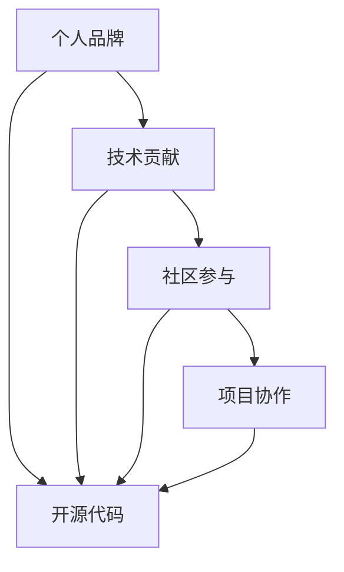

                 

# 程序员如何打造个人影响力

> 关键词：个人品牌,技术贡献,社区参与,项目协作,开源代码

## 1. 背景介绍

在当今这个数字化时代，程序员已经不再是传统意义上的"幕后英雄"，而是越来越走向前台，成为创新和变革的驱动力。个人品牌和技术影响力不仅能够让个人在职场上更具有竞争力，还能够为社会贡献价值。本文将从多个角度深入探讨程序员如何打造个人影响力，帮助每一位读者实现自己的职业理想。

## 2. 核心概念与联系

### 2.1 核心概念概述

在探讨如何打造个人影响力之前，需要先了解一些核心概念：

- **个人品牌**：指通过网络、社交媒体、博客等渠道，展示个人在专业领域的知识、技能和经验，建立独特的专业形象。

- **技术贡献**：指在开源项目、技术社区、学术研究等平台，提供代码、文档、解决方案等，积极参与技术创新和社区建设。

- **社区参与**：指积极参与技术社区的讨论、贡献代码、解答问题等，与同行交流互动，扩大影响力和认知度。

- **项目协作**：指在开源项目、公司内部或跨公司团队中，与其他程序员共同完成项目，展示协作能力、沟通技巧和管理经验。

- **开源代码**：指将个人或团队开发的代码公开分享，接受社区的审查和改进，推动技术进步和知识共享。

这些概念之间相互联系，共同构成了一个程序员的个人影响力体系。通过在技术贡献、社区参与、项目协作等方面不断努力，可以逐步构建起一个强大而独特的个人品牌，从而在职场和社交网络中获得更多的认可和支持。

### 2.2 核心概念的联系

通过一个简单的Mermaid流程图，可以更直观地展示这些核心概念之间的联系：



这个流程图表明，个人品牌是通过技术贡献、社区参与、项目协作和开源代码等多种方式建立起来的。每个环节都在推动个人品牌的发展，同时个人品牌也能够激励个体在这些方面更加积极地投入。

## 3. 核心算法原理 & 具体操作步骤

### 3.1 算法原理概述

打造个人影响力的算法原理可以概括为以下几个步骤：

1. **确立目标**：明确个人发展的目标，确定想要达到的影响力水平和范围。
2. **建立个人网站或博客**：创建个人品牌展示平台，定期发布技术文章、项目案例等，展示专业知识和实践经验。
3. **参与开源项目**：选择与个人技术方向相关的开源项目，积极贡献代码、修复Bug、参与讨论，提升项目影响力和个人声誉。
4. **加入技术社区**：在Stack Overflow、GitHub、Stack Exchange等技术社区活跃，解答问题、分享见解，建立行业影响力。
5. **发表技术论文**：在技术会议、学术期刊上发表论文，展示专业领域的深度和广度，提升学术影响力。
6. **撰写技术书籍**：结合个人实践和技术积累，撰写技术书籍，进一步巩固个人品牌。
7. **建立网络关系**：通过LinkedIn、Meetup等平台，与同行、业界专家、技术爱好者建立联系，扩大社交网络。
8. **持续学习和自我提升**：不断学习新技术、新方法，提升个人技能，保持在技术领域的前沿地位。

### 3.2 算法步骤详解

为了更好地理解每个步骤的具体操作方法，下面将详细介绍每个步骤的详细步骤。

#### 3.2.1 确立目标

确立目标的第一步是自我评估，了解自己的技术水平、兴趣领域和职业发展方向。通过SWOT分析（优势、劣势、机会、威胁），确定个人发展的方向和重点。例如，一位前端开发者可能希望成为全栈工程师，那么目标就是掌握后端技术，参与大型项目的构建。

#### 3.2.2 建立个人网站或博客

建立一个个人网站或博客，是展示个人技术能力的最佳方式。可以使用WordPress、GitHub Pages等平台，发布博客文章、项目案例、技术总结等。博客内容要有针对性，突出个人专长和独特见解。同时，保持更新频率，保持与读者互动，增加用户粘性。

#### 3.2.3 参与开源项目

选择一个与个人技术方向相关的开源项目，可以在GitHub上找到合适的项目。通过GitHub Issues、Pull Request等机制，积极参与项目讨论，贡献代码，展示技术实力。同时，学会使用项目管理工具如JIRA、Trello等，提升项目管理和协作能力。

#### 3.2.4 加入技术社区

在Stack Overflow、Stack Exchange等技术社区，可以回答问题、分享见解，展示自己的技术水平。同时，积极参与社区活动，如Meetup、Tech Talk等，结识同行，扩大影响力和认知度。

#### 3.2.5 发表技术论文

参加技术会议、提交论文，如ACM、IEEE等顶级会议，或在学术期刊上发表文章。这不仅能提升个人的学术影响力，还能为职业发展带来更多机会。

#### 3.2.6 撰写技术书籍

结合个人实践和技术积累，撰写技术书籍，如《JavaScript高级程序设计》、《深度学习》等。书籍不仅能够巩固个人品牌，还能帮助更多的学习者提升技能。

#### 3.2.7 建立网络关系

通过LinkedIn、Meetup等平台，建立和维护网络关系。关注和互动同行业专家，参与行业会议，增加曝光度和知名度。同时，加入技术爱好者社群，参与技术交流和讨论，扩大影响力。

#### 3.2.8 持续学习和自我提升

利用Coursera、Udacity等在线教育平台，学习最新的技术和方法。参加培训课程、技术讲座，提升个人技能。通过技术博客、开源项目、社区参与等方式，不断输出和展示自己的学习成果。

### 3.3 算法优缺点

#### 3.3.1 优点

- **多渠道展示**：通过个人网站、博客、技术社区等多种渠道，全面展示个人技术能力和成就，提升影响力。
- **持续改进**：不断学习新技术、新方法，保持个人技术的前沿地位，持续提升影响力。
- **扩大人脉**：通过技术社区、行业会议等途径，结识同行、专家，建立广泛的社交网络。
- **专业认证**：通过技术认证、参与学术研究等，提升个人专业性和权威性。

#### 3.3.2 缺点

- **时间投入**：打造个人影响力需要大量的时间和精力，可能影响日常工作和生活。
- **竞争激烈**：技术领域竞争激烈，如何脱颖而出是一个挑战。
- **资源限制**：资源有限，可能难以同时兼顾多个方向。

### 3.4 算法应用领域

个人影响力的打造不仅适用于技术领域，在商业、学术、教育等多个领域都有广泛的应用。技术领域的应用包括但不限于：

- **软件开发**：通过开源项目、技术博客、社区参与等方式，提升个人品牌和影响力。
- **产品管理**：通过技术文章、技术演讲等方式，展示产品和技术特点，提升产品竞争力。
- **数据科学**：通过数据分析、数据可视化等技术，展示数据能力和见解，提升数据影响力。
- **人工智能**：通过AI算法、模型优化等技术，展示AI技术和应用，提升AI影响力。

## 4. 数学模型和公式 & 详细讲解 & 举例说明

### 4.1 数学模型构建

为了更好地理解个人影响力的量化评估，可以构建一个数学模型。假设影响力I由多个因素决定，包括技术贡献T、社区参与C、项目协作P和开源代码O。数学模型可以表示为：

$$ I = f(T, C, P, O) $$

其中，f是一个复杂的多元函数，代表多个因素的组合效应。

### 4.2 公式推导过程

为了简化问题，假设影响力I由四个因素等权重决定：

$$ I = \frac{T + C + P + O}{4} $$

进一步假设每个因素都可以量化，例如技术贡献T可以用代码行数、贡献次数等度量，社区参与C可以用回答问题数量、贡献答案质量等度量。

### 4.3 案例分析与讲解

假设一位前端开发者希望提升影响力，可以量化各个因素的贡献度，如下所示：

- 技术贡献T：在GitHub上贡献了5000行代码，参与了20个开源项目。
- 社区参与C：在Stack Overflow上回答了300个问题，获得了15000分。
- 项目协作P：作为核心成员参与了3个大型项目，负责了多个关键模块的开发。
- 开源代码O：在GitHub上创建了一个开源项目，获得了100个star。

将这些数值代入公式中，得到：

$$ I = \frac{5000 + 300 + 3 + 100}{4} = 1312.5 $$

这个结果表明，这位开发者在四个因素上都有较好的表现，整体影响力为1312.5。通过持续努力，可以进一步提升每个因素的贡献度，从而提升整体影响力。

## 5. 项目实践：代码实例和详细解释说明

### 5.1 开发环境搭建

打造个人影响力的开发环境搭建需要以下步骤：

1. **选择合适的平台**：选择合适的博客平台如WordPress、GitHub Pages等，以及社区平台如Stack Overflow、GitHub等。
2. **配置开发环境**：安装所需的软件工具，如Git、GitHub Desktop、IDE等。
3. **版本控制**：学习使用Git进行版本控制，保持代码和文档的更新和备份。

### 5.2 源代码详细实现

假设我们要在GitHub上建立一个个人技术博客，可以按照以下步骤进行：

1. **创建GitHub仓库**：在GitHub上创建一个仓库，命名为“techblog”。
2. **克隆本地仓库**：在本地通过Git命令克隆仓库：

   ```bash
   git clone https://github.com/username/techblog.git
   ```

3. **初始化博客**：安装WordPress或Jekyll等博客工具，初始化博客模板和内容。
4. **发布文章**：撰写博客文章，通过Git命令提交到GitHub仓库：

   ```bash
   git add .
   git commit -m "Add blog post"
   git push origin main
   ```

5. **持续更新**：定期发布技术文章、项目案例等，保持博客的活跃度和更新频率。

### 5.3 代码解读与分析

通过上述步骤，可以建立一个基本的个人技术博客。代码实现的关键在于选择合适的博客平台和工具，以及学会使用Git进行版本控制。通过持续发布和更新，可以逐步建立起个人品牌。

### 5.4 运行结果展示

展示运行结果的关键在于博客的内容质量和更新频率。通过高质量的技术文章、项目案例等展示个人技术能力，不断更新内容，保持博客的活跃度。

## 6. 实际应用场景

### 6.1 软件开发

在软件开发领域，通过开源项目、技术博客、社区参与等方式，可以提升个人品牌和技术影响力。例如，一位开源项目贡献者可以在GitHub上展示自己的代码贡献，通过博客分享项目进展和心得，在Stack Overflow上回答问题，扩大影响力和认知度。

### 6.2 数据科学

在数据科学领域，通过数据分析、数据可视化等技术，展示数据能力和见解，提升数据影响力。例如，一位数据科学家可以通过博客发布数据分析案例、开源数据集，在Kaggle上参与数据竞赛，提升专业权威性和影响力。

### 6.3 人工智能

在人工智能领域，通过AI算法、模型优化等技术，展示AI技术和应用，提升AI影响力。例如，一位AI研究员可以在arXiv上发布研究论文，在GitHub上开源算法代码，在AI会议和讲座上分享研究成果，提升学术和技术影响力。

### 6.4 未来应用展望

未来，个人影响力将更加深入地融入到职业发展和生活各个方面。通过持续学习和自我提升，建立强大的个人品牌和技术影响力，可以带来更多的机会和成就感。同时，个人影响力的提升也将推动技术进步和社会发展，创造更大的价值。

## 7. 工具和资源推荐

### 7.1 学习资源推荐

为了帮助程序员打造个人影响力，这里推荐一些优质的学习资源：

1. **在线教育平台**：如Coursera、Udacity、edX等，提供丰富的技术课程和专业认证。
2. **开源社区**：如GitHub、Stack Overflow等，提供大量的开源项目和问题解答。
3. **技术博客**：如Medium、CSDN等，提供大量的技术文章和案例分享。
4. **技术会议**：如ACM、IEEE、SIGGRAPH等，提供最新的技术交流和学术研究。
5. **技术书籍**：如《Clean Code》、《Design Patterns》等，提供经典的技术知识和实践经验。

### 7.2 开发工具推荐

为了提升开发效率和影响力，这里推荐一些优秀的开发工具：

1. **Git**：版本控制系统，方便代码管理和协作。
2. **GitHub**：代码托管平台，提供代码版本控制和协作功能。
3. **Jekyll**：博客平台，支持静态网站生成和部署。
4. **WordPress**：博客平台，支持丰富的博客模板和插件。
5. **Trello**：项目管理工具，支持团队协作和任务管理。
6. **Zoom**：视频会议工具，支持远程协作和交流。
7. **LinkedIn**：社交网络平台，支持网络关系建立和维护。

### 7.3 相关论文推荐

为了深入了解个人影响力的相关研究，这里推荐一些相关论文：

1. **“The Interplay Between Personal Branding and Networking for Information Systems Professionals”**：探讨个人品牌和网络建设对职业发展的影响。
2. **“The Impact of Technical Blogging on Software Development and Adoption”**：研究技术博客对软件开发的影响。
3. **“Effective Collaboration in Software Development: A Systematic Literature Review”**：综述软件开发中的协作机制和技术。
4. **“Technical Writing as a Professional Development Strategy”**：探讨技术写作对职业发展的意义。
5. **“Open Source as a Professional Development Tool for Software Developers”**：研究开源项目对技术发展的影响。

## 8. 总结：未来发展趋势与挑战

### 8.1 研究成果总结

本文深入探讨了程序员如何打造个人影响力，从确立目标、建立个人网站、参与开源项目等多个角度，详细介绍了具体的操作步骤和关键步骤。同时，通过数学模型和公式推导，对个人影响力的量化评估进行了探讨。

### 8.2 未来发展趋势

未来，个人影响力将更加深入地融入到职业发展和生活各个方面。通过持续学习和自我提升，建立强大的个人品牌和技术影响力，可以带来更多的机会和成就感。同时，个人影响力的提升也将推动技术进步和社会发展，创造更大的价值。

### 8.3 面临的挑战

尽管个人影响力的打造在技术领域取得了显著成效，但在迈向更加智能化、普适化应用的过程中，仍然面临诸多挑战：

1. **时间投入**：打造个人影响力需要大量的时间和精力，可能影响日常工作和生活。
2. **竞争激烈**：技术领域竞争激烈，如何脱颖而出是一个挑战。
3. **资源限制**：资源有限，可能难以同时兼顾多个方向。

### 8.4 研究展望

面对这些挑战，未来的研究需要在以下几个方面寻求新的突破：

1. **自动化工具**：开发更多的自动化工具，如AI辅助写作、自动化代码生成等，提高效率和影响力。
2. **社区协作**：通过技术社区、开源项目等平台，建立广泛的合作网络，共同提升影响力。
3. **跨领域融合**：结合其他领域的知识和技术，如心理学、市场营销等，提升个人品牌的价值。
4. **持续创新**：不断创新，保持个人技术和知识的领先地位，吸引更多的关注和支持。

总之，个人影响力的打造需要持续的努力和探索。通过不断学习和实践，提升个人品牌和技术影响力，能够为职业发展和社交网络带来更多的机会和价值。

## 9. 附录：常见问题与解答

**Q1：如何平衡工作与个人品牌建设？**

A: 时间管理是关键。可以在工作之余利用业余时间进行个人品牌建设，如在晚上或周末写博客、参与开源项目等。同时，利用工具如Trello进行任务管理，合理安排时间，提高效率。

**Q2：如何获得更多的技术贡献机会？**

A: 积极参与开源项目和社区活动，主动提出问题、解决问题，展示技术实力。通过参与项目评审、代码审查等，提升自己的影响力和认可度。

**Q3：如何扩大社交网络？**

A: 利用LinkedIn、Meetup等平台，主动结识同行、专家，参加行业会议、技术讲座等活动，增加曝光度和认知度。同时，在技术社区积极回答问题、分享见解，建立广泛的网络关系。

**Q4：如何持续学习和自我提升？**

A: 利用在线教育平台如Coursera、Udacity等，学习最新的技术和方法。参加培训课程、技术讲座，不断更新知识和技能。通过博客、开源项目、社区参与等方式，不断输出和展示自己的学习成果。

**Q5：如何提升技术文章的写作能力？**

A: 多读优秀的技术文章，学习其结构和表达方式。多写多练，逐步提升写作技巧。利用Grammarly等工具检查语法错误，提高文章质量。

通过本文的系统梳理，可以看到，打造个人影响力需要多方面的努力和实践。只有不断学习和创新，才能在技术领域建立强大的个人品牌，实现职业和社交的全面发展。总之，每位程序员都有机会成为行业内的技术领袖和影响力人物，关键在于持续努力和积极探索。

---

作者：禅与计算机程序设计艺术 / Zen and the Art of Computer Programming

