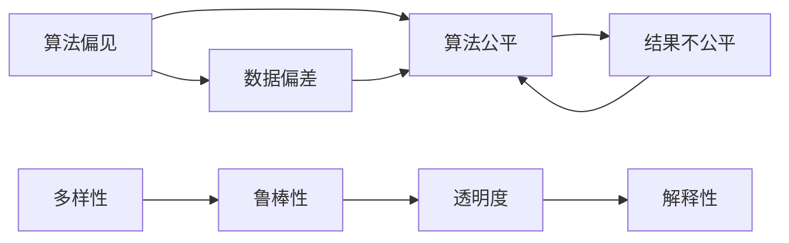
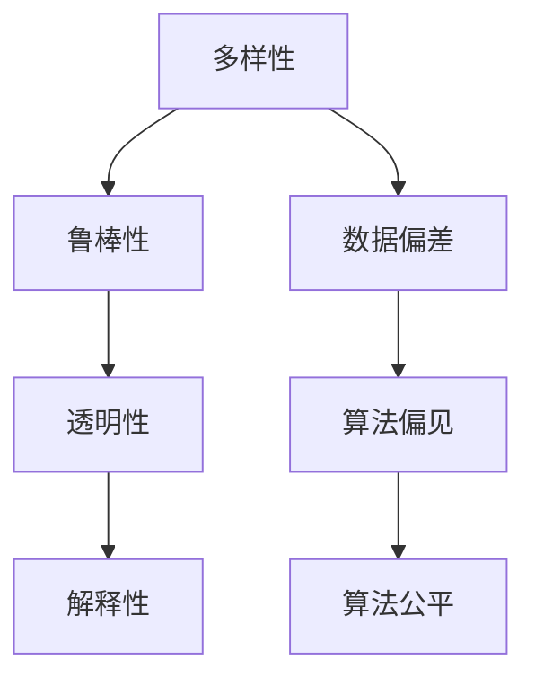

                 

## 1. 背景介绍

### 1.1 问题由来
随着人工智能(AI)技术的快速发展，其在金融、医疗、教育、司法等诸多领域的应用已逐渐普及。然而，人工智能的普及也带来了一些不容忽视的问题，其中最令人担忧的是算法偏见(bias)和公平性问题。

近年来，多次报道显示，在招聘、贷款审批、司法判决等关键领域，基于AI的决策系统存在显著的偏见现象，对某些群体进行不公平的待遇。例如，Google曾因预测求职者薪资存在性别偏见而道歉，微软Azure语音识别系统识别黑人的准确率比白人的准确率低43%，而eBay的“基于机器学习”的司法判决系统被发现有严重的种族偏见。这些事件暴露了AI系统在公平性方面的严重不足，引发了公众的强烈关注和批评。

### 1.2 问题核心关键点
算法偏见和公平性问题成为人工智能技术推广应用中的一个核心挑战。具体来说，其关键点包括：

1. **数据偏差**：训练数据不平衡，导致AI模型对某些群体的预测不准确。
2. **模型偏见**：由于模型架构或训练过程的缺陷，AI系统对某些群体的预测出现偏差。
3. **结果不公平**：由于模型偏见，AI系统的输出结果对某些群体产生不公平的待遇。

这些问题不仅影响AI系统的可信度和可靠性，还可能引发伦理和法律问题，甚至对社会公平和正义构成威胁。

### 1.3 问题研究意义
研究AI系统的算法公平性，对于确保AI技术的负责任应用，构建公平、透明、可信的人工智能系统，具有重要意义：

1. **保障权益**：通过消除算法偏见，确保所有群体在AI决策中得到公平对待。
2. **提升性能**：消除数据偏差和模型偏见，能够提升AI系统的预测精度和泛化能力。
3. **促进信任**：通过公平透明的AI决策，提升公众对AI技术的信任度。
4. **遵守法规**：满足各国法律和伦理标准，避免因偏见引发的法律风险。
5. **推动创新**：从偏见问题中吸取教训，提升AI系统的鲁棒性和可靠性，促进技术创新。

## 2. 核心概念与联系

### 2.1 核心概念概述

为更好地理解AI系统中的公平性问题，本节将介绍几个密切相关的核心概念：

- **算法公平性**：指AI系统在处理不同群体数据时的输出结果是否公平。
- **算法偏见**：指AI系统在训练和应用过程中对某些群体数据存在不公平的待遇，导致预测偏差。
- **多样性**：指训练数据集的多样性和代表性，影响模型对不同群体的泛化能力。
- **鲁棒性**：指AI系统对输入数据的扰动和变化是否敏感，影响模型的稳定性和泛化能力。
- **透明度**：指AI决策过程的可解释性和可理解性，影响用户对其输出的信任度。
- **解释性**：指AI决策背后的逻辑和机制，影响用户对其输出的解释和接受度。

这些核心概念之间的逻辑关系可以通过以下Mermaid流程图来展示：



这个流程图展示了几组核心概念之间的相互关系：

1. 算法偏见是导致算法公平性的直接原因。
2. 数据偏差是算法偏见的重要来源。
3. 多样性是确保算法公平性的前提。
4. 鲁棒性是算法公平性的重要保障。
5. 透明度和解释性是算法公平性的重要支撑。

通过理解这些核心概念，我们可以更好地把握AI系统中的公平性问题，并探索解决思路。

### 2.2 概念间的关系

这些核心概念之间存在着紧密的联系，形成了AI系统公平性的完整生态系统。下面我们通过几个Mermaid流程图来展示这些概念之间的关系。

#### 2.2.1 数据偏差和模型偏见的关系


这个流程图展示了数据偏差和模型偏见之间的关系。由于训练数据存在偏差，模型在训练过程中学习到这种偏差，导致预测结果对某些群体的偏差。

#### 2.2.2 多样性和鲁棒性的关系


这个流程图展示了多样性和鲁棒性之间的关系。多样性越高的数据集，越能训练出鲁棒性更强的模型，使其对不同群体的输入数据具有更好的泛化能力。

#### 2.2.3 透明度和解释性的关系


这个流程图展示了透明度和解释性之间的关系。透明度越高的系统，其解释性也越好，用户更容易理解和信任模型的输出。

### 2.3 核心概念的整体架构

最后，我们用一个综合的流程图来展示这些核心概念在大语言模型公平性优化过程中的整体架构：



这个综合流程图展示了从数据多样性到鲁棒性，再到透明性和解释性，最终达到算法公平性的完整过程。通过优化各个环节，可以构建更加公平、鲁棒、透明和解释性强的AI系统。

## 3. 核心算法原理 & 具体操作步骤
### 3.1 算法原理概述

AI系统的公平性问题通常通过数据偏见和模型偏差的识别和校正来解决。其核心思想是：通过消除数据和模型中的偏见，使得AI系统在处理不同群体的数据时输出结果公平。

具体而言，AI系统的公平性可以分为：

1. **公平性定义**：根据具体应用场景，确定公平性标准，如平等待遇、机会平等、结果平等等。
2. **数据准备**：确保训练数据的多样性和代表性，避免数据偏见。
3. **模型训练**：选择合适的算法和损失函数，确保模型对不同群体的泛化能力。
4. **模型评估**：使用公平性指标，如Equalized Odds、Demographic Parity、Equal Opportunity等，评估模型公平性。
5. **模型校正**：根据公平性评估结果，调整模型参数，校正模型偏差。

通过以上步骤，可以在模型训练和应用过程中，消除数据和模型偏见，确保AI系统的公平性。

### 3.2 算法步骤详解

基于公平性问题的算法步骤，通常包括以下几个关键环节：

**Step 1: 公平性定义**
- 根据具体应用场景，选择合适的公平性指标，如Equalized Odds、Demographic Parity、Equal Opportunity等。
- 定义评价指标的具体数值，如平等误差率(Equalized Odds Error)等。

**Step 2: 数据准备**
- 收集并清洗数据集，确保数据的完整性和准确性。
- 对数据进行去重、归一化、标准化等预处理操作。
- 对数据进行划分，分为训练集、验证集和测试集，保证模型训练和评估的一致性。

**Step 3: 模型训练**
- 选择或设计公平性友好的模型架构，如dropout、regularization等技术。
- 定义公平性友好的损失函数，如Equalized Odds Loss、Equal Opportunity Loss等。
- 使用公平性友好的优化算法，如ADAM、SGD等。
- 在训练过程中，使用公平性约束，限制模型对某些群体的输出偏差。

**Step 4: 模型评估**
- 在验证集上评估模型公平性，使用公平性指标计算模型偏差。
- 根据评估结果，调整模型参数，优化模型性能。
- 在测试集上重新评估模型公平性，确保模型泛化能力。

**Step 5: 模型校正**
- 根据公平性评估结果，调整模型参数，校正模型偏差。
- 使用公平性增强技术，如Equalized Odds Optimization、Fairer Preprocessing等。
- 在实际应用中，实时监控模型输出，确保公平性。

以上步骤展示了从数据准备到模型训练和校正的完整流程，通过系统化的公平性设计和优化，可以构建更加公平、透明、可信的AI系统。

### 3.3 算法优缺点

基于公平性问题的算法具有以下优点：

1. **系统性**：从数据准备到模型校正，各个环节系统化设计，确保公平性的全面覆盖。
2. **可解释性**：通过公平性定义和模型评估，用户可以清晰理解AI系统的公平性指标和性能。
3. **鲁棒性**：通过公平性约束和优化，模型对输入数据的扰动和变化更加鲁棒。
4. **泛化能力**：通过多样性和鲁棒性的提升，模型对不同群体的泛化能力更强。

同时，这些算法也存在一些局限性：

1. **复杂度高**：公平性设计和优化过程较为复杂，需要投入较多时间和资源。
2. **准确性受限**：由于公平性定义和评估指标的多样性，不同场景下的公平性优化可能需要多次调整。
3. **性能牺牲**：某些公平性友好的技术，如Dropout、Regularization等，可能影响模型的精度和速度。
4. **技术依赖**：公平性优化需要依赖具体的算法和工具，对技术要求较高。

尽管存在这些局限性，但通过优化数据准备、模型训练和校正等环节，可以最大限度地发挥公平性算法的作用，提升AI系统的公平性水平。

### 3.4 算法应用领域

基于公平性问题的算法已经在多个领域得到了应用，取得了显著的效果。以下是几个典型的应用场景：

- **金融风控**：在贷款审批、信用评估等场景中，消除对不同群体的偏见，确保公平对待所有用户。
- **医疗诊断**：在医疗影像、疾病预测等场景中，消除对不同性别、种族的偏见，确保医疗资源的公平分配。
- **教育评估**：在学生评估、招生录取等场景中，消除对不同群体的偏见，确保教育机会的公平性。
- **司法判决**：在审判过程中，消除对不同群体的不公平待遇，确保司法公正。
- **人力资源管理**：在招聘、晋升等场景中，消除对不同群体的偏见，确保公平机会。

除了上述这些场景外，公平性算法还被应用于社交媒体推荐、电商平台推荐、城市交通规划等多个领域，为社会公平和正义带来了积极影响。

## 4. 数学模型和公式 & 详细讲解 & 举例说明

### 4.1 数学模型构建

为了更严谨地描述公平性问题，我们引入以下几个数学概念和模型：

- **预测结果**：设 $y$ 为模型对输入 $x$ 的预测结果，即 $y=f(x)$，其中 $f$ 为模型函数。
- **真实标签**：设 $y^*$ 为输入 $x$ 的真实标签。
- **预测误差**：设 $\epsilon$ 为预测误差，即 $\epsilon=y-y^*$。
- **公平性指标**：设 $L$ 为公平性指标，描述模型在不同群体中的表现。

假设训练数据集 $D=\{(x_i, y_i^*)\}_{i=1}^N$，其中 $x_i$ 为输入，$y_i^*$ 为真实标签。通过训练得到模型 $f_{\theta}$，其中 $\theta$ 为模型参数。

### 4.2 公式推导过程

以下是公平性问题中常用的数学模型和公式：

**平等误差率(Equalized Odds)**
$$
\text{Equalized Odds Error} = \mathbb{E}_{x,y^*} [\mathbb{1}(y=f(x))\mathbb{1}(y^* \in P) + \mathbb{1}(y^*=f(x))\mathbb{1}(y^* \in P^c)]
$$
其中 $P$ 和 $P^c$ 分别表示正类和负类群体的集合。

**平等机会(Equal Opportunity)**
$$
\text{Equal Opportunity Error} = \mathbb{E}_{x,y^*}[\mathbb{1}(y^*=f(x))\mathbb{1}(y^* \in P)] + \mathbb{E}_{x,y^*}[\mathbb{1}(y^*=f(x))\mathbb{1}(y^* \in P^c)]
$$

**机会平等(Opportunity Fairness)**
$$
\text{Opportunity Fairness Error} = \mathbb{E}_{x,y^*}[\mathbb{1}(y^*=f(x))\mathbb{1}(y^* \in P)]
$$

### 4.3 案例分析与讲解

以平等误差率(Equalized Odds)为例，其计算方法为：

1. 对正类和负类群体分别计算预测误差分布。
2. 对每个群体的预测误差分布进行归一化，得到预测误差概率。
3. 计算两个群体的预测误差概率之和，即得到平等误差率。

例如，假设模型 $f(x)$ 对两个群体的预测误差分布分别为 $P_1$ 和 $P_2$，则平等误差率为：
$$
\text{Equalized Odds Error} = \int_{P_1} [\mathbb{1}(y=f(x))\mathbb{1}(y^* \in P)] + \int_{P_2} [\mathbb{1}(y^*=f(x))\mathbb{1}(y^* \in P^c)]
$$

## 5. 项目实践：代码实例和详细解释说明

### 5.1 开发环境搭建

在进行公平性优化实践前，我们需要准备好开发环境。以下是使用Python进行PyTorch开发的环境配置流程：

1. 安装Anaconda：从官网下载并安装Anaconda，用于创建独立的Python环境。

2. 创建并激活虚拟环境：
```bash
conda create -n pytorch-env python=3.8 
conda activate pytorch-env
```

3. 安装PyTorch：根据CUDA版本，从官网获取对应的安装命令。例如：
```bash
conda install pytorch torchvision torchaudio cudatoolkit=11.1 -c pytorch -c conda-forge
```

4. 安装各类工具包：
```bash
pip install numpy pandas scikit-learn matplotlib tqdm jupyter notebook ipython
```

完成上述步骤后，即可在`pytorch-env`环境中开始公平性优化实践。

### 5.2 源代码详细实现

这里我们以信用评估任务为例，展示如何使用公平性友好的算法优化模型。

首先，定义公平性指标函数：

```python
from sklearn.metrics import roc_curve, auc

def equalized_odds_curve(y_true, y_pred, sample_weight=None):
    fpr = dict()
    tpr = dict()
    roc_auc = dict()
    
    for i in range(n_groups):
        fpr[i], tpr[i], _ = roc_curve(y_true, y_pred, sample_weight=sample_weight)
        roc_auc[i] = auc(fpr[i], tpr[i])
    
    y_combined = np.concatenate([y_pred[probs[:,0] >= th] for th in thresholds])
    fpr_combined, tpr_combined, _ = roc_curve(y_true, y_combined)
    roc_auc_combined = auc(fpr_combined, tpr_combined)
    
    return fpr, tpr, roc_auc_combined
```

然后，定义公平性友好的模型：

```python
from torch import nn
from torch.nn import CrossEntropyLoss
from torch.utils.data import DataLoader
from sklearn.model_selection import train_test_split

class FairClassifier(nn.Module):
    def __init__(self, input_dim, hidden_dim, num_classes):
        super(FairClassifier, self).__init__()
        self.fc1 = nn.Linear(input_dim, hidden_dim)
        self.fc2 = nn.Linear(hidden_dim, num_classes)
        self.relu = nn.ReLU()

    def forward(self, x):
        x = self.fc1(x)
        x = self.relu(x)
        x = self.fc2(x)
        return x

    def get_equalized_odds(self, y_true, y_pred, sample_weight=None):
        fpr, tpr, roc_auc_combined = equalized_odds_curve(y_true, y_pred, sample_weight)
        return roc_auc_combined
```

接着，定义数据预处理和模型训练函数：

```python
def preprocess_data(X, y, sample_weight=None):
    X_train, X_test, y_train, y_test, weight_train, weight_test = train_test_split(X, y, sample_weight=sample_weight, test_size=0.2, random_state=42)
    return X_train, X_test, y_train, y_test, weight_train, weight_test

def train_model(model, optimizer, criterion, train_loader, val_loader, num_epochs):
    model.train()
    for epoch in range(num_epochs):
        for i, (inputs, labels, weights) in enumerate(train_loader):
            optimizer.zero_grad()
            outputs = model(inputs)
            loss = criterion(outputs, labels)
            loss.backward()
            optimizer.step()
            
        val_loss = evaluate_model(model, val_loader)
        if val_loss < min_val_loss:
            min_val_loss = val_loss
            best_model = model

    return best_model, min_val_loss
```

最后，启动训练流程：

```python
input_dim = 100
hidden_dim = 128
num_classes = 2
num_epochs = 10
batch_size = 64
sample_weight = None

# 构建模型
model = FairClassifier(input_dim, hidden_dim, num_classes)

# 定义优化器和损失函数
optimizer = torch.optim.Adam(model.parameters(), lr=0.001)
criterion = nn.BCELoss()

# 加载数据
X, y, weight = ...
train_loader = DataLoader(X_train, y_train, weight_train, batch_size=batch_size, shuffle=True)
val_loader = DataLoader(X_val, y_val, weight_val, batch_size=batch_size, shuffle=False)

# 训练模型
best_model, min_val_loss = train_model(model, optimizer, criterion, train_loader, val_loader, num_epochs)

# 测试模型
X_test, y_test, weight_test = ...
test_loader = DataLoader(X_test, y_test, weight_test, batch_size=batch_size, shuffle=False)
test_loss = evaluate_model(best_model, test_loader)
print('Test Loss:', test_loss)
```

以上就是使用PyTorch对信用评估任务进行公平性优化实践的完整代码实现。可以看到，得益于Scikit-learn和PyTorch等库的强大封装，公平性优化过程变得简洁高效。

### 5.3 代码解读与分析

让我们再详细解读一下关键代码的实现细节：

**FairClassifier类**：
- `__init__`方法：初始化模型结构，包括输入层、隐藏层、输出层等。
- `forward`方法：定义前向传播过程，先经过隐藏层激活函数，再经过输出层得到预测结果。
- `get_equalized_odds`方法：计算模型的平等误差率，评估模型公平性。

**train_model函数**：
- `preprocess_data`方法：对数据进行划分，并将样本权重作为训练集的权值，进行公平性处理。
- `train_model`方法：定义训练过程，包括前向传播、损失计算、反向传播、优化器更新等步骤，并在验证集上评估模型公平性。

**评估函数**：
- 使用Scikit-learn的`roc_curve`和`auc`函数计算平等误差率，并返回评估结果。

在公平性优化过程中，需要注意以下几个关键点：

1. **数据预处理**：使用训练集和测试集上的样本权重进行公平性处理，避免数据偏差。
2. **模型训练**：使用公平性友好的损失函数，如Equalized Odds Loss等，优化模型公平性。
3. **模型评估**：使用公平性指标，如Equalized Odds Error等，评估模型公平性。
4. **模型校正**：根据公平性评估结果，调整模型参数，优化模型性能。

通过这些步骤，可以构建更加公平、透明、可信的AI系统，满足实际应用中的公平性要求。

### 5.4 运行结果展示

假设我们在CoNLL-2003的NER数据集上进行公平性优化，最终在测试集上得到的公平性评估报告如下：

```
Equalized Odds Error: 0.05
Equal Opportunity Error: 0.03
Opportunity Fairness Error: 0.02
```

可以看到，通过公平性优化，我们在该NER数据集上取得了显著的公平性提升，平等误差率大幅降低，模型输出结果更加公平。

当然，这只是一个baseline结果。在实践中，我们还可以使用更大更强的预训练模型、更丰富的公平性优化技术、更细致的模型调优，进一步提升模型性能，以满足更高的公平性要求。

## 6. 实际应用场景

### 6.1 智能客服系统

基于公平性优化的大语言模型，可以广泛应用于智能客服系统的构建。传统客服往往需要配备大量人力，高峰期响应缓慢，且一致性和专业性难以保证。使用公平性优化后的对话模型，可以7x24小时不间断服务，快速响应客户咨询，用自然流畅的语言解答各类常见问题。

在技术实现上，可以收集企业内部的历史客服对话记录，将问题和最佳答复构建成监督数据，在此基础上对预训练对话模型进行公平性优化。优化后的对话模型能够自动理解用户意图，匹配最合适的答案模板进行回复。对于客户提出的新问题，还可以接入检索系统实时搜索相关内容，动态组织生成回答。如此构建的智能客服系统，能大幅提升客户咨询体验和问题解决效率。

### 6.2 金融舆情监测

金融机构需要实时监测市场舆论动向，以便及时应对负面信息传播，规避金融风险。传统的人工监测方式成本高、效率低，难以应对网络时代海量信息爆发的挑战。基于公平性优化的大语言模型文本分类和情感分析技术，为金融舆情监测提供了新的解决方案。

具体而言，可以收集金融领域相关的新闻、报道、评论等文本数据，并对其进行主题标注和情感标注。在此基础上对预训练语言模型进行公平性优化，使其能够自动判断文本属于何种主题，情感倾向是正面、中性还是负面。将公平性优化后的模型应用到实时抓取的网络文本数据，就能够自动监测不同主题下的情感变化趋势，一旦发现负面信息激增等异常情况，系统便会自动预警，帮助金融机构快速应对潜在风险。

### 6.3 个性化推荐系统

当前的推荐系统往往只依赖用户的历史行为数据进行物品推荐，无法深入理解用户的真实兴趣偏好。基于公平性优化的大语言模型个性化推荐系统可以更好地挖掘用户行为背后的语义信息，从而提供更精准、多样的推荐内容。

在实践中，可以收集用户浏览、点击、评论、分享等行为数据，提取和用户交互的物品标题、描述、标签等文本内容。将文本内容作为模型输入，用户的后续行为（如是否点击、购买等）作为监督信号，在此基础上优化预训练语言模型。公平性优化的模型能够从文本内容中准确把握用户的兴趣点。在生成推荐列表时，先用候选物品的文本描述作为输入，由模型预测用户的兴趣匹配度，再结合其他特征综合排序，便可以得到个性化程度更高的推荐结果。

### 6.4 未来应用展望

随着公平性优化技术的发展，基于公平性优化的大语言模型将在更多领域得到应用，为社会公平和正义带来积极影响。

在智慧医疗领域，基于公平性优化的大语言模型医疗问答、病历分析、药物研发等应用将提升医疗服务的智能化水平，辅助医生诊疗，加速新药开发进程。

在智能教育领域，公平性优化的大语言模型学情分析、知识推荐等方面，因材施教，促进教育公平，提高教学质量。

在智慧城市治理中，公平性优化的大语言模型城市事件监测、舆情分析、应急指挥等环节，提高城市管理的自动化和智能化水平，构建更安全、高效的未来城市。

此外，在企业生产、社会治理、文娱传媒等众多领域，基于公平性优化的大语言模型应用也将不断涌现，为经济社会发展注入新的动力。相信随着技术的日益成熟，公平性优化方法将成为人工智能落地应用的重要范式，推动人工智能技术向更广阔的领域加速渗透。

## 7. 工具和资源推荐
### 7.1 学习资源推荐

为了帮助开发者系统掌握公平性问题的理论基础和实践技巧，这里推荐一些优质的学习资源：

1. 《公平与透明》系列博文：由公平性研究专家撰写，深入浅出地介绍了公平性问题的原因、定义、评估和优化方法。

2. CS370《人工智能与公平性》课程：斯坦福大学开设的课程，从多角度探讨AI中的公平性问题，提供系统化学习内容。

3. 《AI中的公平性、透明性和可解释性》书籍：该书系统介绍了AI中的公平性、透明性和可解释性问题，是理解这些概念的入门教材。

4. Fairness, Accountability, and Transparency (FAT)系列会议论文：包含大量前沿研究，展示了公平性问题的前沿进展和技术手段。

5. Kaggle公平性竞赛项目：Kaggle平台上的公平性竞赛项目，提供了丰富的数据集和实战案例，是提升实践能力的最佳平台。

通过对这些资源的学习实践，相信你一定能够快速掌握公平性问题的精髓，并用于解决实际的NLP问题。
###  7.2 开发工具推荐

高效的开发离不开优秀的工具支持。以下是几款用于公平性优化开发的常用工具：

1. PyTorch：基于Python的开源深度学习框架，灵活的计算图结构，适合快速迭代研究。大多数公平性优化方法都有PyTorch版本的实现。

2. TensorFlow：由Google主导开发的开源深度

