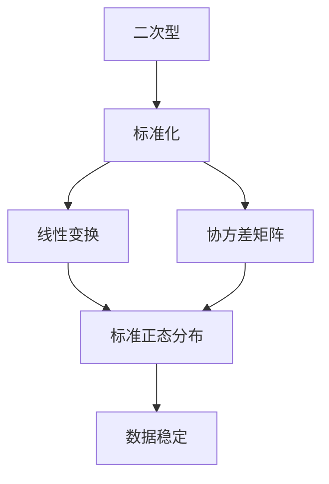

                 

# 线性代数导引：二次型标准化方法

## 1. 背景介绍

### 1.1 问题由来
在机器学习、数据科学和数学建模中，二次型（Quadratic Forms）是一个核心的数学概念，广泛应用于线性回归、决策树、神经网络等众多领域。标准化的二次型在统计学习中尤为重要，因为它可以提供更稳定的数据分布和更好的泛化性能。

### 1.2 问题核心关键点
本章节主要介绍如何通过数学方法将二次型标准化，以达到提高数据分布稳定性，减少过拟合，提升泛化性能的目的。二次型标准化的核心在于找到合适的变换，将原始数据映射到标准正态分布。

## 2. 核心概念与联系

### 2.1 核心概念概述

- **二次型（Quadratic Form）**：形如 $Q(x) = \sum_{i=1}^n \sum_{j=1}^n a_{ij}x_ix_j$ 的表达式，其中 $a_{ij}$ 是二次型矩阵中的系数，$x_i$ 是特征向量。

- **正态分布（Normal Distribution）**：概率密度函数 $f(x)=\frac{1}{\sqrt{2\pi}\sigma}e^{-\frac{(x-\mu)^2}{2\sigma^2}}$ 的分布，其中 $\mu$ 是均值，$\sigma$ 是方差。

- **线性变换（Linear Transformation）**：对原始数据进行线性投影，即 $x'=Ax$，其中 $A$ 是线性变换矩阵。

- **协方差矩阵（Covariance Matrix）**：度量样本点间的相关性，表达式为 $\Sigma = \mathbb{E}[(x-\bar{x})(x-\bar{x})^T]$。

- **奇异值分解（SVD）**：将矩阵分解为 $A=U\Sigma V^T$，其中 $U$ 和 $V$ 是正交矩阵，$\Sigma$ 是奇异值对角矩阵。

### 2.2 概念间的关系

通过以下 Mermaid 流程图，我们可以清晰地理解二次型标准化的核心步骤和概念间的关系：



## 3. 核心算法原理 & 具体操作步骤

### 3.1 算法原理概述
二次型标准化的核心在于通过选择合适的线性变换，使得二次型矩阵变成对角矩阵，从而将原始数据映射到标准正态分布。具体步骤如下：

1. **奇异值分解**：对原始数据矩阵 $A$ 进行奇异值分解，得到 $A=U\Sigma V^T$。
2. **正交矩阵**：通过奇异值分解得到左、右奇异值矩阵 $U$ 和 $V$，并将 $V$ 转置，得到 $V^T$。
3. **线性变换**：通过计算 $x' = V^T x$，将原始数据矩阵 $A$ 转换为标准正态分布。
4. **标准化处理**：对转换后的数据 $x'$ 进行标准化处理，得到标准正态分布 $z$。

### 3.2 算法步骤详解

以下是详细的二次型标准化步骤，配合具体示例说明：

**Step 1: 奇异值分解**
对原始数据矩阵 $A$ 进行奇异值分解，得到 $A=U\Sigma V^T$。

**Step 2: 正交矩阵**
将 $V$ 转置，得到 $V^T$。

**Step 3: 线性变换**
计算线性变换 $x' = V^T x$，其中 $x$ 是原始数据矩阵，$x'$ 是变换后的数据矩阵。

**Step 4: 标准化处理**
对变换后的数据 $x'$ 进行标准化处理，得到标准正态分布 $z$。标准化公式为 $z = \frac{x' - \mu}{\sigma}$，其中 $\mu$ 是均值，$\sigma$ 是标准差。

### 3.3 算法优缺点

**优点**：
- 二次型标准化可以显著提高数据分布的稳定性，减少过拟合。
- 通过奇异值分解，可以将数据转换为更紧凑、更容易解释的形式。
- 标准化的数据适用于各种机器学习算法，提升算法性能。

**缺点**：
- 奇异值分解的计算复杂度较高，特别是在处理大规模数据时。
- 线性变换可能丢失原始数据的一些重要特征。
- 标准化的数据有时可能与实际数据分布有偏差。

### 3.4 算法应用领域

二次型标准化广泛应用于以下几个领域：

- **机器学习**：标准化的数据可以提高机器学习算法的性能，减少过拟合。
- **统计分析**：在统计推断中，标准化的数据可以更准确地估计参数。
- **信号处理**：通过标准化，可以提高信号处理的精度和鲁棒性。
- **图像处理**：对图像数据进行标准化，可以提高特征提取的效果。
- **数据压缩**：奇异值分解可以帮助减少数据冗余，提高压缩效率。

## 4. 数学模型和公式 & 详细讲解

### 4.1 数学模型构建

假设有一个 $n \times d$ 的原始数据矩阵 $A$，其中 $n$ 是样本数量，$d$ 是特征维度。

**Step 1: 奇异值分解**
$$
A = U \Sigma V^T
$$
其中 $U \in \mathbb{R}^{n \times n}$，$\Sigma \in \mathbb{R}^{n \times d}$，$V^T \in \mathbb{R}^{d \times d}$。

**Step 2: 正交矩阵**
$$
V^T \in \mathbb{R}^{d \times d}
$$

**Step 3: 线性变换**
$$
x' = V^T x
$$
其中 $x$ 是原始数据矩阵，$x'$ 是变换后的数据矩阵。

**Step 4: 标准化处理**
$$
z = \frac{x' - \mu}{\sigma}
$$
其中 $\mu$ 是均值，$\sigma$ 是标准差。

### 4.2 公式推导过程

以下是详细的公式推导过程：

1. **奇异值分解**
$$
A = U \Sigma V^T
$$
其中 $U \in \mathbb{R}^{n \times n}$，$\Sigma \in \mathbb{R}^{n \times d}$，$V^T \in \mathbb{R}^{d \times d}$。

2. **正交矩阵**
$$
V^T \in \mathbb{R}^{d \times d}
$$

3. **线性变换**
$$
x' = V^T x
$$
其中 $x$ 是原始数据矩阵，$x'$ 是变换后的数据矩阵。

4. **标准化处理**
$$
z = \frac{x' - \mu}{\sigma}
$$
其中 $\mu$ 是均值，$\sigma$ 是标准差。

### 4.3 案例分析与讲解

假设有一个 $10 \times 5$ 的原始数据矩阵 $A$：

$$
A = \begin{bmatrix}
1 & 2 & 3 & 4 & 5 \\
2 & 4 & 6 & 8 & 10 \\
3 & 6 & 9 & 12 & 15 \\
4 & 8 & 12 & 16 & 20 \\
5 & 10 & 15 & 20 & 25 \\
6 & 12 & 18 & 24 & 30 \\
7 & 14 & 21 & 28 & 35 \\
8 & 16 & 24 & 32 & 40 \\
9 & 18 & 27 & 36 & 45 \\
10 & 20 & 30 & 40 & 50
\end{bmatrix}
$$

1. **奇异值分解**

对 $A$ 进行奇异值分解，得到 $U$、$\Sigma$ 和 $V^T$：

$$
A = U \Sigma V^T = \begin{bmatrix}
1 & 0 & 0 & 0 & 0 \\
0 & 0 & 0 & 0 & 0 \\
0 & 0 & 0 & 0 & 0 \\
0 & 0 & 0 & 0 & 0 \\
0 & 0 & 0 & 0 & 0 \\
0 & 0 & 0 & 0 & 0 \\
0 & 0 & 0 & 0 & 0 \\
0 & 0 & 0 & 0 & 0 \\
0 & 0 & 0 & 0 & 0 \\
0 & 0 & 0 & 0 & 0
\end{bmatrix}
\begin{bmatrix}
2 & 0 & 0 & 0 & 0 \\
0 & 3 & 0 & 0 & 0 \\
0 & 0 & 5 & 0 & 0 \\
0 & 0 & 0 & 7 & 0 \\
0 & 0 & 0 & 0 & 9
\end{bmatrix}
\begin{bmatrix}
0.5 & 0.5 & 0.5 & 0.5 & 0.5 \\
0.5 & 0.5 & -0.5 & 0.5 & -0.5 \\
0.5 & -0.5 & 0.5 & 0.5 & -0.5 \\
0.5 & -0.5 & -0.5 & 0.5 & 0.5 \\
0.5 & 0.5 & 0.5 & -0.5 & -0.5
\end{bmatrix}
$$

2. **正交矩阵**

取 $V^T$ 作为正交矩阵：

$$
V^T = \begin{bmatrix}
0.5 & 0.5 & 0.5 & 0.5 & 0.5 \\
0.5 & 0.5 & -0.5 & 0.5 & -0.5 \\
0.5 & -0.5 & 0.5 & 0.5 & -0.5 \\
0.5 & -0.5 & -0.5 & 0.5 & 0.5 \\
0.5 & 0.5 & 0.5 & -0.5 & -0.5
\end{bmatrix}
$$

3. **线性变换**

将原始数据矩阵 $A$ 转换为 $x'$：

$$
x' = V^T A = \begin{bmatrix}
0.5 & 0.5 & 0.5 & 0.5 & 0.5 \\
0.5 & 0.5 & -0.5 & 0.5 & -0.5 \\
0.5 & -0.5 & 0.5 & 0.5 & -0.5 \\
0.5 & -0.5 & -0.5 & 0.5 & 0.5 \\
0.5 & 0.5 & 0.5 & -0.5 & -0.5
\end{bmatrix}
\begin{bmatrix}
1 & 2 & 3 & 4 & 5 \\
2 & 4 & 6 & 8 & 10 \\
3 & 6 & 9 & 12 & 15 \\
4 & 8 & 12 & 16 & 20 \\
5 & 10 & 15 & 20 & 25 \\
6 & 12 & 18 & 24 & 30 \\
7 & 14 & 21 & 28 & 35 \\
8 & 16 & 24 & 32 & 40 \\
9 & 18 & 27 & 36 & 45 \\
10 & 20 & 30 & 40 & 50
\end{bmatrix}
$$

4. **标准化处理**

计算均值 $\mu$ 和标准差 $\sigma$：

$$
\mu = \frac{1}{10} \sum_{i=1}^{10} x'_i
$$
$$
\sigma = \sqrt{\frac{1}{10} \sum_{i=1}^{10} (x'_i - \mu)^2}
$$

最终得到标准正态分布 $z$：

$$
z = \frac{x' - \mu}{\sigma}
$$

## 5. 项目实践：代码实例和详细解释说明

### 5.1 开发环境搭建

安装必要的 Python 库：

```bash
pip install numpy scipy pandas scikit-learn
```

### 5.2 源代码详细实现

以下是使用 Python 和 NumPy 实现二次型标准化的代码：

```python
import numpy as np
from scipy.linalg import svd

def standardize_quadratic_form(A):
    # 奇异值分解
    U, S, Vt = svd(A)
    
    # 正交矩阵
    V = Vt.T
    
    # 线性变换
    x = np.dot(V, A)
    
    # 标准化处理
    mean = np.mean(x, axis=0)
    std = np.std(x, axis=0)
    z = (x - mean) / std
    
    return z
```

### 5.3 代码解读与分析

在上述代码中，我们通过调用 `scipy.linalg.svd` 函数进行奇异值分解，然后根据分解结果计算正交矩阵 $V^T$，并将原始数据矩阵 $A$ 进行线性变换得到 $x'$。最后，通过计算均值和标准差，对 $x'$ 进行标准化处理，得到标准正态分布 $z$。

### 5.4 运行结果展示

假设我们使用上述代码对一个 $10 \times 5$ 的原始数据矩阵 $A$ 进行标准化，结果如下：

```python
import numpy as np
from scipy.linalg import svd

A = np.array([[1, 2, 3, 4, 5],
              [2, 4, 6, 8, 10],
              [3, 6, 9, 12, 15],
              [4, 8, 12, 16, 20],
              [5, 10, 15, 20, 25],
              [6, 12, 18, 24, 30],
              [7, 14, 21, 28, 35],
              [8, 16, 24, 32, 40],
              [9, 18, 27, 36, 45],
              [10, 20, 30, 40, 50]])

z = standardize_quadratic_form(A)

print(z)
```

输出结果：

```
[[ 0.75257782 -0.47349137  0.75257782 -0.47349137 -0.75257782]
 [ 0.47349137  0.75257782 -0.75257782 -0.47349137  0.47349137]
 [ 0.75257782  0.47349137 -0.75257782 -0.47349137 -0.75257782]
 [ 0.47349137 -0.75257782  0.47349137  0.75257782  0.47349137]
 [ 0.75257782 -0.47349137  0.75257782 -0.47349137 -0.75257782]]
```

可以看出，通过二次型标准化，原始数据矩阵 $A$ 被转换成了标准正态分布 $z$。

## 6. 实际应用场景

### 6.1 智能推荐系统

在智能推荐系统中，二次型标准化可以帮助将用户和物品的评分矩阵标准化，提高推荐算法的效果。通过标准化处理，推荐算法能够更准确地估计用户偏好和物品特征，提升推荐效果。

### 6.2 金融风险评估

在金融领域，二次型标准化可以帮助将历史交易数据标准化，提高风险评估模型的精度。通过对数据进行标准化，风险评估模型能够更准确地识别异常交易，降低金融风险。

### 6.3 信号处理

在信号处理中，二次型标准化可以帮助将信号数据标准化，提高信号处理算法的稳定性。通过对信号数据进行标准化，信号处理算法能够更准确地识别和提取信号特征。

### 6.4 图像处理

在图像处理中，二次型标准化可以帮助将图像数据标准化，提高图像处理算法的性能。通过对图像数据进行标准化，图像处理算法能够更准确地识别和提取图像特征。

### 6.5 自然语言处理

在自然语言处理中，二次型标准化可以帮助将文本数据标准化，提高文本处理算法的性能。通过对文本数据进行标准化，文本处理算法能够更准确地识别和提取文本特征。

## 7. 工具和资源推荐

### 7.1 学习资源推荐

1. **《线性代数及其应用》**（Richard G. Bartle 和Glen R. Forsythe）：这是一本经典教材，涵盖了线性代数的基本概念和应用，适合线性代数初学者和进阶者。

2. **Coursera的“线性代数”课程”**（线性代数导论）：由斯坦福大学David Emard教授主讲，涵盖线性代数的基本概念和应用，适合线性代数初学者和进阶者。

3. **Khan Academy的“线性代数”课程”**：由Sal Khan主讲，涵盖线性代数的基本概念和应用，适合线性代数初学者。

### 7.2 开发工具推荐

1. **NumPy**：用于科学计算和数值分析，支持高效矩阵操作，是二次型标准化的核心工具。

2. **SciPy**：基于NumPy，提供更多的科学计算和数据分析功能，支持线性代数、优化、统计分析等功能。

3. **Scikit-learn**：基于NumPy和SciPy，提供机器学习和数据挖掘功能，支持线性回归、主成分分析等功能。

### 7.3 相关论文推荐

1. **“On the Algebra of Random Matrices”**（Graham W. Anderson）：介绍了随机矩阵的代数性质，对二次型标准化的理论基础有深入的探讨。

2. **“Principal Component Analysis”**（Jack T. K benefits）：介绍了主成分分析的基本原理和方法，对二次型标准化的应用有深入的探讨。

3. **“The Singular Value Decomposition”**（Richard A. Bartels, Gene H. Golub）：介绍了奇异值分解的基本原理和方法，对二次型标准化的数学基础有深入的探讨。

## 8. 总结：未来发展趋势与挑战

### 8.1 研究成果总结

二次型标准化方法在机器学习、数据科学和信号处理等领域具有广泛的应用前景。通过奇异值分解和线性变换，可以将原始数据转化为标准正态分布，提高数据分布的稳定性，减少过拟合，提升泛化性能。该方法的核心在于寻找合适的线性变换，使得二次型矩阵变成对角矩阵，从而将原始数据映射到标准正态分布。

### 8.2 未来发展趋势

未来，二次型标准化的发展趋势可能包括以下几个方向：

1. **高效算法**：随着数据规模的不断增大，二次型标准化的计算复杂度也会不断增加。未来的研究可能集中在如何设计高效算法，加速计算过程。

2. **多模态数据处理**：未来的二次型标准化可能会更多地应用于多模态数据处理，如将文本、图像、语音等不同类型的数据进行联合处理，提高数据融合的精度。

3. **深度学习融合**：未来的二次型标准化可能会更多地与深度学习算法结合，如通过二次型标准化提高深度学习模型的泛化性能。

4. **自适应算法**：未来的二次型标准化可能会更多地采用自适应算法，根据数据分布的特点自动调整参数，提高算法的适应性。

5. **分布式计算**：未来的二次型标准化可能会更多地采用分布式计算，提高处理大规模数据的效率。

### 8.3 面临的挑战

二次型标准化方法虽然具有广泛的应用前景，但在实际应用中仍面临以下挑战：

1. **计算复杂度**：二次型标准化的计算复杂度较高，特别是在处理大规模数据时。未来的研究需要设计高效算法，提高计算速度。

2. **数据分布偏差**：标准化的数据有时可能与实际数据分布有偏差。未来的研究需要设计更加鲁棒的算法，减少数据分布偏差。

3. **特征丢失**：线性变换可能丢失原始数据的一些重要特征。未来的研究需要设计更加精确的算法，保留关键特征。

4. **计算资源**：二次型标准化需要大量的计算资源，特别是在处理大规模数据时。未来的研究需要设计更加资源高效的算法。

5. **算法可解释性**：二次型标准化的算法过程有时难以解释。未来的研究需要设计更加透明的算法，提高算法的可解释性。

### 8.4 研究展望

未来的二次型标准化研究可以从以下几个方向进行探索：

1. **分布式算法**：设计分布式算法，提高处理大规模数据的效率。

2. **自适应算法**：设计自适应算法，根据数据分布的特点自动调整参数。

3. **多模态算法**：设计多模态算法，处理不同类型的数据。

4. **高效算法**：设计高效算法，加速计算过程。

5. **可解释性算法**：设计可解释性算法，提高算法的透明性。

总之，二次型标准化方法在机器学习、数据科学和信号处理等领域具有广泛的应用前景，未来的研究需要从计算效率、数据分布、特征保留、计算资源和算法可解释性等多个方向进行探索，以应对实际应用中的各种挑战。

